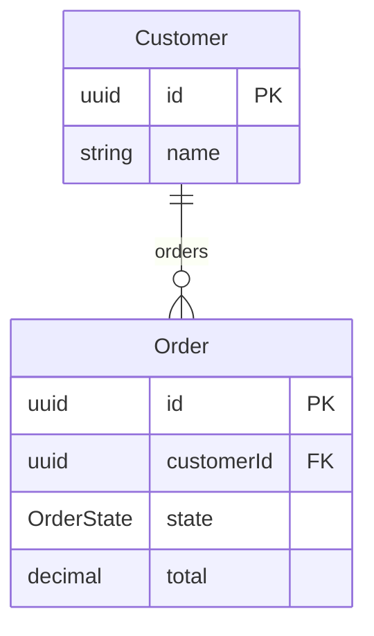

# Shop

Hand-written text stays as it is.

<!-- specarch:generate erDiagram -->

```mermaid
erDiagram
  Customer ||--o{ Order : orders
  Customer {
    uuid id PK
    string name
  }
  Order {
    uuid id PK
    uuid customerId FK
    OrderState state
    decimal total
  }
```
<!-- specarch:end -->

More hand-written text.
