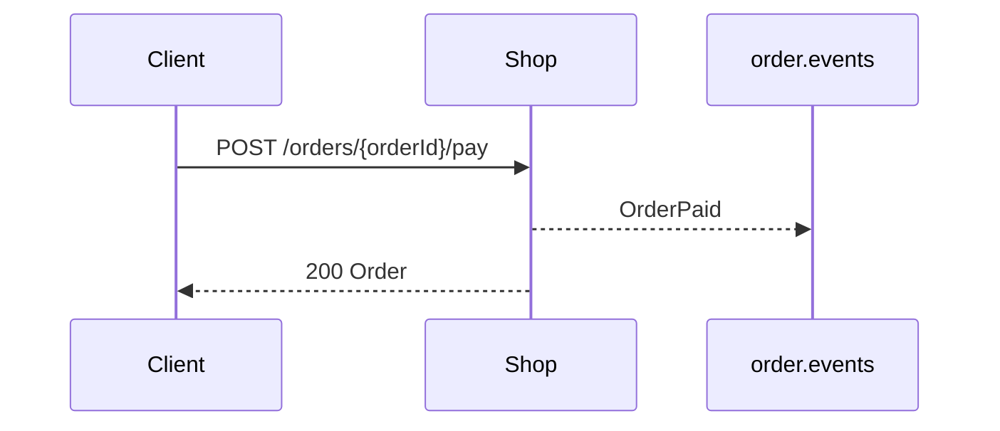

# Shop

Hand-written text stays as it is.

<!-- specarch:generate sequenceDiagram payOrder -->

```mermaid
sequenceDiagram
  participant C as Client
  participant S as Shop
  participant Q1 as order.events
  C->>S: POST /orders/{orderId}/pay
  S-->>Q1: OrderPaid
  S-->>C: 200 Order
```
<!-- specarch:end -->

More hand-written text.
