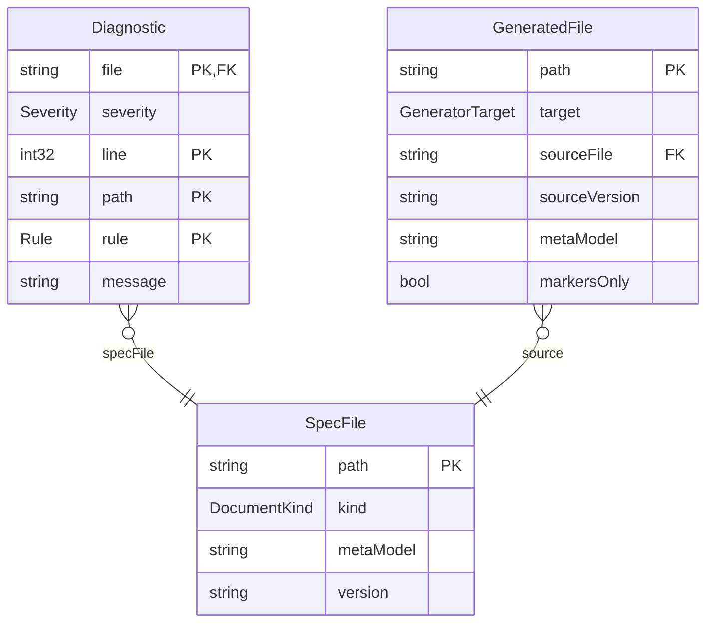
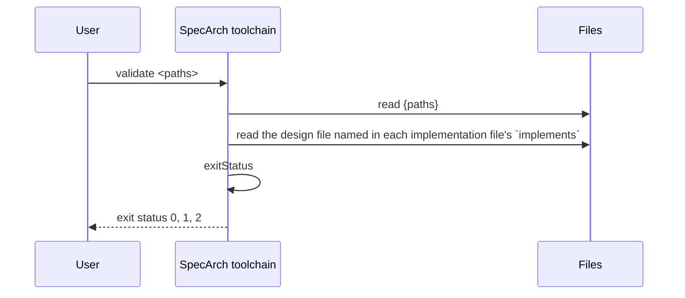
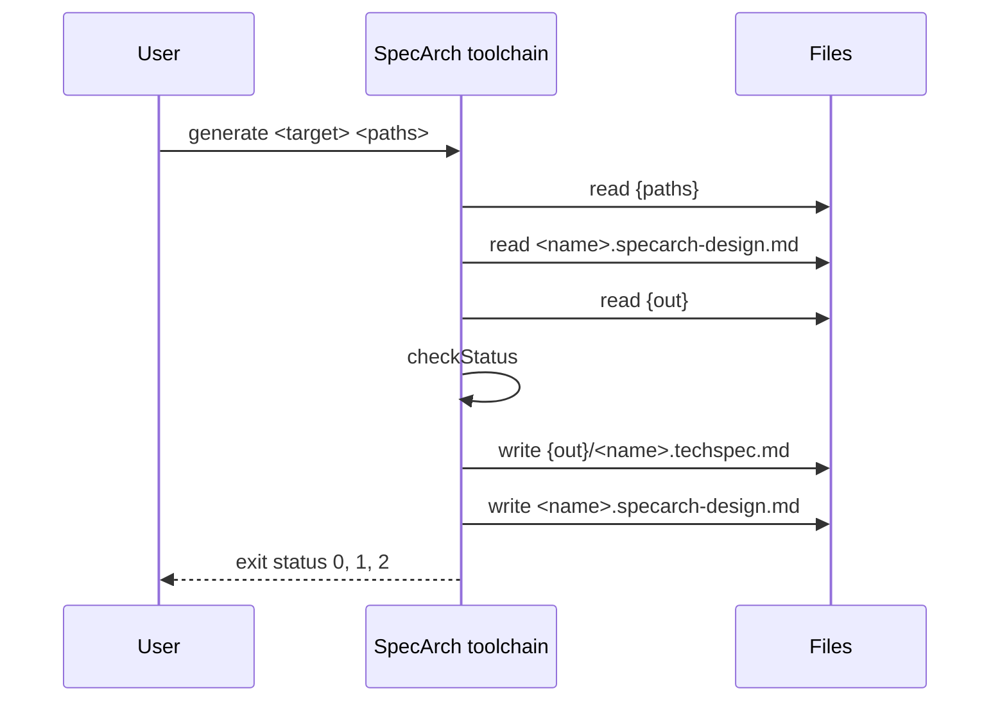
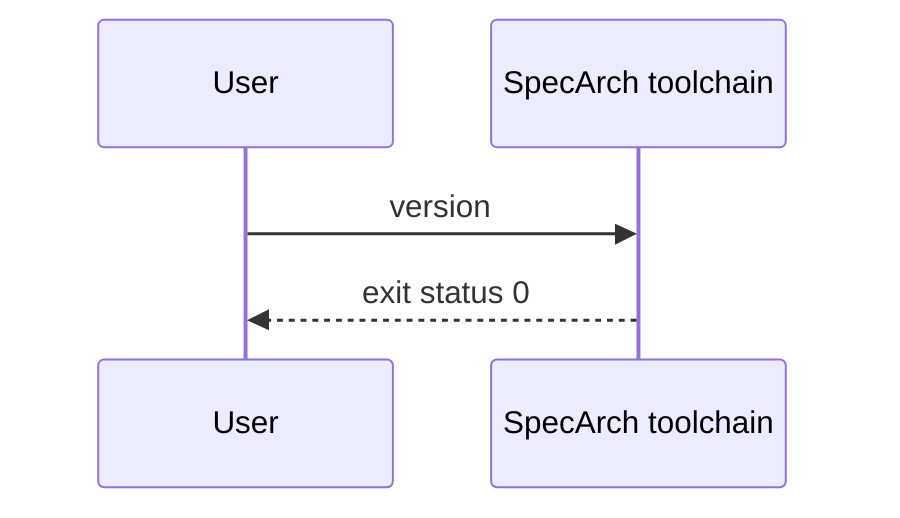

<!-- Generated by specarch generate techspec from ../../spec/specarch.specarch-design.yaml, version 0.1.0, and ../../spec/specarch.go.specarch-implementation.yaml, version 0.1.0, and ../../spec/specarch.swift.specarch-implementation.yaml, version 0.1.0; meta-model 0.1. Do not edit this file: change the YAML and generate again. -->

# SpecArch toolchain: technical specification

Version 0.1.0 of the design: 3 entities, 3 commands, 6 algorithms, 79 tests and 9 decisions. The chapters follow arc42, and a chapter with nothing in the design is left out.

## 1. Introduction and goals

The `specarch` command: it validates SpecArch files and generates
documents and code from them. This file is the design, with no language,
library or build tool in it. How one stack implements it is in
`specarch.go.specarch-implementation.yaml` beside it.

Owners: specarch-maintainers.

## 3. Context

The interfaces the system offers, as its clients see them.

### Commands

| Command | Summary | Permission | Exit statuses |
|---|---|---|---|
| validate | Check SpecArch files | public | 0: every file is valid; 1: at least one file has an error; 2: usage error, a file or folder could not be read, or a folder holds no SpecArch file |
| generate | Generate one target from design files | public | 0: generated, or with `--check` the output is current; 1: an input file has an error, a marker is wrong, or with `--check` the output differs; 2: usage error, a target the program does not offer, no output folder, or a file that could not be read or written |
| version | Print the program version and the meta-model versions it reads | public | 0: printed |

## 5. Building blocks



### SpecFile

One file given to a command, as the command read it.

| Field | Type | Required | Limits | Description |
|---|---|---|---|---|
| path | string | yes |   | The path as given on the command line or found under a given folder. |
| kind | DocumentKind | yes |   |   |
| metaModel | string | yes |   | The meta-model version the file declares: `specarch` for a design file, `specarchImplementation` for an implementation file. |
| version | string | yes |   | The file's own `info.version`. |

Primary key: path.

### Diagnostic

One problem found in one file. Printed as one line:
`file:line: severity: /yaml/path: rule: message`.

| Field | Type | Required | Limits | Description |
|---|---|---|---|---|
| file | string | yes |   | The file's path as given. |
| severity | Severity | yes |   |   |
| line | int32 | yes | at least 1 | Line of the YAML node the problem is at; for an expression, the line inside the expression. |
| path | string | yes |   | JSON pointer to the node, such as `/entities/Loan/relations/member/target`; `/` for the whole file. |
| rule | Rule | yes |   |   |
| message | string | yes | at least 1 character | What is wrong and how to fix it, in one plain sentence. |

Primary key: file, line, path, rule.

| Relation | Kind | Target | Via | On delete |
|---|---|---|---|---|
| specFile | many-to-one | SpecFile | file | restrict |

| Constraint | Rule | Message |
|---|---|---|
| diagnostic_line_positive | check `line >= 1` | Every diagnostic points at a line. |

### GeneratedFile

A file a generator wrote. Its header names where it came from.

| Field | Type | Required | Limits | Description |
|---|---|---|---|---|
| path | string | yes |   | Path inside the generator's own folder. |
| target | GeneratorTarget | yes |   |   |
| sourceFile | string | yes |   | The design file it was generated from. |
| sourceVersion | string | yes |   | That file's `info.version`. |
| metaModel | string | yes |   | The meta-model version of that file. |
| markersOnly | bool | yes |   | True for a hand-written Markdown document, where only the text between `specarch:generate` markers is rewritten. |

Primary key: path.

| Relation | Kind | Target | Via | On delete |
|---|---|---|---|---|
| source | many-to-one | SpecFile | sourceFile | restrict |

### Enums

| Enum | Value | Meaning |
|---|---|---|
| DocumentKind | design | a SpecArch Definition File (SDF), `*.specarch-design.yaml`, the design |
| DocumentKind | implementation | a SpecArch Implementation File (SIF), `*.specarch-implementation.yaml`, one stack's implementation of a design file |
| Rule | file_kind | the file name ends in neither `.specarch-design.yaml` nor `.specarch-implementation.yaml`, or its root key does not match its name |
| Rule | yaml_syntax | the file is not well-formed YAML |
| Rule | unquoted_date | a date written without quotes, which YAML reads as a timestamp |
| Rule | duplicate_key | a mapping repeats a key |
| Rule | schema | the file breaks the meta-model's JSON Schema |
| Rule | stack_key | a design file carries a key that belongs to one implementation |
| Rule | design_key | an implementation file carries a key that belongs to the design |
| Rule | ref_type | a `$ref` names an entity or enum the file does not have |
| Rule | relation_target | a relation's target is not an entity of the file |
| Rule | relation_via | a relation's `via` is not the field or join entity its kind needs |
| Rule | field | a name that must be a field of an entity is not one (required, primaryKey, unique fields, page columns, fields and filters) |
| Rule | state_field | the `stateField` is not a field whose type is an enum |
| Rule | state_value | a transition's `from` or `to` is not a value of the state field's enum |
| Rule | trigger | a transition's trigger is not an operation, command, channel message or algorithm |
| Rule | requirement | a requirement link's prefix is not a requirement source |
| Rule | emits | an `emits` entry names a channel or message that does not exist |
| Rule | operation | a `source`, `submit` or operation action names an operationId that does not exist |
| Rule | page | a navigate action names a page that does not exist |
| Rule | algorithm | an `algorithm` reference names an algorithm that does not exist |
| Rule | decision | a `supersededBy` names a decision that does not exist, or an implementation decision reuses a design decision's ID |
| Rule | enum_value | a `valueDescriptions` key is not a value of its enum |
| Rule | path_parameter | a `{name}` in a path has no path parameter, or a path parameter is not in the path |
| Rule | duplicate_operation | two operations share an operationId |
| Rule | permission_undeclared | an operation, command, page, action or role names a permission that is not declared |
| Rule | permission_ungranted | a declared permission is granted by no role and is not `public` |
| Rule | expression_syntax | a check or formula does not parse |
| Rule | expression_name | an expression names a field, input or function that does not exist |
| Rule | expression_type | an expression combines values of types that do not fit |
| Rule | example_input | a worked example's inputs are missing one, name an unknown one, or have the wrong type |
| Rule | example_expected | a worked example's expected value does not have the output's type |
| Rule | example_mismatch | the formula evaluated on a worked example's inputs does not give the expected value |
| Rule | example_error | the formula cannot be evaluated on a worked example's inputs (division by zero, null in arithmetic) |
| Rule | implements | an implementation file's `implements` does not name a readable design file of the same version |
| Rule | design_ref | a pointer into the design file does not resolve |
| Rule | unsafe_integer | an int64 or uint64 is carried as a JSON number without bounds inside 2^53 |
| Rule | change_log | a description reads as a change log instead of the current truth (a warning) |
| Rule | test_subject | a test is about an operation, command, page, constraint or transition that does not exist |
| Rule | test_case | a test covers a case its subject does not have, or a red case in a golden test |
| Rule | test_golden_missing | a subject has no golden scenario (a warning in 0.1) |
| Rule | test_red_missing | a subject has no red scenario and no derived red case (a warning in 0.1) |
| Rule | test_case_missing | a case derived from the design has no test (a warning in 0.1) |
| Rule | suite | an implementation's test suite names a design test or subject that does not exist |
| Severity | error | the file is invalid |
| Severity | warning | printed, but the file stays valid; in 0.1 only missing test scenarios and change-log phrases |
| GeneratorTarget | techspec | arc42 technical specification in Markdown with generated Mermaid diagrams |
| GeneratorTarget | openapi | OpenAPI 3.1 document |
| GeneratorTarget | sql | forward SQL migrations, new files only |
| GeneratorTarget | ui | page definitions for the target component library |
| GeneratorTarget | tests | one test per worked example |
| GeneratorTarget | manual | user manual and operations guide |
| GeneratorTarget | scripts | guarded operational scripts for data changes |

## 6. Runtime view

### Command validate

Checks every file given, and every `*.specarch-design.yaml` and
`*.specarch-implementation.yaml` under every folder given, against the meta-model
and against the rules JSON Schema cannot express. It reports every
problem in every file, not only the first.

| Argument or option | Type | Required | Description |
|---|---|---|---|
| `<paths>` | string, one or more | yes | Files and folders. A folder is searched recursively. |

Reads `{paths}`: Definition and implementation files; `the design file named in each implementation file's `implements``: Read to resolve the implementation file's references.

Standard output: One line per diagnostic, sorted by file, then line, then path, then rule.

Standard error: A usage message on a usage error, the reason on an unreadable file, and a one-line count at the end.



### Command generate

Validates its input first and generates nothing from an invalid file.
Then writes the target into the folder it owns, and nothing outside it,
except the regions between `specarch:generate` markers in the
hand-written `<name>.specarch-design.md` beside each design file. Every
generated file starts with a header naming the design file, its
`info.version`, the implementation file when one was given, and the
meta-model version. With `--check` nothing is written: the output is
generated in memory and compared with what is on disk.

The techspec target writes `<name>.techspec.md`: an arc42 technical
specification of the design file, with chapters only for what the
design holds. Diagrams are Mermaid: an entity diagram, a state diagram
for each entity with a state field, a sequence diagram for each
operation and command, a flowchart of the pages, and a permissions
table. Chapter 7, deployment and implementation, comes from the
implementation file and is left out without one. A marker names what
goes in its region: `erDiagram`, `stateDiagram <Entity>`,
`sequenceDiagram <operationId or command>`, `flowchart pages` or
`permissions`.

| Argument or option | Type | Required | Description |
|---|---|---|---|
| `<target>` | GeneratorTarget | yes |   |
| `<paths>` | string, one or more | yes | Design files, and for each the implementation file that names it, when the target needs one. A folder is searched as validate searches it. |
| `--out` | string |   | The folder the target owns. Without it, the folder the implementation file's generators name for the target, relative to that file. |
| `--check` | bool |   | Generate in memory and fail when the files on disk differ. Writes nothing. |

Reads `{paths}`: The design and implementation files; `<name>.specarch-design.md`: The hand-written document beside each design file, when there is one; `{out}`: The current output, with `--check`.

Writes `{out}/<name>.techspec.md`: The technical specification of each design file. Nothing is written with `--check`; `<name>.specarch-design.md`: Only the regions between markers. Nothing is written with `--check`.

Standard output: The diagnostics of an invalid input file and the errors of a marker,
one line each. With `--check`, one line per file that differs or is
missing, and per techspec file in the folder that no given design file
produces.

Standard error: A usage message on a usage error, the reason a file cannot be read or written, and a one-line count at the end.



### Command version

Standard output: The program version, then one line per meta-model version it supports.



## 7. Deployment and implementation

The design has 2 implementations; each has its own part below.

### SpecArch toolchain in Go

From the implementation file SpecArch toolchain in Go, version 0.1.0.

The Go implementation of `specarch.specarch-design.yaml`: one static binary,
`specarch`, installed with `go install ./cmd/specarch`.

Stack: language Go 1.26; toolchain go 1.26.0; platforms darwin/arm64, darwin/amd64, linux/amd64, linux/arm64, windows/amd64.

#### Libraries

| Library | Version | Licence | Purpose |
|---|---|---|---|
| github.com/santhosh-tekuri/jsonschema/v6 | v6.0.3 | Apache-2.0 | JSON Schema 2020-12 validation against the schemas in `schema/`; the same library the repository's pinned `jv` check used. |
| golang.org/x/text | v0.42.0 | BSD-3-Clause | Message printing for the schema library. Pinned above 0.39.0, which fixes GO-2026-5970. |
| go.yaml.in/yaml/v3 | v3.0.5 | MIT AND Apache-2.0 | YAML parsing into a node tree, which keeps the line of every value for diagnostics. |
| cel.dev/cel-go | v0.32.0 | Apache-2.0 | The CEL parser; only its parser is used. |
| cel.dev/expr | v0.25.1 | Apache-2.0 | CEL's expression tree types, needed by the parser. |
| github.com/antlr4-go/antlr/v4 | v4.13.1 | BSD-3-Clause | The parser runtime the CEL grammar is generated for. |
| google.golang.org/protobuf | v1.36.10 | BSD-3-Clause | Needed by the CEL parser's tree types. |
| google.golang.org/genproto/googleapis/api | v0.0.0-20240826202546-f6391c0de4c7 | Apache-2.0 | Needed by the CEL parser's tree types. |
| google.golang.org/genproto/googleapis/rpc | v0.0.0-20240826202546-f6391c0de4c7 | Apache-2.0 | Needed by the CEL parser's tree types. |
| golang.org/x/exp | v0.0.0-20240823005443-9b4947da3948 | BSD-3-Clause | Needed by the CEL parser. |

#### Layout

| Path | Holds | Implements |
|---|---|---|
| cmd/specarch | The command line. Argument handling, finding the files under folders, printing the diagnostics and the exit status. | #/commands/validate, #/commands/generate, #/commands/version, #/entities/SpecFile, #/entities/GeneratedFile, #/algorithms/exitStatus, #/algorithms/checkStatus |
| schema | The JSON Schemas, embedded into the binary from the files editors use. |   |
| internal/source | Reads a YAML file into a node tree and a plain value, with the line of every node; finds unquoted dates and duplicate keys. |   |
| internal/expr | The expression subset. Parses with the cel-go parser, refuses what is outside the subset, type-checks with CEL's strict rules, and evaluates with exact integers and decimals. |   |
| internal/generate | The generators. The techspec target writes the arc42 document and its Mermaid diagrams, and rewrites the regions between markers in hand-written Markdown. | #/algorithms/markersWellFormed |
| internal/validate | Schema validation with plain messages, the interface boundary, cross-references, fail-closed access, concrete integers, expressions, worked examples, tests and their derived cases, and implementation references. | #/entities/Diagnostic, #/enums/Rule, #/enums/Severity, #/algorithms/referenceResolves, #/algorithms/permissionGranted, #/algorithms/workedExampleHolds |

#### Mappings

| Design object | Implemented by | Notes |
|---|---|---|
| #/entities/Diagnostic | validate.Diagnostic | A struct; `String()` prints the one-line form. |
| #/entities/SpecFile | a path string in main.collect | The kind is read from the name by validate.KindOf; the versions are read where they are checked. |
| #/enums/Rule | validate.Rule | A string type with one constant per value; validate.Rules lists them, and a test checks they equal the design's enum. |
| #/enums/Severity | validate.Severity |   |
| #/commands/validate | main.runValidate |   |
| #/commands/version | main.runVersion |   |
| #/commands/generate | main.runGenerate |   |
| #/entities/GeneratedFile | main.planned | A path and the content generate wants there; --check compares it with the disk. |
| #/algorithms/checkStatus | main.runGenerate and main.checkPlan |   |
| #/algorithms/markersWellFormed | generate.RewriteMarkers |   |
| #/algorithms/exitStatus | the end of main.runValidate |   |
| #/algorithms/workedExampleHolds | validate.checker.checkExample |   |
| #/algorithms/permissionGranted | validate.checker.checkAccess |   |
| #/algorithms/referenceResolves | the validate.checker.check... methods for each kind of reference |   |

#### Bindings

cli: standard library. Hand-written argument handling over `os.Args`; three commands do not justify a CLI library.

#### Generators

| Target | Output folder | Settings |
|---|---|---|
| techspec | ../docs/techspec |   |

#### Tasks

| Task | Command | In CI |
|---|---|---|
| build | `go build ./...` | yes |
| test | `go test ./...` | yes |
| vet | `go vet ./...` | yes |
| vulncheck | `go run golang.org/x/vuln/cmd/govulncheck@v1.8.0 ./...` | yes |
| validate-specs | `go run ./cmd/specarch validate spec examples` | yes |
| techspec-current | `go run ./cmd/specarch generate techspec --check spec examples` | yes |
| install | `go install ./cmd/specarch` |   |
| sbom | `syft dir:. -o syft-json=sbom.json && grype sbom:sbom.json && osv-scanner scan source -r .` |   |

#### Testing

Framework: go test. Run: `go test ./...`.

Fixtures: The conformance suite in `conformance/` holds every input and expected output; the Go tests read it and add none of their own.

Stand-ins: None. Every test runs the real program on real files.

| Suite | Runs | Command |
|---|---|---|
| conformance | every design test of command validate, command generate, command version | `go test ./cmd/specarch` |
| expressions | tests of this implementation only | `go test ./internal/expr` |

#### Implementation decisions

##### ADR-101: Go, one static binary

Status: accepted, 2026-10-07.

Context: The validator must be installable by anyone with one command and run in CI without a runtime.

Decision: Go. `go install` builds it from source; the binary has no runtime dependency.

Consequences: The schema library is a Go module. Generators written later are Go too, in the same binary.

##### ADR-102: santhosh-tekuri/jsonschema as the schema library

Status: accepted, 2026-10-07.

Context: `jv`, the command of this library, is a common way to check a file
against the schemas alone. Using the same library means a file passes
the schema check in both.

Decision: Use `github.com/santhosh-tekuri/jsonschema/v6` with format assertion
on, and require `golang.org/x/text` v0.42.0 so GO-2026-5970 (fixed in
0.39.0) is not in the build.

Consequences: The same files pass as with `jv`. The schemas are embedded and registered under their `$id`, so validation needs no network.

##### ADR-103: The CEL parser from cel-go, with SpecArch's own checker and evaluator

Status: accepted, 2026-10-07.

Context: The design fixes expressions as a subset of CEL with exact numbers.
A parser of SpecArch's own could drift from CEL's syntax without
anyone noticing. CEL's own evaluator works in binary floating point
and would get money wrong.

Decision: Parse with the parser of `cel.dev/cel-go`, so every accepted
expression is real CEL syntax. Walk the tree it returns and refuse
every node outside the subset. Type-check and evaluate with code of
our own, using `math/big.Rat` for every number; a number literal's
exact text is read back from the source, not from the parser's
float.

Consequences: The parser brings ANTLR, protobuf and their support modules into the
build; each is listed under libraries with its licence and scanned.
Parser errors are rewritten into one plain sentence.

##### ADR-104: The YAML node tree, not decoding into structs

Status: accepted, 2026-10-07.

Context: Every diagnostic needs the line of the value it is about.

Decision: Parse with `go.yaml.in/yaml/v3` into `yaml.Node`, keep the tree for
lines, and convert it to plain values by tag for the schema check.
It is the maintained successor of the archived `gopkg.in/yaml.v3`.

Consequences: Rules walk the node tree directly. A date without quotes is caught by its tag before the schema check.

### SpecArch toolchain in Swift

From the implementation file SpecArch toolchain in Swift, version 0.1.0.

A second implementation of `specarch.specarch-design.yaml`, for macOS,
built from the same design file as the Go one. It offers the validate and
version commands and passes the same conformance cases; the generators
are built in Go only.

Stack: language Swift 6.0; toolchain Swift Package Manager 6.0; platforms darwin/arm64, darwin/amd64.

#### Libraries

| Library | Version | Licence | Purpose |
|---|---|---|---|
| github.com/jpsim/Yams | 6.2.2 | MIT | YAML parsing, with the libyaml C library bundled inside it. Pinned in Package.swift and Package.resolved. |

#### Layout

| Path | Holds | Implements |
|---|---|---|
| swift/Package.swift | The package. One library, one executable, one test target. |   |
| swift/Sources/specarch | The executable; it passes the arguments to the library and exits with its status. |   |
| swift/Sources/SpecArchKit | Everything else. Reading YAML, the JSON Schema evaluator and its messages, the design and implementation checks, the expression subset, tests and their derived cases, and the commands. | #/commands/validate, #/commands/version, #/entities/Diagnostic, #/entities/SpecFile, #/enums/Rule, #/enums/Severity, #/algorithms/exitStatus, #/algorithms/referenceResolves, #/algorithms/permissionGranted, #/algorithms/workedExampleHolds |
| swift/embed-schemas.sh | Writes the schemas of schema/ into the library as Swift source; a test fails when they differ. |   |

#### Mappings

| Design object | Implemented by | Notes |
|---|---|---|
| #/entities/Diagnostic | SpecArchKit.Diagnostic | A struct; its description is the one-line form. |
| #/entities/SpecFile | a path string in SpecArchKit.collect |   |
| #/enums/Rule | SpecArchKit.Rule | A String enum with one case per value; a test checks they equal the design's enum. |
| #/enums/Severity | SpecArchKit.Severity |   |
| #/commands/validate | SpecArchKit.runValidate |   |
| #/commands/version | SpecArchKit.run |   |
| #/commands/generate | SpecArchKit.run | Exits 2: this build offers no generator target. |
| #/algorithms/exitStatus | the end of SpecArchKit.runValidate |   |
| #/algorithms/workedExampleHolds | SpecArchKit.Checker.checkExample |   |
| #/algorithms/permissionGranted | SpecArchKit.Checker.checkAccess |   |

#### Bindings

cli: standard library. Hand-written argument handling over CommandLine.arguments, as in the Go build.

#### Tasks

| Task | Command | In CI |
|---|---|---|
| build | `swift build -c release --package-path swift` | yes |
| test | `swift test --package-path swift` | yes |
| validate-specs | `swift/.build/release/specarch validate spec examples` | yes |
| embed-schemas | `swift/embed-schemas.sh` |   |
| sbom | `syft dir:swift -o syft-json=sbom.json && grype sbom:sbom.json && osv-scanner scan source -r swift` |   |

#### Testing

Framework: Swift Testing. Run: `swift test --package-path swift`.

Fixtures: The conformance suite in `conformance/`; the Swift tests read it and add none of their own.

Stand-ins: None. Every test runs the real program on real files.

| Suite | Runs | Command |
|---|---|---|
| conformance | every design test of command validate, command version | `swift test --package-path swift --filter ConformanceTests` |
| expressions | tests of this implementation only | `swift test --package-path swift --filter ExprTests` |

#### Implementation decisions

##### ADR-201: Swift and the Swift Package Manager, for macOS

Status: accepted, 2026-10-07.

Context: The design should be implementable in a second language with nothing changed but the implementation file.

Decision: Swift 6 with the Swift Package Manager; Foundation and the standard library wherever they do the job.

Consequences: The macOS build needs no Go toolchain. It offers validate and version; generate exits 2 until a Swift generator is wanted.

##### ADR-202: Yams for YAML, with SpecArch's own tag resolution

Status: accepted, 2026-10-07.

Context: Yams wraps libyaml and keeps every node's line, counted from 1, with a
block scalar's line on its indicator, as yaml.v3 does. It leaves plain
scalars untagged, and it refuses a repeated key outright, reporting
only where the mapping starts.

Decision: Parse with Yams and resolve plain scalars by YAML 1.2's core schema
(null, bool, int, float, timestamp), as yaml.v3 does. When Yams refuses
a repeated key, rename every later repeat in the text, keeping all
lines in place, and parse again, so each repeat is reported on its own
line with its path. Report a YAML error's line by the rule yaml.v3
uses: a scanner error on the line its context starts, a parser error
on the line before, corrected for the unclosed-block messages.

Consequences: Diagnostics agree line for line with the Go build. For a few broken
files libyaml's newer version inside Yams explains the error
differently from yaml.v3 (an unclosed quote is one); the line and the
rule may then differ.

##### ADR-203: A JSON Schema evaluator for exactly the keywords the schemas use

Status: accepted, 2026-10-07.

Context: No Swift JSON Schema library reports errors in the shape the
diagnostics need, and the messages must be the same sentences as the
Go build's.

Decision: A small evaluator in SpecArchKit for the keywords of the two schemas.
Loading a schema with any other keyword fails, and a test loads both,
so a schema change cannot be ignored without anyone noticing. Regular
expressions run on ICU through NSRegularExpression, not RE2; the
schemas' patterns mean the same in both.

Consequences: The schemas stay the single definition. A new keyword in a schema is a failing test until the evaluator implements it.

##### ADR-204: A hand-written parser for the CEL subset, with CEL's positions

Status: accepted, 2026-10-07.

Context: There is no CEL parser for Swift, and error columns must match the Go build's, which come from cel-go.

Decision: A recursive-descent parser of the subset with CEL's precedence. It
places an identifier at its first character, an operator at the
operator and a call at its opening bracket, as cel-go does, and
refuses what is outside the subset with the same sentences.

Consequences: No dependency. A test pins the columns of each kind of node.

##### ADR-205: Foundation Decimal for every exact number

Status: accepted, 2026-10-07.

Context: The design asks for exact decimal and integer arithmetic. Swift has no arbitrary-precision number in its standard library.

Decision: Int, uint and decimal values are Foundation Decimal, exact to 38 significant digits, with range checks for int and uint as in the Go build.

Consequences: Results agree with the Go build, which uses unbounded rationals,
wherever a value has 38 digits or fewer. The design does not yet bound
a decimal's precision; that is reported as a finding.

## 8. Cross-cutting concepts

### Permissions

Access is fail-closed: every operation, command and page names the one permission it needs, and only the roles below grant one.

| Permission | public |
|---|---|
| public | everyone |

### Algorithm exitStatus

The status of a whole `validate` run. A usage or read error outranks
diagnostics, because a run that could not read its input has not
checked it.

Inputs: `usageError` (bool), `ioError` (bool), `errors` (int32). Output: int32.

Formula:

    usageError || ioError ? 2 : (errors > 0 ? 1 : 0)

| Worked example | Inputs | Expected | Note |
|---|---|---|---|
| every file valid | usageError false, ioError false, errors 0 | 0 |   |
| three problems | usageError false, ioError false, errors 3 | 1 |   |
| no arguments | usageError true, ioError false, errors 0 | 2 |   |
| one file unreadable, another invalid | usageError false, ioError true, errors 2 | 2 |   |

Pseudocode:

```text
function exitStatus(usageError, ioError, errors):
    if usageError or ioError:
        return 2
    if errors > 0:
        return 1
    return 0
```

### Algorithm referenceResolves

Every cross-reference check is the same question: of the objects of the
kind the reference names, in the same file, how many carry that name?
Exactly one resolves. None is a dangling reference. Two can only
happen for operationIds, which are not map keys, and is reported as a
duplicate.

Inputs: `definitions` (int32). Output: bool.

Formula:

    definitions == 1

| Worked example | Inputs | Expected | Note |
|---|---|---|---|
| relation target exists | definitions 1 | true |   |
| relation target misspelt | definitions 0 | false | `target: Lone` in a file with an entity `Loan`. |
| operationId used twice | definitions 2 | false |   |

Pseudocode:

```text
for each reference r in the file, in document order:
    candidates = objects of kind(r) in the file whose name is r.name
    if count(candidates) == 0:
        report r.rule at r: "<name> is not a <kind> of this file"
    # duplicates are reported once, at the second definition
for each operationId seen more than once:
    report duplicate_operation at the second and later uses
```

### Algorithm permissionGranted

Fail-closed access. A permission an operation, command, page, action or
role names must be declared. A declared permission must be granted by
at least one role, unless it is `public`. An operation with no
permission at all is already a schema error.

Inputs: `declared` (bool), `name` (string), `grantingRoles` (int32). Output: bool.

Formula:

    declared && (name == "public" || grantingRoles >= 1)

| Worked example | Inputs | Expected | Note |
|---|---|---|---|
| granted by the librarian role | declared true, name loans.create, grantingRoles 1 | true |   |
| public needs no role | declared true, name public, grantingRoles 0 | true |   |
| declared but nobody holds it | declared true, name loans.export, grantingRoles 0 | false | Nobody could ever call an operation guarded by it. |
| used but never declared | declared false, name loans.delete, grantingRoles 0 | false |   |

Pseudocode:

```text
for each use u of a permission (operation, command, page, action, role):
    if u.name not in permissions:
        report permission_undeclared at u
for each declared permission p other than "public":
    if no role lists p:
        report permission_ungranted at p
```

### Algorithm workedExampleHolds

A worked example holds when the formula, evaluated on the example's
inputs with exact decimal arithmetic, gives the expected value. The
type checker has already made sure a decimal result has no more places
than the output's scale, so the comparison is exact and by value:
"3.50" equals "3.5". Where the design wants rounding, the formula says
so with round(x, places), which rounds half away from zero.

Inputs: `computed` (decimal(38, 6)), `expected` (decimal(38, 6)). Output: bool.

Formula:

    computed == expected

| Worked example | Inputs | Expected | Note |
|---|---|---|---|
| same value, written with a trailing zero | computed 3.5, expected 3.50 | true |   |
| the example forgot the cap | computed 25.00, expected 45.00 | false | A wrong example fails validation instead of becoming a wrong test. |

Pseudocode:

```text
for each algorithm a, for each example e in a.examples:
    check e.inputs has exactly the names of a.inputs, each of its type
    check e.expected has the type of a.output
    values = e.inputs read by their declared types: int, uint and
             decimal as exact numbers, dates and timestamps as instants
    result = evaluate(a.formula, values)     # error -> example_error
    if result != e.expected:                  # by value: 3.5 == 3.50
        report example_mismatch: "gives <result>, expected <expected>"
```

### Algorithm checkStatus

The status of `generate --check`.

Inputs: `invalidInput` (bool), `differingFiles` (int32). Output: int32.

Formula:

    invalidInput || differingFiles > 0 ? 1 : 0

| Worked example | Inputs | Expected | Note |
|---|---|---|---|
| output is current | invalidInput false, differingFiles 0 | 0 |   |
| a diagram was edited by hand | invalidInput false, differingFiles 1 | 1 |   |
| the spec does not validate | invalidInput true, differingFiles 0 | 1 |   |

Pseudocode:

```text
if validate(paths) has diagnostics:
    return 1
wanted = generate(target, paths) in memory
differing = files in wanted whose bytes differ from disk,
            plus files on disk in the target's folder not in wanted
print each differing path
return 1 if differing else 0
```

### Algorithm markersWellFormed

A hand-written Markdown document is rewritten only between its markers:
`<!-- specarch:generate <what> -->` and `<!-- specarch:end -->`. Every
begin has its end before the next begin, so regions never nest.

Inputs: `begins` (int32), `ends` (int32), `nested` (int32). Output: bool.

Formula:

    begins == ends && nested == 0

| Worked example | Inputs | Expected | Note |
|---|---|---|---|
| two diagrams | begins 2, ends 2, nested 0 | true |   |
| an end deleted by hand | begins 2, ends 1, nested 1 | false |   |

Pseudocode:

```text
open = none
for each line l of the document:
    if l is a begin marker:
        if open: error "marker inside an open region"
        open = l
    else if l is an end marker:
        if not open: error "end without begin"
        replace the lines between open and l with generate(open.what)
        open = none
if open: error "begin without end"
if open.what names an object that no longer exists: error, never an empty block
```

## 9. Architecture decisions

### ADR-001: Two kinds of file, design and implementation

Status: accepted, 2026-10-07.

Context: A design written next to its language, libraries and build commands
turns into a description of one implementation, and a second stack
cannot reuse it. Stack details in the design also make every library
upgrade look like a design change.

Decision: A SpecArch Definition File (`*.specarch-design.yaml`) holds the design: what
the system is and does, including its interfaces as a client sees them.
A SpecArch Implementation File (`<name>.<stack>.specarch-implementation.yaml`)
holds one stack's implementation: language, toolchain, libraries,
layout, mappings, generator settings, tasks, deployments and the
decisions that depend on the stack. It names the design file and
version it implements and has no keyword that adds design.

Consequences: One design can have several implementations. Generators read the
definition for design and the implementation for target choices. The
validator checks both kinds and that an implementation's references
resolve in its definition.

### ADR-002: The interface boundary between the two kinds

Status: accepted, 2026-10-07.

Context: The same interface has a contract and a build, and they change for different reasons.

Decision: Whatever a client of an interface must know is design: the kind of
interface (HTTP, messaging, command line), operations, paths,
parameters, bodies, responses and status codes, channels and messages,
commands, arguments, options and exit codes, and the permission each
needs. Whatever only the builders or operators of one implementation
need is implementation: code-generator settings, framework binding,
the CLI library, servers, hosts, ports and environments. A standalone
OpenAPI or AsyncAPI document is generated from the definition, never
kept by hand beside it.

Consequences: The definition schema refuses stack-specific extension keys and the
implementation schema has no design keywords; the validator reports
both with their own rule.

### ADR-003: The validator applies the published JSON Schema first, then its own rules

Status: accepted, 2026-10-07.

Context: A second definition of the language inside the validator would drift from the schema editors use.

Decision: The JSON Schema in `schema/` is the one definition of each file's
shape. The validator applies it unchanged, then runs the checks a
schema cannot express: cross-references, expressions, worked examples,
fail-closed access, the interface boundary and implementation
references.

Consequences: A file an editor accepts and the validator refuses is always a cross-reference or semantic problem, never a shape problem.

### ADR-004: Expressions are a small subset of CEL, with CEL's strict types

Status: accepted, 2026-10-07.

Context: A check or a formula kept as free text cannot be told apart from a
typo. A grammar of SpecArch's own would be one more thing to learn.
CEL keeps int, uint and double apart and never converts between them
by itself; its authors did that because an implicit conversion is
where precision is lost without anyone noticing.

Decision: Checks and formulas are written in a small subset of CEL with CEL's
type rules: no implicit conversion, every conversion written, and a
lossy one only after the rounding is written. SpecArch adds three
types CEL lacks: decimal (CEL serves protocol buffers, which have no
decimal, and money needs one), date and enum values. It is stricter
than CEL in one place: numbers of different types are not compared
without a conversion, so every operator follows one rule.

Consequences: A reader who knows C, Java or JavaScript reads the expressions. A
formula's result has exactly its declared type, and a worked example
is checked to the last digit. Generators translate a parsed
expression, and a construct the target cannot express fails
generation.

### ADR-005: Report every problem, one line each, with a stable rule name

Status: accepted, 2026-10-07.

Context: A validator that stops at the first error makes a large file take as many runs as it has errors.

Decision: All problems in all files are reported, one per line, in the form
`file:line: severity: /yaml/path: rule: message`, sorted. The severity
is error or warning; only errors make a file invalid. The rule is a value of
the `Rule` enum. Status 0 means valid, 1 invalid, 2 a usage or read
error.

Consequences: Editors and CI can parse the output. Tests assert the exact lines.

### ADR-006: Commands are part of meta-model 0.1

Status: accepted, 2026-10-07.

Context: SpecArch's own specification is a command-line tool, and 0.1 could
describe HTTP and events but not a command line.

Decision: `commands` is added to 0.1 as an additive keyword: summary, permission,
arguments, options, files read and written, standard output and error,
exit codes and the algorithm a command runs. Other non-HTTP interfaces
(gRPC, file exchange, Bluetooth or serial, a menu-bar UI) stay 0.2
items.

Consequences: Existing files stay valid. The validator checks a command's permission and algorithm like an operation's.

### ADR-007: File names say which kind of file they are

Status: accepted, 2026-10-07.

Context: Two kinds of file sit side by side in one folder. A name that hides
the kind makes every reader open the file to find out.

Decision: A design file is `<name>.specarch-design.yaml`, explained by
`<name>.specarch-design.md`. An implementation file is
`<name>.<stack>.specarch-implementation.yaml`, explained, when it needs
it, by `<name>.<stack>.specarch-implementation.md`. The root key matches
the kind: `specarch` in a design file, `specarchImplementation` in an
implementation file.

Consequences: The validator picks the schema from the name and refuses a file whose
name and root key disagree, or whose name is neither.

### ADR-008: The Low IQ Tax principle governs the language and its tools

Status: accepted, 2026-10-07.

Context: Every reader of a specification has finite attention, and a tool that makes them think about it spends that attention on the wrong thing.

Decision: `docs/principles.md` is binding: full-word keys, one way to say one
thing, no placeholders, ambiguity is an error, few modes, summary
first. Validator messages say what is wrong, where, and how to fix it,
in one plain sentence.

Consequences: A keyword, option or message that needs explaining is a defect to fix, not documentation to add.

### ADR-009: Types are concrete, and the design says how they travel

Status: accepted, 2026-10-07.

Context: Implementations differ in exactly the places an abstract type hides:
a JavaScript number is a 64-bit float, so an int64 above 2^53 loses
digits, and a string of digits is easily read as a number. JSON Schema
separates `type` (the JSON value) from `format` (what it means), and
OpenAPI uses `format` for widths such as int32 and int64, so a client
knows the range before it parses a value.

Decision: Every field has a concrete type: an integer names int32, int64 or
uint64, a number names double, a decimal names precision and scale.
`type` is how the value travels in JSON and `format` what it is. An
int64 or uint64 that can pass 2^53 travels as a string; one sent as a
JSON number must be bounded inside 2^53.

Consequences: Every implementation reads the same range and representation from the
design. The validator refuses an unbounded int64 carried as a JSON
number.

## 10. Quality requirements

The design tests: what must hold on every implementation. Golden scenarios succeed; red scenarios are refused.

| Test | Subject | Scenario | Given | When | Then |
|---|---|---|---|---|---|
| validate-valid-design | command validate | golden | a design file with only specarch and info | validate is run on its folder | it prints nothing and exits 0 |
| validate-valid-implementation | command validate | golden | a design file and an implementation file that names it at the same version | validate is run on their folder | it prints nothing and exits 0 |
| validate-folder-search | command validate | golden | a folder holding a design file two levels down and a text file | validate is run on the folder | it finds and checks the design file, ignores the text file, and exits 0 |
| validate-derived-cases-listed | command validate | golden | an operation with a required field, length limits, a permission and a 409 response, and no tests | validate is run | it warns once for every derived case no test covers, each with a test to copy, and exits 0 |
| validate-derived-cases-covered | command validate | golden | an operation whose every derived case is covered by a test, one of them marked not applicable with a reason | validate is run | it prints nothing and exits 0 |
| validate-change-log-warning | command validate | golden | a description that says how the file changed | validate is run | it warns with change_log and exits 0, since the file is still valid |
| version-prints-versions | command version | golden | the program | version is run | it prints the program version and the meta-model versions it reads, and exits 0 |
| validate-yaml-syntax | command validate | red | a flow mapping that is never closed | validate is run | it reports yaml_syntax with the line and exits 1 |
| validate-unquoted-date | command validate | red | a decision date written without quotes | validate is run | it reports unquoted_date and exits 1 |
| validate-duplicate-key | command validate | red | a file with info twice | validate is run | it reports duplicate_key at the second info and exits 1 |
| validate-file-kind-root | command validate | red | a file named as a design file that starts with specarchImplementation | validate is run | it reports file_kind and exits 1 |
| validate-file-kind-name | command validate | red | a file whose name ends in neither SpecArch suffix, given by name | validate is run | it reports file_kind and exits 1 |
| validate-schema-operation-without-permission | command validate | red | an operation with no permission | validate is run | it reports the missing permission with rule schema and exits 1 |
| validate-schema-empty-role | command validate | red | a role that grants an empty list of permissions | validate is run | it reports the empty list with rule schema and exits 1 |
| validate-schema-algorithm-without-pseudocode | command validate | red | an algorithm without pseudocode | validate is run | it reports the missing pseudocode with rule schema and exits 1 |
| validate-schema-list-page-without-source | command validate | red | a list page without a source operation | validate is run | it reports the missing source with rule schema and exits 1 |
| validate-schema-requirement-link-form | command validate | red | a role whose requirement link is in lower case | validate is run | it reports the link's form with rule schema and exits 1 |
| validate-schema-requirements-on-field | command validate | red | a field that carries its own requirements | validate is run | it reports requirements as a key a field cannot have and exits 1 |
| validate-schema-untyped-integer | command validate | red | an integer field without a format | validate is run | it reports the missing format with rule schema and exits 1 |
| validate-stack-key | command validate | red | a design file with an x-oapi-codegen key on an operation | validate is run | it reports stack_key and exits 1 |
| validate-design-key | command validate | red | an implementation file with an entities key | validate is run | it reports design_key and exits 1 |
| validate-ref-type | command validate | red | a field whose $ref names an enum that does not exist | validate is run | it reports ref_type and exits 1 |
| validate-relation-target | command validate | red | a relation whose target is misspelt | validate is run | it reports relation_target and exits 1 |
| validate-relation-via | command validate | red | a many-to-one relation whose via field does not exist | validate is run | it reports relation_via and exits 1 |
| validate-field | command validate | red | a primary key naming a field that does not exist | validate is run | it reports field and exits 1 |
| validate-state-field | command validate | red | a state field that is not an enum | validate is run | it reports state_field and exits 1 |
| validate-state-value | command validate | red | a transition to a value the enum does not have | validate is run | it reports state_value and exits 1 |
| validate-trigger | command validate | red | a transition whose trigger names nothing in the file | validate is run | it reports trigger and exits 1 |
| validate-requirement | command validate | red | a requirement link whose prefix is not a requirement source | validate is run | it reports requirement and exits 1 |
| validate-emits | command validate | red | an operation that emits on a channel that does not exist | validate is run | it reports emits and exits 1 |
| validate-operation | command validate | red | a list page whose source operation does not exist | validate is run | it reports operation and exits 1 |
| validate-page | command validate | red | a navigate action to a page that does not exist | validate is run | it reports page and exits 1 |
| validate-algorithm | command validate | red | an operation that names an algorithm that does not exist | validate is run | it reports algorithm and exits 1 |
| validate-decision | command validate | red | a decision superseded by one that does not exist | validate is run | it reports decision and exits 1 |
| validate-enum-value | command validate | red | a value description for a value the enum does not have | validate is run | it reports enum_value and exits 1 |
| validate-path-parameter | command validate | red | a path with {itemId} and no path parameter for it | validate is run | it reports path_parameter and exits 1 |
| validate-duplicate-operation | command validate | red | two operations with the same operationId | validate is run | it reports duplicate_operation at the second and exits 1 |
| validate-permission-undeclared | command validate | red | an operation whose permission is not declared | validate is run | it reports permission_undeclared and exits 1 |
| validate-permission-ungranted | command validate | red | a declared permission that no role grants | validate is run | it reports permission_ungranted and exits 1 |
| validate-expression-syntax | command validate | red | a formula that ends after an operator | validate is run | it reports expression_syntax with the column and exits 1 |
| validate-expression-not-in-subset | command validate | red | a formula that uses %, which the subset leaves out | validate is run | it reports expression_syntax naming % and exits 1 |
| validate-expression-name | command validate | red | a formula that names an input that does not exist | validate is run | it reports expression_name and exits 1 |
| validate-expression-type | command validate | red | a formula that multiplies an int by a decimal without a conversion | validate is run | it reports expression_type with the conversion to write and exits 1 |
| validate-formula-output-scale | command validate | red | a formula whose decimal result has no fixed scale and is not rounded | validate is run | it reports expression_type asking for round and exits 1 |
| validate-example-input | command validate | red | a worked example whose decimal input is not quoted | validate is run | it reports example_input and exits 1 |
| validate-example-expected | command validate | red | a worked example whose expected value has more places than the output's scale | validate is run | it reports example_expected and exits 1 |
| validate-example-mismatch | command validate | red | a worked example whose expected value is wrong | validate is run | it reports example_mismatch with the computed value and exits 1 |
| validate-example-error | command validate | red | a formula that divides by zero on a worked example | validate is run | it reports example_error and exits 1 |
| validate-implements | command validate | red | an implementation file written against an older version of its design | validate is run | it reports implements and exits 1 |
| validate-design-ref | command validate | red | an implementation mapping that points at an entity the design does not have | validate is run | it reports design_ref and exits 1 |
| validate-unsafe-integer | command validate | red | an int64 field carried as a JSON number with no maximum | validate is run | it reports unsafe_integer and exits 1 |
| validate-test-subject | command validate | red | a test about an operation that does not exist | validate is run | it reports test_subject and exits 1 |
| validate-test-case | command validate | red | a test that covers a case its operation does not have | validate is run | it reports test_case with the cases it has, warns for the case now uncovered, and exits 1 |
| validate-suite | command validate | red | an implementation suite that names a design test that does not exist | validate is run | it reports suite and exits 1 |
| validate-usage-error | command validate | red | no file or folder | validate is run without arguments | it prints how to use it and exits 2, with nothing on standard output |
| validate-unreadable | command validate | red | a path that does not exist | validate is run on it | it says it cannot read the path and exits 2 |
| validate-empty-folder | command validate | red | a folder that holds no SpecArch file | validate is run on it | it says so and exits 2 rather than passing silently |
| version-usage-error | command version | red | the program | version is run with an argument | it prints how to use it and exits 2 |
| generate-writes-techspec | command generate | golden | a design file and an implementation file that names techspec's output folder | generate techspec is run on both | it writes techspec/shop.techspec.md with every chapter the design fills, chapter 7 from the implementation file, and exits 0 |
| generate-techspec-without-implementation | command generate | golden | a design file and no implementation file | generate techspec is run with --out docs | it writes docs/shop.techspec.md without chapter 7 and exits 0 |
| generate-entity-diagram | command generate | golden | a hand-written document with an erDiagram marker | generate techspec is run | the region holds the entity diagram, every other line is unchanged, and it exits 0 |
| generate-state-diagram | command generate | golden | a hand-written document with a stateDiagram Order marker | generate techspec is run | the region holds the states of Order with a start and an end, and it exits 0 |
| generate-sequence-diagram | command generate | golden | a hand-written document with a sequenceDiagram payOrder marker | generate techspec is run | the region holds the call, the event on order.events and the 200 answer, and it exits 0 |
| generate-pages-flowchart | command generate | golden | a hand-written document with a flowchart pages marker | generate techspec is run | the region holds the pages and the operation the Pay action runs, and it exits 0 |
| generate-permissions-table | command generate | golden | a hand-written document with a permissions marker | generate techspec is run | the region holds the table of permissions and roles, with public granted to everyone, and it exits 0 |
| generate-check-current | command generate | golden | output that matches the design file | generate techspec is run with --check | it writes nothing, prints nothing and exits 0 |
| generate-usage-error | command generate | red | no target | generate is run without arguments | it prints how to use it and exits 2 |
| generate-unknown-target | command generate | red | a target name that does not exist | generate is run with target pdf | it names the targets there are and exits 2 |
| generate-target-not-offered | command generate | red | a target of the design that this program does not generate | generate openapi is run | it says which targets it has and exits 2 |
| generate-no-output-folder | command generate | red | a design file, no implementation file and no --out | generate techspec is run | it asks for --out or an implementation file and exits 2 |
| generate-invalid-input | command generate | red | a design file with a relation to an entity that does not exist | generate techspec is run | it prints the diagnostic, writes nothing and exits 1 |
| generate-check-differs | command generate | red | a generated file edited by hand | generate techspec is run with --check | it names the file that differs, writes nothing and exits 1 |
| generate-check-missing | command generate | red | no generated output yet | generate techspec is run with --check | it names the missing file and exits 1 |
| generate-marker-unknown-object | command generate | red | a marker for the states of an entity that has none | generate techspec is run | it reports the marker's line, writes nothing and exits 1 |
| generate-marker-unclosed | command generate | red | a marker with no end marker | generate techspec is run | it reports the marker's line, writes nothing and exits 1 |
| validate-schema-name-form | command validate | red | a requirement source whose name is in lower case, next to one that is not | validate is run | it reports the name with rule schema at its own line and path, and exits 1 |
| generate-two-implementations | command generate | golden | a design file with two implementation files, one of which names techspec's output folder | generate techspec is run on all three | chapter 7 has one part for each implementation, the header names both, and it exits 0 |
| diagnostic-line-from-one | Diagnostic constraint diagnostic_line_positive | golden | a problem on the first line of a file | the diagnostic is made | its line is 1 |
| diagnostic-line-zero | Diagnostic constraint diagnostic_line_positive | red | a problem found before any line was read | a diagnostic with line 0 is made | it is refused; a problem about the whole file is reported on line 1 |

## 13. Requirements

SA: Requirement list of the SpecArch toolchain, kept in `specarch.specarch-design.md` under "Requirements".

| Requirement | Traced by |
|---|---|
| SA-1 | enums DocumentKind; entities SpecFile; commands validate; decisions ADR-003; decisions ADR-006; decisions ADR-007; decisions ADR-009 |
| SA-2 | enums Rule; commands validate; algorithms referenceResolves |
| SA-3 | enums Rule; commands validate; decisions ADR-004 |
| SA-4 | enums Rule; commands validate; algorithms workedExampleHolds; decisions ADR-004 |
| SA-5 | enums Rule; commands validate; algorithms permissionGranted; decisions ADR-006 |
| SA-6 | enums Rule; enums Severity; entities Diagnostic; commands validate; algorithms exitStatus; decisions ADR-005; decisions ADR-008 |
| SA-7 | enums GeneratorTarget; entities GeneratedFile; commands generate; algorithms checkStatus |
| SA-8 | entities GeneratedFile; commands generate; algorithms markersWellFormed |
| SA-9 | enums DocumentKind; enums Rule; commands validate; decisions ADR-001; decisions ADR-002; decisions ADR-007 |
| SA-10 | enums Rule; commands validate |

