<!-- Generated by specarch document techspec from ../spec/specarch.yaml, version 0.6.0-dev, and ../spec/implementation/go/specarch.go.specarch-implementation.yaml, version 0.1.0, and ../spec/implementation/swift/specarch.swift.specarch-implementation.yaml, version 0.1.0; meta-model 0.1. Do not edit this file: change the YAML and generate again. -->

# SpecArch toolchain: technical specification

Version 0.6.0-dev of the specification: 57 requirements, 5 entities, 12 commands, 7 algorithms, 349 tests, 81 decisions, 2 environments and 3 commissioning checks. The chapters follow arc42, and a chapter with nothing in the specification is left out.

**Problems:** 1 warning concerns this document; it is marked by a Problem paragraph at its element, or below when the document shows no element for it. The problems file lists every problem, and specarch validate prints them.

## 1. Introduction and goals

The `specarch` command: it validates SpecArch specifications and makes
documents and code from them. This folder is the specification, with no
language, library or build tool in it; how one stack implements it is in
`implementation/<stack>/`.

Owners: specarch-maintainers.

### Stakeholders

| Stakeholder | Who they are | Concerns |
|---|---|---|
| specification-author | A person or an assistant who writes a specification in SpecArch and keeps it current. | A mistake in a specification is caught before anyone builds on it; A large specification stays navigable |
| implementer | A developer who builds a system from a specification, in one of possibly several stacks. | The design says enough to build from, including how values travel; A change in the design is noticed in every implementation of it |
| reviewer | A person who reviews a specification or the documents made from it before work starts. | Every design element traces to a requirement, and every requirement to a test; The reasoning behind a choice is written next to it |
| operator | A person who installs, releases and runs the built system. | Release, rollback and commissioning are written down and checkable |
| ci-job | The continuous-integration job that checks every change of a project that uses SpecArch. | Every check runs with one command and answers with an exit status |

**Note on specification-author:** From ISO/IEC/IEEE 29148, Systems and software engineering, Life cycle processes, Requirements engineering, 2018, clause 5.2.2: Stakeholders are identified at the start, and their needs are the input to every requirement. <https://www.iso.org/standard/72089.html>

## 2. Constraints

| Constraint | Kind | Statement |
|---|---|---|
| CON-1 | technical | Every keyword that a standard already has is taken from that standard with its meaning; SpecArch adds a keyword only where none exists. |
| CON-2 | technical | The program installs with one command and runs in CI without a network. |
| CON-3 | legal | Every dependency is open source under an OSI-approved licence, pinned, and scanned before it is taken. |
| CON-4 | organisational | The repository is public and holds generic material only; no employer's, client's or product's data enters it. |

**Insight on CON-1:** A reader who knows JSON Schema, OpenAPI or AsyncAPI should not learn a second name for the same thing.

**Note on CON-1:** From JSON Schema, a media type for describing JSON documents, 2020-12: Field keywords such as type, properties, required, enum, format and the limits. <https://json-schema.org/specification>

**Note on CON-1:** From OpenAPI Specification, 3.1.0: Endpoint keywords such as paths, parameters, requestBody and responses. <https://spec.openapis.org/oas/v3.1.0>

### Assumptions

| Assumption | Statement |
|---|---|
| ASSUME-1 | A specification is kept in version control, so its history lives there and in history files, never inside the specification. |
| ASSUME-2 | The people and assistants who write specifications can read YAML and a C-like expression. |

**Insight on ASSUME-1:** Without this the files would need change logs, which the Low IQ Tax principle forbids.

## 3. Context

The interfaces the system offers, as its clients see them.

### Commands

| Command | Summary | Permission | Exit statuses |
|---|---|---|---|
| approve | Record that the documents were read and the specification is approved | public | 0: the approval was recorded; 1: refused; the specification has errors or open questions, the stakeholder is unknown, no document is configured, or a document is not current; 2: usage error, or a file that could not be read or written |
| derive | Write a draft test for every derived case no test covers | public | 0: the tests were written, or there was nothing to write; 1: a specification has errors, or a draft's name is taken by another draft or by a test of another subject; 2: usage error, a path that could not be read or written, or a specification that keeps its tests in the root file |
| diff | Compare two versions of a specification and check the release between them | public | 0: every check passes; 1: a check fails, there is no release record for the new version, or a specification has errors; 2: usage error, or a path that could not be read |
| document | Write a document from a specification | public | 0: written, or with `--check` the output is current; 1: a specification has an error (after its files are written, or with `--check` compared), a marker is wrong, or with `--check` the output differs; 2: usage error, a target this build does not offer, no output folder in any specification given, the implementation files of one naming different output folders, or a file that could not be read or written |
| extract | Write a specification from existing code or documents | public | 0: the specification was written; 1: the surface could not be read as the source expects: a dump that does not parse or is stale, a route table that lists a method and path pair twice, a permission table that lists a grant twice, a router root that gives one route twice or holds no page, a path with changes not committed, untracked files, a shallow clone, a path outside a git repository, a document that is not Markdown, a file that is not an OpenAPI 3.0 or 3.1 document, a file that is not BPMN 2.0 XML or holds no process, or an implementation file that does not parse as YAML; 2: usage error, a source this build does not offer, --implementation given to a source other than go, or a path that could not be read or written |
| gaps | List the open questions and what they hold up | public | 0: no must or should question is open and no specification has an error; 1: at least one must or should question is open, or a specification has an error; 2: usage error, or a path that could not be read |
| generate | Write code or data from a specification | public | 0: written, or with `--check` the output is current; 1: a specification has an error, an open question blocks what the target reads, the specification is not approved, the plug-in reported an error, or with `--check` the output differs; 2: usage error, no generator for the target (not built in and no plug-in on PATH), the plug-in failed or answered badly, no output folder, or a file that could not be read or written |
| idioms | List the idioms each implementation file uses, and how | public | 0: the idioms were listed; 2: usage error, a path that could not be read, or a specification with errors |
| idioms diff | Print a shipped idiom's parts beside each override's | public | 0: the overrides were printed, or there was none; 2: usage error, an idiom this program does not ship, a path that could not be read, or a specification with errors |
| merge | Merge the partial specifications the readers wrote into one | public | 0: the merged specification was written; 1: a tree could not be merged: it does not track origin, validate reports an error in it, it holds tests, implementation files or records, or it declares a source another tree declares differently, or whose paths changed after the commit a tree read them at; 2: usage error, fewer than two trees, or a folder that could not be read or written |
| validate | Check specifications and implementation files | public | 0: every input is valid; 1: at least one input has an error; 2: usage error, a path could not be read, or a folder holds no specification and no implementation file |
| version | Print the program version and the meta-model versions it reads | public | 0: printed |

## 5. Building blocks

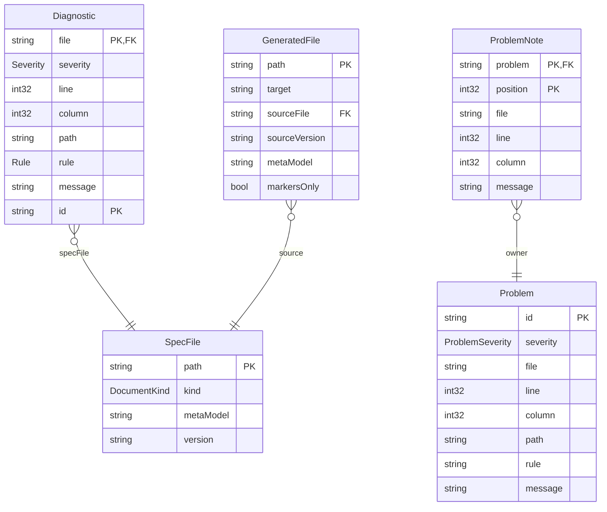

### Diagnostic

One problem found in one file. Printed as one line, the problem line
of ADR-065: `file:line:column: severity: /yaml/path: rule: message [id]`.

| Field | Type | Required | Limits | Description |
|---|---|---|---|---|
| file | string | yes |   | The file's path as given. |
| severity | Severity | yes |   |   |
| line | int32 | yes | at least 1 | Line of the YAML node the problem is at; for an expression, the line inside the expression. |
| column | int32 | yes | at least 1 | From 1, in Unicode characters: for an expression, the column inside the expression; otherwise the column of the node the path names when the problem is on its line (its value, or else its key), and else of the first character on the line that is not a space. |
| path | string | yes |   | JSON pointer to the node, such as `/entities/Loan/relations/member/target`; `/` for the whole file. |
| rule | Rule | yes |   |   |
| message | string | yes | at least 1 character | What is wrong and how to fix it, in one plain sentence. |
| id | string | yes | at least 1 character | `<rule>@<file>#<path>`, the file relative to the specification's folder, or to the file's own folder for a file checked on its own, with `.<tag>` after the rule, eight hex digits of the FNV-1a hash of the message, when one rule reports several diagnostics at one path of one file, and `-2`, `-3` and on after the tag when the message repeats as well. It names what is wrong, not where it is printed, so it stays while lines move (ADR-065). |

Primary key: file, id.

| Relation | Kind | Target | Via | On delete |
|---|---|---|---|---|
| specFile | many-to-one | SpecFile | file | restrict |

| Constraint | Rule | Message |
|---|---|---|
| diagnostic_line_positive | check `line >= 1` | Every diagnostic points at a line. |
| diagnostic_column_positive | check `column >= 1` | Every diagnostic points at a column. |

### GeneratedFile

A file a document or code target wrote. Its header names where it came from.

| Field | Type | Required | Limits | Description |
|---|---|---|---|---|
| path | string | yes |   | Path inside the target's own folder. |
| target | string | yes | at least 1 character | The document or code target that wrote it, such as `techspec` or `openapi`. |
| sourceFile | string | yes |   | The root file of the specification it was made from. |
| sourceVersion | string | yes |   | That specification's `info.version`. |
| metaModel | string | yes |   | The meta-model version of that specification. |
| markersOnly | bool | yes |   | True for a hand-written Markdown document, where only the text between `specarch:generate` markers is rewritten. |

Primary key: path.

| Relation | Kind | Target | Via | On delete |
|---|---|---|---|---|
| source | many-to-one | SpecFile | sourceFile | restrict |

### Problem

One error, warning or open question of a specification, as the
problems file lists it (ADR-065). Printed as one line:
`file:line:column: severity: pointer: rule: message [id]`, followed
by its notes.

| Field | Type | Required | Limits | Description |
|---|---|---|---|---|
| id | string | yes | at least 1 character | A question's own id, such as `Q-4`; for an error or a warning `<rule>@<file>#<pointer>`, the file relative to the specification's folder, with `.<tag>` after the rule, eight hex digits of the FNV-1a hash of the message, when one rule reports several problems at one pointer. |
| severity | ProblemSeverity | yes |   |   |
| file | string | yes |   | The fragment the entry is in, relative to the folder the problems file is in. |
| line | int32 | yes | at least 1 | The line of the entry, from 1. |
| column | int32 | yes | at least 1 | From 1, in Unicode characters: for an expression, the column inside the expression; otherwise the column of the node the pointer names when the problem is on its line, and else of the first character on the line that is not a space. For an error or a warning, the column of its diagnostic. |
| path | string | yes |   | JSON pointer to the entry, such as `/entities/Loan/relations/member/target`; `/` for the whole file. |
| rule | string | yes | at least 1 character | The Rule of an error or a warning, and `open_question` for a question. |
| message | string | yes | at least 1 character | What is wrong and how to fix it, in one plain sentence; for a question, its priority and kind, the question, who decides and how it is answered. |

Primary key: id.

### ProblemNote

A place that helps with a problem, printed after it as
`file:line:column: note: text`: a source the entry or the question
cites, or an entry a question blocks.

| Field | Type | Required | Limits | Description |
|---|---|---|---|---|
| problem | string | yes | at least 1 character | The id of the problem it belongs to. |
| position | int32 | yes | at least 1 | Its place among the problem's notes, from 1. |
| file | string | yes |   | The cited file when the source's url is beside the specification and the clause is `path:line`, otherwise the fragment holding the citation or the blocked entry; relative to the folder the problems file is in. |
| line | int32 | yes | at least 1 |   |
| column | int32 | yes | at least 1 |   |
| message | string | yes | at least 1 character | `source <key>, clause <clause>: <says>` for a citation; `blocks <pointer>` for a blocked entry, with the keys missing there. |

Primary key: problem, position.

| Relation | Kind | Target | Via | On delete |
|---|---|---|---|---|
| owner | many-to-one | Problem | problem | restrict |

### SpecFile

One input given to a command, as the command read it; a specification is one input, whatever the number of files in its tree.

| Field | Type | Required | Limits | Description |
|---|---|---|---|---|
| path | string | yes |   | The path as given on the command line or found under a given folder: a specification's root folder, or an implementation file. |
| kind | DocumentKind | yes |   |   |
| metaModel | string | yes |   | The meta-model version the input declares: `specarch` in a root file, `specarchImplementation` in an implementation file. |
| version | string | yes |   | The input's own `info.version`. |

Primary key: path.

### Enums

| Enum | Value | Meaning |
|---|---|---|
| DocumentKind | specification | a specification, the tree rooted at `specarch.yaml`; its design side is the SpecArch Definition (SDF) |
| DocumentKind | implementation | a SpecArch Implementation File (SIF), `<name>.<stack>.specarch-implementation.yaml`, one stack's implementation of a specification |
| DocumentTarget | techspec | arc42 technical specification in Markdown with generated Mermaid diagrams |
| DocumentTarget | requirements | requirements specification, in the layout of ISO/IEC/IEEE 29148 |
| DocumentTarget | testplan | test plan and test cases, golden and red, traced to requirements |
| DocumentTarget | traceability | the traceability matrix from needs through requirements to design elements, tests and checks |
| DocumentTarget | deployment | deployment guide, from the deployment stage and the implementation's deployments |
| DocumentTarget | commissioning | commissioning test procedure and sign-off sheet |
| DocumentTarget | questions | the open questions by stage, what each blocks and who decides, and which outputs are ready, drafts or waiting |
| DocumentTarget | problems | problems.txt, every error, warning and open question one line each with its notes, and problems.sarif, the same as a SARIF 2.1.0 log; written for an invalid specification too |
| DocumentTarget | changes | the change and defect register, open items first, from the records beside the specification |
| DocumentTarget | releases | release notes, newest first, each release's changes and fixes grouped as added, changed, removed and fixed, from the records |
| DocumentTarget | manual | user manual, from the pages and permissions |
| DocumentTarget | operations | operations guide, from the endpoints, channels and deployments |
| GeneratorTarget | openapi | OpenAPI 3.1 document |
| GeneratorTarget | sql | forward SQL migrations, new files only |
| GeneratorTarget | ui | page definitions for the target component library |
| GeneratorTarget | tests | one test per design test and per worked example, in the implementation's framework |
| GeneratorTarget | scripts | guarded operational scripts for data changes |
| ProblemSeverity | error | a diagnostic that makes the specification invalid; SARIF kind fail, level error |
| ProblemSeverity | warning | a diagnostic that leaves the specification valid; SARIF kind fail, level warning |
| ProblemSeverity | question | an open question of any priority; SARIF kind open, level none |
| Rule | file_kind | a file given by name is neither `specarch.yaml` nor `*.specarch-implementation.yaml`, is part of a specification that should be checked as a whole, or its root key does not match its name |
| Rule | yaml_syntax | an entry of the file, or the file as a whole, is not well-formed YAML; the entries that parse are still read (ADR-080) |
| Rule | unquoted_date | a date written without quotes, which YAML reads as a timestamp |
| Rule | duplicate_key | a mapping repeats a key, or two files of one specification define the same name |
| Rule | schema | the file breaks the meta-model's JSON Schema |
| Rule | stack_key | a specification carries a key that belongs to one implementation |
| Rule | design_key | an implementation file carries a key that belongs to the specification |
| Rule | ref_type | a `$ref` names an entity or enum the specification does not have |
| Rule | relation_target | a relation's target is not an entity of the specification |
| Rule | relation_via | a relation's `via` is not the field or join entity its kind needs |
| Rule | field | a name that must be a field of an entity is not one (required, primaryKey, unique fields, page columns, fields and filters) |
| Rule | state_field | the `stateField` is not a field whose type is an enum |
| Rule | state_value | a transition's `from` or `to` is not a value of the state field's enum |
| Rule | trigger | a transition's trigger is not an operation, command, channel message or algorithm |
| Rule | requirement | a `satisfies` or `verifies` link names a requirement that is neither in the specification nor in a declared requirement set |
| Rule | emits | an `emits` entry names a channel or message that does not exist |
| Rule | dependency | a `calls` entry names a dependency that is not declared, or a dependency's timeout is zero |
| Rule | idempotency_key | an `idempotencyKey` names no header parameter of its operation, or sits on a method that RFC 9110 already makes idempotent |
| Rule | validity | a `validity` names a field the entity does not have, one that is not a date or a date-time, or a `from` and an `until` of different formats |
| Rule | session | a session's idle or absolute timeout is zero |
| Rule | guard | a `guard` names an entity that does not exist (its precondition is checked as a check constraint is) |
| Rule | operation | a `source`, `submit` or operation action names an operationId that does not exist |
| Rule | page | a navigate action names a page that does not exist, compactColumns is on a page that is not a list or names a column the list lacks, or a page gives its fields as neither or both of fields and sections, shows a field in two sections, or is a list with sections, or childRows are on a page that is not a form, name a relation twice, or name one the form's entity lacks or one that is not one-to-many |
| Rule | algorithm | an `algorithm` reference names an algorithm that does not exist |
| Rule | decision | a `supersededBy` names a decision that does not exist, or an implementation decision reuses a design decision's ID |
| Rule | enum_value | a `valueDescriptions` key is not a value of its enum |
| Rule | path_parameter | a `{name}` in a path has no path parameter, or a path parameter is not in the path |
| Rule | duplicate_operation | two operations share an operationId |
| Rule | permission_undeclared | an operation, command, page, action or role names a permission that is not declared |
| Rule | permission_ungranted | a declared permission is granted by no role and is not `public` |
| Rule | separation_of_duties | a separation-of-duties set names a permission that is not declared or is `public`, asks for more of its permissions than it holds, or a role grants as many of the set's permissions as its cardinality |
| Rule | expression_syntax | a check, a unique constraint's condition or a formula does not parse |
| Rule | expression_name | an expression names a field, input or function that does not exist |
| Rule | expression_type | an expression combines values of types that do not fit |
| Rule | example_input | a worked example's inputs are missing one, name an unknown one, or have the wrong type |
| Rule | example_expected | a worked example's expected value does not have the output's type |
| Rule | example_mismatch | the formula evaluated on a worked example's inputs does not give the expected value |
| Rule | example_error | the formula cannot be evaluated on a worked example's inputs (division by zero, null in arithmetic) |
| Rule | implements | an implementation file's `implements` does not name the root file of its specification at the same version |
| Rule | design_ref | a pointer into the specification does not resolve |
| Rule | unsafe_integer | an int64 or uint64 is carried as a JSON number without bounds inside 2^53 |
| Rule | change_log | a description reads as a change log instead of the current truth (a warning) |
| Rule | test_subject | a test is about an operation, command, page, constraint or transition that does not exist |
| Rule | test_case | a test covers a case its subject does not have, or a red case in a golden test |
| Rule | test_golden_missing | a subject has no golden scenario (a warning in 0.1) |
| Rule | test_red_missing | a subject has no red scenario and no derived red case (a warning in 0.1) |
| Rule | test_case_missing | a chosen case derived from the design has no test; a case is chosen when its subject satisfies a requirement with `harm`, when it is a failing dependency, or when users get it wrong often (a warning in 0.1) |
| Rule | suite | an implementation's test suite names a design test or subject that does not exist |
| Rule | test_data | a test's fixture, input or expect names what the design does not have, carries a value of the wrong type, holds a record a check constraint refuses, or says the same thing as a data folder beside it |
| Rule | layout | a file or a section is not where the tree layout puts it; the root file's `stages` and the folders disagree, a test folder has no `test.yaml`, or a folder is not a stage |
| Rule | need | a requirement's `needs` names a need that does not exist |
| Rule | stakeholder | a need's `stakeholders`, a question's `decidedBy` or a mapping's `ownedBy` names a stakeholder that does not exist |
| Rule | source | a citation names a source that is not declared under `sources` |
| Rule | environment | a check, an environment's `promotesTo` or an implementation's deployment names an environment that does not exist, or a deployment names none when the specification declares them |
| Rule | setting | an implementation's deployment gives a value to a setting the specification does not declare, or an operation, command or page is enabledBy a name that is not a boolean setting |
| Rule | secret_value | a setting marked secret carries a value, as a default or in a deployment |
| Rule | monitor | an implementation's deployment watches a monitor the specification does not declare |
| Rule | record_name | a record's file name is not its ID, its version, or its date and environment, or it does not sit in the folder of its kind under `records/` |
| Rule | record_ref | a record names a stakeholder, requirement, `#/` pointer, test, environment or monitor the specification does not have, or a change, defect, incident, release or commissioning run that is not a record and not in a declared change-set or defect-set; or a requirement's release is not a planned or released release record |
| Rule | change_applied | an implemented or released change's `adds` or `changes` do not resolve or its `removes` still do, or an open change's `changes` or `removes` do not resolve; an open change whose `adds` already resolve is a warning |
| Rule | change_decision | an approved, implemented or released change has no decision with outcome approved, or a rejected one no decision with outcome rejected |
| Rule | defect_test | a fixed or released defect names no test, or one that neither verifies a requirement the defect violates nor is about an element it violates |
| Rule | defect_duplicate | a duplicate defect names no defect, one that does not exist, or one that is itself a duplicate |
| Rule | incident_link | a resolved incident links to no defect or change and gives no `noChange` reason (a warning) |
| Rule | commissioning_record | a commissioning record's results name a check that does not exist, or its version is not a release's |
| Rule | release_contents | a released release includes a change that is not implemented or released or a defect that is not fixed or released, or a released change or defect and the release it names disagree |
| Rule | release_bump | a released version steps from the previous released version by less than the largest impact of what it includes |
| Rule | release_version | info.version is neither the newest released version nor a later pre-release of a planned release, or a release's specificationVersion is not its version |
| Rule | need_unrefined | no requirement refines a need whose status is not rejected (a warning) |
| Rule | acceptance_missing | a requirement has no acceptance criteria (a warning) |
| Rule | requirement_unsatisfied | the specification has a design and no element of it satisfies a requirement (a warning) |
| Rule | requirement_unverified | the specification has tests, checks or monitors and none verifies a requirement (a warning) |
| Rule | question_block | a question's `blocks` entry is neither a stage, a section, nor a pointer to an element of the specification or to one missing key of it, or a question with `names` does not block exactly one key the specification leaves out |
| Rule | question_stage | a question blocks more than one stage, or sits in a file of another stage than the one it blocks |
| Rule | question_answered | an accepted decision answers a question that is still in the specification |
| Rule | origin_citation | an element whose origin is stated cites nothing |
| Rule | origin_reason | an element whose origin is inferred has no why |
| Rule | origin_decision | an element whose origin is decided names no decision, or a decision that does not exist or is not accepted, or is a decision itself; or decidedIn is set without origin decided |
| Rule | origin_missing | the specification tracks origin and an element of a section carries none (a warning) |
| Rule | idiom_unknown | an implementation file's `idioms` key, or an override's `overrides.idiom`, names no shipped idiom and none of the project's, or an override names no file in the idioms folder |
| Rule | idiom_part_unknown | an override names a part the idiom does not have, or defines a part it does not list under `overrides.parts` |
| Rule | idiom_override_reason | an idiom is excluded, or overridden, without `why` |
| Rule | idiom_stack | an override renders a stack that is not the implementation file's: its language, the dialect of one of its targets, the framework of one of its ui targets, or `any` |
| Rule | idiom_version_behind | an override was copied from an older version of the shipped idiom and does not say it stays behind on purpose (a warning) |
| Rule | idiom_contract | an override changes a shipped contract statement, or a field has no row in a type rendering for a stack of the implementation file |
| Rule | sensitivity_exposed | a credential field that is not writeOnly can appear in a response; a personal field can appear in the response of a public operation (a warning) |
| Rule | at_rest | lookup without atRest encrypted, or an encrypted field that is a key or unique without lookup hash |
| Rule | audited | an audited entity declares a field the system sets (createdAt, createdBy, lastModifiedAt, lastModifiedBy), or one with soft deletion declares deleted |
| Rule | list_of | a listOf names an entity or a view the specification does not have, a view that carries rows, or a field the entity does not have, puts an encrypted field in searchable or sortable or in filterable without lookup hash, or has a default page size above its maximum |
| Rule | limits | a rate's time is zero, or its burst is below its requests |
| Rule | problem | a response names a problem type not under errors, or one of another status, or the specification declares errors and a 4xx or 5xx response names none |
| Rule | job | a job acts as a role the specification does not have, reads or writes an entity it does not have, or consumes a message no channel declares |
| Rule | menu | a menu entry opens a page the specification does not have |
| Rule | view | a view reads from an entity the specification does not have, follows a path, counts a relation or carries the rows of a relation that does not lead where it must, repeats a field of its entity, shares an entity's name, or is used where it would be written |
| Rule | flow | a page event is on a page or an action that does not raise it, leads to a page the specification does not have, does not give that page exactly its route parameters from fields of the page's entity, or carries a message that is not a full sentence; or a flow's actor is not a role or may not open a page or take an action on the way, a step's page does not exist or does not raise its event, or an event leads somewhere other than the next step's page |
| Rule | state | a page's states leave out the empty state a list shows or the filtered empty state its filters can reach, name one it cannot reach, leave a problem type the page can meet without a message and without a default, name a problem type it cannot meet, put a field on a page that is not a form or that the form does not show, or give a message that is not a full sentence |
| Rule | accessibility | once the specification names its accessibility target, a field a page shows has no title, or two actions of a page share a label |
| Rule | theme | a design token has no type, a type SpecArch does not take, or a value not of its type, an alias names no token or one of another type or leads back to itself, a mode gives a token that does not exist, or a pair of colours is translucent or has less contrast than WCAG 2.2 asks of its use |
| Rule | workflow | a workflow's trigger is not an operation or does not answer 202, its subject is not an entity, an approver is not a role or does not grant the approval's permission, an approval's permission is the trigger's, a role grants both the trigger's and an approval's permission while a separation-of-duties set holds the pair, an approval's deadline is zero, an operation step names no operation, an escalation does not name a later approval step, or two steps share a name; a page that submits to a trigger has no event for its 202 answer or no message in it; or an inbox is on a page that is not a list, names no workflow or no approval step of it, or lists another entity than the subject or checks another permission than the step's |
| Rule | picker | a picker is on a page that is not a form, or for a field the form does not show or that no many-to-one relation of its entity holds; its source is not an operationId of the specification, or not an operation whose listOf names the relation's target, or a role that may open the form may not call it; it shows a field the target lacks; or it fills a field the form does not show from a field the target lacks or of another type |
| Rule | action | an action's when is on a form that loads no record, or its reason is on an action that runs no operation or names no property of the operation's request body, one the body does not require, or one that is not a string |
| Rule | form_field | a page's fieldConditions name a field it does not show, make a field read-only on a page that is not a form, or give readOnly and readOnlyWhen together; its checks or enteredTwice are on a page that is not a form or a task, or a check's field or a field entered twice is not one the page shows; or a check's message is not a full sentence |
| Rule | value_object | a relation leads to a schema, a schema is named like an entity or a view, storage is on a field that holds no schema or inside a value or is columns on a list, or a value kept in columns is optional with no required part that is never null or holds a list of schemas, itself or a reference to an entity |
| Rule | wire_name | the specification names its wire names (info.wireNames) and two properties of one object, an entity's, a view's with its entity's, or a body's, a parameter's or a message's, go on the wire under one name |
| Rule | output_folder | document is given no --out, and no implementation file of a specification names an output folder for the target under targets, so that specification has no such document (a warning, ADR-073) |
| Severity | error | the file is invalid |
| Severity | warning | printed, but the file stays valid; missing test scenarios, change-log phrases, traceability gaps and elements without origin |

**Note on DocumentTarget:** From ISO/IEC/IEEE 29119-3, Software and systems engineering, Software testing, Part 3, Test documentation, 2021, clause 7.2 and 8.3: A test plan and test case specifications are the test documentation items of a project. <https://www.iso.org/standard/79429.html>

## 6. Runtime view

### Command approve

Validates its input first and approves nothing with errors. Then
refuses while a must or should question is open, when `--by` is not a
stakeholder of the specification, when no document target is
configured, and when any configured document on disk is not what the
specification generates now, so that what was read is what is
approved. Otherwise writes `records/approvals/<version>.yaml` beside
the specification's folder: the record kind, the version, who
approved, the date, the documents that were current, and the digest
of the specification's files (the SHA-256 of every `.yaml` file under
its folder, in byte order of their relative paths, each as its path,
a zero byte, its bytes and a zero byte). A later change to any of
those files voids the approval, and `generate` says so.

**Insight:** A specification is reviewed in the form its readers use, the documents, and approval must be of exactly what was read; a digest of the files says so where a version number, which does not change while a specification is being written, cannot. The record names a role, because a specification is read and copied by more people than a ticket system.

**Note:** From ISO/IEC/IEEE 29148, Systems and software engineering, Life cycle processes, Requirements engineering, 2018, clause 6.3.3.6: Requirements validation is subject to approval by the project authority and the key stakeholders. <https://www.iso.org/standard/72089.html>

**Note:** From ISO/IEC/IEEE 29148, Systems and software engineering, Life cycle processes, Requirements engineering, 2018, clause 3: A baseline is a formally approved version of a configuration item, fixed at a point in time. <https://www.iso.org/standard/72089.html>

| Argument or option | Type | Required | Description |
|---|---|---|---|
| `<paths>` | string, one or more | yes | Folders holding specifications, searched as validate searches them. |
| `--by` | string | yes | The stakeholder who read the documents and approves, by key; a role, never a person. |
| `--date` | date |   | The date of the approval, as YYYY-MM-DD. Today when not given. |

Reads `{paths}`: The specifications and their implementation files; `<output>/<target>.md`: Every configured document, compared with what the specification generates now.

Writes `records/approvals/<version>.yaml`: The approval record, beside the specification's folder; an earlier approval of the same version is replaced.

Standard output: The errors of an invalid specification, and one line per configured document that is missing or differs.

Standard error: A usage message on a usage error, the reason a refusal, and one line naming the record written.

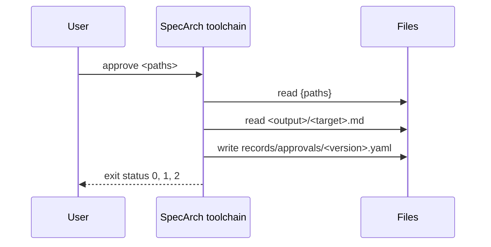

### Command derive

Validates its input first and writes nothing from an invalid
specification. Then, for every subject without a golden test, writes
its success test, and for every chosen derived case no test covers,
writes a test: a folder `tests/<name>/test.yaml` named as the
validator suggests, with the subject, the scenario, the level,
`covers`, `given`, `when` and `then` as the derivation words them,
`verifies` from what the subject satisfies, `origin: inferred` and a
`why` that says why the case was chosen, and the expected status or
exit, or the caller of a denied case, where the design says them for
certain.

A test is named after its subject, then its case: `create-loan-succeeds`.
When subjects of different kinds give the same name, as page `sign-in`
and operation `signIn` both give `sign-in`, each of them takes its
subject key in front: `page-sign-in-succeeds` and
`operation-sign-in-succeeds`. A draft whose name is still taken, by
another draft or by a test of another subject in the folder of that
name, is not written: derive names it, the subject that took the name
and the reason on standard error, writes the other drafts and exits 1;
a draft a question holds up is left out as before.

What it writes is a draft the author completes, not a generated
output: it has no header and no `--check`, and an existing test
folder is never overwritten. A subject a must or should question
holds up is left out and named on standard error, since a test of a
half-defined element would be a placeholder. A specification that
keeps its tests in the root file is refused: each derived test needs
a folder of its own. Writing tests changes the specification, so an
approval of it no longer holds.

**Insight:** The validator already says which tests a specification implies and gives each one to copy; writing them out is the step that turns the warnings into a test suite the author completes, instead of one the author types out from the warnings. A name takes its subject key only when it is shared, so the names of a specification without a shared one stay short; writing one of two drafts of a name would leave the other unwritten with nothing said, so a name that is still shared is an error at each draft.

| Argument or option | Type | Required | Description |
|---|---|---|---|
| `<paths>` | string, one or more | yes | Folders holding specifications, searched as validate searches them. |

Reads `{paths}`: The specifications.

Writes `tests/<name>/test.yaml under each specification's folder`: One draft test per derived case no test covers.

Standard output: The errors of an invalid specification, one line each; otherwise the path of each test written, one per line.

Standard error: A usage message on a usage error, the reason on an unreadable path, each test left out, kept or not written with the reason, and the count written.

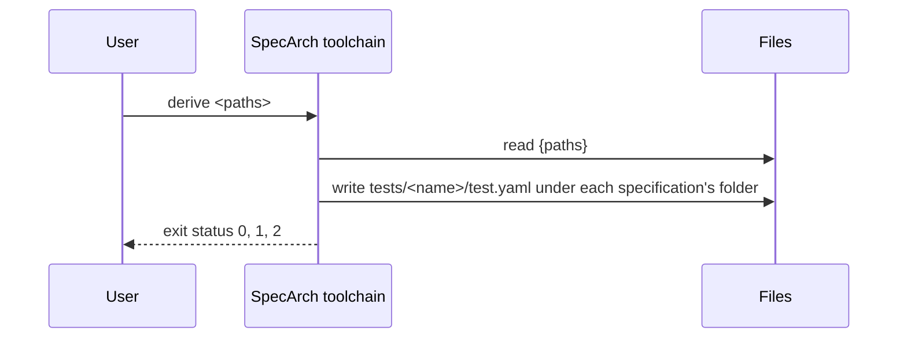

### Command diff

Validates both specifications first and prints the errors of one
that has them; a specification with errors is compared as far as it
can be read, and the command then exits 1 (ADR-065). Then lists
every element added, changed
or removed between them, one line each in pointer order, as
`<impact> <added|changed|removed> <pointer>`, with the change that
decided the impact of a changed element of the public interface
after it. The impact follows Semantic Versioning: an element inside
the system is patch whatever happens to it; on the public interface
an addition is minor, a removal major, and a change the largest of
its changes, a change that cannot be shown safe counting as major.

Then it checks the release of the new version, read from the
records beside the new folder: that its version steps from the old
one by at least the largest impact (version), and that a change
request or defect it includes names every element in the list
(covered). Each failed check is one line starting `error:`; an
element the records cannot be shown to name because the release
includes an ID kept in a tracker is a line starting `warning:`.

**Insight:** The validator sees one version at a time, so it can check what a release record says but not whether the specification changed the way the record says. Only a comparison of the two versions can tell that a release called minor removed an operation, or that an element changed with no change request behind it.

**Note:** From Semantic Versioning, 2.0.0, clause rules 6 to 8: The patch version steps for fixes that keep the interface, the minor version for additions that keep it, and the major version for changes that break it. <https://semver.org/spec/v2.0.0.html>

| Argument or option | Type | Required | Description |
|---|---|---|---|
| `<old>` | string | yes | The folder of the earlier specification, normally the previous release's tag checked out on its own. |
| `<new>` | string | yes | The folder of the later specification, normally the working tree. |

Reads `{old}`: The earlier specification; `{new}`: The later specification; `records/ beside {new}`: The release record of the new version and the change and defect records it includes.

Standard output: The errors of an invalid specification, one line each, then the change list, then one line per failed check.

Standard error: A usage message on a usage error, and the reason on an unreadable path.

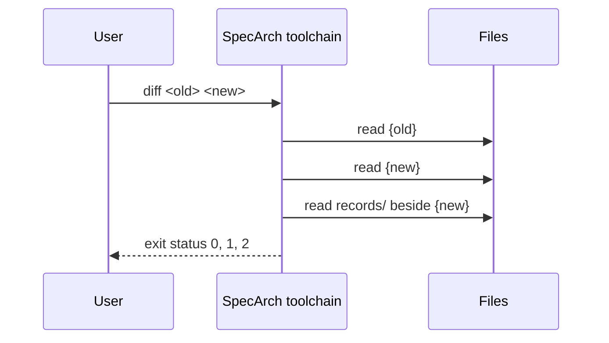

### Command document

Validates its input first and prints the errors of an invalid
specification, then writes its documents all the same, from what
could be read, and exits 1 (ADR-065). Writes the document into the folder the target
owns, and nothing outside it, except the regions between
`specarch:generate` markers in the hand-written `specarch.md` beside
the root file. Every generated file starts with a header naming the
root file, its `info.version`, each implementation file, and the
meta-model version. With `--check` nothing is written: the output is
made in memory and compared with what is on disk. A specification
whose implementation files name no output folder for the target,
with no `--out`, has no such document: it gets a warning at the
targets of its first implementation file and is passed over, and the
others are written or checked (ADR-073).

The techspec target writes `techspec.md`: an arc42 technical
specification of the whole specification, with chapters only for
what it holds. Diagrams are Mermaid: an entity diagram, a state
diagram for each entity with a state field, a sequence diagram for
each operation and command, a flowchart of the pages, a flowchart
of each workflow's steps with each deadline on the edge it takes,
beside the pages that ask for it, its inbox and the messages it
publishes when it ends, and a permissions table. Chapter 2 comes from the constraints and
assumptions, chapter 7 from the deployment and commissioning stages
and from each implementation file, chapter 12 from the glossary, and
chapter 13 from the needs and requirements, with the traceability
matrix of what satisfies and what verifies each requirement, and its
harm once a requirement names one. A marker
names what goes in its region: `erDiagram`, `stateDiagram <Entity>`,
`sequenceDiagram <operationId or command>`, `flowchart pages` or
`permissions`.

The requirements target writes `requirements.md`: the stakeholders,
the needs with the requirements that refine them, and each
requirement with its attributes and acceptance criteria. The
testplan target writes `testplan.md`: the levels, how each
implementation's suites run the tests, and every design test as a
test case, grouped by subject, then each state machine with its
state diagram and its paths from an initial to a terminal state, each
with the tests that walk it, then the derived cases left out: each
case of rank other that no test covers, with its subject and the
reason. The traceability target writes `traceability.md`: needs to
requirements, requirements to what satisfies and verifies them, with
their harm once a requirement names one, and the gaps the validator
warns about.
The deployment target writes `deployment.md`: the environments and
the path a release takes, the settings, each installation of each
implementation with its servers and setting values (a secret only
named), release, rollback and the migrations. The commissioning
target writes `commissioning.md`: the checks by environment in the
order a release reaches them, each step with a Result column, and
the sign-off sheet.

The questions target writes `questions.md`: the open questions by
stage with what each blocks and who decides, and which outputs are
ready, drafts or waiting; the same text `gaps` prints. When the
specification has errors, it lists them after its summary as
problem lines; a document whose sections hold an error is a draft,
and code generation waits on every error. Every other
document shows an element's origin as an Origin line and the open
questions about it as Open question paragraphs, and starts with a
Draft notice when a must or should question blocks what it reads.
It marks each error and warning with a Problem paragraph,
`**Problem on <name>:** <severity>: <rule>: <message> [<id>]`, at the
deepest element it shows that holds the problem's pointer, and
starts with a Problems notice when the specification has an error
or the document a warning: that the specification is invalid, how
many errors and warnings concern the document (those in the
sections it reads, or at an element it shows), and after it the
Problem paragraph of each one it shows no element for.
In the technical specification, a workflow's trigger, subject, an
approval's permission and deadline and a step's operation that a
question holds open are written as what they are, the question that
holds them, and the name it gives, in the text and in the
flowchart.

The changes and releases targets are made from the records beside the
specification, and their header names the records folder too. The
changes target writes `changes.md`: the change requests and the
defects, open ones first, each with its status, what it affects or
violates and its decision. The releases target writes `releases.md`:
the releases newest first, each with what it includes grouped as
added, changed, removed and fixed. Neither is ever a draft.

The problems target writes `problems.txt` and `problems.sarif`
(ADR-065), for an invalid specification too. `problems.txt` starts
with a line naming the specification, its version and the counts of
errors, warnings and open questions by priority, and a line naming
the root file it was made from; then one line per problem,
`file:line:column: severity: pointer: rule: message [id]`, sorted by
file, line, column, pointer, rule and id, each followed by its notes,
`file:line:column: note: text`. The problems are validate's errors
and warnings and the open questions; a question is at its entry in
the questions file, its notes are each source it cites and each
entry it blocks, with the keys missing there, and the diagnostics it
covers are not problems of their own. An error's or a warning's
note is each citation of the nearest element above its entry that
cites. Paths are relative to the folder the files are written in.
`problems.sarif` is one SARIF 2.1.0 run of the same problems, in the
same order, with `columnKind` unicodeCodePoints, locations relative
to the base id PROBLEMSDIR, the id as the partial fingerprint
`specarchId/v1`, the pointer as a logical location, the notes as
related locations, a question's fields as properties, and the rules
used listed under the tool. A specification that cannot be read at
all, such as one whose root file has no entry that parses, gets its
problems too, and a file that does not parse is read as far as its
entries parse (ADR-080).

In every document an element's why is an Insight and each citation
a Note (ADR-015), and a document that cites sources ends with them.

**Insight:** Documents are read by more people than the YAML, so they come first among the targets and are made from the specification rather than kept beside it.

**Note:** From arc42, the template for architecture documentation, 8.2: The twelve chapters of an architecture document, from introduction and goals to glossary. <https://arc42.org/overview>

| Argument or option | Type | Required | Description |
|---|---|---|---|
| `<target>` | DocumentTarget | yes |   |
| `<paths>` | string, one or more | yes | Folders holding specifications, searched as validate searches them. |
| `--out` | string |   | The folder the target owns. Without it, the folder the implementation files' `targets` name for the target, relative to each implementation file; they must agree. |
| `--check` | bool |   | Make the output in memory and fail when the files on disk differ. Writes nothing. |

Reads `{paths}`: The specifications and their implementation files; `specarch.md`: The hand-written document beside each root file, when there is one; `records/ beside each specification's folder`: The change, defect and release records, for the changes and releases targets; `{out}`: The current output, with `--check`.

Writes `{out}/<target>.md`: The document. Nothing is written with `--check`; `specarch.md`: Only the regions between markers. Nothing is written with `--check`; `{out}/problems.txt`: The problems, for the problems target, written whether or not the specification is valid. Nothing is written with `--check`; `{out}/problems.sarif`: The same problems as a SARIF 2.1.0 log, for the problems target.

Standard output: The errors of an invalid specification and the errors of a
marker, one line each; a warning for each specification with no
output folder for the target. With `--check`, one line per file that
differs or is missing.

Standard error: A usage message on a usage error, the reason a file cannot be read or written, and a one-line count at the end.

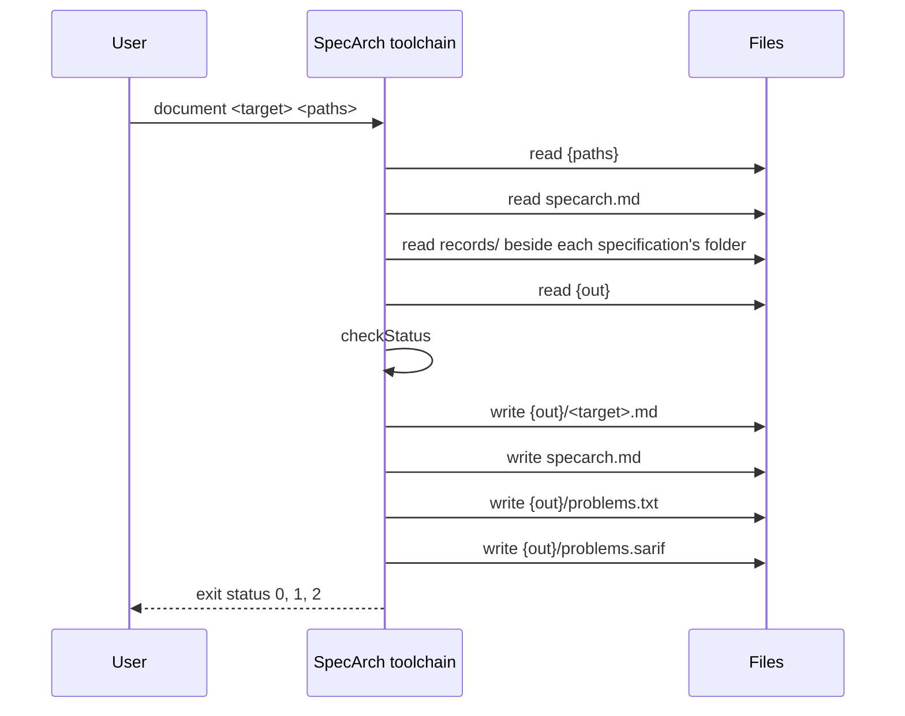

### Command extract

Reads one surface of an existing system and writes the as-built
specification of it into a folder, following the method in
`docs/extraction.md`. The source names the surface. The result is a
partial specification tree, to be merged with the trees of the other
surfaces (`specarch merge`), checked by regenerating and comparing,
then reviewed by hand. The readers are built one at a time, in the
steps of docs/extraction.md, Building extract; a source this build
does not read is answered with status 2.

The sources this build reads:

- `outline`: the files under the paths, each a clause of one code
  source, and no elements. It records a surface no reader reads yet,
  such as workflow definitions in a format other than BPMN 2.0, so
  that `specarch gaps` lists every
  file as producing nothing rather than losing it.
- `database`: a PostgreSQL catalogue dump, written by
  `tools/catalogue/dump-catalogue.sh` with the query
  `tools/catalogue/catalogue.sql` against a database with every
  migration applied. Each table becomes an entity of the same name in
  PascalCase, each column a field in camelCase, with its type,
  nullability, default, primary key, foreign keys as relations, and
  unique and check constraints. A check the expression subset can say
  is written as its expression. A json or jsonb column is a field of
  type object, and a should question at the field asks which schema
  it holds, since the catalogue does not say its shape (ADR-077).
- `router`: a route table, written by `tools/routes/dump-routes.sh`
  around the project's own route printer, which builds the router as
  the server does and prints every route it registered: its method,
  its path with each parameter written `{name}`, the one permission
  it checks or null, and its handler. Each route becomes an operation
  under its path, named after its handler, with the path's
  parameters and the permission it checks; every permission checked
  is declared, and a must question asks which role grants it. A route that checks no permission is a must question,
  never written as public.
- `documents`: one Markdown document, as one document source under
  `--source-key` (default the file's name in kebab-case, without its
  extension). Every ATX heading and every paragraph that starts with
  a section number such as `3.1` is a clause, the number its name
  and the heading its title; a heading with clauses under it is
  listed only when it holds text of its own. A sentence that makes a
  commitment (shall, must, will or should; a number followed by what
  it counts; a time of day; once or twice; within, before, after,
  until or no later than) becomes a requirement, stated, citing its
  clause, numbered in the order read under the source key in
  capitals: must, or should for should, accepted, and its kind a
  must question. A commitment whose subject is only it, they, this
  or the like is a must question, never a guess. A table whose first
  column is Field, and whose others are Type, Required, Sensitivity
  or Description, gives the fields of an entity named after its
  section's heading in PascalCase, each in camelCase, with the type
  when it is text, string, date, date-time, timestamp, boolean,
  yes/no or email, and the sensitivity from its column or from the
  one sentence that names the field and calls it personal or a
  credential; the primary key is a must question, and a sensitivity
  the document does not give a should question. A field of any other
  type, any other table and fenced code each print a line. The
  edition is the commit that last changed the file.
- `openapi`: one OpenAPI 3.0 or 3.1 document, in YAML or JSON, as
  one document source under `--source-key` (default as for
  documents), whose clauses are the JSON pointers of its operations
  and component schemas. Each operation under get, post, put, patch
  or delete becomes an operation under its path, citing its pointer,
  with its operationId, summary, description, parameters, request
  body and responses; a path's own parameters stay on the path. A
  schema is written in the field subset: OpenAPI 3.0's `nullable`
  becomes a type that allows null, its `example` an `examples`
  list, and its boolean `exclusiveMinimum` and `exclusiveMaximum`
  the number form; a schema with properties and no type is an
  object, and one with items an array, as JSON Schema reads those
  keywords. A component schema of type object with at least one
  property that can be held becomes an entity when an operation's
  201 response answers it or a path with a parameter answers it as
  it is, its primary key a must question, and a reference to it a
  reference to the entity; any other becomes a schema under
  `schemas`, with no question about a key, and a reference to it a
  reference to the schema, inside an entity too, with storage json
  and a line where the design would refuse it in columns (ADR-063,
  ADR-077); one of type string with an enum of snake_case values
  becomes an enum; a reference to any other component schema is
  written in place. A document whose property names are snake_case
  (one has an underscore and none a capital) gives info.wireNames
  snake_case, and each property is written by its camelCase name,
  printed as one line.
  What the meta-model cannot hold prints a line and is left out: the
  methods head, options and trace; a cookie parameter or one given
  by content; a response code range; response headers and links;
  callbacks, servers, tags and external documents; a reference
  outside the document; allOf, oneOf, anyOf, not,
  additionalProperties and discriminator; a property name that is
  snake_case in a document whose other names are camelCase, or that
  would not go back on the wire unchanged under info.wireNames; and an
  operationId that is not camelCase, the operation then named by
  its method and path. Every operation outside dxlib's dialect has
  its permission as a must question naming the security the
  document gives, since a security
  scheme is not a permission, and so is an integer or number with no
  width; a missing summary or responses is a must question too. An
  operation that carries `x-dxlib-endpoint-type` is read in dxlib's
  dialect (ADR-076): the one name its `x-dxlib-privileges` lists is
  its permission, when it is lower-case words joined by dots and not
  `public`, and every such permission is declared citing the first
  operation that checks it, its description and the role that grants
  it must questions. A name in dxlib_module's form, words in
  capitals and digits joined by underscores in segments joined by
  dots (`ORDER.CREATE`, `GLOBAL.SET_MAINTENANCE_MODE`, `EVERYTHING`),
  is mapped by the fixed rule of ADR-076: the name in lower case,
  with every underscore a dot; that permission is declared inferred,
  the rule its why, citing the operation. None, more than one, a
  name of another form or one the rule makes into no permission
  name, two names that give one permission, `public` and a value
  that is not a list of names are each a must question on the
  operation's permission, never written as public; a name listed
  twice counts once. The question on an operation with no privilege
  names its middlewares when `x-dxlib-middlewares` lists them. A
  document every operation of which is in dxlib's dialect is what
  the running service printed (ADR-076), so its source is a code
  source with `reading: printed`, its clauses the operations' and
  component schemas' pointers as for any document. The security such an operation is
  given prints a line, since it is not its permission. Its other
  `x-dxlib-` keys print a line as any extension does, and so does
  `x-dxlib-privileges` on an operation without
  `x-dxlib-endpoint-type`. The
  edition is the commit that last changed the file.
- `permissions`: a permission table, written by
  `tools/permissions/dump-permissions.sh` around the project's own
  permission printer, which reads the grants where the running
  check reads them, such as the tables the seed scripts fill and not
  a policy file the check never loads, and prints every role and
  permission it grants, and every check that runs only when a
  setting is present, by the check's name and the setting's. Each
  role becomes a role granting its permissions in the order of
  their names, citing the permission table, and every permission
  granted is declared. A privilege in dxlib_module's capitals is
  mapped to a permission by the rule of ADR-076, as extract openapi
  maps it, and the permission declared inferred. A grant of
  EVERYTHING, which is never expanded, a name the rule does not map
  and two names that give one permission are each a must question
  blocking the role's permissions, and the role is written with the
  grants it can read. A role whose name is not kebab-case and a
  grant of public, which is open to everyone and granted by no
  role, print a line and are left out, and so is a role left with
  nothing to grant or ask about. Each such check prints a line and
  is a must question blocking the roles, citing the table, since
  while the setting is empty the check lets every request through
  and nothing says so; extract go asks it in the same words, so
  that merge joins the two.
- `pages`: one folder that is a file-system router's root, such as
  the `app` folder of a Next.js application, read from its tracked
  files (ADR-057). Every folder that holds a page file, `page.tsx`,
  `page.ts`, `page.jsx` or `page.js`, is one page, its route the
  folders from the root down: a folder named in parentheses is a
  route group and adds nothing to the route, and a folder named
  `[name]` is the route parameter `{name}`. The page is named after
  its route in kebab-case, a parameter as `by-` and its name, and
  the root's own page `root`. Two folders that give one route are
  refused, as the router refuses them. What the meta-model cannot
  hold prints a line and is left out: a catch-all segment
  `[...name]` or `[[...name]]`, a parallel route `@name`, an
  intercepting route `(.)name`, a page in a private folder `_name`,
  a parameter whose name is not an identifier, any other page file
  such as `page.mdx`, and a route handler, `route.ts` and the like,
  which serves an operation the router reader reads. A page whose
  folder holds `page.schema.ts`, the schema its component library
  renders from, takes its content from it: the file holds imports,
  comments and one exported object literal, optionally followed by
  `satisfies` and a type, written in the subset of TypeScript that
  is also JSON5 (keys as names or quoted, strings, numbers, true,
  false, null, arrays and objects, trailing commas). Of its keys,
  `kind`, `title`, `entity`, `permission`, `columns`,
  `compactColumns`, `fields`, `sections` and `filters` are read as
  the page keywords of the same name. `source` and `submit` name an
  operation the router's tree or the interface document's declares,
  not this one, so the key is left out and a must question carries
  the name under `names`; `specarch merge` writes it once a tree
  declares that operation. Every other key, a value that is not
  a literal, and a file outside the subset print a line, and what
  they would have given is asked for. An entity a schema names is
  written by name, of type object, with every field a page shows
  as a field known only by name, citing the schemas; its primary key
  and each field's type are a must question. Each page cites its
  page file and its schema; its kind, title, entity and the
  operations it reads or submits, where no schema gives or names
  them, are a must question, and so is the permission it checks, never written
  as public. Every permission a schema names is declared, its
  description and the role that grants it must questions.
- `workflows`: one BPMN 2.0 XML file, read with the standard
  library, whose processes are written as `workflows` in the
  sequential subset of ADR-054, one workflow per process, named
  after the process in kebab-case and ordered by name. The
  process's documentation is the description. Its one start event
  gives the trigger: the operation its message event's
  `operationRef` names, through the file's interface. A user task
  is an approval step, its roles the resources or expressions of
  its potential owners in kebab-case, and an interrupting timer
  with a duration on it the deadline: `refuse` when the timer's
  flow ends the request, `escalate` when it reaches a later user
  task. An exclusive gateway right after a user task, with one flow
  to an end event, is that approval's refusal. A service task is an
  operation step, its operation the one its `operationRef` names.
  Each step is named after its task in camelCase. An operation the
  file names is not declared by it, so the trigger and a step's
  operation are left out and a must question carries the name
  under `names`; `specarch merge` writes it once a tree declares
  that operation. The subject, each approval's permission and
  description, and each role's grants and description are must
  questions, since BPMN has none of them; each potential owner is
  declared as a role by name, citing the task. What the subset
  does not hold prints a line with its file and line and is left
  out: another definition, such as a signal, an element outside
  BPMN's semantic model, such as diagram layout, lanes, a
  performer, a timer that does not interrupt or gives a date or a
  cycle, a duration in weeks, months or years, and a task off the
  path from the start event; an element the path meets that the
  subset does not hold, such as a parallel gateway, a loop or a
  second start event, also ends the steps there with a must
  question on the workflow. Each line names the file's line, and
  the lines come in the file's order.

- `go`: the tracked Go files under the paths, in one repository,
  each read by the standard library's parser by its syntax alone
  (ADR-075), as one code source with `reading: parsed` whose clauses
  are the files read. A test file, and a file in a folder below a
  path read that is named `testdata` or `vendor` or whose name
  starts with a dot or an underscore, is left out, as the go
  command leaves it out of `./...`; a file that
  does not parse is a must question, and the rest are read. The
  module path in `go.mod` resolves a handler in another package of
  the module. In a file that imports dxlib's `api` package
  (ADR-076), each `NewEndPoint` call whose URI is a string literal,
  or literals joined by `+`, and whose method is one or a `net/http`
  constant, outside a loop and a condition of its function, is an
  operation under its path, named as dxlib names it from its URI
  (and its method, when the URI has several), or, when that is not
  camelCase, by its method and path as extract openapi names it,
  with a line; its title is the summary, its description the
  description, the URI's parameters its path parameters, and its
  privileges read as extract openapi reads `x-dxlib-privileges`,
  mapping included. It cites its registration's `path:line`, saying
  its handler, its middlewares and its privileges, and its
  handler's first line, saying the parameters the handler reads and
  the refusals it answers. The handler is read where it is a
  function literal, a function of the same package, or a function
  of another package of the module named through its import; any
  other is a should question. In the handler, each
  `GetParameterValue...` call on the request with a literal name
  is a parameter read, and one whose name the endpoint's literal
  parameter list does not declare is a must question, since dxlib
  fails it at run time; a name that is not a literal is a should
  question. Each `WriteResponseAndNewErrorf`,
  `WriteResponseAsErrorMessageNotLogged`, `WriteResponseAndLogAsError`
  or `WriteResponseAsError` call with a literal status from 400 to
  599, or a `net/http` constant, is a response of that status; its
  literal reason, in kebab-case, names the problem it answers,
  declared under `errors` with that status, citing the call, its
  title and condition a must question. A reason that is not a
  literal, an empty one, a call with no reason, two reasons at one
  status and one reason at two statuses are each a must question on
  the response's problem, and a status that is not a literal is a
  should question. A registration in a loop or behind a condition,
  one whose URI or method is not a literal, one with another number
  of arguments than dxlib's, and the same method and URI a second
  time are each a must question, and no operation. A WebSocket
  endpoint (`NewWSEndPoint`, or `NewEndPoint` with
  `EndPointTypeWS`), a `RegisterHandler` call, whose operation the
  document the service loads declares, and a method the meta-model
  does not hold print a line. Each operation carries a must
  question on whether the running system registers it, which a
  printed tree answers in the merge, and one on its success
  response and what each response means; an operation with no
  privilege, several or one that does not map is asked as in
  extract openapi. A file that imports dxlib's `api` package and
  gives nothing read prints a line.

  In a file that imports dxlib's `databases/models` package, each
  `NewModelDBTable` call whose name is a literal and whose schema is
  a `NewModelDBSchema` call with a literal name, written there or
  assigned once to the name the call passes, outside a loop and a
  condition, is an entity named as extract database names the
  table, so that the two trees give one entity. Its fields are a
  literal map of `ModelDBField`: each column is a property named in
  camelCase, its type the column type dxlib's data type makes on
  PostgreSQL, written as extract database writes that type, nullable
  unless `IsNotNull` or `IsPrimaryKey` says otherwise, read-only for
  a serial type or `IsAutoIncrement`, and the `IsPrimaryKey` columns
  the primary key. A field's other keys, such as `References`,
  `IsUnique` and `DefaultValue`, are left to the catalogue, with a
  line per table naming them. A data type the meta-model has no type
  for, a type not named as one of dxlib's, and what extract database
  prints a line for print a line; a field built by a function, or a
  column named by something other than a literal, is a should
  question. A call in a loop or behind a condition, one whose schema
  or name is not read, one whose fields are not a literal map, and
  a table with no key are must questions, and each entity carries a
  must question whether the database holds it, which a catalogue
  tree answers in the merge. In a file that imports dxlib's `tables`
  package, `NewDXTableSimple`, `NewDXRawTableSimple`,
  `NewDXTableAuditOnlySimple`, `NewDXTableWithEncryption`,
  `NewDXTable` and `NewDXTableWithView` give the table assigned to a
  name or a field, and their last three arguments its paging list's
  search, order and filter whitelists. An endpoint whose handler is
  that table's `RequestSearchPagingList` or
  `RequestSearchPagingDownload` cites the constructor's line, saying
  the table and its whitelists, in place of a handler's, and prints
  a line, since the meta-model holds no whitelist on an operation;
  whitelists that are not literal lists are a should question.

  In a file that imports a package of dxlib_module, an insert into
  its `Role` or `Privilege` table (`InsertReturningId`, `TxInsert`
  and the other insert methods of a dxlib table) with a literal
  `nameid` seeds a role or a privilege, with the literal
  `description` beside it, and a `RolePrivilege...Insert` call
  grants its last argument, a literal privilege, to its role id,
  when that id is a name the same function assigns once from a role
  insert. Each role a seed grants something is written with the
  permissions it grants, citing the role's insert and every grant,
  mapped by the rule of ADR-076 over every privilege name of the
  source, the endpoints' with the seeds', and each permission is
  declared with the seeded privilege's description. A grant of
  EVERYTHING, a name the rule does not map and two names that give
  one permission are must questions on the role's permissions, as
  extract permissions asks them; a seed in a loop or behind a
  condition, a role id the reader does not trace and a privilege
  that is not a literal are must questions; a role whose name is not
  kebab-case prints a line. Each role carries a must question
  whether the running system grants it what the seeds grant, which
  a permission table answers in the merge, and a role with no
  literal description a must question on it.

  A setting is read where the environment is read by a literal name
  (`os.Getenv`, `os.LookupEnv`, and dxlib's `GetEnvDefaultValue`,
  `GetEnvDefaultValueAsInt` and `GetEnvDefaultValueAsBool`), and
  where dxlib's `NewConfiguration` names, with literals, a tracked
  JSON or YAML file of the paths read: the file is read as data,
  each leaf a setting named after the configuration and the key's
  path, with the call's literal defaults and its sensitive keys.
  Each is written under `configuration`, in the deployment stage,
  by its name in camelCase (`DESK_API_KEY` is `deskApiKey`,
  `storage.page_size` is `storagePageSize`), with the type its
  getter or its value gives and the default its literal or the
  file gives, the file's over the code's, as dxlib merges them;
  `secret: true` where the configuration names the key sensitive.
  What each is for and whether it is a secret is a must question,
  and so is whether a setting whose name says secret, token, key,
  password or credential is a secret, whose default is then not
  written; so are two names that give one camelCase name, two
  types, and the width of a whole number. A name that is not a
  literal, a file that is not tracked, more than one file of that
  name and a file that does not parse are should questions.

  A gate on a setting is found in each middleware an endpoint's
  literal chain names that the reader finds by syntax, as it finds
  a handler: an `if` among the function's own statements whose only
  statement returns `nil`, so letting the request through, when a
  setting read from the environment by a literal name, directly or
  through a name the function assigns once, is empty, or a boolean
  one is false. Each prints a line and is the must question extract
  permissions asks on a gate, in the same words, saying true and
  false in place of present and empty for a boolean setting, citing
  the line, with the check named by the function's name; dxlib's middlewares
  are named in the endpoint, so no implementation file names them.

  Routes are read on net/http's `ServeMux`, chi, gin, echo and
  gorilla/mux (ADR-081). A router is a value one of their calls
  makes (`http.NewServeMux`, `chi.NewRouter`, `gin.New`,
  `echo.New`, `mux.NewRouter`), a parameter or struct field of one
  of their router types, net/http's default mux, or a value of a
  type of the module that has `ServeMux`'s `Handle` or `HandleFunc`
  method, which is read as a `ServeMux`. The walk starts at each
  function no call in the module names, follows every call of the
  module's functions found by syntax, binding the routers it
  passes, and then walks each function not reached with the
  routers it is given as ones whose place is not known. A group, a
  `Route`, a `Mount`, a subrouter under `PathPrefix` and a
  `ServeMux` pattern ending in a slash that hands a router its
  subtree, through `StripPrefix` or not, join their literal prefix
  to the routes under them, with no slash at the end of a joined
  path; one registration reached through two callers gives one
  route. Each route a call registers with a literal method and
  path, outside a loop and a condition of its function, under a
  prefix the reader knows, is an operation: a `ServeMux` pattern
  `METHOD /path`, chi's `Get` and the other method calls and
  `Method`, gin's and echo's `GET` and the others, `Handle`, `Add`
  and `Match` with a literal list, and gorilla/mux's `HandleFunc`,
  `Handle`, `Path` and `HandlerFunc` with `Methods`. Its parameters,
  written `{name}`, `:name` or `{name:pattern}`, are written
  `{name}`, a pattern with a line. It is named as extract router
  names a route, after its handler, and cites its registration and
  its handler's first line. A route for every method, a path,
  method or prefix that is not a literal, a router given from code
  not followed, a handler handed a subtree that is not a router, a
  registration in a loop or behind a condition and the same method
  and path twice are must questions; a host in a pattern, a rest
  wildcard or catch-all, a route matched by more than its method and
  path, and a method the meta-model does not hold print a line. A
  file that imports chi, gin, echo or gorilla/mux and gives nothing
  read prints a line. Each operation carries a must question on
  whether the running system registers it, which a route table
  answers in the merge, and one on what it does and answers.

  A handler found by syntax, a function, a method of a value whose
  type the reader knows or a function literal, is read for the path
  parameters it reads with a literal name (`PathValue`,
  `chi.URLParam`, gin's and echo's `Param`, gorilla/mux's `Vars`),
  each one its path does not have a must question and a computed
  name a should question; and for the body it decodes
  (`json.NewDecoder(request.Body).Decode`, gin's `ShouldBindJSON`,
  `BindJSON`, `ShouldBind` and `Bind`, echo's `Bind`) into a
  variable of a struct the module declares, written as the request
  body's object by encoding/json's rules: the `json` tag's name,
  `-` left out, a pointer nullable, a slice an array, `time.Time` a
  date-time, a struct of the module in place, with
  `info.wireNames: snake_case` when the tagged names are
  snake_case. A field with no json tag goes on the wire by its Go
  name, which is neither camelCase nor snake_case, and prints a
  line; a map, an interface, an embedded struct and a type outside
  the module are should questions, and the width of an `int` or a
  64-bit integer a must question. The tags of
  go-playground/validator (`validate`, read when the module imports
  it) and of gin (`binding`) give `required`, lengths, items,
  bounds, `oneof` as an enum, the formats `email`, `uuid`, `uri`,
  `hostname`, `ipv4` and `ipv6`, and validator's own patterns for
  `alpha`, `alphanum` and `numeric`; any other rule prints a line.

  A permission is read through the checks the implementation file
  given with `--implementation` names under
  `bindings.http.permissionChecks`, a Go package named by its
  import path, or by its folder from the repository's root where
  no `go.mod` is read: a call of one with a literal
  permission in the argument named wraps a handler (its last
  argument the handler it runs), is among a route's or a group's
  middleware, is applied with `Use` or `With`, or is made in the
  handler. One permission is the operation's, declared citing the
  check that reads it first; none, several, one that is not a
  literal and a check named in part are must questions, and with no
  implementation file each operation's permission is a must
  question. A gate on a setting is found in each named check, in
  its own statements or those of the function it returns: an `if`
  that runs the handler it is given, calls `ServeHTTP` or `Next`,
  or returns `nil`, `true` or that handler, while a setting is
  empty or false, asked as above.

  A call of net/http's `Get`, `Head`, `Post`, `PostForm`,
  `NewRequest` or `NewRequestWithContext` with a literal method and
  an absolute URL declares a dependency named after the URL's host
  in camelCase, citing the call, its description and time limit a
  must question; one made in a handler's own body is under the
  operation's `calls`, and one made elsewhere a should question on
  the operations that call it. A URL or a method that is not a
  literal, and a URL with no host, are should questions. A flag the
  flag package declares by a literal name (`String`, `Bool`, `Int`,
  `Int64`, `Uint`, `Uint64`, `Float64` and their `Var` forms) is a
  setting as an environment variable read is, its default the
  flag's.

Every reader follows these rules:

- The tree's root tracks origin. The code readers declare one code
  source for the repository read, under `--source-key` (default
  `code`), whose
  `edition` is the full hash of the commit read and whose `url` is
  the repository's folder relative to `--out`. Clauses are paths from
  the repository's root. Its `reading` says how it was read:
  `printed` for router, database and permissions, which read a list
  the running system printed, and `parsed` for go, which reads the
  source itself (ADR-075).
- Every element is `origin: stated` and cites where it was read.
  What the surface does not say is a question, never a value: a
  constraint's message, which no catalogue holds, a check the
  expression subset cannot say, and an operation's summary and
  responses, a path parameter's values and a permission's
  description, which no route table holds, and a role's
  description, which no permission table holds. A tree with a question also declares
  the stakeholder `system-owner`, inferred, for the question to name.
- What a reader cannot hold, which it prints a line for, is also a
  could question in the tree, so that it is a problem like any
  other and reaches the problems file (ADR-065): a decision for
  `system-owner`, its question the line's text, blocking the
  element it is about, or the section it would be in when no such
  element is written. It cites where the source says it: as
  `path:line` when the reader knows the line, a BPMN file's element
  or a page schema's key, so that the problems file places its note
  on that line of the source; otherwise by the clause the reader
  cites its elements by, a table, a route, a role, a section of a
  document, an operation or a component schema. Where a must
  question of the reader already asks for it ("asked for instead"),
  no could question is written, since both would ask one thing. The
  could questions are numbered after the reader's own, in the order
  of the lines.
- The commit read is the newest of the commits that last changed each
  path read, so a commit elsewhere leaves the output as it was. Git
  runs in the repository holding the path, a submodule's own when the
  path is in one. Only tracked files are read. A path with changes
  not committed, or with files that are neither tracked nor ignored,
  is refused, and so is a shallow clone.
- A dump made from code names the commit and the path it was made
  from, and is itself committed. That commit is its edition; a dump
  whose commit is not the last change to that path is refused as
  stale.
- The same sources at the same commit give byte-identical output:
  objects are written in the order of their names, and nothing
  depends on the date, the clock, the working folder or the user's
  git configuration.
- A file whose text says it is generated from another source and must
  not be edited is reported, so that the other source is read too.

**Insight:** Existing systems enter SpecArch by extraction, so the verb exists from the start; it is built one reader at a time for the first real project that needs it, and every reader keeps the same rules so that the merge can trust their trees.

| Argument or option | Type | Required | Description |
|---|---|---|---|
| `<source>` | string | yes | The surface to read: `outline`, `database`, `router`, `documents`, `openapi`, `permissions`, `pages`, `workflows` or `go`. |
| `<paths>` | string, one or more | yes | What to read it from: for outline, files or folders in one repository; for database, one catalogue dump; for router, one route table; for documents, one Markdown file; for openapi, one OpenAPI document; for permissions, one permission table; for pages, one file-system router's root folder; for workflows, one BPMN 2.0 XML file; for go, files or folders of Go source in one repository. |
| `--out` | string | yes | The folder the specification is written into; it becomes the specification's root folder. |
| `--implementation` | string |   | For go, an implementation file whose `bindings.http.permissionChecks` name the project's permission checks, which the reader reads routes' permissions through. |
| `--source-key` | string |   | The key of the source in the written tree; code for the code readers, and the file's name in kebab-case for documents and openapi, when it is not given. |

Reads `{paths}`: The surface being read.

Writes `{out}/`: The as-built specification tree.

Standard output: One line naming the commit read and the paths it was the last change
to; one line per count, saying what was counted and how; one line per
object the specification could not hold, naming it, saying why and
naming the question that asks about it; one line naming a dialect
the reader reads, or a document read as what the running system
printed; one line per file that imports a library the reader knows
and gives nothing it reads; one line per gate on a setting, naming
the check and the setting; for go, one line naming the checks the
implementation file names; and one line per file that says it is
generated from another source.

Standard error: A usage message on a usage error, and the reason a source could not be read.

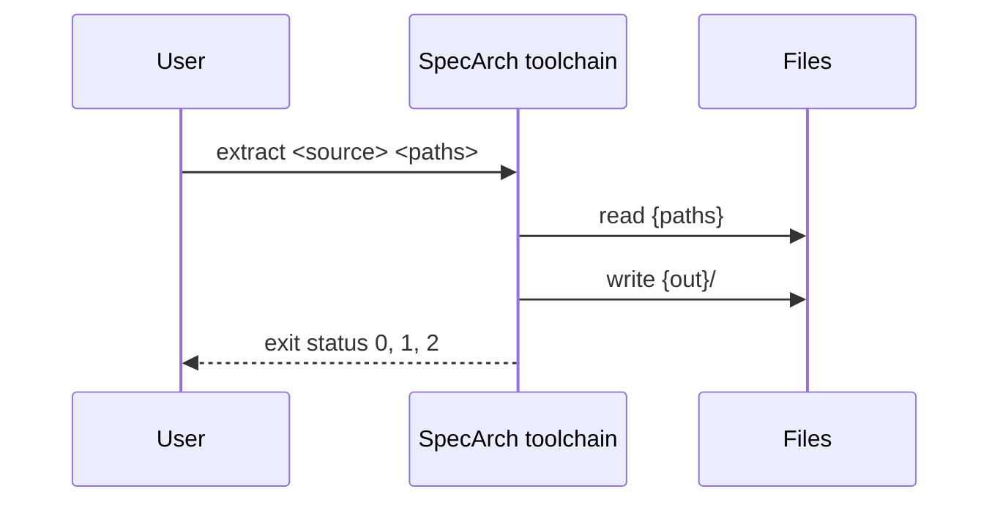

### Command gaps

Validates its input first, and prints the open questions document
of a specification with errors too (ADR-065), the text
`document questions` writes, from its title: the counts by
priority, the elements by origin when the specification tracks it,
the errors, one problem line each, when it has any, the questions
of what could be read grouped by stage in
life-cycle order and within a stage by priority then ID, each with
who decides, what it blocks (and for a blocked element, which keys
are missing there), the name it gives for the key it blocks with
the file and line of the element that leaves the key out, its
options, its Insight and Notes; then, when
a source lists its clauses, the coverage: per such source, the
elements each clause produced, how many clauses produced nothing,
and the citations outside the listed clauses; then the outputs, one row per document target and per code target the
implementation files name, each ready, a draft (the questions and
the errors that concern it) or waiting (the errors, the questions,
and the approval that is missing or void).

**Insight:** The owner and the agent run validate after every edit, so validate counts the open questions and lists none; this verb is the list, with what each question holds up, so that the next decision is always in view. The same text is the document, because the people who decide read documents, not terminals.

**Note:** From ISO/IEC/IEEE 29148, Systems and software engineering, Life cycle processes, Requirements engineering, 2018, clause 6.6.3: The closure of to-be-determined and to-be-resolved items against plan is a measure of the requirements work. <https://www.iso.org/standard/72089.html>

| Argument or option | Type | Required | Description |
|---|---|---|---|
| `<paths>` | string, one or more | yes | Folders holding specifications, searched as validate searches them. |

Reads `{paths}`: The specifications and their implementation files; `records/approvals/<version>.yaml`: The approval of the specification's version, beside its folder, when there is one.

Standard output: The open questions document of each specification, with its errors listed in it.

Standard error: A usage message on a usage error, and the reason on an unreadable path.

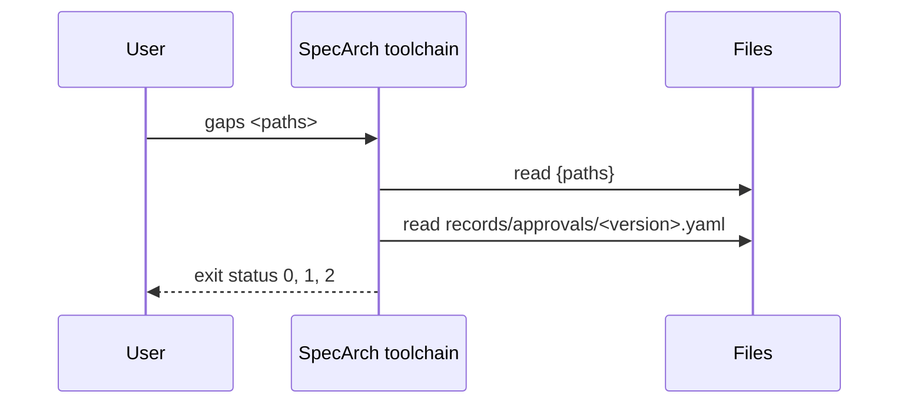

### Command generate

Validates its input first and writes nothing from an invalid
specification. Then refuses, with status 1, while a must or should
question blocks a section the target reads: the sections the
implementation file names under `targets.<target>.reads`, or every
section when it names none. Then refuses, with status 1, when
`records/approvals/<version>.yaml` is missing or its digest is not the
digest of the specification's files now, unless `--unapproved` is
given. Then writes the target into the folder it owns, and nothing
outside it. With `--check` nothing is written: the output is made in
memory and compared with what is on disk.

A target this program does not build in is produced by a plug-in found
on PATH. For each implementation file that names the target under
`targets` (every implementation file when none does), the plug-in is
`specarch-gen-<target>-<stack>` when there is one, where the stack is
the file's `stack.language.name` in lower case with a dash for a space,
and `specarch-gen-<target>` otherwise; neither found is status 2. Files
that find the same plug-in and name the same output folder run it
together, a file that names none joining the others of its plug-in,
and each run writes into the folder its files name, so `--out` is
refused when the files reach more than one plug-in or folder. The program runs each plug-in once per
specification with a request on its standard input, as JSON:
`specarch` (the meta-model version), `target`, `root` (the root file's
path), `specification` (the merged, validated specification as plain
values), `implementations` (each implementation file as `file`,
`content`, the target's `settings` from it, and `idioms`, the idioms
it uses, each with its `name`, `version`, how it applies (`as`:
shipped, overridden, project or excluded), the `content` of the idiom
that applies and the project's `override`) and `output` (the folder
the files are for), and `existing`, the text files already in that
folder by their path in it, so a plug-in that adds files, such as a
migration beside a snapshot, knows what is there without reading the
disk. The plug-in answers on its standard output,
as JSON, with `files` (each a `path` relative to the output folder and
its `content`) and `diagnostics` (each with the validator's fields:
file, line, severity, path, rule, message, and a column when it
knows one), and exits 0. The program places each diagnostic at its
entry: one at the root file, whose path leads to an entry of the
merged specification, is put at the fragment, line and column that
entry was read from; a column not given is derived as validate
derives it; and the id is made as validate makes it. It prints the
diagnostics in validate's line, refuses a path outside the output folder,
and writes or checks the files itself. A plug-in that exits with
another status, or answers with something else, fails the run with
status 2; its standard error is passed through.

An element whose mapping in the implementation file names a
stakeholder under `ownedBy` is owned by that stakeholder: a plug-in
that builds code or data writes nothing for it or for anything under
its pointer, and an element that refers to it still refers to it; the
tests target, which checks rather than builds, keeps it (ADR-046). The gate does not look
at the mark, so a question that blocks an owned element still holds
the target up.

**Insight:** One program with verbs, and generators as plug-ins found on PATH, is the pattern of protoc, git and kubectl: one name to learn and install, one parser, one diagnostic format and one version shared by every target, and new targets added without changing the program. Letting the program write the files, as protoc does, keeps `--check` and the rule "only into its folder" true for every plug-in without each one having to implement them.

**Note:** From Protocol buffers compiler plug-in protocol, plugin.proto, 2024: A plug-in reads a CodeGeneratorRequest from standard input and writes a CodeGeneratorResponse to standard output; the file names it answers are relative to the output directory, and protoc writes them. <https://github.com/protocolbuffers/protobuf/blob/main/src/google/protobuf/compiler/plugin.proto>

| Argument or option | Type | Required | Description |
|---|---|---|---|
| `<target>` | string | yes | A code or data target, built in or offered by a plug-in; kebab-case. |
| `<paths>` | string, one or more | yes | Folders holding specifications, searched as validate searches them. |
| `--out` | string |   | The folder the target owns. Without it, the folder the implementation files' `targets` name for the target, relative to each implementation file; they must agree. |
| `--check` | bool |   | Make the output in memory and fail when the files on disk differ. Writes nothing. |
| `--unapproved` | bool |   | Generate from a specification that no approval record covers. The refusal is the default; this says, visibly, that the output is not from an approved specification. |

Reads `{paths}`: The specifications and their implementation files; `records/approvals/<version>.yaml`: The approval of the specification's version, beside its folder; `{out}`: The current output, with `--check`; `specarch-gen-{target} on PATH`: The plug-in for a target that is not built in.

Writes `{out}/`: The files the target produces, as the plug-in answers them. Nothing is written with `--check`.

Standard output: The diagnostics of an invalid specification and the diagnostics the
plug-in answers with, one line each. With `--check`, one line per
file that differs or is missing.

Standard error: A usage message on a usage error, the reason a plug-in was not found or failed, the plug-in's own standard error, and a one-line count at the end.

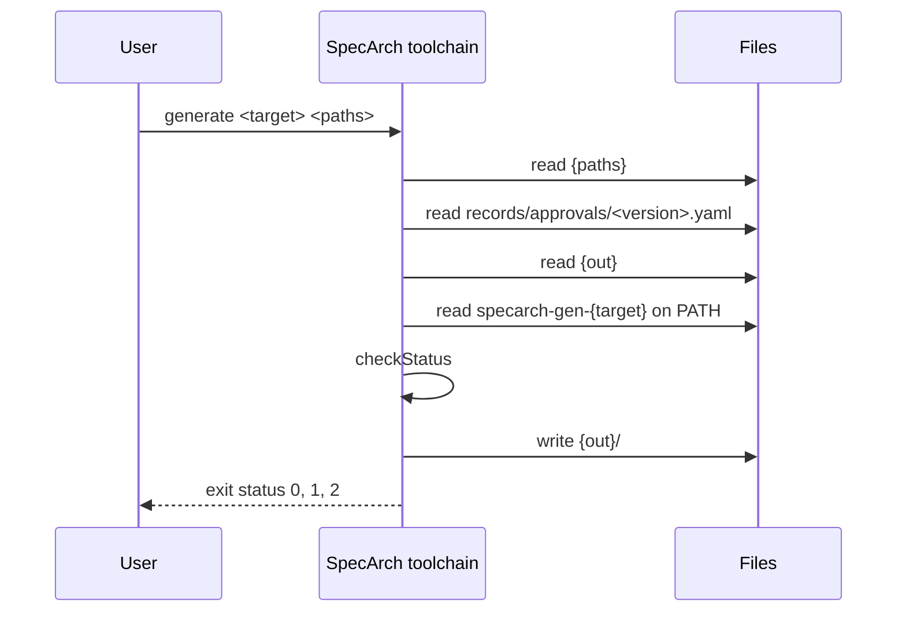

### Command idioms

Validates its input first and prints nothing but the errors from a
specification that has them. Then prints, for every implementation
file of every specification, its path and one line per idiom: every
shipped idiom and every one of the project's own that applies to the
file, by its stacks and by the keywords the specification uses, with
its version and how it applies: shipped, overridden (by which file,
copied from which version, replacing which parts), the project's own,
or excluded; an override's or an exclusion's reason follows.

**Insight:** The shipped idioms apply without a word in the implementation file, so a reader needs one place that says which ones do, and where the project deviates.

| Argument or option | Type | Required | Description |
|---|---|---|---|
| `<paths>` | string, one or more | yes | Folders holding specifications, searched as validate searches them. |

Reads `{paths}`: The specifications, their implementation files, and the idioms folder beside each.

Standard output: The errors of an invalid specification, one line each; otherwise each implementation file's path and its idioms, one per line.

Standard error: A usage message on a usage error, and the reason on an unreadable path.

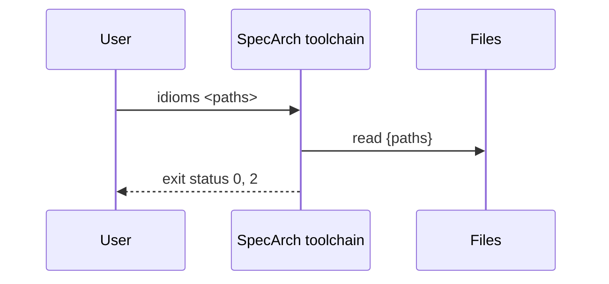

### Command idioms diff

Validates its input first, as idioms does. Then, for every
implementation file that overrides the named idiom, prints the
override's file, the version it was copied from and the version this
program ships, and for each part it replaces and each stack the
override renders, the shipped rendering and then the override's, as
YAML. With no override of the idiom, it says so.

**Insight:** An override records the version it was copied from, and the validator warns when a newer one ships; this is how the project sees what changed before it moves.

| Argument or option | Type | Required | Description |
|---|---|---|---|
| `<idiom>` | string | yes | The name of a shipped idiom. |
| `<paths>` | string, one or more | yes | Folders holding specifications, searched as validate searches them. |

Reads `{paths}`: The specifications, their implementation files, and the idioms folder beside each.

Standard output: The errors of an invalid specification, one line each; otherwise each override with the shipped and the overriding renderings of what it replaces.

Standard error: A usage message on a usage error, the reason on an unreadable path, and that the idiom is not shipped.

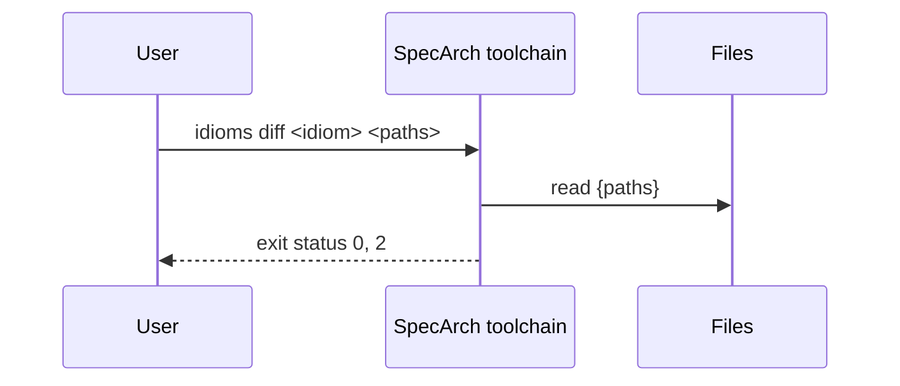

### Command merge

Reads two or more partial specification trees, each written by
`specarch extract` or by hand from documents, and writes one
specification that holds every element of them, following
`docs/from-sources.md`, section 3.2. Each tree is checked on its own
first: a tree that does not track origin, that validate reports an
error in, or that holds tests, implementation files or records is
refused.

- The same element in two trees (an entry of a section by its name,
  an operation by its path and method, a field by its entity and
  name) becomes one element with the citations of both. A key only
  one tree writes is kept. A key the trees give different values is
  left out, and a must question cites both and blocks it. An
  entity's `required` is compared field by field: a field only one
  tree has keeps what that tree says, and a field both have that
  one requires and the other does not is left out of `required`,
  with a must question on that field that blocks the entity's
  `required`.
- An entity's field holding a schema in columns is written out as
  `specarch generate sql` writes it, every part's column and the
  check that an optional value is wholly absent or has its required
  parts, and compared with the code side's fields (ADR-077). Where
  every part's column is there with the type, width and nullability
  its part gives it, every check of the entity naming one of them is
  such a presence check, and every presence check the field writes
  is there, the columns, their place in `required` and those checks
  are left out, the field is the code's too, and a line names them;
  a key only the column gives is written into the part, and a part
  that refers to an enum or a schema is compared on its nullability
  only. A tree's question on a column or a check read back so, or on
  a JSON column read as a schema, is left out with a line. Where only
  some parts have a column, a column differs from its part, another
  check names one, a presence check is missing, or the field is held
  as json and has columns, nothing is joined and a must
  question at the field names each difference. A field one tree
  gives as a schema and another as an object is that schema with
  storage json. Where no tree has a field holding a schema, and an
  entity's code-side fields are every part's column of a schema
  under one prefix, a should question at those fields asks whether
  they are one value, a field named after the prefix, or fields of
  their own.
- An element is stated when a tree states it; it is inferred only
  when every tree that has it infers it.
- A tree whose sources are all code is on the code side; any other
  tree is on the documents side. Where both sides are merged, an
  element of a design section that only one side has is compared
  with the other side when that side has elements in the same
  section, or, for a field, the same entity. Only the code has it:
  it is written inferred, with a why that starts "Undocumented, from
  code." and names where, and a question asks the owner to confirm
  it; a field, which holds no origin of its own, is written as the
  code has it, and only the question says so. Only the documents have it: it is written as they state it,
  and a question in `implementation/questions.yaml`, blocking
  `implementation`, starts "Not built yet." and cites the documents
  and the code that was read. Either question is must when the
  element concerns security (a role, a permission, an operation, or
  an entity or field that is personal or a credential) or when a
  source it cites is marked `givenOutside`; otherwise it is should.
- A requirement of the documents side whose statement gives one
  number of days, such as "The loan period is 21 days.", is compared
  with the check constraints of the code side that move a date by
  exactly one number of whole days. When exactly one such check has
  every word of the statement's subject in its name (the words
  before is, are, shall, must, will or should, without the, a, an,
  of, each and every), the check satisfies the requirement. When the
  numbers differ, the requirement's statement is left out and one
  must question cites both and blocks it; the check keeps the
  expression the code runs. No match, or more than one, changes
  nothing (ADR-048).
- A code source says how it was read: `reading: printed` for a list
  the running system printed, such as a route table or the document
  dxlib emits, `reading: parsed` for source read by a parser
  (ADR-075). A tree whose code sources all say the same reading
  has it. Where a printed and a parsed tree both have operations,
  an operation only the parsed tree declares keeps what it states,
  and a must question that starts "Declared, not
  registered:" cites the line that declares it and names the
  printed trees, since the running system does not list it: the
  code is never reached, or only under a setting, or the printer
  misses it. An operation only the printed trees have keeps its
  citations, and a could question that starts "Registered by code
  the reader does not follow:" cites them. Entities and roles are
  compared the same way where a printed and a parsed tree both have
  them: an entity only the source declares is a must question that
  starts "Declared, not in the database:", one only the catalogue
  holds a could question that starts "In the database, declared
  nowhere the reader follows:"; a role only a seed grants is a must
  question that starts "Seeded, not granted:", one only the
  permission table holds a could question that starts "Granted,
  seeded nowhere the reader follows:". A role both give grants what
  the printed trees grant, since that is what the check reads, with
  every tree's citation and no disagreement asked on its list; a
  grant only a seed makes is a must question that starts "Seeded,
  not granted:" blocking the role's permissions and the permission,
  and one only the table holds a could question that starts
  "Granted, seeded nowhere the reader follows:".
- Every reader asks about a check that lets every request through
  while a setting is empty in the same words, "The check <check>
  runs only when the setting <setting> is present." (or "is true."
  for a boolean setting). Where a printed
  and a parsed tree both ask about one check, by its name, the merge
  asks it once with every tree's citation, and names both settings
  when they differ. One only the parsed tree asks, where a printed
  tree holds roles, is a must question that adds that the
  permission table does not declare the gate; one only the printed
  tree asks, where a parsed tree holds operations, keeps its
  question and adds a could question that starts "Declared, not
  found:", since the check's code is outside the middlewares the
  parser reads.
- A parsed tree's must question that blocks one of its own
  operations, entities or roles and nothing else asks whether the
  running system registers it, holds it or grants it. A printed
  tree that gives the element answers it, and it is left out with a
  line naming that tree; where printed trees have elements of that
  section and not this one, it is left out too, and the question of
  the row above asks it with what they printed.
- Sources of the same key are one source when they are the same in
  everything but their clauses, which are joined, and their
  reading: the merged source keeps a reading every tree gives it
  and says none when one tree read it printed and another parsed. Code sources that
  differ only in their edition are one repository read at different
  commits: the merged edition is the newest of them, which each
  other is an ancestor of, and every path a tree read must be
  unchanged from the commit it was read at up to it. Sources of the
  same key that differ otherwise are refused.
- Where both sides have operations, a documents-side source none of
  whose operations' paths the code side has, such as an OpenAPI file
  left from a template, is reported as a placeholder, with the
  number of its paths; its operations are compared as any other
  (ADR-049).
- A question of a tree whose every blocked key another tree gives
  is left out, since that tree answers it and the element cites
  both; a question that blocks a stage, an element or a key no tree
  gives is kept (ADR-049). An element the asking tree writes only by
  name, as an empty mapping, is one it does not give, so a tree that
  gives it with content answers the question, such as a field a page
  shows whose type the database gives (ADR-057).
- A question of a tree that names, under `names`, the operation a
  key it blocks refers to, such as a workflow's trigger or a step's
  operation, or a page's source or submit, is left out as joined
  when another tree declares an operation of that name: the name is
  written at the key, where the design schema puts it, and the line
  names the trees that declare it. A name no tree declares keeps
  its question.
- A question of a tree whose every blocked key a question kept
  before it blocks, with the same priority, is left out, since both
  ask the same thing, such as a permission's description that the
  router and the permissions reader each ask for (ADR-050). A
  could question is never left out so: it holds nothing, and two
  at one entry are two things a reader could not hold there.
- Where the code side has operations, a permission a role grants
  and no operation, command or page checks is reported with the
  roles that grant it, since a grant nothing checks is either left
  from code that was removed or guards something the routes do not
  show (ADR-050).
- The questions of the trees are numbered again, Q-1 upward, in the
  order the trees are given, and the merge's own questions follow.
  Every element keeps the file its first tree wrote it in.
- The same trees in the same order give byte-identical output.

**Insight:** The readers write one tree per surface so that each is checked on its own; the comparison between surfaces, and between the documents and the code, is made once, here, where a disagreement becomes a question rather than a choice.

| Argument or option | Type | Required | Description |
|---|---|---|---|
| `<trees>` | string, one or more | yes | The partial specification trees to merge, each a folder holding specarch.yaml, in the order their questions are numbered. |
| `--out` | string | yes | The folder the merged specification is written into; it becomes the specification's root folder. |

Reads `{trees}`: The partial specification trees.

Writes `{out}/`: The merged specification.

Standard output: One line per tree naming its title, its side, its reading where it
has one, and what it holds; one line per
source joined from several trees, naming the edition taken; one line
counting the elements written and those found in more than one
tree; one line per field read back from its columns, and one per
question that what was read back answers; one line per requirement joined to a check that gives the
same number of days; one line per question of a tree that another
tree answers or a question kept before it asks, and per parsed
tree's question on whether the running system registers an
operation, holds a table or grants a role that a printed tree
answers or the merge asks again; one line per gate question joined
or asked again; one
line per
question whose name is joined to the operation another tree
declares; one line per
placeholder source; one line per permission granted and checked by
nothing; and one line per
question the merge asked, naming what it blocks and why.

Standard error: A usage message on a usage error, and the reason a tree could not be merged.

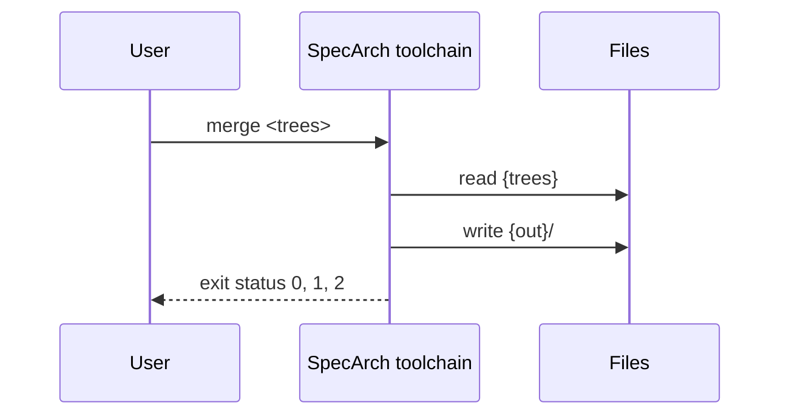

### Command validate

Checks every specification found under the paths given: a folder that
holds `specarch.yaml` is one specification, read as a whole, including
the implementation files under its `implementation/` folder; nothing
under it is searched further, so a test folder's data files are never
read as specifications. An implementation file outside any
specification is checked on its own against the specification its
`implements` names. A file given by name must be a root file or an
implementation file; a fragment of a tree is refused with the folder
to run on instead. The records in the `records/` folder beside a
specification's folder are checked with it.

Every specification is checked against the meta-model and against the
rules JSON Schema cannot express. It reports every problem in every
file, not only the first.

| Argument or option | Type | Required | Description |
|---|---|---|---|
| `<paths>` | string, one or more | yes | Folders and files. A folder is searched for specifications and for implementation files outside one. |

Reads `{paths}`: Root files, the files under their stage folders, and implementation files; `records/ beside each specification's folder`: The change, defect, release, incident, commissioning and approval records of that specification; `the specification named in each standalone implementation file's `implements``: Read to resolve that file's references.

Standard output: One line per diagnostic, `file:line:column: severity: /yaml/path: rule: message [id]`, sorted by file, then line, column, path, rule, message and id.

Standard error: A usage message on a usage error, the reason on an unreadable path, and a one-line count at the end, with the number of open questions when there are any.

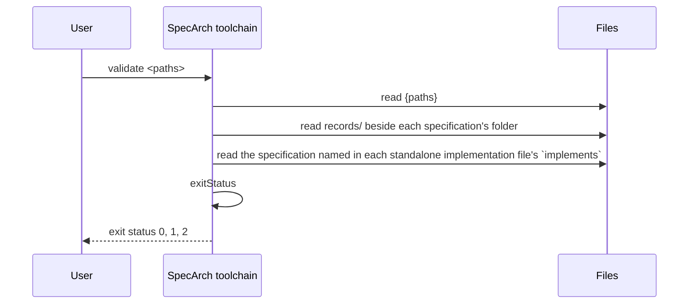

### Command version

**Insight:** One version answers which SpecArch made a file; every generated file's header names it.

Standard output: The program version, then one line per meta-model version it supports.

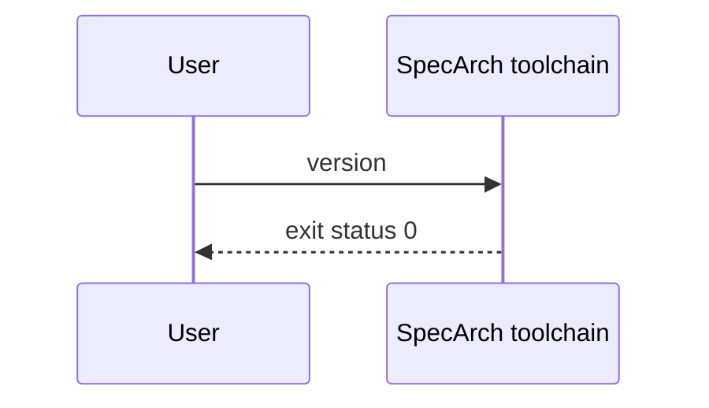

## 7. Deployment and implementation

### Environments

| Environment | Purpose | Promotes to |
|---|---|---|
| developer-machine | The machine of a person who writes specifications; the program is installed from source with one command. | ci-runner |
| ci-runner | The continuous-integration runner of a project that uses SpecArch; it builds the program from the pinned version in that project's workflow. |   |

### Release

A release is a tagged commit of this repository; nothing is uploaded anywhere, since every user builds the program from source.

**Note:** From ISO/IEC/IEEE 12207, Systems and software engineering, Software life cycle processes, 2017, clause 6.4.10: The transition process establishes the capability to provide the service in its operational environment. <https://www.iso.org/standard/63712.html>

| Step | Action | Check |
|---|---|---|
| 1. Check the tree | Run the implementation's build, test, validate and document --check tasks on the commit to release. | Every task exits 0. |
| 2. Tag the commit | Tag the commit with the program version, as the version command prints it. | The tag's name equals the output of specarch version. |
| 3. Announce | Write the release in the history file of the day, with the tag. | The history file names the tag. |

### Rollback

A user who hits a problem in a release installs the previous tag; the tags of every release stay.

| Step | Action | Check |
|---|---|---|
| 1. Install the previous tag | Install the program from the previous release tag with the implementation's install task. | specarch version prints the previous version. |
| 2. Record the problem | Open an issue naming the release and the problem, and note the rollback in the history file. | The issue exists and the history file names it. |

### Commissioning checks

Run on the installed system before it is handed over. The results of each run are records kept outside the specification.

#### installs-and-answers (smoke, in developer-machine)

The program installs from the release tag on a clean machine and answers.

| Step | Action | Check |
|---|---|---|
| 1. Install | Install the program from the release tag with one command, on a machine that has never had it. | The command exits 0. |
| 2. Run version | Run specarch version. | It prints the program version and the meta-model versions it reads, and exits 0. |

#### checks-the-examples (end-to-end, in developer-machine)

The installed program validates the example and this specification, and reproduces their committed documents.

| Step | Action | Check |
|---|---|---|
| 1. Validate | Run specarch validate on spec and examples of the release tag. | It exits 0 with no error. |
| 2. Compare the documents | Run specarch document techspec --check on spec and examples. | It exits 0 and names no file. |

#### no-network (security, in ci-runner)

The installed program needs no network.

**Note:** From IEC 62381, Automation systems in the process industry, Factory acceptance test (FAT), site acceptance test (SAT) and site integration test (SIT), 2024: A site acceptance test is run on the installed system in its real environment before it is accepted.

| Step | Action | Check |
|---|---|---|
| 1. Run offline | Run specarch validate on the example with the network switched off. | It exits 0; nothing waits on a connection. |

### Sign-off

The system is accepted when:

- Every check above passed on the release tag, and the record of the run is committed.
- The history file of the day names the tag.

Signed by: specarch-maintainers.

### Monitors

What is watched on the live system, and the objective each must meet.

| Monitor | Environment | Measures | Objective | Verifies |
|---|---|---|---|---|
| main-stays-green | ci-runner | The continuous-integration run on every change to main, both the Go and the Swift job. | Every run on main passes both jobs; a failed run is fixed or reverted before the next change lands. | SA-1, SA-7 |

**Insight on main-stays-green:** The documents and both builds are only trusted while CI keeps them current, so a red run on main is the one thing that must never stay.

### Implementation: SpecArch toolchain in Go

From the implementation file version 0.1.0.

The Go implementation of the specification in `spec/`: one static binary,
`specarch`, installed with `go install ./cmd/specarch`.

Stack: language Go 1.26; toolchain go 1.26.0; platforms darwin/arm64, darwin/amd64, linux/amd64, linux/arm64, windows/amd64.

#### Libraries

| Library | Version | Licence | Purpose |
|---|---|---|---|
| github.com/santhosh-tekuri/jsonschema/v6 | v6.0.3 | Apache-2.0 | JSON Schema 2020-12 validation against the schemas in `schema/`; the same library the repository's pinned `jv` check used. |
| golang.org/x/text | v0.42.0 | BSD-3-Clause | Message printing for the schema library. Pinned above 0.39.0, which fixes GO-2026-5970. |
| go.yaml.in/yaml/v3 | v3.0.5 | MIT AND Apache-2.0 | YAML parsing into a node tree, which keeps the line of every value for diagnostics. |
| cel.dev/cel-go | v0.32.0 | Apache-2.0 | The CEL parser; only its parser is used. |
| cel.dev/expr | v0.25.1 | Apache-2.0 | CEL's expression tree types, needed by the parser. |
| github.com/antlr4-go/antlr/v4 | v4.13.1 | BSD-3-Clause | The parser runtime the CEL grammar is generated for. |
| google.golang.org/protobuf | v1.36.10 | BSD-3-Clause | Needed by the CEL parser's tree types. |
| google.golang.org/genproto/googleapis/api | v0.0.0-20240826202546-f6391c0de4c7 | Apache-2.0 | Needed by the CEL parser's tree types. |
| google.golang.org/genproto/googleapis/rpc | v0.0.0-20240826202546-f6391c0de4c7 | Apache-2.0 | Needed by the CEL parser's tree types. |
| golang.org/x/exp | v0.0.0-20240823005443-9b4947da3948 | BSD-3-Clause | Needed by the CEL parser. |

#### Layout

| Path | Holds | Implements |
|---|---|---|
| cmd/specarch | The command line. Argument handling, finding the specifications under folders, running plug-ins, printing the diagnostics and the exit status. | #/commands/validate, #/commands/gaps, #/commands/document, #/commands/approve, #/commands/generate, #/commands/extract, #/commands/merge, #/commands/diff, #/commands/derive, #/commands/idioms, #/commands/idioms diff, #/commands/version, #/entities/SpecFile, #/entities/GeneratedFile, #/algorithms/exitStatus, #/algorithms/checkStatus |
| schema | The JSON Schemas, embedded into the binary from the files editors use. |   |
| idioms | The shipped idioms, one folder per concern, embedded into the binary; a release fixes the set. |   |
| internal/extract | The readers of specarch extract: the commit read (git, run with no user or system configuration), the outline, database, router, documents, OpenAPI, permissions, pages and workflows readers, the Go reader on the standard library's go/parser with dxlib's registration calls and the rule that maps dxlib_module's privilege names, the subset of TypeScript a page schema is read in, the subset of BPMN 2.0 a workflow is read in, the check of a dump against the commit it names, the translation of SQL checks into the expression subset, and the tree writer; and the merge of their trees, with the newest commit of a repository read at several found by git's ancestry, a requirement that gives a number of days joined to the one check that names it, a question another tree answers, by giving a key or an element the asking tree gives only by name, or a question kept before it asks left out, the name a question gives written at the key it blocks once another tree declares it, a placeholder source reported, a permission granted and checked by nothing reported, and an operation a printed and a parsed tree do not both give asked about. |   |
| internal/source | Reads a YAML file into a node tree and a plain value, with the line of every node; finds unquoted dates and duplicate keys. |   |
| internal/spec | Reads a specification from disk, the root file and the stage folders, and merges it into one document in which every node remembers its file; reports the layout problems. |   |
| cmd/specarch-gen-sql | The plug-in behind generate sql. Reads the request on standard input, answers the migration and the snapshot on standard output, and never touches the disk. | #/commands/generate |
| internal/gensql | The SQL migrations in four dialects, each column through the type-rendering idiom, with check expressions translated per dialect, the views after the tables, and a snapshot of the schema; an entity or view another stakeholder owns gets no statement, and the snapshot lists it as owned. |   |
| internal/ownership | Reads the ownedBy marks of an implementation file's mappings, which every generator that builds code or data follows by leaving the owned elements out. |   |
| internal/typerows | Matches a field to a row of a type rendering, for the validator and the generators alike. |   |
| cmd/specarch-gen-openapi | The plug-in behind generate openapi. Reads the request on standard input, answers the OpenAPI document on standard output, and never touches the disk. | #/commands/generate |
| internal/genopenapi | The OpenAPI 3.1 document in the standard dialect, the design field for field, with the problem catalogue and lists paged through the paginated-list idiom; and in the dxlib dialect, what dxlib's reader binds. |   |
| cmd/specarch-gen-go-dxlib | The plug-in behind generate go-dxlib. Reads the request on standard input, answers the Go file on standard output, and never touches the disk. | #/commands/generate |
| cmd/specarch-gen-ui | The plug-in behind generate ui. Reads the request on standard input, answers the screens on standard output, and never touches the disk. | #/commands/generate |
| internal/genui | The list pages for the web in plain JavaScript, the events they raise, and the theme as CSS custom properties. |   |
| cmd/specarch-gen-ui-typescript | The plug-in behind generate ui for an implementation file in TypeScript. Reads the request on standard input, answers the screens on standard output, and never touches the disk. | #/commands/generate |
| internal/genuits | The task, list and form pages and the views for the web on Next.js and Carbon, with child rows, actions that run an operation after a confirmation and its reason, forms that start an approval and inboxes, each a schema of data and a thin page.tsx, a client file that hands on the hooks a project writes, the guard and the menu from one decision, the derived tests, the components that read the schemas, the strings in every language the settings name with the check that each key has an entry, the server routes that forward the operations the pages call with the session's token, and the theme over Carbon's through the design-tokens idiom, drawn through the ui-components idiom's names. |   |
| internal/gendxlib | The Go file of a service on dxlib, its tables, handlers, seeds and tasks, read from the design through the dxlib dialect's names and types. |   |
| cmd/specarch-gen-tests-go | The plug-in behind generate tests for a Go implementation file. Reads the request on standard input, answers the Go test file on standard output, and never touches the disk. | #/commands/generate |
| cmd/specarch-gen-tests-swift | The plug-in behind generate tests for a Swift implementation file. Reads the request on standard input, answers the Swift Testing file on standard output, and never touches the disk. | #/commands/generate |
| cmd/specarch-gen-tests-dart | The plug-in behind generate tests for a Dart implementation file, a Flutter app's included. Reads the request on standard input, answers the Dart library and test file on standard output, and never touches the disk. | #/commands/generate |
| internal/gentests | The tests a specification implies, as the three test plug-ins write them. The specification is read once into a model of tests and worked examples, and written in Go, in Swift for Swift Testing, or in Dart for package:test or flutter_test, each with the Harness the project implements beside it; design tests become tests through it, worked examples unit tests of the algorithm's mapping. |   |
| internal/semver | Semantic Versioning 2.0.0 versions, their precedence, and the step one needs from another, with the step before 1.0.0; the release rules and diff measure a release with it. |   |
| internal/diff | Compares two merged specifications element by element, finds the public interface, and classifies each difference by the version step it needs. |   |
| internal/approval | The approval record beside a specification, its digest of the specification's files, and where a version's approval stands against the files now. |   |
| internal/expr | The expression subset. Parses with the cel-go parser, refuses what is outside the subset, type-checks with CEL's strict rules, and evaluates with exact integers and decimals. |   |
| internal/generate | The document targets. techspec writes the arc42 document and its Mermaid diagrams and rewrites the regions between markers in hand-written Markdown; requirements, testplan, traceability, deployment and commissioning write the other documents; questions writes the open questions and what they hold up, the text gaps prints. Every one renders why as an Insight, each citation as a Note, an element's origin as an Origin line and the open questions about it as Open question paragraphs. | #/algorithms/markersWellFormed |
| internal/problems | The problems of a specification, valid or not, gathered from validate's diagnostics and the open questions into one list with ids, columns and notes, and written as problems.txt and as a SARIF 2.1.0 log. | #/entities/Problem, #/entities/ProblemNote, #/enums/ProblemSeverity |
| internal/validate | Schema validation with plain messages, the interface boundary, cross-references across the tree, fail-closed access, concrete integers, expressions, worked examples, tests and their derived cases with the rank of each and the cases left out, the life-cycle links and traceability warnings, the open questions and what they cover, origin, implementation references, and the records beside the specification. | #/entities/Diagnostic, #/enums/Rule, #/enums/Severity, #/algorithms/referenceResolves, #/algorithms/permissionGranted, #/algorithms/workedExampleHolds |

#### Mappings

| Design object | Implemented by | Notes |
|---|---|---|
| #/entities/Diagnostic | validate.Diagnostic | A struct; `String()` prints the one-line form. |
| #/entities/SpecFile | main.input | A root folder, an implementation file or a file given by name; the versions are read where they are checked. |
| #/enums/Rule | validate.Rule | A string type with one constant per value; validate.Rules lists them, and a test checks they equal the design's enum. |
| #/enums/Severity | validate.Severity |   |
| #/entities/Problem | problems.Problem | A struct; `String()` prints the problem line, and its notes follow it. |
| #/entities/ProblemNote | problems.Note | A struct inside its problem, in order; `String()` prints the note line. |
| #/enums/ProblemSeverity | problems.Severity |   |
| #/commands/validate | main.runValidate |   |
| #/commands/gaps | main.runGaps | Prints generate.Questions, the text the questions document target writes. |
| #/commands/approve | main.runApprove | Writes the record through the approval package after checking the documents with generate.Document. |
| #/commands/version | main.runVersion |   |
| #/commands/document | main.runDocument |   |
| #/commands/generate | main.runGenerate | Refuses through main.gate while a question blocks what the target reads or the approval is missing or void; then runs the plug-in with main.runPlugin; the request and answer are the pluginRequest and pluginResponse structs. |
| #/commands/extract | main.runExtract | Runs the reader of the source, extract.Outline, extract.Database, extract.Router or extract.Documents, after extract.Open has named the commit read and refused what no commit names; extract.Tree writes the tree from ordered YAML nodes. |
| #/commands/merge | main.runMerge | Loads each tree with spec.Load and refuses one validate.CheckSpec reports an error in; extract.Merge joins the sources, the elements and the questions, and extract.Tree writes the result. |
| #/commands/derive | main.runDerive | Writes validate.Drafts, the drafts of the cases the warnings name. |
| #/commands/idioms | main.runIdioms | Prints validate.IdiomUses, the idioms each implementation file resolves to. |
| #/commands/idioms diff | main.runIdiomsDiff |   |
| #/commands/diff | main.runDiff | Lists diff.Compare's changes, then checks the release record beside the new folder. |
| #/enums/DocumentTarget | main.documentTargets |   |
| #/enums/GeneratorTarget | main.builtGenerators | Empty; every target is a plug-in. |
| #/entities/GeneratedFile | main.planned | A path and the content a target wants there; --check compares it with the disk. |
| #/algorithms/checkStatus | main.checkPlan |   |
| #/algorithms/markersWellFormed | generate.RewriteMarkers |   |
| #/algorithms/exitStatus | the end of main.runValidate |   |
| #/algorithms/workedExampleHolds | validate.checker.checkExample |   |
| #/algorithms/permissionGranted | validate.checker.checkAccess |   |
| #/algorithms/referenceResolves | the validate.checker.check... methods for each kind of reference |   |

#### Bindings

cli: standard library. Hand-written argument handling over `os.Args`; three commands do not justify a CLI library.

#### Targets

| Target | Output folder | Settings |
|---|---|---|
| techspec | ../../../docs |   |
| requirements | ../../../docs |   |
| testplan | ../../../docs |   |
| traceability | ../../../docs |   |
| deployment | ../../../docs |   |
| commissioning | ../../../docs |   |
| questions | ../../../docs |   |
| problems | ../../../docs |   |
| changes | ../../../docs |   |
| releases | ../../../docs |   |

#### Tasks

| Task | Command | In CI |
|---|---|---|
| build | `go build ./...` | yes |
| test | `go test ./...` | yes |
| vet | `go vet ./...` | yes |
| vulncheck | `go run golang.org/x/vuln/cmd/govulncheck@v1.8.0 ./...` | yes |
| validate-specs | `go run ./cmd/specarch validate spec examples` | yes |
| documents-current | `for target in techspec requirements testplan traceability deployment commissioning questions; do go run ./cmd/specarch document $target --check spec examples \|\| exit 1; done` | yes |
| install | `go install ./cmd/specarch` |   |
| sbom | `syft dir:. -o syft-json=sbom.json && grype sbom:sbom.json && osv-scanner scan source -r .` |   |

#### Testing

Framework: go test. Run: `go test ./...`.

Fixtures: The conformance suite is the tests stage of the specification, `spec/tests/`; each test folder holds the design test, the case's arguments and output in `case.yaml`, the input files and the expected output. The Go tests read it and add none of their own.

Stand-ins: None. Every test runs the real program on real files.

| Suite | Level | Runs | Command |
|---|---|---|---|
| conformance | system | every design test of command validate, command gaps, command document, command approve, command generate, command extract, command merge, command idioms, command idioms diff, command version | `go test ./cmd/specarch` |
| shipped-idioms | unit | tests of this implementation only | `go test ./internal/validate` |
| generated-sql | unit | tests of this implementation only | `go test ./internal/gensql` |
| generated-openapi | unit | tests of this implementation only | `go test ./internal/genopenapi` |
| generated-ui | unit | tests of this implementation only | `go test ./internal/genui` |
| generated-go-dxlib | unit | tests of this implementation only | `go test ./internal/gendxlib` |
| generated-tests | unit | tests of this implementation only | `go test ./internal/gentests` |
| generated-screens | unit | tests of this implementation only | `go test ./internal/genuits` |
| expressions | unit | tests of this implementation only | `go test ./internal/expr` |

#### Idioms

How this implementation does each recurring concern: the idioms SpecArch ships apply unless the file excludes or overrides one, and an override replaces only the parts it names (docs/idioms.md).

| Idiom | Version | Applies as | Parts the project replaces |
|---|---|---|---|
| audit-fields | 1.1.0 | shipped |   |
| authorization-check | 1.0.0 | shipped |   |
| error-response | 1.1.0 | shipped |   |
| identifiers | 1.1.0 | shipped |   |
| migrations | 1.0.0 | shipped |   |
| type-rendering | 1.2.0 | shipped |   |

#### Implementation decisions

##### ADR-101: Go, one static binary

Status: accepted, 2026-10-07.

Context: The validator must be installable by anyone with one command and run in CI without a runtime.

Decision: Go. `go install` builds it from source; the binary has no runtime dependency.

Consequences: The schema library is a Go module. Document targets are Go too, in the same binary; code targets are plug-ins in any language.

##### ADR-102: santhosh-tekuri/jsonschema as the schema library

Status: accepted, 2026-10-07.

Context: `jv`, the command of this library, is a common way to check a file
against the schemas alone. Using the same library means a file passes
the schema check in both.

Decision: Use `github.com/santhosh-tekuri/jsonschema/v6` with format assertion
on, and require `golang.org/x/text` v0.42.0 so GO-2026-5970 (fixed in
0.39.0) is not in the build.

Consequences: The same files pass as with `jv`. The schemas are embedded and registered under their `$id`, so validation needs no network.

##### ADR-103: The CEL parser from cel-go, with SpecArch's own checker and evaluator

Status: accepted, 2026-10-07.

Context: The design fixes expressions as a subset of CEL with exact numbers.
A parser of SpecArch's own could drift from CEL's syntax without
anyone noticing. CEL's own evaluator works in binary floating point
and would get money wrong.

Decision: Parse with the parser of `cel.dev/cel-go`, so every accepted
expression is real CEL syntax. Walk the tree it returns and refuse
every node outside the subset. Type-check and evaluate with code of
our own, using `math/big.Rat` for every number; a number literal's
exact text is read back from the source, not from the parser's
float.

Consequences: The parser brings ANTLR, protobuf and their support modules into the
build; each is listed under libraries with its licence and scanned.
Parser errors are rewritten into one plain sentence.

##### ADR-104: The YAML node tree, not decoding into structs

Status: accepted, 2026-10-07.

Context: Every diagnostic needs the line of the value it is about.

Decision: Parse with `go.yaml.in/yaml/v3` into `yaml.Node`, keep the tree for
lines, and convert it to plain values by tag for the schema check.
It is the maintained successor of the archived `gopkg.in/yaml.v3`.

Consequences: Rules walk the node tree directly. A date without quotes is caught by its tag before the schema check.

### Implementation: SpecArch toolchain in Swift

From the implementation file version 0.1.0.

A second implementation of the specification in `spec/`, for macOS,
built from the same specification as the Go one. It offers the validate
and version commands and passes the same conformance cases; the
documents, the generators, gaps, approve, diff, derive and idioms are built in Go only.

Stack: language Swift 6.0; toolchain Swift Package Manager 6.0; platforms darwin/arm64, darwin/amd64.

#### Libraries

| Library | Version | Licence | Purpose |
|---|---|---|---|
| github.com/jpsim/Yams | 6.2.2 | MIT | YAML parsing, with the libyaml C library bundled inside it. Pinned in Package.swift and Package.resolved. |

#### Layout

| Path | Holds | Implements |
|---|---|---|
| swift/Package.swift | The package. One library, one executable, one test target. |   |
| swift/Sources/specarch | The executable; it passes the arguments to the library and exits with its status. |   |
| swift/Sources/SpecArchKit | Everything else. Reading YAML, reading a specification tree into one document, the JSON Schema evaluator and its messages, the specification and implementation checks, the expression subset, tests and their derived cases with the rank of each, the life-cycle links, the open questions and origin, the records beside the specification, and the commands. | #/commands/validate, #/commands/version, #/entities/Diagnostic, #/entities/SpecFile, #/enums/Rule, #/enums/Severity, #/algorithms/exitStatus, #/algorithms/referenceResolves, #/algorithms/permissionGranted, #/algorithms/workedExampleHolds |
| swift/embed-schemas.sh | Writes the schemas of schema/ into the library as Swift source; a test fails when they differ. |   |

#### Mappings

| Design object | Implemented by | Notes |
|---|---|---|
| #/entities/Diagnostic | SpecArchKit.Diagnostic | A struct; its description is the one-line form. |
| #/entities/SpecFile | SpecArchKit.Input | A root folder, an implementation file or a file given by name; SpecArchKit.Spec reads a root folder into one merged document. |
| #/enums/Rule | SpecArchKit.Rule | A String enum with one case per value; a test checks they equal the design's enum. |
| #/enums/Severity | SpecArchKit.Severity |   |
| #/commands/validate | SpecArchKit.runValidate |   |
| #/commands/version | SpecArchKit.run |   |
| #/commands/document | SpecArchKit.run | Exits 2: this build offers no document target. |
| #/commands/gaps | SpecArchKit.run | Exits 2: the report is a document, built in Go only; the rules about questions are in this build. |
| #/commands/approve | SpecArchKit.run | Exits 2: the record is written by the Go build only. |
| #/commands/generate | SpecArchKit.run | Exits 2: this build runs no generator. |
| #/commands/extract | SpecArchKit.run | Exits 2: the readers are built in Go only. |
| #/commands/derive | SpecArchKit.run | Exits 2: writing tests is built in Go only; the derivation it writes is in this build. |
| #/commands/idioms | SpecArchKit.run | Exits 2: listing the idioms is built in Go only; the idiom checks are in this build. |
| #/commands/idioms diff | SpecArchKit.run | Exits 2, as idioms does. |
| #/commands/diff | SpecArchKit.run | Exits 2: the comparison of two versions is built in Go only; the release rules are in this build. |
| #/algorithms/exitStatus | the end of SpecArchKit.runValidate |   |
| #/algorithms/workedExampleHolds | SpecArchKit.Checker.checkExample |   |
| #/algorithms/permissionGranted | SpecArchKit.Checker.checkAccess |   |

#### Bindings

cli: standard library. Hand-written argument handling over CommandLine.arguments, as in the Go build.

#### Tasks

| Task | Command | In CI |
|---|---|---|
| build | `swift build -c release --package-path swift` | yes |
| test | `swift test --package-path swift` | yes |
| validate-specs | `swift/.build/release/specarch validate spec examples` | yes |
| embed-schemas | `swift/embed-schemas.sh` |   |
| sbom | `syft dir:swift -o syft-json=sbom.json && grype sbom:sbom.json && osv-scanner scan source -r swift` |   |

#### Testing

Framework: Swift Testing. Run: `swift test --package-path swift`.

Fixtures: The conformance suite, the tests stage of the specification, `spec/tests/`; the Swift tests read it and add none of their own.

Stand-ins: None. Every test runs the real program on real files.

| Suite | Level | Runs | Command |
|---|---|---|---|
| conformance | system | every design test of command validate, command version | `swift test --package-path swift --filter ConformanceTests` |
| expressions | unit | tests of this implementation only | `swift test --package-path swift --filter ExprTests` |

#### Idioms

How this implementation does each recurring concern: the idioms SpecArch ships apply unless the file excludes or overrides one, and an override replaces only the parts it names (docs/idioms.md).

| Idiom | Version | Applies as | Parts the project replaces |
|---|---|---|---|
| audit-fields | 1.1.0 | shipped |   |
| error-response | 1.1.0 | shipped |   |
| identifiers | 1.1.0 | shipped |   |
| type-rendering | 1.2.0 | shipped |   |

#### Implementation decisions

##### ADR-201: Swift and the Swift Package Manager, for macOS

Status: accepted, 2026-10-07.

Context: The design should be implementable in a second language with nothing changed but the implementation file.

Decision: Swift 6 with the Swift Package Manager; Foundation and the standard library wherever they do the job.

Consequences: The macOS build needs no Go toolchain. It offers validate and version; generate exits 2 until a Swift generator is wanted.

##### ADR-202: Yams for YAML, with SpecArch's own tag resolution

Status: accepted, 2026-10-07.

Context: Yams wraps libyaml and keeps every node's line, counted from 1, with a
block scalar's line on its indicator, as yaml.v3 does. It leaves plain
scalars untagged, and it refuses a repeated key outright, reporting
only where the mapping starts.

Decision: Parse with Yams and resolve plain scalars by YAML 1.2's core schema
(null, bool, int, float, timestamp), as yaml.v3 does. When Yams refuses
a repeated key, rename every later repeat in the text, keeping all
lines in place, and parse again, so each repeat is reported on its own
line with its path. The repeat keeps its own name in the node tree and
is left out of the plain value, as yaml.v3 does, so merging the files
of a specification sees what the Go build sees. Report a YAML error's
line by the rule yaml.v3 uses: the line its context starts, or the
problem's line when the context is on the first line; a scanner error
on that line, a parser error on the line before, corrected for the
unclosed-block messages.

Consequences: Diagnostics agree line for line with the Go build. For a few broken
files libyaml's newer version inside Yams explains the error
differently from yaml.v3 (an unclosed quote is one); the line and the
rule may then differ. A key repeated inside a flow mapping, such as
`{ a: 1, a: 2 }`, is refused as yaml_syntax at the mapping, where the
Go build reports duplicate_key for the repeat and checks the rest.

##### ADR-203: A JSON Schema evaluator for exactly the keywords the schemas use

Status: accepted, 2026-10-07.

Context: No Swift JSON Schema library reports errors in the shape the
diagnostics need, and the messages must be the same sentences as the
Go build's.

Decision: A small evaluator in SpecArchKit for the keywords of the two schemas.
Loading a schema with any other keyword fails, and a test loads both,
so a schema change cannot be ignored without anyone noticing. Regular
expressions run on ICU through NSRegularExpression, not RE2; the
schemas' patterns mean the same in both.

Consequences: The schemas stay the single definition. A new keyword in a schema is a failing test until the evaluator implements it.

##### ADR-204: A hand-written parser for the CEL subset, with CEL's positions

Status: accepted, 2026-10-07.

Context: There is no CEL parser for Swift, and error columns must match the Go build's, which come from cel-go.

Decision: A recursive-descent parser of the subset with CEL's precedence. It
places an identifier at its first character, an operator at the
operator and a call at its opening bracket, as cel-go does, and
refuses what is outside the subset with the same sentences.

Consequences: No dependency. A test pins the columns of each kind of node.

##### ADR-205: Foundation Decimal for every exact number

Status: accepted, 2026-10-07.

Context: The design asks for exact decimal and integer arithmetic. Swift has no arbitrary-precision number in its standard library.

Decision: Int, uint and decimal values are Foundation Decimal, exact to 38 significant digits, with range checks for int and uint as in the Go build.

Consequences: Results agree with the Go build, which uses unbounded rationals,
wherever a value has 38 digits or fewer. The design does not yet bound
a decimal's precision; that is reported as a finding.

## 8. Cross-cutting concepts

### Permissions

Access is fail-closed: every operation, command and page names the one permission it needs, and only the roles below grant one.

| Permission | public |
|---|---|
| public | everyone |

### Algorithm checkStatus

The status of `generate --check` and `document --check`.

Inputs: `invalidInput` (bool), `differingFiles` (int32). Output: int32.

Formula:

    invalidInput || differingFiles > 0 ? 1 : 0

| Worked example | Inputs | Expected | Note |
|---|---|---|---|
| output is current | invalidInput false, differingFiles 0 | 0 |   |
| a diagram was edited by hand | invalidInput false, differingFiles 1 | 1 |   |
| the spec does not validate | invalidInput true, differingFiles 0 | 1 |   |

Pseudocode:

```text
invalidInput = validate(paths) has errors
if invalidInput and the command is generate:
    return 1
wanted = generate(target, paths) in memory, for document from
         what could be read of an invalid specification too
differing = files in wanted whose bytes differ from disk,
            plus files on disk in the target's folder not in wanted
print each differing path
return 1 if invalidInput or differing else 0
```

### Algorithm exitStatus

The status of a whole `validate` run. A usage or read error outranks
diagnostics, because a run that could not read its input has not
checked it.

Inputs: `usageError` (bool), `ioError` (bool), `errors` (int32). Output: int32.

Formula:

    usageError || ioError ? 2 : (errors > 0 ? 1 : 0)

| Worked example | Inputs | Expected | Note |
|---|---|---|---|
| every file valid | usageError false, ioError false, errors 0 | 0 |   |
| three problems | usageError false, ioError false, errors 3 | 1 |   |
| no arguments | usageError true, ioError false, errors 0 | 2 |   |
| one file unreadable, another invalid | usageError false, ioError true, errors 2 | 2 |   |

Pseudocode:

```text
function exitStatus(usageError, ioError, errors):
    if usageError or ioError:
        return 2
    if errors > 0:
        return 1
    return 0
```

### Algorithm markersWellFormed

A hand-written Markdown document is rewritten only between its markers:
`<!-- specarch:generate <what> -->` and `<!-- specarch:end -->`. Every
begin has its end before the next begin, so regions never nest.

Inputs: `begins` (int32), `ends` (int32), `nested` (int32). Output: bool.

Formula:

    begins == ends && nested == 0

| Worked example | Inputs | Expected | Note |
|---|---|---|---|
| two diagrams | begins 2, ends 2, nested 0 | true |   |
| an end deleted by hand | begins 2, ends 1, nested 1 | false |   |

Pseudocode:

```text
open = none
for each line l of the document:
    if l is a begin marker:
        if open: error "marker inside an open region"
        open = l
    else if l is an end marker:
        if not open: error "end without begin"
        replace the lines between open and l with generate(open.what)
        open = none
if open: error "begin without end"
if open.what names an object that no longer exists: error, never an empty block
```

### Algorithm permissionGranted

Fail-closed access. A permission an operation, command, page, action or
role names must be declared. A declared permission must be granted by
at least one role, unless it is `public`. An operation with no
permission at all is already a schema error.

Inputs: `declared` (bool), `name` (string), `grantingRoles` (int32). Output: bool.

Formula:

    declared && (name == "public" || grantingRoles >= 1)

| Worked example | Inputs | Expected | Note |
|---|---|---|---|
| granted by the librarian role | declared true, name loans.create, grantingRoles 1 | true |   |
| public needs no role | declared true, name public, grantingRoles 0 | true |   |
| declared but nobody holds it | declared true, name loans.export, grantingRoles 0 | false | Nobody could ever call an operation guarded by it. |
| used but never declared | declared false, name loans.delete, grantingRoles 0 | false |   |

Pseudocode:

```text
for each use u of a permission (operation, command, page, action, role):
    if u.name not in permissions:
        report permission_undeclared at u
for each declared permission p other than "public":
    if no role lists p:
        report permission_ungranted at p
```

### Algorithm referenceResolves

Every cross-reference check is the same question: of the objects of the
kind the reference names, in the same file, how many carry that name?
Exactly one resolves. None is a dangling reference. Two can only
happen for operationIds, which are not map keys, and is reported as a
duplicate.

Inputs: `definitions` (int32). Output: bool.

Formula:

    definitions == 1

| Worked example | Inputs | Expected | Note |
|---|---|---|---|
| relation target exists | definitions 1 | true |   |
| relation target misspelt | definitions 0 | false | `target: Lone` in a file with an entity `Loan`. |
| operationId used twice | definitions 2 | false |   |

Pseudocode:

```text
for each reference r in the file, in document order:
    candidates = objects of kind(r) in the file whose name is r.name
    if count(candidates) == 0:
        report r.rule at r: "<name> is not a <kind> of this file"
    # duplicates are reported once, at the second definition
for each operationId seen more than once:
    report duplicate_operation at the second and later uses
```

### Algorithm separationOfDuties

Static separation of duty, after ANSI INCITS 359. A set names two or
more declared permissions, none of them `public`, and a cardinality
from 2 to the number of permissions it names, 2 when left out. A role
passes a set when it grants fewer of the set's permissions than the
cardinality. One person holding two roles that each grant part of a
set is data, not design; the techspec lists those combinations of
roles instead.

Inputs: `grantedOfSet` (int32), `cardinality` (int32). Output: bool.

Formula:

    grantedOfSet < cardinality

| Worked example | Inputs | Expected | Note |
|---|---|---|---|
| the librarian lends but does not write off | grantedOfSet 1, cardinality 2 | true |   |
| a role that both lends and writes off | grantedOfSet 2, cardinality 2 | false | Whoever lends a copy could write its loss off. |
| two of three where any two are safe together | grantedOfSet 2, cardinality 3 | true |   |

Pseudocode:

```text
for each set s in separationOfDuties:
    for each permission p named by s:
        if p not in permissions:
            report separation_of_duties at p
        else if p is "public":
            report separation_of_duties at p
    if s.cardinality > count of distinct permissions named by s:
        report separation_of_duties at s.cardinality
    for each role r:
        if count of s's permissions r grants >= s.cardinality:
            report separation_of_duties at r
```

### Algorithm workedExampleHolds

A worked example holds when the formula, evaluated on the example's
inputs with exact decimal arithmetic, gives the expected value. The
type checker has already made sure a decimal result has no more places
than the output's scale, so the comparison is exact and by value:
"3.50" equals "3.5". Where the design wants rounding, the formula says
so with round(x, places), which rounds half away from zero.

Inputs: `computed` (decimal(38, 6)), `expected` (decimal(38, 6)). Output: bool.

Formula:

    computed == expected

| Worked example | Inputs | Expected | Note |
|---|---|---|---|
| same value, written with a trailing zero | computed 3.5, expected 3.50 | true |   |
| the example forgot the cap | computed 25.00, expected 45.00 | false | A wrong example fails validation instead of becoming a wrong test. |

Pseudocode:

```text
for each algorithm a, for each example e in a.examples:
    check e.inputs has exactly the names of a.inputs, each of its type
    check e.expected has the type of a.output
    values = e.inputs read by their declared types: int, uint and
             decimal as exact numbers, dates and timestamps as instants
    result = evaluate(a.formula, values)     # error -> example_error
    if result != e.expected:                  # by value: 3.5 == 3.50
        report example_mismatch: "gives <result>, expected <expected>"
```

## 9. Architecture decisions

### ADR-001: Two kinds of file, design and implementation

Status: accepted, 2026-10-07.

Context: A design written next to its language, libraries and build commands
turns into a description of one implementation, and a second stack
cannot reuse it. Stack details in the design also make every library
upgrade look like a design change.

Decision: A specification (the SpecArch Definition, SDF: `specarch.yaml` and its
stage folders) holds the design: what the system is and does,
including its interfaces as a client sees them.
A SpecArch Implementation File (`<name>.<stack>.specarch-implementation.yaml`)
holds one stack's implementation: language, toolchain, libraries,
layout, mappings, generator settings, tasks, deployments and the
decisions that depend on the stack. It names the specification and
version it implements and has no keyword that adds design.

Consequences: One design can have several implementations. Generators read the
definition for design and the implementation for target choices. The
validator checks both kinds and that an implementation's references
resolve in its definition.

### ADR-002: The interface boundary between the two kinds

Status: accepted, 2026-10-07.

Context: The same interface has a contract and a build, and they change for different reasons.

Decision: Whatever a client of an interface must know is design: the kind of
interface (HTTP, messaging, command line), operations, paths,
parameters, bodies, responses and status codes, channels and messages,
commands, arguments, options and exit codes, and the permission each
needs. Whatever only the builders or operators of one implementation
need is implementation: code-generator settings, framework binding,
the CLI library, servers, hosts, ports and environments. A standalone
OpenAPI or AsyncAPI document is generated from the definition, never
kept by hand beside it.

Consequences: The definition schema refuses stack-specific extension keys and the
implementation schema has no design keywords; the validator reports
both with their own rule.

### ADR-003: The validator applies the published JSON Schema first, then its own rules

Status: accepted, 2026-10-07.

Context: A second definition of the language inside the validator would drift from the schema editors use.

Decision: The JSON Schema in `schema/` is the one definition of each file's
shape. The validator applies it unchanged, then runs the checks a
schema cannot express: cross-references, expressions, worked examples,
fail-closed access, the interface boundary and implementation
references.

Consequences: A file an editor accepts and the validator refuses is always a cross-reference or semantic problem, never a shape problem.

**Insight:** Two definitions of one shape, one in the schema and one in the validator, would drift; applying the published schema unchanged keeps one.

**Note:** From JSON Schema, a media type for describing JSON documents, 2020-12: A schema describes the shape of a document, and any conforming validator gives the same answer for it. <https://json-schema.org/specification>

### ADR-004: Expressions are a small subset of CEL, with CEL's strict types

Status: accepted, 2026-10-07.

Context: A check or a formula kept as free text cannot be told apart from a
typo. A grammar of SpecArch's own would be one more thing to learn.
CEL keeps int, uint and double apart and never converts between them
by itself; its authors did that because an implicit conversion is
where precision is lost without anyone noticing.

Decision: Checks and formulas are written in a small subset of CEL with CEL's
type rules: no implicit conversion, every conversion written, and a
lossy one only after the rounding is written. SpecArch adds three
types CEL lacks: decimal (CEL serves protocol buffers, which have no
decimal, and money needs one), date and enum values. It is stricter
than CEL in one place: numbers of different types are not compared
without a conversion, so every operator follows one rule.

Consequences: A reader who knows C, Java or JavaScript reads the expressions. A
formula's result has exactly its declared type, and a worked example
is checked to the last digit. Generators translate a parsed
expression, and a construct the target cannot express fails
generation.

**Insight:** CEL keeps int, uint and double apart and never converts between them by itself because an implicit conversion is where precision is lost without anyone noticing; a subset of a real language is one less grammar to learn and cannot drift from it.

**Note:** From Common Expression Language, language definition, 2024: CEL has no implicit numeric conversion: int, uint and double are distinct types and arithmetic on mixed types is an error. <https://github.com/google/cel-spec/blob/master/doc/langdef.md>

### ADR-005: Report every problem, one line each, with a stable rule name

Status: accepted, 2026-10-07.

Context: A validator that stops at the first error makes a large file take as many runs as it has errors.

Decision: All problems in all files are reported, one per line, in the form
`file:line:column: severity: /yaml/path: rule: message [id]`, the
problem line of ADR-065, sorted. The severity
is error or warning; only errors make a file invalid. The rule is a value of
the `Rule` enum. Status 0 means valid, 1 invalid, 2 a usage or read
error.

Consequences: Editors and CI can parse the output. Tests assert the exact lines.

**Insight:** A reader fixes a file in one pass when every problem is on the screen at once, and a stable rule name is what a test and a reader look up.

### ADR-006: Commands are part of meta-model 0.1

Status: accepted, 2026-10-07.

Context: SpecArch's own specification is a command-line tool, and the
meta-model could describe HTTP and events but not a command line.

Decision: `commands` is added to 0.1 as an additive keyword: summary, permission,
arguments, options, files read and written, standard output and error,
exit codes and the algorithm a command runs. Other non-HTTP interfaces
(gRPC, file exchange, Bluetooth or serial, a menu-bar UI) stay 0.2
items.

Consequences: Existing files stay valid. The validator checks a command's permission and algorithm like an operation's.

### ADR-007: File names say which kind of file they are

Status: superseded, 2026-10-07, superseded by ADR-010.

Context: Two kinds of file sit side by side in one folder. A name that hides
the kind makes every reader open the file to find out.

Decision: A design file is `<name>.specarch-design.yaml`, explained by
`<name>.specarch-design.md`. An implementation file is
`<name>.<stack>.specarch-implementation.yaml`, explained, when it needs
it, by `<name>.<stack>.specarch-implementation.md`. The root key matches
the kind: `specarch` in a design file, `specarchImplementation` in an
implementation file.

Consequences: The validator picks the schema from the name and refuses a file whose
name and root key disagree, or whose name is neither.

### ADR-008: The Low IQ Tax principle governs the language and its tools

Status: accepted, 2026-10-07.

Context: Every reader of a specification has finite attention, and a tool that makes them think about it spends that attention on the wrong thing.

Decision: `docs/principles.md` is binding: full-word keys, one way to say one
thing, no placeholders, ambiguity is an error, few modes, summary
first. Validator messages say what is wrong, where, and how to fix it,
in one plain sentence.

Consequences: A keyword, option or message that needs explaining is a defect to fix, not documentation to add.

**Insight:** Attention is the scarce resource of every reader, tired, new or six months later; a format that spends it on itself leaves less for the system.

### ADR-009: Types are concrete, and the design says how they travel

Status: accepted, 2026-10-07.

Context: Implementations differ in exactly the places an abstract type hides:
a JavaScript number is a 64-bit float, so an int64 above 2^53 loses
digits, and a string of digits is easily read as a number. JSON Schema
separates `type` (the JSON value) from `format` (what it means), and
OpenAPI uses `format` for widths such as int32 and int64, so a client
knows the range before it parses a value.

Decision: Every field has a concrete type: an integer names int32, int64 or
uint64, a number names double, a decimal names precision and scale.
`type` is how the value travels in JSON and `format` what it is. An
int64 or uint64 that can pass 2^53 travels as a string; one sent as a
JSON number must be bounded inside 2^53.

Consequences: Every implementation reads the same range and representation from the
design. The validator refuses an unbounded int64 carried as a JSON
number.

**Note:** From ECMA-262, ECMAScript language specification, the Number type, 2025: The Number type is a double-precision 64-bit IEEE 754 value, so an integer above 2^53 cannot be held exactly. <https://tc39.es/ecma262/#sec-ecmascript-language-types-number-type>

**Note:** From JSON Schema, a media type for describing JSON documents, 2020-12: type names the JSON value; format names what the value is. <https://json-schema.org/specification>

**Note:** From OpenAPI Specification, 3.1.0: format int32 and int64 name the width of an integer, so a client knows the range before parsing. <https://spec.openapis.org/oas/v3.1.0>

### ADR-010: A specification is a folder tree with one root file, specarch.yaml

Status: accepted, 2026-10-07.

Context: One file for a whole system grows past what a reader can navigate,
and the stages of the life cycle (requirements, design, tests,
deployment, commissioning) each have their own readers and their own
pace of change. Tools need one fixed name to find a project's root,
as `go.mod`, `Cargo.toml` and `package.json` give theirs.

Decision: A specification is one folder. Its root file is `specarch.yaml`,
which names the system, its version, the stages it keeps as folders
(`stages`) and the sources it cites. Each listed stage is a folder of
that name beside the root: `requirements/`, `design/`,
`implementation/<stack>/`, `tests/<scenario>/`, `deployment/`,
`commissioning/`. A file under a stage folder holds only that
stage's sections, and a sub-folder named after a section holds only
that section; the convention is one sub-folder per section and one
object per file where that helps the reader. Each test is a folder
holding `test.yaml` and its own data files, which the validator never
reads. A stage that is not listed has no folder, and its sections,
if any, are written in the root file, so a tiny specification is one
file. The hand-written explanation is `specarch.md` beside the root.
The validator merges the tree into one document, so every name is
unique within its section across the specification, and a reference
is the plain key it always was: `target: Loan`,
`$ref: "#/entities/Loan"`, `satisfies: [SA-1]`. No reference names
a file. A diagnostic names the file and line of the node, and the
YAML path in the merged document.

Consequences: `specarch validate` finds a specification by its root file and reads
nothing under it that the layout does not name. A single-file
specification is a root file with no `stages`. Implementation files
keep their suffix, because several stacks sit side by side under
`implementation/`. The techspec and the other documents are one file
per target, `<target>.md`, in the folder the implementation file
names, since one specification is one document.

**Insight:** The folder names say what is inside, so a reader walks to a thing instead of searching a file; the root file's `stages` list is the specification's own claim of what it covers, and a folder that is not listed, or a listed stage without a folder, is caught instead of silently skipped. References stay plain keys because a file path in a reference would break every time an object moved between files, and the point of the tree is to let files be reorganised. Golden and red stay a mark inside each test rather than two folders, because a test moved between folders could then disagree with its content, and tests group by subject, not by outcome. There is one root form, not a separate single-file kind, because two ways to write the same specification would be two things to learn and to support.

**Note:** From The go command, Go documentation, 1.26: The go command finds a module by walking up to the directory that holds go.mod; one fixed file name marks the root. <https://go.dev/doc/>

### ADR-011: The specification covers the whole life cycle, one stage at a time

Status: accepted, 2026-10-07.

Context: Meta-model 0.1 described a design and its tests, and pointed at
requirements kept somewhere else. A system also has stakeholders
and needs before its requirements, and a release, a rollback and an
acceptance on the real installation after its tests. Each of those
has an established standard that says what to write down, and
projects that skip them find out at handover.

Decision: Six stages, in life-cycle order, each a folder and a set of
sections. Requirements: `stakeholders`, `needs`, `requirements`
(statement, kind, priority, status, acceptance criteria,
verification method, the needs it refines), `glossary`,
`assumptions`, `constraints`. Design: the sections 0.1 had. Tests:
the design tests, each with a level, system or acceptance; unit and
integration suites stay in the implementation file. Deployment:
`environments` (what each is for and which one a release goes to
next), `configuration` (each setting with its type and whether it is
a secret; a secret's value is never in a specification), `release`
and `rollback` as steps with a check each, and `migrations`.
Commissioning: `checks` on the installed system (smoke, end-to-end,
performance, security, data), each in a named environment with its
steps, and `signoff` with the acceptance criteria and the roles that
sign. The results of a commissioning run are records, not design:
they live outside the specification, one file per run under
`records/commissioning/` beside the specification's folder, as
`docs/conventions.md` describes. Nothing is mandatory except what a
stage the specification keeps needs: a project starts with
requirements alone and adds stages as it reaches them. Design
elements name the requirements they satisfy; tests and checks name
the ones they verify; a requirement names the needs it refines. Once
a later stage exists, the validator warns for every requirement
nothing satisfies or verifies, every need nothing refines, and every
requirement without acceptance criteria.

Consequences: The techspec gains chapters 2, 7, 12 and 13 from the new stages,
with the traceability matrix. The documentor makes one document per
stage from the same tree. The validator has rules for the new links
(need, stakeholder, environment, setting), for secrets
(secret_value), and the four traceability warnings.

**Insight:** The stages are those of ISO/IEC/IEEE 12207's technical processes, so a reader who knows the standard knows the folders, and each section's fields are the attributes the standard for that stage asks for: 29148 for requirements, 29119 for tests, 12207's transition and validation processes for deployment and commissioning, and the site acceptance test of IEC 62381 for the checks. Traceability is warned, not refused, because a specification is written in order and the gaps are its to-do list. Records are kept out of the specification because a result is a fact about one run, not about the design, and a design file that changed on every run would be a change log. Stakeholders and signers are roles, not people, so the specification holds no personal data.

**Note:** From ISO/IEC/IEEE 12207, Systems and software engineering, Software life cycle processes, 2017, clause 6.4: The technical processes, from stakeholder needs and requirements definition (6.4.2) to verification (6.4.9), transition (6.4.10) and validation (6.4.11). <https://www.iso.org/standard/63712.html>

**Note:** From ISO/IEC/IEEE 29148, Systems and software engineering, Life cycle processes, Requirements engineering, 2018, clause 5.2.8: Each requirement carries attributes such as identification, priority, source and rationale. <https://www.iso.org/standard/72089.html>

**Note:** From ISO/IEC/IEEE 29148, Systems and software engineering, Life cycle processes, Requirements engineering, 2018, clause 6.3: Stakeholder needs are gathered and defined before they are transformed into requirements. <https://www.iso.org/standard/72089.html>

**Note:** From ISO/IEC/IEEE 29119-1, Software and systems engineering, Software testing, Part 1, General concepts, 2022: Test levels are unit, integration, system and acceptance.

**Note:** From ISO/IEC/IEEE 29119-3, Software and systems engineering, Software testing, Part 3, Test documentation, 2021, clause 8.9: Actual results and the test result are recorded per execution, apart from the test case specification. <https://www.iso.org/standard/79429.html>

**Note:** From IEC 62381, Automation systems in the process industry, Factory acceptance test (FAT), site acceptance test (SAT) and site integration test (SIT), 2024: A site acceptance test is run on the installed system in its real environment, and acceptance is signed after it.

**Note:** From MIL-STD-961E, Defense and program-unique specifications format and content, 2003, with change 3 of 2020: A requirement is verified by inspection, analysis, demonstration or test.

**Note:** From MoSCoW prioritisation, in the DSDM Agile Project Framework handbook, 2014: Must, should and could rank what a release cannot do without, what is expected, and what is wanted when it costs little. <https://www.agilebusiness.org/dsdm-project-framework/moscow-prioritisation.html>

**Note:** From arc42, the template for architecture documentation, 8.2: Section 2 of an architecture document is the constraints, section 7 the deployment view and section 12 the glossary. <https://arc42.org/overview>

### ADR-012: Every element may say why, and cite its sources

Status: accepted, 2026-10-07.

Context: A reader of a specification, and the documents made from it, wants
to know why an element is the way it is and which standard,
regulation, document or interview asked for it. Decision records
carry a context and consequences but no named rationale, and
nothing else carried one at all.

Decision: Two optional fields on every element at every stage, the same
everywhere: `why`, the rationale in plain words, and `cites`, a list
of citations. A citation names a source by key, the clause where
relevant, and what the source says that applies here (`says`). The
sources themselves are declared once, under `sources` in the root
file, with their kind (standard, regulation, document, interview,
system or an external requirement set), title, edition, author and
URL. The validator refuses a citation of a source that is not
declared. A decision keeps its context, decision and consequences
and gains `why` like everything else: the context is what was true
and at stake, `why` the reasoning that led from it to the decision.
The documentor renders `why` as an Insight block and each citation
as a Note block.

Consequences: Design, deployment, commissioning and implementation elements all
take `why` and `cites`; the schema allows them wherever an element
has a description. An external requirement set is a source of kind
requirement-set, declared with its prefix, and a link into it resolves
through that prefix.

**Insight:** Two fields rather than one, because a conclusion and a quotation are different things and are read differently: a reader can skip every Insight and still read the document, or read only the Notes to see what the standards require. Sources are a registry rather than written inline in each citation, because a standard cited twenty times would otherwise carry its title and edition twenty times and drift between them, and the index of sources at the end of a document needs one entry per source. `says` rather than `requires`, because an interview or a book does not require; it says.

**Note:** From ISO/IEC/IEEE 29148, Systems and software engineering, Life cycle processes, Requirements engineering, 2018, clause 5.2.8: Rationale and source are attributes a requirement should carry. <https://www.iso.org/standard/72089.html>

**Note:** From Documenting architecture decisions, 2011: A decision record states the context, the decision and the consequences. <https://cognitect.com/blog/2011/11/15/documenting-architecture-decisions>

### ADR-013: One binary, specarch, with verbs named by direction, and generator plug-ins on PATH

Status: accepted, 2026-10-07.

Context: The toolchain grows: a validator, a document writer with many
targets, code generators, and an extractor that works the other way.
Separate programs (a spec2doc, a doc2spec, a spec2code) would each
carry a parser, a diagnostic format and a version of their own, and
drift apart.

Decision: One program, `specarch`, with verbs named by direction: `validate`
checks; `document <target>` goes from the specification to a
document; `generate <target>` goes from the specification to code,
SQL, OpenAPI, UI or tests; `extract <source>` goes from existing
code or documents to a specification (designed now, built when the
first real project needs it); `version` says which SpecArch this is.
A code target the program does not build in is produced by the
executable `specarch-gen-<target>` found on PATH, the pattern of
`protoc-gen-*`, `git-*` and `kubectl-*`. The program validates the
specification, passes it to the plug-in on its standard input as
JSON, and takes the files to write back on the plug-in's standard
output; the program writes them, compares them with `--check`, and
refuses a path outside the target's folder.

Consequences: The techspec target moves from `generate` to `document`. `generate`
has no built-in target until a real project needs one; every target
is a plug-in. The implementation file names the folder of each
document and code target under `targets`.

**Insight:** One name to learn and install; `specarch help` lists everything; one parser, one validator, one diagnostic format and one version shared by every verb, so a file's header can say which SpecArch made it and the answer is one number. Verbs named by direction read as what they do. Plug-ins on PATH let anyone add a target in any language without changing the program, and the protoc protocol, in which the plug-in never touches the disk, keeps the rules that every target must follow (only its folder, `--check`) in one place instead of in every plug-in.

**Note:** From Protocol buffers compiler plug-in protocol, plugin.proto, 2024: A plug-in reads a CodeGeneratorRequest from standard input and writes a CodeGeneratorResponse to standard output; protoc writes the files. <https://github.com/protocolbuffers/protobuf/blob/main/src/google/protobuf/compiler/plugin.proto>

**Note:** From The go command, Go documentation, 1.26: The go command is one binary whose subcommands share one module loader and one way of printing problems. <https://go.dev/doc/>

### ADR-014: Design elements satisfy requirements, tests and checks verify them

Status: accepted, 2026-10-07.

Context: With requirements inside the specification, `requirements` is the
section that holds them. The same word on every element, as the list
of requirements it serves, would mean two things at two levels, and
a reader would have to look at the indentation to tell which.

Decision: A design or deployment element names the requirements it meets under
`satisfies`; a test or a commissioning check names the ones it shows
to be met under `verifies`; a requirement names the needs it comes
from under `needs`. The IDs are those of the `requirements` section,
or of an external requirement set declared under `sources` with its
prefix.

Consequences: The validator checks both links and derives the traceability
warnings from them. The techspec's matrix has one column for each.

**Insight:** Satisfy and verify are the names of these two relations in requirements engineering and in SysML, so a reader who knows them pays nothing, and the two words make the two columns of the traceability matrix, satisfied by and verified by, say themselves.

**Note:** From ISO/IEC/IEEE 29148, Systems and software engineering, Life cycle processes, Requirements engineering, 2018, clause 6.5.2: Requirements activities in verification trace each requirement to the verification that shows it is met. <https://www.iso.org/standard/72089.html>

### ADR-015: Insights and Notes are labelled paragraphs, after the table for an element shown as a row

Status: accepted, 2026-10-07.

Context: A document shows an element either under a heading of its own (an
entity, an operation, a requirement in the requirements
specification, a decision) or as one row of a table (a stakeholder,
a need, a setting, a step). A table cell cannot hold a paragraph,
and an Insight or a Note can be several sentences long.

Decision: An Insight is one paragraph that starts with `Insight:` in bold; a
Note is one paragraph that starts with `Note:` in bold and reads
"From <title>, <edition>, clause <clause>: <what it says>", followed
by the source's URL when it has one. Under an element's own heading
they follow its description, the Insight first. For elements shown
as rows, they follow the table, each labelled with the row's name
(`Insight on LIB-5:`). Every document that cites a source ends with
a Sources table of exactly the sources its Notes name. The
traceability matrix names elements by ID only and carries no
Insights; they are in the documents that describe the elements.

Consequences: A decision's why is its Insight, so decisions no longer have a Why
paragraph of their own. Documents grow where the specification
explains itself, and stay as they were where it does not.

**Insight:** A bold label and no other mark is the least a reader has to learn: plain Markdown, readable as text, with no symbol to decode, and the same in every document. Placing a row's Insight after the table keeps the table scannable and still puts the reasoning one glance away, named by the same key the row shows.

### ADR-016: The first documents are the ones the specification already holds

Status: accepted, 2026-10-07.

Context: DocumentTarget names eight documents. The specification holds the
whole of what five of them need: the requirements stage, the tests,
the traceability links, the deployment stage with the
implementation's installations, and the commissioning stage. The
user manual and the operations guide need task-by-task instructions
and operational procedures that no section holds yet.

Decision: techspec, requirements, testplan, traceability, deployment and
commissioning are built; manual and operations wait until the
specification can say what they need. Each document is one file,
<target>.md, in the folder the implementation file's targets name
for it; SpecArch's own and the example's go into their docs/
folder, beside the hand-written documents, whose names they do not
share.

Consequences: `specarch document manual` and `operations` answer with status 2.
CI runs --check for every built target.

**Insight:** A document made from data the specification does not have would be a template with blanks, which is a document someone writes by hand anyway. The five built now pay off at once: they are what a project hands over at each stage, and they cannot drift from the specification because CI checks them.

**Note:** From ISO/IEC/IEEE 29148, Systems and software engineering, Life cycle processes, Requirements engineering, 2018: A requirements specification presents the stakeholders, their needs and the requirements with their attributes. <https://www.iso.org/standard/72089.html>

**Note:** From ISO/IEC/IEEE 29119-3, Software and systems engineering, Software testing, Part 3, Test documentation, 2021, clause 7.2 and 8.3: A test plan and test case specifications are the test documentation items of a project. <https://www.iso.org/standard/79429.html>

### ADR-017: An open question is the one licence for an incomplete element

Status: accepted, 2026-10-07.

Context: A specification built from an old document or from code cannot say
everything at once, and must not invent what the source does not say.
The Low IQ Tax principle forbids placeholders, and a missing required
key is a schema error. The owner asked for a partial mode in which
incomplete elements are allowed and reported instead of failing.

Decision: A section `questions`, which every stage folder may hold, names what
is not known: the question, its kind (decision or material), its
priority (must, should, could), what it blocks (a stage, a section,
or a pointer to an element or to one key of it), who decides, and
the options when the answer is a choice. A required key missing at or
under a pointer a must question blocks is covered, as are the warnings
about that element, a permission no role grants when the question
blocks that permission, since the grant is written in a role and not
under the permission, and a response that names no problem while
problem types are declared when the question blocks its problem,
since the problem is the key missing; nothing else is. A missing key is never taken
as the cause of another error at the same element, so an error the
question does not cover is still reported beside it. validate counts
the open questions and lists none; `gaps` and the document
`questions` list them with what they hold up. A question is written in the folder of
the stage it blocks and is removed when answered; the decision that
answered it names it under `answers`, and the validator refuses an
accepted decision that answers a question still present.

Consequences: There is no partial-mode switch: a specification with open questions
is partial, one without is complete. `questions` is the one section
allowed in every stage folder, and in a file directly under `tests/`
or `implementation/`, whose other entries are folders. Seven rules
join the Rule enum. The questions are reported on standard error by
validate only as a count.

**Insight:** A placeholder looks like data; a question says it is not data, and says who turns it into data and what waits. Covering only what a question names keeps the rule "nothing half-defined is accepted as defined": the element is accepted as open, not as defined, and generation refuses it. One section in every stage folder, rather than a root-only list, keeps what changes often (questions come and go) apart from the root file, which rarely changes, and puts each question beside what it is about.

**Note:** From ISO/IEC/IEEE 29148, Systems and software engineering, Life cycle processes, Requirements engineering, 2018, clause 5.2.6: A complete set of requirements holds no to-be-defined, to-be-specified or to-be-resolved clause; resolving them is iterative, within a time set by risk and dependency. <https://www.iso.org/standard/72089.html>

**Note:** From IEEE Std 830-1998, IEEE Recommended Practice for Software Requirements Specifications, 1998, clause 4.3.3: A to-be-determined item is accompanied by why it is open, what must be done to close it, who is responsible and by when.

### ADR-018: Every element may say how it is known, with a declared trigger for the warning

Status: accepted, 2026-10-07.

Context: A specification extracted from sources must mark every element by how
it is known: the source says it, it was inferred, or it is missing.
Every element already carries `why` and `cites`.

Decision: `origin` on every element that may carry `why` and `cites`, in the
specification and in implementation files, with three values. stated
requires at least one citation; inferred requires `why`; decided
requires `decidedIn`, an accepted decision. Missing is not a value:
the open question is the missing mark. A specification that tracks
origin says so once, with `info.tracksOrigin: true`; then every named
element of a section without `origin` is a warning.

Consequences: The documents show an Origin line before an element's Insight and
Notes. The traceability of an extracted specification back to its
source is the citations the stated elements already carry; no second
way to cite is added.

**Insight:** The citation is the provenance: "from the old design document, section 4.2" is both the Note a reader wants and the proof the element was stated. The trigger for the warning is declared rather than inferred from the presence of one `origin`, so that marking one element never turns a quiet specification into hundreds of warnings.

### ADR-019: Code is generated only from a specification approved through its documents

Status: accepted, 2026-10-07.

Context: The owner reviews a specification by reading the documents made from
it, and wants code generated only from what was read and approved.
The version does not change while a specification is being written,
so it cannot say what was approved.

Decision: `specarch approve --by <stakeholder>` writes
`records/approvals/<version>.yaml` beside the specification's folder,
with the role, the date, the documents that were current, and the
SHA-256 digest of the specification's files, after checking that the
specification has no error and no must or should question, and that
every configured document on disk is what the specification
generates now. `specarch generate` refuses while a must or should
question blocks a section the target reads, and without an approval
whose digest is the digest of the files now, unless `--unapproved` is
given. The sections a code target reads are declared in the
implementation file under `targets.<name>.reads`; a target that
declares none reads every section.

Consequences: Any edit to a specification file voids its approval, and the owner
approves again after reading again. The documents are never refused:
they are how a partial specification is reviewed. The record is a
record, not specification, and will sit under the record schema of
the maintenance design when that is built.

**Insight:** Approval is of exactly what was read, and a digest of the files says so where a version cannot. Documents reads are fixed in the program; a plug-in's are not known to it, so the person who installed the plug-in declares them, and the default is the conservative one.

**Note:** From ISO/IEC/IEEE 29148, Systems and software engineering, Life cycle processes, Requirements engineering, 2018, clause 6.3.3.6: Requirements validation is subject to approval by the project authority and the key stakeholders. <https://www.iso.org/standard/72089.html>

**Note:** From ISO/IEC/IEEE 29148, Systems and software engineering, Life cycle processes, Requirements engineering, 2018, clause 3: A baseline is a formally approved version of a configuration item, fixed at a point in time. <https://www.iso.org/standard/72089.html>

### ADR-020: Derived test cases are chosen by the harm of a requirement and by how often users make the mistake

Status: accepted, 2026-10-08.

Context: The validator derives a red case from every limit, format,
permission, relation, state and response of a design, and a golden
case from every boundary. On a real design that is far more cases
than a project writes tests for, and a warning for each one buries
the few that matter.

Decision: A requirement may name its `harm`: data-loss, money, security,
safety, privacy or availability. A subject (an operation, command,
page, constraint or transition) is critical when a requirement it
satisfies, through its own `satisfies`, names a harm. Every derived
case has a kind with a default frequency (frequent, occasional or
rare) from a fixed table, and a field may replace the frequency of
every case about it with `mistakes: frequent` or `mistakes: rare`.
A case is critical when its subject is critical or it is a failing
dependency, frequent when its frequency is frequent, and other
otherwise. The validator warns about the critical and frequent cases
no test covers; the test plan lists the others, uncovered, as left
out, with the reason.

Consequences: A design gets fewer warnings, each about a case worth writing, and
the left-out cases stay in sight in the test plan. Marking one
requirement with a harm brings back every case of the elements that
satisfy it. The rank says nothing of a case a test already covers.

**Insight:** `priority: must` says whether a release may go without a requirement, not what its failure costs: a must requirement on the colour of a button has no harm, and a could requirement on a backup can lose data, so harm is a separate attribute. Privacy and availability stand beside the four harms first asked for because a regulator and an operations team ask about them in the same breath. The frequency override sits on a field only, because a mistake is made in a field; a subject's frequency would not be about users. A failing dependency is critical whatever the subject, because it is the case nobody exercises by hand. A subject takes the harm of what it satisfies itself, not of the entity that holds it, so marking one constraint does not mark every transition of the entity.

**Note:** From ISO/IEC/IEEE 29119-1, Software and systems engineering, Software testing, Part 1, General concepts, 2022, clause 4.2.3: The requirements and the risks of the item under test are the basis of the test strategy.

**Note:** From ISO/IEC/IEEE 29119-4, Software and systems engineering, Software testing, Part 4, Test techniques, 2021, clause 5.4.1: Error guessing designs test cases from knowledge of the mistakes that are commonly made.

### ADR-021: The waiting red paths get five concepts, each the smallest a test can be derived from

Status: accepted, 2026-10-08.

Context: Five red paths every reviewer asks for could not be derived, because
the meta-model had no word for what they rest on: a dependency that
is down or slow, a request sent twice, a record past its date, a
session past its limit, and two writers on one record. Each was a
test written by hand or forgotten.

Decision: `dependencies` is a design section of external systems, each with a
`timeout`, and an operation lists the ones it `calls`. An operation
on a method that RFC 9110 does not make idempotent may name an
`idempotencyKey`, a header parameter of its own. An entity may name
the fields that bound its `validity`, `from` and `until`. A
specification may declare its `session`, with an `idleTimeout` and an
`absoluteTimeout`. An operation or a command may carry a `guard`:
the entity it writes, a `precondition` over that entity's fields,
and the exact `recordsChanged`. Every duration is an ISO 8601
duration in days, hours, minutes and seconds, never zero. Each
concept has one rule and its derived cases; the failing, slow and
concurrent cases are critical on their own.

Consequences: A specification can say the five things in its own words, and the
validator asks for their tests. A guard's postcondition is not a
derived case, since a test cannot set it up from outside; it waits
for the emitted script. The meta-model stays at 0.1, as it did for
harm, mistakes and the structured test data; the keywords are
additions no existing file breaks on.

**Insight:** The limit sits on the dependency and not on the call site, so one system has one limit wherever it is called. The idempotency key is refused on GET, PUT and DELETE because RFC 9110 already makes them idempotent, and saying it twice would be two ways to say one thing. Validity sits on the entity because a record is current or not as a whole. The session's two timeouts are the ones the OWASP cheat sheet asks for, and one of them is enough to declare a session. A guard joins the precondition and the record count because both are checked with the change itself, which is what refuses the second writer. A duration leaves out weeks, months and years because their length depends on the calendar, and a limit must mean the same every day; both validator builds check the one narrow form, where the general duration format of JSON Schema is asserted by one build's library and not the other's.

**Note:** From RFC 9110, HTTP Semantics, 2022, clause 9.2.2: Idempotent methods are distinguished because the request can be repeated automatically if a communication failure occurs before any response is received. <https://www.rfc-editor.org/rfc/rfc9110>

**Note:** From The Idempotency-Key HTTP Header Field, an Internet-Draft of the IETF HTTP API working group: If the Idempotency-Key request header is used with a request payload that differs from the first request's, the server should reject the request. <https://datatracker.ietf.org/doc/draft-ietf-httpapi-idempotency-key-header/>

**Note:** From OWASP Session Management Cheat Sheet: All sessions should implement an idle timeout and an absolute timeout. <https://cheatsheetseries.owasp.org/cheatsheets/Session_Management_Cheat_Sheet.html>

### ADR-022: A specification built from documents and code cites both, by section and by file and line

Status: accepted, 2026-10-08.

Context: An existing system usually has prose documents and code, and the two
rarely agree everywhere. An agent writing its specification has to
say for every element where it came from, mark what only the code
has and what only the documents have, and never choose silently
where they disagree. The meta-model had origin and questions, but
no kind of source for code, no outline of a source to find what it
left unread, and no origin on an implementation file's mappings,
where the as-built facts of the code go.

Decision: A source may be of kind `code`: the source code of a system, read at
one commit, named as its `edition`; a citation of it names a file
and line, or a package and function, as its `clause`. A source may
list its `clauses`, each with a `title`: the numbered sections of a
document, or the files and folders of code. A mapping of an
implementation file may carry `why`, `cites`, `origin` and
`decidedIn`, as libraries, bindings and targets already do.
`specarch gaps` adds a Coverage section: per source with clauses,
the elements each clause produced, the clauses that produced
nothing, and the citations that fall outside the outline. A
citation falls under the longest listed clause it equals or starts
with, followed by a dot, a colon, a slash or a space, so that
`4.2` falls under `4` and `lending/routes.go:17` under
`lending/routes.go` or `lending`.

Consequences: The four cases of two sources are said with what exists. Where
both agree, one element cites both. Where they disagree, a question
cites both and the element waits for it. What only the code has is
an element with origin inferred, a why that starts "Undocumented,
from code", and a should question for the owner to confirm. What
only the documents have is stated from them, and a should question
in the implementation stage says it is not built yet.
`docs/from-sources.md` is the procedure. A citation outside the
outline is a line in gaps and not yet a validator rule; the rule
waits until a real project shows whether outlines stay complete.

**Insight:** A source of kind `system` is a running system that was observed, which code is not: code is read, at a commit, and its citation is a line that anyone can open. Undocumented and not built are not new origins, because they are not new ways of knowing: the first is a conclusion from the code, which is what inferred means, and the second is a fact the documents state about something the code lacks; both are things the owner must confirm, which is what a should question is. One way to say each thing keeps the agent from choosing between two.

### ADR-023: Idioms are shipped files, applied by default, overridden part by part with the reason

Status: accepted, 2026-10-08.

Context: docs/idioms.md designs idioms, and the owner confirmed its decisions:
an override may add contract statements but not weaken one; lists on
engines without arrays are JSON text with the reason; a UUID is
native where the engine has it and 36-character text elsewhere; a
duration is an interval where the engine has one and ISO 8601 text
elsewhere; an enum column is text with a check constraint. Building
it left seven points open that both validator builds must settle
the same way.

Decision: The shipped idioms are files under idioms/, embedded in both builds.
An implementation file's stacks are its language, from its file name,
the dialect of each target that has one, and the framework of each
ui target; a target named sql without a dialect is postgresql, and a
ui target without a framework has plain-javascript on platform web
and swiftui on platform iphone. An idiom applies when it renders one
of those stacks and the specification uses a keyword it reads, unless
the file excludes it. A type row matches a field on its JSON type with
null dropped, its format, whether it is an enum, its maxLength and its
precision; the first row that matches renders it, and a row without a
format matches only a format no row of the rendering names, so a
decimal never falls through to plain text. Words in braces in a row's
render are filled from the field by a generator. An idiom file
declares the sources it cites. An override stays behind on purpose
only with staysBehind: true. An override may add contract statements;
one it repeats must be identical in statement and check. The checks on
an override are reported in the override's file, a missing row at the
stack's node in the implementation file: the stack key for the
language, the target's dialect for a SQL dialect.

Consequences: An implementation file says nothing to get the shipped idioms, and a
reviewer sees each deviation where it is made. The type rendering's
rows are checked for every entity field now; specarch-gen-sql renders
through them when it is built. The cases an idiom's tests imply do
not yet join the derived cases.

**Insight:** Matching on the field's own keys, not on a type the validator infers, keeps the two builds equal without a shared library. A format that a row names is a type of its own on that stack (a decimal, a date, a UUID), so letting the general text row take it would hide the one thing the check is for. Placeholders are forbidden in data, but a render pattern is a function of the field, filled by a generator and never left in output. staysBehind is a key rather than a phrase in why, because prose cannot be checked.

### ADR-024: Sensitivity, encryption at rest, audit fields and soft delete are design, and their mechanics are idioms

Status: accepted, 2026-10-08.

Context: The dxlib study found four facts about stored data that a client or a
tester needs and that the design could not say: which fields are
personal or secret, which are encrypted, who changed a record and
when, and whether a delete can be undone.

Decision: A field may carry sensitivity (public, internal, personal or
credential), atRest: encrypted, and with it lookup: hash. An entity
may carry audited: true and deletion: soft. The validator refuses a
credential field a response can carry unless it is writeOnly, warns
for a personal field in a public operation's response, refuses lookup
without encryption and an encrypted key or unique field without
lookup hash, and refuses an audited or softly deleted entity that
declares the fields the system sets. A read of a softly deleted entity
gets two derived cases, deleted record not listed and deleted record
read.

Consequences: The audit fields, createdAt, createdBy, lastModifiedAt and
lastModifiedBy, and the deleted flag are not declared by the entity:
the audit-fields and soft-delete idioms give their columns, and the
techspec shows them. A test cannot yet name them in a fixture. The
masking per sensitivity, the engine function of an encrypted column
and its key are the pii-in-logs and encrypted-column idioms, not
built yet. The meta-model stays at 0.1; the keywords are additions no
existing file breaks on.

**Insight:** Declaring the audit fields and also marking the entity audited would be two ways to say one thing, so the keyword wins and the fields are implied. A credential arrives in a request body by design, so only responses are checked; writeOnly is JSON Schema's own word for a value that is sent and never returned. An encrypted value cannot be compared in storage, so it can be a key or unique only through a hash of it.

### ADR-025: A list's whitelists, an operation's limits and the problem catalogue are design

Status: accepted, 2026-10-08.

Context: The dxlib study found that every list in the services it serves has
one shape, that its endpoints carry a request size ceiling and a rate
limit, and that every refusal has one body; none of it could be said
in a specification, so a client and a tester had to learn it from the
code.

Decision: An operation may carry listOf, naming the entity, the fields a search
matches (searchable), the fields a filter may name (filterable) and the
fields to sort by (sortable), and a pageSize with a maximum and a
default. It may carry limits: maxRequestBytes, and a rate of requests
per a duration with a burst. The design may declare errors, a
catalogue of RFC 9457 problem types keyed by name, each with its
status, title and condition, and a response names one under problem;
once the catalogue exists, every 4xx and 5xx response names one, of
its own status. An encrypted field is never searched or sorted by, and
is filtered by only through its hash. A list derives page beyond last,
page size above the maximum, and a sort and a filter outside the
lists; limits derive request too large and rate exceeded.

Consequences: The parameter names and the answer's envelope of a list are the
paginated-list idiom, which now has its keyword; the OpenAPI target
expands listOf through it when it is built, and a test of a list
therefore carries no input for the paging parameters yet. The runtime
side of limits is the rate-limit idiom. The problem catalogue is
optional, so a specification without one is not refused; the meta-model
stays at 0.1.

**Insight:** A request outside the whitelists is refused rather than ignored, since an ignored filter answers rows the caller did not ask for. RFC 9457 is taken over a shape of SpecArch's own because a problem carries a type a client can branch on without parsing a message, and every HTTP client library reads it. A rate is a duration in the form the timeouts use, never zero, since a rate over no time allows nothing.

**Note:** From RFC 9457, Problem Details for HTTP APIs, 2023, clause 3: A problem details object carries a type URI that identifies the problem type, a short human-readable title, and the HTTP status code. <https://www.rfc-editor.org/rfc/rfc9457>

### ADR-026: Jobs are design and a subject of tests; menus are a tree of pages

Status: accepted, 2026-10-08.

Context: The dxlib study found background work that runs once or on a loop, a
queue drained with retries and a dead-letter state, and menus that
place pages in a tree. The design had no word for either, so a job's
tests and a page's place were left to the code.

Decision: jobs is a design section. A job has a description, a trigger that is
exactly one of schedule (five cron fields, in UTC), every (a duration)
or consumes (a channel and message), the role it acts as, the
entities it reads and writes, the dependencies it calls, the messages
it emits, and retries with a limit and what follows the last try,
deadLetter or discard. A test may name a job as its subject. A job
gets the cases runs twice, which is critical on its own, dependency
fails and dependency times out for each dependency it calls, and an
item fails every try when it retries. menus is a design section: a
tree of entries, each a title with a page or with entries of its own.

Consequences: A job's dependency cases reuse the calls and dependencies of item
024, and runs twice is the job's side of what idempotencyKey is for
an operation; neither keyword is defined again. A job acts as a role,
so what it may do is the role's permissions; whether its writes stay
inside them is not checked yet. A cron expression is checked for its
five fields and nothing more, since checking its values would need a
library in both builds. A menu entry is shown to who may open its
page, which the techspec says and nothing needs to check. The
meta-model stays at 0.1.

**Insight:** A trigger is one of three, because a job that both runs hourly and consumes a queue is two jobs. Runs twice is critical on its own as a concurrent write is: a scheduler that fires twice, or a message delivered twice, is what happens in production and never by hand.

### ADR-027: The OpenAPI document in the standard dialect, and idioms in the plug-in request

Status: accepted, 2026-10-08.

Context: Plain Go services get their server interface from a standard OpenAPI
generator in strict mode, so the OpenAPI document is where the design
reaches the code. The document has to say everything a client needs
that SpecArch adds to OpenAPI, the refusals and the paging among
them, and a plug-in must render through the idioms that apply without
reading the project's files.

Decision: specarch-gen-openapi writes openapi.yaml, OpenAPI 3.1.0. Paths,
parameters, bodies and responses are the design's as they are; an
entity or an enum is a schema under components, and a field that
names one by $ref keeps beside it the keywords any field carries,
since OpenAPI 3.1's schemas are JSON Schema 2020-12, where a $ref
applies beside other keywords. A view's path that may have no value
and ends in a $ref is written as that $ref, which takes no type
beside it to add null to, with a warning at the path. SpecArch's own field
and operation keywords become x-specarch- extensions (permission,
limits, emits, satisfies, precision, scale, sensitivity, atRest,
lookup); rationale and test hints (why, cites, origin, mistakes,
guard, calls, algorithm) are not interface and are left out. A
response that names a problem type answers application/problem+json
with RFC 9457's problem schema and names the type in
x-specarch-problem; the catalogue is x-specarch-problems under
components. A list takes the names of the paginated-list idiom that
applies: as query parameters on a GET, as properties of the request
body on another method, and its answer is wrapped in the idiom's
envelope with totals bounded to 2^53 - 1. The security scheme is the
one the target's settings give under securityScheme; without it the
document has none, and each operation still names its permission. An
audited entity's schema carries the four audit fields as read-only.
Each implementation file in a plug-in's request carries its idioms
with their content and the override.

Consequences: A plug-in renders through an override without touching the disk. The
standard dialect is the absence of a dialect on the openapi target;
the dxlib dialect is ADR-031's. The document is not checked
against an OpenAPI validator yet, which would be a new dependency;
the test parses it back and checks its parts. Server code is the
standard generator's.

**Insight:** A made-up URI for a problem type would be a placeholder, so a type without its own URI is named, not invented; RFC 9457 reserves only about:blank. The security scheme is the implementation's choice, so no default is guessed. The idiom's names are read from the request, never written into the plug-in, or an override would change nothing.

**Note:** From RFC 9457, Problem Details for HTTP APIs, 2023, clause 3.1.1: The type member is a URI reference that identifies the problem type; when it is not present its value is assumed to be about:blank. <https://www.rfc-editor.org/rfc/rfc9457>

### ADR-028: An idiom's statement says what checks it today, or that it is guidance

Status: accepted, 2026-10-08.

Context: The first set of idioms, written from dxlib, holds statements of three
kinds: some a rule of the validator or a derived case already checks,
some only a generator that does not exist yet can check, and some no
tool can check from the design.

Decision: A statement is marked schema only when a validator rule checks it
(sensitivity_exposed, secret_value, problem, idiom_contract), test
only when a derived case covers it, document when a generator's
--check covers it, and guidance otherwise. A document statement about
a table's columns waits for specarch-gen-sql and says so in
docs/idioms.md. The health endpoint is guidance, since which
operation answers a health check cannot be told from the design.
Money in Go is decimal.Decimal from github.com/shopspring/decimal,
read from and written to its JSON string, never through a float, and
a request field that may be left out is a plain Go type with a
presence flag, not a pointer.

Consequences: The shipped set is fifteen idioms, each with a Go rendering; Swift and
Dart renderings come with the first project on each stack.
type-rendering moves to 1.1.0 for its Go money rendering, so an
override copied from 1.0.0 is warned about.

**Insight:** A statement marked checked that nothing checks is the "written but not enforced" state the README refuses; marking it for what it is keeps the reader from trusting a gate that is not there.

### ADR-029: SQL migrations through the type-rendering rows, named by rule, with a snapshot beside them

Status: accepted, 2026-10-08.

Context: The design is one schema and the engines are four. The type-rendering
idiom says how each holds each field; a generator has to turn that
into migrations that are never edited once applied, so it needs to
know what the last migration built without reading the disk.

Decision: specarch-gen-sql writes NNNN_expand.sql and snapshot.yaml into the
sql target's folder, in the target's dialect. Every column type is
the render of the first type-rendering row that matches the field,
and a row's check becomes a check constraint; the defaults are the
dialect's literals from the idiom. A table is the entity's name in
snake case, or the table a mapping names; a column is the field's
name in snake case; the constraints are pk_<table>, ck_<table>_<column>
for a row's check, fk_<table>_<column>, and a declared constraint
keeps its own name. A field that is not required or may be null is
nullable, any other NOT NULL, and DEFAULT is written before NOT NULL.
An audited entity gains the audit-fields columns, a softly deleted one
the soft-delete column, an encrypted field the encrypted-column
ciphertext type and, with lookup hash, a hash column that its keys and
unique constraints use. A check expression is translated per dialect;
one SQL is not given for fails generation. A key or unique text column
needs a maxLength of at most 255. On SQL Server a unique constraint
over a nullable column is a filtered unique index; Oracle writes no
ON DELETE for restrict and SQL Server writes NO ACTION. Each plug-in
request carries the files already in the output folder.

Consequences: The first run writes the whole schema; a run on an unchanged schema
answers only the snapshot, so generate --check passes; a changed
schema gets the next migrations, as ADR-030 decides. The type-rendering idiom's SQL rows carry type text only, with
a check beside, and the column names of the audit, soft-delete,
identifier and encryption idioms sit under any. Identifiers are not
quoted, so a name that is a reserved word of an engine is not caught
yet. Indexes from a mapping's settings are not written yet.

**Insight:** Names derived by rule let the database gate derive the same names without a mapping table. A key over unbounded text is the failure a DBA meets on the second engine, so it is refused on all four. The snapshot keeps only what the schema is made from, so a changed description is not a schema change.

### ADR-030: The next migration is an expand file, and a contract file only when allowed

Status: accepted, 2026-10-08.

Context: Once a migration has run on a database it is history, and the schema
keeps changing. The generator has to write each change as new files,
keep what can lose data apart from what cannot, and know where its
own judgement ends.

Decision: specarch-gen-sql compares the snapshot of the last migration with the
schema now. A new table, a new nullable column or one with a default,
a new or changed constraint, a new foreign key, a wider text column
or more precision at the same scale, a new enum value and a NOT NULL
column made nullable go into NNNN_expand.sql; dropping a constraint or
a foreign key goes there too, since it cannot fail on the data. A
dropped table or column, a narrower column, a removed enum value and a
nullable column made NOT NULL go into the next NNNN_contract.sql, and
only when the sql target's settings say destructive: true; without it
each is reported. A changed type, key, default or table name, a new
required column without a default, an entity becoming audited, and a
new dialect are refused with what to do by hand. Each dialect writes
its own ALTER statements.

Consequences: The earlier migrations are never written again. destructive is meant
for the one run that writes a contract file, then taken out, so the
next change cannot drop data unasked. A rename reads as a drop and an
add, so it is written as two releases, as docs/generators.md says.

**Insight:** Splitting the files by whether they can lose data is the expand and contract pattern: the expand file can run while the old code still reads the table, and the contract file only after the code moved on. A setting rather than a flag, because the plug-in protocol carries settings and no flags.

### ADR-031: The dxlib dialect is a stack, and its document says only what dxlib enforces

Status: accepted, 2026-10-08.

Context: A service on dxlib binds its handlers to an OpenAPI document at start,
and dxlib's reader refuses whatever its server would not enforce. Two
things in a design do not fit as they are: dxlib routes by the URI
alone, so a path holds one method, and its validator applies few of
JSON Schema's bounds, so a maxLength or a pattern is refused.

Decision: The openapi target takes dialect: dxlib, a value of the dialect key,
and so a stack of the implementation file, which is how the idioms'
dxlib renderings are found. In that dialect every operation is a POST
at /<operationId> with every parameter, path, query and body, in one
JSON body: dxlib's own command convention. Every name on the wire, a
parameter's or a field's, is written in snake_case, since dxlib's
standard operations take a parameter's name as its column's. A field keeps only what
dxlib's validator applies, carries its dxlib type in x-dxlib-type, and
lists every other constraint in x-specarch-unenforced, which the
reader skips as it skips any extension not its own. dxlib's reader
takes nothing but extensions beside a $ref, so a field that is a
$ref carries its constraints as unenforced and SpecArch's keywords as
extensions; a description beside it is left out with a warning at
the field, and a type, enum, items, properties or required beside
it, whose loss would change what the value may be, is an error at
the field. dxlib reads a
parameter sent as null and one left out as one case, not given, so a
field that may be null takes dxlib's nullable type where its base has
one (nullable-string, nullable-int32, nullable-int64) and is never
required, with a warning where the design requires it; the
specification's default or branch says what not given means. A sensitive text
field is a protected string. Permissions become x-dxlib-privileges,
and a public operation has none, which dxlib reads as no privilege
check. No security scheme is written, since the reader refuses one it
cannot enforce. A refusal answers dxlib's error body, named by its
problem type, and a list takes the dxlib names and envelope of the
paginated-list idiom. A response that is a bare list is refused, since
dxlib answers an object.

Consequences: The document dxlib binds is not the design's paths: the route-table
gate compares dxlib's document with dxlib's registrations, which agree
by construction. The unenforced constraints are the go-dxlib
generator's to check in the handler, until dxlib's validator enforces
JSON Schema's bounds, which is dxlib's item. dxlib carries money as
NUMERIC(23,4), at least as wide as a design's decimal of that size.
Two implementation files of one stack that name one target with
different outputs are run as one group and refused; a second dialect
for the same service needs a second specification folder or the
grouping to change.

**Insight:** A uniform POST is dxlib's own convention, needs no path parameters read by a middleware, and avoids the boolean query parameter dxlib cannot read. snake_case names let the standard list, create and read operations work on the request as it arrives. Listing what is not enforced, instead of dropping it, keeps the document from promising less than the design asks and the server from claiming more than it does.

### ADR-032: specarch-gen-go-dxlib writes one file of glue and leaves the bodies to the service

Status: accepted, 2026-10-08.

Context: A service on dxlib registers a handler per operationId, reads each
parameter through a typed getter, and keeps a table object per
entity. Most of that follows from the design and the dxlib document;
the business logic of an operation does not. The schema itself is
already written by specarch-gen-sql.

Decision: The go-dxlib target writes one file, specarch_dxlib.go, in the package
its settings name, for the database its settings name; a target
without databaseNameId is refused. The file holds a table per entity,
Register binding every handler, and per operation a request struct
with a Has flag per field, a reader using dxlib's getters that takes
the field's design default when the value is not given (left out or
null, which dxlib reads alike), a check of
every constraint the dxlib dialect lists as unenforced, and the
handler. A list runs the table's paging list after checking the page
size, a create inserts the given fields with a new identifier and the
audit fields and answers the stored row, and a read by identifier
answers the row or a not-found refusal. Any other operation calls
body<Operation>, which the service writes. Permissions, roles and the
menu are data for the service to seed; a job that repeats at an
interval is a task calling job<Name>, which the service writes. No
entity model types and no schema are written; the only types beside
the request structs are those of the value objects a request carries
(ADR-078).

Consequences: A missing body or job function is a compile error in the service,
which is where it is noticed. Encryption keys, scheduled and consuming
jobs, and the seeding itself stay the service's, and the generator
warns where a design asks for them. A constraint the generator cannot
check in Go is reported as a warning.

**Insight:** Generated glue beside hand-written bodies keeps regeneration safe: the file is replaced whole and never edited. specarch-gen-sql already owns the schema, so writing it here would give two sources for one table.

### ADR-033: A view is an entity's row with fields read through its relations and counts added, and is never written

Status: accepted, 2026-10-08.

Context: Every list page shows a row of one entity with names and counts
joined onto it: a loan with its member's name and its book's title, a
member with the number of loans open. JSON Schema, OpenAPI and
AsyncAPI have no word for such a read model. SQL has one, the view of
ISO/IEC 9075, a named query; the standard lets a view be updated only
when it reads one table without grouping, so a view that joins or
counts is read-only there, and the engines differ in what else they
allow to be written through one. dxlib reads a table's lists, reads by
identifier, counts and its deleted filter all through the table's list
view when one is set.

Decision: views is a SpecArch keyword, after the SQL view. A view, named like
an entity, reads from one entity (from) and holds one row per record
of it, carrying every field of that entity, its audit and deleted
fields included, and the properties it adds. A property is either a
path, relations separated by dots ending in a field, where every
relation is many-to-one or one-to-one, or a count of a one-to-many or
many-to-many relation of the entity. A property declares no type: a
path has its field's type, and a count is a 64-bit integer. A path
through a relation that has no record is null; a count leaves out
softly deleted records. A property may not repeat a field of the
entity, and a view may not share an entity's name. A view is never
written: it may be the item of a response and the subject of a list,
whose whitelists then name the view's fields, and it is refused under
a request body. A view has no derived tests of its own; the list that
reads it is the subject.

Consequences: A list over a view gives a client the joined names and counts as
fields it may filter and sort by, and a generator writes the view
from the relations, so the join follows them. Carrying the entity's
fields keeps its key, so a read by identifier and the deleted filter
work through the view, as dxlib needs; dxlib reads a table through one
list view, so every list of an entity names the same view, or none
does. In SQL a view's column list is fixed when it is created, and
PostgreSQL refuses to change the type of a column a view reads, so a
migration that changes a view, an entity it reads or an enum of a
field it reads drops the view first and creates it again last, in the
expand migration and again around a contract one. A view holds no
rows, so dropping it loses nothing and belongs with the steps that
only add; on an engine whose DDL does not run in a transaction the
view is missing while the migration runs. A path reads a related
record even when it is softly deleted, so a deleted member's name
still shows on a loan, while a count leaves deleted records out. An
added field may not take the name of an audit, deleted or hash
column, and a path may not end in a field that is only written. A
view of many rows per record, or one joined over a to-many relation,
cannot be said; it waits for a real specification that needs one.

**Insight:** Paths only through relations that lead to one record keep one row per record, which is what a list pages through; a to-many hop would repeat the record. A null for a missing related record, as a left join gives, keeps the record listed rather than dropping it. Keeping a view unwritten avoids the standard's and each engine's rules for updatable views, which differ, and a write has one place to go, the entity. A 64-bit count cannot overflow on any table an engine holds. Leaving softly deleted records out of a count follows the soft-delete idiom: a deleted record is not listed.

### ADR-034: A page's events say where each leads, after the navigation flows of IFML

Status: accepted, 2026-10-08.

Context: A page says what it shows and what a person can do on it, but only an
action of kind navigate says where it leads. Where a form goes once it
is submitted, what selecting a row of a list opens, and what follows
an operation run from a page are decided by whoever builds the screen,
so screens of one application drift apart and a reviewer sees the flow
only once it runs. OMG's Interaction Flow Modeling Language (IFML 1.0,
2015) is the standard for this part of a front end: view containers
and components raise events, and each event follows a navigation flow
to a target, carrying parameters. It came from fifteen years of
generating web front ends from models (WebML) and keeps events and
flows, not layout. WCAG 2.2, criterion 4.1.3, asks that a status
message reach a person without moving focus.

Decision: A form's onSubmitted, a list's onSelect and an operation action's then
are page events. Each may navigate to a page, giving under with
exactly that page's route parameters, each from a field of the page's
entity (the record submitted, selected or acted on), and may carry a
message, a status message in a full sentence. An event on a page or an
action that does not raise it, a page that does not exist, a route
parameter missing or not the target's, a field the entity lacks and a
message that is not a full sentence are refused (flow). IFML's concepts are taken and its diagram notation
is not: the events are written on the page that raises them. The
techspec's screen-flow diagram draws every event. A flow, under
flows, is a task a person does across pages: its actor, a role that
must be allowed to open every page on the way and take every action a
step names, and its steps, each a
page and the event on it (select, submitted, or an action by its
label) that leads to the next step's page; it is drawn as its steps
and is a test subject. This decision is D3 of docs/ui-design.md and
the owner confirmed it.

Consequences: A reviewer reads where each step leads from the page itself and sees
it drawn, and a generator writes the navigation instead of guessing
it. A failed submission stays on its page; what it shows there is the
page's failed state, a decision of its own. A flow is checked against
the events, so a renamed action or a changed navigation that breaks a
task is caught where the task is written down, and an acceptance test
walks it.

**Insight:** Writing an event on the page that raises it keeps one place for it, as an action already is. Taking the route parameters from the entity's fields makes each navigation checkable: a target page cannot be opened without the parameter its route needs, and a misspelt field is caught before a screen is built. A message rather than a free callback keeps the design free of a stack's notification component, which the generator chooses.

### ADR-035: A page names what it shows when empty or failed, from a fixed set of states

Status: accepted, 2026-10-08.

Context: A page that reads or submits something is loading, showing its
content, empty, or failed, and what it says in each is decided by
whoever builds it, so one screen says "Error" and the next explains
what happened and what to do. ISO 9241-110:2020 asks that a system be
self-descriptive and robust against use errors, and WCAG 2.2 asks
that an error be identified in text (3.3.1), with a suggestion when
one is known (3.3.3). The problem types a page can meet are already
in the catalogue under errors, named by the responses of the
operations it calls. Statecharts would let each page declare its own
machine, but a page's states are few and the same on every page.

Decision: A page may declare states: empty for a list, filteredEmpty for a list
with filters, and failed, keyed by each problem type the page's
operations can answer (the one it reads or submits and those its
actions run), or default for every problem type not named. Each
state is a message, a full sentence; a failed state of a form may
name the field the problem is about. Loading and submitting have no
text and are drawn by the stack. A page without states is valid and
shows what its stack shows. Once a page declares states they must be
complete: a list has empty, a list with filters has filteredEmpty and
only it, every problem type has a message or there is a default, and
no other problem type is named (state). Each state is a derived case
of the page. This decision is D2 of docs/ui-design.md and the owner
confirmed it.

Consequences: An owner reads every message a person can meet, in the techspec,
before a screen exists, and a new problem type on an operation is
caught on every page that calls it. Retrying a failed read and
clearing filters are offered by the generator, the same way on every
page, rather than declared per page.

**Insight:** Named states rather than a machine per page keep the design short and the checks exact: there are no transitions to get wrong. Keying the failed states by problem type ties each message to a condition the design already states, so the message cannot drift from the cause. Leaving states optional keeps every existing specification valid, and requiring them complete once present means a reader never meets a half-defined page.

### ADR-036: A list says which columns a compact screen keeps, and the stack says what compact is

Status: accepted, 2026-10-08.

Context: A list of loans with six columns fits a desktop window and not a
phone. Which columns to keep is a design decision, since it says
what matters most to the person; how small compact is, and whether
the kept columns become a stacked row, is the platform's. Apple's
Human Interface Guidelines name two size classes, compact and
regular; Material Design 3 names window size classes compact, medium
and expanded, at 600 and 840 density independent pixels. Both agree
on compact.

Decision: A list may name compactColumns, the columns a compact screen keeps,
in order; each must be one of the list's columns, and only a list
has them (page). SpecArch names one class, compact; its size in
points or pixels and the layout of a compact row are the stack's,
defaulting to the platform's. This decision is D5 of
docs/ui-design.md and the owner confirmed it.

Consequences: A phone screen shows what the analyst chose rather than what fits,
and a reviewer sees it beside the full columns in the techspec. A
form or a view, whose fields are read in order anyway, needs no
compact variant.

**Insight:** Naming one class keeps the design from negotiating with each platform's breakpoints, which differ and change; compact is the one class both platforms define the same way, and the only one where something has to be left out.

### ADR-037: A specification names its accessibility target, WCAG 2.2 at a level, and the design is checked against it

Status: accepted, 2026-10-08.

Context: WCAG 2.2 (W3C Recommendation, October 2023) is the conformance
target of nearly every accessibility law and procurement rule, as
testable success criteria at levels A, AA and AAA; AA is what laws
ask for. Some criteria are decided by the design rather than the
build: every input has a label (3.3.2), labels describe their purpose
(2.4.6), every control has a name of its own (4.1.2), errors are
identified in text (3.3.1), status messages are announced (4.1.3).
A specification can check those before a screen exists. Without a
label, a page can only show a field's name.

Decision: accessibility names the target once, with its standard (WCAG 2.2)
and its level (A, AA or AAA). With it, the validator checks that every
field a page shows or filters by has a title, JSON Schema's own
keyword, used as its label, and that no two actions of a page share a
label (accessibility). Without it, neither is checked; a theme's
contrast is checked either way. The techspec lists the criteria of
the level that the design settles or leaves to the generator, and who
meets each; every other criterion of the level is a person's to check
at commissioning. This decision is D6 of docs/ui-design.md and the
owner confirmed it.

Consequences: A specification that claims a level shows, criterion by criterion,
what is settled in the design and what is left to the build and to a
person at commissioning. Contrast and colour join the checked
criteria once a theme declares its colours.

**Insight:** Checking only when a target is named keeps specifications without a user interface, or written before this keyword, free of warnings they cannot act on. JSON Schema's title is the standard place for a human-readable name of a value, so a label needs no keyword of SpecArch's and reaches the OpenAPI document as it is. A field's name made readable would be a guess, and a guess is not a label.

### ADR-038: The theme is design tokens in the W3C Design Tokens format, and its pairs of colours are checked for contrast

Status: accepted, 2026-10-08.

Context: The visual design of an application is a set of named values,
colours, spaces, fonts and durations, that a design tool and several
code bases all need. The W3C Design Tokens Community Group's Format
Module (2025.10, the first stable version) is the format design tools
and token build tools read: a tree of groups and tokens, each token a
$type and a $value, aliases written {group.token}, and a colour an
object of a colour space, components and an optional alpha and hex.
WCAG 2.2 sets a floor on the contrast of text (1.4.3: 4.5:1, 3:1 for
large text; 1.4.6 at AAA: 7:1 and 4.5:1) and of the parts of a
control (1.4.11: 3:1), computed from the relative luminance of 8-bit
sRGB values.

Decision: theme, one object in the design, holds tokens in the format, its $
keys kept, $extensions and $deprecated among them, which SpecArch keeps
and does not read, and an alias without a type taking the type of the
token it names, as the format says; modes, each giving tokens by path another value, the
tokens' own values being the default; and pairs, each a text colour,
a background colour and its use (text, largeText or control). The
types taken are color, dimension, fontFamily, fontWeight, duration
and number, a colour is in the srgb space, and a number is written in
decimals. The validator checks
every token's type and value, every alias, every mode, and the
contrast of every pair in every mode against the floor of its use, at
AAA when the accessibility target is AAA and at AA otherwise, since
WCAG asks no contrast at level A; a
translucent pair is refused, since its contrast depends on what lies
beneath (theme). The techspec lists the tokens per mode and each
pair's contrast. This decision is D7 of docs/ui-design.md and the
owner confirmed it.

Consequences: A contrast that fails is caught when the colour is chosen, in every
mode, rather than by a person with a tool after the screens exist,
and the techspec shows the owner the ratios. A token file a design
tool exports can be pasted in, as long as its colours are srgb.
Typography, shadows, borders and gradients wait for a real
specification that needs them.

**Insight:** Taking the format as it is costs a designer nothing new, and keeps the theme readable by the tools that already build tokens into CSS, asset catalogues and resources. srgb only, because WCAG's luminance is defined on sRGB and a contrast computed from another space would be a conversion SpecArch would have to choose. Numbers in decimals only, because YAML readers differ on hexadecimal, octal and separated digits, and the two validator builds must read the same value. Components are read as 8-bit values, as WCAG's formula expects, and the luminance of each is a fixed table, so both validator builds compute the same ratio.

### ADR-039: A form or a view groups its fields in titled sections, whose order is the focus order

Status: accepted, 2026-10-08.

Context: A form or a view with more than a handful of fields groups them: a
member's identity apart from their membership. Which fields belong
together, and in what order a person reads them, is a design decision;
where the groups sit on a screen is the stack's. WCAG 2.2 asks that
focus move in an order that keeps meaning (2.4.3) and that headings
describe what they head (2.4.6).

Decision: A form or a view gives its fields once: as fields, a flat list, or as
sections, each a title and its fields, in reading order, which is the
focus order. Neither, both, a field in two sections, a field the
entity lacks and sections on a list are refused (page, field). A page
says nothing of columns, widths or positions. This decision is D4 of
docs/ui-design.md and the owner confirmed it.

Consequences: An owner reviews the grouping and the order of every form and view in
the techspec, and a generator draws a heading per section. Every
check that reads a page's fields reads them from either form, so a
page can move from fields to sections without anything else changing.

**Insight:** Keeping fields for a short page and sections for a grouped one, with exactly one allowed, keeps one way to say each thing on a page while leaving every existing page valid. The check is the validator's rather than the schema's, because the schema's message for a choice of two cannot name what is wrong here.

### ADR-040: The first UI generator writes list pages for the web in plain JavaScript, and was accepted against a screen written by hand in the example

Status: accepted, 2026-10-08.

Context: The owner picked plain JavaScript for the web as the first UI
generator (D9 of docs/ui-design.md). docs/generators.md accepts a
UI emitter only once it reproduces a screen built by hand in a
real project, because a generator nobody checked against a real
screen was once found unused beside the screens people wrote
instead. No plain JavaScript project exists yet among the projects
SpecArch serves. The roadmap sets the web's rules: native ES
modules, no package install, no bundler, no build step, and one
small event bus whose event names are declared once.

Decision: specarch-gen-ui writes, for a ui target of platform web in
plain-javascript, each list page as an HTML page and an ES module,
events.js with every event of the screens, and theme.css from the
theme. The reference screen, the library lending example's loans
list, was written by hand and committed alone before the
generator, and the generator reproduces it apart from its header;
the first real plain JavaScript project repeats that test against
its own first screen before the generator is used there. The
target's settings give the page language and which tokens play
which part (text, background, accent, danger, border, space,
font), since that mapping is the stack's. A list filters by its
operation's query parameters or by the fields its listOf makes
filterable, through the idiom's filter name; a list whose path
takes a parameter, one that does not page, and a service whose API
is in the dxlib dialect are refused, and an action whose operation
takes a request body is left out. The tokens are written as CSS
directly; a token-rendering idiom arrives with a second stack that
needs one. Forms, views, navigation and modes other than dark are
reported and left out of this version.

Consequences: The check shows the generator reproduces a screen; written by the
same hand a commit before it, the screen does not show how a real
project builds its screens, which is why the first real project
repeats the check. A list in the design is a working screen with
one run, and its states and messages are the ones the owner
reviewed. Two things the generator found were fixed in the
example: a list filtering by a field its operation did not take,
and a list page reading an operation that did not page. A plug-in
receives objects with their keys sorted, so the custom properties
of theme.css are in the order of their names, not the order the
theme file writes them. Beyond its header, the generated example
first differed from the hand-built one there and in events.js,
which also declares the members list's events; the review that
followed made the screen sturdier (stale answers, a page past the
last, focus, names of row buttons), so the generated loans list
has moved on from the reference since, as the history records.

**Insight:** Lists first, because they carry most of what the design keywords say: columns, compact columns, filters, every state, actions with confirmations and messages, and the theme. Writing the reference by hand in the example, and saying so, keeps the rule's purpose, a generator checked against a real screen, while no real project exists; the commit that holds the screen alone is the evidence.

### ADR-041: The Swift and Dart test plug-ins write the Go plug-in's tests through a harness of the same shape, for Swift Testing and for package:test or flutter_test

Status: accepted, 2026-10-08.

Context: Step 7 of docs/test-generation.md: the tests target for Swift and
for Flutter. The Go plug-in writes one file of tests through a
Harness the project implements. generate finds a plug-in by the
implementation file's language, so a Flutter app, whose language
is Dart, is served by specarch-gen-tests-dart. docs/generators.md
accepts a target against a real project's hand-written test, and
no Swift or Flutter project among those SpecArch serves has one
yet.

Decision: Both plug-ins read the specification into the same model as the Go
plug-in, so the three write the same tests, calls and checks, and
differ only in the language. Swift: one file,
SpecArchDesignTests.swift, in Swift Testing, with its types and
checks in a caseless enum SpecArch and the project's
makeHarness(); a check records an issue at the line that called
it and the test goes on, as Go's t.Errorf does. Dart: two files,
specarch_design.dart with the types, the Harness and the checks,
and specarch_design_test.dart with the tests, which imports the
project's specarch_harness.dart for newHarness and the bodies; a
check fails the test where it stands. The harness methods are
asynchronous and may throw, in both. The implementation file's
testing framework picks the import: Swift Testing for Swift, and
package:test or flutter_test for Dart, package:test when the file
names none; any other is refused by name. Decimals and numbers are
compared exactly, whatever their length, with the standard library
only: the whole text must be a number, and both are brought to one
form, digits and a power of ten, before they are compared.

Consequences: A project on either stack gets the same tests as a Go project from
one specification, and writes one harness. The generated Dart files
are not in dart format's layout, so a project that checks its
format leaves them out, as it does any generated file. A project
on XCTest cannot use the Swift plug-in until it adds Swift Testing,
which runs beside XCTest in one test target. Until the first real
project on each stack writes a test by hand that the generated one
must match, the acceptance is the library lending example's tests
built in Swift and analyzed in Dart beside a harness that does
nothing, as for Go.

**Insight:** Swift Testing over XCTest: it is the framework Swift 6 ships on every platform it runs on, its #expect and Issue.record take the caller's source location as a default argument, which gives a helper the same failure line t.Helper gives in Go, and a test is a plain function, so a test with a body written by hand is a call like any other. XCTest needs a class per suite, SpecArch's own Swift build already tests with Swift Testing, and supporting both would be two ways to say one thing. A namespace keeps Value, Record, Response and Harness from colliding with the project's own types, which live in the same test target; Go has its own package for that, and Dart has an import prefix. Dart's test runners look only at files ending in _test.dart, and every Dart file is its own library, so the types the project's harness needs go in a library of their own that both import, rather than in the test file. package:test and flutter_test export the same test, group and fail, so they differ only in the import, and flutter_test is needed for a widget test's binding. Asynchronous harness methods, because a harness on either stack talks to a server, a database or a widget tree; in Swift a synchronous method satisfies an asynchronous requirement, and in Dart an async body that awaits nothing does, so a harness that needs none of it loses nothing. The standard library alone for decimals, because a decimal package would be a dependency, with its licence and scan, that every project using the plug-in has to take.

### ADR-042: extract is built one reader at a time, each writing a partial specification at a named commit, and the readers' trees are merged into one

Status: accepted, 2026-10-08.

Context: The first real project to need specarch extract has arrived: a
production service with an HTTP router, a Postgres database under
migrations, a web interface on a file-system router and a large set
of drifted design documents. docs/extraction.md asks for a reader
per surface; docs/from-sources.md is the procedure the readers
replace. The project asked for seven readers and a merge.

Decision: extract is built in the steps of docs/extraction.md, Building
extract. Each reader reads one surface into a partial specification
tree that tracks origin; a code source's edition is the newest of
the commits that last changed each path read, and a path with
changes not committed, untracked files or a shallow history is
refused. The output is byte-identical for the same sources at the
same commit. Standard output adds the commit read and every count
with how it was counted to the lines for what the meta-model could
not hold. The trees of several readers are merged into one
specification by a verb of its own, specarch merge, by the rules of
docs/from-sources.md, section 3.2, except that a question about an
element only one source has is must when the element concerns
security or the source was given to parties outside, and should
otherwise. The database is read from a catalogue dump and the
router from the route table it prints, each naming the commit it
was made from. A source no reader reads yet is recorded by its
outline, so it shows as not read. An element another team owns is
marked on its mapping, one element at a time, so it is compared but
not generated. The usage text marks extract designed, not built,
until the first reader is built.

Consequences: Each reader can be built, checked and released on its own, and the
merge is written once for all of them. A reader whose output the
meta-model cannot hold yet, such as workflow definitions, waits for
the meta-model rather than writing prose.

**Insight:** One tree per reader keeps each reader small and testable on its own sources, and keeps the comparison between sources in one place, the merge, where a disagreement becomes a question. The commit that last changed the path, rather than the repository's head, because a citation is only true for the content it was read from, and a commit elsewhere in the repository does not change that content; a head commit would make every committed extraction stale on each unrelated commit. Uncommitted changes are refused because no commit names them, so a citation to them could never be checked again. Byte-identical output, because extraction is rerun to see what changed, and a difference that is not a change in the sources hides the one that is. The database first and the router next, because the meta-model holds their output as it is, and the merge needs two code readers to be tested against. A dump rather than a connection, because a connection string is not a path, puts credentials on the command line and needs a database driver, while a dump can be kept with its commit and read again offline. A route table the running router prints, because only routes actually registered appear in it. merge as a verb of its own, because its input is specifications, and each source's tree can be checked before they meet. must for security and for what was promised outside, because an undocumented route is how an open endpoint is usually found, and a broken promise outside is not the project's alone to accept. The ownership mark per element, because one file often holds a single part another team owns. Marking the verb in the usage text, because a reader of the help plans around what it lists.

### ADR-043: The database reader names entities after their tables, carries a bigint as text, and asks for what a catalogue cannot hold

Status: accepted, 2026-10-08.

Context: The first reader of specarch extract reads a PostgreSQL catalogue
dump into entities. A catalogue says less than a design does in some
places (no message for a constraint, no reason for a table without a
key) and more in others (indexes, CHAR padding, defaults that are
expressions), and its names are the database's, not the design's.

Decision: Each table becomes the entity of its own name in PascalCase (loans is
Loans; a table outside the public schema gets its schema in front),
never singularised, and each column the field of its name in
camelCase. A bigint is a string with format int64; a smallint an
int32 bounded to its range; CHAR(n) a string of at most n characters,
with a line saying the padding is not held. A primary key, a foreign
key to a primary key (a relation named after the target table, via
the column) and a unique key are written as such; a check is written
as an expression when the subset can say it and the validator's own
checker accepts it, a check that is a list of allowed values becomes
the field's enum, and any other check is written by kind with a must
question for its expression. Every constraint's message, which no
catalogue holds, and a missing primary key are must questions,
decided by the stakeholder system-owner, which the tree declares as
inferred for the reviewer to rename. Every entity cites the
migrations folder and its table, and the folder is the source's one
clause. The source is keyed code unless --source-key says otherwise,
titled the code repository, with its url the repository's folder as
seen from the tree.

Consequences: Generating SQL from the extracted tree gives back the table names,
since a PascalCase name in snake case is the table's own. The merge
matches a document's Loan to the catalogue's Loans by its mapping or
by asking, not by a rule that turns plurals into singulars. A tree
from a large database carries one question per table with
constraints, which is the record of what the catalogue does not say.

**Insight:** A singular form is a guess, and it breaks on names English does not inflect by rule; the table's own name is what the catalogue states, and the plan's check (regenerate and compare) passes with it. A bigint as text, because an integer carried in JSON needs bounds inside 2^53, and the catalogue states no such bound; inventing one would be a value the source does not say. A must question for each message, because the schema requires one and the catalogue has none, and a question is the one licence for a required key to be missing. The expression is checked by the validator's own checker before it is written, so a check that reads well in SQL but means something else in the subset, a date plus a number, is asked about instead of written wrong. The stakeholder system-owner, because a question names who decides, and a reader cannot know the role.

### ADR-044: The router reader reads a route table in a format SpecArch defines, printed by the project's own router, and asks for everything a route table does not say

Status: accepted, 2026-10-08.

Context: The second reader of specarch extract reads the endpoints. The
authoritative source is the router the running system builds, not
the files that declare routes, since a route registered in a loop,
behind a setting or by a library shows only once the router is
built. Routers differ in how they write a path parameter (:id,
{id}, <id>), in where the permission check sits (a middleware, a
wrapper, a field of the route) and in whether they register HEAD and
OPTIONS by themselves, so SpecArch cannot read them all, while every
project can print its own.

Decision: SpecArch defines the route table, a JSON object holding the version
of the format (routeTable: 1), the path of the folder the router is
built from, the commit that last changed it, and every registered
route as an object of exactly four keys: method, in capitals; path,
starting with /, each parameter written {name}; permission, the one
permission the route checks, or null when it checks none; and
handler, the name of the function that answers it. A key missing or
a key more is refused, and so is a method and path pair listed
twice. The project prints the routes with a printer of its own;
tools/routes/dump-routes.sh runs it in the router's folder, refuses
a folder with changes not committed, and adds the version, the path
and the commit. The dump is committed beside the code and is stale,
as a catalogue dump is, once that folder changes.
Each held route becomes one operation under its path, in the order
of the paths and then get, post, put, patch, delete, named after its
handler with the first letter in lower case; a handler serving more
than one route, or a name that cannot be an operationId, gives each
of its operations the method and the path's words instead, with a
line. A path's parameters are written once on the path, in: path and
required, and one must question asks the values they take. Every
permission a route checks is declared, citing the routes that check
it, one must question asks what each allows, and one more which role
grants each, since a route table names no roles. Each operation has
a must question for its summary and responses, and one more for its
permission when the route checks none or checks a name the
meta-model cannot hold. HEAD, OPTIONS and any other method, and a
path whose segment is neither a fixed word nor one whole parameter,
such as a wildcard, are left out with a line.

Consequences: A project adds a printer once, usually a flag of its server or a
small program beside it that builds the router as the server does;
the lending desk's is cmd/routetable. A route that checks more than
one permission has no form in the route table, as an operation has
one permission; its printer stops on it rather than choosing one. A
change anywhere in the router's folder makes the dump stale, so the
printer is run again after each change, as the catalogue is after
each migration.

**Insight:** A table the router prints, because only routes actually registered appear in it (ADR-042), and a printer of the project's own, because it knows its router's path syntax and where its permission check sits, which SpecArch would otherwise have to guess per library. JSON, as the catalogue dump is, so any language can print it with its standard library. {name} for a parameter, because it is the path templating of OpenAPI that the meta-model's paths follow, so the path is written as printed. null for no permission, and the key required, because a route that checks none and a printer that forgot to say are different facts, and an open endpoint is the one a reader must not miss; for the same reason such a route is a must question and is never written as public. Exactly four keys, because a key the reader did not know would be dropped without a word. HEAD and OPTIONS left out, because a path item holds the five methods the meta-model generates, and most routers answer HEAD as GET without a body (RFC 9110, 9.3.2) and OPTIONS by themselves. The handler's name, because it is what the code calls the operation; the method and path when it is shared, because an operationId names one operation (OpenAPI 3.1, 4.8.10). The router's folder as the path the dump is made from, rather than one file, because a router is built from the folder's code, and a change to any of it can change the routes.

### ADR-045: specarch merge joins the readers' trees element by element, asks wherever they disagree, and compares the documents with the code only where the code was read

Status: accepted, 2026-10-08.

Context: ADR-042 has each reader write a tree of its own and a verb of its
own merge them, by the table of docs/from-sources.md, section 3.2,
with must for security and for what was given outside. The readers
of one repository read different paths and so name different
commits: the database tree names the commit that last changed the
migrations, the router tree the one that last changed the router's
folder, and both declare the same code source. The table compares
documents with code, while most trees merged are code of different
surfaces, each holding what the others do not.

Decision: A tree is checked before it is merged: it tracks origin, validate
reports no error in it, and it holds no tests, implementation files
or records, which the readers do not write. Elements are matched by
their name in their section, an operation by its path and method, a
field by its entity and name, and an entry of a list of named
objects, such as a path's parameters, by its name. Citations are
joined; a key only one tree writes is kept; a key with different
values is left out, and one must question per key cites the
element in every tree that gives it and offers each value. An
entity's required list is compared field by field, so a field one
tree does not have is no disagreement, and a field both have that
only one requires is left out of the list with a must question on
it. The
origin taken is decided over stated over inferred. A tree is on the
code side when every source it declares is code, and on the
documents side otherwise. The table's rows for an element only one
side has apply to the design sections, decisions apart, and only
when the other side has elements in the same section, or for a
field when it has the same entity; two trees on one side never ask
about an element only one of them has. A source gets the key
givenOutside: true when the system's owners gave it to parties
outside. Sources of one key are joined when they agree in all but
their clauses; code sources that differ in their edition too are
joined at the newest edition, which every other is an ancestor of,
once every clause path of each tree is found unchanged from that
tree's edition up to it; anything else is refused. The trees'
questions are numbered again in the order the trees are given, and
each element stays in the file its first tree wrote it in.

Consequences: The database and router trees of a repository merge with no
question of their own, since neither speaks of the other's
sections. A documents tree that speaks of operations makes every
route it does not mention a must question, which is how an open
endpoint is found. A document's entity the database does not have
asks whether it is built only when a database tree is merged, so a
manual merged with the routes alone does not claim every table is
missing. The order of the trees changes the questions' numbers and
which file holds an element, never what is merged.

**Insight:** Comparing only where the other side was read, because a reader reads one surface, and an element missing from a tree that never looked for it says nothing about the system; asking there would bury the real gaps under ones that are not. The side from the sources a tree declares, because that is what says whether a tree was read from code, and a tree written by hand from documents declares documents. The newest edition, because it is the commit rule of every reader, the newest of the commits that last changed each path read, applied to the paths of all the trees; the check that each path is unchanged up to it, because a citation is only true for the content it was read from, and git's ancestry is what says one commit includes another. A question per key, because the owner answers one fact at a time, and the key left out, because writing either value would be choosing between the sources (docs/from-sources.md, 3.2). A boolean named for what happened to the source, given outside, rather than a kind, because a manual and an interface can both be published, and the rule asks only whether someone outside holds the project to it. Numbering in the order given, because the order is the one input a reviewer chooses and can repeat.

### ADR-046: An element another stakeholder owns is marked on its mapping with ownedBy; generators leave it out and everything that checks still reads it

Status: accepted, 2026-10-08.

Context: A specification extracted from a running system describes all of it,
and some of it is built by others: a table another team keeps in the
same database, a route another service answers behind the same
gateway. The project needs the element in its specification, since
its own elements refer to it and its sources cite it, but must not
generate it. One implementation file often maps elements of both
kinds, so a mark per file or per stage is too coarse.

Decision: A mapping of the implementation file takes the optional key ownedBy,
naming a stakeholder of the specification. The element at the
mapping's pointer, and everything under it, is then owned by that
stakeholder. Validate reports an ownedBy that names no stakeholder of
the specification, under the rule stakeholder, in both builds. Every
shipped generator that writes code or data leaves an owned element
out: sql writes no table or view for it and no statement of a later
migration about it; openapi, in both dialects, writes no schema for
an owned entity, enum or view and no operation for an owned
operation, and leaves out a path whose every operation is owned;
go-dxlib writes no handler for an owned operation and no task for an
owned job; ui writes no page for an owned page. An element that
refers to an owned one still refers to it: a foreign key to an owned
table is written, a schema reference to an owned entity stays though
the document then has no schema of that name, and go-dxlib keeps the
table handle of an owned entity, which is how the project's code
reads the table. The tests target keeps owned elements, since a test
checks the running system rather than building it. The sql snapshot
keeps an owned entity's shape and lists it under owned, so handing a
table over writes no drop, and taking one back starts from the shape
last described. Validate, diff, gaps and the generation gate do not
look at the mark; the technical specification shows it beside the
mapping, so a reader sees who owns the element.

Consequences: An OpenAPI document of a project that refers to an owned entity has a
reference that resolves only once the owner's schema is joined to it;
the project points its tooling at both documents, or writes the
reference's target into its own components by hand in a file that is
not generated. A question that blocks an owned element still holds
generation up, because the gate reads the sections a target reads,
not who owns what in them. A plug-in outside SpecArch reads the mark
from the implementation file's content in its request and follows the
same rule.

**Insight:** The mapping, because ownership is a fact about how one project builds the design, not about the design: two projects implementing the same specification can split it differently, and docs/principles.md keeps stack and project choices out of the design files. Per element, because the parts another team owns are rarely a whole file or a whole section. A stakeholder by name, so that the owner is someone the specification already knows and a misspelling is an error rather than a new owner. The references kept, because the owned element exists in the running system; leaving a foreign key out would let the database accept rows that point at nothing, which is what the key protects against. The checks unchanged, because the project still depends on the element: a disagreement about it, or an open question on it, matters as much as on any element the project builds.

### ADR-047: A date moves by whole days written as an ISO 8601 duration, date + duration("P14D")

Status: accepted, 2026-10-09.

Context: A due date fourteen days after the loan date is a common rule, and
databases hold it as a check: PostgreSQL writes it due_on = loaned_on
+ 14, since it adds a number of days to a date. The expression subset
had no date arithmetic, so a reader of such a check could only turn
it into a question. CEL adds a duration to a timestamp, but has no
date type, and its duration() reads a protocol buffers duration, a
fixed number of seconds written as "336h", with no unit for a day.

Decision: duration(x) takes a quoted ISO 8601 duration in days, hours, minutes
and seconds, the form every other duration in SpecArch is written
in, and gives a duration. A date plus or minus duration("P<n>D")
gives a date, the date first, and the duration written in place in
whole days. A bare number added to a date is refused with the form
to write, and so is a duration with hours, minutes or seconds, one
in weeks, months or years, and one written before the date.
Generators write the days the way each engine keeps a date:
date + n on PostgreSQL and Oracle, DATEADD on SQL Server, + INTERVAL
n DAY on MariaDB. The database reader translates PostgreSQL's date
plus a whole number into this form.

Consequences: The lending desk's check on the loan period becomes an expression,
dueOn == loanedOn + duration("P14D"), and leaves only its message as
a question. A duration field cannot move a date; a rule that needs
one waits for a request that shows it.

**Insight:** A bare number names no unit, and CEL refuses to mix types without a written conversion so that a reader never has to guess one; date + 14 would be the one place the subset guessed. A date has no time of day, so moving it by hours would need a rounding nobody wrote, and a week, month or year has a length that depends on the calendar, which the durations of the meta-model leave out for the same reason. The ISO 8601 form rather than CEL's "336h", because the meta-model writes every other duration that way and one way to say a thing is the rule; CEL's form has no day, since CEL has no date. The date first, so that one rule reads every such expression. Only in place, so that validate can tell the duration is whole days before any value is known. PostgreSQL and Oracle get a number rather than an interval, since adding an interval to a date gives a timestamp there.

**Note:** From Common Expression Language, language definition, 2024: timestamp + duration gives a timestamp; duration(string) reads a duration such as "1h30m", in hours, minutes, seconds and smaller units. <https://github.com/google/cel-spec/blob/master/doc/langdef.md>

### ADR-048: extract documents reads a Markdown document's outline, its commitment sentences as requirements and its tables of fields, and merge joins a number of days to the one check that names it

Status: accepted, 2026-10-09.

Context: Step 6 of docs/extraction.md, Building extract, reads the documents:
the outline as clauses, a sentence that makes a commitment as an
element citing its clause, and a field's sensitivity from a table
or a sentence, so that a manual merged with the code shows where
they disagree. The lending desk's manual gives a loan period of 21
days; the database checks 14. The manual's sentence is a
requirement and the database's rule a check on an entity, and the
merge matches elements by name within one section, so the two never
met.

Decision: extract documents reads one Markdown file into one document source,
at the commit that last changed it. Its headings and numbered
paragraphs are the clauses, a parent listed only when it holds text
of its own. A sentence with a modal of obligation, a number followed
by what it counts, a time of day, once or twice, or a time limit
becomes a requirement with the sentence as its statement, must
unless it says should, accepted, citing its clause; its kind is a
must question, and a commitment whose subject is a pronoun is a
question. A table headed Field and any of Type, Required,
Sensitivity and Description gives an entity named after its
section's heading; its primary key is a question, and so is a
sensitivity neither a column nor a sentence gives. The owner chose
the link to the code: merge compares a documents-side requirement
that gives one number of days with the code-side check constraints
that move a date by one number of whole days, and when exactly one
has every word of the statement's subject in its name, the check
satisfies the requirement; different numbers leave the statement
out with one must question citing both.

Consequences: The lending desk's manual merged with its database and router
trees gives the loan period as one must question citing the
manual's clause 3.3 and the loans table. A disagreement in any other
unit, or about a rule the code holds in a function rather than a
check, is not found by the merge and stays for the reviewer.

**Insight:** A Markdown reader needs no dependency: headings, paragraphs, lists, tables and fences are read line by line, while PDF and slide decks wait for a reader that passes the dependency rules. The commit of the file as its edition, for the same reason as the code readers': a citation is only true of the text it was read from. A parent heading is listed only with text of its own, since docs/from-sources.md lists the leaves of an outline and a parent beside its children would show as producing nothing. The sentence as written is the statement, since rewriting it would be a guess; the kind is asked, since a document says what is committed and not how to classify it, and a must question is the one that covers a missing required key. A pronoun subject is asked about because the element it names is in another sentence. The entity takes its section's heading in PascalCase because the database reader names a table that way, so a manual's Members meet the code's Members. The link by days and by the words of the subject in a check's name, because the merge matches by name everywhere else and a check's name is the code's own name for the rule; the comparison is narrow, a number of days on both sides and exactly one candidate, so a wrong pairing can only cost a question and never set a value. The check keeps its expression because it is what the system runs, and a question is about one stage, so it blocks the requirement's statement.

### ADR-049: extract openapi reads an OpenAPI document as a document source, and merge takes the answer one tree gives to another's question and reports a placeholder

Status: accepted, 2026-10-09.

Context: Step 7 of docs/extraction.md, Building extract, reads an OpenAPI
3.0 or 3.1 document: its operations, parameters, request and
response schemas. Where it and the router disagree, the merge asks;
a document none of whose paths the router serves is reported as a
placeholder, since a service template often ships a sample file
that is never served. The router reader asks what each operation
does and answers, and what values its path parameters take, which an
OpenAPI document says; the document cannot say which permission an
operation checks, which the router names. The merge copied every
tree's questions, so a question one tree asked stayed open after
another tree gave the key.

Decision: extract openapi reads one OpenAPI document, YAML or JSON, into one
document source at the commit that last changed it, its clauses
the JSON pointers of its operations and component schemas.
Operations under get, post, put, patch and delete, their
parameters, request bodies and responses are written in the
meta-model's terms, with schemas in the field subset; a component
schema of type object is an entity when an operation creates it or
a path with a parameter answers it, otherwise a schema (ADR-060),
and a string enum of snake_case values an enum. What the meta-model cannot hold prints a line and
is left out. An operation's permission is always a must question,
and so is an integer or number with no width. merge leaves out a
tree's question when another tree gives every key it blocks, and
reports a documents-side source whose operations share no path with
the code side as a placeholder; its operations are still compared,
each a not-built question.

Consequences: The lending desk's OpenAPI document merged with its router tree
gives the summaries, responses and parameter values the router
could not, takes the permissions from the router, and asks one
question about the path the router does not serve.

**Insight:** A document source, because an OpenAPI file is written by people about the system and can drift from it, as the manual can, and the merge compares the documents side with the code side; read as code, a path the router does not serve would join the specification unasked. No OpenAPI library, because the reader takes a subset of the format that yaml/v3, already a dependency, parses in both notations, and a library would add a dependency to check every release for this subset alone. OpenAPI 3.0's nullable, example and boolean exclusive bounds are rewritten in the 3.1 form, which is JSON Schema's and the meta-model's, since they say the same thing. A schema with properties and no type is written as an object, and one with items as an array, because JSON Schema applies those keywords only to that type, so the type is read from the document and not guessed. A component schema is an entity only when one of its properties can be held, since an entity needs a property, and a reference to one that is not is written in place rather than left pointing at nothing. A security scheme is not a permission: it says how a caller proves who it is, and scopes are a scheme's own, so the permission is asked, never derived, and never written as public, for the reason the router reader gives. An integer with no width is asked because the meta-model refuses one, and choosing int32 or int64 for the document would be a guess. A property whose name is not camelCase is left out rather than renamed, because a renamed property would generate a document that differs from the contract clients use; a document that names every property in snake_case is read with info.wireNames (ADR-062), which gives each name back. A question another tree answers is left out because the element then cites the tree that gives the key, which is the row "agree" of docs/from-sources.md, section 3.2, and an open question beside the value would ask what the specification already states. The placeholder is reported and not dropped, because the plan gives the refusal to the route-table gate, and a reviewer needs the not-built questions to tell a placeholder from a contract the code has not caught up with.

### ADR-050: extract permissions reads a permission table the project's own printer writes, with the checks it declares a setting switches off, and merge reports a grant nothing checks

Status: accepted, 2026-10-09.

Context: Step 8 of docs/extraction.md, Building extract, reads roles and the
permissions each grants from the tables and seed scripts the
running check reads, and reports a check that runs only when a
setting is present, so that it lets every request through while
the setting is empty. In one system the authorisation library's
adapter was a stub and the real grants lived in tables seed scripts
filled; a reader of the policy file would have written a model that
does not exist. The grants are data, while whether a check reads a
setting is in code, and the meta-model has no element for such a
check. The router reader and this reader each declare the
permissions they meet, each asking for their descriptions.

Decision: extract permissions reads a permission table in a format SpecArch
defines, as it does the route table: a JSON object with the version
of the format, the folder the check is built from, the commit that
last changed it, every grant as a role and a permission, and every
gate as the name of a check and of the setting it needs.
tools/permissions/dump-permissions.sh runs the project's own
printer in that committed folder and adds the version, the path and
the commit. Each role becomes a role, each permission granted a
permission, citing the table; their descriptions are must
questions. Each gate prints a line and is a must question blocking
the roles. merge leaves out a question whose every blocked key a
question kept before it blocks with the same priority, and, where
the code side has operations, prints a line for each permission a
role grants that no operation, command or page checks.

Consequences: The lending desk's roles move from a Go map to a roles table filled
by a seed script, read by its check with lending/grants.sql, which
its printer runs against a disposable database. A project whose
check is switched off by an empty setting says so in its printer,
and a check that is not declared is not found: a reviewer still
reads the check before trusting the table.

**Insight:** A table the project prints, and not a reader of seed SQL or of the check's code, because only the project knows where its running check reads the grants: tables filled by seeds, a migration, a configuration file or a service, in any language, and a printer that runs the check's own query reads exactly that, as the route printer builds the router as the server does. The gates are declared by the printer for the same reason; a reader of the code would see one language's way of writing a guard and miss the others, and the owner chose a declaration the project keeps beside its check over a reader that knows one language. A gate is a must question and not a value, because the meta-model has no element for a check a setting switches off, and a check that fails open is a security question: whether an empty setting is ever meant to let everyone through is the owner's to say. It blocks the roles, which grant nothing while it is off. The same question asked by two readers is asked once, because two open questions on one key make the owner answer twice and can be answered differently. A grant nothing checks is reported by the merge, because only the merge sees the roles and the operations together; it is a line and not a question, since such a grant lets no one do anything the code does, but it is either left over from code that was removed or guards something the routes do not show, and a reviewer should look.

### ADR-051: A second web generator writes Next.js and Carbon screens from a TypeScript implementation file, drawing each page through a ui-components idiom a project overrides

Status: accepted, 2026-10-09.

Context: A project whose web screens are built by hand on the Next.js app
router and IBM's Carbon design system asked SpecArch to generate
them, so that a generated screen is the same as one built by hand.
Its own screens are drawn by a component library of its own, which
cannot be named here. The one UI generator writes plain JavaScript
and refuses any other framework (ADR-040). docs/ui-design.md keeps
components out of the design and names a ui-components idiom for
them, but the idiom schema has no such concern, and an idiom's
stacks are only a file's language and its SQL dialects. Several
keywords the screens need (a page with no entity, a lookup, child
rows, a rule across fields, an action offered by the row's state, a
confirmation with a reason, an approval) are not in the design yet.

Decision: The web front end on Next.js and Carbon is built by a plug-in of
its own, specarch-gen-ui-typescript, for a ui target of platform
web and framework nextjs-carbon in an implementation file whose
language is TypeScript; specarch-gen-ui stays as it is. Per page it
writes a schema file that holds data only, one object literal typed
with satisfies, and a page.tsx that builds the schema with the
translator, hands it to the component and maps the page's events to
routes. A behaviour data cannot say is a hook the schema imports
from a file the generator never writes, so an unwritten hook fails
tsc. Per application it writes the menu and the route guard from
one permission, the strings, the server routes and the theme. What
draws each page kind and field type is the ui-components idiom, a
new concern, whose shipped rendering is plain Carbon and which a
project overrides to render through its own library. The design
keywords the screens lack are meta-model 0.2's; this generator is
built in the steps of docs/ui-nextjs-carbon.md, each waiting for the
0.2 step it needs. It writes no package.json, lock file or
configuration, and its output is byte-identical for the same input.

Consequences: The example's web application builds with public packages only,
and a second build through a stub of a fictional library shows the
override at work, so no project's names enter this repository. A
project whose schema shape the idiom's names cannot say installs a
plug-in of its own ahead of the shipped one, which the plug-in
lookup already allows. The front end's implementation file is a
deliverable of its own, so one specification drives a front end and
a service, and ownedBy in that file leaves out what the front end
does not build. The owner settled Q1 to Q10 of the document on
2026-10-09 as recommended: a ui target's framework is a stack of
its file, so the idiom renders nextjs-carbon; the event bus is the
plain JavaScript stack's only; the sign-in and second-factor screens
are built by hand in the library lending example first, and the
generator reproduces them; a project's own library is recorded as
LicenseRef-<name>, third-party libraries stay OSI-approved; names
stays a flat map, and a shape it cannot say is a project's own
plug-in ahead of the shipped one; the library lending example gains
sign-in and second-factor operations; the password rules are the
request schema's keywords; a server route pages a list only when
the ui target's settings name the operation; a hand-built page is
compared as a value in the object-literal subset of TypeScript that
is also JSON5; sharp is removed by a pnpm override, caniuse-lite
(CC-BY-4.0) and language-subtag-registry (CC0-1.0) are accepted as
data read at build time, the braces advisory GHSA-vfj7-8cjw-p6xm is
accepted for the lint only until 2027-04-09, and install scripts
stay off.

**Insight:** A plug-in of its own, because the two web stacks share only what the design says, and a second framework inside the plain JavaScript generator would be a second generator in one file. The framework, not the language, decides the components, so it is the stack the idiom renders, as a SQL dialect is. An idiom for the components, because the mechanism already ships, lists and overrides parts with their reasons, and keeps the project's library out of SpecArch. Data in the schema file and logic in a hand-written hook, because the generator must never touch a hand-written file, and the compiler is the cheapest check that every hook exists. The menu and the guard from one permission, because a menu entry that opens a page its reader is refused is reported as a broken feature, and two places that read one keyword cannot drift apart. The design keywords in 0.2 and not here, because a design keyword is checked by the validator in both builds, which is meta-model work.

### ADR-052: Meta-model 0.2 is built in twelve steps of additions, and the version moves only with the last, which turns a missing test into an error

Status: accepted, 2026-10-09.

Context: Extracting real systems and the first request for generated screens
found what meta-model 0.1 cannot say: permissions one holder must
never have together, approval workflows, pages not about an entity,
the page elements of a back-office screen, data passed around but
not stored, a unique rule with a condition, an element served only
behind a setting, a requirement's target release, and wire names
that are not camelCase. The roadmap also listed missing test
scenarios as errors, and candidates whose need was not yet shown.

Decision: docs/meta-model-0.2.md is the plan. Steps 1 to 10 add separation of
duties, task pages, workflows, maker-checker on a page, the page
elements, child rows, value objects, the smaller keywords, a name on
the wire as one rule per specification (info.wireNames) and a schema
per fragment file, each an addition to the one
design schema that a 0.1 file may use. Step 11 makes a derived case
no test covers an error in a file that says 0.2 and moves every tree
in the repository to 0.2. Step 12 is the workflows reader of
specarch extract. Left out of 0.2: row-level permissions, gates by
client identity, and token formats, which wait for 0.3 and a caller
that an expression can name; a fixed expression grammar; golden
tests of unbuilt commands, already settled; interfaces beyond HTTP,
messaging and the command line; sets and lists in expressions; seed
data per profile; and more than one deliverable per specification.
The guard is built and stays as it is; its postcondition belongs to
the guarded scripts generator. 0.2 says what a page can hold, and a
UI generator how a stack draws it.

Consequences: Every new keyword can be used as soon as its step lands, by the
examples and by the extracted trees, without a version change.
The repository's trees are migrated once, in step 11, after every
keyword has brought its derived cases. A UI generator step that
needs a new page word waits for the 0.2 step that gives it, and is
named against it.

**Insight:** A keyword added to the meta-model has never moved the version: views, jobs, guards and the UI keywords were additions no existing file breaks on, as ADR-021, ADR-024 and ADR-026 recorded. Semantic Versioning says a version changes for what breaks its users, and only the missing-test rule makes a valid file invalid, so it alone moves the version, and it goes last so that the migration runs once over every derived case. A candidate is taken only when a real system or a real request asked for it, which is the roadmap's rule for the meta-model; the caller concepts are left together because each needs the same new thing in the expression language, and designing it three times would give three ways to name the caller. The fixed grammar is left out because the table of the subset and the conformance cases both builds pass already fix it, and a grammar beside them would be a second definition. The boundary between the meta-model and the UI generators keeps a stack's drawing out of the design, which is the split of docs/conventions.md, The interface boundary.

### ADR-053: Separation of duties is a set of permissions with a cardinality, after the static separation of duty of ANSI RBAC, and the validator checks it against each role

Status: accepted, 2026-10-09.

Context: A system that lets one person both start and approve a change, or
lend and write off the same loss, has no control against fraud or
error. Extraction found such rules written only in prose. A
specification grants permissions through roles; which person holds
which role is data the specification does not hold.

Decision: separationOfDuties holds named sets, each with a description, two or
more declared permissions, none of them public, and a cardinality, 2
when left out and never below 2: no holder may reach that many of
the set. The validator refuses a role that grants cardinality or
more of a set (separation_of_duties). The technical specification
lists, for every set, the combinations of roles that together reach
it, as roles never to be given to one person. A workflow's approval
uses the same sets: when the trigger's permission and the approval's
are in one set, no role may grant both.

Consequences: A role that breaks a set is refused before anything is generated.
One person holding two roles that each grant part of a set is not
caught by the validator; the techspec's list is what a reviewer of
role assignments checks it against, and a role-assignment check at
run time is the system's.

**Insight:** ANSI INCITS 359, the RBAC standard, states static separation of duty as a set and a number n of at least 2: no user is assigned n or more of the set. It is stated over roles there, because RBAC assigns roles to users; a SpecArch specification declares permissions and the roles that grant them, and the conflict is between duties, so the set is of permissions and the check is per role. The cardinality is kept, rather than always two, because a set of three duties of which any two are safe together is a different rule from one where every pair conflicts, and the standard keeps it for that reason. public is refused in a set because everyone holds it, so the set could never be kept. The cross-role combinations are listed and not checked because the assignment of roles to people is run-time data; listing them puts the rule where an assignment is reviewed.

### ADR-054: A request that finishes after people approve it is a workflow, its own object named workflows, with a sequential subset of BPMN 2.0 and a four-eyes rule on every approval

Status: accepted, 2026-10-09.

Context: Administrative changes in a real system ran as approval workflows in
an external engine: an approval assigned to a role, a deadline, then
a call back into the service. The roadmap named this a workflow
binding of trigger, form schema and steps, under the name flows; but
flows already names a person's navigation across pages (ADR-034). A
requirement such as "the approver of an access change is not the
person who asked for it" could not be checked against anything.

Decision: workflows holds named workflows, each with a trigger operation that
answers 202, a subject entity that holds the request while it waits,
and steps in order. An approval step names its approver roles, the
permission it checks, a deadline and what the deadline does (refuse,
or escalate to a later approval); an operation step names the
operation called once every approval before it has passed. The
trigger's request body is the workflow's form. The person who made a
request never approves it, on every approval step, with no switch.
The validator checks the references, the 202 answer, that each
approval's roles grant its permission, that the trigger's permission
is not the approval's, and the separation-of-duties sets (workflow).
The derived cases are the approved path, a refusal at each approval,
each deadline passing, the requester approving their own request
(critical) and an approval by someone without its permission.

Consequences: A workflow is a test subject and a diagram in the technical
specification, and the workflows reader of specarch extract has an
object to write. Parallel approvals, a number out of a pool and loops
are written with a question until a real workflow asks for them.

**Insight:** A name of its own, because renaming the built flows would break every file that uses them, and one word for two things is the ambiguity the Low IQ Tax forbids. BPMN 2.0 is the standard for these processes and the format external engines read, so its meanings are taken: an approval is a user task with its potential owners, an operation step a service task, a deadline a timer on the user task; only the sequential subset is taken, because every real workflow read so far is one, and the reader of step 12 maps BPMN's elements onto it one to one. The trigger's body is the form, because a second schema for the same request would be two ways to say it. 202 is required because RFC 9110 gives it the meaning "accepted for processing, not completed", which is what a page must tell the person. The four-eyes rule has no switch and needs no expression over the caller, so it does not wait for 0.3; whether the requester and the approver are the same person is known only when the workflow runs, so it is a derived critical test rather than a validator check.

### ADR-055: Meta-model 0.2 turns a derived case no test covers into an error, except where an open question holds up its subject, and reads 0.1 files with warnings until 1.0

Status: accepted, 2026-10-09.

Context: In 0.1 the validator warns for every derived case no test covers,
and specarch derive writes the missing tests as drafts, leaving out
a subject that an open must or should question holds up. The roadmap
planned making the warning an error once real specifications showed
the derivation is right. Trees written by specarch extract carry
warnings of this kind, and a specification written outside this
repository against 0.1 has hundreds of requirements.

Decision: In a file that says specarch "0.2", a derived case no test covers is
an error. A subject held up by an open must or should question keeps
a warning, since what its test would check is not decided and derive
does not write it. A file that says "0.1" keeps the warnings and gets
one warning that 0.1 is read until 1.0. specarch extract and merge
write 0.2 trees and run the derivation into them. The design schema
is published as specarch-design-0.2, accepting both versions.

Consequences: A 0.2 specification cannot leave a derived case untested by
accident; it writes the test or a question. Specifications written
against 0.1 keep validating as they did and see the warning, until
their owners migrate them by running derive and changing the line.

**Insight:** An error only where the file says 0.2, because the version line is the file's promise of which rules it is written against, and Semantic Versioning keeps an existing user's file valid unless it asks for the change. The exception for a held-up subject follows SA-28: derive never writes a test for one, so an error there would ask for a test nobody can write until the question is answered. Extract runs the derivation because its done lines ask for no errors on its output, and the drafts are what a reviewer edits rather than a list of warnings to type up by hand.

### ADR-056: A page not about an entity is a task page that submits to an operation, and the elements of a back-office form are page keywords in the design

Status: accepted, 2026-10-09.

Context: Sign-in, a second factor, a password reset and an e-mail
confirmation show no record of an entity, and pages require one. A
request for generated back-office screens listed what every screen
does that the design cannot say: lookup fields, row actions that
depend on the row, a confirmation with a reason, fields read-only or
hidden by mode, checks across fields, child rows, and a write that
waits for approval.

Decision: A page of kind task has no entity and no source; it submits to an
operation, its fields are properties of that operation's request
body and include every required one, and onSubmitted is keyed by the
success status it acts on, each declared by the operation, with the
route parameters of the page it leads to taken from the body of that
response. A problem the operation answers is shown under the page's
failed states. A flow's step that submits a task page leads on when
any of its answers leads to the next step's page. Its derived cases
are one golden case per success the operation answers and one red
case per problem type. The
other elements are page keywords: a lookup on a field held through a
relation, when on an action as an expression over the row, a
confirmation with a named reason property, a field's mode and
condition, checks across a form's fields and a field entered twice
to confirm it, child rows of a relation, and a page that submits to a
workflow's trigger acting on its 202 answer, with an inbox list for
an approval step. Each comes with its validator rule and derived
cases, in steps 2 and 4 to 6 of docs/meta-model-0.2.md.

Consequences: Screens a generator writes can carry these elements from the
specification, and each is tested from it. A UI generator renders
them in its own components and waits for the 0.2 step that gives it
the word it needs.

**Insight:** A kind of its own rather than an optional entity on a form, because a form loads and writes a record of its entity and a task page does neither, and a page with an optional entity would mean two things. The fields come from the request body so that the validation the person sees is the one the server applies, written once. onSubmitted by status, because a sign-in leads to a different page when a second factor is due, and the operation's declared responses are the only list of answers a page can rely on. Only successes are keyed there, because a problem's message already has its place under failed, and a second place would be two ways to say one thing. A flow step goes on when any answer leads on, because which answer comes is the server's and a flow is one path a person takes through them. The other elements are design and not stack because each states behaviour a tester can check (what is offered, what is refused, what is sent), the test of docs/ui-design.md for what belongs in a specification.

### ADR-057: extract pages reads a file-system router's folders from git and a page's schema file in the subset of TypeScript that is also JSON5, and merge takes an element given only by name as not given

Status: accepted, 2026-10-09.

Context: Step 9 of docs/extraction.md, Building extract, reads a web
application's pages from a file-system router tree such as a
Next.js app folder: one page per folder that holds a page file,
with dynamic segments as parameters and route groups recognised,
and a page's content from the schema file its component library
renders from, where it has one. The owner asked for both the tree
and the schema files. The tree is the router: Next.js builds its
routes from the folders and nothing else, so no printer is needed
as it is for a router built in code. The schema file is the one
ADR-051 has the TypeScript generator write beside each page,
page.schema.ts, one object literal typed with satisfies. A page in
meta-model 0.1 needs a kind, a title, an entity and a permission,
and the fields it shows must be fields of its entity; a field with
no type is not valid unless a must question blocks it whole, so a
question about a field's type cannot be answered by another tree
under the rule of ADR-049, which counts only keys the asking tree
leaves out.

Decision: extract pages reads one folder, the router's root, from the files
git tracks under it, at the commit that last changed it. A folder
with page.tsx, page.ts, page.jsx or page.js is a page; a folder in
parentheses is a route group and adds nothing to the route; [name]
is the parameter {name}. The page is named after its route in
kebab-case, a parameter as by- and its name, the root's page root.
Two folders giving one route are refused. Catch-all segments,
parallel and intercepting routes, private folders, other page files
and route handlers print a line and are left out. page.schema.ts is
read in the subset of TypeScript that is also JSON5: imports,
comments and one exported object literal, with satisfies and a type
after it allowed; its keys kind, title, entity, permission,
columns, compactColumns, fields, sections and filters are taken as
the page keywords of those names, source and submit are named in
the question that asks for them, and everything else prints a line.
An entity a schema names is written by name with the fields pages
show, each an empty mapping, and a must question blocks its primary
key and each field. What no schema gives, and the permission of
every page, is a must question, and so are each permission's
description and the role that grants it, except public, the
meta-model's own word for open to everyone, which is declared as
that. A schema whose kind is task gives a task page, with no entity;
an entity it names is left out with a line. merge takes an element the asking
tree writes only as an empty mapping as one it does not give, so a
tree that gives it with content answers the question.

Consequences: The lending desk gains a small app folder beside its code, with a
route group, a dynamic segment and one page with a schema file, so
that its route table and catalogue, which name the code folder, do
not go stale. A schema whose component library names its keys
otherwise is read as giving none of them and prints a line per key.

**Insight:** The folders from git, not a printed table, because in a file-system router the tracked folders are the route table: nothing registers a route in code, so a reader of the tree reads exactly what is served, and git's list of tracked files gives the same order on every machine. Two folders giving one route are refused because Next.js refuses to build such a tree; the surface is broken, not partly unread. A catch-all segment is left out as the router reader leaves a wildcard out, since an OpenAPI path template, and a page's route, hold one whole parameter per segment. The schema file in the subset that is also JSON5, because that is the form ADR-051's generator writes and its comparison of hand-built screens reads, so a generated page and an extracted one are read the same way, and JSON5 is a published grammar whose values are exactly JSON's, so no TypeScript compiler, and no dependency, is needed to read it; a file outside it is reported and its content asked for, never guessed from code. The design's own keywords as the keys read, because they are the only names SpecArch knows without the ui-components idiom that would map a library's names, and a key read under a wrong name is worse than one asked for. source and submit are only named in a question because the operations they name are the router's and this tree holds none, and a reference to an operation the tree does not hold is an error. The entity by name with empty fields, because a page's fields must be its entity's, and the meta-model's way to write an element known only by name is an empty mapping blocked by a must question (docs/conventions.md, Open questions). The permission is always asked when no schema names it, because the folders do not say who may open a page, and a page open to everyone is the screen counterpart of an open endpoint. Merge treats an empty mapping as not given because that is what it means: the tree knew the name and nothing else, and the tree that gives the content, such as the database's types, answers what was asked.

### ADR-058: A page's elements are maps keyed by the field they are about beside its fields, a picker goes through a many-to-one relation, and a page is its own mode

Status: accepted, 2026-10-09.

Context: Back-office screens need a field picked from another entity's
records, row actions offered only in some states, a confirmation
that asks for a reason, fields read-only or hidden by mode or by a
condition, rules across a form's fields, and a field typed twice.
A page lists its fields as names, which every check, the techspec
and the UI generator read as names. The word lookup already names
how an encrypted field is found by a hash of it.

Decision: A form names its pickers under pickers, keyed by the field: the
list operation it reads (source), the fields of the record it shows
and the fields of the form it fills from the record. The record's
entity is the target of the many-to-one relation whose via is the
field, and the source must be an operation whose listOf names it.
An action may give when, an expression over the record it acts on,
and an operation's action with confirm may give reason, a string
property its request body requires. A form or a view names
fieldConditions keyed by field: readOnly, readOnlyWhen and
hiddenWhen. A form names checks, keyed in kebab case, each an
expression over the fields it shows with a message, and enteredTwice.
There is no mode keyword: a form without source creates, a form with
one edits, and a view shows, so a field hidden in one mode is a field
that page does not list, and one read-only in it is readOnly there.

Consequences: fields, columns and sections stay lists of names, and every reader
of them is unchanged. Each element has its rule (picker, action,
form_field, and the expression rules) and its derived cases: a
picker that finds nothing, an action its when withholds, a missing
reason, a check broken in each way it can be, and a field entered
twice differently. The UI generators read the same keys for every
stack.

**Insight:** Maps keyed by the field, as a page's failed states are keyed by problem type, add what a field needs without a second way to list fields: a list item that may be a name or an object would be two ways to say one thing. The picker goes through the relation because the relation already says which entity the key points at; naming the entity again on the page could disagree with it. Its source must declare listOf because a picker pages and searches a list, which is what listOf promises, and an operation answering a bare array of the entity promises neither. pickers rather than lookups, because one word for two things is the ambiguity the Low IQ Tax forbids. The expressions use the subset already fixed for checks, as CEL is chosen for the reasons under Expressions in docs/conventions.md, and must give true or false, never null, so a missing value never offers or hides by accident. A mode keyword is left out because SpecArch's pages are each one mode already, and a list of modes on a field would be a second way to say which page shows it.

### ADR-060: Data passed around but not stored is a schema under schemas, after OpenAPI's components.schemas, with no key and no table, and an entity may not relate to one

Status: accepted, 2026-10-09.

Context: Step 7 of docs/meta-model-0.2.md. A diagnostic, a request summary or
a token's claims as a body is passed around and never stored, and
has no identity. Meta-model 0.1 can name an object only as an
entity, which needs a primary key and becomes a table, so such data
was written as an entity with a made-up key. The SQL generator gave
it a table nobody uses, and a reader could not tell it from a
stored record. Inline objects carry it once, but not when two
operations or a message share it.

Decision: schemas holds named object schemas keyed by PascalCase name, each
with type object, properties and required, and the rationale keys
every element has; it has no primaryKey, relations, constraints,
states, validity, audit or deletion. A request body, a response, a
message's payload and another schema's property may refer to one
as '#/schemas/Name'. A relation whose target is a schema is
refused (value_object), and so is a schema named like an entity or a
view, since all three become schemas of one interface. An entity's
field may hold a schema, stored as ADR-063 says. A derived case reads a request body's
required properties through a schema as it does through an entity.
specarch generate sql writes nothing for a schema; specarch generate
openapi writes it under components.schemas. specarch extract openapi
writes a component schema of type object as an entity only when the
document treats it as a resource: an operation's 201 response
answers it, or a path with a parameter answers it as it is. Every
other one is a schema, with no question about its key, and inside
an entity a reference to one is written in place.

Consequences: Data with a made-up key can be rewritten as a schema without a
version change, since schemas is an addition to the 0.1 design
schema. A value held in a stored record is a field of the entity
that holds the schema (ADR-063).

**Insight:** The name schemas, and the shape of an object schema, are OpenAPI's: components.schemas is where an OpenAPI document keeps the named shapes its operations share, and JSON Schema's properties and required are the field subset every entity already uses, so a schema reads as the component it becomes and a generator writes it unchanged. OpenAPI puts stored and unstored shapes in one namespace, and so does the generated document, which is why a schema may not share an entity's or a view's name. OpenAPI does not say what is stored; that is the design's, and keeping a schema apart from an entity is what lets generate sql leave it out and a reader see that it has no identity. An entity may not relate to a schema because a relation is a foreign key to a record, and a schema has no record to point at; a field may hold one, since the value is then a part of the entity's record and stored with it. Keeping the rule narrow costs nothing: a schema may still refer to an entity, as a response carrying a record does. OpenAPI never says which fields identify a record, so the reader takes what the document does say: 201 Created means the request created a resource (RFC 9110, 15.3.2), and a path parameter that selects what a response answers names one record of it; a component the document creates or addresses that way has an identity, and its key is asked for. A component the document only passes, such as a refusal's body, has none to ask for, so asking for a key would invite the made-up key this decision removes. The owner chose this rule over writing every component as a schema and letting merge turn it into an entity, which would move every extracted tree and merge's join.

### ADR-061: A unique constraint may hold only where a condition does, an element may be switched on by a boolean setting, and a requirement may name its release

Status: accepted, 2026-10-09.

Context: Step 8 of docs/meta-model-0.2.md takes three smaller keywords that
extracted systems needed: a unique rule that applies only to some
records (one open loan per copy, one active account per address), an
operation, command or page served only behind a setting, and a
requirement's target release, so that a scope split into a first and a
later release is written in the requirements. The plan fixed the
words; the SQL each engine can hold, what a switch may be, and how a
release is checked were left to the step.

Decision: A unique constraint may carry where, an expression in the subset over
the entity's fields giving true or false, checked as a check is
(expression_syntax, expression_name, expression_type); a where on a
check constraint is refused by the schema. generate sql writes it as a
partial unique index on PostgreSQL and a filtered unique index on SQL
Server, there only when the condition is fields compared with values
joined with &&, a boolean field alone or negated counting as the field
compared with 1 or 0; it refuses it on Oracle and MariaDB, and on SQL
Server for any other condition. A changed condition drops the index
and writes it again. Its derived cases are duplicate <constraint>
where the condition holds and the golden duplicate outside the
condition. enabledBy on an operation, a command or a page names a
setting of configuration whose schema is type boolean; anything else
is refused (setting), and a valid one derives disabled by <setting>,
red and frequent. A requirement's release is a version major.minor.patch
for which records/releases/ holds a release that is planned or
released; a missing or withdrawn one is refused (record_ref). The
test plan then groups the requirements by release, oldest first, each
with the tests that verify it, and the requirements with none last.

Consequences: A rule that applies to some records is written once and reaches the
two engines that can hold it; a specification meant for Oracle or
MariaDB keeps it as a question or as a check the code runs. A switched
element is tested off as well as on. A release's scope is listed in
the test plan. No new rule name is added: each check reports under the
rule of what it checks.

**Insight:** Neither ISO SQL nor JSON Schema names a conditional unique rule, because ISO SQL leaves indexes to the engines; PostgreSQL's partial index and SQL Server's filtered index are the two that hold one, so the keyword is SpecArch's and takes their WHERE. SQL Server's filter accepts only columns compared with constants, IN lists and IS NULL, joined by AND, because the optimiser must prove a query's predicate implies the filter; a condition outside it would be refused by the engine at migration time, so the generator refuses it first, with the form to write. Oracle has no partial index, and its usual stand-in, a function-based index over CASE expressions, is a different index the design does not describe; MariaDB has none. Writing a plain unique constraint there would refuse records the design allows, so the generator refuses rather than drops or widens the rule, as it does for a check SQL is not given for. A where on a check is refused because the check's own expression already says when it applies, and two places for one condition is the ambiguity the Low IQ Tax forbids. A switch is boolean because a switch has two positions; a setting of another type would need a comparison, which is an expression the keyword does not hold. disabled by <setting> is frequent because an element still served with its switch off is the defect the keyword exists to prevent. A requirement's release names a version, as a change or a defect does, and the validator reads the release records for it as it already does for info.version (release_version); the version has no pre-release tag because a requirement is meant for a release, not for a build on the way to it, and a withdrawn release will never ship what is meant for it.

### ADR-062: A specification names how its properties go on the wire with one rule, info.wireNames snake_case, which the validator, extract openapi, merge and generate openapi all apply through one function

Status: accepted, 2026-10-09.

Context: Step 9 of docs/meta-model-0.2.md. A property's name must be
camelCase, and an API whose JSON names its properties in snake_case
could not be specified without renaming its contract: extract
openapi left every such property out, and a specification that
renamed them would generate a document that differs from the one
every client calls. The plan settles one rule per specification,
info.wireNames: snake_case, and leaves open the mapping itself, which
names it covers, how a reader tells a snake_case document, and what
merge does with it.

Decision: info.wireNames takes one value, snake_case; left out, every name goes
on the wire as written. Under it every property of every entity,
view, body, parameter schema and message payload, at any depth, goes
on the wire by one mapping: a capital starts a word after a
lower-case letter or a digit, and so does the last capital of a run
of capitals that a lower-case letter follows, and every letter is
written in lower case. loanedOn is loaned_on, address1Line is
address1_line, userID and userId are both user_id, HTTPServer is
http_server. The required lists, the four audit fields, the fields a
list filters and sorts by, and the names the paginated-list idiom
gives its parameters and its envelope's fields go on the wire by the
same mapping. A parameter's own name is not mapped. The mapping is
one function in each build (internal/wirename, and WireNames.swift),
and the dxlib dialect's names come from it too.
The validator refuses two properties of one object that go on the
wire under one name, as wire_name, reported at the second: an
entity's, a nested object's or an array's items', a body's, a
parameter schema's and a payload's, and a view's added field against
its entity's.
extract openapi takes a document as snake_case when one property name
at least has an underscore and none has a capital. It then writes
info.wireNames snake_case and every property, and every required
list, by the camelCase name read from it, and leaves out with a line
a name the mapping would not give back (line_2 is read as line2,
which goes on the wire as line2). In a document that mixes the two,
a snake_case name is left out with a line that says so. merge writes
the rule when a tree names it. generate openapi in the standard
dialect writes every name it maps by the rule.

Consequences: The lending desk's OpenAPI document names its properties in
snake_case, extracts with no line about a name, and its tree and the
merged specification carry info.wireNames snake_case. The hand-written
lending desk specification carries it too, and generate openapi
writes the document's names back. A path parameter of a snake_case
API keeps the name the code gives it.

**Insight:** One rule rather than a name per property, because an API names its properties one way throughout, and a name per property would be a second way to say the same thing on every field (the plan's reason). One value only, since no source has shown another convention, and camelCase named explicitly would be a second way to say what leaving the key out says. The mapping splits words where Ruby on Rails' underscore does for a camelCase name, so an acronym stays one word (SSLError is ssl_error there, userID is user_id here); the dxlib dialect already wrote its columns by this function, so the two agree on every name. The mapping is not one to one: userID and userId meet. A collision would make two fields one key in the JSON object, and JSON leaves a repeated name's meaning to the parser (RFC 8259, section 4), so the validator refuses it rather than let a generator pick one. A parameter's name is a free string in the meta-model, written as it is on the wire already; mapping it too would make a path template differ from the parameter it names, and the router reader writes the template as the code serves it. The idiom's names are mapped because they are a body's properties and a query's parameters that the idiom writes in camelCase to stay stack-neutral; an override that names them in snake_case comes through unchanged, since the mapping leaves a lower-case name alone. A reader that renamed a property whose name does not come back the same would generate a contract that differs from the document it read, the reason the reader left names out before; the round trip is that reason applied to each name. A mixed document is read as camelCase because a camelCase name of two words has no snake_case reading, while a snake_case one can only be left out. Only a reader of an interface document knows how names go on the wire; a database, a router or a page names fields its own way, so merge takes the rule from the tree that states it, and no tree can state another. JSON Schema and OpenAPI place no rule on a property's name, so none of their rules is relaxed here; the camelCase rule is SpecArch's own, for the names generators derive from a field, and it stays.

### ADR-063: An entity's field may hold a schema, kept in columns of the entity's row named after the field and the part, or as one JSON value with storage json, and a list of schemas only as JSON

Status: accepted, 2026-10-09.

Context: A value object is a schema (ADR-060). A member's address, a loan's fee as an amount and a
currency, and a list of a member's phone numbers are values with no
identity that a record holds. Written as loose fields of the entity
their parts lose that they belong together, and written as an entity
each needs a made-up key, which ADR-060 removes. A field that holds
one needs a rule for how it is stored. The ways to store one are known: flattened into
columns of the owner's table, one JSON column, or a table of its own
keyed by the owner.

Decision: An entity's field may refer to a schema, '#/schemas/Address', or
hold a list of them, an array whose items refer to one. Its storage
keyword says how the value is kept in the entity's row: columns, the
default for one value, gives each part a column named after the path
to it (address_street, address_location_latitude); json gives the
whole value one column of the dialect's JSON type, the type-rendering
idiom's object row, and is the only storage for a list. In columns a
required part's column is NOT NULL only where every value above it
is required, and an optional value gets a check that it is either
wholly absent, every column null, or has every required part. A
schema kept in columns may not hold a list of schemas, itself
through any depth, or a reference to an entity, and an optional one
must have a required part that is never null, directly or through a
required schema part; each is refused as value_object at
the entity's field, and so is storage anywhere but on an entity's
own field holding a schema, and columns on a list. Inside a value
kept in columns, a schema part is flattened in its turn; there is no
depth limit other than a cycle. A key or a unique constraint over a
field kept in columns is refused by specarch generate sql, and so is
a part whose column another field of the entity or another value's
part has, and a view's field whose path ends in a value kept in
columns. In the interface
the field is a reference to the schema's component whatever its
storage, since storage is not interface.

Consequences: A schema part added later is a column added by the next migration,
since specarch generate sql writes the parts out before it renders
or compares a table. For the same reason a part removed from a
schema, or a field moved from columns to json, is a dropped column,
which the differ writes only as a destructive contract step; moving
the data over is a migration written by hand. The database reader cannot tell a value object
from columns that share a prefix or from a JSON column; reading them
back is merge's, with the tree that names the schema. A required
part a value can lack is a derived case, and go-dxlib reads, checks
and stores a value as its storage says (ADR-078); a form draws a
value as a nested section and a list as a repeating group (ADR-079).

**Insight:** This is how the two ORMs that model a value object say it. Jakarta Persistence's @Embeddable class is stored in the columns of the owning entity's table (Jakarta Persistence 3.1, section 2.5), and a collection of them in a collection table keyed by the owner (@ElementCollection and @CollectionTable). EF Core's complex types, which it recommends over owned types for a value object because they have no hidden key, are stored in the container's table with columns named Navigation_Property, prefixed by the full path when nested, or with ToJson in one JSON column; an optional one must have a required property, because EF needs a column that is never null to tell a null value from one whose parts are all null; and a collection of them is JSON only, never a table of its own. The reason both default to the owner's row is that a value object has no life apart from its owner: it is read and written with the row, needs no join, and in columns each part keeps its own type, width, NOT NULL and check, which the engine enforces and can index. JSON is for a shape that holds a list or is read whole, at the cost of the engine checking only that the text is JSON; the generated service checks the parts against the schema, as it does a request body. A list in a table of its own needs a key for each row, the owner's key and a position, which is an identity, and a value with an identity is what an entity says; so a list that must be queried or constrained row by row is an entity related to its owner, and a list of values is JSON, as EF Core decided. The default is columns, chosen per field with one keyword, rather than only one way, because both ways are in use and the choice is the design's: it decides what the engine can check. The absence rule is EF Core's for the same reason, and the check makes the engine hold it, since a row with an address's city and no street would otherwise be stored. A cycle has no fixed set of columns, and a reference to an entity inside a value is a relation, which a value cannot hold in columns (EF Core's complex types have no navigations); both stay possible as JSON or as a relation of the entity. A column name is the path in snake case, after EF Core's convention and the same function that names every other column, so a reader of the table sees which value a column belongs to.

### ADR-064: A task page checks rules across the request fields it shows, with the keys a form uses

Status: accepted, 2026-10-09.

Context: A task page shows properties of the request body it sends rather
than fields of an entity. Setting a first password or resetting one
sends the password and its confirmation, and the page must say
that the two differ before anything is sent, as a form says that a
due date comes before the lending date.

Decision: A task page may give checks and enteredTwice, as a form does. Their
expressions name the properties of the submit operation's request
body that the page shows, typed as the body declares them, and a
check's field and each field entered twice is one of those. The
rule is form_field, the messages are a form's, and the derived
cases are a form's: a check broken in each way it can be, and a
field entered twice differently. pickers and fieldConditions stay a
form's (and a view's): a task loads no record, so there is nothing
to pick from a relation or to make read-only by the record's state.

Consequences: The same keys mean the same on both kinds of page, so the techspec
lists them alike and a UI generator that renders checks reads one
shape. A task whose submit is missing, names no operation or names
one that takes no request body has no fields to name; its checks are
still read, each expression parsed and each message checked, and
the error at submit stands for what the expressions name.

**Insight:** A second set of keys for a task would be two ways to say one thing, which the Low IQ Tax forbids. The expressions name the body's properties because those are what the page shows and sends; there is no entity to name. A confirmation the operation takes is checked on the page as well as by the service, since a check on the page is what tells a person which field to correct before they lose what they typed; enteredTwice is the way to ask twice for a field the operation does not take twice.

### ADR-065: Every problem is one record, listed in one problems file with its SARIF form, and marked at the entry in every file SpecArch writes

Status: accepted, 2026-10-09.

Context: SpecArch is a compiler for specifications (docs/principles.md): it
reads every definition and lists every problem where the author can
find and fix it. The problems are spread today. validate prints
errors and warnings, one line each with file, line, pointer and
rule but no column and no id; open questions are listed by gaps and
the questions document; the diagnostics a question covers are
hidden behind it; extract's lines on what it could not hold go only
to standard output; documents mark an element's open questions with
an Open question paragraph, and code marks nothing. document and
gaps refuse an invalid specification, so the list of problems is
not written when it is needed most. The editor's Problems panel
reads validate's line and takes its last colon before the severity
as the line number.

Decision: A problem is one record (the Problem entity) with a severity
(error, warning or question), the file, line and column of the
entry, its JSON pointer, a rule, a message that says how to fix it,
a stable id, and notes at its sources and at the entries a question
blocks. Errors and warnings are validate's diagnostics; questions
are the open questions, with the diagnostics they cover as notes.
A question's id is its own; an error's or a warning's is
rule@file#pointer, file relative to the specification's folder,
and where one rule reports several problems at one pointer, each
has after the rule a tag of eight hex digits hashed from its
message, so fixing one leaves the others' ids as they are. Lines and columns count from 1, a column in Unicode
characters.

specarch document problems writes problems.txt, one line per
problem in the GNU form file:line:column: severity: pointer: rule:
message [id], each followed by its note lines, sorted by file and
line, after two lines naming the file and the counts; and
problems.sarif, the same problems as a SARIF 2.1.0 log. It writes
both for an invalid specification too, then exits 1. So does every
other document, from what could be read, and gaps lists the errors
with the questions; diff compares what could be read of both
versions. Each exits 1 then.

Every file SpecArch writes marks each entry a problem touches with
the problem's line in its own comment form, above the entry
(docs/diagnostics.md, section 5). Marks are written from the run's
problems in the order of the problems file, and a run that writes a
file writes its marks again, so a fixed problem loses its mark. In
a YAML file only lines starting with "# specarch-problem:" are
SpecArch's, and they are edited as text; the problems are read from
the marked files, so their lines are the lines on disk.

The pieces that exist are joined rather than duplicated: the Open
question paragraph and the Draft notice are a document's marks,
with a Problem paragraph at the element for an error or a warning
and a Problems notice beside the Draft notice,
extract's lines on what it could not hold become could questions in
its tree, and problems.sarif takes the place of the planned gaps
--json. The steps are in docs/diagnostics.md, section 6.

Consequences: One file lists everything to fix or decide, and an editor or a CI
log reader can jump through it as through a compiler's output. The
SARIF log feeds the agent queue and any SARIF viewer without a
format of SpecArch's own. A problem can be found from any output by
its id. validate keeps printing its current line until the editor
accepts a column and the severities question and note (step 2);
then validate prints the new line in both builds (step 3), and
every validate case is recorded again. Until step 3, a column that
is not at the node the pointer names is the first character of the
line rather than the column inside an expression. Writing marks
into the files an author edits, and marking generated code while
the approval gate refuses it, are ADR-066.

**Insight:** People fix a specification as they fix code: from a compiler's list, one place at a time. The GNU line is the form GCC, Clang, the Go tools, editors and CI already parse, and keeping validate's order after the severity keeps the editor's parser close to what it is. SARIF 2.1.0 is the OASIS standard for analysis results; it already says how a result names its rule, how a result is recognised in the next run although its line moved (partial fingerprints, which the id fills), and how a tool says that it could not decide for lack of information (kind open, level none), which is what an open question is. Columns count Unicode characters because both YAML parsers do, and the log says so with columnKind rather than leaving SARIF's default of UTF-16 units to mislead. No SARIF fix is written, because a SARIF fix is an exact edit and the message is advice. The id is readable rather than a hash, since every part of it is a word the reader knows (the Low IQ Tax, rule 1), and it does not hold the line, which moves with every edit above it. The message is not split into a message and a fix: every rule already writes how to fix it in its message, and a second field would be a second place to say one thing.

**Note:** From Static Analysis Results Interchange Format (SARIF) Version 2.1.0, 2020, clause result.kind, result.level, result.partialFingerprints, run.columnKind: A result's kind says whether it is a failure, with open for a result the tool lacked the information to decide; a result whose kind is not fail has level none; partialFingerprints identify a result across runs; a run's columnKind says how columns are counted, UTF-16 code units by default. <https://docs.oasis-open.org/sarif/sarif/v2.1.0/sarif-v2.1.0.html>

**Note:** From GNU Coding Standards, clause Formatting Error Messages: Error messages from compilers should look like sourcefile:lineno:column: message, with line and column numbers starting from 1. <https://www.gnu.org/prep/standards/>

### ADR-066: Problem marks go into the fragments an author edits when document problems runs, and generated code is marked only where the approval gate lets it be written

Status: proposed, 2026-10-09.

Context: ADR-065 marks every entry a problem touches in every file SpecArch
writes. Two kinds of file are not plainly outputs. The fragments an
author writes by hand are the author's: validate only reads them,
and an editor may hold unsaved changes to one. Generated code,
SQL, OpenAPI, tests and UI are not written today while a must or
should question blocks what they read, or while the version has no
approval (ADR-017, ADR-019), so they have nothing to carry a mark
while those problems stand.

Decision: Hand-written fragments: specarch document problems writes the marks
into every fragment of the specification, hand-written or not, with
no option to turn it off; validate stays read-only and never
writes a mark. The marks are comment lines that start with
"# specarch-problem:", edited as text, so nothing else in the file
changes.

Generated code: the approval gate stays as it is. Generated code,
SQL, OpenAPI, tests and UI carry the marks of the problems that do
not stop generation: warnings and could questions, and must or
should questions on what the target does not read. An error, or a
must or should question on what the target reads, still stops
generation, and the problems file lists it at the entry.

Consequences: An author who runs document problems sees each problem above its
entry in the file they edit, and the next run removes the marks of
what they fixed. An editor that holds a fragment open reloads it
after the run. Code never ships from a specification that is not
approved, and a draft of code is not offered beside the gate.

**Insight:** The owner asked for the marks in the fragments themselves, and a comment line is the one change to a YAML file that leaves its meaning, its formatting and its other comments as they were. A single command that writes them, rather than validate, keeps the check after every save free of writes, and a command without a switch is one mode fewer. The approval gate exists so that what reaches production was read and accepted by a person; a marked draft beside it would be code that skipped that reading, and a mark does not stop it being run.

### ADR-067: The TypeScript generator writes task pages first, each a schema of data a component reads, its checks as rules in that data, and returnTo handed on until sign-in is done

Status: accepted, 2026-10-09.

Context: Step 2 of docs/ui-nextjs-carbon.md writes the sign-in task forms on
Next.js and Carbon (ADR-051). A task page's checks are expressions,
but its schema file holds data only and a page that renders on the
server hands the browser only what can be serialised. sign-in leads
on to the second factor or, when it is done, back to the page that
asked for it, and the design says neither which page asked nor how
a message reaches the next page. The example's reference screens
were written by hand first and committed alone (ADR-040's rule).

Decision: specarch-gen-ui-typescript writes, per task page, page.schema.ts
and page.tsx at the page's route under app/, {param} becoming
[param]; once per application the components under screens/ and
every text in strings.ts. A check becomes a rule in the data, a
nested array of an operator and its operands (field, value, !,
size, the comparisons, && and ||), which the components evaluate;
any other operator or function is refused at the check, never
dropped. Texts are string keys, page by page and the screens' own,
and page.tsx hands the component the texts its schema names. A page
reads returnTo from its query; an event to another task page hands
it on, an event to any other page goes to it in place of its own
when the browser, resolving it against the page's origin, reads it
as the same origin, and then only to its path, query and fragment;
one with a tab, a line break or a backslash is ignored. A message is kept in the session's
storage for the page an event leads to, and the Notice the layout
shows announces it there. A field of type string with format
email or password, or none, is all a task page shows in this
version; other fields, fields given in sections or entered twice,
actions, enabledBy, a permission other than public, and a success
the operation answers with no event are refused, never dropped. The
default failed state is the message for any refusal the page names
none for. The
service is called directly at NEXT_PUBLIC_API_URL until step 6
brings the server routes. The schema is laid out as prettier lays
out an object literal at a width of 140, so a generated file reads
as one written by hand.

Consequences: The example's sign-in and second-factor screens were reproduced
apart from the header, and strings.ts differs from the reference
only by the password reset's texts, which the reference did not
hold; the reset page is generated with them, and the application
builds with tsc, its lint and next build. A check the browser cannot
evaluate stops generation until it is rewritten or left to the
server. The guard that sends a person to sign-in with returnTo comes
with the lists in step 3, so until then returnTo is given only by a
link.

**Insight:** A rule as data keeps the schema file data, comparable as a value (Q9), and serialisable from the server to the browser, where a function is neither; the few operators a form needs are a small evaluator, and refusing the rest keeps every check either in the browser or reported. returnTo in the query, rather than a cookie, keeps the pages stateless and visible in the address, and resolving it as the browser will, rather than looking at its first characters, stops an open redirect: the URL parser drops tabs and line breaks, so "/<tab>/host" passes a prefix check and leaves the site. The session's storage carries a message across a navigation without a server or a query parameter a person could forge.

### ADR-068: Lists, the menu and the guard read one decision from the session an operation answers, and a second front end of one stack is an implementation file with its own output

Status: accepted, 2026-10-09.

Context: Step 3 of docs/ui-nextjs-carbon.md writes the lists, the menu and
the route guard on Next.js and Carbon, and builds the example's
lists through a project's own library as well as on plain Carbon.
The guard and the menu need to know who is signed in and which
permissions they hold, which the design does not say. The plug-in
lookup ran one plug-in once for every implementation file that found
it, so two TypeScript files with their own outputs could not both be
generated, and specarch idioms read an override in the idioms
folder as the own idiom of every file in that folder, even one that
does not name it. A mapping could not point at a menu.

Decision: The ui target's settings name, under session, the operation that
answers who is signed in, the boolean and the list of permissions in
its answer, and the page that signs in. The screens read it once;
the guard and the menu ask one function, so a menu entry shows
exactly when its page opens. The guard makes the page only when it
opens, so a refused page calls no operation; someone signed out goes
to sign in with returnTo. Each list that needs a permission, and the
menu, gets a derived test run by node's test runner on the same
function. A list is read by the service a page at a time, through
the paginated-list idiom's names, sorted, searched and filtered
there. A row action's when becomes a rule as a task's check does,
and its reason is the only body it sends. A part of the idiom may
name import, the package its component and schema type come from,
and its other names fall back to the shipped part's, key by key.
generate runs a plug-in once per output folder its files name, so a
second front end of one stack is a second implementation file with
its own output; an override in the idioms folder belongs only to
the file that names it; and a mapping may name a menu or an entry of
one. The soft-delete toggle is not written: the standard wire names
have no parameter that asks for deleted records. A menu entry that
is a group inside a group, or that opens a page whose route takes a
parameter, is an error at the entry, since the side navigation
draws one level of groups and a menu has no record to fill the
parameter from. A menu entry whose page this version does not
write is left out with a warning at the entry, so the menu never
links to a page that is not there; an entry for a page another
stakeholder owns stays. An inbox is left out with a warning at the
page, as the approver's inbox is step 5,
and onSubmitted or pickers on a list with a warning at the keyword.

Consequences: The example's lists are written on plain Carbon in
web-nextjs/carbon and through the stub of @acme/screens in
web-nextjs/acme, a pnpm workspace with one lock file, and CI builds
and tests both. The example's getSession answers a signed-out
caller too. A service that answers 401 to the session's
operation for a signed-out caller is read as one that cannot say,
and the guard shows the failed state. The menu's groups and entries
come in the order of their names, as a plug-in receives them.

**Insight:** A permission the client cannot read cannot be enforced before the page calls its operation, and asking the service is the only answer that cannot drift from what the service enforces; naming the operation is a stack choice, so it is a setting rather than a design keyword. One function for the guard and the menu is the point of the request: a menu that showed what a page then refused was found broken by hand. Testing that function per page is the test the request asks for without a browser in CI. A run per output folder keeps one implementation file per deliverable, which the plug-in lookup already intended.

### ADR-069: Forms and views read the page elements as rules over the record, and a hook is wired by a client file the generator writes beside one it never writes

Status: accepted, 2026-10-09.

Context: Step 4 of docs/ui-nextjs-carbon.md writes the forms and the views on
Next.js and Carbon, with the pickers, field conditions, checks and
fields entered twice of the design's page elements, the layout of a
form's sections, and the hooks of fields the ui target names. The
plan named a lookup field and fields read-only or hidden by mode; the
design says pickers and fieldConditions, and a page is one mode
already. A hook is a function, and page.tsx is a server component,
which cannot hand a function to the client component that draws the
form.

Decision: A form's field is drawn by the part of its property's type and
format, or by the lookup part when the page picks it; its required
is the request body's, and a field the body does not take is shown
only read-only. readOnly, readOnlyWhen, hiddenWhen and the checks
become the rules task pages already evaluate, over the record: the
loaded record's fields with the form's own typed over them, an empty
field null. A hidden field is neither checked nor sent. A picker
reads its source a page at a time and searches through the service
when listOf names searchable fields; otherwise it offers one page,
with a warning at the picker. How a form's sections sit, on one page,
as tabs or as steps, is settings.layouts, as ui-design.md leaves it
to the stack. The fields settings.hooks names are marked in the
schema, and page.client.tsx, a client file the generator writes,
imports their hooks from page.hooks.ts, which the project writes,
and hands them to the component; page.tsx draws that file. A form
with child rows, or one whose submit starts an approval, is left out
with a warning: both are step 5. A view's actions that run an
operation are refused for now, as are rules that order a decimal.

Consequences: The schema stays one object literal of data, which step 7 compares as
JSON5. The ui-components idiom is 1.3.0: the form and view parts name
their keys, and each field part names readOnlyWhen, hiddenWhen, hook
and twice. The example's Loan gains lentOn, nullable for the loans
recorded before it, its due day becomes the desk's to set, and its
constraint compares the two; the loan form checks the same, starts
lentOn with a hook, and picks the member and the book. Members are
searchable by card number and name, so the member picker searches
through the service.

**Insight:** A rule written once in the design and read the same by the service and the browser cannot drift; typing the values as the service has them is what makes a number or a check box compare as the server does. A decimal ordered in the browser would compare as text or as a float, either of which can disagree with the server, so it is the server's. Keeping the hook out of the schema keeps the schema data and comparable; a hook file the generator never writes cannot be overwritten, and an import of it fails tsc when it is missing.

### ADR-070: A view may carry the rows of a one-to-many relation, and a view with rows is read one record at a time

Status: accepted, 2026-10-09.

Context: A form that loads a record and edits the records of its one-to-many
relation as child rows, with the loaded rows locked, needs the
record's answer to carry those rows. A view could add only fields
read through relations to one record and counts, so the answer had
no way to say it carried them: the library's getMember said "one
member with their loans" and answered a bare member. JSON Schema's
own way, a $ref with properties beside it, is valid in OpenAPI 3.1
but would be a second way to say a read model next to views, and
every generator would have to merge the two.

Decision: A view property may be rows, a one-to-many relation of the view's
entity; the view then carries that relation's records as a list of
its target, empty when there are none, softly deleted records left
out. Rows of a relation that is missing or not one-to-many are
refused (view); a many-to-many relation's rows are records of its
join entity and are carried through the entity's one-to-many
relation to it. A list over a view with rows is refused (list_of).
generate openapi writes the rows as a read-only array of the
target's schema, and generate sql writes no column for them, and no
SQL view for a view that adds only rows.

Consequences: An operation that reads one record answers a view with rows, and a
form that edits child rows loads them from it; the library's
getMember answers MemberWithLoans. The rows are every record of the
relation that is not softly deleted; a view cannot yet say which of
them, such as only the open loans, which waits for a real
specification that needs it. The service reads the rows through the
relation's key, as it reads the related table anywhere else.

**Insight:** A view is already the one place for a record read with what its relations bring, so rows go there rather than into a second form of response schema. A list is paged one row per record, and rows would make each row a record and a list of records, which neither the paging nor a SQL view can hold, so a view with rows is read by identifier only. A SQL view holds one row of plain columns per record, and nesting the rows in it would need each engine's own JSON aggregate, with names and types the interface does not otherwise use; the related table already holds them.

### ADR-071: Child rows are sent in the body's array of the relation's name, loaded rows are read from a view's rows and never sent, and a view's operation actions share the list's confirmation

Status: accepted, 2026-10-09.

Context: Step 5 of docs/ui-nextjs-carbon.md writes child rows, a confirmation
that requires a reason, a request that waits for approval and an
approver's inbox on Next.js and Carbon. The design's child rows name
a relation, its fields, a maximum and whether loaded rows are locked;
they do not say where the rows go in the request, nor where loaded
rows come from. A confirmation with a reason was written for a list's
row actions in step 3; a view refused actions that run an operation.
A workflow's trigger answers 202, and its end is announced on a
channel the browser has no transport for.

Decision: A form's child rows are sent as the array property of its request
body named for the relation, each row with the fields the array's
items take; a row field the items do not take is shown on the loaded
rows only, and a property the items require must be shown. A form
that loads its record reads its loaded rows from the property of the
view its source answers that adds rows of the relation (ADR-070),
shows them read-only in a table and sends only the rows added, so its
child rows must lock the loaded rows; a form that could change them
is refused until a body can say which row changed. The added rows are
drawn inline, each with its fields' parts and a button that removes
it, checked by their keywords; their count is at least the body's
minItems and, with the loaded ones, at most the maximum. A view's
action that runs an operation is read as a list's row action is,
with the record in place of the row, and drawn as a button that asks
the same confirmation, through one Confirm component both use; a
success reads the record again. A form whose submit is a workflow's
trigger is drawn like any other, its event marked with status 202 as
the page's pending state, and an inbox is drawn as a list, its row
actions the approver's operations. The ui-components idiom is 1.4.0:
form-page names rows, view-page names operations.

Consequences: The library lending example lends copies as rows under a member's
loans, deactivates a member from the view with a reason, asks for a
fee waiver that waits, and has the desk supervisor approve or refuse
it, with a reason, from the inbox through two operations of its own.
Rows in a dialog are not written; the rows are inline, which the plan
left to the stack. The page that asked for an approval does not
follow it to its end, since the end is a channel message no browser
reads; the pending message says who answers and when.

**Insight:** The array named for the relation is the one place the request can say rows without a mapping keyword, and the validator already ties the rows to the relation; the items' own properties say which fields are sent, as a form's body says which fields are. Loaded rows that are never sent keep a request that adds rows from repeating or overwriting the rows already kept, which locking says. One confirmation component keeps the list and the view asking the same thing the same way, and the reason required before it is sent.

### ADR-072: A value of the wrong type is named by its type in JSON Schema's instance data model, so every number is a number

Status: accepted, 2026-10-09.

Context: A schema message names the type of the value it found and the types
the schema expects: "this is a number, but a string is expected
here". The Go build named every number a number; the Swift build
named a number with no fractional part, such as 1 or 1.0, an
integer. The two builds must print the same output, so one of the
names had to go.

Decision: The value is named by its type in JSON Schema's instance data model:
null, a boolean, an object, an array, a number or a string. Every
number is a number, however it is written. The types expected are
named as the schema names them, so a schema that asks for an integer
still says an integer is expected.

Consequences: 1, 1.0 and 1.5 where a string is expected all read "this is a
number, but a string is expected here" in both builds. 1.5 where an
integer is expected reads "this is a number, but an integer is
expected here".

**Insight:** JSON Schema gives an instance one of six primitive types, and integer is not one of them; integer is a value of the type keyword that matches any number with a zero fractional part. It is a test the schema applies to a number, not a type the number has. The same standard makes 1 and 1.0 the same value, so a name that depended on how the number was written would name one value two ways. Where the schema accepts an integer or a number, a number with no fractional part raises no type message at all, so the found side only ever names a number where neither is expected, and a number is what the reader needs to hear there.

**Note:** From JSON Schema, a media type for describing JSON documents, 2020-12, clause Core 4.2.1: An instance has one of six primitive types: null, boolean, object, array, number and string. <https://json-schema.org/specification>

**Note:** From JSON Schema, a media type for describing JSON documents, 2020-12, clause Core 4.2.2: Two numbers are equal when their mathematical values are equal, so 1 and 1.0 are the same value. <https://json-schema.org/specification>

**Note:** From JSON Schema, a media type for describing JSON documents, 2020-12, clause Validation 6.1.1: The type keyword's value integer matches any number with a zero fractional part. <https://json-schema.org/specification>

### ADR-073: A specification that names no output folder for a document has no such document, and is passed over with a warning

Status: accepted, 2026-10-09.

Context: document takes several folders, and the checks run each document
target over SpecArch's own specification and every example at once.
An example need not configure every document: one written from
sources configures only the documents an owner reads while
questions are open. document stopped with exit 2 at the first
specification whose implementation files named no output folder for
the target, so one such example ended the run for every other
specification, and the loop that runs the targets in turn stopped
there with them.

Decision: Without `--out`, a specification whose implementation files name no
output folder for the target is passed over: document prints a
warning of rule output_folder, in validate's line, at the targets of
the first implementation file that has them (or at that file, or at
the root file when it has none) saying it has no such document, and
writes or checks the others. When every specification given is
passed over, nothing was made and document exits 2 as before. Two
implementation files of one specification that name different
output folders still stop it with exit 2.

Consequences: `document <target> --check spec examples` runs through for every
target, warns for the lending desk at testplan, deployment and
commissioning, and CI runs that loop as CONTRIBUTING.md gives it.
The problems target follows the same rule. generate keeps its own
rule for an output folder.

**Insight:** The targets an implementation file names are how a specification says which documents it has, so one that names none for a target has chosen not to have it; that is not an error in it, and it is no reason to stop the documents of the others. SpecArch reads what it is given and puts each problem at the entry rather than refusing the run (docs/principles.md), so the missing folder is a warning at the targets where a folder would be named. A run in which every specification is passed over has made nothing at all, and exit 0 there would read as a check that passed; it stays an error. Two folders that disagree leave the output's place ambiguous, which is an error, not a choice.

### ADR-074: Server routes forward each called operation with the session's token, the strings hold every translation the settings name, and the theme reaches Carbon's tokens through the design-tokens idiom

Status: accepted, 2026-10-09.

Context: Step 6 of docs/ui-nextjs-carbon.md puts the application's own server
between the browser and the service, shows the screens in a second
language chosen per person, and gives Carbon the specification's
theme. The design says none of it: which operations the pages call
is in the pages, where the session's token lives and whether a
server stands in front of the service are how one stack is built,
the second language's texts are not the specification's, and the
theme names its own tokens, not Carbon's. The question Q8 answered
that a route pages a list only when the ui target's settings name it.
A plug-in reads no disk; it is handed the files already in its output
folder.

Decision: With settings.server, every path a page calls gets a route.ts under
the path settings.server.routes names, such as /api, with a handler
per method a page calls; an operation the TypeScript file marks
ownedBy gets none. A handler forwards the request to the service at
the environment variable settings.server.service names, read on the
server only, so a NEXT_PUBLIC_ variable is refused: the method, the
body, the accept, content-type and idempotency headers, and the
value of the cookie settings.server.token names as the header it
names, after its scheme; no cookie of the browser is sent. It answers
the service's status, body, type, location and Set-Cookie, so a
service that opens a session sets its cookie on the application's
origin and every later route carries it as the token. A GET named
under settings.server.pages, whose answer is an array and which has
no listOf, is read whole and answered a page at a time in the
paginated-list idiom's envelope, with the page size and maximum the
settings give; a size above the maximum is refused, never cut down.
The screens call the routes through application.ts, or the service
at NEXT_PUBLIC_API_URL without settings.server. settings.translations
lists the languages besides settings.language, each read from
strings.<language>.json in the output folder, a file the project
writes; a key the screens use with no entry, an entry with no text
and one that drops a placeholder are errors, and an entry no screen
uses is a warning. strings.ts holds every language, typed so each
translation has every key, and the pages read the language from a
cookie the LanguageChoice component sets for a year. The theme is
theme.scss: Carbon's light theme in :root and its dark theme under
prefers-color-scheme: dark, each merged with the colours of the parts
settings.tokens maps to the theme's tokens, through the new
design-tokens idiom, whose part names which Carbon token each part
takes. ui-components is 1.5.0, with a language-choice part.

Consequences: The library lending example's Carbon application forwards to the
service at SERVICE_URL through sixteen routes, shows every screen in
English and Indonesian, and lays its theme over Carbon's in both
modes; the @acme/screens application calls the service directly and
has one language. A derived test runs the forwarding and the paging
against a stub of fetch. Carbon's component tokens, such as a
button's, and every hover and active shade keep Carbon's values; the
theme's spacing and fonts are left out with a warning, as are modes
other than dark. A service whose cookie names a Domain other than the
application's is not kept by the browser, so it sets its session
cookie without one.

**Insight:** A route per called operation is what the hand-built applications repeat file by file, and the operations are already in the pages, so the generator can write them and leave out what another team owns. Carrying the token from a cookie the browser cannot read to a header the service checks keeps the token out of the page's script, which is why a server stands in front of the service at all; reading the service's address from a variable Next.js would ship to the browser would undo that. A translation is the project's text, so it lives in the project's file, and a key without an entry is an error because a missing one shows the first language in its place without anyone seeing it. Laying the colours over Carbon's own themes keeps every token the specification does not name at Carbon's value, checked for contrast by Carbon, while the ones it names are the ones its pairs check.

### ADR-075: Source code is read by a parser of its own language for what no running system prints, every guess is a question at its file and line, and a parsed tree merges with a printed one as a second citation

Status: accepted, 2026-10-09.

Context: The readers of extract read what the running system produces or
holds: a catalogue dump, a route table and a permission table its
own printers write, an OpenAPI document, a file-system router's
folders, Markdown and BPMN. ADR-044 and ADR-050 chose a printer the
project keeps over a reader of Go, because only the running router
shows a route registered in a loop, behind a setting or by a
library, and only the running check knows where its grants are
read. The owner asks for readers of source code itself, per
language: Go, Swift, JavaScript and TypeScript, and Dart with
Flutter, and the frameworks on them (Next.js, Nuxt and Vue). Much
of what a system is lives only in its source: where an operation
is declared, the parameters a handler reads and the problems it
answers, the screens of a phone or desktop application and how one
leads to the next, the calls a client makes, the settings the code
reads. No printer can say these, since none of them is a table the
running system holds. A parser reads syntax, and syntax is not
behaviour: a path built from a variable, a route registered in a
loop, a check behind a helper and a type from a package not read
are each a guess. docs/reading-code.md sets out, per language and
surface, what is read from source and what stays with a printer.

Decision: A surface the running system can print stays with its printer: the
routes it registers, the grants its check reads, the tables after
every migration. A parsed reader adds to it, and is the source
only where nothing can print the surface: declarations' places,
handler bodies, screens and navigation, client calls, settings
read, models declared in code. Where a project has no printer yet,
a parsed reader's routes and grants are written, and each carries a
must question asking whether the running system registers or
grants it, which a printed tree answers in the merge.

Each language is read by its own parser, never by a grammar of
SpecArch's: Go by go/parser from the standard library, inside
specarch; Swift by SwiftSyntax, TypeScript and JavaScript by the
TypeScript compiler, Vue single-file components by
@vue/compiler-sfc, and Dart by the analyzer package, each in a
small program in that language kept in this repository under
readers/, pinned with its lockfile, its licence and SBOM scan
recorded. Such a program writes a code-facts dump, a JSON object in
a format SpecArch defines: the version of the format, the language,
the parser's name and version, the folder read, the commit that last
changed it, and every fact as its kind, its file, line and column,
and its literal values, sorted by file, line and column. Like a
route table it is run in a committed folder by a script that
refuses changes not committed, it is committed beside the code, it
is stale once that folder changes, and a dump from another parser
version than the release pins is refused. The specarch extract
verb, in Go, turns facts into elements, so the rules below are kept
in one place.

A reader reads only the tracked files of the folder at the commit,
never a module cache, node_modules or a package cache, so a type, a
constant or a function declared outside them is not known, and what
it would give is a question. A fact is written only where the
syntax says it as a literal, or through a call the reader's table of
idioms for that library knows; anything else the reader meets on a
surface it reads (a path, a method, a permission or a destination
computed, a registration in a loop or behind a condition, a call
through a helper the table does not know, a spread, a dynamic
import) is written as a question at that file and line: must when it
concerns a route, a permission, a role, a gate on a setting, an
entity's key or a personal or credential field, should otherwise.
Every element of a parsed tree is origin stated and cites its
declaration as the clause path:line under the code source, whose
outline lists the files read, so the problems file places each
note on that line. A file of a library the reader knows that
produces nothing on a surface prints a line, so it shows in the
coverage.

A code source written by a reader says how it was read:
reading: printed for a dump the running system made, such as a route
table, a permission table, a catalogue dump or an OpenAPI document
dxlib emitted, reading: parsed for a parsed reader, a key of a code
source in the 0.1 design schema that no other kind of source takes. specarch merge joins an element both give into one element
with both citations, and leaves a key they give different values out
with a must question citing both, as it does now. Between a printed
and a parsed tree of one surface it also writes: an element only the
parsed tree has, a must question (declared at path:line, not in the
running system: code that is never reached, or reached only under a
setting); an element only the printed tree has, a could question
citing the dump (registered by code the reader does not follow). A
question of the parsed tree that asks whether the running system
has an element is left out once the printed tree gives it. A parsed
reader asks that question as a must question blocking the element
alone, the one shape merge reads as it. These rows compare
operations, entities and roles; a role both trees give grants what
the printed tree grants, since that is what the check reads, and a
grant only one side makes is asked the same way. A gate on a
setting is asked by every reader in the same words, so merge joins
a printed and a parsed tree's gate on one check into one question
with both citations, asks a gate only the source has as a must
question saying the printer does not declare it, and adds a could
question to a gate only the printer declares. The other surfaces
join these rows with their readers' steps. A source two trees read, one
printed and one parsed, is merged with no reading, since it was
read both ways.

Consequences: Every language after Go adds a program under readers/ in its own
language, with its own lockfile and scan, and a script under tools/
to run it; the project runs it after each change, as it runs its
route printer. The code-facts format grows one kind of fact at a
time with the steps of docs/extraction.md, each kind with its
conformance cases. A project that keeps nothing but source can be
extracted at all, at the cost of a must question on each route and
grant until a printer answers it. The design schema holds reading on
a code source, checked in both validator builds by the schema they
share.

**Insight:** A printer stays first because ADR-044 and ADR-050 still hold: a parser sees one way of writing a registration and misses a loop, a library and a setting, and the owner chose the printer for exactly that. The parsed reader is added, not substituted, and the merge turns every place they differ into a question rather than letting one quietly win, which is the compiler principle of docs/principles.md applied to two readings of one system. The language's own parser, because it is the one its compiler and tools use, so it accepts what the language accepts and nothing else; a grammar of SpecArch's, or a generic one such as tree-sitter, lags the language and differs from it at the edges, and a difference there is a fact read wrong without a word. tree-sitter was weighed and left: its grammars are separate projects that follow each language at their own pace, its Go bindings need cgo, which ends specarch's single static binary and its cross builds, and it gives no types, which the TypeScript compiler does for a project's own declarations. None of SwiftSyntax, the TypeScript compiler or the Dart analyzer can be embedded in a Go program, so each runs in its own toolchain, which a project in that language has already. A committed dump rather than running that toolchain inside extract, because every printed source of extract is a committed dump with a commit and a staleness check already built and tested, CI then needs no Node, Swift or Dart, and a changed fact shows in review as a diff. The parser's version in the dump and a pinned version, because the same file can parse differently under two versions, and byte-identical output (SA-44) holds only for one. Refusing such a dump whole, as a stale dump is refused, is not a definition left unread: the dump is not the definition but a reading of it, made again in one command, and facts from an unknown parser would be values no one can trace. Tracked files only, because the existing rule says only what a commit names is read, and a module cache or node_modules is not in any commit: its content depends on the machine. A literal or a known idiom only, because anything else is a guess, and a guess written as a value is the confident, wrong model docs/extraction.md warns about; a question at the file and line costs the owner one answer and is never wrong. path:line as the clause, because a citation's clause falls under the longest outline clause it starts with followed by a colon, so the file stays the outline entry and gaps still counts per file, and a citation without the commit and the line goes stale while still looking precise (SA-44). The key reading on the source, because merge has to know which tree saw the running system: a route only the parsed tree has is either dead or switched by a setting, and a route only the printed tree has is one the parser missed, and the two call for different questions.

### ADR-076: A dxlib service's endpoints and privileges are read from the OpenAPI document dxlib emits, and the Go reader reads from its source only what dxlib cannot emit

Status: accepted, 2026-10-09.

Context: Most of the owner's Go services are built on dxlib and dxlib_module
(docs/dxlib-lessons.md). dxlib already writes, from what a service
registers at start, an OpenAPI 3.1 document in its own dialect
(OpenAPIAsJSON, api/OPENAPI.md in dxlib): every endpoint by method
and URI, its parameters with their dxlib types, its responses, and
in extensions its endpoint type, its privileges, its rate-limit
group and its content-length ceiling, with WebSocket endpoints in a
document-level extension. extract openapi reads that document today
and reports every x-dxlib- key as a thing it cannot hold, so each
operation's permission is a must question although the document
names it. dxlib_module grants privileges to roles through tables its
seed calls fill, and checks an endpoint's privileges against a
member's effective privileges: holding any one of them is enough,
an endpoint with none lets every caller its middleware lets through,
and the privilege EVERYTHING stands for all. The middleware chain,
which decides whether a caller must sign in at all, is code; the
document names each operation's middlewares by their function names
in x-dxlib-middlewares, and not what they check.

Decision: For a dxlib service the emitted document is the printer of the
endpoints: the project writes it with dxlib's own emitter after
every Define hook has run, commits it beside the code with the
commit it was made from, and extract openapi reads it. A document
every operation of which is in dxlib's dialect is what the running
service printed, so its source is a code source with reading:
printed (ADR-075), and merge compares it with the Go reader's tree
as it compares a route table. An operation
whose x-dxlib-endpoint-type is present is read in dxlib's dialect:
one name in x-dxlib-privileges is the operation's permission, stated,
citing the operation's pointer, and declared; none, or the key
absent, is a must question saying that the operation checks no
privilege and is open to every caller its middleware admits; two or
more is a must question naming them, since dxlib lets a caller
holding any one through and an operation has one permission. A
name in dxlib_module's form, words in capitals and digits joined by
underscores in segments joined by dots, such as ORDER.CREATE,
GLOBAL.SET_MAINTENANCE_MODE and EVERYTHING, maps to a permission
name by one fixed rule: the name in lower case, with every
underscore a dot, so GLOBAL.SET_MAINTENANCE_MODE is
global.set.maintenance.mode and EVERYTHING is everything. The
permission is written at the operation, and declared with origin
inferred, the rule its why, citing the operation. A name of another
form, one the rule makes into no permission name (a segment that
starts with a digit after an underscore) or into public, two names
of one document that give one permission (REPORT_RUN and
REPORT.RUN), the name public, which dxlib grants like any other
privilege, and a value that is not a list are each a must question
too. The other x-dxlib- keys keep their lines, and so does the WebSocket
extension, since the meta-model has no socket. The roles come from
a permission table that a printer in dxlib_module writes from the
tables its check reads (ADR-050); a grant of EVERYTHING is printed
as it is and is a must question, never expanded: an endpoint that
requires EVERYTHING checks the permission everything, which only a
role granted EVERYTHING holds, while a role granted EVERYTHING
holds every permission, which no list of grants can say. The Go
reader
(ADR-075) reads from source only what dxlib cannot emit: where each
endpoint is registered, the handler's name and the middleware chain,
the parameters a handler reads with dxlib's getters, the problems it
answers, the list endpoints' search, filter and order whitelists,
the tables and fields the handler touches, the role and privilege
seeds, and the configuration keys read.

Consequences: On a service on dxlib_module most operations' privileges are mapped
by the rule, each permission inferred and citing the operation that
names it; an owner who wants another name answers by renaming the
permission, and the code keeps its own. The permission table reader
of ADR-050 and the Go reader of dxlib_module's seeds apply the same
rule, so a mapped permission meets the role that grants it in the
merge, and a grant of EVERYTHING is a must question in both. The
Go reader finds a gate on a setting in the middlewares an
endpoint's own chain names, since dxlib names them at the
registration, so a dxlib service needs no key in its
implementation file to name its check; a router without such a
chain names it there (docs/extraction.md, step 15). The security an operation in this dialect is given, such as
the mutualTLS dxlib writes under its mtls mode, prints a line, since
it says how a caller proves who it is and not what it may do. A
service on DXApp writes each API's document under
DXLIB_OPENAPI_DUMP; any other needs one small program that runs its
Define hooks and writes the document, as api/OPENAPI.md section 6
describes, such as cmd/openapi of the notice board example. A
service needs one printer for its permission table, until
dxlib_module offers it. The dxlib and dxlib_module changes that
would help are listed in docs/reading-code.md, Go on dxlib, for
those repositories' own queues.

**Insight:** dxlib's emitter is a printer in the sense of ADR-044: it runs the service's own Define hooks, so an endpoint registered in a loop, by a module or under a setting is in it, and only what is registered is. It already exists, its round trip is tested in dxlib, and its dialect is the one specarch's own dxlib generator writes, so reading it back closes the loop with no new format. x-dxlib-privileges is read only beside x-dxlib-endpoint-type, because an x- key means what its own tools define (OpenAPI 3.1, 4.9), and only that key says the document is dxlib's. More than one privilege is a question and not the first one, because dxlib's any-of check and the meta-model's one permission differ, and choosing would write a check the code does not make. No privilege is a must question and never public, as for the route table (ADR-044), because the open endpoint is the one a reader must not miss, and whether a caller must sign in is decided by middlewares, which are code even where the document names them. A fixed rule maps dxlib_module's names, as the owner decided, because the same question on every operation of a service hides the one that matters among dozens; the rule keeps every segment and every word, so the name the code checks reads back from the permission, and the permission is inferred and not stated, since the rule is SpecArch's and not the code's. Two names that give one permission are asked, because dxlib checks them as two privileges, and one permission would hold for a caller the code refuses. A grant of EVERYTHING is asked about and not expanded, because expanding it would write grants that change whenever a permission is added, which no role table holds. A document wholly in dxlib's dialect is read as printed, because its emitter lists what the service registers, so an operation the Go reader finds and the document lacks is one the running service does not serve, which a documents-side reading would ask as not yet built. The rest is read from source because nothing at run time lists it: a handler body is code, and only a parser sees which getters it calls.

### ADR-077: Merge reads a value object back from the columns generate sql would write for it, or from a JSON column, only where a tree names the field, and asks where none does

Status: accepted, 2026-10-09.

Context: An entity's field holding a schema is kept in columns named after
the path to each part, or in one JSON column (ADR-063). A database
read from its catalogue shows only columns: address_street,
address_city and address_postcode, or one jsonb column. The
catalogue cannot say that three columns are one value or what shape
a JSON column holds; an interface document or a manual can, since
it names the field and its schema. The readers each read one
surface, and the merge compares them (ADR-045), so the merge is
where the columns meet the field.

Decision: extract database writes a json or jsonb column as a field of type
object, which holds any JSON value, and asks a should question at
the field: which schema it holds. extract openapi writes an entity's
property that refers to a component schema written under schemas as
a reference to that schema, and an array of them as a list of it;
where the design would refuse it in columns (ADR-063), it writes
storage json, the one storage the design allows it, and prints a
line.

merge then reads each entity field holding a schema in columns
back: it writes the field out as specarch generate sql does, every
part's column by the same naming and the check that an optional
value is wholly absent or has its required parts, and compares
that with the fields of the code side. Where every part's column is
there, each with the type, width and nullability the part gives it,
every check of the entity that names one of those columns is such a
presence check, and every presence check the field writes is there,
the columns are the field: they are left out
of the entity's fields, its required list and its checks, the
field cites the code too, and a line names them. A key the part
does not give and its column does is written into the part; a part
that refers to an enum or a schema is compared on its nullability
only, since the reference says the rest. Where
only some parts have a column, or a column disagrees with its part,
another check names one, or a presence check is missing, nothing is
joined, and a must question
at the field names each difference. A field held as json whose
columns the code side has is asked about the same way.

A field one tree gives as a schema and another as an object is the
same field kept as JSON: it is written as the schema with storage
json, and the object's question is answered by the tree that gives
the schema. Where no tree names the field, and the code side's
fields of an entity are every part's column of a schema under one
prefix, merge joins nothing and asks a should question at those
fields: are they one value, a field named after the prefix holding
the schema, or fields of their own.

Consequences: A database whose value is spread over columns that do not follow
the naming generate sql uses, such as street and city with no
prefix, is never read as a value; its fields stay fields. The
lending desk's interface names Member and its database Members, so
no tree gives Members an address: the merge asks whether its three
address columns are one value. A JSON column read alone keeps its
question until the owner names the schema.

**Insight:** Reading back by writing out is how a compiler checks a round trip: the merge never has a second rule for naming a column or for the presence check, so what generate sql writes from a field the merge reads as that field, and nothing else. A JSON column holds any JSON value; JSON Schema's object type is the closest the field subset has, and the shape is a question rather than a guess, since only a document or the code that writes it can say it. Columns that share a prefix are often not one value: created_at and created_by, a shipping_ and a billing_ address, or columns added one at a time. Matching them against a schema some tree holds finds the likely value, and the likely value is still the owner's to confirm, so where no tree names the field the merge asks, and where a tree does but the columns differ, the difference is a must question as any other disagreement between the trees is. The OpenAPI reader wrote a schema inside an entity in place while an entity could not hold one; ADR-063 lets it, and writing the reference keeps the one schema the interface names, which is what lets the merge find its columns.

### ADR-078: A required part of a value is a derived case, test values carry their parts, go-dxlib reads a value into a struct and stores it as its storage says, and a name over the dialect's limit is refused

Status: accepted, 2026-10-09.

Context: An entity's field may hold a value object, kept in the columns of
its parts or as JSON (ADR-063). A request body that holds one can
leave out a required part of it as easily as a required field of its
own, and nothing derived a case for it. The test generators wrote an
object as JSON text with no type for its parts, and gave an object
whose field they did not know the type string. go-dxlib read a value
as a JSON map and inserted it under the field's own name, a column
generate sql never writes. A column named after the path to a part,
and a check named after its table and column, can be longer than an
engine takes.

Decision: For every request body field that holds a schema, or a list of them,
the validator derives a red case missing <field>.<part> for each
required part of the schema, and through every schema part at any
depth (missing address.location.latitude), frequent as a missing
field is, unless the part's mistakes key says otherwise. A list's
case is about an item of it. A cycle ends where a schema repeats.

The test generators write an object as a value of kind object with
its parts, and a list as a value of kind list with its items, each
typed by the schema the field refers to, or as written where the
field is not known; the value's text stays its JSON. A value got is
the value wanted when it holds every part wanted, as a record holds
a field, and a list when its items are the items wanted in order.

go-dxlib writes a Go struct for each schema a request carries, named
after the schema, each part a pointer that is nil when the part is
not given, a part holding a schema its struct and a list a slice. A
parameter holding a value is read into a pointer to the struct, and
a list into a slice, by decoding what dxlib reads; a value that does
not decode is refused as an invalid parameter, and one without a
required part as dxlib refuses a missing parameter, naming the
part's path. A create writes a value kept in columns into the column
of each part, named by the same path generate sql names it by, and a
value kept as JSON, or a list, as its JSON text. A create and a read
answer the stored row with the columns of each value gathered back
into it, a value whose columns are all null left out, and each JSON
text read; dxlib's paging list writes its answer itself, so a list
of an entity holding a value is warned about.

generate sql refuses every name a table is written with, the
table's, its columns', and its constraints', indexes' and foreign
keys', that is longer than the dialect takes: 63 bytes on
PostgreSQL, 64 characters on MariaDB, 128 characters on SQL Server
and 128 bytes on Oracle, at the field a column comes from or at the
entity.

Consequences: An operation whose body holds a value with required parts gets a
case per part, so a design that covers its body fields covers its
parts too, or marks them with mistakes. A harness written for text
only must read an object's parts and a list's items. A list of an
entity holding a value answers its stored row until the service
shapes it; the read and the create do not. A view reading a value's
parts is still refused (ADR-063); a form's nested section and
repeating group are ADR-079's.

**Insight:** A missing part is the same mistake as a missing field one level down, and the service refuses it the same way, so it is derived and ranked the same way; the derived case names the path the refusal names. Typed parts let a harness build the value the service receives and compare a decimal part as a decimal, which JSON text cannot; holding the parts wanted rather than equal text lets a response carry parts a test does not name, as a record does. A pointer per part is how Go's encoding/json tells a part left out from one given as its zero value, which the required check needs; a struct gives the service the value's shape where a map gives only keys. The columns are named by the path, as generate sql writes them out, so what the handler inserts is what the migration created, and the answer is gathered back because the interface gives the value, not its columns. The limits are the engines' own: PostgreSQL keeps at most NAMEDATALEN-1 bytes of an identifier and cuts the rest with a notice, so two long names sharing their first 63 bytes become one and a later migration names a different object; MariaDB takes 64 characters for a table, column, index or constraint name; SQL Server's identifiers are sysname, 128 characters; Oracle takes 128 bytes from Database 12.2, with the compatible setting at 12.2 or above, as every release still supported, 19c onwards, has; 30 bytes before that. The other engines refuse the statement at run time, after the migration is written; refusing it at generation names the field instead.

### ADR-079: A form draws a field holding a value as a nested section of its parts and a list of values as a repeating group, and a view shows their parts

Status: accepted, 2026-10-09.

Context: An entity's field may hold a schema, or a list of them (ADR-063),
and a request body that takes it takes the value whole, a JSON
object or an array of them, refusing one without a required part
(ADR-078). specarch-gen-ui-typescript draws a form's fields of type
string, integer, number and boolean only, so a form could not show a
member's address or their phone numbers, and a view showed such a
value as text with no parts.

Decision: On a form, a field holding a schema is drawn by the value-field
part: a FormGroup under the field's title holding a field for each
part of the schema, each drawn by the part its own type and format
take, a part holding a schema a nested section in its turn and a
part holding a list a repeating group. A field holding a list of
schemas is drawn by the value-list-field part: a repeating group
under the field's title, an item per value with the schema's parts
and a button that removes it, and a button that adds one, starting
with as many items as the body's minItems and offering no more than
its maxItems. A part's label is its title, its keywords check it as
a field's do, and its text key is the page's field key with the
path to the part. The parts come in the order of their names, the
order every generator writes a schema's parts in, since a plug-in
is handed the specification as maps.

A required value has its required parts required. An optional value
is left out of the request while none of its parts is given; once
one is, its required parts are required, the rule the presence check
holds in the database (ADR-063) and the service refuses (ADR-078).
A list is sent as an array of its items, each with the parts given,
empty when the person removed every item, at least minItems and at
most maxItems of them. A form that loads its record starts each part
from the record's value and each list from its items.
readOnly, readOnlyWhen and hiddenWhen on the field hold for the
whole value; a rule reads the value whole, and a check over one of
its parts cannot be written, since the expression language has no
field access.

A hook or enteredTwice on a field holding a value, a value among a
child row's fields, a value in a list's column, a schema met again
inside itself, and a part of a type or format no field part draws
are refused at their entry, naming the path to the part; a picker on
one is refused by the validator already, since no relation holds a
value.

A view shows a value's parts as a list of label and value under the
field's label, and a list of values as a table of its items with a
column per part, a value inside an item shown as its parts' values
in order.

Consequences: An address's parts show as city, postcode and street until a page
can name the order of a value's parts. A check across a value's
parts runs on the server only, in the service's own check of the
body. The ui-components idiom gains the
value-field and value-list-field parts, so an override written for
an earlier version names its version again.

**Insight:** A value object is one value with parts, so it is drawn as one group, as Carbon groups related controls in a FormGroup with a legend, and a list of them as the repeating group a person adds to and removes from, as child rows already are, without the loaded rows being locked, since an item has no identity to keep. The optional value's rule is the presence check's, so the form never sends what the service would refuse with missing address.street, and never refuses what the database would take: a value with no part given is no value. Name order is the one order the plug-in's input keeps; writing it down, rather than guessing a better one, keeps every generator's order the same until the design can say one. A value has no key a picker could hold, and a hook gives one text where a value has many. A cell shows one text, so a list's column cannot hold a value, and a schema that holds itself, which only JSON can keep, has no last section to draw.

### ADR-080: A file that does not parse keeps every entry that parses, holds a broken entry by its name, and reports nothing else of it

Status: accepted, 2026-10-09.

Context: A YAML parser stops at the first syntax error and returns nothing of
the file. A fragment with one broken line lost every entry it held,
and each reference to one of them was reported again: an entities
file with one unclosed bracket in a constraint gave eleven errors,
ten of them about the entity it no longer held. An implementation
file that did not parse named no output folder, so document problems
asked for --out exactly when the problems were needed. This goes
against the first principle of docs/principles.md: a definition is
never left unread because something in it is wrong.

Decision: When a file does not parse, every SpecArch file is read entry by
entry by its indentation. An entry is parsed together with the keys
above it and the entries kept before it, every other line read as a
comment, so each value keeps its line and column. An entry that
parses is kept. One that does not is read entry by entry in its turn
when it is a key whose value is on the lines below; otherwise it is
held: kept by its name with no value, its line cut after the key, so
whatever refers to it still finds it. A key at the top of a file, a
section or a root file's own key, is left out instead, since nothing
refers to it by name and an empty section would stand for the
section in every other file. A line indented with a tab is left out
on its own, since no YAML parser reads it.

Each entry that does not parse is a yaml_syntax error at the line
the parser gives and at the entry's pointer, its message saying that
the other entries are read and this one is held or left out until it
parses. Nothing else is reported at a held or left-out entry, inside
it, or of it as missing in its own file; a layout problem is still
reported, since it says what was not read. When no entry can be told
apart from the error, as when the file's only key is the one whose
line is broken, the file is read as nothing, as before, with one
error at its first broken line.

An implementation file is read the same way, so its targets name
their output folders, and document problems writes the problems
file without --out.

Consequences: One broken line costs one entry, not the file: the eleven errors of
the broken constraint are two. What reads inside a held entry from
elsewhere is still reported, such as a test that covers a case of a
held constraint, since the check cannot tell it from a real gap. A
line indented with a tab is reported at the file, and its key may
be reported missing. A broken flow collection that runs across
lines with less indentation than its key is held or left out whole.

**Insight:** YAML lets a processor recover from a syntax error by ignoring part of the input as long as it reports the error (YAML 1.2.2, 3.3.1), and the reason to reject an ill-formed stream is that a parser guessing what was meant could read a value as something else. That cannot happen here: an entry is kept only when it parses on its own lines, every other line is read as a comment rather than rewritten, a broken entry is read as no value at all, and every entry not read is an error at its line. Indentation is how a block of YAML says where an entry ends, so it is the one boundary both builds can find without a parser of their own. Holding the name rather than leaving the entry out is what stops the cascade: a reference to a constraint or a field needs its name, and a check of its value is what the syntax error already reports.

**Note:** From YAML Ain't Markup Language (YAML) version 1.2, 1.2.2, clause 3.3.1 Well-Formed Streams and Identified Aliases: A YAML processor should reject ill-formed streams; it may recover from syntax errors, possibly by ignoring certain parts of the input, but it must provide a mechanism for reporting such errors. <https://yaml.org/spec/1.2.2/>

### ADR-081: Go on net/http and the common routers is read by following the routers a module makes, and a permission through the checks its implementation file names

Status: accepted, 2026-10-09.

Context: Step 15 of docs/extraction.md reads Go services that are not on
dxlib: net/http's ServeMux and the routers most Go services use,
chi, gin, echo and gorilla/mux. Unlike dxlib's NewEndPoint, none of
them names a route's permission at the registration: each project
writes its own check, as a wrapper around a handler, as middleware
on a route or a group, or as a call in the handler, and syntax
cannot tell a check from any other call. A router is also rarely
used where it is made: it is passed to functions that register on
it, grouped under prefixes, mounted on another, or kept in a field.
ServeMux, unlike the other four, cannot list its routes, so a
project that wants a route table hands its registration function a
recorder of its own. The ADR-075 rules hold: a fact only from a
literal or a known idiom, every guess a question at its line.

Decision: The reader follows router values by syntax. A router is what a
library's constructor makes, a parameter or a struct field of a
router type, net/http's default mux, or a value of a type of the
module that has ServeMux's Handle or HandleFunc method, which is
read as a ServeMux, so a project's registration function may take
an interface its printer's recorder implements. The walk starts at
each function no call in the module names, follows calls of the
module's functions with the routers they pass, and walks every
function not reached with the routers it is given as routers whose
place is not known. A group, a Route, a Mount, a subrouter and a
ServeMux subtree handed to a router join their literal prefix; any
other prefix is a must question on the routes under it.

The project's permission check is named once, in the
implementation file, under bindings.http.permissionChecks: the
package it is declared in, its name (a function, or a type and a
method), and the argument, from 1, that carries the permission.
The key belongs to the binding, since a check is how the project
binds its HTTP interface, and it names the check in the words of
the source's own language, so the readers of JavaScript and Swift
take the same key. extract go reads the file given with
--implementation. A call of a named check with a literal
permission on a route's way, wrapping its handler, among its or
its group's middleware, applied with Use or With, or made in its
handler, gives the operation that permission; a gate on a setting
is looked for in the named check's own statements and in the
function it returns.

A handler is read for the path parameters it reads, the JSON body
it decodes into a struct of the module, by encoding/json's rules,
and the go-playground/validator rules on that struct's tags that
the meta-model has keywords for. A call of net/http's client with
a literal method and absolute URL declares a dependency named
after the host. A flag declared by a literal name is a setting.

Consequences: A ServeMux service that wants its routes merged keeps a recorder
in its route printer, as the lending desk does; a chi, gin or echo
service prints its routes with the router's own walk. A project's
implementation file names its check before extract reads
permissions, and without it every operation's permission is a
must question. Responses a handler writes, and models with a table
name (GORM, sqlc), are not read in this step; the catalogue stays
the source of the data model.

**Insight:** Following router values, rather than matching a method name on any receiver, keeps a call such as a cache's Get from being read as a route: only a value the reader saw made, given or declared as a router registers one. Reading a type of the module with ServeMux's Handle method as a ServeMux is what lets a ServeMux service keep a route table at all, since ServeMux lists nothing, and the recorder pattern is how such a service prints one; it is the method set ServeMux itself has, so it is no guess. A function no call names is where a program's routing starts, as main or a handler factory; walking the rest last, with routers of unknown place, means a registration is never dropped, only asked about. A check named by the project, because syntax cannot tell a permission check from any call that takes a string, and guessing by a name such as Require would write a permission the code does not check; ADR-076 noted that a router without dxlib's chain names its check this way. Naming the argument, because checks differ in where the permission goes (Require(permission, handler), Allowed(request, permission)), and a rule of the reader's own about it would be ambiguity. encoding/json's rules for the body, since they are what the handler accepts: a field with no tag goes on the wire by its Go name, which is neither camelCase nor snake_case, so it is left out with a line rather than renamed. A 64-bit integer is a must question, as the validator's unsafe_integer rule and extract openapi ask it, since encoding/json writes it as a number. Only validator rules whose meaning a keyword holds exactly are written: min and max count characters as minLength and maxLength do; dive, cross-field rules and the like have no keyword and print a line.

### ADR-083: A result is shown early and traced to its elements, and a remark from acceptance comes back as a change request that becomes a decision, a question or a rejection

Status: proposed, 2026-10-09.

Context: People never write a complete specification. Some of it is left
out, some is wrong in a way nobody sees until the system is in
front of them, and the people who will use it attend the user
acceptance test rather than the requirements meetings, and ask
there for changes. SpecArch reads an incomplete specification and
marks its problems, but its path ends at code: documents are the
only result shown before approval, nothing generated names the
element it came from, and the change and defect records have no
acceptance phase, no build, no observed and expected, and no way
to say whether the specification was silent, wrong or right with
the need changed.

Decision: The loop is designed in docs/acceptance.md and reuses what exists.
A result is shown early: documents are written for an incomplete
specification, the marked draft of the owner's option B for ADR-066
is the build a tester runs, and every generated file names the specification's version
and digest. Every generated output carries the JSON pointer of the
element it came from, and the problem ids when marked; an
environment with trace true shows it to the tester and sends it in
an answer header, and no other environment shows it. A remark is a
change or defect record with phase acceptance, the build it is
against, where it was seen, what was observed and expected, and for
a change its cause: omitted, wrong or changed. Its analysis ends in
a decision that names the change request under answers, with the
elements it changes carrying origin decided; in an open question
the change names; or in a rejection. The changes document shows
what an open change reaches before it is made, and the approval
stays whole: it records the commit it was made at, and diff
against that commit shows the approver what changed and which
record covers it, its version check skipped when both sides have
the same version.

Consequences: The record schema, both validator builds, the generators, the
changes and releases documents and the deployment stage gain what
docs/acceptance.md lists, in the steps it numbers. A decision may
name a change request, the one link from the specification to a
record. Until the marked draft is built, a preview before approval
still needs --unapproved.

**Insight:** A specification that compiles can still be the wrong one, and only the people who use the system find out, by looking at it. A remark that cannot name the element it is about is applied by guesswork, and one applied to the generated code instead of the specification is overwritten by the next generation. The JSON pointer is the id the records, the problems and diff already use, so a tester's remark lands where the analyst works without a second id scheme. A pointer names the inside of the system, so it is shown only where a tester needs it. The cause keeps apart what measures the requirements work (omitted and wrong) from what is normal change, and a defect stays measured against the specification, so triage still has a reference. Approval stays of exactly what was read, as ADR-019 says; diff makes reading again cheap without approving part of a specification. Points for the owner are listed in the last section of docs/acceptance.md.

**Note:** From ISO/IEC/IEEE 12207, Systems and software engineering, Software life cycle processes, 2017, clause 6.4.11: The validation process provides objective evidence that the system fulfils its intended use in its intended operational environment. <https://www.iso.org/standard/63712.html>

**Note:** From ISO/IEC/IEEE 29148, Systems and software engineering, Life cycle processes, Requirements engineering, 2018, clause 5.2.6: A complete set of requirements holds no to-be-defined, to-be-specified or to-be-resolved clause; resolving them is iterative, within a time set by risk and dependency. <https://www.iso.org/standard/72089.html>

## 10. Quality requirements

The design tests: what must hold on every implementation. Golden scenarios succeed; red scenarios are refused.

| Test | Subject | Level | Scenario | Given | When | Then |
|---|---|---|---|---|---|---|
| approve-refuses-open-question | command approve | system | red | a specification with an open should question | approve is run | it refuses, writes nothing and exits 1 |
| approve-refuses-stale-document | command approve | system | red | a configured requirements document that is not what the specification generates now | approve is run | it names the document that differs, writes nothing and exits 1 |
| approve-usage-error | command approve | system | red | no --by | approve is run without saying who approves | it prints how to use it and exits 2 |
| approve-writes-record | command approve | system | golden | a specification without open questions, a configured requirements document that is current, a configured problems target, which is not a document anyone approves, and a stakeholder owner | approve is run with --by owner and a date | it writes records/approvals/1.0.0.yaml with the role, the date, the document and the digest of the files, and exits 0 |
| derive-invalid-spec | command derive | system | red | a specification whose operation names a permission that is not declared | derive is run | it prints the error, writes nothing and exits 1 |
| derive-keeps-existing | command derive | system | golden | the same specification, with a test folder already named as the missing-name draft would be | derive is run | it keeps that folder as it is, says so on standard error, writes the other drafts and exits 0 |
| derive-name-taken | command derive | system | red | a specification whose two entities each have a constraint email_unique, and whose folder page-sign-in-succeeds holds a test of the operation signIn | derive is run | it writes neither constraint's draft nor the page's success draft, names each on standard error with what took its name, writes the other drafts and exits 1 |
| derive-page-elements | command derive | system | golden | a specification whose form picks a member, checks a date against another and has a pin entered twice, and whose list offers Deactivate only to an active member with a reason, both pages satisfying a requirement with a harm | derive is run | it writes, among the operations' and the requirement's drafts, a test for the picker finding nothing, the check broken, the pin entered twice differently, Deactivate not offered and Deactivate without a reason, lists them and exits 0 |
| derive-page-named-after-operation | command derive | system | golden | a specification whose form page sign-in submits to the operation signIn, both without a golden test | derive is run | it writes the operation's drafts under operation-sign-in- and the page's success draft as page-sign-in-succeeds, lists them and exits 0 |
| derive-root-tests | command derive | system | red | a specification that keeps its tests in specarch.yaml | derive is run | it says each derived test needs a folder under tests/, writes nothing and exits 2 |
| derive-skips-blocked | command derive | system | golden | the same specification with a must question that blocks the operation's path | derive is run | it writes only the requirement's acceptance draft, names the operation's drafts it left out and the question on standard error, and exits 0 |
| derive-task-page-checks | command derive | system | golden | a specification whose task page checks that the confirmation equals the new password, checks that two of its fields are given and has the new password entered twice, satisfying a requirement with a harm | derive is run | it writes, among the operation's and the requirement's drafts, a test for the confirmation check broken, one for each way the other check breaks and one for the password entered twice differently, lists them and exits 0 |
| derive-usage-error | command derive | system | red | no folder | derive is run with no arguments | it prints how to use it and exits 2 |
| derive-writes-drafts | command derive | system | golden | a specification whose operation has a golden test, a required field, a permission, 403 and 409 responses, and satisfies a requirement with a harm | derive is run | it writes five draft tests, each origin inferred, with verifies, a why and the status or caller the design gives, lists them and exits 0 |
| diagnostic-column-from-one | Diagnostic constraint diagnostic_column_positive | system | golden | a problem at a key that starts a line with no indentation | the diagnostic is made | its column is 1 |
| diagnostic-column-zero | Diagnostic constraint diagnostic_column_positive | system | red | a problem about the whole file, found before any line was read | a diagnostic with column 0 is made | it is refused; a problem about the whole file is reported at line 1, column 1 |
| diagnostic-line-from-one | Diagnostic constraint diagnostic_line_positive | system | golden | a problem on the first line of a file | the diagnostic is made | its line is 1 |
| diagnostic-line-zero | Diagnostic constraint diagnostic_line_positive | system | red | a problem found before any line was read | a diagnostic with line 0 is made | it is refused; a problem about the whole file is reported on line 1 |
| diff-classifies-changes | command diff | system | golden | a new version that drops an enum value, requires a field it did not, and adds an optional query parameter, released as 2.0.0 by a major change naming them | diff is run | the enum and the entity are major with the reason, the operation minor, the major step passes, and it exits 0 |
| diff-invalid-spec | command diff | system | red | a new version whose operation names a permission that is not declared | diff is run | it prints the error, compares what could be read, and exits 1 |
| diff-lists-changes | command diff | system | golden | a new version that adds an operation and an optional field, rewords a requirement and an entity's description, and a planned release 1.1.0 whose change names each | diff is run on the old and the new folder | it lists the three elements as minor with the field that decided, minor and patch, finds the minor step enough and every element named, and exits 0 |
| diff-no-release | command diff | system | red | a new version 1.1.0 with no release record beside it | diff is run | it lists the change, reports version for the missing record and exits 1 |
| diff-not-covered | command diff | system | red | a release whose only change names the entity, while the requirement changed too | diff is run | it reports covered for the requirement and exits 1 |
| diff-tracker-unknown | command diff | system | golden | a release that includes only TRK-4, an ID of a declared change-set | diff is run | the changed element is a covered warning, since the tracker may name it, and it exits 0 |
| diff-usage-error | command diff | system | red | one folder | diff is run with only the old folder | it prints how to use it and exits 2 |
| diff-version-step | command diff | system | red | a new version that removes a value from a public enum, released as 1.0.1 | diff is run | it lists the enum as major and reports version, naming 2.0.0, and exits 1 |
| document-check-current | command document | system | golden | output that matches the design file | document techspec is run with --check | it writes nothing, prints nothing and exits 0 |
| document-check-differs | command document | system | red | a generated file edited by hand | document techspec is run with --check | it names the file that differs, writes nothing and exits 1 |
| document-check-invalid | command document | system | red | an invalid specification whose technical specification on disk is the one document writes for it | document techspec --check is run | it prints the error, finds the file current, writes nothing, and exits 1 because the specification has an error |
| document-check-missing | command document | system | red | no generated output yet | document techspec is run with --check | it names the missing file and exits 1 |
| document-check-skips-unnamed | command document | system | golden | two specifications, one whose implementation file names an output folder for techspec and one whose file names only requirements | document techspec is run with --check on both | it warns at the second one's targets that it has no techspec, checks the first, and exits 0 |
| document-citation-unknown-source | command document | system | red | a stakeholder that cites a source the specification does not declare | document requirements is run | it prints the validator's source error, writes the requirements document with the error marked at the stakeholder, and exits 1 |
| document-draft-notice | command document | system | golden | a requirement a must question blocks, one stated in a source and one inferred | document requirements is run | it writes requirements.md with a Draft notice under the summary, an Origin line for each requirement and the open question under the blocked one, and exits 0 |
| document-entity-diagram | command document | system | golden | a hand-written document with an erDiagram marker | document techspec is run | the region holds the entity diagram, every other line is unchanged, and it exits 0 |
| document-errors-elsewhere | command document | system | red | a specification with errors only under info and entities, which the requirements document does not read | document requirements is run | it prints both errors, writes requirements.md with a Problems notice saying the specification is invalid and that none of its errors is in what the document covers, and exits 1 |
| document-invalid-input | command document | system | red | a design file with a relation to an entity that does not exist | document techspec is run | it prints the error, writes the technical specification with a Problems notice and a Problem paragraph at the relation, and exits 1 |
| document-marker-unclosed | command document | system | red | a marker with no end marker | document techspec is run | it reports the marker's line, writes nothing and exits 1 |
| document-marker-unknown-object | command document | system | red | a marker for the states of an entity that has none | document techspec is run | it reports the marker's line, writes nothing and exits 1 |
| document-no-output-folder | command document | system | red | a design file, no implementation file and no --out | document techspec is run | it warns at the root file, asks for --out or an implementation file and exits 2 |
| document-no-output-folder-any | command document | system | red | a specification whose implementation file names no output folder for techspec, and no --out | document techspec is run with --check | it warns at the file's targets, writes nothing and exits 2, since no specification given has a techspec |
| document-pages-flowchart | command document | system | golden | a hand-written document with a flowchart pages marker | document techspec is run | the region holds the pages and the operation the Pay action runs, and it exits 0 |
| document-permissions-table | command document | system | golden | a hand-written document with a permissions marker | document techspec is run | the region holds the table of permissions and roles, with public granted to everyone, and it exits 0 |
| document-problem-without-element | command document | system | red | a specification with an error under info, which the technical specification shows no element for, and an error at a relation | document techspec is run | it prints both errors, writes techspec.md with the info error's Problem paragraph under the Problems notice and the relation's at the entity, and exits 1 |
| document-problems-implementation-broken | command document | system | red | an implementation file with a mapping whose flow mapping is never closed, and whose targets name the problems document's output folder | document problems is run with no --out | it prints the yaml_syntax error at the mapping, writes problems.txt and problems.sarif into the folder the targets name, and exits 1 |
| document-problems-lists | command document | system | red | a specification with an error at a requirement that cites a line of code beside it, a warning, and a must question that blocks two keys a requirement leaves out and cites the code | document problems is run | it prints the error, writes problems.txt with each problem on a file:line:column line with its id, the question at its entry followed by a note at each blocked entry and at each cited line, and problems.sarif with the same problems, the question as kind open and level none, and exits 1 |
| document-problems-no-output-folder | command document | system | red | a specification whose implementation file names an output folder for requirements only, and no --out | document problems is run with --check | it warns at the file's targets, writes nothing and exits 2, since no specification given has a problems document |
| document-problems-none | command document | system | golden | a specification with no error, no warning and no open question | document problems is run | it writes problems.txt saying there are no problems and problems.sarif with no results, and exits 0 |
| document-sequence-diagram | command document | system | golden | a hand-written document with a sequenceDiagram payOrder marker | document techspec is run | the region holds the call, the event on order.events and the 200 answer, and it exits 0 |
| document-state-diagram | command document | system | golden | a hand-written document with a stateDiagram Order marker | document techspec is run | the region holds the states of Order with a start and an end, and it exits 0 |
| document-target-not-offered | command document | system | red | a document target of the design that this build does not offer | document manual is run | it says which targets it has and exits 2 |
| document-techspec-open-workflow | command document | system | golden | the tree extract workflows wrote for a BPMN file, whose workflow's trigger, subject, approval permission and step operation are held open by must questions, two of them naming an operation | document techspec is run | the workflow's text and flowchart write each open key as what it is, the question that holds it and the name it gives, and it exits 0 |
| document-techspec-without-implementation | command document | system | golden | a design file and no implementation file | document techspec is run with --out docs | it writes docs/shop.techspec.md without chapter 7 and exits 0 |
| document-testplan-by-release | command document | system | golden | requirements meant for a released and a planned release, and one with no release, verified by design tests | document testplan is run | it writes testplan.md with the requirements grouped by release, oldest first, each with the tests that verify it, the one with no release last, and exits 0 |
| document-testplan-left-out | command document | acceptance | golden | an operation that satisfies no requirement with a harm, with a length limit, a field marked mistakes rare and a 409 response, and one test that covers the case of a name that is too long | document testplan is run | it writes testplan.md with a section Derived cases left out that lists the uncovered cases of rank other with the reason for each, leaves out the covered one, and exits 0 |
| document-testplan-state-machine | command document | system | golden | a Loan state machine with two paths and a test that walks one of them | document testplan is run | testplan.md has a State machines section with the Loan state diagram and a row per path naming the test that walks it, and exits 0 |
| document-traceability-harm | command document | acceptance | golden | a specification with two requirements, one of which names two harms | document traceability is run | it writes traceability.md with a Harm column that holds the two harms of the one requirement and is empty for the other, and exits 0 |
| document-two-implementations | command document | system | golden | a specification with two implementation files, one of which names techspec's output folder | document techspec is run on it | chapter 7 has one part for each implementation, the header names both, and it exits 0 |
| document-unknown-target | command document | system | red | a target name that does not exist | document is run with target pdf | it names the targets there are and exits 2 |
| document-usage-error | command document | system | red | no target | document is run without arguments | it prints how to use it and exits 2 |
| document-writes-changes | command document | system | golden | a specification with an approved and a released change request and a confirmed defect in the records beside it | document changes is run | it writes changes.md with the open change first, each item's affects and decision, the defect with what it violates, and exits 0 |
| document-writes-commissioning | command document | system | golden | checks in two environments, one with a why and a citation, and a sign-off with one criterion and one signer | document commissioning is run | it writes commissioning.md with the staging checks before the production ones, a Result column for every step, the sign-off sheet, and exits 0 |
| document-writes-deployment | command document | system | golden | two environments, a plain and a secret setting, release and rollback steps (one with a why and a citation), a migration that cannot be reversed, and an implementation file with two installations | document deployment is run | it writes deployment.md with the path a release takes, each installation's servers and setting values with the secret only named and an unset value marked, the steps, and exits 0 |
| document-writes-questions | command document | system | golden | a specification with two must questions in two stages and a could question, and no implementation file | document questions is run | it writes questions.md with the questions by stage and the outputs, where code generation waits on the questions and the approval, and exits 0 |
| document-writes-releases | command document | system | golden | a released 1.0.0 that includes a change, and a planned 1.1.0 that includes a change and a defect | document releases is run | it writes releases.md with 1.1.0 first, each release's items grouped as changed and fixed, and exits 0 |
| document-writes-requirements | command document | system | golden | a specification whose elements have an Insight only, a Note only, both, several Notes and neither | document requirements is run | it writes requirements.md with an Insight for every why and a Note for every citation, after the table for a row, ends with the two sources cited, and exits 0 |
| document-writes-techspec | command document | system | golden | a design file and an implementation file that names techspec's output folder | document techspec is run on both | it writes techspec/shop.techspec.md with every chapter the design fills, chapter 7 from the implementation file, and exits 0 |
| document-writes-testplan | command document | system | golden | a specification with a golden and a red test of one entity constraint, one with a why | document testplan is run | it writes testplan.md with the count of each scenario, the levels, both test cases under their subject with given, when and then, and exits 0 |
| document-writes-traceability | command document | system | golden | needs, two requirements, an entity that satisfies one and a test that verifies it, and a rejected need | document traceability is run | it writes traceability.md with both matrices and lists as gaps the unrefined need, the requirement without acceptance criteria and the one nothing satisfies or verifies, with no Harm column since no requirement names a harm, and exits 0 |
| extract-database-json-column | command extract | system | golden | a repository holding a catalogue dump whose members table has a jsonb column that is NOT NULL and a json column that may be null | extract database is run on the dump | it writes each JSON column as a field of type object, the nullable one allowing null, asks a should question at each field which schema it holds, and exits 0 |
| extract-database-stale-dump | command extract | system | red | a catalogue dump made at the commit that added the first migration, and a later commit that adds a second migration to the same folder | extract database is run on the dump | it refuses the dump as stale, naming both commits, writes nothing and exits 1 |
| extract-database-writes-tree | command extract | system | golden | a repository whose first commit holds its migrations and whose second holds the catalogue dump made from them, naming the first; the tables have a small integer key, a decimal with a default, a money column, a unique key, a check the expressions can say and one they can say as a list of values, an enum type, a fixed-width text, an identity column, a foreign key with cascade, an index, a table without a primary key and a view | extract database is run on the dump | it writes one entity per table, with the types, keys, relations and constraints it can hold, a question for every constraint message and for the missing primary key, names the commit, counts what it read, prints a line and writes a could question citing the table for the money column, the fixed width, the default it cannot hold, the index and the view, and exits 0 |
| extract-documents-not-markdown | command extract | system | red | a handbook kept as plain text rather than Markdown | extract documents is run on it | it says this build reads Markdown documents, writes nothing and exits 1 |
| extract-documents-writes-tree | command extract | system | golden | a repository holding a Markdown handbook with numbered headings and paragraphs, sentences with shall, must, should, a number of days and a time of day, a commitment that names its subject only as it, two tables of fields, one with a sensitivity column and one whose sensitivity a sentence gives for one field, a field of a type the meta-model does not hold, a table of another header and a code block | extract documents is run on the handbook | it writes the outline as clauses at the commit read, one requirement per commitment citing its clause, the fields of each table as an entity with the sensitivity the document gives, and a question for the commitment it cannot place, the requirements' kind, each entity's primary key and the sensitivity not given, prints a line and writes a could question citing the section for the type, the table and the code block it does not hold, and exits 0 |
| extract-exit-1 | command extract | system | red | a file that is not a catalogue dump | extract database is run on it | it says the file is not a catalogue dump, writes nothing and exits 1 |
| extract-go-dxlib-endpoints | command extract | system | golden | a repository holding a Go module on dxlib whose files register endpoints with NewEndPoint: one with a URI joined from literals, a net/http method constant and a privilege in dxlib_module's capitals, whose handler reads a declared parameter and answers two refusals; one with a path parameter whose handler is in another package, which the reader cannot find with no go.mod read, and that checks no privilege; one in a loop, one behind a condition and one with a computed URI; one whose handler is a function literal that reads a declared parameter, one whose name is computed and one the endpoint does not declare, and answers two reasons at one status, an empty reason, a status alone and a computed status; the same method and URI a second time; a HEAD endpoint; a call with too few arguments; a WebSocket endpoint and a RegisterHandler call; a reason answered at two statuses; a file that does not parse, a test file, a file under testdata and a file that imports dxlib and registers nothing | extract go is run on the module | it writes each endpoint registered with literal values outside a loop or a condition as an operation citing its registration line and its handler's first line, with its summary, description, path parameters, permission (mapped from capitals by the rule of ADR-076 and declared inferred) and the refusal statuses its handler answers, each naming the problem its literal reason gives; it declares each problem answered at one status, and asks a must question for the loop, the condition, the computed URI, the undeclared parameter, the empty reason, the status alone, two reasons at one status, a reason at two statuses, the second registration, the short call, the file that does not parse, the open endpoint, each operation's success response and whether the running system registers it; a should question for the computed parameter name and status and for the handler it cannot find; prints a line and asks a could question for the HEAD endpoint, the WebSocket endpoint, the RegisterHandler call and each operationId dxlib derives that is not camelCase; leaves out the test file and the testdata file; names the file that registers nothing; declares its code source reading: parsed; and exits 0 |
| extract-go-dxlib-tables-seeds | command extract | system | golden | a repository holding a Go module on dxlib and dxlib_module: tables declared with NewModelDBTable in a schema NewModelDBSchema names, one with a serial key, a reference, a unique column, a nullable date, money, JSON, a 32-bit float, a geometry and a type named through a variable, one whose key column a function builds, one with a computed name, one with no schema, one whose fields are a variable and one in a loop; two tables NewDXTableSimple makes, one with literal whitelists and one with a whitelist in a variable, each the handler of a paging list endpoint whose middlewares let every request through while an environment setting is empty or a boolean setting is false; a seed that inserts privileges and roles and grants privileges in capitals, EVERYTHING, two names that give one permission, a role whose name is not kebab-case, a grant in a loop, one to a role it cannot trace and one of a computed privilege; and settings read from the environment by literal and computed names and from a dxlib configuration whose JSON file is tracked, with defaults in code and a sensitive key | extract go is run on the module | it writes one entity per table with a literal schema and name, named as extract database names it, with the types of dxlib's data types as the catalogue writes them, nullability and the primary key, and a must question whether the database holds each; it cites each paging list endpoint at its table's constructor with the whitelists and prints a line that the meta-model holds no whitelist, and asks a should question where the whitelists are not literal; it writes the seeded roles with their descriptions and the permissions they grant, mapped by the rule of ADR-076 and declared with a privilege's description, a must question for EVERYTHING, for the two names that give one permission, the loop, the untraced role and the computed privilege, and one whether the running system grants each role; it writes each setting under configuration in the deployment stage by its camelCase name with its type and default, the file's value over the code's, secret where the configuration marks it, a must question on what each is for and whether names that look like a credential are secrets, a must question on the width of a whole number and a should question on the computed name; it asks the gate question for each middleware that lets every request through; it prints a line and asks a could question for the geometry, the type it does not know, the 32-bit float and the role that is not kebab-case; and exits 0 |
| extract-go-http-handlers | command extract | system | golden | a repository holding a Go module on chi whose server registers routes through a field of its struct, an implementation file whose bindings.http.permissionChecks name a check that wraps a handler, one used as middleware, one called in a handler and one named without its permission argument; routes checked by each, one by three permissions, one by a permission that is not a literal and one by none; a check that lets every request through while a setting is empty; handlers that decode a JSON body into a struct of the module with snake_case json tags and go-playground/validator tags (required, len, max, min, oneof, email, numeric, alphanum, dive and a rule with no keyword), a pointer, a list of structs, a time, an int, an int64, a map, an unexported field, a field left out with -, a struct that embeds another and a field with no json tag; a client call with a literal URL in a handler, one outside any handler, one with a computed URL and one with a relative URL; a path parameter read by a computed name; and flags declared with literal names | extract go is run on the module with the implementation file | it writes each operation with the one permission the named checks give it, declared with the check that reads it first; asks a must question for the three permissions, the computed one, the operation with none, the check named in part, the gate on the setting in the words extract permissions uses, the width of the int and of the int64, and each dependency's description and time limit; writes each body as an object of the struct's fields in camelCase, with info.wireNames snake_case, nullable for the pointer, the validator's rules as required, lengths, items, bounds, an enum, a format and patterns, and asks a should question for the map, the embedded struct, the computed parameter name, the computed and relative URLs and the dependency called outside a handler; prints a line and asks a could question for dive, the rule with no keyword and the field with no json tag; declares each system called with a literal URL as a dependency named after its host, listed under calls of the operation whose handler calls it; writes each flag and each environment variable read as a setting; and exits 0 |
| extract-go-routers | command extract | system | golden | a repository holding a Go module whose files register routes on net/http's ServeMux (method patterns, a pattern with no method, one with a host, a rest wildcard, the exact root, a HEAD route, a mux handed a subtree through StripPrefix, a subtree handed to a handler that is not a router, and a pattern built in a loop), on chi (Route, Group, With, Method, Mount of a router a function returns, Handle for every method, a route behind a condition, a parameter with a pattern, a catch-all and a Route with a computed prefix), on gin (nested groups, Handle, Any and a catch-all), on echo (Group, Add and Match) and on gorilla/mux (HandleFunc with Methods, a subrouter under PathPrefix, Path with HandlerFunc, a route with no Methods and one with Queries); handlers that read a path parameter their path does not have; a function given a router that nothing in the module calls; and a file that imports echo and registers nothing; with no implementation file | extract go is run on the module | it writes one operation per route whose method and path it reads as literals, outside a loop or a condition, with the prefixes of groups, routes, mounts, subrouters and StripPrefix joined and each library's parameters written {name}, named after its handler as extract router names one, citing its registration and its handler; asks a must question for the route in a loop, the one behind a condition, the routes for every method, the subtree handed to a handler that is not a router, the computed prefix, the router given to a function nothing calls, each parameter read that the path does not have, each operation's permission, since no implementation file names the check, its summary and responses, and whether the running system registers it; prints a line and asks a could question for the host, the wildcards and catch-alls, the HEAD route, the Queries route, the parameters' patterns and each handler that serves more than one route; names the file that registers nothing; and exits 0 |
| extract-not-offered | command extract | system | red | a source this build does not read yet | extract events is run on a topic registry | it names the sources it reads, writes nothing and exits 2 |
| extract-openapi-dxlib-privileges | command extract | system | golden | a repository holding an OpenAPI document in dxlib's dialect whose operations carry x-dxlib-endpoint-type: two that check one privilege, one that checks another, one that checks two, one that checks none, three whose privileges EXPORT_ALL, GLOBAL.SET_MAINTENANCE_MODE and EVERYTHING are in dxlib_module's capitals, one whose privilege is in mixed case, two whose privileges REPORT_RUN and REPORT.RUN give one permission name, one whose privilege is public, one that lists one privilege twice and one whose list holds a mapping, all under the document's mutualTLS security, and one operation without x-dxlib-endpoint-type that names a privilege | extract openapi is run on the document | it writes the one privilege of a dxlib operation as its permission and declares each such permission citing the operations that check it, with a must question on what each allows and which role grants each; it maps each privilege in capitals by the rule of ADR-076 and declares that permission inferred, with the rule as its why; it reads a privilege listed twice as one, asks a must question for the operation that checks two privileges, the one that checks none (naming its middlewares), the one whose privilege the rule of ADR-076 cannot map, both whose privileges give one permission, the one whose privilege is public and the one whose list is not of names, and prints the security of each dxlib operation as a line of its own, since it is not the permission; it reads x-dxlib-privileges only beside x-dxlib-endpoint-type, so the other operation's permission is asked as before and its extension printed as a line; and exits 0 |
| extract-openapi-not-openapi | command extract | system | red | a committed Swagger 2.0 document, which names no openapi version | extract openapi is run on it | it says the file is not an OpenAPI 3.0 or 3.1 document, writes nothing and exits 1 |
| extract-openapi-snake-case | command extract | system | golden | a repository holding an OpenAPI 3.1 document whose property names are snake_case throughout: an inline request body, an object schema with a nested object, a name with a digit inside it, one whose last word is a digit, and a required list naming them | extract openapi is run on the document | it writes info.wireNames snake_case and every property, the nested ones and the required lists included, by its camelCase name, leaves out with a line and a could question the name that would go back on the wire as another, and exits 0 |
| extract-openapi-writes-schema | command extract | system | golden | a repository holding an OpenAPI 3.1 document with one operation whose 201 answers a component, whose request body and 409 answer are two other components, and a fourth component the first holds in a property | extract openapi is run on the document | it writes the component the 201 answers as an entity with a question about its key, the request body and the refusal as schemas with no such question, the held component as a schema of its own that the entity refers to, kept as json since it is optional and has no required part, with a line saying so, and exits 0 |
| extract-openapi-writes-tree | command extract | system | golden | a repository holding an OpenAPI 3.0 document with two paths, a path-level parameter by reference, a template parameter it does not declare, a request body by reference, an operationId that is not camelCase, an operation with no summary and one with no security, a head method, a cookie parameter, a response range, an extension, an object schema with an int64 and a float without bounds, a nullable field, a snake_case property and an allOf, a string enum and an array schema named in lower case | extract openapi is run on the document | it writes each operation under its path citing its pointer, the object schema as an entity and the enum as an enum, 3.0's nullable and boolean exclusive bound in the 3.1 form, a question for the missing summary, each permission, the undeclared parameter's values, the primary key and the widths, prints a line for everything it leaves out, a could question citing the operation or the schema for each but the widths it asks for, and exits 0 |
| extract-outline-shallow-clone | command extract | system | red | a clone of depth 1 of a repository with two commits | extract outline is run on a folder of it | it refuses the shallow clone, whose history cannot name the last change to a path, writes nothing and exits 1 |
| extract-outline-uncommitted | command extract | system | red | a folder whose files are committed, one of them changed since and not committed | extract outline is run on the folder | it refuses, naming the changed file, since no commit names what would be read; it writes nothing and exits 1 |
| extract-outline-writes-clauses | command extract | system | golden | a repository holding a folder of workflow definitions in a format no reader reads, one of them a TypeScript file that says it is generated from the others | extract outline is run on the folder with a source key | it writes a root that lists every tracked file as a clause of that source at the commit, and no element; it names the commit, counts the files, reports the generated file, and exits 0 |
| extract-pages-route-twice | command extract | system | red | a repository whose app folder holds two route groups, each with a page in a folder of the same name, so that both give one route | extract pages is run on the app folder | it refuses the folder, naming both page files and the route, writes nothing, and exits 1 |
| extract-pages-task | command extract | system | golden | a repository whose app folder holds a page with no schema, and a sign-in page whose schema says it is a task that is open to everyone, names the operation it submits to and its fields, and names an entity besides | extract pages is run on the app folder | it writes the sign-in page as a task with its fields and no entity, prints a line and writes a could question for the entity it leaves out, declares public without asking what it allows, asks only for the operation it submits to, and exits 0 |
| extract-pages-writes-tree | command extract | system | golden | a repository whose app folder holds a root page, a route group with a list page whose schema file gives its content, keys the reader does not read, a hook and a compact column that is not a column, a page with a dynamic segment whose schema is outside the subset, a page that says it is generated, and a catch-all segment, a parallel route, a private folder, an intercepting route, a route handler and a page.mdx | extract pages is run on the app folder | it writes one page per route with its parameter, the list page's content from its schema with the entity, its fields and the permission it names, a question for what neither the folders nor the schemas say, names the commit, counts the page and schema files, reports the generated page, prints a line for every folder, file and key it leaves out, a could question citing the file, or the schema's line, for each but the content the question for the page asks for, and exits 0 |
| extract-permissions-grant-twice | command extract | system | red | a permission table that lists one role granting one permission twice | extract permissions is run on the permission table | it refuses the table, naming the grant listed twice, writes nothing and exits 1 |
| extract-permissions-writes-tree | command extract | system | golden | a repository whose first commit holds the folder a permission check is built from and whose second holds the permission table printed from it, naming the first; the table has two roles sharing a permission, a privilege in dxlib_module's capitals, a grant of EVERYTHING, two privileges that give one permission granted to two roles, a grant of public, a role whose name is not kebab-case, a role whose permissions are not a permission name and a privilege that gives another's permission, and a check that runs only when a setting is present | extract permissions is run on the permission table | it writes each role with the permissions it grants in the order of their names and every permission granted, the privilege in capitals mapped by the rule of ADR-076 and declared inferred; a must question on the grant of EVERYTHING, which it does not expand, on each of the two privileges that give one permission and on the name that is not a permission name, each blocking the role's permissions, with the role written with the grants it can read; a question for the roles' and the permissions' descriptions and one for the check a setting switches off, citing the table; names the commit, counts the grants and gates, prints a line for the gate, prints a line and writes a could question citing the role for the grant of public and the role's name, and exits 0 |
| extract-router-route-twice | command extract | system | red | a route table that lists the same method and path pair twice | extract router is run on the route table | it refuses the route table, naming the route listed twice, writes nothing and exits 1 |
| extract-router-stale-table | command extract | system | red | a route table printed at the commit that added the router's routes, and a later commit that adds a file to the router's folder | extract router is run on the route table | it refuses the route table as stale, naming both commits, writes nothing and exits 1 |
| extract-router-writes-tree | command extract | system | golden | a repository whose first commit holds a router's folder and whose second holds the route table printed from it, naming the first; the table has two methods on one path, a path with a parameter, a route with no permission, a HEAD route, a path with a wildcard, a handler serving two routes and a permission that is not a permission name | extract router is run on the route table | it writes one operation per held method and path pair with its path parameters and permission, one permission per name a route checks, a question for each operation's summary and responses, each path's parameter values, the permissions' descriptions and the roles that grant them, every route without a usable permission, names the commit, counts the routes, prints a line for the HEAD route, the wildcard, the permission name and the shared handler, a could question citing the route for each but the permission name, which a must question asks for, and exits 0 |
| extract-usage-error | command extract | system | red | no source | extract is run without arguments | it prints how to use it and exits 2 |
| extract-workflows-not-bpmn | command extract | system | red | a committed XML file that is a state chart, not BPMN 2.0 | extract workflows is run on it | it says the file is not a BPMN 2.0 XML file, writes nothing and exits 1 |
| extract-workflows-writes-tree | command extract | system | golden | a repository with a BPMN 2.0 file of two processes: one whose start event names its operation, with two user tasks whose potential owners are a resource and an expression, a timer that escalates to the second, a gateway that refuses after the first, a timer of a week and a service task naming its operation; and one with no documentation, no operation on its start event, lanes, a user task with no owner and a repeating timer, and a parallel gateway; beside them a signal and a diagram | extract workflows is run on the file | it writes one workflow per process in the order of their names, the approvals with their roles, deadlines and escalation, a question naming the operation for the trigger and the service task, a question for each permission, subject and anything the file leaves out or the subset does not hold, a role per potential owner, a line per element left out in the order of the file, and a could question citing the file's line for each that no must question asks for already, and exits 0 |
| gaps-coverage | command gaps | system | golden | a specification that tracks origin, built from a manual and from code that both list their clauses; one clause of each is cited by nothing, one citation names a clause outside the outline, and the implementation file's mapping cites the code | gaps is run | it shows, per source, the elements each clause produced, counts the clauses that produced nothing, names the citation outside the outline, and exits 0 |
| gaps-invalid-spec | command gaps | system | red | a specification with an error | gaps is run | it prints the open questions document with the error listed after the summary, every output waiting on it, and exits 1 |
| gaps-lists-questions | command gaps | system | red | a specification that tracks origin, with two must questions in two stages, one of them blocking an entity that is only a name, a could question, and an implementation file whose code target echo reads only the requirements | gaps is run | it prints the questions by stage with the missing keys of the blocked entity, the elements by origin, and the outputs with what each waits on, and exits 1 |
| gaps-names-question | command gaps | system | red | the tree extract workflows wrote for a BPMN file, whose workflow leaves out its trigger and its service task's operation, each with a must question that names the operation | gaps is run | each of those questions lists the name it gives and the file and line of the element that leaves the key out, and it exits 1 |
| gaps-none | command gaps | system | golden | a specification without open questions and without an approval | gaps is run | it prints that there is no open question, that every document is ready and that code generation waits on the approval, and exits 0 |
| gaps-outline-not-read | command gaps | system | golden | the tree extract outline wrote for a folder of workflow definitions: one source whose clauses are the folder's files, and no element | gaps is run | it lists every file of the source as producing nothing, so the files show as not read, and exits 0 |
| gaps-usage-error | command gaps | system | red | no folder | gaps is run without arguments | it prints how to use it and exits 2 |
| generate-go-dxlib | command generate | system | golden | the specification of generate-openapi-dxlib plus a job run every hour, and an implementation file with a go-dxlib target naming the package and the database; specarch-gen-go-dxlib built from this repository on PATH | generate go-dxlib is run with --unapproved | it writes one Go file for dxlib: the tables, the handlers registered by operationId that read every parameter with dxlib's getters, check the constraints dxlib does not enforce, and run the standard list, create and read operations, the privilege, role and menu seeds, and the job registered as a task, and exits 0 |
| generate-go-dxlib-value-objects | command generate | system | golden | a member whose address is kept in columns with a location inside it, whose preferences are kept as JSON and whose phones are a list, listed, created and read by standard operations, and an implementation file with a go-dxlib target; specarch-gen-go-dxlib built from this repository on PATH | generate go-dxlib is run with --unapproved | it writes a Go struct for each schema with a pointer per part, reads the address into one and the phones into a slice, refuses a value without a required part, writes the address into the column of each part and the preferences and phones as JSON, answers a created or read member with its columns folded back into the address and its JSON read, warns that the paging list answers the row as stored, and exits 0 |
| generate-no-plugin | command generate | system | red | a target this build does not have and no specarch-gen-openapi on PATH | generate openapi is run | it says there is no generator for the target and exits 2 |
| generate-openapi | command generate | system | golden | a specification with an enum, an audited entity, a problem catalogue and a list of the entity with search, filter, sort and a page size, and an implementation file in Go whose openapi target names a security scheme; specarch-gen-openapi built from this repository on PATH | generate openapi is run with --unapproved | it writes openapi.yaml, OpenAPI 3.1.0, with the list paged by the paginated-list names in its envelope, the 404 as a problem document, the audit fields read-only and the security scheme on the operation, and exits 0 |
| generate-openapi-dxlib | command generate | system | golden | a specification with a list, a create with limits, a read by id answering a problem, an audited and softly deleted entity, and an implementation file whose openapi target has the dxlib dialect; specarch-gen-openapi built from this repository on PATH | generate openapi is run with --unapproved | it writes the document dxlib binds: one POST per operation at /<operationId> with every parameter in its JSON body, a dxlib type on every field and the constraints dxlib does not enforce listed as unenforced, privileges, dxlib's error body and list envelope, and no security scheme, and exits 0 |
| generate-openapi-dxlib-ref-siblings | command generate | system | golden | a specification whose field names an enum by $ref with a description, a maxLength and a sensitivity beside it, a query parameter with a description whose schema names the enum, and an implementation file whose openapi target has the dxlib dialect; specarch-gen-openapi built from this repository on PATH | generate openapi is run with --unapproved | it writes the $ref with only extensions beside it, which is all dxlib's reader takes there: the maxLength listed as unenforced and the sensitivity as an extension; it warns at the field and at the parameter that the description is left out, and exits 0 |
| generate-openapi-dxlib-ref-siblings-refused | command generate | system | red | a specification whose field names an enum by $ref and narrows it with an enum beside it, and an implementation file whose openapi target has the dxlib dialect; specarch-gen-openapi built from this repository on PATH | generate openapi is run with --unapproved | it reports at the field that the enum beside the $ref cannot be carried in the dxlib dialect, writes nothing, and exits 1 |
| generate-openapi-owned | command generate | system | golden | a specification whose Author entity and the operation that reads one author the implementation file marks as owned by the catalogue team, another operation that answers an Author, and specarch-gen-openapi built from this repository on PATH | generate openapi is run with --unapproved | it writes openapi.yaml with no Author schema and no path for the owned operation, the other operation still referring to the Author schema, and exits 0 |
| generate-openapi-ref-siblings | command generate | system | golden | a specification whose fields and response name an enum or an entity by $ref with keywords beside it: a description, a default, deprecated, a title, a sensitivity and readOnly, and an implementation file in Go with an openapi target; specarch-gen-openapi built from this repository on PATH | generate openapi is run with --unapproved | it writes openapi.yaml with every keyword beside its $ref, JSON Schema's as they are and SpecArch's as extensions, and exits 0 |
| generate-openapi-view-ref-path | command generate | system | golden | a view of loans with a path through the loan's member to the member's address, a field that is not required and names a value object by $ref, and an implementation file in Go with an openapi target; specarch-gen-openapi built from this repository on PATH | generate openapi is run with --unapproved | it writes the view's address as the read-only $ref with no type and no description beside it, warns at the path that the document does not say it may have no value, writes the document, and exits 0 |
| generate-openapi-wire-names | command generate | system | golden | a specification whose wire names are snake_case, with an audited entity of names of two words, a nested object with an acronym, and a list of the entity filtered and sorted by such names, and an implementation file in Go with an openapi target; specarch-gen-openapi built from this repository on PATH | generate openapi is run with --unapproved | it writes openapi.yaml with every property, required list, audit field, filter, sort value, paging parameter and envelope field in snake_case, the path parameter as the specification names it, and exits 0 |
| generate-plugin-path-outside | command generate | system | red | a plug-in that answers a path outside the output folder | generate escape is run | it refuses the path, writes nothing and exits 2 |
| generate-plugin-reports-error | command generate | system | red | a plug-in that answers an error diagnostic | generate strict is run | it prints the diagnostic, writes nothing and exits 1 |
| generate-refuses-open-question | command generate | system | red | a specification with a must question that blocks an entity, and specarch-gen-echo on PATH | generate echo is run | it refuses because the question blocks what the target reads, writes nothing and exits 1 |
| generate-refuses-unapproved | command generate | system | red | a specification without open questions and without an approval record, and specarch-gen-echo on PATH | generate echo is run | it refuses because the specification is not approved, writes nothing and exits 1 |
| generate-sql | command generate | system | golden | a specification with an enum, an audited entity with soft deletion, a unique and a check constraint, an encrypted field found by hash, and a relation, an implementation file in Go whose sql target is PostgreSQL, and specarch-gen-sql built from this repository on PATH | generate sql is run with --unapproved | it writes 0001_expand.sql, each column through the type-rendering rows with the enum's check, the audit and deleted columns, the hash column the unique constraint is on, the translated check and the foreign key, and snapshot.yaml beside it, and exits 0 |
| generate-sql-expand | command generate | system | golden | the specification of generate-sql with its first migration and snapshot in the output folder, and one new field, a subtitle that may be left out; specarch-gen-sql built from this repository on PATH | generate sql is run with --unapproved | it writes 0002_expand.sql, which adds the subtitle column, leaves 0001_expand.sql as it was, writes the snapshot again, and exits 0 |
| generate-sql-identifier-length | command generate | system | red | a member whose correspondence address, kept in columns, holds courier instructions with a part whose column name passes the 64 characters MariaDB takes, and an implementation file whose sql target is MariaDB; specarch-gen-sql built from this repository on PATH | generate sql is run with --unapproved | it reports the column at the field that holds the value, with its length and the limit, writes nothing, and exits 1 |
| generate-sql-owned | command generate | system | golden | a specification whose Author entity the implementation file marks as owned by the catalogue team, a Book entity with a foreign key to it and a view that joins it, and specarch-gen-sql built from this repository on PATH | generate sql is run with --unapproved | it writes no table for Author, the books table with its foreign key to authors and the view joining authors, and a snapshot that keeps Author's shape and lists it under owned, and exits 0 |
| generate-sql-owned-handed-over | command generate | system | golden | an output folder whose migrations created the authors and books tables, a specification that now marks Author as owned by the catalogue team and adds a field to Author and one to Book, and specarch-gen-sql built from this repository on PATH | generate sql is run with --unapproved | it writes 0002_expand.sql with the new column of books and the view made again, no statement about authors and no drop, and a snapshot that lists Author under owned, and exits 0 |
| generate-sql-value-object | command generate | system | golden | a specification with an entity and a schema that a response refers to, an implementation file in Go whose sql target is PostgreSQL, and specarch-gen-sql built from this repository on PATH | generate sql is run with --unapproved | it writes 0001_expand.sql with the entity's table and nothing for the schema, and snapshot.yaml beside it, and exits 0 |
| generate-sql-value-object-fields | command generate | system | golden | an entity whose fields hold schemas: a required and an optional address in columns, with an optional location inside each, preferences stored as json and a list of phones, an implementation file in Go whose sql target is PostgreSQL, and specarch-gen-sql built from this repository on PATH | generate sql is run with --unapproved | it writes each address as columns named after the field and the part, NOT NULL only where every level is required, a check that an optional value is wholly absent or has its required parts, and preferences and phones as one JSONB column each, and exits 0 |
| generate-stack-fallback | command generate | system | golden | a specification whose implementation file is in Go, with only specarch-gen-echo on PATH | generate echo is run with --unapproved | it runs specarch-gen-echo, writes its file into the output the implementation file names, and exits 0 |
| generate-stack-plugin | command generate | system | golden | a specification whose implementation file is in Go, with specarch-gen-echo-go and specarch-gen-echo both on PATH | generate echo is run with --unapproved | it runs specarch-gen-echo-go, the plug-in for the file's stack, writes its file into the output the implementation file names, and exits 0 |
| generate-tests-dart | command generate | system | golden | the specification of generate-tests-go, and an implementation file in Dart whose testing framework is flutter_test; specarch-gen-tests-dart built from this repository on PATH | generate tests is run with --unapproved | it writes the library of values, harness and checks and the test file beside it, both importing flutter_test: the same tests as in Go through Harness, a body to write by hand for the test with no call, the reason of the test that does not apply, a group per algorithm with a test per worked example, and exits 0 |
| generate-tests-framework-refused | command generate | system | red | the specification of generate-tests-go, and an implementation file in Swift whose testing framework is XCTest; specarch-gen-tests-swift built from this repository on PATH | generate tests is run with --unapproved | the plug-in refuses the framework by name, saying it writes Swift Testing; nothing is written, and it exits 1 |
| generate-tests-go | command generate | system | golden | a specification with an operation, a command, a page, a check constraint and an algorithm, and design tests of each with fixtures, inputs and expected outcomes where the design gives a call; an implementation file in Go with a tests target; specarch-gen-tests-go built from this repository on PATH | generate tests is run with --unapproved | it writes one Go test file: a test per design test through the Harness, a body to write by hand for the test with no call, the reason of the test that does not apply, a unit test per worked example with decimals as decimals, and exits 0 |
| generate-tests-swift | command generate | system | golden | the specification of generate-tests-go, and an implementation file in Swift with a tests target and no testing framework named; specarch-gen-tests-swift built from this repository on PATH | generate tests is run with --unapproved | it writes one Swift Testing file: the same tests as in Go through SpecArch.Harness, async and throwing, a body to write by hand for the test with no call, the reason of the test that does not apply, the worked examples with decimals as decimals, and exits 0 |
| generate-tests-value-objects | command generate | system | golden | a member whose address holds a location and whose phones are a list of schemas, and design tests that store a member with them, send them and expect them back; an implementation file in Go with a tests target; specarch-gen-tests-go built from this repository on PATH | generate tests is run with --unapproved | it writes each value object as an object value with its parts, a location inside an address with its own, and the phones as a list value with an object per item, each part with the type its schema gives, and exits 0 |
| generate-ui | command generate | system | golden | a specification with a list page that filters by an enum, keeps one column on a compact screen, declares its empty, filtered empty and failed states, runs an operation on a row with a message and no confirmation, and a theme of two colours; an implementation file whose ui target is platform web in plain-javascript; and specarch-gen-ui built from this repository on PATH | generate ui is run with --unapproved | it writes the page's HTML and module, events.js with the page's and the operation's events, and theme.css with the tokens as custom properties and the rules the target's token settings name, and exits 0 |
| generate-ui-typescript | command generate | system | golden | a specification with two task pages, a list page that filters by an enum and by a date it may filter, searches, sorts two of its columns, keeps one on a compact screen, opens a page from its toolbar and a view from a row, and suspends a row while it is active after a confirmation that asks for the reason, a public list; a form that registers a member in two titled sections, with a text, an enum, a date, an integer, a boolean, a text without a maximum and a PIN typed twice, a branch picked from a list that searches, a field read-only while the status is inactive and one hidden while the newsletter is off, a check across two fields and an idempotency key; a form that loads a member and changes it, with a field always read-only and one read-only by an expression; a view that hides a field by an expression, opens the second form and suspends the member while active after a confirmation that asks for the reason; a form that loads a member answering a view with the rows of their visits and adds visits as rows, locked when loaded, at most five, with a field the rows' items do not take; a form that starts an approval, answered 202; the inbox of that approval's step, approving a request after a confirmation; a list read from an operation that answers every branch whole; two menus; and a theme with a dark mode, a print mode and a dimension; two implementation files in TypeScript in one folder, each with its ui target in nextjs-carbon, its own output and the session's operation in its settings, a hook for the registration's date and its sections as tabs in one and steps in the other, one owning the administration menu and the sign-in operation to another stakeholder, with server routes whose settings page the branches, a translation into en-GB whose file in the output folder keeps an entry no screen uses, and its theme's parts mapped to tokens with a space among them, and the other owning the branches page, calling the service directly and drawing lists through a library of its own by an override; and specarch-gen-ui-typescript built from this repository on PATH | generate ui is run with --unapproved | it runs the plug-in once per output folder; each writes the task pages, the list's schema and page behind the guard with the derived test that it is refused without its permission, the public list with no such test, each form's and the view's schema and page behind the guard with its derived test, the visits' rows with the loaded ones read from the view's property and only the fields the items take sent, the approval's form with its event under 202, the inbox as a list with its row action, the registration's hook handed on by page.client.tsx from page.hooks.ts, application.ts with the session and the menu without the owned one, the menu's derived test, the components under screens, the texts in strings.ts with the en-GB translation in the first, language.ts, theme.scss with Carbon's themes and, in the first, the parts' colours in light and dark, and in the first a route.ts per path a page calls, the branches paged by their route, none for the owned sign-in, the routes' settings and their derived test; the second imports the list's component and schema type from the library and names its columns by the override; each warns that the field with no title is labelled by its name and that the print mode is left out, the first that the translation's unused entry and the space are left out, the second that the theme reaches no Carbon token, and exits 0 |
| generate-ui-typescript-refused | command generate | system | red | the specification of the golden case, whose invitation page also shows a field of type integer, checks it with an expression that adds, and whose operation answers a 201 the page has no event for; a form that leaves out a field its request body requires and checks with an expression that calls int; a view that hides a decimal field by ordering it and offers an action that runs an operation and then opens another page; a form whose loaded child rows its source's answer does not carry, one whose loaded rows are not locked, and one whose request body has no array for its rows; a menu that holds a group inside a group and an entry that opens a page whose route takes a parameter; a first implementation file whose settings give a view a hook, a form a hook for a field it does not show and a layout that is not page, tabs or steps, name a translation whose file misses a key and drops a placeholder, and have the server routes page a list that pages itself and give another a page size above its maximum, and a second that names no session, the specification's own language as a translation, a routes path that is not a path, a service variable Next.js sends the browser and a token with no header; and specarch-gen-ui-typescript built from this repository on PATH | generate ui is run with --unapproved | it reports, for the first file, the page size, the two hooks, the layout, the list that pages itself, the dropped placeholder and the missing key under the settings; for the second, the routes path, the service variable, the token and the translation under the settings; for each file, the integer field at the page's field, the addition at the check's expression and the 201 at the page's onSubmitted, the required field left out at the form, the call at its check's expression, the decimal ordered at the view's condition and the page opened at its action's then, the rows not carried at the first form's relation, the rows not locked at the second form's child rows and the missing array at the third form's relation, the inner group at its entry and the entry to the page with a parameter at its page; and for the second, each page that needs a permission no session can tell; as errors, writes nothing, and exits 1 |
| generate-ui-typescript-value-objects | command generate | system | golden | a specification whose member holds an optional address kept in columns with a location inside it, a required billing address kept as JSON, and a list of one to three phone numbers, each a number and whether it is a mobile; a form that adds a member in two titled sections, a form that loads a member and changes the address and the phone numbers with the name read-only, and a view of the member; one implementation file in TypeScript whose ui target is nextjs-carbon; and specarch-gen-ui-typescript built from this repository on PATH | generate ui is run with --unapproved | each form writes the address and the billing address as values, their parts in the order of their names with the location nested in each, required as the schema says and the value itself required for the billing address only, and the phone numbers as a list of values of at least one and at most three items; the view writes the parts of each value and marks the phone numbers a list; the components under screens draw them, and a part's text key is the field's with the path to it; it warns that the longitude, which has no title, is labelled by its name, naming its path, and exits 0 |
| generate-ui-typescript-value-objects-refused | command generate | system | red | a specification whose member holds an address, a contact whose one part is a moment of format date-time, and a tree kept as JSON whose nodes hold a list of nodes; a list of members with the address as a column; a form that shows the address, the contact and the tree, asks for the address twice and edits visits as rows whose one field holds an address; an implementation file in TypeScript whose ui target is nextjs-carbon and whose settings give the address a hook; and specarch-gen-ui-typescript built from this repository on PATH | generate ui is run with --unapproved | it refuses, each at its entry, the value among a row's fields, the hook and the second entry on the address, the contact's part of format date-time by its path, the tree's children as the schema met again inside itself, and the address as a column, writes nothing, and exits 1 |
| generate-unapproved | command generate | system | golden | a specification without an approval record, and specarch-gen-echo on PATH | generate echo is run with --unapproved | it writes the files under out/ and exits 0 |
| generate-usage-error | command generate | system | red | no target | generate is run without arguments | it prints how to use it and exits 2 |
| generate-with-plugin | command generate | system | golden | an approved specification, its approval record beside it, and specarch-gen-echo on PATH, which answers two files | generate echo is run with --out out | it writes both files under out/ and exits 0 |
| idioms-diff | command idioms diff | system | golden | the same specification, whose override replaces the Oracle rows of type-rendering's types part | idioms diff type-rendering is run | it prints the override's file, the version it was copied from and the shipped version, then the shipped Oracle rendering and the override's, and exits 0 |
| idioms-diff-unknown | command idioms diff | system | red | a specification, and an idiom name SpecArch does not ship | idioms diff paginated-lists is run | it says the idiom is not shipped and exits 2 |
| idioms-diff-usage-error | command idioms diff | system | red | an idiom's name and no folder | idioms diff type-rendering is run | it prints how to use it and exits 2 |
| idioms-lists | command idioms | system | golden | a specification with one implementation file in Go with an Oracle sql target, whose override of type-rendering replaces its types part, with the reason | idioms is run | it prints the file's path and type-rendering as overridden by the file, copied from 1.2.0, replacing types, with the reason, and exits 0 |
| idioms-lists-ui-framework | command idioms | system | golden | a specification with a list page and two implementation files: one in TypeScript whose ui target is platform web, framework nextjs-carbon, and one in JavaScript whose ui target is platform web and names no framework, so plain-javascript | idioms is run | it lists ui-components 1.6.0 as shipped for the TypeScript file, whose framework nextjs-carbon is a stack the idiom renders, and not for the JavaScript file, and exits 0 |
| idioms-usage-error | command idioms | system | red | no folder | idioms is run without arguments | it prints the usage and exits 2 |
| merge-documents-and-code | command merge | system | golden | a tree read from code and a tree written from a manual and a published interface, the interface marked givenOutside: they give one entity's card number and one path parameter different lengths, require different fields and describe one permission differently; only the code has a plain entity and an operation, and only the documents have a personal field and an entity from the interface | merge is run on the two trees | it writes the elements of both with both citations, leaves out each key they disagree on with a must question citing both, writes the code's entity and operation inferred as undocumented, with a should question for the entity and a must question for the operation, keeps the documents' field and entity with a must Not built yet question for each in implementation/questions.yaml, and exits 0 |
| merge-documents-days | command merge | system | golden | a code tree whose loans checks move a date by 14, 2 and 60 days, and a documents tree whose requirements say the loan period is 21 days, the reminder period two days and the period for a lost book 90 days | merge is run on the two trees | the check whose name holds the reminder period satisfies its requirement, the loan period's statement is left out with one must question citing both, the lost book period matches no check and is kept as it is, and it exits 0 |
| merge-joins-commits | command merge | system | golden | a repository whose first commit holds the migrations and whose second the router, a database tree read at the first that asks one question, and a router tree read at the second that asks two, both declaring the repository as the source code | merge is run on the two trees | it writes one specification with one source code at the second commit, whose clauses are both trees', every element of both trees, the stakeholder they share once and the three questions numbered again in the order the trees are given, says the migrations are unchanged up to the second commit, and exits 0 |
| merge-keeps-could-questions | command merge | system | golden | the tree of a route table and the tree of a permission table, each asking with must what the same three permissions allow, the permission table with two could questions on one role and each with a could question on one permission, each about something its reader could not hold | merge is run on the two trees | it leaves out the permission table's must question as asked twice, keeps every could question, the two on one role and the two on one permission, and exits 0 |
| merge-openapi-placeholder | command merge | system | golden | the tree the router's route table gives, and the tree of a sample OpenAPI document a service template ships, none of whose paths the router serves | merge is run on the two trees | it reports the sample as a placeholder with the number of its paths, still asks whether each of its operations is to be built and whether each route is meant to exist, and exits 0 |
| merge-openapi-unserved | command merge | system | golden | the tree an OpenAPI document gives, with the four operations the router serves and one more, and the tree the router's route table gives | merge is run on the two trees | the router's questions about summaries, responses and path parameters, and the document's questions about the permissions the router names, are left out as answered, the operation the router does not serve is one must question that names its path, and it exits 0 |
| merge-pages-field-by-name | command merge | system | golden | the tree a catalogue dump gives, and the tree of an app folder whose one schema names the loans entity and the fields its page shows, each field known only by name, with a must question on the entity's primary key and those fields | merge is run on the two trees | the database tree gives the primary key and every field the pages tree knows only by name, so the pages tree's question is left out as answered; the entity cites both trees, and it exits 0 |
| merge-pages-joins-source | command merge | system | golden | the tree of a route table that declares listMemberLoans, and the tree of an app folder whose one schema names listMemberLoans as the operation its list page reads, with the page's source left out and a must question naming the operation | merge is run on the two trees | the page's source is written as listMemberLoans, where the design schema puts it, and its question is left out as joined, naming the tree that declares it; the questions on the permission both trees ask are asked once; it exits 0 |
| merge-path-changed | command merge | system | red | a repository whose first commit adds a migration, whose second adds another and whose third the router, a database tree read at the first and a router tree read at the third | merge is run on the two trees | it refuses them, saying the migrations changed at the second commit, after the first the database tree read them at, writes nothing and exits 1 |
| merge-permissions-asked-twice | command merge | system | golden | the tree the router's route table gives and the tree of a permission table, each asking with must what the same three permissions allow | merge is run on the two trees | it keeps the router's question, leaves out the permission table's as asked twice, naming the question that asks it, and exits 0 |
| merge-permissions-unchecked | command merge | system | golden | the tree the router's route table gives, and the tree of a permission table whose one role grants the three permissions the routes check and a fourth that no route checks | merge is run on the two trees | it reports the permission no operation, command or page checks with the role that grants it, keeps it in the merged specification, and exits 0 |
| merge-printed-parsed | command merge | system | golden | a tree extract openapi wrote from a document wholly in dxlib's dialect, a code source with reading: printed, holding two operations; a route tree printed from the code repository, reading: printed, holding one of them; and a tree extract go wrote from that repository's source, reading: parsed, holding that operation under another operationId and one operation no printed tree has | merge is run on the three trees | it joins the operation all give into one with every citation and asks a must question on the operationId they disagree on; it leaves out the parsed tree's question whether the running system registers the joined operation, which the printed trees answer, and its question on the operation only it declares, which it asks again as a must question citing the source's line; it asks a could question on the operation only the printed trees have, citing the document; it keeps reading on the document's source and leaves it out of the repository's source, which one tree read printed and another parsed; and exits 0 |
| merge-printed-parsed-grants | command merge | system | golden | a tree extract permissions wrote from a permission table, reading: printed, whose role desk-staff grants loans.read and loans.write, whose role auditor no seed grants, and which declares the gates RequireDeskKey and RequireAudit; a catalogue tree, reading: printed, holding desk.loans and desk.members; and a tree extract go wrote, reading: parsed, whose seeds grant desk-staff loans.read and loans.renew and grant a role clerk the table does not hold, which declares desk.loans and desk.fines, and which finds the gates RequireDeskKey and RequireChecks in its middlewares | merge is run on the three trees | it gives desk-staff the grants the permission table holds, with every citation, asks a must question on loans.renew, seeded and not granted, blocking the permission too, and a could question on loans.write, granted and not seeded; a must question on the role clerk only the seed has and a could question on auditor only the table has; it leaves out the parsed tree's questions whether the database holds desk.loans and whether the running system grants desk-staff, which the printed trees answer, and asks a must question on desk.fines only the source declares and a could question on desk.members only the catalogue holds; it asks the gate on RequireDeskKey once with both citations, the gate on RequireChecks as a must question saying the permission table does not declare it, and adds a could question to the gate on RequireAudit, which the source read does not show; and exits 0 |
| merge-source-differs | command merge | system | red | two trees that both declare the source code, at two different urls | merge is run on the two trees | it refuses them, naming the source and what differs, writes nothing and exits 1 |
| merge-tree-invalid | command merge | system | red | two trees, the second of which has an entity without its properties, which validate reports | merge is run on the two trees | it refuses the second tree, saying validate reports errors in it, writes nothing and exits 1 |
| merge-usage-error | command merge | system | red | one tree | merge is run on it alone | it says merge needs at least two trees, prints how to use it and exits 2 |
| merge-value-object-columns | command merge | system | golden | a tree read from a database whose members table has address_street, address_city and address_postcode columns with the check that an address is wholly absent or has its street and city, and a jsonb preferences column with the reader's question; and an interface tree whose Members holds address, an Address, and preferences, a Preferences, Address giving the postcode no width | merge is run on the two trees | it reads the three columns and the check back as the field address, writes the postcode's width into Address, writes preferences as Preferences kept as json, leaves out both questions of the database tree with a line each, asks nothing, and exits 0 |
| merge-value-object-differs | command merge | system | red | a tree read from a database whose members table has address_street, address_city of at most 80 characters and address_postcode, with no check, and an interface tree whose Members holds address, an Address whose city is at most 100 characters | merge is run on the two trees | it joins nothing: the three columns stay fields, each an undocumented question, address stays as the interface gives it with its Not built yet question, and a must question at address names the city's two widths and the missing check that an address is wholly absent or has its required parts; it exits 0 |
| merge-value-object-unnamed | command merge | system | golden | a tree read from a database whose members table has address_street, address_city, address_postcode, created_at and created_by, and an interface tree whose Members has no address and which holds the schema Address of a street, a city and a postcode | merge is run on the two trees | it joins nothing and asks one should question at the three address fields whether they are one value, a field address holding Address, or fields of their own; created_at and created_by, which no schema's parts match, get only their undocumented questions; it exits 0 |
| merge-workflows-joins-trigger | command merge | system | golden | the tree of a route table that declares requestWriteOff, and the tree of a BPMN file whose workflow leaves its trigger and its service task's operation out, each with a must question naming the operation, requestWriteOff and writeOffLoan | merge is run on the two trees | the trigger is written as requestWriteOff after the workflow's description and its question is left out as joined, naming the tree that declares it; the question for writeOffLoan, which no tree declares, stays open; it exits 0 |
| validate-accessibility | command validate | system | red | a specification that names WCAG 2.2 at level AA, whose pages show or filter by a field with a title and two without one, and a page with two actions of the same label | validate is run | it reports accessibility for each field without a title, naming the pages that show it or filter by it, and for the second action, and exits 1 |
| validate-algorithm | command validate | system | red | an operation that names an algorithm that does not exist | validate is run | it reports algorithm and exits 1 |
| validate-change-applied | command validate | system | red | an implemented change whose addition is missing and whose removal is still there, and an approved change that changes a missing requirement and adds a test that already exists | validate is run | it reports change_applied errors for the first and the missing requirement, a change_applied warning for the test, and exits 1 |
| validate-change-decision | command validate | system | red | an approved change without a decision, and a rejected change whose decision's outcome is approved | validate is run | it reports change_decision for each and exits 1 |
| validate-change-log-warning | command validate | system | golden | a description that says how the file changed | validate is run | it warns with change_log and exits 0, since the file is still valid |
| validate-child-rows | command validate | system | red | a form with child rows of a relation, a maximum and locked loaded rows; child rows with a field the relation's entity lacks, a relation named twice and a relation the entity lacks; child rows of a many-to-one relation; child rows on a view; and a test covering a case past the maximum the form does not have | validate is run | it reports field once, page four times and test_case once, names loans with more than 6 rows among the form's cases, and exits 1 |
| validate-cites | command validate | system | golden | elements that carry why and citations of declared sources | validate is run | it prints nothing and exits 0 |
| validate-column-block-and-unicode | command validate | system | red | a version written as true after a title with letters outside ASCII, and a formula in a block scalar that names an input that does not exist on its second line | validate is run | it reports the version at its column counted in Unicode characters, and the name at its column inside the block, and exits 1 |
| validate-commissioning-record | command validate | system | red | a commissioning record whose results name a check that does not exist and whose version is not a release | validate is run | it reports commissioning_record for each and exits 1 |
| validate-compact-columns | command validate | system | red | a list that keeps one of its columns on a compact screen, a list whose compact columns name one it does not have, and a view with compact columns | validate is run | it reports page twice, and exits 1 |
| validate-concept-cases-listed | command validate | system | golden | a session, a dependency an operation calls, an idempotency key on that operation, a guard on it, and a validity on the entity its body names, with no tests | validate is run | it warns for the expired session, the dependency failing and timing out with the 503 the operation declares, the repeated request, the concurrent write, and the caller without the permission, each with a test to copy; the expired record and the reused key, occasional cases of an operation with no harm, are left to the test plan; and it exits 0 |
| validate-decision | command validate | system | red | a decision superseded by one that does not exist | validate is run | it reports decision and exits 1 |
| validate-defect-duplicate | command validate | system | red | a duplicate that names no defect, one that repeats a duplicate, and one that repeats a defect that does not exist | validate is run | it reports defect_duplicate for each and exits 1 |
| validate-defect-test | command validate | system | red | a fixed defect that names no test, and a fixed defect that violates a permission and names a test about a command | validate is run | it reports defect_test for each and exits 1 |
| validate-dependency | command validate | system | red | a dependency whose timeout is zero, and an operation that calls a dependency that is not declared | validate is run | it reports dependency for the timeout and for the call, naming the declared dependency it resembles, and exits 1 |
| validate-deployment-environment-missing | command validate | system | red | an implementation deployment that names no environment while the specification declares them | validate is run | it reports environment at the deployment and exits 1 |
| validate-deployment-valid | command validate | system | golden | a specification with environments, configuration, release, rollback, a migration, a check and a sign-off, and an implementation file whose deployment names its environment and gives the non-secret setting a value | validate is run | it prints nothing and exits 0 |
| validate-derived-acceptance | command validate | system | golden | a requirement with a harm and two acceptance criteria, one with a test, and a requirement without a harm and no test | validate is run | it warns only for the second criterion of the requirement with a harm, naming requirement and acceptance 2 in the test to copy, and exits 0 |
| validate-derived-cases-covered | command validate | system | golden | an operation whose every derived case is covered by a test, one of them marked not applicable with a reason | validate is run | it prints nothing and exits 0 |
| validate-derived-cases-harm | command validate | acceptance | golden | an operation with a required field, length limits, a permission and a 409 response, which satisfies a could requirement that names a harm, and no tests | validate is run | it warns for every derived case, the boundary cases and the 409 too, since a case of a subject that satisfies a requirement with a harm is critical whatever the priority, and exits 0 |
| validate-derived-cases-listed | command validate | system | golden | an operation with a required field, length limits, a permission and a 409 response, and no tests | validate is run | it warns once for the missing field and for the caller without the permission, each with a test to copy, not for the boundary cases or the 409 response, which users seldom meet on an operation that satisfies no requirement with a harm, and exits 0 |
| validate-derived-cases-mistakes | command validate | acceptance | golden | an operation that satisfies no requirement with a harm, with a required field marked mistakes rare, a field with a maximum marked mistakes frequent, a message it emits, and no tests | validate is run | it warns for both boundary cases of the frequent field, for the failing channel and for the caller without the permission, not for the cases of the rare field, and exits 0 |
| validate-derived-decision-table | command validate | system | golden | a check constraint copies >= 0 && (copies <= owned \|\| label == "spare") on a requirement with a harm, and only a golden test | validate is run | it warns for two decision-table cases, the first clause false alone and the two clauses of the \|\| false together, and exits 0 |
| validate-derived-flow | command validate | system | golden | a Loan state machine with two paths, open to returned and open to overdue to returned, the move to overdue satisfying a requirement with a harm | validate is run | it warns for the path through overdue, leaves the other out, and exits 0 |
| validate-design-key | command validate | system | red | an implementation file with an entities key | validate is run | it reports design_key and exits 1 |
| validate-design-ref | command validate | system | red | an implementation mapping that points at an entity the design does not have | validate is run | it reports design_ref and exits 1 |
| validate-duplicate-key | command validate | system | red | a file with info twice | validate is run | it reports duplicate_key at the second info and exits 1 |
| validate-duplicate-name-across-files | command validate | system | red | an entity defined in two files of the design stage | validate is run | it reports duplicate_key at the second definition, naming the first file, and exits 1 |
| validate-duplicate-operation | command validate | system | red | two operations with the same operationId | validate is run | it reports duplicate_operation at the second and exits 1 |
| validate-emits | command validate | system | red | an operation that emits on a channel that does not exist | validate is run | it reports emits and exits 1 |
| validate-empty-folder | command validate | system | red | a folder that holds no SpecArch file | validate is run on it | it says so and exits 2 rather than passing silently |
| validate-enabled-by | command validate | system | red | an operation served behind a boolean setting with no test of it switched off, an operation behind a setting that is not declared, and a command behind a text setting | validate is run | it reports setting for the undeclared and the text setting, warns that the operation behind exportsOn has no red scenario for disabled by exportsOn, with a test to copy, and exits 1 |
| validate-enum-value | command validate | system | red | a value description for a value the enum does not have | validate is run | it reports enum_value and exits 1 |
| validate-environment | command validate | system | red | a check that runs in an environment the specification does not declare | validate is run | it reports environment and exits 1 |
| validate-example-error | command validate | system | red | a formula that divides by zero on a worked example | validate is run | it reports example_error and exits 1 |
| validate-example-expected | command validate | system | red | a worked example whose expected value has more places than the output's scale | validate is run | it reports example_expected and exits 1 |
| validate-example-input | command validate | system | red | a worked example whose decimal input is not quoted | validate is run | it reports example_input and exits 1 |
| validate-example-mismatch | command validate | system | red | a worked example whose expected value is wrong | validate is run | it reports example_mismatch with the computed value and exits 1 |
| validate-expression-date-days | command validate | system | golden | formulas that move a date forward and back by whole days, with worked examples across a month, a year and a leap day | validate is run | it evaluates every example to the date it expects and exits 0 |
| validate-expression-date-number | command validate | system | red | formulas that add a bare number, hours, weeks, and a duration written before the date to a date | validate is run | it reports expression_type for each, with the form to write, and exits 1 |
| validate-expression-in-stage-file | command validate | system | red | a specification tree whose design stage holds a formula naming an input that does not exist and a check that gives a number | validate is run | it reports expression_name and expression_type, each at the file and line of its expression, and exits 1 |
| validate-expression-name | command validate | system | red | a formula that names an input that does not exist | validate is run | it reports expression_name and exits 1 |
| validate-expression-not-in-subset | command validate | system | red | a formula that uses %, which the subset leaves out | validate is run | it reports expression_syntax naming % and exits 1 |
| validate-expression-syntax | command validate | system | red | a formula that ends after an operator | validate is run | it reports expression_syntax with the column and exits 1 |
| validate-expression-type | command validate | system | red | a formula that multiplies an int by a decimal without a conversion | validate is run | it reports expression_type with the conversion to write and exits 1 |
| validate-field | command validate | system | red | a primary key naming a field that does not exist | validate is run | it reports field and exits 1 |
| validate-file-kind-name | command validate | system | red | a file whose name ends in neither SpecArch suffix, given by name | validate is run | it reports file_kind and exits 1 |
| validate-file-kind-root | command validate | system | red | a file named as a design file that starts with specarchImplementation | validate is run | it reports file_kind and exits 1 |
| validate-flows | command validate | system | red | a flow that is right and a test that walks it; flows by a role that does not exist, through a page that does not exist, by a role that may not open a page on the way nor take an action on it, and with events a page does not raise or that lead elsewhere; and a test of a flow that does not exist | validate is run | it reports flow eight times and test_subject once, warns that the flows lack tests, and exits 1 |
| validate-folder-search | command validate | system | golden | a folder holding a design file two levels down and a text file | validate is run on the folder | it finds and checks the design file, ignores the text file, and exits 0 |
| validate-formula-output-scale | command validate | system | red | a formula whose decimal result has no fixed scale and is not rounded | validate is run | it reports expression_type asking for round and exits 1 |
| validate-fragment-given-by-name | command validate | system | red | a file of a tree given by name instead of the tree's folder | validate is run on it | it reports file_kind naming the folder to run on and exits 1 |
| validate-guard | command validate | system | red | a guard naming an entity that does not exist, and a guard whose precondition compares a string with a number | validate is run | it reports guard for the entity and expression_type for the precondition, and exits 1 |
| validate-idempotency-key | command validate | system | red | an idempotency key on a GET, and one on a POST that names a query parameter rather than a header | validate is run | it reports idempotency_key for both, saying that GET is idempotent by itself and that the key is not a header parameter, and exits 1 |
| validate-idiom-override | command validate | system | golden | an implementation file in Go with an Oracle sql target, whose override of type-rendering replaces the Oracle rows of its types part for MAX_STRING_SIZE = EXTENDED, with the reason, and an entity with a UUID and a 5000-character text field | validate is run | it reports nothing and exits 0: the override's rows cover every field on Oracle, and the shipped Go rows cover them on Go |
| validate-idiom-problems | command validate | system | red | an implementation file in Go with an Oracle sql target, which names an idiom SpecArch does not ship, excludes the project's own idiom without why, and overrides type-rendering with a file that has no why, lists an unknown part, defines a part it does not list, renders swift, changes a shipped contract statement and was copied from an older version; a decimal field is wider than Oracle holds, and a stray file sits in the idioms folder | validate is run | it reports idiom_unknown, idiom_override_reason, idiom_part_unknown, idiom_stack, idiom_contract on the statement and on the decimal's missing Oracle row, idiom_version_behind as a warning, and the stray file under layout, and exits 1 |
| validate-idiom-stack-framework | command validate | system | red | an implementation file in TypeScript whose ui target is platform web, framework plain-javascript, and whose override of ui-components renders its list-page part for nextjs-carbon, recording the project's own library as LicenseRef-acme-screens | validate is run | it reports idiom_stack at the nextjs-carbon rendering, naming the file's stacks any, plain-javascript and typescript, and exits 1; the project's own licence is not reported |
| validate-implements | command validate | system | red | an implementation file written against an older version of its design | validate is run | it reports implements and exits 1 |
| validate-incident-link | command validate | system | golden | a resolved incident that names no defect and no change and gives no noChange reason | validate is run | it warns with incident_link and exits 0, since the record is still valid |
| validate-interface-problems | command validate | system | red | a list naming a field its entity lacks, an encrypted field to sort by and one to filter by without a hash, and a default page above the maximum; a rate over no time with a burst below it; a catalogue of problem types, a response naming an unknown type, one naming a type of another status, and a 4xx response naming none | validate is run | it reports list_of four times, limits twice and problem three times, and exits 1 |
| validate-interface-valid | command validate | system | golden | a list with search, filter and sort fields and a page size, a body size limit and a rate, a catalogue of problem types named by every 4xx response, and a requirement with a harm the operations satisfy | validate is run | it reports no error, warns that no test covers the cases page beyond last, page size above the maximum, sort and filter outside the lists, a request too large and too many requests, among the others, and exits 0 |
| validate-jobs-menus | command validate | system | red | a job that acts as a role the specification lacks, reads an entity it lacks, consumes a message no channel declares, publishes another, and calls an undeclared dependency, and a menu whose leaf opens a page that does not exist | validate is run | it reports job three times, emits, dependency and menu once each, and exits 1 |
| validate-jobs-menus-valid | command validate | system | golden | an hourly job that acts as a role, reads and writes an entity, publishes a message, calls a dependency and retries an item three times, a test of it, a requirement with a harm it satisfies, and a menu over a page | validate is run | it reports no error, counts the job's test as covering it, warns that no test covers runs twice, the dependency failing or timing out, and an item failing every try, among the others, and exits 0 |
| validate-layout-folder-missing | command validate | system | red | stages that list deployment with no deployment/ folder | validate is run | it reports layout at stages and exits 1 |
| validate-layout-not-a-stage | command validate | system | red | a docs/ folder beside specarch.yaml | validate is run | it reports layout naming the stage folders there are and exits 1 |
| validate-layout-records-in-spec | command validate | system | red | a records folder inside the specification's folder | validate is run | it reports layout, saying the folder belongs beside the specification's folder, and exits 1 |
| validate-layout-section-folder-in-root | command validate | system | red | an entities/ folder beside specarch.yaml, where entities is a section of the design stage and not a stage | validate is run | it reports layout naming design/entities/ as the folder's place and exits 1 |
| validate-layout-section-in-root | command validate | system | red | entities written in specarch.yaml while stages lists design | validate is run | it reports layout at the section and exits 1 |
| validate-layout-section-in-wrong-stage | command validate | system | red | a file under requirements/ that holds entities | validate is run | it reports layout naming the stage the section belongs to and exits 1 |
| validate-layout-stack-mismatch | command validate | system | red | an implementation file under implementation/go/ whose name says swift | validate is run | it reports layout and exits 1 |
| validate-layout-stage-not-listed | command validate | system | red | a design/ folder that stages in specarch.yaml does not list | validate is run | it reports layout at stages and exits 1 |
| validate-layout-subfolder-section | command validate | system | red | a file under design/entities/ that holds enums | validate is run | it reports layout naming the folder the enums belong in and exits 1 |
| validate-layout-test-without-file | command validate | system | red | a test folder that holds data but no test.yaml | validate is run | it reports layout at the folder and exits 1 |
| validate-maker-checker | command validate | system | red | a form submitting to a workflow's trigger with no onSubmitted, and another whose onSubmitted has no message; a task page whose 202 event has no message; an inbox that checks another permission than its step's, one that lists another entity than the subject, one naming a step that is not an approval, one naming no workflow, and an inbox on a view; and a workflow that emits a message no channel declares | validate is run | it reports workflow eight times and emits once, and exits 1 |
| validate-mapping-menu-entry | command validate | system | red | an implementation file in TypeScript with a mapping that marks the entry of a menu another stakeholder owns, and a mapping of a menu the specification lacks | validate is run | it accepts the menu entry's mapping and its ownedBy, reports design_ref at the mapping of the missing menu, and exits 1 |
| validate-mapping-origin | command validate | system | red | a specification built from a manual and from code, whose implementation file maps one entity stated without a citation and one inferred without a reason | validate is run | it reports origin_citation and origin_reason on the two mappings, and exits 1 |
| validate-monitor-environment | command validate | system | red | a monitor whose environment is not one of the specification's | validate is run | it reports environment at the monitor's environment and exits 1 |
| validate-monitor-not-declared | command validate | system | red | an installation that watches a monitor the specification does not declare | validate is run | it reports monitor with the name it probably meant and exits 1 |
| validate-monitor-valid | command validate | system | golden | an operation stage with a monitor that verifies the one requirement, and an installation that watches it | validate is run | it prints nothing, since the monitor counts as verifying the requirement, and exits 0 |
| validate-need | command validate | system | red | a requirement whose needs name a need that does not exist | validate is run | it reports need and exits 1 |
| validate-need-rejected | command validate | system | golden | a need with status rejected that no requirement refines, beside a need a requirement refines | validate is run | it does not warn need_unrefined for the rejected need, prints nothing and exits 0 |
| validate-number-type-name | command validate | system | red | 1.0, 1 and 1.5 where a string is expected, and 1.5 where an integer is expected | validate is run | each is named a number, the integer expected is named an integer, and it exits 1 |
| validate-operation | command validate | system | red | a list page whose source operation does not exist | validate is run | it reports operation and exits 1 |
| validate-origin | command validate | system | red | elements whose origin is stated without a citation, inferred without a why, decided without a decision, with an unknown decision, with a proposed decision, or with decidedIn beside another origin or no origin, and a decision decided by another; beside two elements whose origin is right | validate is run | it reports each wrong one with origin_citation, origin_reason or origin_decision and exits 1 |
| validate-origin-tracked | command validate | system | golden | a specification that tracks origin, with one requirement and one entity that carry none | validate is run | it warns origin_missing for each of them, and exits 0 |
| validate-owned-by-unknown | command validate | system | red | an implementation file whose mappings mark one entity as owned by a misspelt stakeholder and another as owned by an empty name | validate is run | it reports stakeholder with the nearest stakeholder's name, and schema for the empty name, and exits 1 |
| validate-page | command validate | system | red | a navigate action to a page that does not exist | validate is run | it reports page and exits 1 |
| validate-page-elements-unresolved | command validate | system | red | a form with pickers whose source lists another entity, whose fields are not the target's or not the form's, of another type, for a field no relation holds or the form does not show, and one whose list a role that may open the form cannot read; field conditions on a list, on a view as read-only, on a field not shown, read-only twice, and naming a field a creating form does not show; checks and fields entered twice on a view, a check that is not true or false with a message that is not a sentence, and one naming a field the form does not show; and actions with when on a creating form, a misspelt enum value, a when that is not true or false or does not parse, and a reason that the body does not require, that is not a string, that is not in the body, on a navigate action, or without confirm | validate is run | it reports picker ten times, form_field nine times, action five times, an expression error five times and a missing confirm once, and exits 1 |
| validate-page-events | command validate | system | red | pages whose events lead to a page that does not exist, to a page without its route parameter and with one it does not have, from a field the entity lacks, an onSubmitted on a view, a then on an action that navigates, and a message that is not a sentence; besides a list's onSelect and an operation's then with only a message, which are right | validate is run | it reports flow seven times, and exits 1 |
| validate-page-states | command validate | system | red | pages with complete states, and pages whose states leave out a list's empty state, name a filtered empty state on a list without filters and an empty state on a form, give a message that is not a sentence, name a problem type the page cannot meet, leave one it can meet without a message or a default, and put a field on a view or one the form does not show | validate is run | it reports state ten times, and exits 1 |
| validate-path-parameter | command validate | system | red | a path with {itemId} and no path parameter for it | validate is run | it reports path_parameter and exits 1 |
| validate-permission-checks | command validate | system | red | an implementation file whose http binding names two permission checks, one with its permission in the first argument and one with a permission argument of 0 | validate is run on its folder | it takes the first check and reports the argument of 0 as a schema error at that entry, and exits 1 |
| validate-permission-undeclared | command validate | system | red | an operation whose permission is not declared | validate is run | it reports permission_undeclared and exits 1 |
| validate-permission-ungranted | command validate | system | red | a declared permission that no role grants | validate is run | it reports permission_ungranted and exits 1 |
| validate-permission-ungranted-without-description | command validate | system | red | a declared permission that no role grants and that has no description, with a must question that blocks its description, as an extracted tree writes it | validate is run | the missing description is covered by the question, and it still reports permission_ungranted and exits 1 |
| validate-question-answered | command validate | system | red | an accepted decision that answers a question still present | validate is run | it reports question_answered at the answers entry and exits 1 |
| validate-question-block | command validate | system | red | a question whose decider is misspelt and whose blocks name a misspelt entity, a word that is no stage or section, a key below a missing key, a pointer into no section and a pointer with no name | validate is run | it reports each with question_block or stakeholder and exits 1 |
| validate-question-covers-field-by-name | command validate | system | golden | an entity with a field known only by its name, an empty mapping, and a must question that blocks that field by its pointer | validate is run | the field's missing type is covered by the question, as an element known only by name is; it prints nothing and exits 0 |
| validate-question-covers-missing | command validate | system | golden | a requirement without priority and acceptance, an entity that is only a name, and must questions in every stage folder that block exactly those, including files directly under tests/ and implementation/ | validate is run | the missing keys and the warnings about the blocked elements are covered by the questions; it prints nothing and exits 0 |
| validate-question-covers-problem | command validate | system | red | a specification that declares problem types, with an operation whose 409 and 422 responses name no problem: a must question blocks the 409's problem and a should question the 422's | validate is run | the 409's missing problem is covered by the must question, the 422's is reported, since a should question covers nothing, and it exits 1 |
| validate-question-covers-ungranted | command validate | system | golden | a declared permission that no role grants and that has no description, with a must question that blocks the permission itself | validate is run | the missing description and the ungranted permission are covered by the question; it prints nothing and exits 0 |
| validate-question-names | command validate | system | red | three questions that name what the source gives: one for a key the specification gives already, one blocking a whole element, and one blocking two keys | validate is run | it reports each with question_block and exits 1 |
| validate-question-should-not-covering | command validate | system | red | a requirement without priority and a should question that blocks the key | validate is run | the missing key is still reported, because only a must question covers one, and it exits 1 |
| validate-question-stage | command validate | system | red | a question under requirements/ about an entity, one in the root file about a requirement although requirements/ exists, and one that blocks two stages | validate is run | it reports each with question_stage, naming the folder to move to, and exits 1 |
| validate-record-name | command validate | system | red | a defect whose file name is not its id, and a change in the defects folder | validate is run | it reports record_name for each and exits 1 |
| validate-record-ref | command validate | system | red | records naming a role, requirement, pointer, test, environment and monitor the specification lacks, and a change, incident and release that are not records | validate is run | it reports record_ref at each and exits 1 |
| validate-record-schema | command validate | system | red | a record of an unknown kind, and a defect without violates and with an unquoted date | validate is run | it reports schema and unquoted_date in the record files and exits 1 |
| validate-record-tracker | command validate | system | golden | sources of kind change-set and defect-set with prefix TRK, and a release that includes TRK-4 and a defect that became TRK-9 | validate is run | both IDs resolve to the tracker, it prints nothing and exits 0 |
| validate-records-valid | command validate | system | golden | a specification with records of every kind beside its folder, each naming only what exists, and a fixed defect whose test is about the command it violates | validate is run on the specification's folder | it prints nothing and exits 0 |
| validate-ref-type | command validate | system | red | a field whose $ref names an enum that does not exist | validate is run | it reports ref_type and exits 1 |
| validate-relation-target | command validate | system | red | a relation whose target is misspelt | validate is run | it reports relation_target and exits 1 |
| validate-relation-via | command validate | system | red | a many-to-one relation whose via field does not exist | validate is run | it reports relation_via and exits 1 |
| validate-release-bump | command validate | system | red | 0.1.1 after 0.1.0 with a major change, and 1.0.1 after 1.0.0 with a minor change | validate is run | it reports release_bump at both, naming 0.2.0 and 1.1.0, and exits 1 |
| validate-release-contents | command validate | system | red | a released release that includes an approved change and a confirmed defect, a released change its release does not include, and a released change that names a planned release | validate is run | it reports release_contents at each and exits 1 |
| validate-release-version | command validate | system | red | info.version 1.1.0-dev with no planned release 1.1.0, and a release whose specificationVersion is not its version | validate is run | it reports release_version at info.version and at the specificationVersion, and exits 1 |
| validate-releases-valid | command validate | system | golden | releases 0.1.0 and 0.2.0, the second with a major change, a planned 1.0.0, and info.version 1.0.0-dev | validate is run | the minor step is enough before 1.0.0, the pre-release matches the planned release, it prints nothing and exits 0 |
| validate-requirement | command validate | system | red | a satisfies link to a requirement the specification does not have | validate is run | it reports requirement and exits 1 |
| validate-requirement-release | command validate | system | red | requirements meant for a released release, a planned one, a withdrawn one, a version with no release record, and a version that is not major.minor.patch | validate is run | it reports record_ref for the withdrawn release and the missing one, schema for the malformed version, accepts the released and the planned one, and exits 1 |
| validate-requirement-set | command validate | system | golden | a source of kind requirement-set with prefix JIRA, and an entity that satisfies JIRA-12 | validate is run | the link resolves to the set, it prints nothing and exits 0 |
| validate-requirements-only | command validate | system | golden | a specification with stakeholders, a need and a requirement that refines it, and no other stage | validate is run | it prints nothing and exits 0 |
| validate-schema-algorithm-without-pseudocode | command validate | system | red | an algorithm without pseudocode | validate is run | it reports the missing pseudocode with rule schema and exits 1 |
| validate-schema-empty-role | command validate | system | red | a role that grants an empty list of permissions | validate is run | it reports the empty list with rule schema and exits 1 |
| validate-schema-harm-unknown | command validate | system | red | a requirement whose harm names a value outside the fixed set | validate is run | it reports the value with rule schema and exits 1 |
| validate-schema-list-page-without-source | command validate | system | red | a list page without a source operation | validate is run | it reports the missing source with rule schema and exits 1 |
| validate-schema-name-form | command validate | system | red | a source whose name is not kebab-case, next to one that is | validate is run | it reports the name with rule schema at its own line and path, and exits 1 |
| validate-schema-operation-without-permission | command validate | system | red | an operation with no permission | validate is run | it reports the missing permission with rule schema and exits 1 |
| validate-schema-requirement-link-form | command validate | system | red | a role whose satisfies link is in lower case | validate is run | it reports the link's form with rule schema and exits 1 |
| validate-schema-satisfies-on-field | command validate | system | red | a field that carries its own satisfies list | validate is run | it reports satisfies as a key a field cannot have and exits 1 |
| validate-schema-untyped-integer | command validate | system | red | an integer field without a format | validate is run | it reports the missing format with rule schema and exits 1 |
| validate-secret-in-deployment | command validate | system | red | an implementation deployment that gives a value to a secret setting | validate is run | it reports secret_value and exits 1 |
| validate-secret-value | command validate | system | red | a setting marked secret with a default value | validate is run | it reports secret_value and exits 1 |
| validate-sections | command validate | system | red | a list with sections, a view whose sections show a field twice and one its entity lacks, a form that gives both fields and sections, and a view that gives neither | validate is run | it reports page four times and field once, and exits 1 |
| validate-separation-of-duties | command validate | system | red | separation-of-duties sets over declared permissions and roles: a role that grants both permissions of a set of two, a set naming a permission that is not declared and one naming public, a cardinality of 3 over two permissions and a cardinality of 1; besides a role holding two of a set of three whose cardinality is 3, which is right | validate is run | it reports separation_of_duties four times and schema once, and exits 1 |
| validate-session | command validate | system | red | a session whose idle timeout is zero | validate is run | it reports session and exits 1 |
| validate-setting | command validate | system | red | an implementation deployment that gives a value to a setting the specification does not declare | validate is run | it reports setting and exits 1 |
| validate-source | command validate | system | red | a citation of a source that is not declared | validate is run | it reports source and exits 1 |
| validate-source-given-outside | command validate | system | red | two sources, one marked givenOutside with the text yes and one with false | validate is run | it reports that givenOutside of the first is not a boolean, accepts the second, and exits 1 |
| validate-source-reading | command validate | system | red | code sources read printed and parsed, a document source that says how it was read, and a code source whose reading is neither printed nor parsed | validate is run | it accepts both code sources, reports the document source's reading and the reading that is neither, and exits 1 |
| validate-stack-key | command validate | system | red | a design file with an x-oapi-codegen key on an operation | validate is run | it reports stack_key and exits 1 |
| validate-stakeholder | command validate | system | red | a need whose stakeholders name a stakeholder that does not exist | validate is run | it reports stakeholder and exits 1 |
| validate-state-field | command validate | system | red | a state field that is not an enum | validate is run | it reports state_field and exits 1 |
| validate-state-value | command validate | system | red | a transition to a value the enum does not have | validate is run | it reports state_value and exits 1 |
| validate-stored-data | command validate | system | red | an audited entity with soft deletion that declares createdAt and deleted, an encrypted primary key without lookup hash, a lookup on a field that is not encrypted, an operation whose response carries a credential that is not writeOnly, and a public operation whose response carries a personal field | validate is run | it reports audited twice, at_rest twice and sensitivity_exposed for the credential, warns sensitivity_exposed for the personal field, and exits 1 |
| validate-stored-data-valid | command validate | system | golden | an audited entity with soft deletion that declares neither the audit fields nor deleted, an encrypted key looked up by hash, a credential that is writeOnly, a personal field shown only behind a permission, and a requirement with a harm that the list and the read satisfy | validate is run | it reports no error and warns that no test covers the derived cases deleted Member not listed and deleted Member read, among the others, and exits 0 |
| validate-suite | command validate | system | red | an implementation suite that names a design test that does not exist | validate is run | it reports suite and exits 1 |
| validate-task-page-checks | command validate | system | red | a task page whose check names a property its operation's body does not have, beside a field the page does not show, whose other check is not true or false with a message that is not a sentence, and which has a field entered twice that the page does not show; a task page that submits to an operation taking no body, with a check whose message is not a sentence; and a list with a check | validate is run | it reports form_field five times, an expression error twice and the task without a body once, lists a case for each way the task's checks break and for the field entered twice, and exits 1 |
| validate-task-page-checks-valid | command validate | system | golden | a task page that checks that the confirmation equals the new password, checks that two of its fields are given and has the new password entered twice, with a test for each way its checks break | validate is run | it reports nothing and exits 0 |
| validate-task-pages | command validate | system | red | a task page that names an entity and a source and shows a field its operation's body does not have, one that leaves out a property the body requires and acts on a status its operation does not answer and takes a route parameter from a property the response's body does not have, and a flow whose next step is not where any answer of a task page leads | validate is run | it reports page five times and flow twice, lists a golden case for each success the submit operation answers, and exits 1 |
| validate-test-case | command validate | system | red | a test that covers a case its operation does not have | validate is run | it reports test_case with the cases it has, warns for the case now uncovered, and exits 1 |
| validate-test-data | command validate | system | red | tests whose fixture names an unknown role, entity and field and holds a record the check constraint refuses, whose input names an unknown body field and carries a number for a string, whose expect names a response, exit code, message and body values the design does not have and says emits and emitsNothing both, and a constraint test with input | validate is run | it reports test_data at each and exits 1 |
| validate-test-data-folder | command validate | system | red | a test with input and an input/ folder holding the request beside it | validate is run | it reports test_data at input, since the two say the same thing, and exits 1 |
| validate-test-data-valid | command validate | system | golden | a test with a fixture, an input and an expected status, body, state and message, each naming what the design has with values of the right type | validate is run | it reports no test_data and exits 0 |
| validate-test-subject | command validate | system | red | a test about an operation that does not exist | validate is run | it reports test_subject and exits 1 |
| validate-test-subject-no-state-machine | command validate | system | red | a test about entity Book alone, which has no transitions | validate is run | it reports test_subject, saying Book has no state machine path, and exits 1 |
| validate-theme | command validate | system | red | a theme of design tokens with a dark mode and pairs of colours, at the AA target, holding a hex that is not its components, a hexadecimal component, a hex with a trailing line break, a colour outside srgb, an alias that leads back to itself and one to a token of another type, a dimension in a unit not taken, a token with no type, one of a type not taken, a misspelt $value, a mode naming a token that does not exist, pairs below the contrast their use asks for in the default and the dark mode, a translucent pair, a pair naming a dimension; besides components written .5 and 1e0, an alias of a bad colour, and an alias with no type and with extensions in a pair, which are right | validate is run | it reports theme fifteen times and schema once, and exits 1 |
| validate-traceability-warnings | command validate | system | golden | a need no requirement refines, a requirement without acceptance criteria, an entity that satisfies nothing and a test that verifies nothing | validate is run | it warns once for each gap and exits 0, since the file stays valid |
| validate-tree-valid | command validate | system | golden | a tree with four stages, one object per file, an implementation file under implementation/go/, and a test folder whose data holds a decoy specarch.yaml | validate is run on the root folder | it reads the tree as one specification, ignores the test data, prints nothing and exits 0 |
| validate-trigger | command validate | system | red | a transition whose trigger names nothing in the file | validate is run | it reports trigger and exits 1 |
| validate-unique-where | command validate | system | red | a unique constraint whose condition names no field, one whose condition gives a number, and a check constraint with a condition | validate is run | it reports expression_name, expression_type and schema for each, and exits 1 |
| validate-unquoted-date | command validate | system | red | a decision date written without quotes | validate is run | it reports unquoted_date and exits 1 |
| validate-unreadable | command validate | system | red | a path that does not exist | validate is run on it | it says it cannot read the path and exits 2 |
| validate-unsafe-integer | command validate | system | red | an int64 field carried as a JSON number with no maximum | validate is run | it reports unsafe_integer and exits 1 |
| validate-usage-error | command validate | system | red | no file or folder | validate is run without arguments | it prints how to use it and exits 2, with nothing on standard output |
| validate-valid-design | command validate | system | golden | a design file with only specarch and info | validate is run on its folder | it prints nothing and exits 0 |
| validate-valid-implementation | command validate | system | golden | a design file and an implementation file that names it at the same version | validate is run on their folder | it prints nothing and exits 0 |
| validate-validity | command validate | system | red | an entity whose validity names a date-time and a date, and one whose validity names a field it does not have and a field with no format | validate is run | it reports validity for each, and exits 1 |
| validate-value-object-fields | command validate | system | red | an entity whose fields hold schemas in ways that cannot be stored: storage on a field holding no schema and inside a value, a list of schemas in columns, an optional schema with no required property and one whose only required part is nullable, a list of schemas and a schema of its own kind inside a value kept in columns, and a reference to an entity inside one | validate is run | it reports value_object at each, and exits 1 |
| validate-value-object-fields-valid | command validate | system | golden | an entity whose fields hold schemas in columns, with a location inside each address, as json, as a list and as a nullable list, a schema with a part named storage, and an implementation file whose idioms render each field | validate is run | it reports nothing and exits 0 |
| validate-value-object-part-cases | command validate | system | red | an operation whose body holds an address with a location inside it and a list of phones, each schema with required parts, the address's city marked mistakes: rare, and a test covering the address without its street | validate is run | it warns that no test covers the location without its latitude and a phone without its number, does not warn for the street, which a test covers, or for the city, which is left out as rare, and exits 0 |
| validate-value-object-part-cases-covered | command validate | system | golden | an operation whose body holds an address with a location inside it and a list of phones, and a test covering every required part a value can lack at any depth | validate is run | it reports nothing and exits 0 |
| validate-value-objects | command validate | system | red | an entity that relates to a schema, and holds one in a field, which is allowed; a schema named like the entity, a schema whose required list names a property it lacks, and a reference to a schema the specification lacks | validate is run | it reports value_object twice, field and ref_type once each, and nothing for the field, and exits 1 |
| validate-value-objects-valid | command validate | system | golden | a schema that refers to an enum, one that is a request body, and one that is a response carrying an entity and a list of the first, which is also a message's payload | validate is run | it reports no error, derives the request body's required property through its schema, and exits 0 |
| validate-views | command validate | system | red | views with a path to a field that does not exist, a path over a one-to-many relation, a property that repeats a field of its entity, a count of a many-to-one relation, a view of an entity that does not exist, a view named like an entity counting a relation it lacks, rows of a many-to-one relation and of a relation the entity lacks, a list over a view with rows, a list filtering by a field the view lacks, a request body naming a view, and a reference to a view that does not exist | validate is run | it reports view nine times, list_of twice, view for the request body and ref_type once each, and exits 1 |
| validate-views-valid | command validate | system | golden | a view of a loan with its member's name and, through the member, its branch's name, a view of a member with a count of its loans and its loans as rows, and a list over the first view whose whitelists name both the view's fields and its entity's, answering the view's rows | validate is run | it reports no error, and exits 0 |
| validate-wire-names | command validate | system | red | a specification whose wire names are snake_case, with two entity fields, two fields of a nested object, two fields of an array's items, a view's added field and its entity's, two fields of a message payload, two of a path parameter's schema and two of a request body each mapping to one wire name, acronyms and runs of capitals among them | validate is run | it reports wire_name seven times, at the second name of each pair, and exits 1 |
| validate-workflow | command validate | system | red | a workflow whose subject is not an entity, whose approver does not grant the approval's permission or is not a role, whose approval checks the trigger's permission with a deadline of zero and escalates to a step that is not a later approval, with two steps of one name and an operation step naming no operation; a workflow started by an operation that does not answer 202 whose approval checks an undeclared permission; and one started by an operation that does not exist | validate is run | it reports workflow eleven times and permission_undeclared once, and exits 1 |
| validate-workflow-valid | command validate | system | golden | a workflow of two approvals, the first escalating to the second after a day, and an operation step, with a test of the requester approving their own request | validate is run | it reports no error, counts the test as covering the four-eyes case, warns that no test covers the approved path, a refusal and the deadline at each approval and an approval without each permission, among the others, and exits 0 |
| validate-yaml-syntax | command validate | system | red | a root file whose info is a flow mapping that is never closed | validate is run | it reports yaml_syntax with the line at info, leaves info out without reporting it missing, and exits 1 |
| validate-yaml-syntax-entries | command validate | system | red | an entities file whose entity has a property with a flow mapping never closed and a constraint with a flow sequence never closed, followed by a second entity, and another file whose entity relates to both | validate is run | it reports yaml_syntax once at the property and once at the constraint, each at its own line and pointer, reads the rest of the file, reports nothing of the relations, and exits 1 |
| version-prints-versions | command version | system | golden | the program | version is run | it prints the program version and the meta-model versions it reads, and exits 0 |
| version-usage-error | command version | system | red | the program | version is run with an argument | it prints how to use it and exits 2 |

## 12. Glossary

| Term | Meaning |
|---|---|
| specification | One folder tree rooted at specarch.yaml that describes one system through its life cycle. Its design side, everything but implementation/, is the SpecArch Definition (SDF). |
| implementation file | A file named <name>.<stack>.specarch-implementation.yaml (SIF) that says how one stack builds the specification. |
| stage | One of the six life-cycle parts a specification may keep, each in a folder of its name; requirements, design, implementation, tests, deployment, commissioning. |
| section | One top-level key of the merged specification, such as entities or checks; each belongs to one stage. |
| diagnostic | One problem in one file, printed as one line with the file, the line, the severity, the YAML path, the rule and a sentence. |
| rule | The name of one check the validator makes, as the Rule enum lists them. |
| target | What a document or code command produces, such as techspec or openapi, written into the folder the implementation file names for it. |
| plug-in | An executable named specarch-gen-<target> on PATH that produces a code target specarch does not build in. |
| golden scenario | A test of the path that succeeds. |
| red scenario | A test of a path that is refused. |

## 13. Requirements

### Needs

| Need | Statement | Stakeholders | Status |
|---|---|---|---|
| NEED-1 | I want a specification that cannot quietly be wrong, so that the code built from it is right. | specification-author, implementer | accepted |
| NEED-2 | I want to write a design once and build it in more than one language. | implementer | accepted |
| NEED-3 | I want the documents and diagrams to come from the specification, so they never drift from it. | reviewer, specification-author | accepted |
| NEED-4 | I want a big specification split over many files, each about one thing, so I can find what I am looking for. | specification-author, reviewer | accepted |
| NEED-5 | I want the whole life of the system in one place, from the first requirement to the day it is accepted. | reviewer, operator | accepted |
| NEED-6 | I want to see why something is the way it is, and which standard asks for it. | reviewer | accepted |
| NEED-7 | I want one tool to learn and install, not one program per task. | specification-author, ci-job | accepted |
| NEED-8 | I want to build a specification from the documents and code that exist, without inventing what they do not say, and to see at every step what is still missing and what can already be made. | specification-author, reviewer | accepted |
| NEED-9 | I want the tests a specification implies, with the ones that matter most written first and the rest listed with the reason they were left out. | specification-author, implementer | accepted |
| NEED-10 | I want to show what a specification builds long before it is finished, and to take a remark from someone looking at the result back into the specification, knowing what it reaches, and out again in the next build. | reviewer, specification-author | accepted |

### Requirements

| Requirement | Statement | Kind | Priority | Status | Verification | Acceptance | Needs |
|---|---|---|---|---|---|---|---|
| SA-31 | specarch generate tests shall write, through the plug-in for an implementation file's stack, one test per design test and one per worked example, in Go, in Swift with Swift Testing, or in Dart with package:test or flutter_test, setting up the fixture, making the call and checking the expected outcome through a harness the project writes, so that the generated tests are the same on every project of that language. | functional | should | accepted | test | generate looks up specarch-gen-<target>-<stack> for an implementation file in Go before specarch-gen-<target>, and falls back to the second when the first is not on PATH. The tests generated from the library lending example compile beside a harness that does nothing and an empty body for each test the design gives no call for, in Go, in Swift and in Dart for both frameworks, and a worked example's expected decimal is compared as a decimal. The Go, Swift and Dart tests generated from one specification hold the same tests, calls and checks. A Swift or Dart implementation file whose testing framework is not one the plug-in writes for is refused by name, and nothing is written. | NEED-9 |
| SA-29 | A specification shall be able to declare the dependencies an operation calls with a time limit per call, an idempotency key on an operation, the validity of an entity's records, how a session ends, and a guard on a data change, and specarch validate shall check each against the design and derive the red cases each implies. | functional | must | accepted | test | A calls entry naming no declared dependency, an idempotency key naming no header parameter or sitting on a GET, a validity naming a field that is not a date, a timeout of zero, and a guard naming no entity are each reported under their rule. An operation that calls a dependency gets the cases dependency fails and dependency times out, one with an idempotency key the repeated and reused cases, one taking a record of an entity with validity the expired case, one with a guard the concurrent write case, and every non-public subject the expired session case once a session is declared. | NEED-9 |
| SA-28 | specarch derive shall write a draft test for every derived case that no test covers, and shall never overwrite a test or write one for a subject an open must or should question holds up. | functional | should | accepted | test | A specification with uncovered chosen cases gets one test folder per case, each marked origin inferred, and validates afterwards. A test folder that exists is kept as it is. A subject a must question blocks gets no test, and derive names it. Two subjects of different kinds that give the same name get drafts of different names, and a draft whose name is still taken is not written; derive names it and exits 1. | NEED-9 |
| SA-27 | A design test may carry its fixture, input and expected outcome as structured data in the design's own vocabulary, and the validator shall check that data against the design. | functional | should | accepted | test | A fixture naming a field the entity does not have, a value of the wrong type, or a record a check constraint refuses is reported as test_data. An input naming a parameter the operation does not have, or an expected status that is not one of its responses, is reported as test_data. A test with input and an input/ folder beside it is reported as test_data. | NEED-9 |
| SA-21 | specarch validate shall rank every test case it derives as critical, frequent or other, from the harm of the requirements its subject satisfies and from how often users get its field wrong, and shall warn only for the critical and frequent cases no test covers. | functional | must | accepted | test | An operation that satisfies no requirement with harm gets no warning for the boundary cases of its fields, and still gets one for a missing required field and for a caller without the permission. The same operation, once it satisfies a requirement with harm, gets a warning for every derived case no test covers. A field with mistakes rare loses the warnings for its cases, and a field with mistakes frequent gains them. A failing channel is warned about whatever the harm of the operation. | NEED-9 |
| SA-22 | specarch document shall list in the test plan, under Derived cases left out, every derived case of rank other that no test covers, with its subject and the reason it was left out, and shall show each requirement's harm in the traceability matrix once a requirement names one. | functional | must | accepted | test | The test plan of a specification with an uncovered boundary case on a subject with no harm has a row for that case, and the row is gone once a test covers it. The traceability matrix of a specification with a requirement that names a harm has a Harm column, and one without has none. | NEED-9, NEED-3 |
| SA-33 | A specification shall be able to say how sensitive a field is, that it is encrypted at rest and how it is still found, and that an entity is audited or deleted softly, and specarch validate shall check each against the design and derive the cases a soft delete implies. | functional | must | accepted | test | A credential field that a response can carry and that is not writeOnly is reported as sensitivity_exposed; a personal field in the response of a public operation is warned about. A lookup on a field that is not encrypted, and an encrypted key or unique field without lookup hash, are reported as at_rest. An audited entity that declares createdAt, createdBy, lastModifiedAt or lastModifiedBy, and one with soft deletion that declares deleted, is reported as audited. A list of an entity with soft deletion gets the case deleted record not listed, and a read by id the case deleted record read, answered as not found. | NEED-1, NEED-2 |
| SA-34 | A specification shall be able to say that an operation answers a page of an entity's records with the fields it searches, filters and sorts by and its page size, the limits a client keeps to, and the catalogue of problem types its refusals answer with, and specarch validate shall check each against the design and derive the cases each implies. | functional | must | accepted | test | A list naming a field its entity lacks, an encrypted field to search or sort by or to filter by without a hash, or a default page above the maximum is reported as list_of. A rate over no time, or with a burst below its requests, is reported as limits. A response naming a problem type that is not under errors or has another status, and a 4xx or 5xx response that names none once errors exist, is reported as problem. A list gets the cases page beyond last, page size above the maximum, and sort and filter outside the lists; a limit gets request too large and rate exceeded. | NEED-1, NEED-2 |
| SA-35 | A specification shall be able to declare the jobs the system runs on its own, with what starts each, the role it acts as, what it reads, writes, calls and publishes, and how it retries, and the menus that lead to its pages; specarch validate shall check each against the design, and a job shall be a subject of tests with the cases it implies. | functional | must | accepted | test | A job acting as a role the specification lacks, reading or writing an entity it lacks, or consuming a message no channel declares is reported as job; a menu entry opening a page that does not exist is reported as menu. A test may name a job as its subject, and a job gets the cases runs twice, a dependency failing or timing out for each it calls, and an item failing every try when it retries. | NEED-1, NEED-5 |
| SA-47 | A specification shall be able to declare workflows, requests that finish after people approve them, as a sequential subset of BPMN 2.0, with the operation that starts each, the entity that holds the request while it waits, and approval and operation steps in order; specarch validate shall check each against the design, and a workflow shall be a subject of tests whose cases include the requester approving their own request. | functional | must | accepted | test | A trigger that is not an operation or does not answer 202, a subject that is not an entity, an approver that is not a role or does not grant the approval's permission, an approval's permission that is the trigger's, a role granting both the trigger's and an approval's permission while a separation-of-duties set holds the pair, an operation step naming no operation, an escalation to a step that is not a later approval, an approval deadline of zero and two steps with one name are each reported as workflow, and an approval's undeclared permission as permission_undeclared, the same in both builds. A test may name a workflow as its subject, and a workflow gets the approved path as its golden case, and the cases refused at each approval, each deadline passing, the requester approving their own request, which is critical whatever the harm, and an approval by someone without its permission. The techspec draws each workflow as a flowchart of its steps, with each deadline on the edge it takes. A form or task page that submits to a workflow's trigger acts on the 202 answer, a form with its onSubmitted and a task under 202, with a message that says the request waits; a page without that event or message is refused as workflow, and its derived case is the pending message shown. A list page may be the inbox of a workflow's approval step; one that is not a list, names no workflow or no approval step of it, lists another entity than the workflow's subject or checks another permission than the step's is refused as workflow, the same in both builds. A workflow may name the channel messages it publishes when it ends, as channel/Message; one that does not exist is refused as emits. | NEED-1, NEED-5 |
| SA-36 | specarch generate openapi shall write, through a plug-in, the OpenAPI 3.1 document of a specification in the standard dialect, with the problem catalogue as the error responses and every list expanded through the paginated-list idiom that applies, so that a standard OpenAPI code generator can write the server interface from it. | functional | must | accepted | test | The document of the library lending example parses, is OpenAPI 3.1.0, pages its list of loans by the idiom's names in the idiom's envelope, answers its refusals with RFC 9457 problem documents naming their types, carries an audited entity's audit fields as read-only, and carries SpecArch's own keywords as x-specarch- extensions. A list by a method other than GET takes its paging in its request body, and a body that is a reference to an entity is reported. Each view is a read-only schema under components, its entity's fields and the ones it adds, a path with the type of the field it ends in and null allowed when a relation on the way may have no record or the field is not required, a count as a 64-bit integer, rows as an array of the relation's target; a list over a view filters and sorts by the view's fields, in both dialects. Each implementation file in a plug-in's request carries the idioms it uses, with the content of the idiom that applies and the project's override. | NEED-2, NEED-3 |
| SA-37 | specarch generate sql shall write, through a plug-in, the forward migrations of a specification's schema in PostgreSQL, SQL Server, Oracle or MariaDB, every column type through the type-rendering idiom of the target's dialect, with a snapshot of the schema beside them, and shall refuse what the dialect cannot hold. | functional | must | accepted | test | The library lending example renders on each dialect with the type-rendering rows, Oracle text as VARCHAR2 with character semantics and wider text as CLOB, an encrypted field as its ciphertext type with a hash column the unique constraint is on, the enum and boolean checks, the audit and deleted columns, the check constraints translated, and ON DELETE as the dialect writes it. A key or unique text column without a maxLength of at most 255, and a check whose function SQL is not given, are refused. A unique constraint with a where is a partial unique index on PostgreSQL and a filtered index on SQL Server, whose filter holds only fields compared with values joined with &&; Oracle and MariaDB, which have no such index, refuse it, and so does SQL Server for a condition its filter cannot hold. A second run on an unchanged schema answers only the snapshot. Each plug-in request carries the files already in the output folder. Each view becomes a SQL view after the tables and their foreign keys, listing its entity's columns, joining each relation a path follows with a LEFT JOIN, and counting a relation to many in a subquery that leaves out softly deleted records, with a 64-bit count on every dialect; rows are no column, and a view that adds only rows becomes no SQL view; on SQL Server the statement runs through EXEC, since CREATE VIEW must start a batch. An added field named like an audit, deleted or hash column, and a path ending in a field only written, are refused. | NEED-2 |
| SA-38 | specarch generate sql shall write the migration of what changed since the last snapshot as new files only, what only adds in an expand migration and what can lose data in a contract migration of its own that the target's settings must allow, and shall refuse a change it cannot tell from a rewrite. | functional | must | accepted | test | A new nullable column, a wider text column, a new table with its foreign key, and a new enum value are written in the next expand migration, and the earlier migrations are left as they are. A dropped column, a narrower column and a removed enum value are refused until destructive is true in the sql target's settings, and then written in a contract migration of their own. A new required column without a default, a changed type, a changed key and a changed default are refused with what to do instead. A view that changed, or that reads an entity or an enum that changed, is dropped at the top of the expand migration and created at its end, and again around a contract migration; a view that came is created and one that went is dropped, in the expand migration, since a view holds no rows. | NEED-2 |
| SA-39 | specarch generate openapi shall write, for an openapi target of the dxlib dialect, the document dxlib's OpenAPI reader binds, saying only what dxlib's server enforces and listing on each field what it does not. | functional | should | accepted | test | Every operation is a POST at /<operationId> with all of its parameters in one JSON body, carries its endpoint type and its privileges, and answers a refusal with dxlib's error body named by its problem type and a list in dxlib's list envelope. Every field carries its dxlib type, no field carries a constraint dxlib's validator does not apply, and each such constraint is listed under x-specarch-unenforced on the field. dxlib's own reader reads and validates the document, where a dxlib checkout is at hand. | NEED-2 |
| SA-40 | specarch generate go-dxlib shall write, for a go-dxlib target, one Go file a service on dxlib compiles beside its own code, holding the tables, a handler per operation, the privileges, roles and menu as data, and a task per repeating job. | functional | should | accepted | test | Each entity is a dxlib table, a DXTable when audited or softly deleted and a DXRawTable otherwise, with the search, order and filter fields its lists allow. An entity listed through a view pages through it as the table's list view, named as specarch-gen-sql names the view; an entity listed through two views, or both directly and through a view, is refused, since dxlib reads a table through one list view. Each operation has a handler registered by its operationId that reads every parameter with dxlib's typed getters, checks every constraint the dxlib dialect lists as unenforced, and runs dxlib's standard list, create or read operation where the design gives one, and otherwise calls a body the service writes. Each permission and role is a seed row, public excluded, each menu entry is a menu item, and each job that repeats at an interval is a dxlib task calling a job function the service writes; any other job is reported and left out. The file compiles against dxlib, where a dxlib checkout is at hand. | NEED-2 |
| SA-41 | A specification shall declare a read model under views, an entity's row with fields read through its relations, counts of its related records and the rows of a one-to-many relation added, which is never written, and specarch validate shall check every path, count, rows and use of a view. | functional | should | accepted | test | A view names the entity it reads from, and adds properties that are each a path through many-to-one or one-to-one relations ending in a field, a count of a one-to-many or many-to-many relation, or the rows of a one-to-many relation; it carries every field of its entity besides. A path through a relation that does not exist or does not lead to one record, a count of a relation that does not lead to many, rows of a relation that is not one-to-many, a property that repeats a field of the entity, and a view named like an entity are refused (view). A list may read from a view without rows, with its whitelists naming the view's fields, and a list over a view with rows is refused (list_of); a view under a request body is refused, since a view is never written. The techspec shows each view with the source and the type of every added property. | NEED-2 |
| SA-42 | A specification shall define the behaviour, structure and rules of a user interface without naming a stack, the events of a page and where each leads among them, and specarch validate shall check them. | functional | should | accepted | test | A form's onSubmitted, a list's onSelect and an operation action's then lead to a page with exactly that page's route parameters, each from a field of the page's entity, and may carry a message, a full sentence; an event on a page or action that does not raise it, a page that does not exist, a route parameter missing or not the target's, a field the entity lacks and a message that is not a sentence are refused (flow). A flow names a task across pages, its actor and its steps, each a page and the event on it that leads to the next step's page; an actor that is not a role or may not open a page or take an action on the way, a page that does not exist, an event the page does not raise and an event that leads elsewhere are refused (flow). A test may name a flow as its subject. A page may declare its states, each with a message in a full sentence; once it does, a list has empty, a list with filters has filteredEmpty, and every problem type the page's operations answer has a message under failed or a default, and a failed state of a form or a task may name the field it is about; anything else is refused (state). Each state is a derived case of the page. A list may name compactColumns, the columns a compact screen keeps, each one of its columns; on another page, or naming another column, it is refused (page). A specification may name its accessibility target, WCAG 2.2 at level A, AA or AAA; with it, a field a page shows or filters by without a title and two actions of a page with one label are refused (accessibility), and the techspec lists the criteria of the level the design settles or leaves to the generator, with who meets each. A theme holds design tokens in the W3C Design Tokens format, modes and pairs of colours; a token without a type or with a value not of its type, a colour outside srgb, a hex that is not its components, a broken or circular alias, a mode naming no token, a number not written in decimals, and a pair below the contrast WCAG 2.2 asks of its use at AA, or AAA when that is the target, in any mode, are refused (theme), and the techspec lists the tokens and each pair's contrast. A form or a view gives its fields once, as fields or as titled sections in reading order; neither, both, a field in two sections and sections on a list are refused (page). A task page submits to an operation without loading a record. It has no entity, source, columns or filters, its fields are properties of the operation's request body and include every required one, and its onSubmitted is keyed by the success statuses the operation declares, each leading to a page whose route parameters come from that response's body; anything else, and an operation that takes no body, is refused (page, flow). A flow's step that submits it leads on when any answer leads to the next page. Its derived cases are a golden case per success the operation answers and a red case per problem type. A form or a task page may check rules across the fields it shows, each an expression giving true or false with a message in a full sentence, and name fields a person types twice; on a task the fields are the properties of the request body it shows. Checks or fields entered twice on any other kind of page are refused (form_field), and so are a check's field or a field entered twice that the page does not show, a message that is not a sentence, and an expression that does not parse, names what the page does not show or does not give true or false (form_field and the expression rules), and each way a check breaks and each field entered twice differently is a derived case of the page. The techspec's screen-flow diagram draws every event, each answer of a task page under its status, and each flow is drawn as its steps. | NEED-2 |
| SA-43 | specarch generate ui shall write, through a plug-in, the list pages of a specification for the web in plain JavaScript, with no package, bundler or build step, so that the screens follow the design's pages, events, states, accessibility and theme. | functional | should | accepted | test | Each list page becomes an HTML page and an ES module that reads its list a page at a time by the paginated-list idiom, filters by the source operation's query parameters, hides on a compact screen the columns compactColumns leaves out, runs its operation actions with their confirmation and message, and shows its states in a status line announced without moving focus. Every event of the screens is declared once in events.js as an UPPERCASE constant with its payload, and each component subscribes where it is created. The theme's tokens become CSS custom properties with the dark mode under prefers-color-scheme, and the target's settings say which tokens play which part. A target that is not platform web in plain-javascript, one without a language, a filter that is neither a query parameter of the list's operation nor filterable in its listOf, a list whose path takes a parameter or that does not page, a service whose API is in the dxlib dialect, two events with one name, and a token name that cannot be a custom property are refused; forms, views, navigation, actions that take a request body and modes other than dark are reported and left out. The library lending example's loans list, written by hand before the generator, was reproduced by it apart from its header. | NEED-2 |
| SA-52 | specarch generate ui shall write, through specarch-gen-ui-typescript, the task pages of a specification for the web on Next.js's app router and IBM's Carbon design system, from an implementation file in TypeScript, so that sign-in and the forms like it follow the design's fields, checks, refusals and events, drawn by the components the ui-components idiom names. | functional | should | accepted | test | Each task page becomes a schema file under app/ at its route that holds data only, one object literal typed with satisfies by the task-page part's schema type, and a page.tsx that builds the texts of the schema, hands both to the part's component with the routes its events lead to, and reads returnTo; the keys of the schema are the names of the ui-components idiom, the project's override first. A field is the request body's property, of type string, drawn by the text, email or password field part by its format, and checked before the request is sent by its required, minLength, maxLength and pattern; a password field shows those rules under it. A check across fields becomes a rule in the schema's data, of names, constants, comparisons, &&, \|\|, ! and size. A refusal is shown under the field the failed state names, or above the form, the default failed state for a problem the page names no message for; each success the operation answers leads to its page with its route parameters taken from the answer, and its message is announced there without moving focus. An event to another task page hands on returnTo, the page sign-in was asked for from, and an event to any other page gives way to it when the browser reads it as a path of the same origin. The components that read the schemas are written once under screens/ on plain Carbon, and every text once in strings.ts in the target's language, each a string key the schemas name, typed so that a key without an entry fails tsc. A target that is not platform web in nextjs-carbon, a file not in TypeScript, a target with no language, a field that is not of type string or holds an enum or a format other than email and password, fields given in sections, fields entered twice, actions, enabledBy, a permission other than public, a check with any other operator or function, a refusal the operation does not answer, a success the operation answers with no event, and a file in the output folder this plug-in did not write are refused; other page kinds are reported and left out. The library lending example's generated screens build with tsc --noEmit, its lint with no warning and next build, and generated over its sign-in and second-factor screens written by hand they differ only by the header. | NEED-2 |
| SA-53 | specarch generate ui shall write, through specarch-gen-ui-typescript, the list pages of a specification on Next.js and Carbon, the menu, and a guard that opens each page only to someone who holds its permission, from one permission each, with a derived test per page and of the menu, drawn through the ui-components idiom a project may override. | functional | should | accepted | test | Each list becomes a schema and a page.tsx at its route; the service pages, sorts by the fields listOf makes sortable, searches when listOf names searchable fields, and filters by the operation's query parameters or, through the paginated-list idiom's filter name, by the fields listOf makes filterable, an enum as a list of its values and a date as a date. The list has a column picker, a refresh that keeps its page, and keeps its compactColumns on a compact screen. An action of kind navigate is a button of the list's toolbar; one of kind operation is offered on a row while its when holds for the row and its permission is held, runs after its confirmation, sends the reason it names as the only property of the request body, takes its path's parameters from the row's fields or its primary key, and shows its message or the refusal its failed states give; onSelect opens its page from the row's first column. application.ts holds how the session is read, from the operation, the properties and the sign-in page the ui target's settings name under session, and the menu, each entry with the permission of the page it opens. The guard and the menu read one decision, so a menu entry is shown only to someone its page opens to; the guard sends someone signed out to sign in with returnTo, shows anyone else without the permission the refusal, and never makes the page, which so calls no operation. Each list that needs a permission gets a derived test that it is refused to someone signed in without it, sends someone signed out to sign in and opens to someone who holds it, and the menu a derived test that no entry is shown without its page's permission, run by node's test runner. A part of the idiom that names import draws through that package's component and schema type, so a project's override renders its lists through its own library; two implementation files of one stack with their own outputs are two front ends, each generated in a run of its own. A page, a menu or a menu entry marked ownedBy is left out; a list whose source is not a GET, whose path takes a parameter or that does not page, a filter the operation cannot take, a row action whose request body holds more than its reason or that leads to a page, a page action to a route with a parameter, enabledBy, and a list that needs a permission when the settings name no session are refused. The library lending example's members, loans and fee waivers lists build on plain Carbon and through the stub of a fictional library, @acme/screens, their derived tests pass, and generate --check reports a schema edited by hand. | NEED-2 |
| SA-54 | specarch generate ui shall write, through specarch-gen-ui-typescript, the forms and views of a specification on Next.js and Carbon, each field drawn by its type and format or picked from a list, checked by its keywords and the page's checks across fields, read-only or hidden by its conditions, and started by a hook the project writes where the ui target's settings name one. | functional | should | accepted | test | Each form and each view becomes a schema and a page.tsx at its route behind the guard, with the derived test that it is refused without its permission; a route's parameters are handed to the page, and fill the path of the operation a form or a view loads its record from. A form's fields come in its sections, each under its title, laid out as the ui target's settings.layouts say, on one page, as tabs or as steps; a field is drawn by the part of its type and format (text, text area, email, password, number, date, an enum's values, a check box), or by the lookup part when the page picks it, reading its source a page at a time and searching through the service when listOf names searchable fields. A field is checked before the request is sent by its keywords and its second entry when the page asks for it twice; readOnly, readOnlyWhen and hiddenWhen and the page's checks become rules over the record, of names, constants, comparisons, &&, \|\|, ! and size, a hidden field neither checked nor sent; the request sends the fields its body takes, and an idempotency key in the header the operation names, kept for a retry of a request that got no answer and chosen anew after an answer, since a key used again is answered as its first request was. A field the ui target's settings.hooks name starts with the value of the hook of its name, which page.client.tsx imports from page.hooks.ts beside the page, a file the project writes, so a missing hook fails tsc. A view shows its sections read-only, a field hidden while its condition holds, and offers the actions that open a page to whoever holds their permission. A field holding a schema is a nested section of its parts under the field's title, and a field holding a list of them a repeating group of items added and removed between the body's minItems and maxItems, each part drawn and checked as a field is; an optional value is left out while none of its parts is given and has its required parts required once one is; a view shows a value's parts and a list's items. A field of another type or format, a hook or a second entry on a field holding a value, a value among a child row's fields or in a list's column, a schema met again inside itself, a required property of the request body the form does not show, a field the body does not take that is not read-only, a rule that orders a decimal or uses any other operator or function, a hook or a layout the settings give a page that is not a form or a field it does not show, and a layout other than page, tabs or steps are refused. The library lending example's loan form picks the member and the book, checks that the copy is due after the day it is lent, and starts that day with a hook; the member's form takes an address and phone numbers, which the member's view shows; it and the member's form and view build on plain Carbon and through the stub of @acme/screens. | NEED-2 |
| SA-55 | specarch generate ui shall write, through specarch-gen-ui-typescript, a form's child rows, the actions of a view that run an operation with the confirmation and the reason they ask for, a form that starts an approval, and the inbox of an approval step, on Next.js and Carbon. | functional | should | accepted | test | A form's child rows are sent as the array of its request body named for the relation, each row with the fields the array's items take; a field the items do not take is shown on the loaded rows only, and every property the items require is shown. A form that loads its record shows the loaded rows read-only, read from the property of the view its source answers that adds the relation's rows, and sends only the rows added; the rows added are checked by their fields' keywords, at least as many as the body's minItems and no more than the maximum with the loaded ones. A view's action that runs an operation is offered while its rule holds for the record and its permission is held, asks its confirmation with the reason it requires, sends the reason as the body's property it names, and on a success says its message and reads the record again. A form whose submit operation is a workflow's trigger acts on the 202 answer, its event the page's pending state; the inbox of an approval step is a list with its permission and its row actions. Child rows whose body has no array of the relation's name, a loaded form whose source's answer carries no rows of the relation, loaded rows that are not locked, and an action that leads to another page once it succeeds are refused at their entry. The library lending example's member lends copies as rows under the member's loans, deactivates from the member's view with a reason, asks for a fee waiver that waits for approval, and the desk supervisor approves or refuses it with a reason from the inbox; all build on plain Carbon and through the stub of @acme/screens. | NEED-2 |
| SA-56 | specarch generate ui shall write, through specarch-gen-ui-typescript, the server routes that forward the operations the pages call, the strings in the specification's language and every translation the settings name, and the theme as Carbon's tokens in light and dark, on Next.js and Carbon. | functional | should | accepted | test | With settings.server, each path a page calls has a route.ts under its routes path with a handler per method called, none for an operation the TypeScript file marks ownedBy; it forwards the method, body and named headers to the service at the environment variable named, with the session cookie's value as the token header and no browser cookie, and answers the service's status, body, type and cookies. A GET the settings name under server.pages, answering an array and without listOf, is read whole and answered a page at a time in the paginated-list idiom's envelope; a page size above its maximum is refused. A service variable Next.js would send the browser, a routes path that is not one, a token without its cookie or header, a paged operation that pages itself or is not a list, and a page under the routes path are refused. Every key the screens use has an entry in strings.<language>.json for each language settings.translations names; a key without one, an entry without text and one that drops a placeholder fail generation, and an entry no screen uses is a warning. The pages are shown in the language a person chose, kept in a cookie across sessions. theme.scss lays the colours of the parts settings.tokens maps over Carbon's light theme and, where the system asks for dark, its dark theme with the dark mode's colours, through the design-tokens idiom; a part no Carbon token takes and a mode other than dark are reported and left out. The library lending example's Carbon application forwards to the service through its routes, is shown in English and Indonesian, and builds with its theme in both modes; the @acme/screens one calls the service directly. | NEED-2 |
| SA-48 | A specification shall declare a value object under schemas, data passed around but not stored and with no identity, which a request body, a response, a message, another schema and an entity's field may refer to and a relation may not, and specarch validate shall check every use of one. | functional | should | accepted | test | A schema is an object with properties and a required list, and nothing only a stored record has; a request body, a response, a message's payload and another schema's property may refer to it as '#/schemas/Name', and a derived case reads a body's required properties through it. A relation whose target is a schema, a schema named like an entity or a view, and a required name that is not one of the schema's properties are refused (value_object, field); a reference to a schema the specification lacks is refused (ref_type). specarch generate sql writes nothing for a schema, and specarch generate openapi writes it under components.schemas. specarch extract openapi writes a component schema it finds no key for as a schema, with no question about its key. | NEED-1 |
| SA-49 | A specification shall be able to say, once for the whole interface, that its properties go on the wire in snake_case while it names them in camelCase, and specarch validate shall refuse two properties of one object that would go on the wire under one name. | functional | should | accepted | test | info.wireNames snake_case maps every property of every entity, view, body, parameter schema and message payload by one rule, and a parameter's own name is written as it is on the wire. Two properties of one object that map to one wire name, a view's added field and its entity's included, are refused as wire_name, the same in both builds. specarch extract openapi reads a document whose property names are snake_case into camelCase names and info.wireNames, and leaves out with a line a name that does not come back the same. specarch generate openapi writes the wire names back, the names of the paginated-list idiom included. | NEED-2 |
| SA-50 | An entity's field shall be able to hold a value object, one schema or a list of them, stored in columns of the entity's row or as one JSON value as the field's storage says, and specarch validate shall refuse a value object that cannot be stored that way. | functional | should | accepted | test | A field refers to a schema, or holds a list whose items refer to one; storage columns, the default for one value, keeps each part in a column named after the field and the part, and storage json, the only storage for a list, keeps the value in one JSON column. Storage on a field that holds no schema or inside a value, columns on a list, an optional value in columns whose schema has no required part that is never null, and a list of schemas, a cycle or a reference to an entity inside a value in columns are refused as value_object, the same in both builds. specarch generate sql writes a value in columns as one column per part, NOT NULL only where every value above the part is required, with a check that an optional value is wholly absent or has its required parts, and a value in json as the dialect's JSON column, on every dialect it writes; a part added to a schema is a column added by the next migration. specarch validate derives a red case missing <field>.<part> for every required part a value a request body holds can lack, at any depth and for each item of a list, the same in both builds; a part's mistakes key ranks it. The test generators give a value object its parts and a list its items, each typed by its schema, and compare a value got part by part and item by item. specarch generate go-dxlib reads a value into a Go struct and a list into a slice, refuses a value without a required part, writes it into its columns or as JSON as its storage says, and answers a created or read record with the value gathered back. specarch generate sql refuses a table, column, constraint or index name longer than the dialect takes, at the field it comes from. | NEED-1 |
| SA-7 | specarch document and specarch generate shall write only into the folder the target owns, and with --check shall fail when the committed output differs. | functional | must | accepted | test | A run writes the target's files into its folder and nothing elsewhere. A run with --check on output edited by hand names the file and exits 1, writing nothing. | NEED-3 |
| SA-8 | Every generated file shall name its source specification, version and meta-model, and a hand-written Markdown document shall change only between its markers. | functional | must | accepted | test | The first line of a generated document names the root file, its version and the meta-model. A marked region is rewritten and every other line of the document is unchanged. | NEED-3 |
| SA-26 | specarch document shall write the change and defect register and the release notes from the records beside a specification, kept current with --check like the other documents. | functional | should | accepted | test | The register lists open change requests and defects before the closed ones, each with its status, what it affects and its decision. The release notes list the releases newest first, each with its changes and fixes grouped as added, changed, removed and fixed. | NEED-3, NEED-5 |
| SA-14 | A code target that specarch does not build in shall be produced by the plug-in specarch-gen-<target> found on PATH, which receives the validated specification on its standard input and answers with the files to write, so that specarch writes them, checks them and keeps them inside the target's folder. | interface | should | accepted | test | specarch generate <target> with no built-in generator and no plug-in on PATH says so and exits 2. A plug-in's answer that names a path outside the output folder is refused and nothing is written. | NEED-7 |
| SA-15 | Every document specarch writes shall show an element's why as an Insight and each of its citations as a Note, next to the element, and shall end with the sources its Notes cite. | functional | must | accepted | test | An element with a why gets one paragraph labelled Insight, and each citation one paragraph labelled Note that names the source's title, edition, the clause and what it says. An element shown as a row of a table gets its Insight and Notes after the table, labelled with the row's name. A document whose Notes cite sources ends with a table of exactly those sources. | NEED-6 |
| SA-16 | specarch document shall write, besides the technical specification, the requirements specification, the test plan, the traceability matrix, the deployment guide and the commissioning procedure with its sign-off sheet. | functional | must | accepted | test | Each of the five targets writes <target>.md into the folder it owns, with the generated-from header. The commissioning procedure has a Result column for every step and a sign-off sheet with a row for every signer. | NEED-3, NEED-5 |
| SA-46 | An implementation file shall mark an element another stakeholder owns, one mapping at a time, naming that stakeholder; no generator shall write a marked element, and validate, diff, gaps and the gates shall still read it. | functional | must | accepted | test | An entity whose mapping names a stakeholder under ownedBy gets no table from generate sql and no schema from generate openapi, while a foreign key or a reference to it is still written. An operation whose mapping names a stakeholder under ownedBy gets no operation from generate openapi. A page, or a menu or a menu entry, whose mapping names a stakeholder under ownedBy gets no page and no menu entry from generate ui; a mapping may name a menu or an entry of one, '#/menus/<menu>/items/<entry>', as it names any other element, and one that points at nothing is refused, the same in both builds. validate and gaps read the marked element as before, and a question that blocks it still holds generation up. ownedBy naming no stakeholder of the specification is reported, the same in both builds. | NEED-2, NEED-8 |
| SA-32 | SpecArch shall ship versioned idioms that say how each recurring implementation concern is done per stack, apply them to every implementation file by default, let a file exclude or override one with the reason, and check the result, starting with the type rendering of every field on Go and on PostgreSQL, SQL Server, Oracle and MariaDB. | functional | must | accepted | test | An idiom key naming no idiom, an exclusion or override without why, an override naming an unknown part or defining one it does not list, rendering a stack that is not the file's, or changing a shipped contract statement is each reported under its rule in both builds; an override copied from an older version is warned about. A field that no row of the type rendering matches for a stack of the implementation file, such as a decimal wider than Oracle holds, is reported as idiom_contract. An override that replaces the Oracle text rows for MAX_STRING_SIZE = EXTENDED validates without a diagnostic. The shipped set holds the fifteen idioms of the first set and ui-components, each statement marked with what checks it, and every one passes the idiom schema and cites only the sources it declares. A ui target's framework, given or by its platform's default, is a stack of its implementation file, so specarch idioms lists ui-components for a TypeScript file whose ui target is nextjs-carbon and not for one on plain-javascript, and an override rendering nextjs-carbon in a file on plain-javascript is reported as idiom_stack in both builds. | NEED-2 |
| SA-11 | A specification shall be a folder tree with one root file, specarch.yaml, and one folder per life-cycle stage it keeps, in which a file holds one or a few objects of one kind. | functional | must | accepted | test | A tree whose root lists its stages and holds each stage's files under that folder validates. A file in the wrong folder, a section in the wrong file, a listed stage without a folder, and a folder that is not a stage are each reported as layout. | NEED-4 |
| SA-12 | A specification shall be able to hold every stage of the life cycle, from stakeholders and needs through requirements, design, implementation, tests, deployment, commissioning and operation, each optional until the project reaches it. | functional | must | accepted | test | A specification with only a requirements stage validates with no error. A requirement no design element satisfies, a requirement no test, check or monitor verifies, and a need no requirement refines are reported as warnings once the later stage exists. | NEED-5 |
| SA-23 | The validator shall check the records kept beside a specification (change requests, defects, releases, incidents, commissioning runs and approvals) against their schema and against the specification they point into, without the specification pointing back at them. | functional | must | accepted | test | A record whose file name is not its ID or version, or that sits in another kind's folder, is reported as record_name. A record naming a role, requirement, pointer, test, environment or monitor the specification does not have is reported as record_ref, unless the ID falls in a declared change-set or defect-set. An implemented change whose additions are not in the specification, a change approved without a decision, a fixed defect without a test that shows the fix, a duplicate of a duplicate, and a commissioning run naming a check that does not exist are each reported under their rule. A resolved incident that leads to no defect and no change, and says nothing in noChange, is reported as a warning. | NEED-5 |
| SA-24 | The system's version shall be the specification's info.version under Semantic Versioning 2.0.0, and the validator shall check each released version against the release before it and against what it includes. | functional | must | accepted | test | A released release that includes a change still approved, or a released change whose release does not include it, is reported as release_contents. A release that includes a major change but steps only the minor number after 1.0.0, or only the patch number before it, is reported as release_bump. An info.version that is not the newest released version, and not a later pre-release whose release is planned, is reported as release_version. A requirement's release that is not a release record, or names a withdrawn one, is reported as record_ref, and the test plan groups the requirements by release. | NEED-5 |
| SA-25 | The toolchain shall compare two versions of a specification, list what was added, changed and removed with the version step each needs, and check the release of the later version against that list. | functional | must | accepted | test | Two versions that differ in one operation, one entity and one requirement are listed as three lines, each with its impact. A release that steps less than the largest change, or that includes no change request or defect naming a changed element, is reported and the command exits 1. An invalid specification on either side is compared as far as it can be read, its errors are printed, and the command exits 1. | NEED-5 |
| SA-13 | Every element of a specification, at every stage, may carry a rationale (why) and citations of declared sources (cites), and the validator shall check that every citation names a declared source. | functional | must | accepted | test | An element with why and cites validates, and a citation of a source that is not declared is reported as source. | NEED-6 |
| SA-17 | A specification shall be able to say what it does not yet know as an open question that names what is asked, who decides, what it blocks and how urgent it is; and the validator shall accept a required key missing exactly where a must question says it is unknown, and nowhere else. | functional | must | accepted | test | An entity written as an empty mapping and blocked by a must question validates with no error, and its missing keys are listed under the question by specarch gaps. The same entity without the question is reported with the missing keys. A question whose blocks names nothing in the specification, whose decider is not a stakeholder, or which sits in another stage's folder, is reported. An accepted decision that answers a question still present is reported. | NEED-8 |
| SA-18 | Every element of a specification may say how it is known, stated, inferred or decided, and the validator shall check that a stated element cites a source, an inferred one says why, and a decided one names an accepted decision. | functional | must | accepted | test | An element with origin stated and no citation, one with origin inferred and no why, and one with origin decided naming no decision or a proposed one, are each reported. When the root file says the specification tracks origin, every element of a section without one is reported as a warning. | NEED-8 |
| SA-19 | specarch gaps shall list the open questions by stage with what each blocks and who decides, and shall say for every document and code target whether it is ready, a draft or waiting; the same text shall be the document target questions, and every other document shall mark the open questions about its elements. | functional | must | accepted | test | A specification with two must questions in two stages prints them under their stages, lists the missing keys of a blocked element, and exits 1. A specification without open questions prints that it has none and exits 0. A requirements document whose requirement a question blocks starts with a Draft notice and shows the question under the requirement. | NEED-8, NEED-3 |
| SA-20 | specarch generate shall refuse to run a target while a must or should question blocks a section it reads, and shall refuse without a record that a stakeholder read the current documents and approved the specification's files as they are, unless --unapproved is given; specarch approve shall write that record only when the documents on disk are current. | functional | must | accepted | test | generate on a specification with an approval record whose digest matches writes its files; after one byte of one file changes it refuses, and runs with --unapproved. approve refuses while a configured document differs from what the specification generates, and writes records/approvals/<version>.yaml once the documents are current. | NEED-8 |
| SA-30 | A specification built from existing documents and existing code shall cite each element to the document section or the code file and line it came from, mappings of an implementation file included, and specarch gaps shall show for every source that lists its outline which elements each section or file produced and which produced nothing. | functional | must | accepted | test | A mapping stated without a citation is reported as origin_citation, and one inferred without a reason as origin_reason, in both builds. gaps on a specification whose manual and code list their clauses prints, per source, the elements under each clause, the count of clauses that produced nothing, and every citation that names a clause outside the outline. | NEED-8 |
| SA-44 | specarch extract shall read one surface of an existing system into a specification tree in which every element carries its origin and cites where it was read, name the commit it read, refuse a source no commit names, and give byte-identical output for the same sources at the same commit. | functional | must | accepted | test | extract database on a committed catalogue dump writes a tree that validate accepts with no errors, and a second run writes the same bytes. A column type the meta-model cannot hold is printed as a line naming it, and is a could question in the tree citing its table. A dump older than the last change to the path it was made from, a path with changes not committed and a shallow clone are each refused with status 1. extract outline on a folder writes a source listing its files as clauses, and gaps on that tree lists each of them as producing nothing. extract router on a committed route table writes one operation per method and path pair, with its path parameters and the permission it checks, that validate accepts with no errors, and a route that checks no permission is a must question. extract openapi on a document in dxlib's dialect writes the one privilege an operation's x-dxlib-privileges names as its permission and declares it, maps a name in dxlib_module's capitals by the rule of ADR-076 and declares that permission inferred, and asks a must question for an operation that names none, more than one, public, two names that give one permission or a name the rule cannot map. extract go on a committed Go module on dxlib writes each endpoint NewEndPoint registers with literal values as an operation citing its registration's and its handler's file and line, with the parameters the handler reads and the problems it answers, in a code source with reading parsed, and asks a must question for a registration in a loop, behind a condition or computed, and for a parameter read the endpoint does not declare. extract go on a committed Go module on dxlib and dxlib_module also writes each table NewModelDBTable declares with literal names as the entity extract database writes for it, the roles its seeds grant with the permissions mapped by the rule of ADR-076, and each setting it reads or a dxlib configuration file holds under configuration, and asks a must question for each gate on a setting it finds in an endpoint's middleware, in the words extract permissions uses. extract permissions maps a privilege in dxlib_module's capitals by the rule of ADR-076 and declares the permission inferred, and asks a must question on a grant of EVERYTHING, a name the rule cannot map and two names that give one permission. extract workflows on a committed BPMN 2.0 file writes one workflow per process with its approvals, deadlines and operation steps, that validate accepts with no errors, prints a line with the file's line for each element outside the sequential subset and writes it as a could question citing that line, and asks for the operations the file names with a must question that names them. | NEED-8 |
| SA-45 | specarch merge shall merge the partial specification trees the readers write into one specification that keeps the citations of every tree, turn every disagreement between the trees into a must question that cites both, and give byte-identical output for the same trees in the same order. | functional | must | accepted | test | The database and router trees of one repository, read at different commits, merge into one specification with one code source at the newer commit, which validate accepts with no errors and gaps reads, and a second run writes the same bytes. Two trees that give the same key of the same element different values merge into the element without that key and a must question citing both. An element only the code has, merged with a documents tree that speaks of its section, is written inferred, starting its why with "Undocumented, from code.", with a question that is must for an operation, a permission, a role, a personal or credential field, or a source given outside, and should otherwise. A tree validate reports an error in, and a source two trees declare differently, are each refused with status 1. A question that names the operation a workflow's trigger refers to is left out as joined, and the trigger written, when another tree declares that operation; a name no tree declares keeps its question. A printed tree and a parsed tree of one repository merge into operations with both trees' citations; the parsed tree's question whether the running system registers an operation is left out where the printed tree has it, an operation only the parsed tree declares is a must question citing its line, and one only the printed tree has a could question. The same rows compare entities with a catalogue tree and roles with a permission table tree; a role both give grants what the permission table grants, a grant only a seed makes is a must question and one only the table holds a could question, and a gate on one check that both trees ask is asked once with both citations. | NEED-8 |
| SA-57 | Every output SpecArch generates shall name the element of the specification it came from, and a remark made at the user acceptance test shall be recorded as a change request or a defect that names the build it is about, where it was seen, what was observed and what was expected, and why the result was not what was wanted, and shall enter the specification as a decision, a question or a rejection, with what it reaches listed before anything changes. | functional | should | proposed | test | A web page generated from a page of the specification carries the page's pointer and the pointer of each field and action it draws, and a build for an environment that shows the trace shows the pointer, the version and the digest on screen. A change request in the acceptance phase without the build, what was observed or what was expected is reported, and so is one analysed without a cause. A decision that answers a change request whose decision is not approved is reported. The changes document lists, under each open change request, the tests, outputs, documents and approval its pointers reach. | NEED-10 |
| SA-1 | specarch validate shall check every specification and implementation file given against the JSON Schema of its kind and meta-model version. | functional | must | accepted | test | A file that breaks the schema is reported with rule schema, its file, line and YAML path. A file that passes the schema and every other rule produces no output and status 0. | NEED-1 |
| SA-2 | Every reference inside a specification shall resolve to an object of the right kind in the same specification, wherever its file is in the tree. | functional | must | accepted | test | A misspelt relation target, enum, operation, page, algorithm, decision, requirement, need, stakeholder, source or environment is reported with its own rule, naming the file and line of the reference. A name defined in two files of the specification is reported with both files. An operation, command or page's enabledBy that is not a setting of configuration, or names one that is not boolean, is reported as setting; a valid one derives the case disabled by <setting>, the element refused with the setting off. | NEED-1, NEED-4 |
| SA-3 | Every check constraint, condition of a unique constraint and formula shall parse and type-check in the fixed expression language. | functional | must | accepted | test | An expression outside the subset is refused with a message naming the construct. An expression that mixes types without a written conversion is refused with the conversion to write. A unique constraint's where is an expression over the entity's fields that gives true or false, like a check; a where on a check constraint is refused. | NEED-1 |
| SA-4 | Every worked example's formula, evaluated on its inputs with exact arithmetic, shall give its expected value. | functional | must | accepted | test | An example whose expected value is off by one cent is reported with the computed value. | NEED-1 |
| SA-5 | Access shall be fail-closed; every permission used is declared, and every declared permission is granted by a role or is public. | functional | must | accepted | test | An operation, command or page without a permission is a schema error. A permission no role grants is reported, also when it has no description; only a must question that blocks the permission itself covers it. A separation-of-duties set names two or more declared permissions, none of them public, and a cardinality from 2 to the number it names; a role that grants that many of the set is refused (separation_of_duties), and the techspec lists, for each set, the combinations of roles that together reach it, as roles never to be given to one person. | NEED-1 |
| SA-6 | Every problem shall be reported, one line each, with file, line, YAML path and rule; the exit status is 0 when valid, 1 when invalid, 2 on a usage or read error. | interface | must | accepted | test | A run on a folder with three problems in two files prints three lines and exits 1. A run with no arguments prints how to use the command and exits 2. | NEED-1 |
| SA-9 | A specification and its implementations shall be separate files; a specification holds no stack-specific key and an implementation file adds no design. | constraint | must | accepted | test | A stack-specific extension key in a specification is reported as stack_key. A design keyword in an implementation file is reported as design_key. | NEED-2 |
| SA-10 | An implementation file's implements and pointers shall resolve in the specification it names, at the same version. | functional | must | accepted | test | An implementation written against an older version of its specification is reported as implements. A pointer to an object the specification does not have is reported as design_ref. | NEED-2 |
| SA-51 | specarch shall list every problem of a specification, valid or not, in one problems file and its SARIF 2.1.0 form, each error, warning and open question with a stable id, file, line and column, JSON pointer, rule, a message saying how to fix it, and notes at the sources it came from and the entries it blocks, and every file specarch writes shall mark the entry a problem touches. | interface | must | accepted | test | specarch document problems on a specification with an error, a warning and a must question writes problems.txt with one line each in the form file:line:column: severity: pointer: rule: message [id], sorted by file and line, the question followed by a note at each source it cites and each entry it blocks, and exits 1. The same run writes problems.sarif, a SARIF 2.1.0 log with the same results, the question as kind open and level none, and each id as a partial fingerprint; a second run writes the same bytes. A specification with no problem gets a problems file that says so. A fragment with one entry that does not parse reports one yaml_syntax error at that entry's line and pointer, keeps its other entries, and reports no reference to the broken entry's name; an implementation file with a broken entry still names the problems file's folder. | NEED-1, NEED-8 |

**Insight on SA-31:** A test the specification implies is worth most when it runs; what differs between two projects in one language (how a caller signs in, how a record is stored, how a request is sent) is the harness, so the generated file needs nothing but it.

**Insight on SA-29:** The red paths a specification could not express, a dependency down or slow, a retry, expired data, an expired session, two writers on one record, are the ones a tester forgets and a live system meets; once the design says them, the tests follow from it like every other case.

**Note on SA-29:** From RFC 9110, HTTP Semantics, 2022, clause 9.2.2: A request method is idempotent if the intended effect on the server of multiple identical requests with that method is the same as the effect for a single such request; PUT, DELETE and the safe methods are idempotent. <https://www.rfc-editor.org/rfc/rfc9110>

**Note on SA-29:** From OWASP Session Management Cheat Sheet: All sessions should implement an idle timeout and an absolute timeout. <https://cheatsheetseries.owasp.org/cheatsheets/Session_Management_Cheat_Sheet.html>

**Insight on SA-28:** The tests a specification implies are only worth listing if writing them out is cheap; a draft the author completes is cheaper than a warning the author copies.

**Insight on SA-27:** A generator can only write a test from data it can read, and data checked against the design cannot describe a record that could never exist.

**Insight on SA-21:** Every case a design implies cannot be tested on every project, so the sample is chosen by risk, and the risk is read from the specification rather than from a tester's memory.

**Note on SA-21:** From ISO/IEC/IEEE 29119-1, Software and systems engineering, Software testing, Part 1, General concepts, 2022, clause 4.1.6: Exhaustive testing is not possible in practice, so the tests run are a sample of all the tests that could be run.

**Note on SA-21:** From ISO/IEC/IEEE 29119-1, Software and systems engineering, Software testing, Part 1, General concepts, 2022, clause 4.2.2: Risk-based testing uses the risks of the item under test to decide what to test and how much.

**Note on SA-21:** From ISO/IEC/IEEE 29119-4, Software and systems engineering, Software testing, Part 4, Test techniques, 2021, clause 5.4.1: Error guessing designs test cases from knowledge of the mistakes that are commonly made.

**Insight on SA-22:** A case left out is a decision, and a decision the reader cannot see is one nobody can question.

**Insight on SA-33:** Which fields are personal, which are encrypted and whether a delete can be undone are facts a client, a tester and an auditor need; written in the design, they are checked where a mistake would leak data, and the tests follow from them.

**Insight on SA-34:** Which fields a client may filter and sort by, how large a page or a request may be, and what a refusal looks like are part of the interface; a client that guesses them is refused, and a tester who does not know them misses the cases at their edges.

**Note on SA-34:** From RFC 9457, Problem Details for HTTP APIs, 2023, clause 3: A problem details object carries a type URI that identifies the problem type, a short human-readable title, and the HTTP status code; a client branches on the type. <https://www.rfc-editor.org/rfc/rfc9457>

**Insight on SA-35:** What runs at night or on a queue is the part of a system nobody watches, and the part a test plan forgets; written in the design, its tests follow from it like an operation's.

**Insight on SA-47:** An approval that lives only in an external engine's configuration, or in prose, cannot be checked against the roles and permissions of the design, and the rule most worth testing, that nobody approves their own request, is the one a hand-written test plan forgets.

**Insight on SA-36:** The server interface of a Go service is written by a standard OpenAPI generator in strict mode, so the document is where the design reaches the code; written by hand, it drifts from the design on the first change.

**Insight on SA-37:** The schema is where a design reaches the data, and four engines read one design four ways; the rows say each way once, and the migration written from them cannot drift from the design.

**Insight on SA-38:** A migration that has run on a database is history; writing the next one from the design, and refusing what could lose data unless it is asked for, is the expand and contract pattern kept honest by the tool.

**Insight on SA-39:** A service on dxlib binds its handlers to the document at start, so the document is the route table; written from the design, the route table cannot drift from it, and the list of unenforced constraints says where the service checks what the library does not.

**Insight on SA-40:** The handlers, tables and seeds of a dxlib service follow from its design and its dxlib document; written by hand they drift from both, and the constraints dxlib does not enforce are easy to miss.

**Insight on SA-41:** Every list page shows a row with names and counts joined onto it; written by hand, the join drifts from the relations it follows, and a client cannot tell from the document which fields it may filter by.

**Insight on SA-42:** Left out of the design, where a person goes after each step is decided by whoever builds the screen, so screens of one application drift apart, and no reviewer sees the flow until it runs.

**Insight on SA-43:** A screen written by hand drifts from the pages, states and messages the owner reviewed; written from them, it says what the design says, and a change to the design reaches the screen on the next run.

**Insight on SA-52:** The project that asked builds its screens on Next.js and Carbon, and a screen written by hand there drifts from the design as one in plain JavaScript does; sign-in comes first because it stands in front of every other screen.

**Insight on SA-53:** A menu entry that opens a page its reader is refused is reported as a broken feature, and a list is most of what a back-office screen is; the guard and the menu read one permission so they cannot drift apart.

**Insight on SA-54:** Forms and views are the rest of a back-office screen, and a form that checks less than the service refuses, or a different rule than it, sends the person a refusal they could have been spared; a hook keeps what the design cannot say in a file the generator never overwrites.

**Insight on SA-55:** Rows under a record, a confirmation that keeps a reason, and a request that waits for a second person are the parts of a back-office screen that decide what is written and by whom; drawn from the specification, the screen sends what the service takes and refuses what it would refuse.

**Insight on SA-56:** A route written by hand per operation, a key used with no entry in the second language, and colours typed again into a component library are the parts of a front end that drift from the specification without anyone seeing; generated from it, they follow it.

**Insight on SA-48:** Data passed around but never stored, a diagnostic, a summary or a token's claims, was written as an entity with a made-up key, so the generators gave it a table nobody uses and a reader of the specification could not tell it from a stored record.

**Insight on SA-49:** An API that names its properties in snake_case could not be specified without renaming its contract, and a document generated from the renamed specification would differ from the one every client already calls.

**Insight on SA-50:** A member's address or a list of phone numbers is a value with no identity that a record holds, and a design could only write its parts as loose fields of the entity or make it an entity with a made-up key.

**Insight on SA-26:** Reviewers and operators read what changed and why in documents; kept apart from the specification, the history stays out of it and still reaches them.

**Note on SA-14:** From Protocol buffers compiler plug-in protocol, plugin.proto, 2024: A plug-in reads a CodeGeneratorRequest from standard input and writes a CodeGeneratorResponse to standard output; protoc writes the files, so a plug-in never touches the disk. <https://github.com/protocolbuffers/protobuf/blob/main/src/google/protobuf/compiler/plugin.proto>

**Insight on SA-15:** A reader can skip every Insight and Note and still read the document, or read only them to follow the reasoning; a label on each makes both possible.

**Note on SA-16:** From ISO/IEC/IEEE 29119-3, Software and systems engineering, Software testing, Part 3, Test documentation, 2021, clause 7.2 and 8.3: A test plan and test case specifications are the test documentation items of a project. <https://www.iso.org/standard/79429.html>

**Insight on SA-46:** A system read from its sources often holds parts another team builds and changes, such as a shared table or a service behind the same gateway; the specification must describe them, since the project's code depends on them and its sources cite them, but a project that generated them would overwrite the other team's work or fight it on every change.

**Insight on SA-32:** How a decimal, a text column or a missing value is held on a stack is decided once and read by every generator and every agent; without the table each implementation file restates it in prose, each a little differently.

**Insight on SA-11:** One file for a whole system grows past what a reader can navigate; a tree whose folder names say what is inside lets the reader walk to a thing.

**Note on SA-12:** From ISO/IEC/IEEE 12207, Systems and software engineering, Software life cycle processes, 2017, clause 6.4: The technical processes run from business or mission analysis and stakeholder needs definition (6.4.2) through requirements definition (6.4.3), design (6.4.4 and 6.4.5), implementation (6.4.7), verification (6.4.9), transition (6.4.10) and validation (6.4.11). <https://www.iso.org/standard/63712.html>

**Note on SA-12:** From ISO/IEC/IEEE 29148, Systems and software engineering, Life cycle processes, Requirements engineering, 2018, clause 6.3 and 6.4: Stakeholder needs are defined first and then transformed into system requirements; each requirement carries attributes and traces to its source. <https://www.iso.org/standard/72089.html>

**Insight on SA-23:** A change, a defect or a release happens once and moves through statuses; kept in the specification it would turn it into a change log, and kept nowhere it could not be checked against what the specification says.

**Note on SA-23:** From ISO/IEC/IEEE 12207, Systems and software engineering, Software life cycle processes, 2017, clause 6.3.5 and 6.4.13: Configuration management records and controls changes to the system and its baselines; maintenance handles the problems and modification requests raised after transition. <https://www.iso.org/standard/63712.html>

**Insight on SA-24:** A version number is a promise to everyone who depends on the system; one that steps less than its contents say breaks a client that trusted it.

**Note on SA-24:** From Semantic Versioning, 2.0.0, clause rules 4, 6 to 9 and 11: A major version zero is for initial development; patch, minor and major versions step for fixes, additions and incompatible changes; a pre-release version is marked with a hyphen; precedence compares major, minor and patch numerically, and a pre-release ranks below its normal version. <https://semver.org/spec/v2.0.0.html>

**Insight on SA-25:** A release record says what a release carries; only a comparison of the two versions shows whether the specification changed that way.

**Note on SA-13:** From ISO/IEC/IEEE 29148, Systems and software engineering, Life cycle processes, Requirements engineering, 2018, clause 5.2.8: Rationale and source are attributes every requirement should carry. <https://www.iso.org/standard/72089.html>

**Insight on SA-17:** A placeholder looks like data and every tool downstream treats it as data; a question says in the specification itself that something is not known, so nothing can be built on it unseen.

**Note on SA-17:** From ISO/IEC/IEEE 29148, Systems and software engineering, Life cycle processes, Requirements engineering, 2018, clause 5.2.6: A complete set of requirements holds no to-be-defined, to-be-specified or to-be-resolved clause; resolving them is iterative, within a time set by risk and dependency. <https://www.iso.org/standard/72089.html>

**Note on SA-17:** From IEEE Std 830-1998, IEEE Recommended Practice for Software Requirements Specifications, 1998, clause 4.3.3: A to-be-determined item is accompanied by why it is open, what must be done to close it, who is responsible and by when.

**Note on SA-20:** From ISO/IEC/IEEE 29148, Systems and software engineering, Life cycle processes, Requirements engineering, 2018, clause 6.3.3.6: Requirements validation is subject to approval by the project authority and the key stakeholders. <https://www.iso.org/standard/72089.html>

**Insight on SA-30:** The owner of an existing system reads a partial specification to find out what the documents and the code really say and where they part; a section of either that produced nothing is the first thing to look at, and it cannot be seen without the outline.

**Insight on SA-44:** Reading a large system by hand misses the element nobody happened to look at, and a citation without the commit it was read at goes stale while still looking precise; extraction is rerun to see what changed, so any difference that is not a change in the sources hides the one that is.

**Insight on SA-45:** The comparison between surfaces, and between the documents and the code, is where a specification extracted from an existing system finds what is wrong with it; done by hand it is skipped where the two look alike, and a choice made quietly between two sources hides the disagreement the owner must settle.

**Problem on SA-57:** warning: requirement_unverified: no test, commissioning check or monitor verifies requirement SA-57; add verifies: [SA-57] to the test that shows it is met [requirement_unverified@requirements/requirements/refinement.yaml#/requirements/SA-57]

**Insight on SA-57:** People never write a complete specification, and the people who will use a system see it first at the user acceptance test; a remark that cannot name the element it is about, or that has no way back into the specification, is lost or applied by hand where the next generation overwrites it.

**Insight on SA-1:** The schema is the one definition of a file's shape; checking it first means every later rule can assume the shape.

**Note on SA-6:** From The go command, Go documentation, 1.26: The Go tools print one problem per line as file:line, which editors and CI already parse. <https://go.dev/doc/>

**Insight on SA-51:** People fix a specification the way they fix code, from a compiler's list of problems, one place at a time; a tool that refuses an invalid specification, or lists errors and questions in different places, hides what the author has to fix.

**Note on SA-51:** From Static Analysis Results Interchange Format (SARIF) Version 2.1.0, 2020, clause result: A result names its rule, its kind and level, its locations, and partial fingerprints that recognise it in a later run. <https://docs.oasis-open.org/sarif/sarif/v2.1.0/sarif-v2.1.0.html>

### Traceability

What satisfies and what verifies each requirement. An empty cell is a gap.

| Requirement | Satisfied by | Verified by |
|---|---|---|
| SA-1 | enums DocumentKind; entities SpecFile; commands validate; decisions ADR-003; decisions ADR-006; decisions ADR-007; decisions ADR-009; decisions ADR-052; decisions ADR-055; decisions ADR-060; decisions ADR-063; decisions ADR-072 | tests validate-schema-name-form; tests validate-schema-untyped-integer; tests validate-valid-design; checks checks-the-examples; monitors main-stays-green |
| SA-2 | enums Rule; commands validate; algorithms referenceResolves; decisions ADR-061 | tests validate-duplicate-name-across-files; tests validate-enabled-by; tests validate-environment; tests validate-need; tests validate-ref-type; tests validate-relation-target; tests validate-requirement-set; tests validate-stakeholder |
| SA-3 | enums Rule; commands validate; decisions ADR-004; decisions ADR-047; decisions ADR-061 | tests validate-expression-date-days; tests validate-expression-date-number; tests validate-expression-in-stage-file; tests validate-expression-syntax; tests validate-expression-type; tests validate-unique-where |
| SA-4 | enums Rule; commands validate; algorithms workedExampleHolds; decisions ADR-004 | tests validate-example-mismatch |
| SA-5 | enums Rule; commands validate; algorithms permissionGranted; algorithms separationOfDuties; decisions ADR-006; decisions ADR-053; decisions ADR-054 | tests validate-permission-undeclared; tests validate-permission-ungranted; tests validate-permission-ungranted-without-description; tests validate-question-covers-problem; tests validate-question-covers-ungranted; tests validate-schema-operation-without-permission; tests validate-separation-of-duties |
| SA-6 | enums Rule; enums Severity; entities Diagnostic; commands validate; algorithms exitStatus; decisions ADR-005; decisions ADR-008 | tests validate-usage-error; tests validate-yaml-syntax; tests version-prints-versions; checks installs-and-answers |
| SA-7 | enums DocumentTarget; enums GeneratorTarget; entities GeneratedFile; commands document; commands generate; algorithms checkStatus; decisions ADR-013; decisions ADR-073 | tests document-check-differs; tests document-check-invalid; tests document-two-implementations; tests document-writes-techspec; tests generate-plugin-path-outside; tests generate-with-plugin; checks checks-the-examples; monitors main-stays-green |
| SA-8 | entities GeneratedFile; commands document; commands generate; algorithms markersWellFormed | tests document-entity-diagram; tests document-two-implementations; tests document-writes-techspec |
| SA-9 | enums DocumentKind; enums Rule; commands validate; decisions ADR-001; decisions ADR-002; decisions ADR-007 | tests validate-design-key; tests validate-stack-key |
| SA-10 | enums Rule; commands validate | tests validate-deployment-environment-missing; tests validate-design-ref; tests validate-implements; tests validate-permission-checks; tests validate-setting; tests validate-tree-valid |
| SA-11 | enums Rule; entities SpecFile; commands extract; commands validate; decisions ADR-010; decisions ADR-042; decisions ADR-048; decisions ADR-049; decisions ADR-050; decisions ADR-057 | tests merge-documents-days; tests merge-openapi-placeholder; tests merge-openapi-unserved; tests validate-duplicate-name-across-files; tests validate-layout-folder-missing; tests validate-layout-not-a-stage; tests validate-layout-section-folder-in-root; tests validate-layout-section-in-root; tests validate-layout-section-in-wrong-stage; tests validate-layout-stack-mismatch; tests validate-layout-stage-not-listed; tests validate-layout-subfolder-section; tests validate-layout-test-without-file; tests validate-tree-valid; checks checks-the-examples |
| SA-12 | enums Rule; commands validate; decisions ADR-011; decisions ADR-014; decisions ADR-052 | tests validate-deployment-valid; tests validate-monitor-environment; tests validate-monitor-not-declared; tests validate-monitor-valid; tests validate-need-rejected; tests validate-requirements-only; tests validate-secret-in-deployment; tests validate-secret-value; tests validate-traceability-warnings |
| SA-13 | enums Rule; commands validate; decisions ADR-012 | tests document-citation-unknown-source; tests validate-cites; tests validate-source |
| SA-14 | enums GeneratorTarget; commands generate; decisions ADR-013; decisions ADR-051 | tests generate-no-plugin; tests generate-plugin-path-outside; tests generate-with-plugin |
| SA-15 | commands document; decisions ADR-015 | tests document-writes-requirements |
| SA-16 | enums DocumentTarget; commands document; decisions ADR-016 | tests document-testplan-by-release; tests document-testplan-state-machine; tests document-writes-commissioning; tests document-writes-deployment; tests document-writes-requirements; tests document-writes-testplan; tests document-writes-traceability |
| SA-17 | enums Rule; commands validate; decisions ADR-017 | tests validate-question-answered; tests validate-question-block; tests validate-question-covers-field-by-name; tests validate-question-covers-missing; tests validate-question-covers-problem; tests validate-question-covers-ungranted; tests validate-question-names; tests validate-question-should-not-covering; tests validate-question-stage |
| SA-18 | enums Rule; commands validate; decisions ADR-018 | tests document-draft-notice; tests validate-origin; tests validate-origin-tracked |
| SA-19 | enums DocumentTarget; commands document; commands gaps | tests document-draft-notice; tests document-writes-questions; tests gaps-lists-questions; tests gaps-names-question; tests gaps-none |
| SA-20 | commands approve; commands generate; decisions ADR-019 | tests approve-refuses-open-question; tests approve-refuses-stale-document; tests approve-writes-record; tests generate-refuses-open-question; tests generate-refuses-unapproved; tests generate-unapproved |
| SA-21 | commands validate; decisions ADR-020; decisions ADR-054; decisions ADR-055 | tests validate-derived-acceptance; tests validate-derived-cases-harm; tests validate-derived-cases-listed; tests validate-derived-cases-mistakes; tests validate-derived-decision-table; tests validate-derived-flow; tests validate-enabled-by; tests validate-schema-harm-unknown; tests validate-test-subject-no-state-machine |
| SA-22 | commands document; decisions ADR-020 | tests document-testplan-left-out; tests document-traceability-harm; tests document-writes-traceability |
| SA-23 | enums Rule; commands validate | tests validate-change-applied; tests validate-change-decision; tests validate-commissioning-record; tests validate-defect-duplicate; tests validate-defect-test; tests validate-incident-link; tests validate-layout-records-in-spec; tests validate-record-name; tests validate-record-ref; tests validate-record-schema; tests validate-record-tracker; tests validate-records-valid |
| SA-24 | enums Rule; commands validate; decisions ADR-061 | tests document-testplan-by-release; tests validate-release-bump; tests validate-release-contents; tests validate-release-version; tests validate-releases-valid; tests validate-requirement-release |
| SA-25 | commands diff | tests diff-classifies-changes; tests diff-invalid-spec; tests diff-lists-changes; tests diff-no-release; tests diff-not-covered; tests diff-tracker-unknown; tests diff-usage-error; tests diff-version-step |
| SA-26 | enums DocumentTarget; commands document | tests document-writes-changes; tests document-writes-releases |
| SA-27 | enums Rule; commands validate | tests validate-test-data; tests validate-test-data-folder; tests validate-test-data-valid |
| SA-28 | commands derive; decisions ADR-055 | tests derive-invalid-spec; tests derive-keeps-existing; tests derive-name-taken; tests derive-page-elements; tests derive-page-named-after-operation; tests derive-root-tests; tests derive-skips-blocked; tests derive-task-page-checks; tests derive-usage-error; tests derive-writes-drafts |
| SA-29 | enums Rule; commands validate; decisions ADR-021 | tests validate-concept-cases-listed; tests validate-dependency; tests validate-guard; tests validate-idempotency-key; tests validate-session; tests validate-validity |
| SA-30 | commands gaps; decisions ADR-022 | tests gaps-coverage; tests gaps-outline-not-read; tests validate-mapping-origin |
| SA-31 | commands generate; decisions ADR-041; decisions ADR-078 | tests generate-stack-fallback; tests generate-stack-plugin; tests generate-tests-dart; tests generate-tests-framework-refused; tests generate-tests-go; tests generate-tests-swift; tests generate-tests-value-objects |
| SA-32 | commands idioms; commands idioms diff; decisions ADR-023; decisions ADR-028 | tests idioms-diff; tests idioms-diff-unknown; tests idioms-diff-usage-error; tests idioms-lists; tests idioms-lists-ui-framework; tests idioms-usage-error; tests validate-idiom-override; tests validate-idiom-problems; tests validate-idiom-stack-framework |
| SA-33 | decisions ADR-024 | tests validate-stored-data; tests validate-stored-data-valid |
| SA-34 | decisions ADR-025 | tests validate-interface-problems; tests validate-interface-valid |
| SA-35 | decisions ADR-026 | tests validate-jobs-menus; tests validate-jobs-menus-valid |
| SA-36 | decisions ADR-027; decisions ADR-062 | tests generate-openapi; tests generate-openapi-ref-siblings; tests generate-openapi-view-ref-path; tests generate-openapi-wire-names |
| SA-37 | decisions ADR-029; decisions ADR-061 | tests generate-sql |
| SA-38 | decisions ADR-030 | tests generate-sql-expand |
| SA-39 | decisions ADR-031 | tests generate-openapi-dxlib; tests generate-openapi-dxlib-ref-siblings; tests generate-openapi-dxlib-ref-siblings-refused |
| SA-40 | decisions ADR-032; decisions ADR-078 | tests generate-go-dxlib; tests generate-go-dxlib-value-objects |
| SA-41 | enums Rule; decisions ADR-033; decisions ADR-070 | tests validate-views; tests validate-views-valid |
| SA-42 | enums Rule; decisions ADR-034; decisions ADR-035; decisions ADR-036; decisions ADR-037; decisions ADR-038; decisions ADR-039; decisions ADR-056; decisions ADR-058; decisions ADR-064 | tests derive-page-elements; tests derive-task-page-checks; tests validate-accessibility; tests validate-child-rows; tests validate-compact-columns; tests validate-flows; tests validate-page-elements-unresolved; tests validate-page-events; tests validate-page-states; tests validate-sections; tests validate-task-page-checks; tests validate-task-page-checks-valid; tests validate-task-pages; tests validate-theme |
| SA-43 | decisions ADR-040 | tests generate-ui |
| SA-44 | commands extract; decisions ADR-043; decisions ADR-044; decisions ADR-048; decisions ADR-049; decisions ADR-050; decisions ADR-057; decisions ADR-062; decisions ADR-075; decisions ADR-076; decisions ADR-081 | tests extract-database-json-column; tests extract-database-stale-dump; tests extract-database-writes-tree; tests extract-documents-not-markdown; tests extract-documents-writes-tree; tests extract-exit-1; tests extract-go-dxlib-endpoints; tests extract-go-dxlib-tables-seeds; tests extract-go-http-handlers; tests extract-go-routers; tests extract-openapi-dxlib-privileges; tests extract-openapi-not-openapi; tests extract-openapi-snake-case; tests extract-openapi-writes-tree; tests extract-outline-shallow-clone; tests extract-outline-uncommitted; tests extract-outline-writes-clauses; tests extract-pages-route-twice; tests extract-pages-task; tests extract-pages-writes-tree; tests extract-permissions-grant-twice; tests extract-permissions-writes-tree; tests extract-router-route-twice; tests extract-router-stale-table; tests extract-router-writes-tree; tests extract-workflows-not-bpmn; tests extract-workflows-writes-tree; tests gaps-outline-not-read; tests validate-source-reading |
| SA-45 | commands merge; decisions ADR-045; decisions ADR-048; decisions ADR-049; decisions ADR-050; decisions ADR-057; decisions ADR-062; decisions ADR-075; decisions ADR-077 | tests merge-documents-and-code; tests merge-joins-commits; tests merge-keeps-could-questions; tests merge-pages-field-by-name; tests merge-pages-joins-source; tests merge-path-changed; tests merge-permissions-asked-twice; tests merge-permissions-unchecked; tests merge-printed-parsed; tests merge-printed-parsed-grants; tests merge-source-differs; tests merge-tree-invalid; tests merge-value-object-columns; tests merge-value-object-differs; tests merge-value-object-unnamed; tests merge-workflows-joins-trigger; tests validate-source-given-outside |
| SA-46 | commands generate; decisions ADR-046; decisions ADR-068 | tests generate-openapi-owned; tests generate-sql-owned; tests generate-sql-owned-handed-over; tests validate-mapping-menu-entry; tests validate-owned-by-unknown |
| SA-47 | enums Rule; decisions ADR-054 | tests document-techspec-open-workflow; tests validate-maker-checker; tests validate-workflow; tests validate-workflow-valid |
| SA-48 | enums Rule; decisions ADR-060; decisions ADR-063 | tests extract-openapi-writes-schema; tests generate-sql-value-object; tests validate-value-objects; tests validate-value-objects-valid |
| SA-49 | enums Rule; decisions ADR-062 | tests extract-openapi-snake-case; tests generate-openapi-wire-names; tests validate-wire-names |
| SA-50 | enums Rule; decisions ADR-063; decisions ADR-077; decisions ADR-078 | tests extract-database-json-column; tests generate-go-dxlib-value-objects; tests generate-sql-identifier-length; tests generate-sql-value-object-fields; tests generate-tests-value-objects; tests merge-value-object-columns; tests merge-value-object-differs; tests merge-value-object-unnamed; tests validate-value-object-fields; tests validate-value-object-fields-valid; tests validate-value-object-part-cases; tests validate-value-object-part-cases-covered |
| SA-51 | enums DocumentTarget; enums ProblemSeverity; entities Problem; entities ProblemNote; commands document; decisions ADR-065; decisions ADR-066; decisions ADR-080 | tests document-check-invalid; tests document-errors-elsewhere; tests document-problem-without-element; tests document-problems-implementation-broken; tests document-problems-lists; tests document-problems-none; tests validate-yaml-syntax-entries |
| SA-52 | decisions ADR-067 | tests generate-ui-typescript; tests generate-ui-typescript-refused |
| SA-53 | decisions ADR-068 | tests generate-ui-typescript; tests generate-ui-typescript-refused |
| SA-54 | decisions ADR-069; decisions ADR-079 | tests generate-ui-typescript; tests generate-ui-typescript-refused; tests generate-ui-typescript-value-objects; tests generate-ui-typescript-value-objects-refused |
| SA-55 | decisions ADR-071 | tests generate-ui-typescript; tests generate-ui-typescript-refused |
| SA-56 | decisions ADR-074 | tests generate-ui-typescript; tests generate-ui-typescript-refused |
| SA-57 | decisions ADR-083 |   |

## Sources

Every source a Note in this document cites.

| Source | Title | Edition | Author | Where to read it |
|---|---|---|---|---|
| adr-nygard | Documenting architecture decisions | 2011 | Michael Nygard | https://cognitect.com/blog/2011/11/15/documenting-architecture-decisions |
| arc42 | arc42, the template for architecture documentation | 8.2 | Gernot Starke and Peter Hruschka | https://arc42.org/overview |
| cel | Common Expression Language, language definition | 2024 | The CEL project | https://github.com/google/cel-spec/blob/master/doc/langdef.md |
| ecma-262 | ECMA-262, ECMAScript language specification, the Number type | 2025 | Ecma International | https://tc39.es/ecma262/#sec-ecmascript-language-types-number-type |
| gnu-coding-standards | GNU Coding Standards |   | The GNU Project | https://www.gnu.org/prep/standards/ |
| go-tool | The go command, Go documentation | 1.26 | The Go project | https://go.dev/doc/ |
| iec-62381 | IEC 62381, Automation systems in the process industry, Factory acceptance test (FAT), site acceptance test (SAT) and site integration test (SIT) | 2024 | IEC |   |
| ieee-830 | IEEE Std 830-1998, IEEE Recommended Practice for Software Requirements Specifications | 1998 | IEEE |   |
| ietf-idempotency-key | The Idempotency-Key HTTP Header Field, an Internet-Draft of the IETF HTTP API working group |   | IETF HTTP API working group | https://datatracker.ietf.org/doc/draft-ietf-httpapi-idempotency-key-header/ |
| iso-12207 | ISO/IEC/IEEE 12207, Systems and software engineering, Software life cycle processes | 2017 | ISO, IEC and IEEE | https://www.iso.org/standard/63712.html |
| iso-29119-1 | ISO/IEC/IEEE 29119-1, Software and systems engineering, Software testing, Part 1, General concepts | 2022 | ISO, IEC and IEEE |   |
| iso-29119-3 | ISO/IEC/IEEE 29119-3, Software and systems engineering, Software testing, Part 3, Test documentation | 2021 | ISO, IEC and IEEE | https://www.iso.org/standard/79429.html |
| iso-29119-4 | ISO/IEC/IEEE 29119-4, Software and systems engineering, Software testing, Part 4, Test techniques | 2021 | ISO, IEC and IEEE |   |
| iso-29148 | ISO/IEC/IEEE 29148, Systems and software engineering, Life cycle processes, Requirements engineering | 2018 | ISO, IEC and IEEE | https://www.iso.org/standard/72089.html |
| json-schema | JSON Schema, a media type for describing JSON documents | 2020-12 | The JSON Schema project | https://json-schema.org/specification |
| mil-std-961 | MIL-STD-961E, Defense and program-unique specifications format and content | 2003, with change 3 of 2020 | United States Department of Defense |   |
| moscow | MoSCoW prioritisation, in the DSDM Agile Project Framework handbook | 2014 | Agile Business Consortium | https://www.agilebusiness.org/dsdm-project-framework/moscow-prioritisation.html |
| openapi | OpenAPI Specification | 3.1.0 | OpenAPI Initiative | https://spec.openapis.org/oas/v3.1.0 |
| owasp-session-management | OWASP Session Management Cheat Sheet |   | OWASP | https://cheatsheetseries.owasp.org/cheatsheets/Session_Management_Cheat_Sheet.html |
| protoc-plugins | Protocol buffers compiler plug-in protocol, plugin.proto | 2024 | The protocol buffers project | https://github.com/protocolbuffers/protobuf/blob/main/src/google/protobuf/compiler/plugin.proto |
| rfc-9110 | RFC 9110, HTTP Semantics | 2022 | IETF | https://www.rfc-editor.org/rfc/rfc9110 |
| rfc-9457 | RFC 9457, Problem Details for HTTP APIs | 2023 | IETF | https://www.rfc-editor.org/rfc/rfc9457 |
| sarif | Static Analysis Results Interchange Format (SARIF) Version 2.1.0 | 2020 | OASIS | https://docs.oasis-open.org/sarif/sarif/v2.1.0/sarif-v2.1.0.html |
| semver | Semantic Versioning | 2.0.0 | The Semantic Versioning project | https://semver.org/spec/v2.0.0.html |
| yaml | YAML Ain't Markup Language (YAML) version 1.2 | 1.2.2 | The YAML Language Development Team | https://yaml.org/spec/1.2.2/ |

