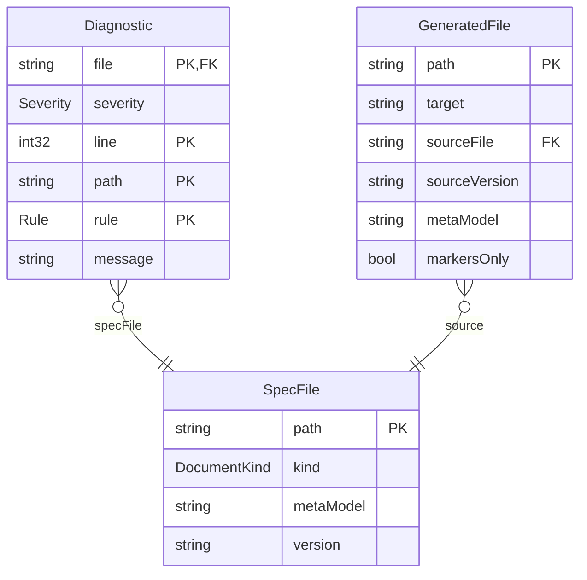
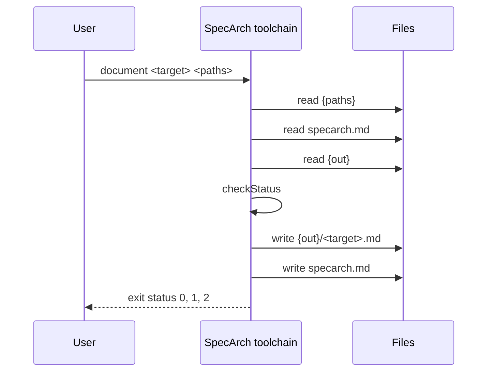
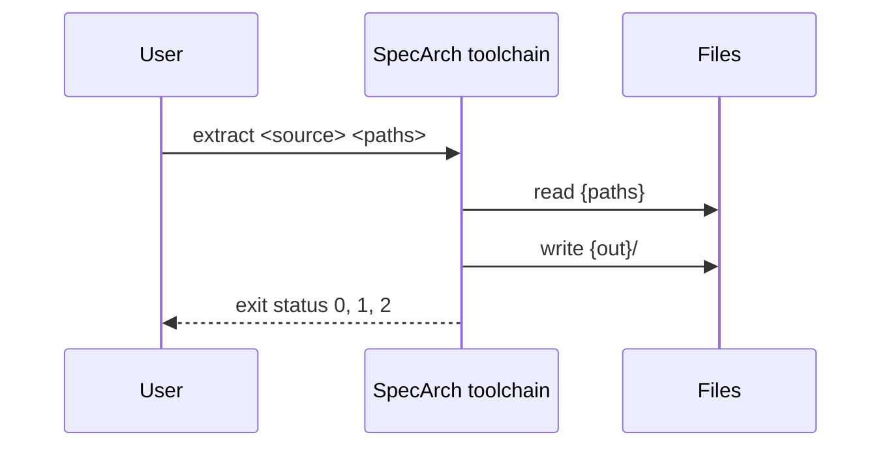
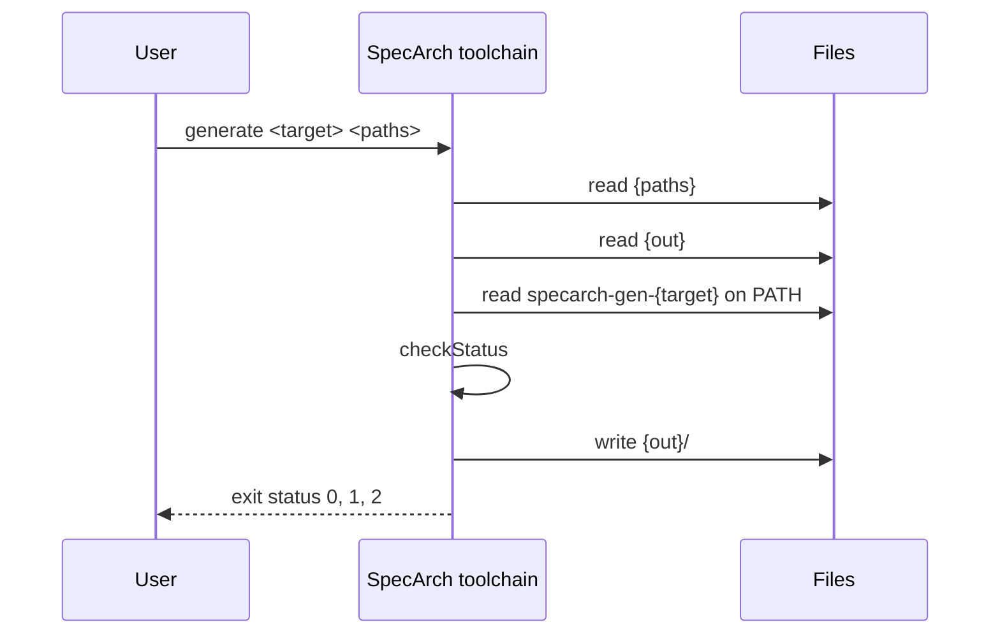
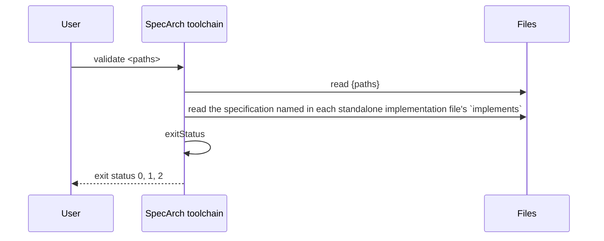
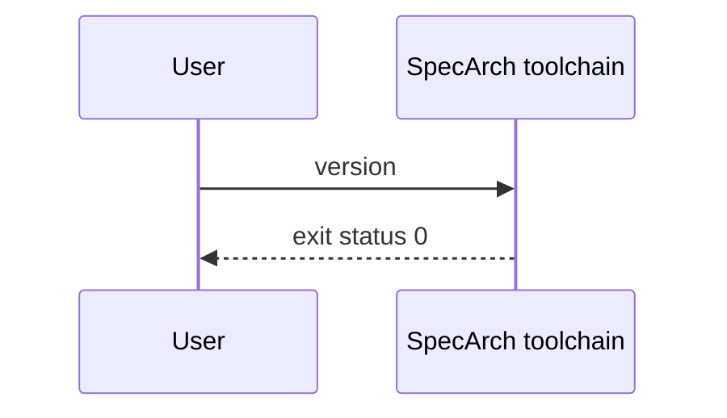

<!-- Generated by specarch document techspec from ../spec/specarch.yaml, version 0.1.0, and ../spec/implementation/go/specarch.go.specarch-implementation.yaml, version 0.1.0; meta-model 0.1. Do not edit this file: change the YAML and generate again. -->

# SpecArch toolchain: technical specification

Version 0.1.0 of the specification: 14 requirements, 3 entities, 5 commands, 6 algorithms, 111 tests, 14 decisions, 2 environments and 3 commissioning checks. The chapters follow arc42, and a chapter with nothing in the specification is left out.

## 1. Introduction and goals

The `specarch` command: it validates SpecArch specifications and makes
documents and code from them. This folder is the specification, with no
language, library or build tool in it; how one stack implements it is in
`implementation/<stack>/`.

Owners: specarch-maintainers.

### Stakeholders

| Stakeholder | Who they are | Concerns |
|---|---|---|
| specification-author | A person or an assistant who writes a specification in SpecArch and keeps it current. | A mistake in a specification is caught before anyone builds on it.; A large specification stays navigable. |
| implementer | A developer who builds a system from a specification, in one of possibly several stacks. | The design says enough to build from, including how values travel.; A change in the design is noticed in every implementation of it. |
| reviewer | A person who reviews a specification or the documents made from it before work starts. | Every design element traces to a requirement, and every requirement to a test.; The reasoning behind a choice is written next to it. |
| operator | A person who installs, releases and runs the built system. | Release, rollback and commissioning are written down and checkable. |
| ci-job | The continuous-integration job that checks every change of a project that uses SpecArch. | Every check runs with one command and answers with an exit status. |

## 2. Constraints

| Constraint | Kind | Statement |
|---|---|---|
| CON-1 | technical | Every keyword that a standard already has is taken from that standard with its meaning; SpecArch adds a keyword only where none exists. |
| CON-2 | technical | The program installs with one command and runs in CI without a network. |
| CON-3 | legal | Every dependency is open source under an OSI-approved licence, pinned, and scanned before it is taken. |
| CON-4 | organisational | The repository is public and holds generic material only; no employer's, client's or product's data enters it. |

### Assumptions

| Assumption | Statement |
|---|---|
| ASSUME-1 | A specification is kept in version control, so its history lives there and in history files, never inside the specification. |
| ASSUME-2 | The people and assistants who write specifications can read YAML and a C-like expression. |

## 3. Context

The interfaces the system offers, as its clients see them.

### Commands

| Command | Summary | Permission | Exit statuses |
|---|---|---|---|
| document | Write a document from a specification | public | 0: written, or with `--check` the output is current; 1: a specification has an error, a marker is wrong, or with `--check` the output differs; 2: usage error, a target this build does not offer, no output folder, or a file that could not be read or written |
| extract | Write a specification from existing code or documents | public | 0: the specification was written; 1: the surface could not be read as the source expects; 2: usage error, a source this build does not offer, or a path that could not be read or written |
| generate | Write code or data from a specification | public | 0: written, or with `--check` the output is current; 1: a specification has an error, the plug-in reported an error, or with `--check` the output differs; 2: usage error, no generator for the target (not built in and no plug-in on PATH), the plug-in failed or answered badly, no output folder, or a file that could not be read or written |
| validate | Check specifications and implementation files | public | 0: every input is valid; 1: at least one input has an error; 2: usage error, a path could not be read, or a folder holds no specification and no implementation file |
| version | Print the program version and the meta-model versions it reads | public | 0: printed |

## 5. Building blocks



### Diagnostic

One problem found in one file. Printed as one line:
`file:line: severity: /yaml/path: rule: message`.

| Field | Type | Required | Limits | Description |
|---|---|---|---|---|
| file | string | yes |   | The file's path as given. |
| severity | Severity | yes |   |   |
| line | int32 | yes | at least 1 | Line of the YAML node the problem is at; for an expression, the line inside the expression. |
| path | string | yes |   | JSON pointer to the node, such as `/entities/Loan/relations/member/target`; `/` for the whole file. |
| rule | Rule | yes |   |   |
| message | string | yes | at least 1 character | What is wrong and how to fix it, in one plain sentence. |

Primary key: file, line, path, rule.

| Relation | Kind | Target | Via | On delete |
|---|---|---|---|---|
| specFile | many-to-one | SpecFile | file | restrict |

| Constraint | Rule | Message |
|---|---|---|
| diagnostic_line_positive | check `line >= 1` | Every diagnostic points at a line. |

### GeneratedFile

A file a document or code target wrote. Its header names where it came from.

| Field | Type | Required | Limits | Description |
|---|---|---|---|---|
| path | string | yes |   | Path inside the target's own folder. |
| target | string | yes | at least 1 character | The document or code target that wrote it, such as `techspec` or `openapi`. |
| sourceFile | string | yes |   | The root file of the specification it was made from. |
| sourceVersion | string | yes |   | That specification's `info.version`. |
| metaModel | string | yes |   | The meta-model version of that specification. |
| markersOnly | bool | yes |   | True for a hand-written Markdown document, where only the text between `specarch:generate` markers is rewritten. |

Primary key: path.

| Relation | Kind | Target | Via | On delete |
|---|---|---|---|---|
| source | many-to-one | SpecFile | sourceFile | restrict |

### SpecFile

One input given to a command, as the command read it; a specification is one input, whatever the number of files in its tree.

| Field | Type | Required | Limits | Description |
|---|---|---|---|---|
| path | string | yes |   | The path as given on the command line or found under a given folder: a specification's root folder, or an implementation file. |
| kind | DocumentKind | yes |   |   |
| metaModel | string | yes |   | The meta-model version the input declares: `specarch` in a root file, `specarchImplementation` in an implementation file. |
| version | string | yes |   | The input's own `info.version`. |

Primary key: path.

### Enums

| Enum | Value | Meaning |
|---|---|---|
| DocumentKind | specification | a specification, the tree rooted at `specarch.yaml`; its design side is the SpecArch Definition (SDF) |
| DocumentKind | implementation | a SpecArch Implementation File (SIF), `<name>.<stack>.specarch-implementation.yaml`, one stack's implementation of a specification |
| DocumentTarget | techspec | arc42 technical specification in Markdown with generated Mermaid diagrams |
| DocumentTarget | requirements | requirements specification, in the layout of ISO/IEC/IEEE 29148 |
| DocumentTarget | testplan | test plan and test cases, golden and red, traced to requirements |
| DocumentTarget | traceability | the traceability matrix from needs through requirements to design elements, tests and checks |
| DocumentTarget | deployment | deployment guide, from the deployment stage and the implementation's deployments |
| DocumentTarget | commissioning | commissioning test procedure and sign-off sheet |
| DocumentTarget | manual | user manual, from the pages and permissions |
| DocumentTarget | operations | operations guide, from the endpoints, channels and deployments |
| GeneratorTarget | openapi | OpenAPI 3.1 document |
| GeneratorTarget | sql | forward SQL migrations, new files only |
| GeneratorTarget | ui | page definitions for the target component library |
| GeneratorTarget | tests | one test per design test and per worked example, in the implementation's framework |
| GeneratorTarget | scripts | guarded operational scripts for data changes |
| Rule | file_kind | a file given by name is neither `specarch.yaml` nor `*.specarch-implementation.yaml`, is part of a specification that should be checked as a whole, or its root key does not match its name |
| Rule | yaml_syntax | the file is not well-formed YAML |
| Rule | unquoted_date | a date written without quotes, which YAML reads as a timestamp |
| Rule | duplicate_key | a mapping repeats a key, or two files of one specification define the same name |
| Rule | schema | the file breaks the meta-model's JSON Schema |
| Rule | stack_key | a specification carries a key that belongs to one implementation |
| Rule | design_key | an implementation file carries a key that belongs to the specification |
| Rule | ref_type | a `$ref` names an entity or enum the specification does not have |
| Rule | relation_target | a relation's target is not an entity of the specification |
| Rule | relation_via | a relation's `via` is not the field or join entity its kind needs |
| Rule | field | a name that must be a field of an entity is not one (required, primaryKey, unique fields, page columns, fields and filters) |
| Rule | state_field | the `stateField` is not a field whose type is an enum |
| Rule | state_value | a transition's `from` or `to` is not a value of the state field's enum |
| Rule | trigger | a transition's trigger is not an operation, command, channel message or algorithm |
| Rule | requirement | a `satisfies` or `verifies` link names a requirement that is neither in the specification nor in a declared requirement set |
| Rule | emits | an `emits` entry names a channel or message that does not exist |
| Rule | operation | a `source`, `submit` or operation action names an operationId that does not exist |
| Rule | page | a navigate action names a page that does not exist |
| Rule | algorithm | an `algorithm` reference names an algorithm that does not exist |
| Rule | decision | a `supersededBy` names a decision that does not exist, or an implementation decision reuses a design decision's ID |
| Rule | enum_value | a `valueDescriptions` key is not a value of its enum |
| Rule | path_parameter | a `{name}` in a path has no path parameter, or a path parameter is not in the path |
| Rule | duplicate_operation | two operations share an operationId |
| Rule | permission_undeclared | an operation, command, page, action or role names a permission that is not declared |
| Rule | permission_ungranted | a declared permission is granted by no role and is not `public` |
| Rule | expression_syntax | a check or formula does not parse |
| Rule | expression_name | an expression names a field, input or function that does not exist |
| Rule | expression_type | an expression combines values of types that do not fit |
| Rule | example_input | a worked example's inputs are missing one, name an unknown one, or have the wrong type |
| Rule | example_expected | a worked example's expected value does not have the output's type |
| Rule | example_mismatch | the formula evaluated on a worked example's inputs does not give the expected value |
| Rule | example_error | the formula cannot be evaluated on a worked example's inputs (division by zero, null in arithmetic) |
| Rule | implements | an implementation file's `implements` does not name the root file of its specification at the same version |
| Rule | design_ref | a pointer into the specification does not resolve |
| Rule | unsafe_integer | an int64 or uint64 is carried as a JSON number without bounds inside 2^53 |
| Rule | change_log | a description reads as a change log instead of the current truth (a warning) |
| Rule | test_subject | a test is about an operation, command, page, constraint or transition that does not exist |
| Rule | test_case | a test covers a case its subject does not have, or a red case in a golden test |
| Rule | test_golden_missing | a subject has no golden scenario (a warning in 0.1) |
| Rule | test_red_missing | a subject has no red scenario and no derived red case (a warning in 0.1) |
| Rule | test_case_missing | a case derived from the design has no test (a warning in 0.1) |
| Rule | suite | an implementation's test suite names a design test or subject that does not exist |
| Rule | layout | a file or a section is not where the tree layout puts it; the root file's `stages` and the folders disagree, a test folder has no `test.yaml`, or a folder is not a stage |
| Rule | need | a requirement's `needs` names a need that does not exist |
| Rule | stakeholder | a need's `stakeholders` names a stakeholder that does not exist |
| Rule | source | a citation names a source that is not declared under `sources` |
| Rule | environment | a check, an environment's `promotesTo` or an implementation's deployment names an environment that does not exist, or a deployment names none when the specification declares them |
| Rule | setting | an implementation's deployment gives a value to a setting the specification does not declare |
| Rule | secret_value | a setting marked secret carries a value, as a default or in a deployment |
| Rule | need_unrefined | no requirement refines a need whose status is not rejected (a warning) |
| Rule | acceptance_missing | a requirement has no acceptance criteria (a warning) |
| Rule | requirement_unsatisfied | the specification has a design and no element of it satisfies a requirement (a warning) |
| Rule | requirement_unverified | the specification has tests or checks and none verifies a requirement (a warning) |
| Severity | error | the file is invalid |
| Severity | warning | printed, but the file stays valid; in 0.1 only missing test scenarios and change-log phrases |

## 6. Runtime view

### Command document

Validates its input first and writes nothing from an invalid
specification. Then writes the document into the folder the target
owns, and nothing outside it, except the regions between
`specarch:generate` markers in the hand-written `specarch.md` beside
the root file. Every generated file starts with a header naming the
root file, its `info.version`, each implementation file, and the
meta-model version. With `--check` nothing is written: the output is
made in memory and compared with what is on disk.

The techspec target writes `techspec.md`: an arc42 technical
specification of the whole specification, with chapters only for
what it holds. Diagrams are Mermaid: an entity diagram, a state
diagram for each entity with a state field, a sequence diagram for
each operation and command, a flowchart of the pages, and a
permissions table. Chapter 2 comes from the constraints and
assumptions, chapter 7 from the deployment and commissioning stages
and from each implementation file, chapter 12 from the glossary, and
chapter 13 from the needs and requirements, with the traceability
matrix of what satisfies and what verifies each requirement. A marker
names what goes in its region: `erDiagram`, `stateDiagram <Entity>`,
`sequenceDiagram <operationId or command>`, `flowchart pages` or
`permissions`.

| Argument or option | Type | Required | Description |
|---|---|---|---|
| `<target>` | DocumentTarget | yes |   |
| `<paths>` | string, one or more | yes | Folders holding specifications, searched as validate searches them. |
| `--out` | string |   | The folder the target owns. Without it, the folder the implementation files' `targets` name for the target, relative to each implementation file; they must agree. |
| `--check` | bool |   | Make the output in memory and fail when the files on disk differ. Writes nothing. |

Reads `{paths}`: The specifications and their implementation files; `specarch.md`: The hand-written document beside each root file, when there is one; `{out}`: The current output, with `--check`.

Writes `{out}/<target>.md`: The document. Nothing is written with `--check`; `specarch.md`: Only the regions between markers. Nothing is written with `--check`.

Standard output: The diagnostics of an invalid specification and the errors of a
marker, one line each. With `--check`, one line per file that differs
or is missing.

Standard error: A usage message on a usage error, the reason a file cannot be read or written, and a one-line count at the end.



### Command extract

Reads a surface of an existing system and writes the as-built
specification of it into a folder, following the method in
`docs/extraction.md`: the built router for endpoints, the database
catalogue for entities, an OpenAPI document for operations, the
running authorisation rules for permissions. The source names which
surface is read. The result is a specification tree to be checked by
regenerating and comparing, then reviewed by hand. This command is
designed here and built when the first real project needs it; until
then every build answers with status 2.

| Argument or option | Type | Required | Description |
|---|---|---|---|
| `<source>` | string | yes | The surface to read, such as `openapi`, `database` or `router`. |
| `<paths>` | string, one or more | yes | What to read it from, as the source needs it. |
| `--out` | string | yes | The folder the specification is written into; it becomes the specification's root folder. |

Reads `{paths}`: The surface being read.

Writes `{out}/`: The as-built specification tree.

Standard output: One line per object the specification could not hold, naming it, so the gap is recorded.

Standard error: A usage message on a usage error, and the reason a source could not be read.



### Command generate

Validates its input first and writes nothing from an invalid
specification. Then writes the target into the folder it owns, and
nothing outside it. With `--check` nothing is written: the output is
made in memory and compared with what is on disk.

A target this program does not build in is produced by a plug-in: the
executable `specarch-gen-<target>` found on PATH. The program runs it
once per specification with a request on its standard input, as JSON:
`specarch` (the meta-model version), `target`, `root` (the root file's
path), `specification` (the merged, validated specification as plain
values), `implementations` (each implementation file as `file`,
`content` and the target's `settings` from it) and `output` (the
folder the files are for). The plug-in answers on its standard output,
as JSON, with `files` (each a `path` relative to the output folder and
its `content`) and `diagnostics` (each with the validator's fields:
file, line, severity, path, rule, message), and exits 0. The program
prints the diagnostics, refuses a path outside the output folder,
and writes or checks the files itself. A plug-in that exits with
another status, or answers with something else, fails the run with
status 2; its standard error is passed through.

| Argument or option | Type | Required | Description |
|---|---|---|---|
| `<target>` | string | yes | A code or data target, built in or offered by a plug-in; kebab-case. |
| `<paths>` | string, one or more | yes | Folders holding specifications, searched as validate searches them. |
| `--out` | string |   | The folder the target owns. Without it, the folder the implementation files' `targets` name for the target, relative to each implementation file; they must agree. |
| `--check` | bool |   | Make the output in memory and fail when the files on disk differ. Writes nothing. |

Reads `{paths}`: The specifications and their implementation files; `{out}`: The current output, with `--check`; `specarch-gen-{target} on PATH`: The plug-in for a target that is not built in.

Writes `{out}/`: The files the target produces, as the plug-in answers them. Nothing is written with `--check`.

Standard output: The diagnostics of an invalid specification and the diagnostics the
plug-in answers with, one line each. With `--check`, one line per
file that differs or is missing.

Standard error: A usage message on a usage error, the reason a plug-in was not found or failed, the plug-in's own standard error, and a one-line count at the end.



### Command validate

Checks every specification found under the paths given: a folder that
holds `specarch.yaml` is one specification, read as a whole, including
the implementation files under its `implementation/` folder; nothing
under it is searched further, so a test folder's data files are never
read as specifications. An implementation file outside any
specification is checked on its own against the specification its
`implements` names. A file given by name must be a root file or an
implementation file; a fragment of a tree is refused with the folder
to run on instead.

Every specification is checked against the meta-model and against the
rules JSON Schema cannot express. It reports every problem in every
file, not only the first.

| Argument or option | Type | Required | Description |
|---|---|---|---|
| `<paths>` | string, one or more | yes | Folders and files. A folder is searched for specifications and for implementation files outside one. |

Reads `{paths}`: Root files, the files under their stage folders, and implementation files; `the specification named in each standalone implementation file's `implements``: Read to resolve that file's references.

Standard output: One line per diagnostic, sorted by file, then line, then path, then rule.

Standard error: A usage message on a usage error, the reason on an unreadable path, and a one-line count at the end.



### Command version

Standard output: The program version, then one line per meta-model version it supports.



## 7. Deployment and implementation

### Environments

| Environment | Purpose | Promotes to |
|---|---|---|
| developer-machine | The machine of a person who writes specifications; the program is installed from source with one command. | ci-runner |
| ci-runner | The continuous-integration runner of a project that uses SpecArch; it builds the program from the pinned version in that project's workflow. |   |

### Release

A release is a tagged commit of this repository; nothing is uploaded anywhere, since every user builds the program from source.

| Step | Action | Check |
|---|---|---|
| 1. Check the tree | Run the implementation's build, test, validate and document --check tasks on the commit to release. | Every task exits 0. |
| 2. Tag the commit | Tag the commit with the program version, as the version command prints it. | The tag's name equals the output of specarch version. |
| 3. Announce | Write the release in the history file of the day, with the tag. | The history file names the tag. |

### Rollback

A user who hits a problem in a release installs the previous tag; the tags of every release stay.

| Step | Action | Check |
|---|---|---|
| 1. Install the previous tag | Install the program from the previous release tag with the implementation's install task. | specarch version prints the previous version. |
| 2. Record the problem | Open an issue naming the release and the problem, and note the rollback in the history file. | The issue exists and the history file names it. |

### Commissioning checks

Run on the installed system before it is handed over. The results of each run are records kept outside the specification.

#### installs-and-answers (smoke, in developer-machine)

The program installs from the release tag on a clean machine and answers.

| Step | Action | Check |
|---|---|---|
| 1. Install | Install the program from the release tag with one command, on a machine that has never had it. | The command exits 0. |
| 2. Run version | Run specarch version. | It prints the program version and the meta-model versions it reads, and exits 0. |

#### checks-the-examples (end-to-end, in developer-machine)

The installed program validates the example and this specification, and reproduces their committed documents.

| Step | Action | Check |
|---|---|---|
| 1. Validate | Run specarch validate on spec and examples of the release tag. | It exits 0 with no error. |
| 2. Compare the documents | Run specarch document techspec --check on spec and examples. | It exits 0 and names no file. |

#### no-network (security, in ci-runner)

The installed program needs no network.

| Step | Action | Check |
|---|---|---|
| 1. Run offline | Run specarch validate on the example with the network switched off. | It exits 0; nothing waits on a connection. |

### Sign-off

The system is accepted when:

- Every check above passed on the release tag, and the record of the run is committed.
- The history file of the day names the tag.

Signed by: specarch-maintainers.

### Implementation: SpecArch toolchain in Go

From the implementation file version 0.1.0.

The Go implementation of the specification in `spec/`: one static binary,
`specarch`, installed with `go install ./cmd/specarch`.

Stack: language Go 1.26; toolchain go 1.26.0; platforms darwin/arm64, darwin/amd64, linux/amd64, linux/arm64, windows/amd64.

#### Libraries

| Library | Version | Licence | Purpose |
|---|---|---|---|
| github.com/santhosh-tekuri/jsonschema/v6 | v6.0.3 | Apache-2.0 | JSON Schema 2020-12 validation against the schemas in `schema/`; the same library the repository's pinned `jv` check used. |
| golang.org/x/text | v0.42.0 | BSD-3-Clause | Message printing for the schema library. Pinned above 0.39.0, which fixes GO-2026-5970. |
| go.yaml.in/yaml/v3 | v3.0.5 | MIT AND Apache-2.0 | YAML parsing into a node tree, which keeps the line of every value for diagnostics. |
| cel.dev/cel-go | v0.32.0 | Apache-2.0 | The CEL parser; only its parser is used. |
| cel.dev/expr | v0.25.1 | Apache-2.0 | CEL's expression tree types, needed by the parser. |
| github.com/antlr4-go/antlr/v4 | v4.13.1 | BSD-3-Clause | The parser runtime the CEL grammar is generated for. |
| google.golang.org/protobuf | v1.36.10 | BSD-3-Clause | Needed by the CEL parser's tree types. |
| google.golang.org/genproto/googleapis/api | v0.0.0-20240826202546-f6391c0de4c7 | Apache-2.0 | Needed by the CEL parser's tree types. |
| google.golang.org/genproto/googleapis/rpc | v0.0.0-20240826202546-f6391c0de4c7 | Apache-2.0 | Needed by the CEL parser's tree types. |
| golang.org/x/exp | v0.0.0-20240823005443-9b4947da3948 | BSD-3-Clause | Needed by the CEL parser. |

#### Layout

| Path | Holds | Implements |
|---|---|---|
| cmd/specarch | The command line. Argument handling, finding the specifications under folders, running plug-ins, printing the diagnostics and the exit status. | #/commands/validate, #/commands/document, #/commands/generate, #/commands/extract, #/commands/version, #/entities/SpecFile, #/entities/GeneratedFile, #/algorithms/exitStatus, #/algorithms/checkStatus |
| schema | The JSON Schemas, embedded into the binary from the files editors use. |   |
| internal/source | Reads a YAML file into a node tree and a plain value, with the line of every node; finds unquoted dates and duplicate keys. |   |
| internal/spec | Reads a specification from disk, the root file and the stage folders, and merges it into one document in which every node remembers its file; reports the layout problems. |   |
| internal/expr | The expression subset. Parses with the cel-go parser, refuses what is outside the subset, type-checks with CEL's strict rules, and evaluates with exact integers and decimals. |   |
| internal/generate | The document targets. The techspec target writes the arc42 document and its Mermaid diagrams, and rewrites the regions between markers in hand-written Markdown. | #/algorithms/markersWellFormed |
| internal/validate | Schema validation with plain messages, the interface boundary, cross-references across the tree, fail-closed access, concrete integers, expressions, worked examples, tests and their derived cases, the life-cycle links and traceability warnings, and implementation references. | #/entities/Diagnostic, #/enums/Rule, #/enums/Severity, #/algorithms/referenceResolves, #/algorithms/permissionGranted, #/algorithms/workedExampleHolds |

#### Mappings

| Design object | Implemented by | Notes |
|---|---|---|
| #/entities/Diagnostic | validate.Diagnostic | A struct; `String()` prints the one-line form. |
| #/entities/SpecFile | main.input | A root folder, an implementation file or a file given by name; the versions are read where they are checked. |
| #/enums/Rule | validate.Rule | A string type with one constant per value; validate.Rules lists them, and a test checks they equal the design's enum. |
| #/enums/Severity | validate.Severity |   |
| #/commands/validate | main.runValidate |   |
| #/commands/version | main.runVersion |   |
| #/commands/document | main.runDocument |   |
| #/commands/generate | main.runGenerate | Runs the plug-in with main.runPlugin; the request and answer are the pluginRequest and pluginResponse structs. |
| #/commands/extract | main.runExtract | Answers with status 2 until it is built. |
| #/enums/DocumentTarget | main.documentTargets |   |
| #/enums/GeneratorTarget | main.builtGenerators | Empty; every target is a plug-in. |
| #/entities/GeneratedFile | main.planned | A path and the content a target wants there; --check compares it with the disk. |
| #/algorithms/checkStatus | main.checkPlan |   |
| #/algorithms/markersWellFormed | generate.RewriteMarkers |   |
| #/algorithms/exitStatus | the end of main.runValidate |   |
| #/algorithms/workedExampleHolds | validate.checker.checkExample |   |
| #/algorithms/permissionGranted | validate.checker.checkAccess |   |
| #/algorithms/referenceResolves | the validate.checker.check... methods for each kind of reference |   |

#### Bindings

cli: standard library. Hand-written argument handling over `os.Args`; three commands do not justify a CLI library.

#### Targets

| Target | Output folder | Settings |
|---|---|---|
| techspec | ../../../docs |   |

#### Tasks

| Task | Command | In CI |
|---|---|---|
| build | `go build ./...` | yes |
| test | `go test ./...` | yes |
| vet | `go vet ./...` | yes |
| vulncheck | `go run golang.org/x/vuln/cmd/govulncheck@v1.8.0 ./...` | yes |
| validate-specs | `go run ./cmd/specarch validate spec examples` | yes |
| techspec-current | `go run ./cmd/specarch document techspec --check spec examples` | yes |
| install | `go install ./cmd/specarch` |   |
| sbom | `syft dir:. -o syft-json=sbom.json && grype sbom:sbom.json && osv-scanner scan source -r .` |   |

#### Testing

Framework: go test. Run: `go test ./...`.

Fixtures: The conformance suite is the tests stage of the specification, `spec/tests/`; each test folder holds the design test, the case's arguments and output in `case.yaml`, the input files and the expected output. The Go tests read it and add none of their own.

Stand-ins: None. Every test runs the real program on real files.

| Suite | Level | Runs | Command |
|---|---|---|---|
| conformance | system | every design test of command validate, command document, command generate, command extract, command version | `go test ./cmd/specarch` |
| expressions | unit | tests of this implementation only | `go test ./internal/expr` |

#### Implementation decisions

##### ADR-101: Go, one static binary

Status: accepted, 2026-10-07.

Context: The validator must be installable by anyone with one command and run in CI without a runtime.

Decision: Go. `go install` builds it from source; the binary has no runtime dependency.

Consequences: The schema library is a Go module. Document targets are Go too, in the same binary; code targets are plug-ins in any language.

##### ADR-102: santhosh-tekuri/jsonschema as the schema library

Status: accepted, 2026-10-07.

Context: `jv`, the command of this library, is a common way to check a file
against the schemas alone. Using the same library means a file passes
the schema check in both.

Decision: Use `github.com/santhosh-tekuri/jsonschema/v6` with format assertion
on, and require `golang.org/x/text` v0.42.0 so GO-2026-5970 (fixed in
0.39.0) is not in the build.

Consequences: The same files pass as with `jv`. The schemas are embedded and registered under their `$id`, so validation needs no network.

##### ADR-103: The CEL parser from cel-go, with SpecArch's own checker and evaluator

Status: accepted, 2026-10-07.

Context: The design fixes expressions as a subset of CEL with exact numbers.
A parser of SpecArch's own could drift from CEL's syntax without
anyone noticing. CEL's own evaluator works in binary floating point
and would get money wrong.

Decision: Parse with the parser of `cel.dev/cel-go`, so every accepted
expression is real CEL syntax. Walk the tree it returns and refuse
every node outside the subset. Type-check and evaluate with code of
our own, using `math/big.Rat` for every number; a number literal's
exact text is read back from the source, not from the parser's
float.

Consequences: The parser brings ANTLR, protobuf and their support modules into the
build; each is listed under libraries with its licence and scanned.
Parser errors are rewritten into one plain sentence.

##### ADR-104: The YAML node tree, not decoding into structs

Status: accepted, 2026-10-07.

Context: Every diagnostic needs the line of the value it is about.

Decision: Parse with `go.yaml.in/yaml/v3` into `yaml.Node`, keep the tree for
lines, and convert it to plain values by tag for the schema check.
It is the maintained successor of the archived `gopkg.in/yaml.v3`.

Consequences: Rules walk the node tree directly. A date without quotes is caught by its tag before the schema check.

## 8. Cross-cutting concepts

### Permissions

Access is fail-closed: every operation, command and page names the one permission it needs, and only the roles below grant one.

| Permission | public |
|---|---|
| public | everyone |

### Algorithm checkStatus

The status of `generate --check`.

Inputs: `invalidInput` (bool), `differingFiles` (int32). Output: int32.

Formula:

    invalidInput || differingFiles > 0 ? 1 : 0

| Worked example | Inputs | Expected | Note |
|---|---|---|---|
| output is current | invalidInput false, differingFiles 0 | 0 |   |
| a diagram was edited by hand | invalidInput false, differingFiles 1 | 1 |   |
| the spec does not validate | invalidInput true, differingFiles 0 | 1 |   |

Pseudocode:

```text
if validate(paths) has diagnostics:
    return 1
wanted = generate(target, paths) in memory
differing = files in wanted whose bytes differ from disk,
            plus files on disk in the target's folder not in wanted
print each differing path
return 1 if differing else 0
```

### Algorithm exitStatus

The status of a whole `validate` run. A usage or read error outranks
diagnostics, because a run that could not read its input has not
checked it.

Inputs: `usageError` (bool), `ioError` (bool), `errors` (int32). Output: int32.

Formula:

    usageError || ioError ? 2 : (errors > 0 ? 1 : 0)

| Worked example | Inputs | Expected | Note |
|---|---|---|---|
| every file valid | usageError false, ioError false, errors 0 | 0 |   |
| three problems | usageError false, ioError false, errors 3 | 1 |   |
| no arguments | usageError true, ioError false, errors 0 | 2 |   |
| one file unreadable, another invalid | usageError false, ioError true, errors 2 | 2 |   |

Pseudocode:

```text
function exitStatus(usageError, ioError, errors):
    if usageError or ioError:
        return 2
    if errors > 0:
        return 1
    return 0
```

### Algorithm markersWellFormed

A hand-written Markdown document is rewritten only between its markers:
`<!-- specarch:generate <what> -->` and `<!-- specarch:end -->`. Every
begin has its end before the next begin, so regions never nest.

Inputs: `begins` (int32), `ends` (int32), `nested` (int32). Output: bool.

Formula:

    begins == ends && nested == 0

| Worked example | Inputs | Expected | Note |
|---|---|---|---|
| two diagrams | begins 2, ends 2, nested 0 | true |   |
| an end deleted by hand | begins 2, ends 1, nested 1 | false |   |

Pseudocode:

```text
open = none
for each line l of the document:
    if l is a begin marker:
        if open: error "marker inside an open region"
        open = l
    else if l is an end marker:
        if not open: error "end without begin"
        replace the lines between open and l with generate(open.what)
        open = none
if open: error "begin without end"
if open.what names an object that no longer exists: error, never an empty block
```

### Algorithm permissionGranted

Fail-closed access. A permission an operation, command, page, action or
role names must be declared. A declared permission must be granted by
at least one role, unless it is `public`. An operation with no
permission at all is already a schema error.

Inputs: `declared` (bool), `name` (string), `grantingRoles` (int32). Output: bool.

Formula:

    declared && (name == "public" || grantingRoles >= 1)

| Worked example | Inputs | Expected | Note |
|---|---|---|---|
| granted by the librarian role | declared true, name loans.create, grantingRoles 1 | true |   |
| public needs no role | declared true, name public, grantingRoles 0 | true |   |
| declared but nobody holds it | declared true, name loans.export, grantingRoles 0 | false | Nobody could ever call an operation guarded by it. |
| used but never declared | declared false, name loans.delete, grantingRoles 0 | false |   |

Pseudocode:

```text
for each use u of a permission (operation, command, page, action, role):
    if u.name not in permissions:
        report permission_undeclared at u
for each declared permission p other than "public":
    if no role lists p:
        report permission_ungranted at p
```

### Algorithm referenceResolves

Every cross-reference check is the same question: of the objects of the
kind the reference names, in the same file, how many carry that name?
Exactly one resolves. None is a dangling reference. Two can only
happen for operationIds, which are not map keys, and is reported as a
duplicate.

Inputs: `definitions` (int32). Output: bool.

Formula:

    definitions == 1

| Worked example | Inputs | Expected | Note |
|---|---|---|---|
| relation target exists | definitions 1 | true |   |
| relation target misspelt | definitions 0 | false | `target: Lone` in a file with an entity `Loan`. |
| operationId used twice | definitions 2 | false |   |

Pseudocode:

```text
for each reference r in the file, in document order:
    candidates = objects of kind(r) in the file whose name is r.name
    if count(candidates) == 0:
        report r.rule at r: "<name> is not a <kind> of this file"
    # duplicates are reported once, at the second definition
for each operationId seen more than once:
    report duplicate_operation at the second and later uses
```

### Algorithm workedExampleHolds

A worked example holds when the formula, evaluated on the example's
inputs with exact decimal arithmetic, gives the expected value. The
type checker has already made sure a decimal result has no more places
than the output's scale, so the comparison is exact and by value:
"3.50" equals "3.5". Where the design wants rounding, the formula says
so with round(x, places), which rounds half away from zero.

Inputs: `computed` (decimal(38, 6)), `expected` (decimal(38, 6)). Output: bool.

Formula:

    computed == expected

| Worked example | Inputs | Expected | Note |
|---|---|---|---|
| same value, written with a trailing zero | computed 3.5, expected 3.50 | true |   |
| the example forgot the cap | computed 25.00, expected 45.00 | false | A wrong example fails validation instead of becoming a wrong test. |

Pseudocode:

```text
for each algorithm a, for each example e in a.examples:
    check e.inputs has exactly the names of a.inputs, each of its type
    check e.expected has the type of a.output
    values = e.inputs read by their declared types: int, uint and
             decimal as exact numbers, dates and timestamps as instants
    result = evaluate(a.formula, values)     # error -> example_error
    if result != e.expected:                  # by value: 3.5 == 3.50
        report example_mismatch: "gives <result>, expected <expected>"
```

## 9. Architecture decisions

### ADR-001: Two kinds of file, design and implementation

Status: accepted, 2026-10-07.

Context: A design written next to its language, libraries and build commands
turns into a description of one implementation, and a second stack
cannot reuse it. Stack details in the design also make every library
upgrade look like a design change.

Decision: A specification (the SpecArch Definition, SDF: `specarch.yaml` and its
stage folders) holds the design: what the system is and does,
including its interfaces as a client sees them.
A SpecArch Implementation File (`<name>.<stack>.specarch-implementation.yaml`)
holds one stack's implementation: language, toolchain, libraries,
layout, mappings, generator settings, tasks, deployments and the
decisions that depend on the stack. It names the specification and
version it implements and has no keyword that adds design.

Consequences: One design can have several implementations. Generators read the
definition for design and the implementation for target choices. The
validator checks both kinds and that an implementation's references
resolve in its definition.

### ADR-002: The interface boundary between the two kinds

Status: accepted, 2026-10-07.

Context: The same interface has a contract and a build, and they change for different reasons.

Decision: Whatever a client of an interface must know is design: the kind of
interface (HTTP, messaging, command line), operations, paths,
parameters, bodies, responses and status codes, channels and messages,
commands, arguments, options and exit codes, and the permission each
needs. Whatever only the builders or operators of one implementation
need is implementation: code-generator settings, framework binding,
the CLI library, servers, hosts, ports and environments. A standalone
OpenAPI or AsyncAPI document is generated from the definition, never
kept by hand beside it.

Consequences: The definition schema refuses stack-specific extension keys and the
implementation schema has no design keywords; the validator reports
both with their own rule.

### ADR-003: The validator applies the published JSON Schema first, then its own rules

Status: accepted, 2026-10-07.

Context: A second definition of the language inside the validator would drift from the schema editors use.

Decision: The JSON Schema in `schema/` is the one definition of each file's
shape. The validator applies it unchanged, then runs the checks a
schema cannot express: cross-references, expressions, worked examples,
fail-closed access, the interface boundary and implementation
references.

Why: Two definitions of one shape, one in the schema and one in the validator, would drift; applying the published schema unchanged keeps one.

Consequences: A file an editor accepts and the validator refuses is always a cross-reference or semantic problem, never a shape problem.

### ADR-004: Expressions are a small subset of CEL, with CEL's strict types

Status: accepted, 2026-10-07.

Context: A check or a formula kept as free text cannot be told apart from a
typo. A grammar of SpecArch's own would be one more thing to learn.
CEL keeps int, uint and double apart and never converts between them
by itself; its authors did that because an implicit conversion is
where precision is lost without anyone noticing.

Decision: Checks and formulas are written in a small subset of CEL with CEL's
type rules: no implicit conversion, every conversion written, and a
lossy one only after the rounding is written. SpecArch adds three
types CEL lacks: decimal (CEL serves protocol buffers, which have no
decimal, and money needs one), date and enum values. It is stricter
than CEL in one place: numbers of different types are not compared
without a conversion, so every operator follows one rule.

Why: CEL keeps int, uint and double apart and never converts between them
by itself because an implicit conversion is where precision is lost
without anyone noticing; a subset of a real language is one less
grammar to learn and cannot drift from it.

Consequences: A reader who knows C, Java or JavaScript reads the expressions. A
formula's result has exactly its declared type, and a worked example
is checked to the last digit. Generators translate a parsed
expression, and a construct the target cannot express fails
generation.

### ADR-005: Report every problem, one line each, with a stable rule name

Status: accepted, 2026-10-07.

Context: A validator that stops at the first error makes a large file take as many runs as it has errors.

Decision: All problems in all files are reported, one per line, in the form
`file:line: severity: /yaml/path: rule: message`, sorted. The severity
is error or warning; only errors make a file invalid. The rule is a value of
the `Rule` enum. Status 0 means valid, 1 invalid, 2 a usage or read
error.

Why: A reader fixes a file in one pass when every problem is on the screen at once, and a stable rule name is what a test and a reader look up.

Consequences: Editors and CI can parse the output. Tests assert the exact lines.

### ADR-006: Commands are part of meta-model 0.1

Status: accepted, 2026-10-07.

Context: SpecArch's own specification is a command-line tool, and the
meta-model could describe HTTP and events but not a command line.

Decision: `commands` is added to 0.1 as an additive keyword: summary, permission,
arguments, options, files read and written, standard output and error,
exit codes and the algorithm a command runs. Other non-HTTP interfaces
(gRPC, file exchange, Bluetooth or serial, a menu-bar UI) stay 0.2
items.

Consequences: Existing files stay valid. The validator checks a command's permission and algorithm like an operation's.

### ADR-007: File names say which kind of file they are

Status: superseded, 2026-10-07, superseded by ADR-010.

Context: Two kinds of file sit side by side in one folder. A name that hides
the kind makes every reader open the file to find out.

Decision: A design file is `<name>.specarch-design.yaml`, explained by
`<name>.specarch-design.md`. An implementation file is
`<name>.<stack>.specarch-implementation.yaml`, explained, when it needs
it, by `<name>.<stack>.specarch-implementation.md`. The root key matches
the kind: `specarch` in a design file, `specarchImplementation` in an
implementation file.

Consequences: The validator picks the schema from the name and refuses a file whose
name and root key disagree, or whose name is neither.

### ADR-008: The Low IQ Tax principle governs the language and its tools

Status: accepted, 2026-10-07.

Context: Every reader of a specification has finite attention, and a tool that makes them think about it spends that attention on the wrong thing.

Decision: `docs/principles.md` is binding: full-word keys, one way to say one
thing, no placeholders, ambiguity is an error, few modes, summary
first. Validator messages say what is wrong, where, and how to fix it,
in one plain sentence.

Why: Attention is the scarce resource of every reader, tired, new or six months later; a format that spends it on itself leaves less for the system.

Consequences: A keyword, option or message that needs explaining is a defect to fix, not documentation to add.

### ADR-009: Types are concrete, and the design says how they travel

Status: accepted, 2026-10-07.

Context: Implementations differ in exactly the places an abstract type hides:
a JavaScript number is a 64-bit float, so an int64 above 2^53 loses
digits, and a string of digits is easily read as a number. JSON Schema
separates `type` (the JSON value) from `format` (what it means), and
OpenAPI uses `format` for widths such as int32 and int64, so a client
knows the range before it parses a value.

Decision: Every field has a concrete type: an integer names int32, int64 or
uint64, a number names double, a decimal names precision and scale.
`type` is how the value travels in JSON and `format` what it is. An
int64 or uint64 that can pass 2^53 travels as a string; one sent as a
JSON number must be bounded inside 2^53.

Consequences: Every implementation reads the same range and representation from the
design. The validator refuses an unbounded int64 carried as a JSON
number.

### ADR-010: A specification is a folder tree with one root file, specarch.yaml

Status: accepted, 2026-10-07.

Context: One file for a whole system grows past what a reader can navigate,
and the stages of the life cycle (requirements, design, tests,
deployment, commissioning) each have their own readers and their own
pace of change. Tools need one fixed name to find a project's root,
as `go.mod`, `Cargo.toml` and `package.json` give theirs.

Decision: A specification is one folder. Its root file is `specarch.yaml`,
which names the system, its version, the stages it keeps as folders
(`stages`) and the sources it cites. Each listed stage is a folder of
that name beside the root: `requirements/`, `design/`,
`implementation/<stack>/`, `tests/<scenario>/`, `deployment/`,
`commissioning/`. A file under a stage folder holds only that
stage's sections, and a sub-folder named after a section holds only
that section; the convention is one sub-folder per section and one
object per file where that helps the reader. Each test is a folder
holding `test.yaml` and its own data files, which the validator never
reads. A stage that is not listed has no folder, and its sections,
if any, are written in the root file, so a tiny specification is one
file. The hand-written explanation is `specarch.md` beside the root.
The validator merges the tree into one document, so every name is
unique within its section across the specification, and a reference
is the plain key it always was: `target: Loan`,
`$ref: "#/entities/Loan"`, `satisfies: [SA-1]`. No reference names
a file. A diagnostic names the file and line of the node, and the
YAML path in the merged document.

Why: The folder names say what is inside, so a reader walks to a thing
instead of searching a file; the root file's `stages` list is the
specification's own claim of what it covers, and a folder that is
not listed, or a listed stage without a folder, is caught instead of
silently skipped. References stay plain keys because a file path in
a reference would break every time an object moved between files,
and the point of the tree is to let files be reorganised. Golden and
red stay a mark inside each test rather than two folders, because a
test moved between folders could then disagree with its content,
and tests group by subject, not by outcome. There is one root form,
not a separate single-file kind, because two ways to write the same
specification would be two things to learn and to support.

Consequences: `specarch validate` finds a specification by its root file and reads
nothing under it that the layout does not name. A single-file
specification is a root file with no `stages`. Implementation files
keep their suffix, because several stacks sit side by side under
`implementation/`. The techspec and the other documents are one file
per target, `<target>.md`, in the folder the implementation file
names, since one specification is one document.

### ADR-011: The specification covers the whole life cycle, one stage at a time

Status: accepted, 2026-10-07.

Context: Meta-model 0.1 described a design and its tests, and pointed at
requirements kept somewhere else. A system also has stakeholders
and needs before its requirements, and a release, a rollback and an
acceptance on the real installation after its tests. Each of those
has an established standard that says what to write down, and
projects that skip them find out at handover.

Decision: Six stages, in life-cycle order, each a folder and a set of
sections. Requirements: `stakeholders`, `needs`, `requirements`
(statement, kind, priority, status, acceptance criteria,
verification method, the needs it refines), `glossary`,
`assumptions`, `constraints`. Design: the sections 0.1 had. Tests:
the design tests, each with a level, system or acceptance; unit and
integration suites stay in the implementation file. Deployment:
`environments` (what each is for and which one a release goes to
next), `configuration` (each setting with its type and whether it is
a secret; a secret's value is never in a specification), `release`
and `rollback` as steps with a check each, and `migrations`.
Commissioning: `checks` on the installed system (smoke, end-to-end,
performance, security, data), each in a named environment with its
steps, and `signoff` with the acceptance criteria and the roles that
sign. The results of a commissioning run are records, not design:
they live outside the specification, one file per run under
`records/commissioning/` beside the specification's folder, as
`docs/conventions.md` describes. Nothing is mandatory except what a
stage the specification keeps needs: a project starts with
requirements alone and adds stages as it reaches them. Design
elements name the requirements they satisfy; tests and checks name
the ones they verify; a requirement names the needs it refines. Once
a later stage exists, the validator warns for every requirement
nothing satisfies or verifies, every need nothing refines, and every
requirement without acceptance criteria.

Why: The stages are those of ISO/IEC/IEEE 12207's technical processes,
so a reader who knows the standard knows the folders, and each
section's fields are the attributes the standard for that stage
asks for: 29148 for requirements, 29119 for tests, 12207's
transition and validation processes for deployment and
commissioning, and the site acceptance test of IEC 62381 for the
checks. Traceability is warned, not refused, because a specification
is written in order and the gaps are its to-do list. Records are
kept out of the specification because a result is a fact about one
run, not about the design, and a design file that changed on every
run would be a change log. Stakeholders and signers are roles, not
people, so the specification holds no personal data.

Consequences: The techspec gains chapters 2, 7, 12 and 13 from the new stages,
with the traceability matrix. The documentor makes one document per
stage from the same tree. The validator has rules for the new links
(need, stakeholder, environment, setting), for secrets
(secret_value), and the four traceability warnings.

### ADR-012: Every element may say why, and cite its sources

Status: accepted, 2026-10-07.

Context: A reader of a specification, and the documents made from it, wants
to know why an element is the way it is and which standard,
regulation, document or interview asked for it. Decision records
carry a context and consequences but no named rationale, and
nothing else carried one at all.

Decision: Two optional fields on every element at every stage, the same
everywhere: `why`, the rationale in plain words, and `cites`, a list
of citations. A citation names a source by key, the clause where
relevant, and what the source says that applies here (`says`). The
sources themselves are declared once, under `sources` in the root
file, with their kind (standard, regulation, document, interview,
system or an external requirement set), title, edition, author and
URL. The validator refuses a citation of a source that is not
declared. A decision keeps its context, decision and consequences
and gains `why` like everything else: the context is what was true
and at stake, `why` the reasoning that led from it to the decision.
The documentor renders `why` as an Insight block and each citation
as a Note block.

Why: Two fields rather than one, because a conclusion and a quotation are
different things and are read differently: a reader can skip every
Insight and still read the document, or read only the Notes to see
what the standards require. Sources are a registry rather than
written inline in each citation, because a standard cited twenty
times would otherwise carry its title and edition twenty times and
drift between them, and the index of sources at the end of a
document needs one entry per source. `says` rather than `requires`,
because an interview or a book does not require; it says.

Consequences: Design, deployment, commissioning and implementation elements all
take `why` and `cites`; the schema allows them wherever an element
has a description. An external requirement set is a source of kind
requirement-set, declared with its prefix, and a link into it resolves
through that prefix.

### ADR-013: One binary, specarch, with verbs named by direction, and generator plug-ins on PATH

Status: accepted, 2026-10-07.

Context: The toolchain grows: a validator, a document writer with many
targets, code generators, and an extractor that works the other way.
Separate programs (a spec2doc, a doc2spec, a spec2code) would each
carry a parser, a diagnostic format and a version of their own, and
drift apart.

Decision: One program, `specarch`, with verbs named by direction: `validate`
checks; `document <target>` goes from the specification to a
document; `generate <target>` goes from the specification to code,
SQL, OpenAPI, UI or tests; `extract <source>` goes from existing
code or documents to a specification (designed now, built when the
first real project needs it); `version` says which SpecArch this is.
A code target the program does not build in is produced by the
executable `specarch-gen-<target>` found on PATH, the pattern of
`protoc-gen-*`, `git-*` and `kubectl-*`. The program validates the
specification, passes it to the plug-in on its standard input as
JSON, and takes the files to write back on the plug-in's standard
output; the program writes them, compares them with `--check`, and
refuses a path outside the target's folder.

Why: One name to learn and install; `specarch help` lists everything;
one parser, one validator, one diagnostic format and one version
shared by every verb, so a file's header can say which SpecArch
made it and the answer is one number. Verbs named by direction read
as what they do. Plug-ins on PATH let anyone add a target in any
language without changing the program, and the protoc protocol, in
which the plug-in never touches the disk, keeps the rules that every
target must follow (only its folder, `--check`) in one place instead
of in every plug-in.

Consequences: The techspec target moves from `generate` to `document`. `generate`
has no built-in target until a real project needs one; every target
is a plug-in. The implementation file names the folder of each
document and code target under `targets`.

### ADR-014: Design elements satisfy requirements, tests and checks verify them

Status: accepted, 2026-10-07.

Context: With requirements inside the specification, `requirements` is the
section that holds them. The same word on every element, as the list
of requirements it serves, would mean two things at two levels, and
a reader would have to look at the indentation to tell which.

Decision: A design or deployment element names the requirements it meets under
`satisfies`; a test or a commissioning check names the ones it shows
to be met under `verifies`; a requirement names the needs it comes
from under `needs`. The IDs are those of the `requirements` section,
or of an external requirement set declared under `sources` with its
prefix.

Why: Satisfy and verify are the names of these two relations in
requirements engineering and in SysML, so a reader who knows them
pays nothing, and the two words make the two columns of the
traceability matrix, satisfied by and verified by, say themselves.

Consequences: The validator checks both links and derives the traceability
warnings from them. The techspec's matrix has one column for each.

## 10. Quality requirements

The design tests: what must hold on every implementation. Golden scenarios succeed; red scenarios are refused.

| Test | Subject | Level | Scenario | Given | When | Then |
|---|---|---|---|---|---|---|
| diagnostic-line-from-one | Diagnostic constraint diagnostic_line_positive | system | golden | a problem on the first line of a file | the diagnostic is made | its line is 1 |
| diagnostic-line-zero | Diagnostic constraint diagnostic_line_positive | system | red | a problem found before any line was read | a diagnostic with line 0 is made | it is refused; a problem about the whole file is reported on line 1 |
| document-check-current | command document | system | golden | output that matches the design file | document techspec is run with --check | it writes nothing, prints nothing and exits 0 |
| document-check-differs | command document | system | red | a generated file edited by hand | document techspec is run with --check | it names the file that differs, writes nothing and exits 1 |
| document-check-missing | command document | system | red | no generated output yet | document techspec is run with --check | it names the missing file and exits 1 |
| document-entity-diagram | command document | system | golden | a hand-written document with an erDiagram marker | document techspec is run | the region holds the entity diagram, every other line is unchanged, and it exits 0 |
| document-invalid-input | command document | system | red | a design file with a relation to an entity that does not exist | document techspec is run | it prints the diagnostic, writes nothing and exits 1 |
| document-marker-unclosed | command document | system | red | a marker with no end marker | document techspec is run | it reports the marker's line, writes nothing and exits 1 |
| document-marker-unknown-object | command document | system | red | a marker for the states of an entity that has none | document techspec is run | it reports the marker's line, writes nothing and exits 1 |
| document-no-output-folder | command document | system | red | a design file, no implementation file and no --out | document techspec is run | it asks for --out or an implementation file and exits 2 |
| document-pages-flowchart | command document | system | golden | a hand-written document with a flowchart pages marker | document techspec is run | the region holds the pages and the operation the Pay action runs, and it exits 0 |
| document-permissions-table | command document | system | golden | a hand-written document with a permissions marker | document techspec is run | the region holds the table of permissions and roles, with public granted to everyone, and it exits 0 |
| document-sequence-diagram | command document | system | golden | a hand-written document with a sequenceDiagram payOrder marker | document techspec is run | the region holds the call, the event on order.events and the 200 answer, and it exits 0 |
| document-state-diagram | command document | system | golden | a hand-written document with a stateDiagram Order marker | document techspec is run | the region holds the states of Order with a start and an end, and it exits 0 |
| document-target-not-offered | command document | system | red | a document target of the design that this build does not offer | document requirements is run | it says which targets it has and exits 2 |
| document-techspec-without-implementation | command document | system | golden | a design file and no implementation file | document techspec is run with --out docs | it writes docs/shop.techspec.md without chapter 7 and exits 0 |
| document-unknown-target | command document | system | red | a target name that does not exist | document is run with target pdf | it names the targets there are and exits 2 |
| document-usage-error | command document | system | red | no target | document is run without arguments | it prints how to use it and exits 2 |
| document-writes-techspec | command document | system | golden | a design file and an implementation file that names techspec's output folder | document techspec is run on both | it writes techspec/shop.techspec.md with every chapter the design fills, chapter 7 from the implementation file, and exits 0 |
| extract-exit-1 | command extract | system | red | not applicable |   | Status 1, a surface that cannot be read as the source expects, can only happen once extract is built; this build answers every call with status 2. |
| extract-not-offered | command extract | system | red | a build that does not offer extract | extract openapi is run on a file | it says extract is not built yet and exits 2 |
| extract-usage-error | command extract | system | red | no source | extract is run without arguments | it prints how to use it and exits 2 |
| generate-no-plugin | command generate | system | red | a target this build does not have and no specarch-gen-openapi on PATH | generate openapi is run | it says there is no generator for the target and exits 2 |
| generate-plugin-path-outside | command generate | system | red | a plug-in that answers a path outside the output folder | generate escape is run | it refuses the path, writes nothing and exits 2 |
| generate-plugin-reports-error | command generate | system | red | a plug-in that answers an error diagnostic | generate strict is run | it prints the diagnostic, writes nothing and exits 1 |
| generate-usage-error | command generate | system | red | no target | generate is run without arguments | it prints how to use it and exits 2 |
| generate-with-plugin | command generate | system | golden | a specification and specarch-gen-echo on PATH, which answers two files | generate echo is run with --out out | it writes both files under out/ and exits 0 |
| validate-algorithm | command validate | system | red | an operation that names an algorithm that does not exist | validate is run | it reports algorithm and exits 1 |
| validate-change-log-warning | command validate | system | golden | a description that says how the file changed | validate is run | it warns with change_log and exits 0, since the file is still valid |
| validate-cites | command validate | system | golden | elements that carry why and citations of declared sources | validate is run | it prints nothing and exits 0 |
| validate-decision | command validate | system | red | a decision superseded by one that does not exist | validate is run | it reports decision and exits 1 |
| validate-deployment-environment-missing | command validate | system | red | an implementation deployment that names no environment while the specification declares them | validate is run | it reports environment at the deployment and exits 1 |
| validate-deployment-valid | command validate | system | golden | a specification with environments, configuration, release, rollback, a migration, a check and a sign-off, and an implementation file whose deployment names its environment and gives the non-secret setting a value | validate is run | it prints nothing and exits 0 |
| validate-derived-cases-covered | command validate | system | golden | an operation whose every derived case is covered by a test, one of them marked not applicable with a reason | validate is run | it prints nothing and exits 0 |
| validate-derived-cases-listed | command validate | system | golden | an operation with a required field, length limits, a permission and a 409 response, and no tests | validate is run | it warns once for every derived case no test covers, each with a test to copy, and exits 0 |
| validate-design-key | command validate | system | red | an implementation file with an entities key | validate is run | it reports design_key and exits 1 |
| validate-design-ref | command validate | system | red | an implementation mapping that points at an entity the design does not have | validate is run | it reports design_ref and exits 1 |
| validate-duplicate-key | command validate | system | red | a file with info twice | validate is run | it reports duplicate_key at the second info and exits 1 |
| validate-duplicate-name-across-files | command validate | system | red | an entity defined in two files of the design stage | validate is run | it reports duplicate_key at the second definition, naming the first file, and exits 1 |
| validate-duplicate-operation | command validate | system | red | two operations with the same operationId | validate is run | it reports duplicate_operation at the second and exits 1 |
| validate-emits | command validate | system | red | an operation that emits on a channel that does not exist | validate is run | it reports emits and exits 1 |
| validate-empty-folder | command validate | system | red | a folder that holds no SpecArch file | validate is run on it | it says so and exits 2 rather than passing silently |
| validate-enum-value | command validate | system | red | a value description for a value the enum does not have | validate is run | it reports enum_value and exits 1 |
| validate-environment | command validate | system | red | a check that runs in an environment the specification does not declare | validate is run | it reports environment and exits 1 |
| validate-example-error | command validate | system | red | a formula that divides by zero on a worked example | validate is run | it reports example_error and exits 1 |
| validate-example-expected | command validate | system | red | a worked example whose expected value has more places than the output's scale | validate is run | it reports example_expected and exits 1 |
| validate-example-input | command validate | system | red | a worked example whose decimal input is not quoted | validate is run | it reports example_input and exits 1 |
| validate-example-mismatch | command validate | system | red | a worked example whose expected value is wrong | validate is run | it reports example_mismatch with the computed value and exits 1 |
| validate-expression-name | command validate | system | red | a formula that names an input that does not exist | validate is run | it reports expression_name and exits 1 |
| validate-expression-not-in-subset | command validate | system | red | a formula that uses %, which the subset leaves out | validate is run | it reports expression_syntax naming % and exits 1 |
| validate-expression-syntax | command validate | system | red | a formula that ends after an operator | validate is run | it reports expression_syntax with the column and exits 1 |
| validate-expression-type | command validate | system | red | a formula that multiplies an int by a decimal without a conversion | validate is run | it reports expression_type with the conversion to write and exits 1 |
| validate-field | command validate | system | red | a primary key naming a field that does not exist | validate is run | it reports field and exits 1 |
| validate-file-kind-name | command validate | system | red | a file whose name ends in neither SpecArch suffix, given by name | validate is run | it reports file_kind and exits 1 |
| validate-file-kind-root | command validate | system | red | a file named as a design file that starts with specarchImplementation | validate is run | it reports file_kind and exits 1 |
| validate-folder-search | command validate | system | golden | a folder holding a design file two levels down and a text file | validate is run on the folder | it finds and checks the design file, ignores the text file, and exits 0 |
| validate-formula-output-scale | command validate | system | red | a formula whose decimal result has no fixed scale and is not rounded | validate is run | it reports expression_type asking for round and exits 1 |
| validate-fragment-given-by-name | command validate | system | red | a file of a tree given by name instead of the tree's folder | validate is run on it | it reports file_kind naming the folder to run on and exits 1 |
| validate-implements | command validate | system | red | an implementation file written against an older version of its design | validate is run | it reports implements and exits 1 |
| validate-layout-folder-missing | command validate | system | red | stages that list deployment with no deployment/ folder | validate is run | it reports layout at stages and exits 1 |
| validate-layout-not-a-stage | command validate | system | red | a docs/ folder beside specarch.yaml | validate is run | it reports layout naming the stage folders there are and exits 1 |
| validate-layout-section-folder-in-root | command validate | system | red | an entities/ folder beside specarch.yaml, where entities is a section of the design stage and not a stage | validate is run | it reports layout naming design/entities/ as the folder's place and exits 1 |
| validate-layout-section-in-root | command validate | system | red | entities written in specarch.yaml while stages lists design | validate is run | it reports layout at the section and exits 1 |
| validate-layout-section-in-wrong-stage | command validate | system | red | a file under requirements/ that holds entities | validate is run | it reports layout naming the stage the section belongs to and exits 1 |
| validate-layout-stack-mismatch | command validate | system | red | an implementation file under implementation/go/ whose name says swift | validate is run | it reports layout and exits 1 |
| validate-layout-stage-not-listed | command validate | system | red | a design/ folder that stages in specarch.yaml does not list | validate is run | it reports layout at stages and exits 1 |
| validate-layout-subfolder-section | command validate | system | red | a file under design/entities/ that holds enums | validate is run | it reports layout naming the folder the enums belong in and exits 1 |
| validate-layout-test-without-file | command validate | system | red | a test folder that holds data but no test.yaml | validate is run | it reports layout at the folder and exits 1 |
| validate-need | command validate | system | red | a requirement whose needs name a need that does not exist | validate is run | it reports need and exits 1 |
| validate-need-rejected | command validate | system | golden | a need with status rejected that no requirement refines, beside a need a requirement refines | validate is run | it does not warn need_unrefined for the rejected need, prints nothing and exits 0 |
| validate-operation | command validate | system | red | a list page whose source operation does not exist | validate is run | it reports operation and exits 1 |
| validate-page | command validate | system | red | a navigate action to a page that does not exist | validate is run | it reports page and exits 1 |
| validate-path-parameter | command validate | system | red | a path with {itemId} and no path parameter for it | validate is run | it reports path_parameter and exits 1 |
| validate-permission-undeclared | command validate | system | red | an operation whose permission is not declared | validate is run | it reports permission_undeclared and exits 1 |
| validate-permission-ungranted | command validate | system | red | a declared permission that no role grants | validate is run | it reports permission_ungranted and exits 1 |
| validate-ref-type | command validate | system | red | a field whose $ref names an enum that does not exist | validate is run | it reports ref_type and exits 1 |
| validate-relation-target | command validate | system | red | a relation whose target is misspelt | validate is run | it reports relation_target and exits 1 |
| validate-relation-via | command validate | system | red | a many-to-one relation whose via field does not exist | validate is run | it reports relation_via and exits 1 |
| validate-requirement | command validate | system | red | a satisfies link to a requirement the specification does not have | validate is run | it reports requirement and exits 1 |
| validate-requirement-set | command validate | system | golden | a source of kind requirement-set with prefix JIRA, and an entity that satisfies JIRA-12 | validate is run | the link resolves to the set, it prints nothing and exits 0 |
| validate-requirements-only | command validate | system | golden | a specification with stakeholders, a need and a requirement that refines it, and no other stage | validate is run | it prints nothing and exits 0 |
| validate-schema-algorithm-without-pseudocode | command validate | system | red | an algorithm without pseudocode | validate is run | it reports the missing pseudocode with rule schema and exits 1 |
| validate-schema-empty-role | command validate | system | red | a role that grants an empty list of permissions | validate is run | it reports the empty list with rule schema and exits 1 |
| validate-schema-list-page-without-source | command validate | system | red | a list page without a source operation | validate is run | it reports the missing source with rule schema and exits 1 |
| validate-schema-operation-without-permission | command validate | system | red | an operation with no permission | validate is run | it reports the missing permission with rule schema and exits 1 |
| validate-schema-requirement-link-form | command validate | system | red | a role whose satisfies link is in lower case | validate is run | it reports the link's form with rule schema and exits 1 |
| validate-schema-satisfies-on-field | command validate | system | red | a field that carries its own satisfies list | validate is run | it reports satisfies as a key a field cannot have and exits 1 |
| validate-schema-untyped-integer | command validate | system | red | an integer field without a format | validate is run | it reports the missing format with rule schema and exits 1 |
| validate-secret-in-deployment | command validate | system | red | an implementation deployment that gives a value to a secret setting | validate is run | it reports secret_value and exits 1 |
| validate-secret-value | command validate | system | red | a setting marked secret with a default value | validate is run | it reports secret_value and exits 1 |
| validate-setting | command validate | system | red | an implementation deployment that gives a value to a setting the specification does not declare | validate is run | it reports setting and exits 1 |
| validate-source | command validate | system | red | a citation of a source that is not declared | validate is run | it reports source and exits 1 |
| validate-stack-key | command validate | system | red | a design file with an x-oapi-codegen key on an operation | validate is run | it reports stack_key and exits 1 |
| validate-stakeholder | command validate | system | red | a need whose stakeholders name a stakeholder that does not exist | validate is run | it reports stakeholder and exits 1 |
| validate-state-field | command validate | system | red | a state field that is not an enum | validate is run | it reports state_field and exits 1 |
| validate-state-value | command validate | system | red | a transition to a value the enum does not have | validate is run | it reports state_value and exits 1 |
| validate-suite | command validate | system | red | an implementation suite that names a design test that does not exist | validate is run | it reports suite and exits 1 |
| validate-test-case | command validate | system | red | a test that covers a case its operation does not have | validate is run | it reports test_case with the cases it has, warns for the case now uncovered, and exits 1 |
| validate-test-subject | command validate | system | red | a test about an operation that does not exist | validate is run | it reports test_subject and exits 1 |
| validate-traceability-warnings | command validate | system | golden | a need no requirement refines, a requirement without acceptance criteria, an entity that satisfies nothing and a test that verifies nothing | validate is run | it warns once for each gap and exits 0, since the file stays valid |
| validate-tree-valid | command validate | system | golden | a tree with four stages, one object per file, an implementation file under implementation/go/, and a test folder whose data holds a decoy specarch.yaml | validate is run on the root folder | it reads the tree as one specification, ignores the test data, prints nothing and exits 0 |
| validate-trigger | command validate | system | red | a transition whose trigger names nothing in the file | validate is run | it reports trigger and exits 1 |
| validate-unquoted-date | command validate | system | red | a decision date written without quotes | validate is run | it reports unquoted_date and exits 1 |
| validate-unreadable | command validate | system | red | a path that does not exist | validate is run on it | it says it cannot read the path and exits 2 |
| validate-unsafe-integer | command validate | system | red | an int64 field carried as a JSON number with no maximum | validate is run | it reports unsafe_integer and exits 1 |
| validate-usage-error | command validate | system | red | no file or folder | validate is run without arguments | it prints how to use it and exits 2, with nothing on standard output |
| validate-valid-design | command validate | system | golden | a design file with only specarch and info | validate is run on its folder | it prints nothing and exits 0 |
| validate-valid-implementation | command validate | system | golden | a design file and an implementation file that names it at the same version | validate is run on their folder | it prints nothing and exits 0 |
| validate-yaml-syntax | command validate | system | red | a flow mapping that is never closed | validate is run | it reports yaml_syntax with the line and exits 1 |
| version-prints-versions | command version | system | golden | the program | version is run | it prints the program version and the meta-model versions it reads, and exits 0 |
| version-usage-error | command version | system | red | the program | version is run with an argument | it prints how to use it and exits 2 |

## 12. Glossary

| Term | Meaning |
|---|---|
| specification | One folder tree rooted at specarch.yaml that describes one system through its life cycle. Its design side, everything but implementation/, is the SpecArch Definition (SDF). |
| implementation file | A file named <name>.<stack>.specarch-implementation.yaml (SIF) that says how one stack builds the specification. |
| stage | One of the six life-cycle parts a specification may keep, each in a folder of its name; requirements, design, implementation, tests, deployment, commissioning. |
| section | One top-level key of the merged specification, such as entities or checks; each belongs to one stage. |
| diagnostic | One problem in one file, printed as one line with the file, the line, the severity, the YAML path, the rule and a sentence. |
| rule | The name of one check the validator makes, as the Rule enum lists them. |
| target | What a document or code command produces, such as techspec or openapi, written into the folder the implementation file names for it. |
| plug-in | An executable named specarch-gen-<target> on PATH that produces a code target specarch does not build in. |
| golden scenario | A test of the path that succeeds. |
| red scenario | A test of a path that is refused. |

## 13. Requirements

### Needs

| Need | Statement | Stakeholders | Status |
|---|---|---|---|
| NEED-1 | I want a specification that cannot quietly be wrong, so that the code built from it is right. | specification-author, implementer | accepted |
| NEED-2 | I want to write a design once and build it in more than one language. | implementer | accepted |
| NEED-3 | I want the documents and diagrams to come from the specification, so they never drift from it. | reviewer, specification-author | accepted |
| NEED-4 | I want a big specification split over many files, each about one thing, so I can find what I am looking for. | specification-author, reviewer | accepted |
| NEED-5 | I want the whole life of the system in one place, from the first requirement to the day it is accepted. | reviewer, operator | accepted |
| NEED-6 | I want to see why something is the way it is, and which standard asks for it. | reviewer | accepted |
| NEED-7 | I want one tool to learn and install, not one program per task. | specification-author, ci-job | accepted |

### Requirements

| Requirement | Statement | Kind | Priority | Status | Verification | Acceptance | Needs |
|---|---|---|---|---|---|---|---|
| SA-7 | specarch document and specarch generate shall write only into the folder the target owns, and with --check shall fail when the committed output differs. | functional | must | accepted | test | A run writes the target's files into its folder and nothing elsewhere. A run with --check on output edited by hand names the file and exits 1, writing nothing. | NEED-3 |
| SA-8 | Every generated file shall name its source specification, version and meta-model, and a hand-written Markdown document shall change only between its markers. | functional | must | accepted | test | The first line of a generated document names the root file, its version and the meta-model. A marked region is rewritten and every other line of the document is unchanged. | NEED-3 |
| SA-14 | A code target that specarch does not build in shall be produced by the plug-in specarch-gen-<target> found on PATH, which receives the validated specification on its standard input and answers with the files to write, so that specarch writes them, checks them and keeps them inside the target's folder. | interface | should | accepted | test | specarch generate <target> with no built-in generator and no plug-in on PATH says so and exits 2. A plug-in's answer that names a path outside the output folder is refused and nothing is written. | NEED-7 |
| SA-11 | A specification shall be a folder tree with one root file, specarch.yaml, and one folder per life-cycle stage it keeps, in which a file holds one or a few objects of one kind. | functional | must | accepted | test | A tree whose root lists its stages and holds each stage's files under that folder validates. A file in the wrong folder, a section in the wrong file, a listed stage without a folder, and a folder that is not a stage are each reported as layout. | NEED-4 |
| SA-12 | A specification shall be able to hold every stage of the life cycle, from stakeholders and needs through requirements, design, implementation, tests, deployment and commissioning, each optional until the project reaches it. | functional | must | accepted | test | A specification with only a requirements stage validates with no error. A requirement no design element satisfies, a requirement no test or check verifies, and a need no requirement refines are reported as warnings once the later stage exists. | NEED-5 |
| SA-13 | Every element of a specification, at every stage, may carry a rationale (why) and citations of declared sources (cites), and the validator shall check that every citation names a declared source. | functional | must | accepted | test | An element with why and cites validates, and a citation of a source that is not declared is reported as source. | NEED-6 |
| SA-1 | specarch validate shall check every specification and implementation file given against the JSON Schema of its kind and meta-model version. | functional | must | accepted | test | A file that breaks the schema is reported with rule schema, its file, line and YAML path. A file that passes the schema and every other rule produces no output and status 0. | NEED-1 |
| SA-2 | Every reference inside a specification shall resolve to an object of the right kind in the same specification, wherever its file is in the tree. | functional | must | accepted | test | A misspelt relation target, enum, operation, page, algorithm, decision, requirement, need, stakeholder, source or environment is reported with its own rule, naming the file and line of the reference. A name defined in two files of the specification is reported with both files. | NEED-1, NEED-4 |
| SA-3 | Every check constraint and formula shall parse and type-check in the fixed expression language. | functional | must | accepted | test | An expression outside the subset is refused with a message naming the construct. An expression that mixes types without a written conversion is refused with the conversion to write. | NEED-1 |
| SA-4 | Every worked example's formula, evaluated on its inputs with exact arithmetic, shall give its expected value. | functional | must | accepted | test | An example whose expected value is off by one cent is reported with the computed value. | NEED-1 |
| SA-5 | Access shall be fail-closed; every permission used is declared, and every declared permission is granted by a role or is public. | functional | must | accepted | test | An operation, command or page without a permission is a schema error. A permission no role grants is reported. | NEED-1 |
| SA-6 | Every problem shall be reported, one line each, with file, line, YAML path and rule; the exit status is 0 when valid, 1 when invalid, 2 on a usage or read error. | interface | must | accepted | test | A run on a folder with three problems in two files prints three lines and exits 1. A run with no arguments prints how to use the command and exits 2. | NEED-1 |
| SA-9 | A specification and its implementations shall be separate files; a specification holds no stack-specific key and an implementation file adds no design. | constraint | must | accepted | test | A stack-specific extension key in a specification is reported as stack_key. A design keyword in an implementation file is reported as design_key. | NEED-2 |
| SA-10 | An implementation file's implements and pointers shall resolve in the specification it names, at the same version. | functional | must | accepted | test | An implementation written against an older version of its specification is reported as implements. A pointer to an object the specification does not have is reported as design_ref. | NEED-2 |

### Traceability

What satisfies and what verifies each requirement. An empty cell is a gap.

| Requirement | Satisfied by | Verified by |
|---|---|---|
| SA-1 | enums DocumentKind; entities SpecFile; commands validate; decisions ADR-003; decisions ADR-006; decisions ADR-007; decisions ADR-009 | tests validate-schema-untyped-integer; tests validate-valid-design; checks checks-the-examples |
| SA-2 | enums Rule; commands validate; algorithms referenceResolves | tests validate-duplicate-name-across-files; tests validate-environment; tests validate-need; tests validate-ref-type; tests validate-relation-target; tests validate-requirement-set; tests validate-stakeholder |
| SA-3 | enums Rule; commands validate; decisions ADR-004 | tests validate-expression-syntax; tests validate-expression-type |
| SA-4 | enums Rule; commands validate; algorithms workedExampleHolds; decisions ADR-004 | tests validate-example-mismatch |
| SA-5 | enums Rule; commands validate; algorithms permissionGranted; decisions ADR-006 | tests validate-permission-undeclared; tests validate-permission-ungranted; tests validate-schema-operation-without-permission |
| SA-6 | enums Rule; enums Severity; entities Diagnostic; commands validate; algorithms exitStatus; decisions ADR-005; decisions ADR-008 | tests validate-usage-error; tests validate-yaml-syntax; tests version-prints-versions; checks installs-and-answers |
| SA-7 | enums DocumentTarget; enums GeneratorTarget; entities GeneratedFile; commands document; commands generate; algorithms checkStatus; decisions ADR-013 | tests document-check-differs; tests document-writes-techspec; tests generate-plugin-path-outside; tests generate-with-plugin; checks checks-the-examples |
| SA-8 | entities GeneratedFile; commands document; commands generate; algorithms markersWellFormed | tests document-entity-diagram; tests document-writes-techspec |
| SA-9 | enums DocumentKind; enums Rule; commands validate; decisions ADR-001; decisions ADR-002; decisions ADR-007 | tests validate-design-key; tests validate-stack-key |
| SA-10 | enums Rule; commands validate | tests validate-deployment-environment-missing; tests validate-design-ref; tests validate-implements; tests validate-setting; tests validate-tree-valid |
| SA-11 | enums Rule; entities SpecFile; commands extract; commands validate; decisions ADR-010 | tests validate-duplicate-name-across-files; tests validate-layout-folder-missing; tests validate-layout-not-a-stage; tests validate-layout-section-folder-in-root; tests validate-layout-section-in-root; tests validate-layout-section-in-wrong-stage; tests validate-layout-stack-mismatch; tests validate-layout-stage-not-listed; tests validate-layout-subfolder-section; tests validate-layout-test-without-file; tests validate-tree-valid; checks checks-the-examples |
| SA-12 | enums Rule; commands validate; decisions ADR-011; decisions ADR-014 | tests validate-deployment-valid; tests validate-need-rejected; tests validate-requirements-only; tests validate-secret-in-deployment; tests validate-secret-value; tests validate-traceability-warnings |
| SA-13 | enums Rule; commands validate; decisions ADR-012 | tests validate-cites; tests validate-source |
| SA-14 | enums GeneratorTarget; commands generate; decisions ADR-013 | tests generate-no-plugin; tests generate-plugin-path-outside; tests generate-with-plugin |

