<!-- Generated by specarch document techspec from ../spec/specarch.yaml, version 0.5.0-dev, and ../spec/implementation/go/specarch.go.specarch-implementation.yaml, version 0.1.0, and ../spec/implementation/swift/specarch.swift.specarch-implementation.yaml, version 0.1.0; meta-model 0.1. Do not edit this file: change the YAML and generate again. -->

# SpecArch toolchain: technical specification

Version 0.5.0-dev of the specification: 42 requirements, 3 entities, 11 commands, 6 algorithms, 225 tests, 39 decisions, 2 environments and 3 commissioning checks. The chapters follow arc42, and a chapter with nothing in the specification is left out.

## 1. Introduction and goals

The `specarch` command: it validates SpecArch specifications and makes
documents and code from them. This folder is the specification, with no
language, library or build tool in it; how one stack implements it is in
`implementation/<stack>/`.

Owners: specarch-maintainers.

### Stakeholders

| Stakeholder | Who they are | Concerns |
|---|---|---|
| specification-author | A person or an assistant who writes a specification in SpecArch and keeps it current. | A mistake in a specification is caught before anyone builds on it; A large specification stays navigable |
| implementer | A developer who builds a system from a specification, in one of possibly several stacks. | The design says enough to build from, including how values travel; A change in the design is noticed in every implementation of it |
| reviewer | A person who reviews a specification or the documents made from it before work starts. | Every design element traces to a requirement, and every requirement to a test; The reasoning behind a choice is written next to it |
| operator | A person who installs, releases and runs the built system. | Release, rollback and commissioning are written down and checkable |
| ci-job | The continuous-integration job that checks every change of a project that uses SpecArch. | Every check runs with one command and answers with an exit status |

**Note on specification-author:** From ISO/IEC/IEEE 29148, Systems and software engineering, Life cycle processes, Requirements engineering, 2018, clause 5.2.2: Stakeholders are identified at the start, and their needs are the input to every requirement. <https://www.iso.org/standard/72089.html>

## 2. Constraints

| Constraint | Kind | Statement |
|---|---|---|
| CON-1 | technical | Every keyword that a standard already has is taken from that standard with its meaning; SpecArch adds a keyword only where none exists. |
| CON-2 | technical | The program installs with one command and runs in CI without a network. |
| CON-3 | legal | Every dependency is open source under an OSI-approved licence, pinned, and scanned before it is taken. |
| CON-4 | organisational | The repository is public and holds generic material only; no employer's, client's or product's data enters it. |

**Insight on CON-1:** A reader who knows JSON Schema, OpenAPI or AsyncAPI should not learn a second name for the same thing.

**Note on CON-1:** From JSON Schema, a media type for describing JSON documents, 2020-12: Field keywords such as type, properties, required, enum, format and the limits. <https://json-schema.org/specification>

**Note on CON-1:** From OpenAPI Specification, 3.1.0: Endpoint keywords such as paths, parameters, requestBody and responses. <https://spec.openapis.org/oas/v3.1.0>

### Assumptions

| Assumption | Statement |
|---|---|
| ASSUME-1 | A specification is kept in version control, so its history lives there and in history files, never inside the specification. |
| ASSUME-2 | The people and assistants who write specifications can read YAML and a C-like expression. |

**Insight on ASSUME-1:** Without this the files would need change logs, which the Low IQ Tax principle forbids.

## 3. Context

The interfaces the system offers, as its clients see them.

### Commands

| Command | Summary | Permission | Exit statuses |
|---|---|---|---|
| approve | Record that the documents were read and the specification is approved | public | 0: the approval was recorded; 1: refused; the specification has errors or open questions, the stakeholder is unknown, no document is configured, or a document is not current; 2: usage error, or a file that could not be read or written |
| derive | Write a draft test for every derived case no test covers | public | 0: the tests were written, or there was nothing to write; 1: a specification has errors; 2: usage error, a path that could not be read or written, or a specification that keeps its tests in the root file |
| diff | Compare two versions of a specification and check the release between them | public | 0: every check passes; 1: a check fails, or there is no release record for the new version; 2: usage error, a path that could not be read, or a specification with errors |
| document | Write a document from a specification | public | 0: written, or with `--check` the output is current; 1: a specification has an error, a marker is wrong, or with `--check` the output differs; 2: usage error, a target this build does not offer, no output folder, or a file that could not be read or written |
| extract | Write a specification from existing code or documents | public | 0: the specification was written; 1: the surface could not be read as the source expects; 2: usage error, a source this build does not offer, or a path that could not be read or written |
| gaps | List the open questions and what they hold up | public | 0: no must or should question is open; 1: at least one must or should question is open; 2: usage error, a path that could not be read, or a specification with errors |
| generate | Write code or data from a specification | public | 0: written, or with `--check` the output is current; 1: a specification has an error, an open question blocks what the target reads, the specification is not approved, the plug-in reported an error, or with `--check` the output differs; 2: usage error, no generator for the target (not built in and no plug-in on PATH), the plug-in failed or answered badly, no output folder, or a file that could not be read or written |
| idioms | List the idioms each implementation file uses, and how | public | 0: the idioms were listed; 2: usage error, a path that could not be read, or a specification with errors |
| idioms diff | Print a shipped idiom's parts beside each override's | public | 0: the overrides were printed, or there was none; 2: usage error, an idiom this program does not ship, a path that could not be read, or a specification with errors |
| validate | Check specifications and implementation files | public | 0: every input is valid; 1: at least one input has an error; 2: usage error, a path could not be read, or a folder holds no specification and no implementation file |
| version | Print the program version and the meta-model versions it reads | public | 0: printed |

## 5. Building blocks

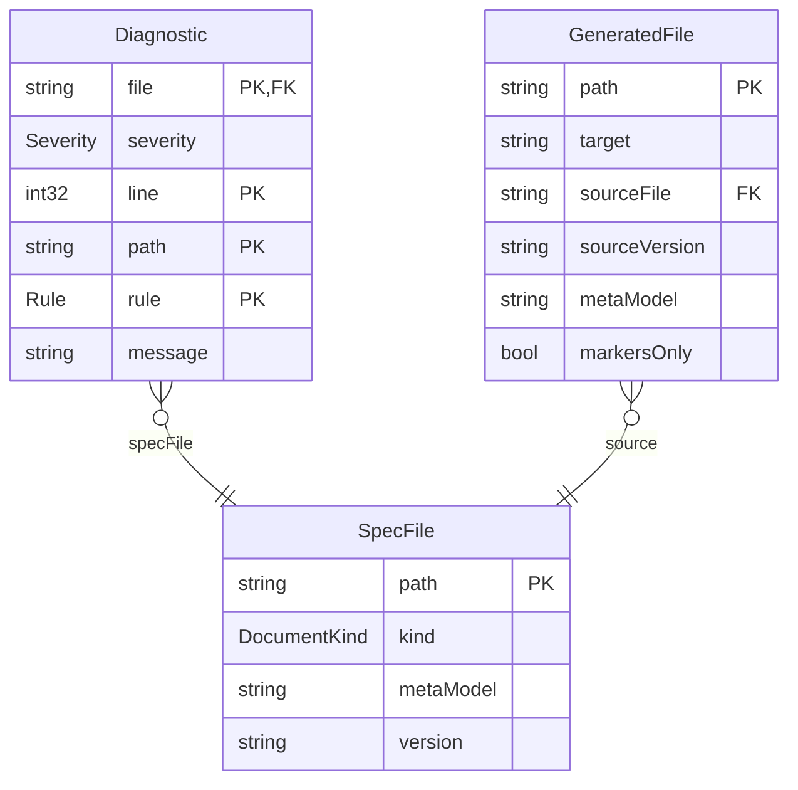

### Diagnostic

One problem found in one file. Printed as one line:
`file:line: severity: /yaml/path: rule: message`.

| Field | Type | Required | Limits | Description |
|---|---|---|---|---|
| file | string | yes |   | The file's path as given. |
| severity | Severity | yes |   |   |
| line | int32 | yes | at least 1 | Line of the YAML node the problem is at; for an expression, the line inside the expression. |
| path | string | yes |   | JSON pointer to the node, such as `/entities/Loan/relations/member/target`; `/` for the whole file. |
| rule | Rule | yes |   |   |
| message | string | yes | at least 1 character | What is wrong and how to fix it, in one plain sentence. |

Primary key: file, line, path, rule.

| Relation | Kind | Target | Via | On delete |
|---|---|---|---|---|
| specFile | many-to-one | SpecFile | file | restrict |

| Constraint | Rule | Message |
|---|---|---|
| diagnostic_line_positive | check `line >= 1` | Every diagnostic points at a line. |

### GeneratedFile

A file a document or code target wrote. Its header names where it came from.

| Field | Type | Required | Limits | Description |
|---|---|---|---|---|
| path | string | yes |   | Path inside the target's own folder. |
| target | string | yes | at least 1 character | The document or code target that wrote it, such as `techspec` or `openapi`. |
| sourceFile | string | yes |   | The root file of the specification it was made from. |
| sourceVersion | string | yes |   | That specification's `info.version`. |
| metaModel | string | yes |   | The meta-model version of that specification. |
| markersOnly | bool | yes |   | True for a hand-written Markdown document, where only the text between `specarch:generate` markers is rewritten. |

Primary key: path.

| Relation | Kind | Target | Via | On delete |
|---|---|---|---|---|
| source | many-to-one | SpecFile | sourceFile | restrict |

### SpecFile

One input given to a command, as the command read it; a specification is one input, whatever the number of files in its tree.

| Field | Type | Required | Limits | Description |
|---|---|---|---|---|
| path | string | yes |   | The path as given on the command line or found under a given folder: a specification's root folder, or an implementation file. |
| kind | DocumentKind | yes |   |   |
| metaModel | string | yes |   | The meta-model version the input declares: `specarch` in a root file, `specarchImplementation` in an implementation file. |
| version | string | yes |   | The input's own `info.version`. |

Primary key: path.

### Enums

| Enum | Value | Meaning |
|---|---|---|
| DocumentKind | specification | a specification, the tree rooted at `specarch.yaml`; its design side is the SpecArch Definition (SDF) |
| DocumentKind | implementation | a SpecArch Implementation File (SIF), `<name>.<stack>.specarch-implementation.yaml`, one stack's implementation of a specification |
| DocumentTarget | techspec | arc42 technical specification in Markdown with generated Mermaid diagrams |
| DocumentTarget | requirements | requirements specification, in the layout of ISO/IEC/IEEE 29148 |
| DocumentTarget | testplan | test plan and test cases, golden and red, traced to requirements |
| DocumentTarget | traceability | the traceability matrix from needs through requirements to design elements, tests and checks |
| DocumentTarget | deployment | deployment guide, from the deployment stage and the implementation's deployments |
| DocumentTarget | commissioning | commissioning test procedure and sign-off sheet |
| DocumentTarget | questions | the open questions by stage, what each blocks and who decides, and which outputs are ready, drafts or waiting |
| DocumentTarget | changes | the change and defect register, open items first, from the records beside the specification |
| DocumentTarget | releases | release notes, newest first, each release's changes and fixes grouped as added, changed, removed and fixed, from the records |
| DocumentTarget | manual | user manual, from the pages and permissions |
| DocumentTarget | operations | operations guide, from the endpoints, channels and deployments |
| GeneratorTarget | openapi | OpenAPI 3.1 document |
| GeneratorTarget | sql | forward SQL migrations, new files only |
| GeneratorTarget | ui | page definitions for the target component library |
| GeneratorTarget | tests | one test per design test and per worked example, in the implementation's framework |
| GeneratorTarget | scripts | guarded operational scripts for data changes |
| Rule | file_kind | a file given by name is neither `specarch.yaml` nor `*.specarch-implementation.yaml`, is part of a specification that should be checked as a whole, or its root key does not match its name |
| Rule | yaml_syntax | the file is not well-formed YAML |
| Rule | unquoted_date | a date written without quotes, which YAML reads as a timestamp |
| Rule | duplicate_key | a mapping repeats a key, or two files of one specification define the same name |
| Rule | schema | the file breaks the meta-model's JSON Schema |
| Rule | stack_key | a specification carries a key that belongs to one implementation |
| Rule | design_key | an implementation file carries a key that belongs to the specification |
| Rule | ref_type | a `$ref` names an entity or enum the specification does not have |
| Rule | relation_target | a relation's target is not an entity of the specification |
| Rule | relation_via | a relation's `via` is not the field or join entity its kind needs |
| Rule | field | a name that must be a field of an entity is not one (required, primaryKey, unique fields, page columns, fields and filters) |
| Rule | state_field | the `stateField` is not a field whose type is an enum |
| Rule | state_value | a transition's `from` or `to` is not a value of the state field's enum |
| Rule | trigger | a transition's trigger is not an operation, command, channel message or algorithm |
| Rule | requirement | a `satisfies` or `verifies` link names a requirement that is neither in the specification nor in a declared requirement set |
| Rule | emits | an `emits` entry names a channel or message that does not exist |
| Rule | dependency | a `calls` entry names a dependency that is not declared, or a dependency's timeout is zero |
| Rule | idempotency_key | an `idempotencyKey` names no header parameter of its operation, or sits on a method that RFC 9110 already makes idempotent |
| Rule | validity | a `validity` names a field the entity does not have, one that is not a date or a date-time, or a `from` and an `until` of different formats |
| Rule | session | a session's idle or absolute timeout is zero |
| Rule | guard | a `guard` names an entity that does not exist (its precondition is checked as a check constraint is) |
| Rule | operation | a `source`, `submit` or operation action names an operationId that does not exist |
| Rule | page | a navigate action names a page that does not exist |
| Rule | algorithm | an `algorithm` reference names an algorithm that does not exist |
| Rule | decision | a `supersededBy` names a decision that does not exist, or an implementation decision reuses a design decision's ID |
| Rule | enum_value | a `valueDescriptions` key is not a value of its enum |
| Rule | path_parameter | a `{name}` in a path has no path parameter, or a path parameter is not in the path |
| Rule | duplicate_operation | two operations share an operationId |
| Rule | permission_undeclared | an operation, command, page, action or role names a permission that is not declared |
| Rule | permission_ungranted | a declared permission is granted by no role and is not `public` |
| Rule | expression_syntax | a check or formula does not parse |
| Rule | expression_name | an expression names a field, input or function that does not exist |
| Rule | expression_type | an expression combines values of types that do not fit |
| Rule | example_input | a worked example's inputs are missing one, name an unknown one, or have the wrong type |
| Rule | example_expected | a worked example's expected value does not have the output's type |
| Rule | example_mismatch | the formula evaluated on a worked example's inputs does not give the expected value |
| Rule | example_error | the formula cannot be evaluated on a worked example's inputs (division by zero, null in arithmetic) |
| Rule | implements | an implementation file's `implements` does not name the root file of its specification at the same version |
| Rule | design_ref | a pointer into the specification does not resolve |
| Rule | unsafe_integer | an int64 or uint64 is carried as a JSON number without bounds inside 2^53 |
| Rule | change_log | a description reads as a change log instead of the current truth (a warning) |
| Rule | test_subject | a test is about an operation, command, page, constraint or transition that does not exist |
| Rule | test_case | a test covers a case its subject does not have, or a red case in a golden test |
| Rule | test_golden_missing | a subject has no golden scenario (a warning in 0.1) |
| Rule | test_red_missing | a subject has no red scenario and no derived red case (a warning in 0.1) |
| Rule | test_case_missing | a chosen case derived from the design has no test; a case is chosen when its subject satisfies a requirement with `harm`, when it is a failing dependency, or when users get it wrong often (a warning in 0.1) |
| Rule | suite | an implementation's test suite names a design test or subject that does not exist |
| Rule | test_data | a test's fixture, input or expect names what the design does not have, carries a value of the wrong type, holds a record a check constraint refuses, or says the same thing as a data folder beside it |
| Rule | layout | a file or a section is not where the tree layout puts it; the root file's `stages` and the folders disagree, a test folder has no `test.yaml`, or a folder is not a stage |
| Rule | need | a requirement's `needs` names a need that does not exist |
| Rule | stakeholder | a need's `stakeholders` names a stakeholder that does not exist |
| Rule | source | a citation names a source that is not declared under `sources` |
| Rule | environment | a check, an environment's `promotesTo` or an implementation's deployment names an environment that does not exist, or a deployment names none when the specification declares them |
| Rule | setting | an implementation's deployment gives a value to a setting the specification does not declare |
| Rule | secret_value | a setting marked secret carries a value, as a default or in a deployment |
| Rule | monitor | an implementation's deployment watches a monitor the specification does not declare |
| Rule | record_name | a record's file name is not its ID, its version, or its date and environment, or it does not sit in the folder of its kind under `records/` |
| Rule | record_ref | a record names a stakeholder, requirement, `#/` pointer, test, environment or monitor the specification does not have, or a change, defect, incident, release or commissioning run that is not a record and not in a declared change-set or defect-set |
| Rule | change_applied | an implemented or released change's `adds` or `changes` do not resolve or its `removes` still do, or an open change's `changes` or `removes` do not resolve; an open change whose `adds` already resolve is a warning |
| Rule | change_decision | an approved, implemented or released change has no decision with outcome approved, or a rejected one no decision with outcome rejected |
| Rule | defect_test | a fixed or released defect names no test, or one that neither verifies a requirement the defect violates nor is about an element it violates |
| Rule | defect_duplicate | a duplicate defect names no defect, one that does not exist, or one that is itself a duplicate |
| Rule | incident_link | a resolved incident links to no defect or change and gives no `noChange` reason (a warning) |
| Rule | commissioning_record | a commissioning record's results name a check that does not exist, or its version is not a release's |
| Rule | release_contents | a released release includes a change that is not implemented or released or a defect that is not fixed or released, or a released change or defect and the release it names disagree |
| Rule | release_bump | a released version steps from the previous released version by less than the largest impact of what it includes |
| Rule | release_version | info.version is neither the newest released version nor a later pre-release of a planned release, or a release's specificationVersion is not its version |
| Rule | need_unrefined | no requirement refines a need whose status is not rejected (a warning) |
| Rule | acceptance_missing | a requirement has no acceptance criteria (a warning) |
| Rule | requirement_unsatisfied | the specification has a design and no element of it satisfies a requirement (a warning) |
| Rule | requirement_unverified | the specification has tests, checks or monitors and none verifies a requirement (a warning) |
| Rule | question_block | a question's `blocks` entry is neither a stage, a section, nor a pointer to an element of the specification or to one missing key of it |
| Rule | question_stage | a question blocks more than one stage, or sits in a file of another stage than the one it blocks |
| Rule | question_answered | an accepted decision answers a question that is still in the specification |
| Rule | origin_citation | an element whose origin is stated cites nothing |
| Rule | origin_reason | an element whose origin is inferred has no why |
| Rule | origin_decision | an element whose origin is decided names no decision, or a decision that does not exist or is not accepted, or is a decision itself; or decidedIn is set without origin decided |
| Rule | origin_missing | the specification tracks origin and an element of a section carries none (a warning) |
| Rule | idiom_unknown | an implementation file's `idioms` key, or an override's `overrides.idiom`, names no shipped idiom and none of the project's, or an override names no file in the idioms folder |
| Rule | idiom_part_unknown | an override names a part the idiom does not have, or defines a part it does not list under `overrides.parts` |
| Rule | idiom_override_reason | an idiom is excluded, or overridden, without `why` |
| Rule | idiom_stack | an override renders a stack that is not the implementation file's: its language, the dialect of one of its targets, or `any` |
| Rule | idiom_version_behind | an override was copied from an older version of the shipped idiom and does not say it stays behind on purpose (a warning) |
| Rule | idiom_contract | an override changes a shipped contract statement, or a field has no row in a type rendering for a stack of the implementation file |
| Rule | sensitivity_exposed | a credential field that is not writeOnly can appear in a response; a personal field can appear in the response of a public operation (a warning) |
| Rule | at_rest | lookup without atRest encrypted, or an encrypted field that is a key or unique without lookup hash |
| Rule | audited | an audited entity declares a field the system sets (createdAt, createdBy, lastModifiedAt, lastModifiedBy), or one with soft deletion declares deleted |
| Rule | list_of | a listOf names an entity the specification does not have or a field the entity does not have, puts an encrypted field in searchable or sortable or in filterable without lookup hash, or has a default page size above its maximum |
| Rule | limits | a rate's time is zero, or its burst is below its requests |
| Rule | problem | a response names a problem type not under errors, or one of another status, or the specification declares errors and a 4xx or 5xx response names none |
| Rule | job | a job acts as a role the specification does not have, reads or writes an entity it does not have, or consumes a message no channel declares |
| Rule | menu | a menu entry opens a page the specification does not have |
| Rule | view | a view reads from an entity the specification does not have, follows a path or counts a relation that does not lead where it must, repeats a field of its entity, shares an entity's name, or is used where it would be written |
| Rule | flow | a page event is on a page or an action that does not raise it, leads to a page the specification does not have, or does not give that page exactly its route parameters from fields of the page's entity |
| Rule | state | a page's states leave out the empty state a list shows or the filtered empty state its filters can reach, name one it cannot reach, leave a problem type the page can meet without a message and without a default, name a problem type it cannot meet, put a field on a page that is not a form or that the form does not show, or give a message that is not a full sentence |
| Rule | accessibility | once the specification names its accessibility target, a field a page shows has no title, or two actions of a page share a label |
| Rule | theme | a design token has no type, a type SpecArch does not take, or a value not of its type, an alias names no token or one of another type or leads back to itself, a mode gives a token that does not exist, or a pair of colours is translucent or has less contrast than WCAG 2.2 asks of its use |
| Severity | error | the file is invalid |
| Severity | warning | printed, but the file stays valid; missing test scenarios, change-log phrases, traceability gaps and elements without origin |

**Note on DocumentTarget:** From ISO/IEC/IEEE 29119-3, Software and systems engineering, Software testing, Part 3, Test documentation, 2021, clause 7.2 and 8.3: A test plan and test case specifications are the test documentation items of a project. <https://www.iso.org/standard/79429.html>

## 6. Runtime view

### Command approve

Validates its input first and approves nothing with errors. Then
refuses while a must or should question is open, when `--by` is not a
stakeholder of the specification, when no document target is
configured, and when any configured document on disk is not what the
specification generates now, so that what was read is what is
approved. Otherwise writes `records/approvals/<version>.yaml` beside
the specification's folder: the record kind, the version, who
approved, the date, the documents that were current, and the digest
of the specification's files (the SHA-256 of every `.yaml` file under
its folder, in byte order of their relative paths, each as its path,
a zero byte, its bytes and a zero byte). A later change to any of
those files voids the approval, and `generate` says so.

**Insight:** A specification is reviewed in the form its readers use, the documents, and approval must be of exactly what was read; a digest of the files says so where a version number, which does not change while a specification is being written, cannot. The record names a role, because a specification is read and copied by more people than a ticket system.

**Note:** From ISO/IEC/IEEE 29148, Systems and software engineering, Life cycle processes, Requirements engineering, 2018, clause 6.3.3.6: Requirements validation is subject to approval by the project authority and the key stakeholders. <https://www.iso.org/standard/72089.html>

**Note:** From ISO/IEC/IEEE 29148, Systems and software engineering, Life cycle processes, Requirements engineering, 2018, clause 3: A baseline is a formally approved version of a configuration item, fixed at a point in time. <https://www.iso.org/standard/72089.html>

| Argument or option | Type | Required | Description |
|---|---|---|---|
| `<paths>` | string, one or more | yes | Folders holding specifications, searched as validate searches them. |
| `--by` | string | yes | The stakeholder who read the documents and approves, by key; a role, never a person. |
| `--date` | date |   | The date of the approval, as YYYY-MM-DD. Today when not given. |

Reads `{paths}`: The specifications and their implementation files; `<output>/<target>.md`: Every configured document, compared with what the specification generates now.

Writes `records/approvals/<version>.yaml`: The approval record, beside the specification's folder; an earlier approval of the same version is replaced.

Standard output: The errors of an invalid specification, and one line per configured document that is missing or differs.

Standard error: A usage message on a usage error, the reason a refusal, and one line naming the record written.

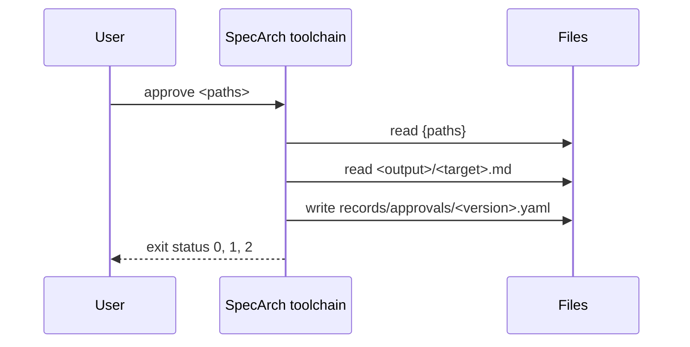

### Command derive

Validates its input first and writes nothing from an invalid
specification. Then, for every subject without a golden test, writes
its success test, and for every chosen derived case no test covers,
writes a test: a folder `tests/<name>/test.yaml` named as the
validator suggests, with the subject, the scenario, the level,
`covers`, `given`, `when` and `then` as the derivation words them,
`verifies` from what the subject satisfies, `origin: inferred` and a
`why` that says why the case was chosen, and the expected status or
exit, or the caller of a denied case, where the design says them for
certain.

What it writes is a draft the author completes, not a generated
output: it has no header and no `--check`, and an existing test
folder is never overwritten. A subject a must or should question
holds up is left out and named on standard error, since a test of a
half-defined element would be a placeholder. A specification that
keeps its tests in the root file is refused: each derived test needs
a folder of its own. Writing tests changes the specification, so an
approval of it no longer holds.

**Insight:** The validator already says which tests a specification implies and gives each one to copy; writing them out is the step that turns the warnings into a test suite the author completes, instead of one the author types out from the warnings.

| Argument or option | Type | Required | Description |
|---|---|---|---|
| `<paths>` | string, one or more | yes | Folders holding specifications, searched as validate searches them. |

Reads `{paths}`: The specifications.

Writes `tests/<name>/test.yaml under each specification's folder`: One draft test per derived case no test covers.

Standard output: The errors of an invalid specification, one line each; otherwise the path of each test written, one per line.

Standard error: A usage message on a usage error, the reason on an unreadable path, each test left out or kept with the reason, and the count written.

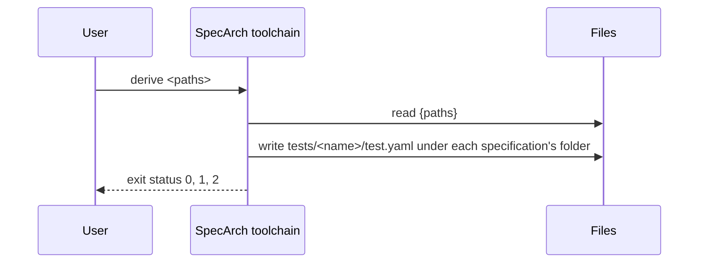

### Command diff

Validates both specifications first and prints nothing but the
errors of one that has them. Then lists every element added, changed
or removed between them, one line each in pointer order, as
`<impact> <added|changed|removed> <pointer>`, with the change that
decided the impact of a changed element of the public interface
after it. The impact follows Semantic Versioning: an element inside
the system is patch whatever happens to it; on the public interface
an addition is minor, a removal major, and a change the largest of
its changes, a change that cannot be shown safe counting as major.

Then it checks the release of the new version, read from the
records beside the new folder: that its version steps from the old
one by at least the largest impact (version), and that a change
request or defect it includes names every element in the list
(covered). Each failed check is one line starting `error:`; an
element the records cannot be shown to name because the release
includes an ID kept in a tracker is a line starting `warning:`.

**Insight:** The validator sees one version at a time, so it can check what a release record says but not whether the specification changed the way the record says. Only a comparison of the two versions can tell that a release called minor removed an operation, or that an element changed with no change request behind it.

**Note:** From Semantic Versioning, 2.0.0, clause rules 6 to 8: The patch version steps for fixes that keep the interface, the minor version for additions that keep it, and the major version for changes that break it. <https://semver.org/spec/v2.0.0.html>

| Argument or option | Type | Required | Description |
|---|---|---|---|
| `<old>` | string | yes | The folder of the earlier specification, normally the previous release's tag checked out on its own. |
| `<new>` | string | yes | The folder of the later specification, normally the working tree. |

Reads `{old}`: The earlier specification; `{new}`: The later specification; `records/ beside {new}`: The release record of the new version and the change and defect records it includes.

Standard output: The errors of an invalid specification, one line each; otherwise the change list, then one line per failed check.

Standard error: A usage message on a usage error, and the reason on an unreadable path.

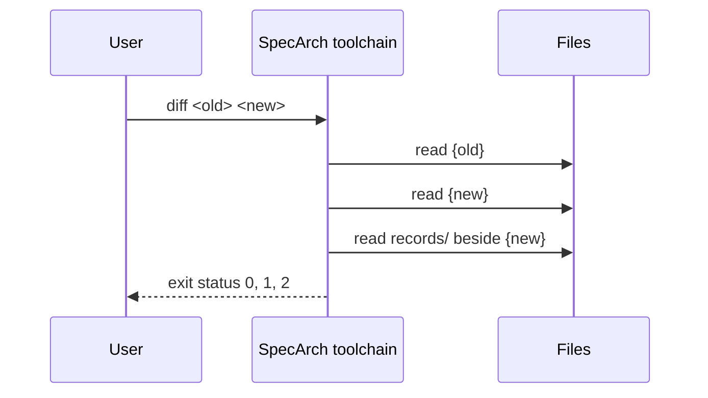

### Command document

Validates its input first and writes nothing from an invalid
specification. Then writes the document into the folder the target
owns, and nothing outside it, except the regions between
`specarch:generate` markers in the hand-written `specarch.md` beside
the root file. Every generated file starts with a header naming the
root file, its `info.version`, each implementation file, and the
meta-model version. With `--check` nothing is written: the output is
made in memory and compared with what is on disk.

The techspec target writes `techspec.md`: an arc42 technical
specification of the whole specification, with chapters only for
what it holds. Diagrams are Mermaid: an entity diagram, a state
diagram for each entity with a state field, a sequence diagram for
each operation and command, a flowchart of the pages, and a
permissions table. Chapter 2 comes from the constraints and
assumptions, chapter 7 from the deployment and commissioning stages
and from each implementation file, chapter 12 from the glossary, and
chapter 13 from the needs and requirements, with the traceability
matrix of what satisfies and what verifies each requirement, and its
harm once a requirement names one. A marker
names what goes in its region: `erDiagram`, `stateDiagram <Entity>`,
`sequenceDiagram <operationId or command>`, `flowchart pages` or
`permissions`.

The requirements target writes `requirements.md`: the stakeholders,
the needs with the requirements that refine them, and each
requirement with its attributes and acceptance criteria. The
testplan target writes `testplan.md`: the levels, how each
implementation's suites run the tests, and every design test as a
test case, grouped by subject, then each state machine with its
state diagram and its paths from an initial to a terminal state, each
with the tests that walk it, then the derived cases left out: each
case of rank other that no test covers, with its subject and the
reason. The traceability target writes `traceability.md`: needs to
requirements, requirements to what satisfies and verifies them, with
their harm once a requirement names one, and the gaps the validator
warns about.
The deployment target writes `deployment.md`: the environments and
the path a release takes, the settings, each installation of each
implementation with its servers and setting values (a secret only
named), release, rollback and the migrations. The commissioning
target writes `commissioning.md`: the checks by environment in the
order a release reaches them, each step with a Result column, and
the sign-off sheet.

The questions target writes `questions.md`: the open questions by
stage with what each blocks and who decides, and which outputs are
ready, drafts or waiting; the same text `gaps` prints. Every other
document shows an element's origin as an Origin line and the open
questions about it as Open question paragraphs, and starts with a
Draft notice when a must or should question blocks what it reads.

The changes and releases targets are made from the records beside the
specification, and their header names the records folder too. The
changes target writes `changes.md`: the change requests and the
defects, open ones first, each with its status, what it affects or
violates and its decision. The releases target writes `releases.md`:
the releases newest first, each with what it includes grouped as
added, changed, removed and fixed. Neither is ever a draft.

In every document an element's why is an Insight and each citation
a Note (ADR-015), and a document that cites sources ends with them.

**Insight:** Documents are read by more people than the YAML, so they come first among the targets and are made from the specification rather than kept beside it.

**Note:** From arc42, the template for architecture documentation, 8.2: The twelve chapters of an architecture document, from introduction and goals to glossary. <https://arc42.org/overview>

| Argument or option | Type | Required | Description |
|---|---|---|---|
| `<target>` | DocumentTarget | yes |   |
| `<paths>` | string, one or more | yes | Folders holding specifications, searched as validate searches them. |
| `--out` | string |   | The folder the target owns. Without it, the folder the implementation files' `targets` name for the target, relative to each implementation file; they must agree. |
| `--check` | bool |   | Make the output in memory and fail when the files on disk differ. Writes nothing. |

Reads `{paths}`: The specifications and their implementation files; `specarch.md`: The hand-written document beside each root file, when there is one; `records/ beside each specification's folder`: The change, defect and release records, for the changes and releases targets; `{out}`: The current output, with `--check`.

Writes `{out}/<target>.md`: The document. Nothing is written with `--check`; `specarch.md`: Only the regions between markers. Nothing is written with `--check`.

Standard output: The diagnostics of an invalid specification and the errors of a
marker, one line each. With `--check`, one line per file that differs
or is missing.

Standard error: A usage message on a usage error, the reason a file cannot be read or written, and a one-line count at the end.

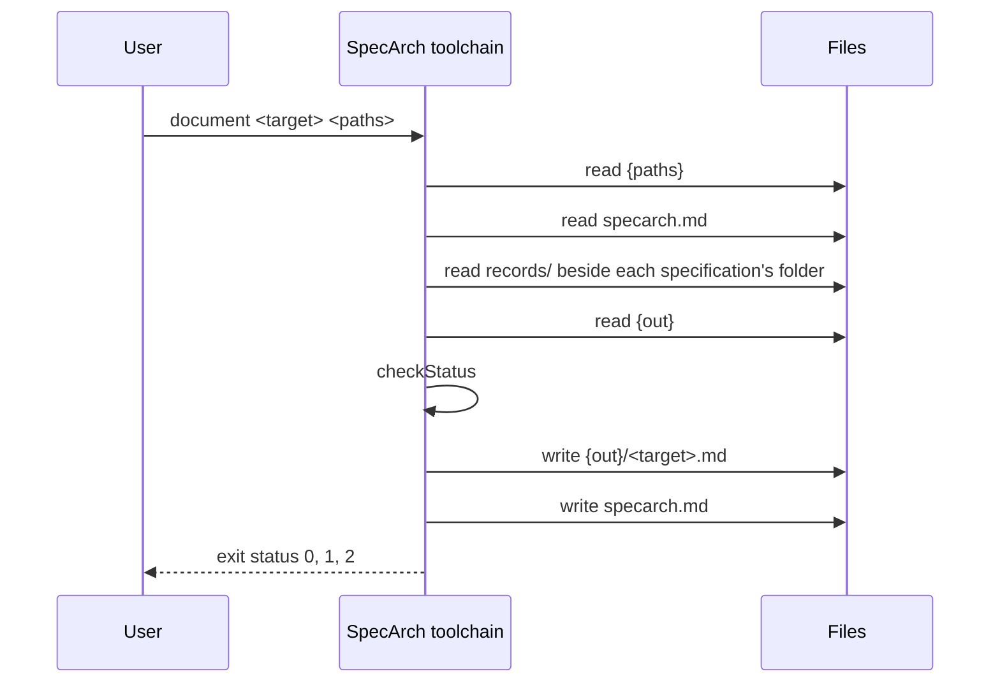

### Command extract

Reads a surface of an existing system and writes the as-built
specification of it into a folder, following the method in
`docs/extraction.md`: the built router for endpoints, the database
catalogue for entities, an OpenAPI document for operations, the
running authorisation rules for permissions. The source names which
surface is read. The result is a specification tree to be checked by
regenerating and comparing, then reviewed by hand. This command is
designed here and built when the first real project needs it; until
then every build answers with status 2.

**Insight:** Existing systems enter SpecArch by extraction, so the verb exists from the start; building it waits for the real projects that show which readers repeat.

| Argument or option | Type | Required | Description |
|---|---|---|---|
| `<source>` | string | yes | The surface to read, such as `openapi`, `database` or `router`. |
| `<paths>` | string, one or more | yes | What to read it from, as the source needs it. |
| `--out` | string | yes | The folder the specification is written into; it becomes the specification's root folder. |

Reads `{paths}`: The surface being read.

Writes `{out}/`: The as-built specification tree.

Standard output: One line per object the specification could not hold, naming it, so the gap is recorded.

Standard error: A usage message on a usage error, and the reason a source could not be read.

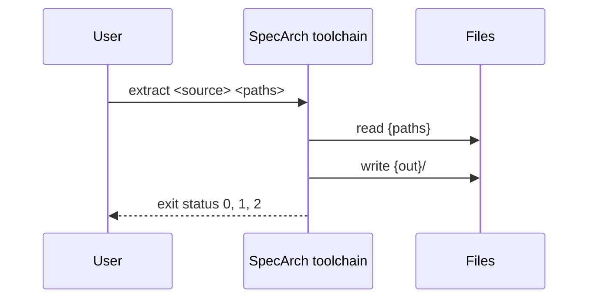

### Command gaps

Validates its input first and prints nothing but the errors from a
specification that has them. Then prints the open questions
document, the text `document questions` writes, from its title:
the counts by priority, the elements by origin when the
specification tracks it, the questions grouped by stage in
life-cycle order and within a stage by priority then ID, each with
who decides, what it blocks (and for a blocked element, which keys
are missing there), its options, its Insight and Notes; then, when
a source lists its clauses, the coverage: per such source, the
elements each clause produced, how many clauses produced nothing,
and the citations outside the listed clauses; then the outputs, one row per document target and per code target the
implementation files name, each ready, a draft (the questions that
concern it) or waiting (the questions, and the approval that is
missing or void).

**Insight:** The owner and the agent run validate after every edit, so validate counts the open questions and lists none; this verb is the list, with what each question holds up, so that the next decision is always in view. The same text is the document, because the people who decide read documents, not terminals.

**Note:** From ISO/IEC/IEEE 29148, Systems and software engineering, Life cycle processes, Requirements engineering, 2018, clause 6.6.3: The closure of to-be-determined and to-be-resolved items against plan is a measure of the requirements work. <https://www.iso.org/standard/72089.html>

| Argument or option | Type | Required | Description |
|---|---|---|---|
| `<paths>` | string, one or more | yes | Folders holding specifications, searched as validate searches them. |

Reads `{paths}`: The specifications and their implementation files; `records/approvals/<version>.yaml`: The approval of the specification's version, beside its folder, when there is one.

Standard output: The errors of an invalid specification, one line each; otherwise the open questions document of each specification.

Standard error: A usage message on a usage error, and the reason on an unreadable path.

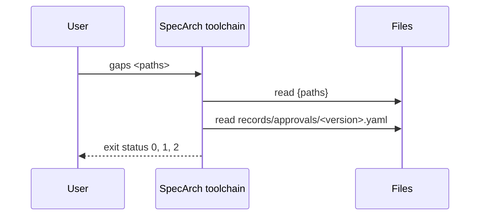

### Command generate

Validates its input first and writes nothing from an invalid
specification. Then refuses, with status 1, while a must or should
question blocks a section the target reads: the sections the
implementation file names under `targets.<target>.reads`, or every
section when it names none. Then refuses, with status 1, when
`records/approvals/<version>.yaml` is missing or its digest is not the
digest of the specification's files now, unless `--unapproved` is
given. Then writes the target into the folder it owns, and nothing
outside it. With `--check` nothing is written: the output is made in
memory and compared with what is on disk.

A target this program does not build in is produced by a plug-in found
on PATH. For each implementation file that names the target under
`targets` (every implementation file when none does), the plug-in is
`specarch-gen-<target>-<stack>` when there is one, where the stack is
the file's `stack.language.name` in lower case with a dash for a space,
and `specarch-gen-<target>` otherwise; neither found is status 2. Files
that find the same plug-in run it together, and each plug-in writes
into the folder its files name, so `--out` is refused when the files
reach more than one plug-in. The program runs each plug-in once per
specification with a request on its standard input, as JSON:
`specarch` (the meta-model version), `target`, `root` (the root file's
path), `specification` (the merged, validated specification as plain
values), `implementations` (each implementation file as `file`,
`content`, the target's `settings` from it, and `idioms`, the idioms
it uses, each with its `name`, `version`, how it applies (`as`:
shipped, overridden, project or excluded), the `content` of the idiom
that applies and the project's `override`) and `output` (the folder
the files are for), and `existing`, the text files already in that
folder by their path in it, so a plug-in that adds files, such as a
migration beside a snapshot, knows what is there without reading the
disk. The plug-in answers on its standard output,
as JSON, with `files` (each a `path` relative to the output folder and
its `content`) and `diagnostics` (each with the validator's fields:
file, line, severity, path, rule, message), and exits 0. The program
prints the diagnostics, refuses a path outside the output folder,
and writes or checks the files itself. A plug-in that exits with
another status, or answers with something else, fails the run with
status 2; its standard error is passed through.

**Insight:** One program with verbs, and generators as plug-ins found on PATH, is the pattern of protoc, git and kubectl: one name to learn and install, one parser, one diagnostic format and one version shared by every target, and new targets added without changing the program. Letting the program write the files, as protoc does, keeps `--check` and the rule "only into its folder" true for every plug-in without each one having to implement them.

**Note:** From Protocol buffers compiler plug-in protocol, plugin.proto, 2024: A plug-in reads a CodeGeneratorRequest from standard input and writes a CodeGeneratorResponse to standard output; the file names it answers are relative to the output directory, and protoc writes them. <https://github.com/protocolbuffers/protobuf/blob/main/src/google/protobuf/compiler/plugin.proto>

| Argument or option | Type | Required | Description |
|---|---|---|---|
| `<target>` | string | yes | A code or data target, built in or offered by a plug-in; kebab-case. |
| `<paths>` | string, one or more | yes | Folders holding specifications, searched as validate searches them. |
| `--out` | string |   | The folder the target owns. Without it, the folder the implementation files' `targets` name for the target, relative to each implementation file; they must agree. |
| `--check` | bool |   | Make the output in memory and fail when the files on disk differ. Writes nothing. |
| `--unapproved` | bool |   | Generate from a specification that no approval record covers. The refusal is the default; this says, visibly, that the output is not from an approved specification. |

Reads `{paths}`: The specifications and their implementation files; `records/approvals/<version>.yaml`: The approval of the specification's version, beside its folder; `{out}`: The current output, with `--check`; `specarch-gen-{target} on PATH`: The plug-in for a target that is not built in.

Writes `{out}/`: The files the target produces, as the plug-in answers them. Nothing is written with `--check`.

Standard output: The diagnostics of an invalid specification and the diagnostics the
plug-in answers with, one line each. With `--check`, one line per
file that differs or is missing.

Standard error: A usage message on a usage error, the reason a plug-in was not found or failed, the plug-in's own standard error, and a one-line count at the end.

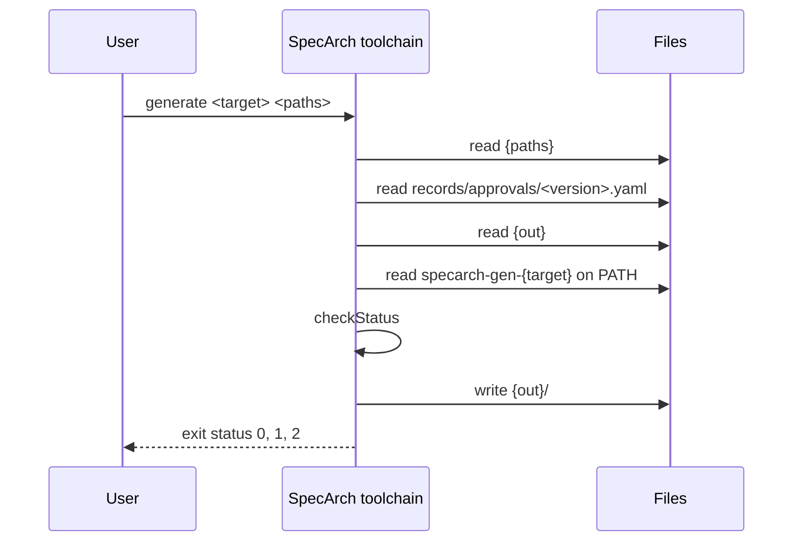

### Command idioms

Validates its input first and prints nothing but the errors from a
specification that has them. Then prints, for every implementation
file of every specification, its path and one line per idiom: every
shipped idiom and every one of the project's own that applies to the
file, by its stacks and by the keywords the specification uses, with
its version and how it applies: shipped, overridden (by which file,
copied from which version, replacing which parts), the project's own,
or excluded; an override's or an exclusion's reason follows.

**Insight:** The shipped idioms apply without a word in the implementation file, so a reader needs one place that says which ones do, and where the project deviates.

| Argument or option | Type | Required | Description |
|---|---|---|---|
| `<paths>` | string, one or more | yes | Folders holding specifications, searched as validate searches them. |

Reads `{paths}`: The specifications, their implementation files, and the idioms folder beside each.

Standard output: The errors of an invalid specification, one line each; otherwise each implementation file's path and its idioms, one per line.

Standard error: A usage message on a usage error, and the reason on an unreadable path.

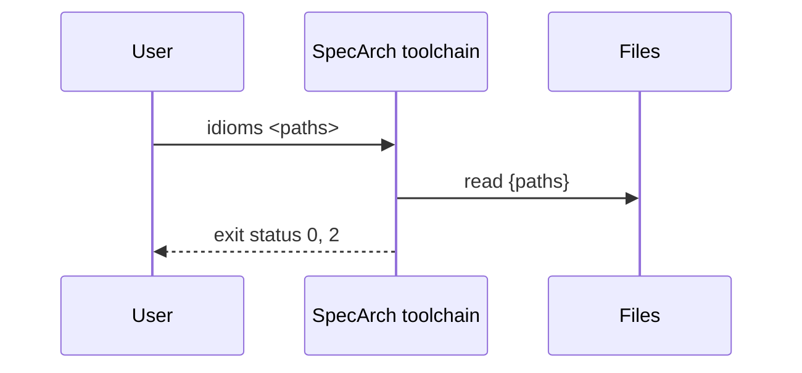

### Command idioms diff

Validates its input first, as idioms does. Then, for every
implementation file that overrides the named idiom, prints the
override's file, the version it was copied from and the version this
program ships, and for each part it replaces and each stack the
override renders, the shipped rendering and then the override's, as
YAML. With no override of the idiom, it says so.

**Insight:** An override records the version it was copied from, and the validator warns when a newer one ships; this is how the project sees what changed before it moves.

| Argument or option | Type | Required | Description |
|---|---|---|---|
| `<idiom>` | string | yes | The name of a shipped idiom. |
| `<paths>` | string, one or more | yes | Folders holding specifications, searched as validate searches them. |

Reads `{paths}`: The specifications, their implementation files, and the idioms folder beside each.

Standard output: The errors of an invalid specification, one line each; otherwise each override with the shipped and the overriding renderings of what it replaces.

Standard error: A usage message on a usage error, the reason on an unreadable path, and that the idiom is not shipped.

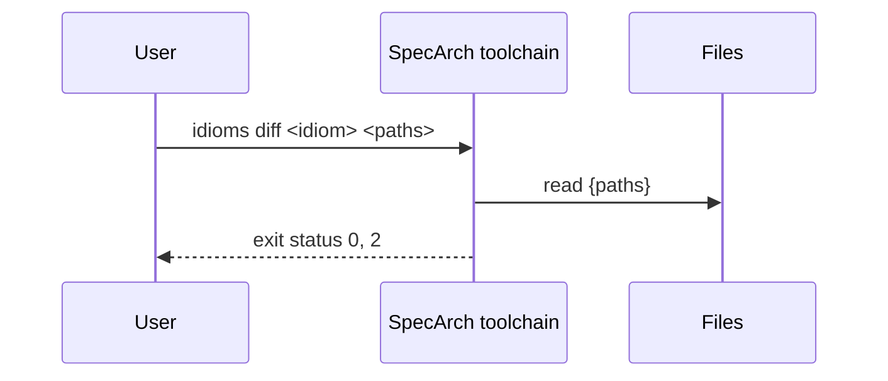

### Command validate

Checks every specification found under the paths given: a folder that
holds `specarch.yaml` is one specification, read as a whole, including
the implementation files under its `implementation/` folder; nothing
under it is searched further, so a test folder's data files are never
read as specifications. An implementation file outside any
specification is checked on its own against the specification its
`implements` names. A file given by name must be a root file or an
implementation file; a fragment of a tree is refused with the folder
to run on instead. The records in the `records/` folder beside a
specification's folder are checked with it.

Every specification is checked against the meta-model and against the
rules JSON Schema cannot express. It reports every problem in every
file, not only the first.

| Argument or option | Type | Required | Description |
|---|---|---|---|
| `<paths>` | string, one or more | yes | Folders and files. A folder is searched for specifications and for implementation files outside one. |

Reads `{paths}`: Root files, the files under their stage folders, and implementation files; `records/ beside each specification's folder`: The change, defect, release, incident, commissioning and approval records of that specification; `the specification named in each standalone implementation file's `implements``: Read to resolve that file's references.

Standard output: One line per diagnostic, sorted by file, then line, then path, then rule.

Standard error: A usage message on a usage error, the reason on an unreadable path, and a one-line count at the end, with the number of open questions when there are any.

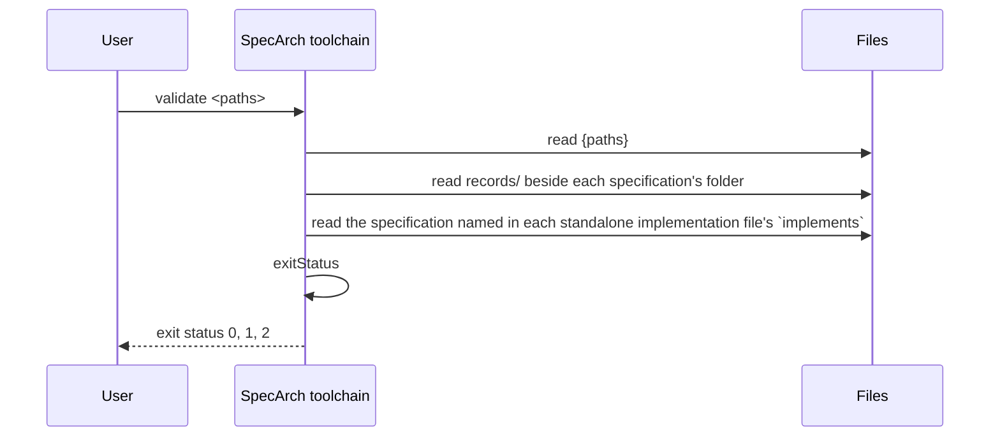

### Command version

**Insight:** One version answers which SpecArch made a file; every generated file's header names it.

Standard output: The program version, then one line per meta-model version it supports.

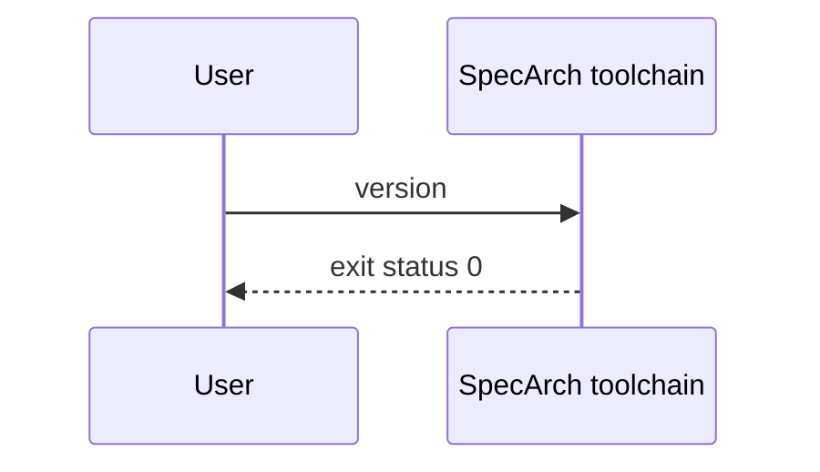

## 7. Deployment and implementation

### Environments

| Environment | Purpose | Promotes to |
|---|---|---|
| developer-machine | The machine of a person who writes specifications; the program is installed from source with one command. | ci-runner |
| ci-runner | The continuous-integration runner of a project that uses SpecArch; it builds the program from the pinned version in that project's workflow. |   |

### Release

A release is a tagged commit of this repository; nothing is uploaded anywhere, since every user builds the program from source.

**Note:** From ISO/IEC/IEEE 12207, Systems and software engineering, Software life cycle processes, 2017, clause 6.4.10: The transition process establishes the capability to provide the service in its operational environment. <https://www.iso.org/standard/63712.html>

| Step | Action | Check |
|---|---|---|
| 1. Check the tree | Run the implementation's build, test, validate and document --check tasks on the commit to release. | Every task exits 0. |
| 2. Tag the commit | Tag the commit with the program version, as the version command prints it. | The tag's name equals the output of specarch version. |
| 3. Announce | Write the release in the history file of the day, with the tag. | The history file names the tag. |

### Rollback

A user who hits a problem in a release installs the previous tag; the tags of every release stay.

| Step | Action | Check |
|---|---|---|
| 1. Install the previous tag | Install the program from the previous release tag with the implementation's install task. | specarch version prints the previous version. |
| 2. Record the problem | Open an issue naming the release and the problem, and note the rollback in the history file. | The issue exists and the history file names it. |

### Commissioning checks

Run on the installed system before it is handed over. The results of each run are records kept outside the specification.

#### installs-and-answers (smoke, in developer-machine)

The program installs from the release tag on a clean machine and answers.

| Step | Action | Check |
|---|---|---|
| 1. Install | Install the program from the release tag with one command, on a machine that has never had it. | The command exits 0. |
| 2. Run version | Run specarch version. | It prints the program version and the meta-model versions it reads, and exits 0. |

#### checks-the-examples (end-to-end, in developer-machine)

The installed program validates the example and this specification, and reproduces their committed documents.

| Step | Action | Check |
|---|---|---|
| 1. Validate | Run specarch validate on spec and examples of the release tag. | It exits 0 with no error. |
| 2. Compare the documents | Run specarch document techspec --check on spec and examples. | It exits 0 and names no file. |

#### no-network (security, in ci-runner)

The installed program needs no network.

**Note:** From IEC 62381, Automation systems in the process industry, Factory acceptance test (FAT), site acceptance test (SAT) and site integration test (SIT), 2024: A site acceptance test is run on the installed system in its real environment before it is accepted.

| Step | Action | Check |
|---|---|---|
| 1. Run offline | Run specarch validate on the example with the network switched off. | It exits 0; nothing waits on a connection. |

### Sign-off

The system is accepted when:

- Every check above passed on the release tag, and the record of the run is committed.
- The history file of the day names the tag.

Signed by: specarch-maintainers.

### Monitors

What is watched on the live system, and the objective each must meet.

| Monitor | Environment | Measures | Objective | Verifies |
|---|---|---|---|---|
| main-stays-green | ci-runner | The continuous-integration run on every change to main, both the Go and the Swift job. | Every run on main passes both jobs; a failed run is fixed or reverted before the next change lands. | SA-1, SA-7 |

**Insight on main-stays-green:** The documents and both builds are only trusted while CI keeps them current, so a red run on main is the one thing that must never stay.

### Implementation: SpecArch toolchain in Go

From the implementation file version 0.1.0.

The Go implementation of the specification in `spec/`: one static binary,
`specarch`, installed with `go install ./cmd/specarch`.

Stack: language Go 1.26; toolchain go 1.26.0; platforms darwin/arm64, darwin/amd64, linux/amd64, linux/arm64, windows/amd64.

#### Libraries

| Library | Version | Licence | Purpose |
|---|---|---|---|
| github.com/santhosh-tekuri/jsonschema/v6 | v6.0.3 | Apache-2.0 | JSON Schema 2020-12 validation against the schemas in `schema/`; the same library the repository's pinned `jv` check used. |
| golang.org/x/text | v0.42.0 | BSD-3-Clause | Message printing for the schema library. Pinned above 0.39.0, which fixes GO-2026-5970. |
| go.yaml.in/yaml/v3 | v3.0.5 | MIT AND Apache-2.0 | YAML parsing into a node tree, which keeps the line of every value for diagnostics. |
| cel.dev/cel-go | v0.32.0 | Apache-2.0 | The CEL parser; only its parser is used. |
| cel.dev/expr | v0.25.1 | Apache-2.0 | CEL's expression tree types, needed by the parser. |
| github.com/antlr4-go/antlr/v4 | v4.13.1 | BSD-3-Clause | The parser runtime the CEL grammar is generated for. |
| google.golang.org/protobuf | v1.36.10 | BSD-3-Clause | Needed by the CEL parser's tree types. |
| google.golang.org/genproto/googleapis/api | v0.0.0-20240826202546-f6391c0de4c7 | Apache-2.0 | Needed by the CEL parser's tree types. |
| google.golang.org/genproto/googleapis/rpc | v0.0.0-20240826202546-f6391c0de4c7 | Apache-2.0 | Needed by the CEL parser's tree types. |
| golang.org/x/exp | v0.0.0-20240823005443-9b4947da3948 | BSD-3-Clause | Needed by the CEL parser. |

#### Layout

| Path | Holds | Implements |
|---|---|---|
| cmd/specarch | The command line. Argument handling, finding the specifications under folders, running plug-ins, printing the diagnostics and the exit status. | #/commands/validate, #/commands/gaps, #/commands/document, #/commands/approve, #/commands/generate, #/commands/extract, #/commands/diff, #/commands/derive, #/commands/idioms, #/commands/idioms diff, #/commands/version, #/entities/SpecFile, #/entities/GeneratedFile, #/algorithms/exitStatus, #/algorithms/checkStatus |
| schema | The JSON Schemas, embedded into the binary from the files editors use. |   |
| idioms | The shipped idioms, one folder per concern, embedded into the binary; a release fixes the set. |   |
| internal/source | Reads a YAML file into a node tree and a plain value, with the line of every node; finds unquoted dates and duplicate keys. |   |
| internal/spec | Reads a specification from disk, the root file and the stage folders, and merges it into one document in which every node remembers its file; reports the layout problems. |   |
| cmd/specarch-gen-sql | The plug-in behind generate sql. Reads the request on standard input, answers the migration and the snapshot on standard output, and never touches the disk. | #/commands/generate |
| internal/gensql | The SQL migrations in four dialects, each column through the type-rendering idiom, with check expressions translated per dialect, the views after the tables, and a snapshot of the schema. |   |
| internal/typerows | Matches a field to a row of a type rendering, for the validator and the generators alike. |   |
| cmd/specarch-gen-openapi | The plug-in behind generate openapi. Reads the request on standard input, answers the OpenAPI document on standard output, and never touches the disk. | #/commands/generate |
| internal/genopenapi | The OpenAPI 3.1 document in the standard dialect, the design field for field, with the problem catalogue and lists paged through the paginated-list idiom; and in the dxlib dialect, what dxlib's reader binds. |   |
| cmd/specarch-gen-go-dxlib | The plug-in behind generate go-dxlib. Reads the request on standard input, answers the Go file on standard output, and never touches the disk. | #/commands/generate |
| internal/gendxlib | The Go file of a service on dxlib, its tables, handlers, seeds and tasks, read from the design through the dxlib dialect's names and types. |   |
| cmd/specarch-gen-tests-go | The plug-in behind generate tests for a Go implementation file. Reads the request on standard input, answers the Go test file on standard output, and never touches the disk. | #/commands/generate |
| internal/gentests | The Go tests a specification implies, as the plug-in writes them. One file per specification, with the Harness interface the project implements beside it; design tests become tests through it, worked examples unit tests of the algorithm's mapping. |   |
| internal/semver | Semantic Versioning 2.0.0 versions, their precedence, and the step one needs from another, with the step before 1.0.0; the release rules and diff measure a release with it. |   |
| internal/diff | Compares two merged specifications element by element, finds the public interface, and classifies each difference by the version step it needs. |   |
| internal/approval | The approval record beside a specification, its digest of the specification's files, and where a version's approval stands against the files now. |   |
| internal/expr | The expression subset. Parses with the cel-go parser, refuses what is outside the subset, type-checks with CEL's strict rules, and evaluates with exact integers and decimals. |   |
| internal/generate | The document targets. techspec writes the arc42 document and its Mermaid diagrams and rewrites the regions between markers in hand-written Markdown; requirements, testplan, traceability, deployment and commissioning write the other documents; questions writes the open questions and what they hold up, the text gaps prints. Every one renders why as an Insight, each citation as a Note, an element's origin as an Origin line and the open questions about it as Open question paragraphs. | #/algorithms/markersWellFormed |
| internal/validate | Schema validation with plain messages, the interface boundary, cross-references across the tree, fail-closed access, concrete integers, expressions, worked examples, tests and their derived cases with the rank of each and the cases left out, the life-cycle links and traceability warnings, the open questions and what they cover, origin, implementation references, and the records beside the specification. | #/entities/Diagnostic, #/enums/Rule, #/enums/Severity, #/algorithms/referenceResolves, #/algorithms/permissionGranted, #/algorithms/workedExampleHolds |

#### Mappings

| Design object | Implemented by | Notes |
|---|---|---|
| #/entities/Diagnostic | validate.Diagnostic | A struct; `String()` prints the one-line form. |
| #/entities/SpecFile | main.input | A root folder, an implementation file or a file given by name; the versions are read where they are checked. |
| #/enums/Rule | validate.Rule | A string type with one constant per value; validate.Rules lists them, and a test checks they equal the design's enum. |
| #/enums/Severity | validate.Severity |   |
| #/commands/validate | main.runValidate |   |
| #/commands/gaps | main.runGaps | Prints generate.Questions, the text the questions document target writes. |
| #/commands/approve | main.runApprove | Writes the record through the approval package after checking the documents with generate.Document. |
| #/commands/version | main.runVersion |   |
| #/commands/document | main.runDocument |   |
| #/commands/generate | main.runGenerate | Refuses through main.gate while a question blocks what the target reads or the approval is missing or void; then runs the plug-in with main.runPlugin; the request and answer are the pluginRequest and pluginResponse structs. |
| #/commands/extract | main.runExtract | Answers with status 2 until it is built. |
| #/commands/derive | main.runDerive | Writes validate.Drafts, the drafts of the cases the warnings name. |
| #/commands/idioms | main.runIdioms | Prints validate.IdiomUses, the idioms each implementation file resolves to. |
| #/commands/idioms diff | main.runIdiomsDiff |   |
| #/commands/diff | main.runDiff | Lists diff.Compare's changes, then checks the release record beside the new folder. |
| #/enums/DocumentTarget | main.documentTargets |   |
| #/enums/GeneratorTarget | main.builtGenerators | Empty; every target is a plug-in. |
| #/entities/GeneratedFile | main.planned | A path and the content a target wants there; --check compares it with the disk. |
| #/algorithms/checkStatus | main.checkPlan |   |
| #/algorithms/markersWellFormed | generate.RewriteMarkers |   |
| #/algorithms/exitStatus | the end of main.runValidate |   |
| #/algorithms/workedExampleHolds | validate.checker.checkExample |   |
| #/algorithms/permissionGranted | validate.checker.checkAccess |   |
| #/algorithms/referenceResolves | the validate.checker.check... methods for each kind of reference |   |

#### Bindings

cli: standard library. Hand-written argument handling over `os.Args`; three commands do not justify a CLI library.

#### Targets

| Target | Output folder | Settings |
|---|---|---|
| techspec | ../../../docs |   |
| requirements | ../../../docs |   |
| testplan | ../../../docs |   |
| traceability | ../../../docs |   |
| deployment | ../../../docs |   |
| commissioning | ../../../docs |   |
| questions | ../../../docs |   |
| changes | ../../../docs |   |
| releases | ../../../docs |   |

#### Tasks

| Task | Command | In CI |
|---|---|---|
| build | `go build ./...` | yes |
| test | `go test ./...` | yes |
| vet | `go vet ./...` | yes |
| vulncheck | `go run golang.org/x/vuln/cmd/govulncheck@v1.8.0 ./...` | yes |
| validate-specs | `go run ./cmd/specarch validate spec examples` | yes |
| documents-current | `for target in techspec requirements testplan traceability deployment commissioning questions; do go run ./cmd/specarch document $target --check spec examples \|\| exit 1; done` | yes |
| install | `go install ./cmd/specarch` |   |
| sbom | `syft dir:. -o syft-json=sbom.json && grype sbom:sbom.json && osv-scanner scan source -r .` |   |

#### Testing

Framework: go test. Run: `go test ./...`.

Fixtures: The conformance suite is the tests stage of the specification, `spec/tests/`; each test folder holds the design test, the case's arguments and output in `case.yaml`, the input files and the expected output. The Go tests read it and add none of their own.

Stand-ins: None. Every test runs the real program on real files.

| Suite | Level | Runs | Command |
|---|---|---|---|
| conformance | system | every design test of command validate, command gaps, command document, command approve, command generate, command extract, command idioms, command idioms diff, command version | `go test ./cmd/specarch` |
| shipped-idioms | unit | tests of this implementation only | `go test ./internal/validate` |
| generated-sql | unit | tests of this implementation only | `go test ./internal/gensql` |
| generated-openapi | unit | tests of this implementation only | `go test ./internal/genopenapi` |
| generated-go-dxlib | unit | tests of this implementation only | `go test ./internal/gendxlib` |
| generated-tests | unit | tests of this implementation only | `go test ./internal/gentests` |
| expressions | unit | tests of this implementation only | `go test ./internal/expr` |

#### Idioms

How this implementation does each recurring concern: the idioms SpecArch ships apply unless the file excludes or overrides one, and an override replaces only the parts it names (docs/idioms.md).

| Idiom | Version | Applies as | Parts the project replaces |
|---|---|---|---|
| audit-fields | 1.1.0 | shipped |   |
| authorization-check | 1.0.0 | shipped |   |
| error-response | 1.1.0 | shipped |   |
| identifiers | 1.1.0 | shipped |   |
| migrations | 1.0.0 | shipped |   |
| type-rendering | 1.2.0 | shipped |   |

#### Implementation decisions

##### ADR-101: Go, one static binary

Status: accepted, 2026-10-07.

Context: The validator must be installable by anyone with one command and run in CI without a runtime.

Decision: Go. `go install` builds it from source; the binary has no runtime dependency.

Consequences: The schema library is a Go module. Document targets are Go too, in the same binary; code targets are plug-ins in any language.

##### ADR-102: santhosh-tekuri/jsonschema as the schema library

Status: accepted, 2026-10-07.

Context: `jv`, the command of this library, is a common way to check a file
against the schemas alone. Using the same library means a file passes
the schema check in both.

Decision: Use `github.com/santhosh-tekuri/jsonschema/v6` with format assertion
on, and require `golang.org/x/text` v0.42.0 so GO-2026-5970 (fixed in
0.39.0) is not in the build.

Consequences: The same files pass as with `jv`. The schemas are embedded and registered under their `$id`, so validation needs no network.

##### ADR-103: The CEL parser from cel-go, with SpecArch's own checker and evaluator

Status: accepted, 2026-10-07.

Context: The design fixes expressions as a subset of CEL with exact numbers.
A parser of SpecArch's own could drift from CEL's syntax without
anyone noticing. CEL's own evaluator works in binary floating point
and would get money wrong.

Decision: Parse with the parser of `cel.dev/cel-go`, so every accepted
expression is real CEL syntax. Walk the tree it returns and refuse
every node outside the subset. Type-check and evaluate with code of
our own, using `math/big.Rat` for every number; a number literal's
exact text is read back from the source, not from the parser's
float.

Consequences: The parser brings ANTLR, protobuf and their support modules into the
build; each is listed under libraries with its licence and scanned.
Parser errors are rewritten into one plain sentence.

##### ADR-104: The YAML node tree, not decoding into structs

Status: accepted, 2026-10-07.

Context: Every diagnostic needs the line of the value it is about.

Decision: Parse with `go.yaml.in/yaml/v3` into `yaml.Node`, keep the tree for
lines, and convert it to plain values by tag for the schema check.
It is the maintained successor of the archived `gopkg.in/yaml.v3`.

Consequences: Rules walk the node tree directly. A date without quotes is caught by its tag before the schema check.

### Implementation: SpecArch toolchain in Swift

From the implementation file version 0.1.0.

A second implementation of the specification in `spec/`, for macOS,
built from the same specification as the Go one. It offers the validate
and version commands and passes the same conformance cases; the
documents, the generators, gaps, approve, diff, derive and idioms are built in Go only.

Stack: language Swift 6.0; toolchain Swift Package Manager 6.0; platforms darwin/arm64, darwin/amd64.

#### Libraries

| Library | Version | Licence | Purpose |
|---|---|---|---|
| github.com/jpsim/Yams | 6.2.2 | MIT | YAML parsing, with the libyaml C library bundled inside it. Pinned in Package.swift and Package.resolved. |

#### Layout

| Path | Holds | Implements |
|---|---|---|
| swift/Package.swift | The package. One library, one executable, one test target. |   |
| swift/Sources/specarch | The executable; it passes the arguments to the library and exits with its status. |   |
| swift/Sources/SpecArchKit | Everything else. Reading YAML, reading a specification tree into one document, the JSON Schema evaluator and its messages, the specification and implementation checks, the expression subset, tests and their derived cases with the rank of each, the life-cycle links, the open questions and origin, the records beside the specification, and the commands. | #/commands/validate, #/commands/version, #/entities/Diagnostic, #/entities/SpecFile, #/enums/Rule, #/enums/Severity, #/algorithms/exitStatus, #/algorithms/referenceResolves, #/algorithms/permissionGranted, #/algorithms/workedExampleHolds |
| swift/embed-schemas.sh | Writes the schemas of schema/ into the library as Swift source; a test fails when they differ. |   |

#### Mappings

| Design object | Implemented by | Notes |
|---|---|---|
| #/entities/Diagnostic | SpecArchKit.Diagnostic | A struct; its description is the one-line form. |
| #/entities/SpecFile | SpecArchKit.Input | A root folder, an implementation file or a file given by name; SpecArchKit.Spec reads a root folder into one merged document. |
| #/enums/Rule | SpecArchKit.Rule | A String enum with one case per value; a test checks they equal the design's enum. |
| #/enums/Severity | SpecArchKit.Severity |   |
| #/commands/validate | SpecArchKit.runValidate |   |
| #/commands/version | SpecArchKit.run |   |
| #/commands/document | SpecArchKit.run | Exits 2: this build offers no document target. |
| #/commands/gaps | SpecArchKit.run | Exits 2: the report is a document, built in Go only; the rules about questions are in this build. |
| #/commands/approve | SpecArchKit.run | Exits 2: the record is written by the Go build only. |
| #/commands/generate | SpecArchKit.run | Exits 2: this build runs no generator. |
| #/commands/extract | SpecArchKit.run | Exits 2, as the Go build does until it is built. |
| #/commands/derive | SpecArchKit.run | Exits 2: writing tests is built in Go only; the derivation it writes is in this build. |
| #/commands/idioms | SpecArchKit.run | Exits 2: listing the idioms is built in Go only; the idiom checks are in this build. |
| #/commands/idioms diff | SpecArchKit.run | Exits 2, as idioms does. |
| #/commands/diff | SpecArchKit.run | Exits 2: the comparison of two versions is built in Go only; the release rules are in this build. |
| #/algorithms/exitStatus | the end of SpecArchKit.runValidate |   |
| #/algorithms/workedExampleHolds | SpecArchKit.Checker.checkExample |   |
| #/algorithms/permissionGranted | SpecArchKit.Checker.checkAccess |   |

#### Bindings

cli: standard library. Hand-written argument handling over CommandLine.arguments, as in the Go build.

#### Tasks

| Task | Command | In CI |
|---|---|---|
| build | `swift build -c release --package-path swift` | yes |
| test | `swift test --package-path swift` | yes |
| validate-specs | `swift/.build/release/specarch validate spec examples` | yes |
| embed-schemas | `swift/embed-schemas.sh` |   |
| sbom | `syft dir:swift -o syft-json=sbom.json && grype sbom:sbom.json && osv-scanner scan source -r swift` |   |

#### Testing

Framework: Swift Testing. Run: `swift test --package-path swift`.

Fixtures: The conformance suite, the tests stage of the specification, `spec/tests/`; the Swift tests read it and add none of their own.

Stand-ins: None. Every test runs the real program on real files.

| Suite | Level | Runs | Command |
|---|---|---|---|
| conformance | system | every design test of command validate, command version | `swift test --package-path swift --filter ConformanceTests` |
| expressions | unit | tests of this implementation only | `swift test --package-path swift --filter ExprTests` |

#### Idioms

How this implementation does each recurring concern: the idioms SpecArch ships apply unless the file excludes or overrides one, and an override replaces only the parts it names (docs/idioms.md).

| Idiom | Version | Applies as | Parts the project replaces |
|---|---|---|---|
| audit-fields | 1.1.0 | shipped |   |
| error-response | 1.1.0 | shipped |   |
| identifiers | 1.1.0 | shipped |   |
| type-rendering | 1.2.0 | shipped |   |

#### Implementation decisions

##### ADR-201: Swift and the Swift Package Manager, for macOS

Status: accepted, 2026-10-07.

Context: The design should be implementable in a second language with nothing changed but the implementation file.

Decision: Swift 6 with the Swift Package Manager; Foundation and the standard library wherever they do the job.

Consequences: The macOS build needs no Go toolchain. It offers validate and version; generate exits 2 until a Swift generator is wanted.

##### ADR-202: Yams for YAML, with SpecArch's own tag resolution

Status: accepted, 2026-10-07.

Context: Yams wraps libyaml and keeps every node's line, counted from 1, with a
block scalar's line on its indicator, as yaml.v3 does. It leaves plain
scalars untagged, and it refuses a repeated key outright, reporting
only where the mapping starts.

Decision: Parse with Yams and resolve plain scalars by YAML 1.2's core schema
(null, bool, int, float, timestamp), as yaml.v3 does. When Yams refuses
a repeated key, rename every later repeat in the text, keeping all
lines in place, and parse again, so each repeat is reported on its own
line with its path. The repeat keeps its own name in the node tree and
is left out of the plain value, as yaml.v3 does, so merging the files
of a specification sees what the Go build sees. Report a YAML error's
line by the rule yaml.v3 uses: the line its context starts, or the
problem's line when the context is on the first line; a scanner error
on that line, a parser error on the line before, corrected for the
unclosed-block messages.

Consequences: Diagnostics agree line for line with the Go build. For a few broken
files libyaml's newer version inside Yams explains the error
differently from yaml.v3 (an unclosed quote is one); the line and the
rule may then differ. A key repeated inside a flow mapping, such as
`{ a: 1, a: 2 }`, is refused as yaml_syntax at the mapping, where the
Go build reports duplicate_key for the repeat and checks the rest.

##### ADR-203: A JSON Schema evaluator for exactly the keywords the schemas use

Status: accepted, 2026-10-07.

Context: No Swift JSON Schema library reports errors in the shape the
diagnostics need, and the messages must be the same sentences as the
Go build's.

Decision: A small evaluator in SpecArchKit for the keywords of the two schemas.
Loading a schema with any other keyword fails, and a test loads both,
so a schema change cannot be ignored without anyone noticing. Regular
expressions run on ICU through NSRegularExpression, not RE2; the
schemas' patterns mean the same in both.

Consequences: The schemas stay the single definition. A new keyword in a schema is a failing test until the evaluator implements it.

##### ADR-204: A hand-written parser for the CEL subset, with CEL's positions

Status: accepted, 2026-10-07.

Context: There is no CEL parser for Swift, and error columns must match the Go build's, which come from cel-go.

Decision: A recursive-descent parser of the subset with CEL's precedence. It
places an identifier at its first character, an operator at the
operator and a call at its opening bracket, as cel-go does, and
refuses what is outside the subset with the same sentences.

Consequences: No dependency. A test pins the columns of each kind of node.

##### ADR-205: Foundation Decimal for every exact number

Status: accepted, 2026-10-07.

Context: The design asks for exact decimal and integer arithmetic. Swift has no arbitrary-precision number in its standard library.

Decision: Int, uint and decimal values are Foundation Decimal, exact to 38 significant digits, with range checks for int and uint as in the Go build.

Consequences: Results agree with the Go build, which uses unbounded rationals,
wherever a value has 38 digits or fewer. The design does not yet bound
a decimal's precision; that is reported as a finding.

## 8. Cross-cutting concepts

### Permissions

Access is fail-closed: every operation, command and page names the one permission it needs, and only the roles below grant one.

| Permission | public |
|---|---|
| public | everyone |

### Algorithm checkStatus

The status of `generate --check`.

Inputs: `invalidInput` (bool), `differingFiles` (int32). Output: int32.

Formula:

    invalidInput || differingFiles > 0 ? 1 : 0

| Worked example | Inputs | Expected | Note |
|---|---|---|---|
| output is current | invalidInput false, differingFiles 0 | 0 |   |
| a diagram was edited by hand | invalidInput false, differingFiles 1 | 1 |   |
| the spec does not validate | invalidInput true, differingFiles 0 | 1 |   |

Pseudocode:

```text
if validate(paths) has diagnostics:
    return 1
wanted = generate(target, paths) in memory
differing = files in wanted whose bytes differ from disk,
            plus files on disk in the target's folder not in wanted
print each differing path
return 1 if differing else 0
```

### Algorithm exitStatus

The status of a whole `validate` run. A usage or read error outranks
diagnostics, because a run that could not read its input has not
checked it.

Inputs: `usageError` (bool), `ioError` (bool), `errors` (int32). Output: int32.

Formula:

    usageError || ioError ? 2 : (errors > 0 ? 1 : 0)

| Worked example | Inputs | Expected | Note |
|---|---|---|---|
| every file valid | usageError false, ioError false, errors 0 | 0 |   |
| three problems | usageError false, ioError false, errors 3 | 1 |   |
| no arguments | usageError true, ioError false, errors 0 | 2 |   |
| one file unreadable, another invalid | usageError false, ioError true, errors 2 | 2 |   |

Pseudocode:

```text
function exitStatus(usageError, ioError, errors):
    if usageError or ioError:
        return 2
    if errors > 0:
        return 1
    return 0
```

### Algorithm markersWellFormed

A hand-written Markdown document is rewritten only between its markers:
`<!-- specarch:generate <what> -->` and `<!-- specarch:end -->`. Every
begin has its end before the next begin, so regions never nest.

Inputs: `begins` (int32), `ends` (int32), `nested` (int32). Output: bool.

Formula:

    begins == ends && nested == 0

| Worked example | Inputs | Expected | Note |
|---|---|---|---|
| two diagrams | begins 2, ends 2, nested 0 | true |   |
| an end deleted by hand | begins 2, ends 1, nested 1 | false |   |

Pseudocode:

```text
open = none
for each line l of the document:
    if l is a begin marker:
        if open: error "marker inside an open region"
        open = l
    else if l is an end marker:
        if not open: error "end without begin"
        replace the lines between open and l with generate(open.what)
        open = none
if open: error "begin without end"
if open.what names an object that no longer exists: error, never an empty block
```

### Algorithm permissionGranted

Fail-closed access. A permission an operation, command, page, action or
role names must be declared. A declared permission must be granted by
at least one role, unless it is `public`. An operation with no
permission at all is already a schema error.

Inputs: `declared` (bool), `name` (string), `grantingRoles` (int32). Output: bool.

Formula:

    declared && (name == "public" || grantingRoles >= 1)

| Worked example | Inputs | Expected | Note |
|---|---|---|---|
| granted by the librarian role | declared true, name loans.create, grantingRoles 1 | true |   |
| public needs no role | declared true, name public, grantingRoles 0 | true |   |
| declared but nobody holds it | declared true, name loans.export, grantingRoles 0 | false | Nobody could ever call an operation guarded by it. |
| used but never declared | declared false, name loans.delete, grantingRoles 0 | false |   |

Pseudocode:

```text
for each use u of a permission (operation, command, page, action, role):
    if u.name not in permissions:
        report permission_undeclared at u
for each declared permission p other than "public":
    if no role lists p:
        report permission_ungranted at p
```

### Algorithm referenceResolves

Every cross-reference check is the same question: of the objects of the
kind the reference names, in the same file, how many carry that name?
Exactly one resolves. None is a dangling reference. Two can only
happen for operationIds, which are not map keys, and is reported as a
duplicate.

Inputs: `definitions` (int32). Output: bool.

Formula:

    definitions == 1

| Worked example | Inputs | Expected | Note |
|---|---|---|---|
| relation target exists | definitions 1 | true |   |
| relation target misspelt | definitions 0 | false | `target: Lone` in a file with an entity `Loan`. |
| operationId used twice | definitions 2 | false |   |

Pseudocode:

```text
for each reference r in the file, in document order:
    candidates = objects of kind(r) in the file whose name is r.name
    if count(candidates) == 0:
        report r.rule at r: "<name> is not a <kind> of this file"
    # duplicates are reported once, at the second definition
for each operationId seen more than once:
    report duplicate_operation at the second and later uses
```

### Algorithm workedExampleHolds

A worked example holds when the formula, evaluated on the example's
inputs with exact decimal arithmetic, gives the expected value. The
type checker has already made sure a decimal result has no more places
than the output's scale, so the comparison is exact and by value:
"3.50" equals "3.5". Where the design wants rounding, the formula says
so with round(x, places), which rounds half away from zero.

Inputs: `computed` (decimal(38, 6)), `expected` (decimal(38, 6)). Output: bool.

Formula:

    computed == expected

| Worked example | Inputs | Expected | Note |
|---|---|---|---|
| same value, written with a trailing zero | computed 3.5, expected 3.50 | true |   |
| the example forgot the cap | computed 25.00, expected 45.00 | false | A wrong example fails validation instead of becoming a wrong test. |

Pseudocode:

```text
for each algorithm a, for each example e in a.examples:
    check e.inputs has exactly the names of a.inputs, each of its type
    check e.expected has the type of a.output
    values = e.inputs read by their declared types: int, uint and
             decimal as exact numbers, dates and timestamps as instants
    result = evaluate(a.formula, values)     # error -> example_error
    if result != e.expected:                  # by value: 3.5 == 3.50
        report example_mismatch: "gives <result>, expected <expected>"
```

## 9. Architecture decisions

### ADR-001: Two kinds of file, design and implementation

Status: accepted, 2026-10-07.

Context: A design written next to its language, libraries and build commands
turns into a description of one implementation, and a second stack
cannot reuse it. Stack details in the design also make every library
upgrade look like a design change.

Decision: A specification (the SpecArch Definition, SDF: `specarch.yaml` and its
stage folders) holds the design: what the system is and does,
including its interfaces as a client sees them.
A SpecArch Implementation File (`<name>.<stack>.specarch-implementation.yaml`)
holds one stack's implementation: language, toolchain, libraries,
layout, mappings, generator settings, tasks, deployments and the
decisions that depend on the stack. It names the specification and
version it implements and has no keyword that adds design.

Consequences: One design can have several implementations. Generators read the
definition for design and the implementation for target choices. The
validator checks both kinds and that an implementation's references
resolve in its definition.

### ADR-002: The interface boundary between the two kinds

Status: accepted, 2026-10-07.

Context: The same interface has a contract and a build, and they change for different reasons.

Decision: Whatever a client of an interface must know is design: the kind of
interface (HTTP, messaging, command line), operations, paths,
parameters, bodies, responses and status codes, channels and messages,
commands, arguments, options and exit codes, and the permission each
needs. Whatever only the builders or operators of one implementation
need is implementation: code-generator settings, framework binding,
the CLI library, servers, hosts, ports and environments. A standalone
OpenAPI or AsyncAPI document is generated from the definition, never
kept by hand beside it.

Consequences: The definition schema refuses stack-specific extension keys and the
implementation schema has no design keywords; the validator reports
both with their own rule.

### ADR-003: The validator applies the published JSON Schema first, then its own rules

Status: accepted, 2026-10-07.

Context: A second definition of the language inside the validator would drift from the schema editors use.

Decision: The JSON Schema in `schema/` is the one definition of each file's
shape. The validator applies it unchanged, then runs the checks a
schema cannot express: cross-references, expressions, worked examples,
fail-closed access, the interface boundary and implementation
references.

Consequences: A file an editor accepts and the validator refuses is always a cross-reference or semantic problem, never a shape problem.

**Insight:** Two definitions of one shape, one in the schema and one in the validator, would drift; applying the published schema unchanged keeps one.

**Note:** From JSON Schema, a media type for describing JSON documents, 2020-12: A schema describes the shape of a document, and any conforming validator gives the same answer for it. <https://json-schema.org/specification>

### ADR-004: Expressions are a small subset of CEL, with CEL's strict types

Status: accepted, 2026-10-07.

Context: A check or a formula kept as free text cannot be told apart from a
typo. A grammar of SpecArch's own would be one more thing to learn.
CEL keeps int, uint and double apart and never converts between them
by itself; its authors did that because an implicit conversion is
where precision is lost without anyone noticing.

Decision: Checks and formulas are written in a small subset of CEL with CEL's
type rules: no implicit conversion, every conversion written, and a
lossy one only after the rounding is written. SpecArch adds three
types CEL lacks: decimal (CEL serves protocol buffers, which have no
decimal, and money needs one), date and enum values. It is stricter
than CEL in one place: numbers of different types are not compared
without a conversion, so every operator follows one rule.

Consequences: A reader who knows C, Java or JavaScript reads the expressions. A
formula's result has exactly its declared type, and a worked example
is checked to the last digit. Generators translate a parsed
expression, and a construct the target cannot express fails
generation.

**Insight:** CEL keeps int, uint and double apart and never converts between them by itself because an implicit conversion is where precision is lost without anyone noticing; a subset of a real language is one less grammar to learn and cannot drift from it.

**Note:** From Common Expression Language, language definition, 2024: CEL has no implicit numeric conversion: int, uint and double are distinct types and arithmetic on mixed types is an error. <https://github.com/google/cel-spec/blob/master/doc/langdef.md>

### ADR-005: Report every problem, one line each, with a stable rule name

Status: accepted, 2026-10-07.

Context: A validator that stops at the first error makes a large file take as many runs as it has errors.

Decision: All problems in all files are reported, one per line, in the form
`file:line: severity: /yaml/path: rule: message`, sorted. The severity
is error or warning; only errors make a file invalid. The rule is a value of
the `Rule` enum. Status 0 means valid, 1 invalid, 2 a usage or read
error.

Consequences: Editors and CI can parse the output. Tests assert the exact lines.

**Insight:** A reader fixes a file in one pass when every problem is on the screen at once, and a stable rule name is what a test and a reader look up.

### ADR-006: Commands are part of meta-model 0.1

Status: accepted, 2026-10-07.

Context: SpecArch's own specification is a command-line tool, and the
meta-model could describe HTTP and events but not a command line.

Decision: `commands` is added to 0.1 as an additive keyword: summary, permission,
arguments, options, files read and written, standard output and error,
exit codes and the algorithm a command runs. Other non-HTTP interfaces
(gRPC, file exchange, Bluetooth or serial, a menu-bar UI) stay 0.2
items.

Consequences: Existing files stay valid. The validator checks a command's permission and algorithm like an operation's.

### ADR-007: File names say which kind of file they are

Status: superseded, 2026-10-07, superseded by ADR-010.

Context: Two kinds of file sit side by side in one folder. A name that hides
the kind makes every reader open the file to find out.

Decision: A design file is `<name>.specarch-design.yaml`, explained by
`<name>.specarch-design.md`. An implementation file is
`<name>.<stack>.specarch-implementation.yaml`, explained, when it needs
it, by `<name>.<stack>.specarch-implementation.md`. The root key matches
the kind: `specarch` in a design file, `specarchImplementation` in an
implementation file.

Consequences: The validator picks the schema from the name and refuses a file whose
name and root key disagree, or whose name is neither.

### ADR-008: The Low IQ Tax principle governs the language and its tools

Status: accepted, 2026-10-07.

Context: Every reader of a specification has finite attention, and a tool that makes them think about it spends that attention on the wrong thing.

Decision: `docs/principles.md` is binding: full-word keys, one way to say one
thing, no placeholders, ambiguity is an error, few modes, summary
first. Validator messages say what is wrong, where, and how to fix it,
in one plain sentence.

Consequences: A keyword, option or message that needs explaining is a defect to fix, not documentation to add.

**Insight:** Attention is the scarce resource of every reader, tired, new or six months later; a format that spends it on itself leaves less for the system.

### ADR-009: Types are concrete, and the design says how they travel

Status: accepted, 2026-10-07.

Context: Implementations differ in exactly the places an abstract type hides:
a JavaScript number is a 64-bit float, so an int64 above 2^53 loses
digits, and a string of digits is easily read as a number. JSON Schema
separates `type` (the JSON value) from `format` (what it means), and
OpenAPI uses `format` for widths such as int32 and int64, so a client
knows the range before it parses a value.

Decision: Every field has a concrete type: an integer names int32, int64 or
uint64, a number names double, a decimal names precision and scale.
`type` is how the value travels in JSON and `format` what it is. An
int64 or uint64 that can pass 2^53 travels as a string; one sent as a
JSON number must be bounded inside 2^53.

Consequences: Every implementation reads the same range and representation from the
design. The validator refuses an unbounded int64 carried as a JSON
number.

**Note:** From ECMA-262, ECMAScript language specification, the Number type, 2025: The Number type is a double-precision 64-bit IEEE 754 value, so an integer above 2^53 cannot be held exactly. <https://tc39.es/ecma262/#sec-ecmascript-language-types-number-type>

**Note:** From JSON Schema, a media type for describing JSON documents, 2020-12: type names the JSON value; format names what the value is. <https://json-schema.org/specification>

**Note:** From OpenAPI Specification, 3.1.0: format int32 and int64 name the width of an integer, so a client knows the range before parsing. <https://spec.openapis.org/oas/v3.1.0>

### ADR-010: A specification is a folder tree with one root file, specarch.yaml

Status: accepted, 2026-10-07.

Context: One file for a whole system grows past what a reader can navigate,
and the stages of the life cycle (requirements, design, tests,
deployment, commissioning) each have their own readers and their own
pace of change. Tools need one fixed name to find a project's root,
as `go.mod`, `Cargo.toml` and `package.json` give theirs.

Decision: A specification is one folder. Its root file is `specarch.yaml`,
which names the system, its version, the stages it keeps as folders
(`stages`) and the sources it cites. Each listed stage is a folder of
that name beside the root: `requirements/`, `design/`,
`implementation/<stack>/`, `tests/<scenario>/`, `deployment/`,
`commissioning/`. A file under a stage folder holds only that
stage's sections, and a sub-folder named after a section holds only
that section; the convention is one sub-folder per section and one
object per file where that helps the reader. Each test is a folder
holding `test.yaml` and its own data files, which the validator never
reads. A stage that is not listed has no folder, and its sections,
if any, are written in the root file, so a tiny specification is one
file. The hand-written explanation is `specarch.md` beside the root.
The validator merges the tree into one document, so every name is
unique within its section across the specification, and a reference
is the plain key it always was: `target: Loan`,
`$ref: "#/entities/Loan"`, `satisfies: [SA-1]`. No reference names
a file. A diagnostic names the file and line of the node, and the
YAML path in the merged document.

Consequences: `specarch validate` finds a specification by its root file and reads
nothing under it that the layout does not name. A single-file
specification is a root file with no `stages`. Implementation files
keep their suffix, because several stacks sit side by side under
`implementation/`. The techspec and the other documents are one file
per target, `<target>.md`, in the folder the implementation file
names, since one specification is one document.

**Insight:** The folder names say what is inside, so a reader walks to a thing instead of searching a file; the root file's `stages` list is the specification's own claim of what it covers, and a folder that is not listed, or a listed stage without a folder, is caught instead of silently skipped. References stay plain keys because a file path in a reference would break every time an object moved between files, and the point of the tree is to let files be reorganised. Golden and red stay a mark inside each test rather than two folders, because a test moved between folders could then disagree with its content, and tests group by subject, not by outcome. There is one root form, not a separate single-file kind, because two ways to write the same specification would be two things to learn and to support.

**Note:** From The go command, Go documentation, 1.26: The go command finds a module by walking up to the directory that holds go.mod; one fixed file name marks the root. <https://go.dev/doc/>

### ADR-011: The specification covers the whole life cycle, one stage at a time

Status: accepted, 2026-10-07.

Context: Meta-model 0.1 described a design and its tests, and pointed at
requirements kept somewhere else. A system also has stakeholders
and needs before its requirements, and a release, a rollback and an
acceptance on the real installation after its tests. Each of those
has an established standard that says what to write down, and
projects that skip them find out at handover.

Decision: Six stages, in life-cycle order, each a folder and a set of
sections. Requirements: `stakeholders`, `needs`, `requirements`
(statement, kind, priority, status, acceptance criteria,
verification method, the needs it refines), `glossary`,
`assumptions`, `constraints`. Design: the sections 0.1 had. Tests:
the design tests, each with a level, system or acceptance; unit and
integration suites stay in the implementation file. Deployment:
`environments` (what each is for and which one a release goes to
next), `configuration` (each setting with its type and whether it is
a secret; a secret's value is never in a specification), `release`
and `rollback` as steps with a check each, and `migrations`.
Commissioning: `checks` on the installed system (smoke, end-to-end,
performance, security, data), each in a named environment with its
steps, and `signoff` with the acceptance criteria and the roles that
sign. The results of a commissioning run are records, not design:
they live outside the specification, one file per run under
`records/commissioning/` beside the specification's folder, as
`docs/conventions.md` describes. Nothing is mandatory except what a
stage the specification keeps needs: a project starts with
requirements alone and adds stages as it reaches them. Design
elements name the requirements they satisfy; tests and checks name
the ones they verify; a requirement names the needs it refines. Once
a later stage exists, the validator warns for every requirement
nothing satisfies or verifies, every need nothing refines, and every
requirement without acceptance criteria.

Consequences: The techspec gains chapters 2, 7, 12 and 13 from the new stages,
with the traceability matrix. The documentor makes one document per
stage from the same tree. The validator has rules for the new links
(need, stakeholder, environment, setting), for secrets
(secret_value), and the four traceability warnings.

**Insight:** The stages are those of ISO/IEC/IEEE 12207's technical processes, so a reader who knows the standard knows the folders, and each section's fields are the attributes the standard for that stage asks for: 29148 for requirements, 29119 for tests, 12207's transition and validation processes for deployment and commissioning, and the site acceptance test of IEC 62381 for the checks. Traceability is warned, not refused, because a specification is written in order and the gaps are its to-do list. Records are kept out of the specification because a result is a fact about one run, not about the design, and a design file that changed on every run would be a change log. Stakeholders and signers are roles, not people, so the specification holds no personal data.

**Note:** From ISO/IEC/IEEE 12207, Systems and software engineering, Software life cycle processes, 2017, clause 6.4: The technical processes, from stakeholder needs and requirements definition (6.4.2) to verification (6.4.9), transition (6.4.10) and validation (6.4.11). <https://www.iso.org/standard/63712.html>

**Note:** From ISO/IEC/IEEE 29148, Systems and software engineering, Life cycle processes, Requirements engineering, 2018, clause 5.2.8: Each requirement carries attributes such as identification, priority, source and rationale. <https://www.iso.org/standard/72089.html>

**Note:** From ISO/IEC/IEEE 29148, Systems and software engineering, Life cycle processes, Requirements engineering, 2018, clause 6.3: Stakeholder needs are gathered and defined before they are transformed into requirements. <https://www.iso.org/standard/72089.html>

**Note:** From ISO/IEC/IEEE 29119-1, Software and systems engineering, Software testing, Part 1, General concepts, 2022: Test levels are unit, integration, system and acceptance.

**Note:** From ISO/IEC/IEEE 29119-3, Software and systems engineering, Software testing, Part 3, Test documentation, 2021, clause 8.9: Actual results and the test result are recorded per execution, apart from the test case specification. <https://www.iso.org/standard/79429.html>

**Note:** From IEC 62381, Automation systems in the process industry, Factory acceptance test (FAT), site acceptance test (SAT) and site integration test (SIT), 2024: A site acceptance test is run on the installed system in its real environment, and acceptance is signed after it.

**Note:** From MIL-STD-961E, Defense and program-unique specifications format and content, 2003, with change 3 of 2020: A requirement is verified by inspection, analysis, demonstration or test.

**Note:** From MoSCoW prioritisation, in the DSDM Agile Project Framework handbook, 2014: Must, should and could rank what a release cannot do without, what is expected, and what is wanted when it costs little. <https://www.agilebusiness.org/dsdm-project-framework/moscow-prioritisation.html>

**Note:** From arc42, the template for architecture documentation, 8.2: Section 2 of an architecture document is the constraints, section 7 the deployment view and section 12 the glossary. <https://arc42.org/overview>

### ADR-012: Every element may say why, and cite its sources

Status: accepted, 2026-10-07.

Context: A reader of a specification, and the documents made from it, wants
to know why an element is the way it is and which standard,
regulation, document or interview asked for it. Decision records
carry a context and consequences but no named rationale, and
nothing else carried one at all.

Decision: Two optional fields on every element at every stage, the same
everywhere: `why`, the rationale in plain words, and `cites`, a list
of citations. A citation names a source by key, the clause where
relevant, and what the source says that applies here (`says`). The
sources themselves are declared once, under `sources` in the root
file, with their kind (standard, regulation, document, interview,
system or an external requirement set), title, edition, author and
URL. The validator refuses a citation of a source that is not
declared. A decision keeps its context, decision and consequences
and gains `why` like everything else: the context is what was true
and at stake, `why` the reasoning that led from it to the decision.
The documentor renders `why` as an Insight block and each citation
as a Note block.

Consequences: Design, deployment, commissioning and implementation elements all
take `why` and `cites`; the schema allows them wherever an element
has a description. An external requirement set is a source of kind
requirement-set, declared with its prefix, and a link into it resolves
through that prefix.

**Insight:** Two fields rather than one, because a conclusion and a quotation are different things and are read differently: a reader can skip every Insight and still read the document, or read only the Notes to see what the standards require. Sources are a registry rather than written inline in each citation, because a standard cited twenty times would otherwise carry its title and edition twenty times and drift between them, and the index of sources at the end of a document needs one entry per source. `says` rather than `requires`, because an interview or a book does not require; it says.

**Note:** From ISO/IEC/IEEE 29148, Systems and software engineering, Life cycle processes, Requirements engineering, 2018, clause 5.2.8: Rationale and source are attributes a requirement should carry. <https://www.iso.org/standard/72089.html>

**Note:** From Documenting architecture decisions, 2011: A decision record states the context, the decision and the consequences. <https://cognitect.com/blog/2011/11/15/documenting-architecture-decisions>

### ADR-013: One binary, specarch, with verbs named by direction, and generator plug-ins on PATH

Status: accepted, 2026-10-07.

Context: The toolchain grows: a validator, a document writer with many
targets, code generators, and an extractor that works the other way.
Separate programs (a spec2doc, a doc2spec, a spec2code) would each
carry a parser, a diagnostic format and a version of their own, and
drift apart.

Decision: One program, `specarch`, with verbs named by direction: `validate`
checks; `document <target>` goes from the specification to a
document; `generate <target>` goes from the specification to code,
SQL, OpenAPI, UI or tests; `extract <source>` goes from existing
code or documents to a specification (designed now, built when the
first real project needs it); `version` says which SpecArch this is.
A code target the program does not build in is produced by the
executable `specarch-gen-<target>` found on PATH, the pattern of
`protoc-gen-*`, `git-*` and `kubectl-*`. The program validates the
specification, passes it to the plug-in on its standard input as
JSON, and takes the files to write back on the plug-in's standard
output; the program writes them, compares them with `--check`, and
refuses a path outside the target's folder.

Consequences: The techspec target moves from `generate` to `document`. `generate`
has no built-in target until a real project needs one; every target
is a plug-in. The implementation file names the folder of each
document and code target under `targets`.

**Insight:** One name to learn and install; `specarch help` lists everything; one parser, one validator, one diagnostic format and one version shared by every verb, so a file's header can say which SpecArch made it and the answer is one number. Verbs named by direction read as what they do. Plug-ins on PATH let anyone add a target in any language without changing the program, and the protoc protocol, in which the plug-in never touches the disk, keeps the rules that every target must follow (only its folder, `--check`) in one place instead of in every plug-in.

**Note:** From Protocol buffers compiler plug-in protocol, plugin.proto, 2024: A plug-in reads a CodeGeneratorRequest from standard input and writes a CodeGeneratorResponse to standard output; protoc writes the files. <https://github.com/protocolbuffers/protobuf/blob/main/src/google/protobuf/compiler/plugin.proto>

**Note:** From The go command, Go documentation, 1.26: The go command is one binary whose subcommands share one module loader and one way of printing problems. <https://go.dev/doc/>

### ADR-014: Design elements satisfy requirements, tests and checks verify them

Status: accepted, 2026-10-07.

Context: With requirements inside the specification, `requirements` is the
section that holds them. The same word on every element, as the list
of requirements it serves, would mean two things at two levels, and
a reader would have to look at the indentation to tell which.

Decision: A design or deployment element names the requirements it meets under
`satisfies`; a test or a commissioning check names the ones it shows
to be met under `verifies`; a requirement names the needs it comes
from under `needs`. The IDs are those of the `requirements` section,
or of an external requirement set declared under `sources` with its
prefix.

Consequences: The validator checks both links and derives the traceability
warnings from them. The techspec's matrix has one column for each.

**Insight:** Satisfy and verify are the names of these two relations in requirements engineering and in SysML, so a reader who knows them pays nothing, and the two words make the two columns of the traceability matrix, satisfied by and verified by, say themselves.

**Note:** From ISO/IEC/IEEE 29148, Systems and software engineering, Life cycle processes, Requirements engineering, 2018, clause 6.5.2: Requirements activities in verification trace each requirement to the verification that shows it is met. <https://www.iso.org/standard/72089.html>

### ADR-015: Insights and Notes are labelled paragraphs, after the table for an element shown as a row

Status: accepted, 2026-10-07.

Context: A document shows an element either under a heading of its own (an
entity, an operation, a requirement in the requirements
specification, a decision) or as one row of a table (a stakeholder,
a need, a setting, a step). A table cell cannot hold a paragraph,
and an Insight or a Note can be several sentences long.

Decision: An Insight is one paragraph that starts with `Insight:` in bold; a
Note is one paragraph that starts with `Note:` in bold and reads
"From <title>, <edition>, clause <clause>: <what it says>", followed
by the source's URL when it has one. Under an element's own heading
they follow its description, the Insight first. For elements shown
as rows, they follow the table, each labelled with the row's name
(`Insight on LIB-5:`). Every document that cites a source ends with
a Sources table of exactly the sources its Notes name. The
traceability matrix names elements by ID only and carries no
Insights; they are in the documents that describe the elements.

Consequences: A decision's why is its Insight, so decisions no longer have a Why
paragraph of their own. Documents grow where the specification
explains itself, and stay as they were where it does not.

**Insight:** A bold label and no other mark is the least a reader has to learn: plain Markdown, readable as text, with no symbol to decode, and the same in every document. Placing a row's Insight after the table keeps the table scannable and still puts the reasoning one glance away, named by the same key the row shows.

### ADR-016: The first documents are the ones the specification already holds

Status: accepted, 2026-10-07.

Context: DocumentTarget names eight documents. The specification holds the
whole of what five of them need: the requirements stage, the tests,
the traceability links, the deployment stage with the
implementation's installations, and the commissioning stage. The
user manual and the operations guide need task-by-task instructions
and operational procedures that no section holds yet.

Decision: techspec, requirements, testplan, traceability, deployment and
commissioning are built; manual and operations wait until the
specification can say what they need. Each document is one file,
<target>.md, in the folder the implementation file's targets name
for it; SpecArch's own and the example's go into their docs/
folder, beside the hand-written documents, whose names they do not
share.

Consequences: `specarch document manual` and `operations` answer with status 2.
CI runs --check for every built target.

**Insight:** A document made from data the specification does not have would be a template with blanks, which is a document someone writes by hand anyway. The five built now pay off at once: they are what a project hands over at each stage, and they cannot drift from the specification because CI checks them.

**Note:** From ISO/IEC/IEEE 29148, Systems and software engineering, Life cycle processes, Requirements engineering, 2018: A requirements specification presents the stakeholders, their needs and the requirements with their attributes. <https://www.iso.org/standard/72089.html>

**Note:** From ISO/IEC/IEEE 29119-3, Software and systems engineering, Software testing, Part 3, Test documentation, 2021, clause 7.2 and 8.3: A test plan and test case specifications are the test documentation items of a project. <https://www.iso.org/standard/79429.html>

### ADR-017: An open question is the one licence for an incomplete element

Status: accepted, 2026-10-07.

Context: A specification built from an old document or from code cannot say
everything at once, and must not invent what the source does not say.
The Low IQ Tax principle forbids placeholders, and a missing required
key is a schema error. The owner asked for a partial mode in which
incomplete elements are allowed and reported instead of failing.

Decision: A section `questions`, which every stage folder may hold, names what
is not known: the question, its kind (decision or material), its
priority (must, should, could), what it blocks (a stage, a section,
or a pointer to an element or to one key of it), who decides, and
the options when the answer is a choice. A required key missing at or
under a pointer a must question blocks is covered, as are the warnings
about that element; nothing else is. validate counts the open
questions and lists none; `gaps` and the document `questions` list
them with what they hold up. A question is written in the folder of
the stage it blocks and is removed when answered; the decision that
answered it names it under `answers`, and the validator refuses an
accepted decision that answers a question still present.

Consequences: There is no partial-mode switch: a specification with open questions
is partial, one without is complete. `questions` is the one section
allowed in every stage folder, and in a file directly under `tests/`
or `implementation/`, whose other entries are folders. Seven rules
join the Rule enum. The questions are reported on standard error by
validate only as a count.

**Insight:** A placeholder looks like data; a question says it is not data, and says who turns it into data and what waits. Covering only what a question names keeps the rule "nothing half-defined is accepted as defined": the element is accepted as open, not as defined, and generation refuses it. One section in every stage folder, rather than a root-only list, keeps what changes often (questions come and go) apart from the root file, which rarely changes, and puts each question beside what it is about.

**Note:** From ISO/IEC/IEEE 29148, Systems and software engineering, Life cycle processes, Requirements engineering, 2018, clause 5.2.6: A complete set of requirements holds no to-be-defined, to-be-specified or to-be-resolved clause; resolving them is iterative, within a time set by risk and dependency. <https://www.iso.org/standard/72089.html>

**Note:** From IEEE Std 830-1998, IEEE Recommended Practice for Software Requirements Specifications, 1998, clause 4.3.3: A to-be-determined item is accompanied by why it is open, what must be done to close it, who is responsible and by when.

### ADR-018: Every element may say how it is known, with a declared trigger for the warning

Status: accepted, 2026-10-07.

Context: A specification extracted from sources must mark every element by how
it is known: the source says it, it was inferred, or it is missing.
Every element already carries `why` and `cites`.

Decision: `origin` on every element that may carry `why` and `cites`, in the
specification and in implementation files, with three values. stated
requires at least one citation; inferred requires `why`; decided
requires `decidedIn`, an accepted decision. Missing is not a value:
the open question is the missing mark. A specification that tracks
origin says so once, with `info.tracksOrigin: true`; then every named
element of a section without `origin` is a warning.

Consequences: The documents show an Origin line before an element's Insight and
Notes. The traceability of an extracted specification back to its
source is the citations the stated elements already carry; no second
way to cite is added.

**Insight:** The citation is the provenance: "from the old design document, section 4.2" is both the Note a reader wants and the proof the element was stated. The trigger for the warning is declared rather than inferred from the presence of one `origin`, so that marking one element never turns a quiet specification into hundreds of warnings.

### ADR-019: Code is generated only from a specification approved through its documents

Status: accepted, 2026-10-07.

Context: The owner reviews a specification by reading the documents made from
it, and wants code generated only from what was read and approved.
The version does not change while a specification is being written,
so it cannot say what was approved.

Decision: `specarch approve --by <stakeholder>` writes
`records/approvals/<version>.yaml` beside the specification's folder,
with the role, the date, the documents that were current, and the
SHA-256 digest of the specification's files, after checking that the
specification has no error and no must or should question, and that
every configured document on disk is what the specification
generates now. `specarch generate` refuses while a must or should
question blocks a section the target reads, and without an approval
whose digest is the digest of the files now, unless `--unapproved` is
given. The sections a code target reads are declared in the
implementation file under `targets.<name>.reads`; a target that
declares none reads every section.

Consequences: Any edit to a specification file voids its approval, and the owner
approves again after reading again. The documents are never refused:
they are how a partial specification is reviewed. The record is a
record, not specification, and will sit under the record schema of
the maintenance design when that is built.

**Insight:** Approval is of exactly what was read, and a digest of the files says so where a version cannot. Documents reads are fixed in the program; a plug-in's are not known to it, so the person who installed the plug-in declares them, and the default is the conservative one.

**Note:** From ISO/IEC/IEEE 29148, Systems and software engineering, Life cycle processes, Requirements engineering, 2018, clause 6.3.3.6: Requirements validation is subject to approval by the project authority and the key stakeholders. <https://www.iso.org/standard/72089.html>

**Note:** From ISO/IEC/IEEE 29148, Systems and software engineering, Life cycle processes, Requirements engineering, 2018, clause 3: A baseline is a formally approved version of a configuration item, fixed at a point in time. <https://www.iso.org/standard/72089.html>

### ADR-020: Derived test cases are chosen by the harm of a requirement and by how often users make the mistake

Status: accepted, 2026-10-08.

Context: The validator derives a red case from every limit, format,
permission, relation, state and response of a design, and a golden
case from every boundary. On a real design that is far more cases
than a project writes tests for, and a warning for each one buries
the few that matter.

Decision: A requirement may name its `harm`: data-loss, money, security,
safety, privacy or availability. A subject (an operation, command,
page, constraint or transition) is critical when a requirement it
satisfies, through its own `satisfies`, names a harm. Every derived
case has a kind with a default frequency (frequent, occasional or
rare) from a fixed table, and a field may replace the frequency of
every case about it with `mistakes: frequent` or `mistakes: rare`.
A case is critical when its subject is critical or it is a failing
dependency, frequent when its frequency is frequent, and other
otherwise. The validator warns about the critical and frequent cases
no test covers; the test plan lists the others, uncovered, as left
out, with the reason.

Consequences: A design gets fewer warnings, each about a case worth writing, and
the left-out cases stay in sight in the test plan. Marking one
requirement with a harm brings back every case of the elements that
satisfy it. The rank says nothing of a case a test already covers.

**Insight:** `priority: must` says whether a release may go without a requirement, not what its failure costs: a must requirement on the colour of a button has no harm, and a could requirement on a backup can lose data, so harm is a separate attribute. Privacy and availability stand beside the four harms first asked for because a regulator and an operations team ask about them in the same breath. The frequency override sits on a field only, because a mistake is made in a field; a subject's frequency would not be about users. A failing dependency is critical whatever the subject, because it is the case nobody exercises by hand. A subject takes the harm of what it satisfies itself, not of the entity that holds it, so marking one constraint does not mark every transition of the entity.

**Note:** From ISO/IEC/IEEE 29119-1, Software and systems engineering, Software testing, Part 1, General concepts, 2022, clause 4.2.3: The requirements and the risks of the item under test are the basis of the test strategy.

**Note:** From ISO/IEC/IEEE 29119-4, Software and systems engineering, Software testing, Part 4, Test techniques, 2021, clause 5.4.1: Error guessing designs test cases from knowledge of the mistakes that are commonly made.

### ADR-021: The waiting red paths get five concepts, each the smallest a test can be derived from

Status: accepted, 2026-10-08.

Context: Five red paths every reviewer asks for could not be derived, because
the meta-model had no word for what they rest on: a dependency that
is down or slow, a request sent twice, a record past its date, a
session past its limit, and two writers on one record. Each was a
test written by hand or forgotten.

Decision: `dependencies` is a design section of external systems, each with a
`timeout`, and an operation lists the ones it `calls`. An operation
on a method that RFC 9110 does not make idempotent may name an
`idempotencyKey`, a header parameter of its own. An entity may name
the fields that bound its `validity`, `from` and `until`. A
specification may declare its `session`, with an `idleTimeout` and an
`absoluteTimeout`. An operation or a command may carry a `guard`:
the entity it writes, a `precondition` over that entity's fields,
and the exact `recordsChanged`. Every duration is an ISO 8601
duration in days, hours, minutes and seconds, never zero. Each
concept has one rule and its derived cases; the failing, slow and
concurrent cases are critical on their own.

Consequences: A specification can say the five things in its own words, and the
validator asks for their tests. A guard's postcondition is not a
derived case, since a test cannot set it up from outside; it waits
for the emitted script. The meta-model stays at 0.1, as it did for
harm, mistakes and the structured test data; the keywords are
additions no existing file breaks on.

**Insight:** The limit sits on the dependency and not on the call site, so one system has one limit wherever it is called. The idempotency key is refused on GET, PUT and DELETE because RFC 9110 already makes them idempotent, and saying it twice would be two ways to say one thing. Validity sits on the entity because a record is current or not as a whole. The session's two timeouts are the ones the OWASP cheat sheet asks for, and one of them is enough to declare a session. A guard joins the precondition and the record count because both are checked with the change itself, which is what refuses the second writer. A duration leaves out weeks, months and years because their length depends on the calendar, and a limit must mean the same every day; both validator builds check the one narrow form, where the general duration format of JSON Schema is asserted by one build's library and not the other's.

**Note:** From RFC 9110, HTTP Semantics, 2022, clause 9.2.2: Idempotent methods are distinguished because the request can be repeated automatically if a communication failure occurs before any response is received. <https://www.rfc-editor.org/rfc/rfc9110>

**Note:** From The Idempotency-Key HTTP Header Field, an Internet-Draft of the IETF HTTP API working group: If the Idempotency-Key request header is used with a request payload that differs from the first request's, the server should reject the request. <https://datatracker.ietf.org/doc/draft-ietf-httpapi-idempotency-key-header/>

**Note:** From OWASP Session Management Cheat Sheet: All sessions should implement an idle timeout and an absolute timeout. <https://cheatsheetseries.owasp.org/cheatsheets/Session_Management_Cheat_Sheet.html>

### ADR-022: A specification built from documents and code cites both, by section and by file and line

Status: accepted, 2026-10-08.

Context: An existing system usually has prose documents and code, and the two
rarely agree everywhere. An agent writing its specification has to
say for every element where it came from, mark what only the code
has and what only the documents have, and never choose silently
where they disagree. The meta-model had origin and questions, but
no kind of source for code, no outline of a source to find what it
left unread, and no origin on an implementation file's mappings,
where the as-built facts of the code go.

Decision: A source may be of kind `code`: the source code of a system, read at
one commit, named as its `edition`; a citation of it names a file
and line, or a package and function, as its `clause`. A source may
list its `clauses`, each with a `title`: the numbered sections of a
document, or the files and folders of code. A mapping of an
implementation file may carry `why`, `cites`, `origin` and
`decidedIn`, as libraries, bindings and targets already do.
`specarch gaps` adds a Coverage section: per source with clauses,
the elements each clause produced, the clauses that produced
nothing, and the citations that fall outside the outline. A
citation falls under the longest listed clause it equals or starts
with, followed by a dot, a colon, a slash or a space, so that
`4.2` falls under `4` and `lending/routes.go:17` under
`lending/routes.go` or `lending`.

Consequences: The four cases of two sources are said with what exists. Where
both agree, one element cites both. Where they disagree, a question
cites both and the element waits for it. What only the code has is
an element with origin inferred, a why that starts "Undocumented,
from code", and a should question for the owner to confirm. What
only the documents have is stated from them, and a should question
in the implementation stage says it is not built yet.
`docs/from-sources.md` is the procedure. A citation outside the
outline is a line in gaps and not yet a validator rule; the rule
waits until a real project shows whether outlines stay complete.

**Insight:** A source of kind `system` is a running system that was observed, which code is not: code is read, at a commit, and its citation is a line that anyone can open. Undocumented and not built are not new origins, because they are not new ways of knowing: the first is a conclusion from the code, which is what inferred means, and the second is a fact the documents state about something the code lacks; both are things the owner must confirm, which is what a should question is. One way to say each thing keeps the agent from choosing between two.

### ADR-023: Idioms are shipped files, applied by default, overridden part by part with the reason

Status: accepted, 2026-10-08.

Context: docs/idioms.md designs idioms, and the owner confirmed its decisions:
an override may add contract statements but not weaken one; lists on
engines without arrays are JSON text with the reason; a UUID is
native where the engine has it and 36-character text elsewhere; a
duration is an interval where the engine has one and ISO 8601 text
elsewhere; an enum column is text with a check constraint. Building
it left seven points open that both validator builds must settle
the same way.

Decision: The shipped idioms are files under idioms/, embedded in both builds.
An implementation file's stacks are its language, from its file name,
and the dialect of each target that has one; a target named sql
without a dialect is postgresql. An idiom applies when it renders one
of those stacks and the specification uses a keyword it reads, unless
the file excludes it. A type row matches a field on its JSON type with
null dropped, its format, whether it is an enum, its maxLength and its
precision; the first row that matches renders it, and a row without a
format matches only a format no row of the rendering names, so a
decimal never falls through to plain text. Words in braces in a row's
render are filled from the field by a generator. An idiom file
declares the sources it cites. An override stays behind on purpose
only with staysBehind: true. An override may add contract statements;
one it repeats must be identical in statement and check. The checks on
an override are reported in the override's file, a missing row at the
stack's node in the implementation file: the stack key for the
language, the target's dialect for a SQL dialect.

Consequences: An implementation file says nothing to get the shipped idioms, and a
reviewer sees each deviation where it is made. The type rendering's
rows are checked for every entity field now; specarch-gen-sql renders
through them when it is built. The cases an idiom's tests imply do
not yet join the derived cases.

**Insight:** Matching on the field's own keys, not on a type the validator infers, keeps the two builds equal without a shared library. A format that a row names is a type of its own on that stack (a decimal, a date, a UUID), so letting the general text row take it would hide the one thing the check is for. Placeholders are forbidden in data, but a render pattern is a function of the field, filled by a generator and never left in output. staysBehind is a key rather than a phrase in why, because prose cannot be checked.

### ADR-024: Sensitivity, encryption at rest, audit fields and soft delete are design, and their mechanics are idioms

Status: accepted, 2026-10-08.

Context: The dxlib study found four facts about stored data that a client or a
tester needs and that the design could not say: which fields are
personal or secret, which are encrypted, who changed a record and
when, and whether a delete can be undone.

Decision: A field may carry sensitivity (public, internal, personal or
credential), atRest: encrypted, and with it lookup: hash. An entity
may carry audited: true and deletion: soft. The validator refuses a
credential field a response can carry unless it is writeOnly, warns
for a personal field in a public operation's response, refuses lookup
without encryption and an encrypted key or unique field without
lookup hash, and refuses an audited or softly deleted entity that
declares the fields the system sets. A read of a softly deleted entity
gets two derived cases, deleted record not listed and deleted record
read.

Consequences: The audit fields, createdAt, createdBy, lastModifiedAt and
lastModifiedBy, and the deleted flag are not declared by the entity:
the audit-fields and soft-delete idioms give their columns, and the
techspec shows them. A test cannot yet name them in a fixture. The
masking per sensitivity, the engine function of an encrypted column
and its key are the pii-in-logs and encrypted-column idioms, not
built yet. The meta-model stays at 0.1; the keywords are additions no
existing file breaks on.

**Insight:** Declaring the audit fields and also marking the entity audited would be two ways to say one thing, so the keyword wins and the fields are implied. A credential arrives in a request body by design, so only responses are checked; writeOnly is JSON Schema's own word for a value that is sent and never returned. An encrypted value cannot be compared in storage, so it can be a key or unique only through a hash of it.

### ADR-025: A list's whitelists, an operation's limits and the problem catalogue are design

Status: accepted, 2026-10-08.

Context: The dxlib study found that every list in the services it serves has
one shape, that its endpoints carry a request size ceiling and a rate
limit, and that every refusal has one body; none of it could be said
in a specification, so a client and a tester had to learn it from the
code.

Decision: An operation may carry listOf, naming the entity, the fields a search
matches (searchable), the fields a filter may name (filterable) and the
fields to sort by (sortable), and a pageSize with a maximum and a
default. It may carry limits: maxRequestBytes, and a rate of requests
per a duration with a burst. The design may declare errors, a
catalogue of RFC 9457 problem types keyed by name, each with its
status, title and condition, and a response names one under problem;
once the catalogue exists, every 4xx and 5xx response names one, of
its own status. An encrypted field is never searched or sorted by, and
is filtered by only through its hash. A list derives page beyond last,
page size above the maximum, and a sort and a filter outside the
lists; limits derive request too large and rate exceeded.

Consequences: The parameter names and the answer's envelope of a list are the
paginated-list idiom, which now has its keyword; the OpenAPI target
expands listOf through it when it is built, and a test of a list
therefore carries no input for the paging parameters yet. The runtime
side of limits is the rate-limit idiom. The problem catalogue is
optional, so a specification without one is not refused; the meta-model
stays at 0.1.

**Insight:** A request outside the whitelists is refused rather than ignored, since an ignored filter answers rows the caller did not ask for. RFC 9457 is taken over a shape of SpecArch's own because a problem carries a type a client can branch on without parsing a message, and every HTTP client library reads it. A rate is a duration in the form the timeouts use, never zero, since a rate over no time allows nothing.

**Note:** From RFC 9457, Problem Details for HTTP APIs, 2023, clause 3: A problem details object carries a type URI that identifies the problem type, a short human-readable title, and the HTTP status code. <https://www.rfc-editor.org/rfc/rfc9457>

### ADR-026: Jobs are design and a subject of tests; menus are a tree of pages

Status: accepted, 2026-10-08.

Context: The dxlib study found background work that runs once or on a loop, a
queue drained with retries and a dead-letter state, and menus that
place pages in a tree. The design had no word for either, so a job's
tests and a page's place were left to the code.

Decision: jobs is a design section. A job has a description, a trigger that is
exactly one of schedule (five cron fields, in UTC), every (a duration)
or consumes (a channel and message), the role it acts as, the
entities it reads and writes, the dependencies it calls, the messages
it emits, and retries with a limit and what follows the last try,
deadLetter or discard. A test may name a job as its subject. A job
gets the cases runs twice, which is critical on its own, dependency
fails and dependency times out for each dependency it calls, and an
item fails every try when it retries. menus is a design section: a
tree of entries, each a title with a page or with entries of its own.

Consequences: A job's dependency cases reuse the calls and dependencies of item
024, and runs twice is the job's side of what idempotencyKey is for
an operation; neither keyword is defined again. A job acts as a role,
so what it may do is the role's permissions; whether its writes stay
inside them is not checked yet. A cron expression is checked for its
five fields and nothing more, since checking its values would need a
library in both builds. A menu entry is shown to who may open its
page, which the techspec says and nothing needs to check. The
meta-model stays at 0.1.

**Insight:** A trigger is one of three, because a job that both runs hourly and consumes a queue is two jobs. Runs twice is critical on its own as a concurrent write is: a scheduler that fires twice, or a message delivered twice, is what happens in production and never by hand.

### ADR-027: The OpenAPI document in the standard dialect, and idioms in the plug-in request

Status: accepted, 2026-10-08.

Context: Plain Go services get their server interface from a standard OpenAPI
generator in strict mode, so the OpenAPI document is where the design
reaches the code. The document has to say everything a client needs
that SpecArch adds to OpenAPI, the refusals and the paging among
them, and a plug-in must render through the idioms that apply without
reading the project's files.

Decision: specarch-gen-openapi writes openapi.yaml, OpenAPI 3.1.0. Paths,
parameters, bodies and responses are the design's as they are; an
entity or an enum is a schema under components. SpecArch's own field
and operation keywords become x-specarch- extensions (permission,
limits, emits, satisfies, precision, scale, sensitivity, atRest,
lookup); rationale and test hints (why, cites, origin, mistakes,
guard, calls, algorithm) are not interface and are left out. A
response that names a problem type answers application/problem+json
with RFC 9457's problem schema and names the type in
x-specarch-problem; the catalogue is x-specarch-problems under
components. A list takes the names of the paginated-list idiom that
applies: as query parameters on a GET, as properties of the request
body on another method, and its answer is wrapped in the idiom's
envelope with totals bounded to 2^53 - 1. The security scheme is the
one the target's settings give under securityScheme; without it the
document has none, and each operation still names its permission. An
audited entity's schema carries the four audit fields as read-only.
Each implementation file in a plug-in's request carries its idioms
with their content and the override.

Consequences: A plug-in renders through an override without touching the disk. The
standard dialect is the absence of a dialect on the openapi target;
the dxlib dialect is ADR-031's. The document is not checked
against an OpenAPI validator yet, which would be a new dependency;
the test parses it back and checks its parts. Server code is the
standard generator's.

**Insight:** A made-up URI for a problem type would be a placeholder, so a type without its own URI is named, not invented; RFC 9457 reserves only about:blank. The security scheme is the implementation's choice, so no default is guessed. The idiom's names are read from the request, never written into the plug-in, or an override would change nothing.

**Note:** From RFC 9457, Problem Details for HTTP APIs, 2023, clause 3.1.1: The type member is a URI reference that identifies the problem type; when it is not present its value is assumed to be about:blank. <https://www.rfc-editor.org/rfc/rfc9457>

### ADR-028: An idiom's statement says what checks it today, or that it is guidance

Status: accepted, 2026-10-08.

Context: The first set of idioms, written from dxlib, holds statements of three
kinds: some a rule of the validator or a derived case already checks,
some only a generator that does not exist yet can check, and some no
tool can check from the design.

Decision: A statement is marked schema only when a validator rule checks it
(sensitivity_exposed, secret_value, problem, idiom_contract), test
only when a derived case covers it, document when a generator's
--check covers it, and guidance otherwise. A document statement about
a table's columns waits for specarch-gen-sql and says so in
docs/idioms.md. The health endpoint is guidance, since which
operation answers a health check cannot be told from the design.
Money in Go is decimal.Decimal from github.com/shopspring/decimal,
read from and written to its JSON string, never through a float, and
a request field that may be left out is a plain Go type with a
presence flag, not a pointer.

Consequences: The shipped set is fifteen idioms, each with a Go rendering; Swift and
Dart renderings come with the first project on each stack.
type-rendering moves to 1.1.0 for its Go money rendering, so an
override copied from 1.0.0 is warned about.

**Insight:** A statement marked checked that nothing checks is the "written but not enforced" state the README refuses; marking it for what it is keeps the reader from trusting a gate that is not there.

### ADR-029: SQL migrations through the type-rendering rows, named by rule, with a snapshot beside them

Status: accepted, 2026-10-08.

Context: The design is one schema and the engines are four. The type-rendering
idiom says how each holds each field; a generator has to turn that
into migrations that are never edited once applied, so it needs to
know what the last migration built without reading the disk.

Decision: specarch-gen-sql writes NNNN_expand.sql and snapshot.yaml into the
sql target's folder, in the target's dialect. Every column type is
the render of the first type-rendering row that matches the field,
and a row's check becomes a check constraint; the defaults are the
dialect's literals from the idiom. A table is the entity's name in
snake case, or the table a mapping names; a column is the field's
name in snake case; the constraints are pk_<table>, ck_<table>_<column>
for a row's check, fk_<table>_<column>, and a declared constraint
keeps its own name. A field that is not required or may be null is
nullable, any other NOT NULL, and DEFAULT is written before NOT NULL.
An audited entity gains the audit-fields columns, a softly deleted one
the soft-delete column, an encrypted field the encrypted-column
ciphertext type and, with lookup hash, a hash column that its keys and
unique constraints use. A check expression is translated per dialect;
one SQL is not given for fails generation. A key or unique text column
needs a maxLength of at most 255. On SQL Server a unique constraint
over a nullable column is a filtered unique index; Oracle writes no
ON DELETE for restrict and SQL Server writes NO ACTION. Each plug-in
request carries the files already in the output folder.

Consequences: The first run writes the whole schema; a run on an unchanged schema
answers only the snapshot, so generate --check passes; a changed
schema gets the next migrations, as ADR-030 decides. The type-rendering idiom's SQL rows carry type text only, with
a check beside, and the column names of the audit, soft-delete,
identifier and encryption idioms sit under any. Identifiers are not
quoted, so a name that is a reserved word of an engine is not caught
yet. Indexes from a mapping's settings are not written yet.

**Insight:** Names derived by rule let the database gate derive the same names without a mapping table. A key over unbounded text is the failure a DBA meets on the second engine, so it is refused on all four. The snapshot keeps only what the schema is made from, so a changed description is not a schema change.

### ADR-030: The next migration is an expand file, and a contract file only when allowed

Status: accepted, 2026-10-08.

Context: Once a migration has run on a database it is history, and the schema
keeps changing. The generator has to write each change as new files,
keep what can lose data apart from what cannot, and know where its
own judgement ends.

Decision: specarch-gen-sql compares the snapshot of the last migration with the
schema now. A new table, a new nullable column or one with a default,
a new or changed constraint, a new foreign key, a wider text column
or more precision at the same scale, a new enum value and a NOT NULL
column made nullable go into NNNN_expand.sql; dropping a constraint or
a foreign key goes there too, since it cannot fail on the data. A
dropped table or column, a narrower column, a removed enum value and a
nullable column made NOT NULL go into the next NNNN_contract.sql, and
only when the sql target's settings say destructive: true; without it
each is reported. A changed type, key, default or table name, a new
required column without a default, an entity becoming audited, and a
new dialect are refused with what to do by hand. Each dialect writes
its own ALTER statements.

Consequences: The earlier migrations are never written again. destructive is meant
for the one run that writes a contract file, then taken out, so the
next change cannot drop data unasked. A rename reads as a drop and an
add, so it is written as two releases, as docs/generators.md says.

**Insight:** Splitting the files by whether they can lose data is the expand and contract pattern: the expand file can run while the old code still reads the table, and the contract file only after the code moved on. A setting rather than a flag, because the plug-in protocol carries settings and no flags.

### ADR-031: The dxlib dialect is a stack, and its document says only what dxlib enforces

Status: accepted, 2026-10-08.

Context: A service on dxlib binds its handlers to an OpenAPI document at start,
and dxlib's reader refuses whatever its server would not enforce. Two
things in a design do not fit as they are: dxlib routes by the URI
alone, so a path holds one method, and its validator applies few of
JSON Schema's bounds, so a maxLength or a pattern is refused.

Decision: The openapi target takes dialect: dxlib, a value of the dialect key,
and so a stack of the implementation file, which is how the idioms'
dxlib renderings are found. In that dialect every operation is a POST
at /<operationId> with every parameter, path, query and body, in one
JSON body: dxlib's own command convention. Every name on the wire, a
parameter's or a field's, is written in snake_case, since dxlib's
standard operations take a parameter's name as its column's. A field keeps only what
dxlib's validator applies, carries its dxlib type in x-dxlib-type, and
lists every other constraint in x-specarch-unenforced, which the
reader skips as it skips any extension not its own. dxlib reads a
parameter sent as null and one left out as one case, not given, so a
field that may be null takes dxlib's nullable type where its base has
one (nullable-string, nullable-int32, nullable-int64) and is never
required, with a warning where the design requires it; the
specification's default or branch says what not given means. A sensitive text
field is a protected string. Permissions become x-dxlib-privileges,
and a public operation has none, which dxlib reads as no privilege
check. No security scheme is written, since the reader refuses one it
cannot enforce. A refusal answers dxlib's error body, named by its
problem type, and a list takes the dxlib names and envelope of the
paginated-list idiom. A response that is a bare list is refused, since
dxlib answers an object.

Consequences: The document dxlib binds is not the design's paths: the route-table
gate compares dxlib's document with dxlib's registrations, which agree
by construction. The unenforced constraints are the go-dxlib
generator's to check in the handler, until dxlib's validator enforces
JSON Schema's bounds, which is dxlib's item. dxlib carries money as
NUMERIC(23,4), at least as wide as a design's decimal of that size.
Two implementation files of one stack that name one target with
different outputs are run as one group and refused; a second dialect
for the same service needs a second specification folder or the
grouping to change.

**Insight:** A uniform POST is dxlib's own convention, needs no path parameters read by a middleware, and avoids the boolean query parameter dxlib cannot read. snake_case names let the standard list, create and read operations work on the request as it arrives. Listing what is not enforced, instead of dropping it, keeps the document from promising less than the design asks and the server from claiming more than it does.

### ADR-032: specarch-gen-go-dxlib writes one file of glue and leaves the bodies to the service

Status: accepted, 2026-10-08.

Context: A service on dxlib registers a handler per operationId, reads each
parameter through a typed getter, and keeps a table object per
entity. Most of that follows from the design and the dxlib document;
the business logic of an operation does not. The schema itself is
already written by specarch-gen-sql.

Decision: The go-dxlib target writes one file, specarch_dxlib.go, in the package
its settings name, for the database its settings name; a target
without databaseNameId is refused. The file holds a table per entity,
Register binding every handler, and per operation a request struct
with a Has flag per field, a reader using dxlib's getters that takes
the field's design default when the value is not given (left out or
null, which dxlib reads alike), a check of
every constraint the dxlib dialect lists as unenforced, and the
handler. A list runs the table's paging list after checking the page
size, a create inserts the given fields with a new identifier and the
audit fields and answers the stored row, and a read by identifier
answers the row or a not-found refusal. Any other operation calls
body<Operation>, which the service writes. Permissions, roles and the
menu are data for the service to seed; a job that repeats at an
interval is a task calling job<Name>, which the service writes. No
model types and no schema are written.

Consequences: A missing body or job function is a compile error in the service,
which is where it is noticed. Encryption keys, scheduled and consuming
jobs, and the seeding itself stay the service's, and the generator
warns where a design asks for them. A constraint the generator cannot
check in Go is reported as a warning.

**Insight:** Generated glue beside hand-written bodies keeps regeneration safe: the file is replaced whole and never edited. specarch-gen-sql already owns the schema, so writing it here would give two sources for one table.

### ADR-033: A view is an entity's row with fields read through its relations and counts added, and is never written

Status: accepted, 2026-10-08.

Context: Every list page shows a row of one entity with names and counts
joined onto it: a loan with its member's name and its book's title, a
member with the number of loans open. JSON Schema, OpenAPI and
AsyncAPI have no word for such a read model. SQL has one, the view of
ISO/IEC 9075, a named query; the standard lets a view be updated only
when it reads one table without grouping, so a view that joins or
counts is read-only there, and the engines differ in what else they
allow to be written through one. dxlib reads a table's lists, reads by
identifier, counts and its deleted filter all through the table's list
view when one is set.

Decision: views is a SpecArch keyword, after the SQL view. A view, named like
an entity, reads from one entity (from) and holds one row per record
of it, carrying every field of that entity, its audit and deleted
fields included, and the properties it adds. A property is either a
path, relations separated by dots ending in a field, where every
relation is many-to-one or one-to-one, or a count of a one-to-many or
many-to-many relation of the entity. A property declares no type: a
path has its field's type, and a count is a 64-bit integer. A path
through a relation that has no record is null; a count leaves out
softly deleted records. A property may not repeat a field of the
entity, and a view may not share an entity's name. A view is never
written: it may be the item of a response and the subject of a list,
whose whitelists then name the view's fields, and it is refused under
a request body. A view has no derived tests of its own; the list that
reads it is the subject.

Consequences: A list over a view gives a client the joined names and counts as
fields it may filter and sort by, and a generator writes the view
from the relations, so the join follows them. Carrying the entity's
fields keeps its key, so a read by identifier and the deleted filter
work through the view, as dxlib needs; dxlib reads a table through one
list view, so every list of an entity names the same view, or none
does. In SQL a view's column list is fixed when it is created, and
PostgreSQL refuses to change the type of a column a view reads, so a
migration that changes a view, an entity it reads or an enum of a
field it reads drops the view first and creates it again last, in the
expand migration and again around a contract one. A view holds no
rows, so dropping it loses nothing and belongs with the steps that
only add; on an engine whose DDL does not run in a transaction the
view is missing while the migration runs. A path reads a related
record even when it is softly deleted, so a deleted member's name
still shows on a loan, while a count leaves deleted records out. An
added field may not take the name of an audit, deleted or hash
column, and a path may not end in a field that is only written. A
view of many rows per record, or one joined over a to-many relation,
cannot be said; it waits for a real specification that needs one.

**Insight:** Paths only through relations that lead to one record keep one row per record, which is what a list pages through; a to-many hop would repeat the record. A null for a missing related record, as a left join gives, keeps the record listed rather than dropping it. Keeping a view unwritten avoids the standard's and each engine's rules for updatable views, which differ, and a write has one place to go, the entity. A 64-bit count cannot overflow on any table an engine holds. Leaving softly deleted records out of a count follows the soft-delete idiom: a deleted record is not listed.

### ADR-034: A page's events say where each leads, after the navigation flows of IFML

Status: proposed, 2026-10-08.

Context: A page says what it shows and what a person can do on it, but only an
action of kind navigate says where it leads. Where a form goes once it
is submitted, what selecting a row of a list opens, and what follows
an operation run from a page are decided by whoever builds the screen,
so screens of one application drift apart and a reviewer sees the flow
only once it runs. OMG's Interaction Flow Modeling Language (IFML 1.0,
2015) is the standard for this part of a front end: view containers
and components raise events, and each event follows a navigation flow
to a target, carrying parameters. It came from fifteen years of
generating web front ends from models (WebML) and keeps events and
flows, not layout. WCAG 2.2, criterion 4.1.3, asks that a status
message reach a person without moving focus.

Decision: A form's onSubmitted, a list's onSelect and an operation action's then
are page events. Each may navigate to a page, giving under with
exactly that page's route parameters, each from a field of the page's
entity (the record submitted, selected or acted on), and may carry a
message, a status message in a full sentence. An event on a page or an
action that does not raise it, a page that does not exist, a route
parameter missing or not the target's, and a field the entity lacks
are refused (flow). IFML's concepts are taken and its diagram notation
is not: the events are written on the page that raises them. The
techspec's screen-flow diagram draws every event. A flow, under
flows, is a task a person does across pages: its actor, a role that
must be allowed to open every page on the way, and its steps, each a
page and the event on it (select, submitted, or an action by its
label) that leads to the next step's page; it is drawn as its steps
and is a test subject. This decision is D3 of docs/ui-design.md and
waits for the owner to confirm or veto it.

Consequences: A reviewer reads where each step leads from the page itself and sees
it drawn, and a generator writes the navigation instead of guessing
it. A failed submission stays on its page; what it shows there is the
page's failed state, a decision of its own. A flow is checked against
the events, so a renamed action or a changed navigation that breaks a
task is caught where the task is written down, and an acceptance test
walks it.

**Insight:** Writing an event on the page that raises it keeps one place for it, as an action already is. Taking the route parameters from the entity's fields makes each navigation checkable: a target page cannot be opened without the parameter its route needs, and a misspelt field is caught before a screen is built. A message rather than a free callback keeps the design free of a stack's notification component, which the generator chooses.

### ADR-035: A page names what it shows when empty or failed, from a fixed set of states

Status: proposed, 2026-10-08.

Context: A page that reads or submits something is loading, showing its
content, empty, or failed, and what it says in each is decided by
whoever builds it, so one screen says "Error" and the next explains
what happened and what to do. ISO 9241-110:2020 asks that a system be
self-descriptive and robust against use errors, and WCAG 2.2 asks
that an error be identified in text (3.3.1), with a suggestion when
one is known (3.3.3). The problem types a page can meet are already
in the catalogue under errors, named by the responses of the
operations it calls. Statecharts would let each page declare its own
machine, but a page's states are few and the same on every page.

Decision: A page may declare states: empty for a list, filteredEmpty for a list
with filters, and failed, keyed by each problem type the page's
operations can answer (the one it reads or submits and those its
actions run), or default for every problem type not named. Each
state is a message, a full sentence; a failed state of a form may
name the field the problem is about. Loading and submitting have no
text and are drawn by the stack. A page without states is valid and
shows what its stack shows. Once a page declares states they must be
complete: a list has empty, a list with filters has filteredEmpty and
only it, every problem type has a message or there is a default, and
no other problem type is named (state). Each state is a derived case
of the page. This decision is D2 of docs/ui-design.md and waits for
the owner to confirm or veto it.

Consequences: An owner reads every message a person can meet, in the techspec,
before a screen exists, and a new problem type on an operation is
caught on every page that calls it. Retrying a failed read and
clearing filters are offered by the generator, the same way on every
page, rather than declared per page.

**Insight:** Named states rather than a machine per page keep the design short and the checks exact: there are no transitions to get wrong. Keying the failed states by problem type ties each message to a condition the design already states, so the message cannot drift from the cause. Leaving states optional keeps every existing specification valid, and requiring them complete once present means a reader never meets a half-defined page.

### ADR-036: A list says which columns a compact screen keeps, and the stack says what compact is

Status: proposed, 2026-10-08.

Context: A list of loans with six columns fits a desktop window and not a
phone. Which columns to keep is a design decision, since it says
what matters most to the person; how small compact is, and whether
the kept columns become a stacked row, is the platform's. Apple's
Human Interface Guidelines name two size classes, compact and
regular; Material Design 3 names window size classes compact, medium
and expanded, at 600 and 840 density independent pixels. Both agree
on compact.

Decision: A list may name compactColumns, the columns a compact screen keeps,
in order; each must be one of the list's columns, and only a list
has them (page). SpecArch names one class, compact; its size in
points or pixels and the layout of a compact row are the stack's,
defaulting to the platform's. This decision is D5 of
docs/ui-design.md and waits for the owner to confirm or veto it.

Consequences: A phone screen shows what the analyst chose rather than what fits,
and a reviewer sees it beside the full columns in the techspec. A
form or a view, whose fields are read in order anyway, needs no
compact variant.

**Insight:** Naming one class keeps the design from negotiating with each platform's breakpoints, which differ and change; compact is the one class both platforms define the same way, and the only one where something has to be left out.

### ADR-037: A specification names its accessibility target, WCAG 2.2 at a level, and the design is checked against it

Status: proposed, 2026-10-08.

Context: WCAG 2.2 (W3C Recommendation, October 2023) is the conformance
target of nearly every accessibility law and procurement rule, as
testable success criteria at levels A, AA and AAA; AA is what laws
ask for. Some criteria are decided by the design rather than the
build: every input has a label (3.3.2), labels describe their purpose
(2.4.6), every control has a name of its own (4.1.2), errors are
identified in text (3.3.1), status messages are announced (4.1.3).
A specification can check those before a screen exists. A field has
no label today: a page shows its name.

Decision: accessibility names the target once, with its standard (WCAG 2.2)
and its level (A, AA or AAA). With it, the validator checks that every
field a page shows has a title, JSON Schema's own keyword, used as
its label, and that no two actions of a page share a label
(accessibility). Without it, nothing is checked. The techspec lists
every criterion of the level that the interface meets, and whether
the design, the generator or a person meets it. This decision is D6
of docs/ui-design.md and waits for the owner to confirm or veto it.

Consequences: A specification that claims a level shows, criterion by criterion,
what is settled in the design and what is left to the build and to a
person at commissioning. Contrast and colour join the checked
criteria once a theme declares its colours.

**Insight:** Checking only when a target is named keeps specifications without a user interface, or written before this keyword, free of warnings they cannot act on. JSON Schema's title is the standard place for a human-readable name of a value, so a label needs no keyword of SpecArch's and reaches the OpenAPI document as it is. A field's name made readable would be a guess, and a guess is not a label.

### ADR-038: The theme is design tokens in the W3C Design Tokens format, and its pairs of colours are checked for contrast

Status: proposed, 2026-10-08.

Context: The visual design of an application is a set of named values,
colours, spaces, fonts and durations, that a design tool and several
code bases all need. The W3C Design Tokens Community Group's Format
Module (2025.10, the first stable version) is the format design tools
and token build tools read: a tree of groups and tokens, each token a
$type and a $value, aliases written {group.token}, and a colour an
object of a colour space, components and an optional alpha and hex.
WCAG 2.2 sets a floor on the contrast of text (1.4.3: 4.5:1, 3:1 for
large text; 1.4.6 at AAA: 7:1 and 4.5:1) and of the parts of a
control (1.4.11: 3:1), computed from the relative luminance of 8-bit
sRGB values.

Decision: theme, one object in the design, holds tokens in the format, its $
keys kept; modes, each giving tokens by path another value, the
tokens' own values being the default; and pairs, each a text colour,
a background colour and its use (text, largeText or control). The
types taken are color, dimension, fontFamily, fontWeight, duration
and number, and a colour is in the srgb space. The validator checks
every token's type and value, every alias, every mode, and the
contrast of every pair in every mode against the floor of its use at
the accessibility target's level, AA when none is named; a
translucent pair is refused, since its contrast depends on what lies
beneath (theme). The techspec lists the tokens per mode and each
pair's contrast. This decision is D7 of docs/ui-design.md and waits
for the owner to confirm or veto it.

Consequences: A contrast that fails is caught when the colour is chosen, in every
mode, rather than by a person with a tool after the screens exist,
and the techspec shows the owner the ratios. A token file a design
tool exports can be pasted in, as long as its colours are srgb.
Typography, shadows, borders and gradients wait for a real
specification that needs them.

**Insight:** Taking the format as it is costs a designer nothing new, and keeps the theme readable by the tools that already build tokens into CSS, asset catalogues and resources. srgb only, because WCAG's luminance is defined on sRGB and a contrast computed from another space would be a conversion SpecArch would have to choose. Components are read as 8-bit values, as WCAG's formula expects, and the luminance of each is a fixed table, so both validator builds compute the same ratio.

### ADR-039: A form or a view groups its fields in titled sections, whose order is the focus order

Status: proposed, 2026-10-08.

Context: A form or a view with more than a handful of fields groups them: a
member's identity apart from their membership. Which fields belong
together, and in what order a person reads them, is a design decision;
where the groups sit on a screen is the stack's. WCAG 2.2 asks that
focus move in an order that keeps meaning (2.4.3) and that headings
describe what they head (2.4.6).

Decision: A form or a view gives its fields once: as fields, a flat list, or as
sections, each a title and its fields, in reading order, which is the
focus order. Neither, both, a field in two sections, a field the
entity lacks and sections on a list are refused (page, field). A page
says nothing of columns, widths or positions. This decision is D4 of
docs/ui-design.md and waits for the owner to confirm or veto it.

Consequences: An owner reviews the grouping and the order of every form and view in
the techspec, and a generator draws a heading per section. Every
check that reads a page's fields reads them from either form, so a
page can move from fields to sections without anything else changing.

**Insight:** Keeping fields for a short page and sections for a grouped one, with exactly one allowed, keeps one way to say each thing on a page while leaving every existing page valid. The check is the validator's rather than the schema's, because the schema's message for a choice of two cannot name what is wrong here.

## 10. Quality requirements

The design tests: what must hold on every implementation. Golden scenarios succeed; red scenarios are refused.

| Test | Subject | Level | Scenario | Given | When | Then |
|---|---|---|---|---|---|---|
| approve-refuses-open-question | command approve | system | red | a specification with an open should question | approve is run | it refuses, writes nothing and exits 1 |
| approve-refuses-stale-document | command approve | system | red | a configured requirements document that is not what the specification generates now | approve is run | it names the document that differs, writes nothing and exits 1 |
| approve-usage-error | command approve | system | red | no --by | approve is run without saying who approves | it prints how to use it and exits 2 |
| approve-writes-record | command approve | system | golden | a specification without open questions, a configured requirements document that is current, and a stakeholder owner | approve is run with --by owner and a date | it writes records/approvals/1.0.0.yaml with the role, the date, the document and the digest of the files, and exits 0 |
| derive-invalid-spec | command derive | system | red | a specification whose operation names a permission that is not declared | derive is run | it prints the error, writes nothing and exits 1 |
| derive-keeps-existing | command derive | system | golden | the same specification, with a test folder already named as the missing-name draft would be | derive is run | it keeps that folder as it is, says so on standard error, writes the other drafts and exits 0 |
| derive-root-tests | command derive | system | red | a specification that keeps its tests in specarch.yaml | derive is run | it says each derived test needs a folder under tests/, writes nothing and exits 2 |
| derive-skips-blocked | command derive | system | golden | the same specification with a must question that blocks the operation's path | derive is run | it writes only the requirement's acceptance draft, names the operation's drafts it left out and the question on standard error, and exits 0 |
| derive-usage-error | command derive | system | red | no folder | derive is run with no arguments | it prints how to use it and exits 2 |
| derive-writes-drafts | command derive | system | golden | a specification whose operation has a golden test, a required field, a permission, 403 and 409 responses, and satisfies a requirement with a harm | derive is run | it writes five draft tests, each origin inferred, with verifies, a why and the status or caller the design gives, lists them and exits 0 |
| diagnostic-line-from-one | Diagnostic constraint diagnostic_line_positive | system | golden | a problem on the first line of a file | the diagnostic is made | its line is 1 |
| diagnostic-line-zero | Diagnostic constraint diagnostic_line_positive | system | red | a problem found before any line was read | a diagnostic with line 0 is made | it is refused; a problem about the whole file is reported on line 1 |
| diff-classifies-changes | command diff | system | golden | a new version that drops an enum value, requires a field it did not, and adds an optional query parameter, released as 2.0.0 by a major change naming them | diff is run | the enum and the entity are major with the reason, the operation minor, the major step passes, and it exits 0 |
| diff-invalid-spec | command diff | system | red | a new version whose operation names a permission that is not declared | diff is run | it prints the error, compares nothing and exits 2 |
| diff-lists-changes | command diff | system | golden | a new version that adds an operation and an optional field, rewords a requirement and an entity's description, and a planned release 1.1.0 whose change names each | diff is run on the old and the new folder | it lists the three elements as minor with the field that decided, minor and patch, finds the minor step enough and every element named, and exits 0 |
| diff-no-release | command diff | system | red | a new version 1.1.0 with no release record beside it | diff is run | it lists the change, reports version for the missing record and exits 1 |
| diff-not-covered | command diff | system | red | a release whose only change names the entity, while the requirement changed too | diff is run | it reports covered for the requirement and exits 1 |
| diff-tracker-unknown | command diff | system | golden | a release that includes only TRK-4, an ID of a declared change-set | diff is run | the changed element is a covered warning, since the tracker may name it, and it exits 0 |
| diff-usage-error | command diff | system | red | one folder | diff is run with only the old folder | it prints how to use it and exits 2 |
| diff-version-step | command diff | system | red | a new version that removes a value from a public enum, released as 1.0.1 | diff is run | it lists the enum as major and reports version, naming 2.0.0, and exits 1 |
| document-check-current | command document | system | golden | output that matches the design file | document techspec is run with --check | it writes nothing, prints nothing and exits 0 |
| document-check-differs | command document | system | red | a generated file edited by hand | document techspec is run with --check | it names the file that differs, writes nothing and exits 1 |
| document-check-missing | command document | system | red | no generated output yet | document techspec is run with --check | it names the missing file and exits 1 |
| document-citation-unknown-source | command document | system | red | a stakeholder that cites a source the specification does not declare | document requirements is run | it prints the validator's source error, writes nothing and exits 1 |
| document-draft-notice | command document | system | golden | a requirement a must question blocks, one stated in a source and one inferred | document requirements is run | it writes requirements.md with a Draft notice under the summary, an Origin line for each requirement and the open question under the blocked one, and exits 0 |
| document-entity-diagram | command document | system | golden | a hand-written document with an erDiagram marker | document techspec is run | the region holds the entity diagram, every other line is unchanged, and it exits 0 |
| document-invalid-input | command document | system | red | a design file with a relation to an entity that does not exist | document techspec is run | it prints the diagnostic, writes nothing and exits 1 |
| document-marker-unclosed | command document | system | red | a marker with no end marker | document techspec is run | it reports the marker's line, writes nothing and exits 1 |
| document-marker-unknown-object | command document | system | red | a marker for the states of an entity that has none | document techspec is run | it reports the marker's line, writes nothing and exits 1 |
| document-no-output-folder | command document | system | red | a design file, no implementation file and no --out | document techspec is run | it asks for --out or an implementation file and exits 2 |
| document-pages-flowchart | command document | system | golden | a hand-written document with a flowchart pages marker | document techspec is run | the region holds the pages and the operation the Pay action runs, and it exits 0 |
| document-permissions-table | command document | system | golden | a hand-written document with a permissions marker | document techspec is run | the region holds the table of permissions and roles, with public granted to everyone, and it exits 0 |
| document-sequence-diagram | command document | system | golden | a hand-written document with a sequenceDiagram payOrder marker | document techspec is run | the region holds the call, the event on order.events and the 200 answer, and it exits 0 |
| document-state-diagram | command document | system | golden | a hand-written document with a stateDiagram Order marker | document techspec is run | the region holds the states of Order with a start and an end, and it exits 0 |
| document-target-not-offered | command document | system | red | a document target of the design that this build does not offer | document manual is run | it says which targets it has and exits 2 |
| document-techspec-without-implementation | command document | system | golden | a design file and no implementation file | document techspec is run with --out docs | it writes docs/shop.techspec.md without chapter 7 and exits 0 |
| document-testplan-left-out | command document | acceptance | golden | an operation that satisfies no requirement with a harm, with a length limit, a field marked mistakes rare and a 409 response, and one test that covers the case of a name that is too long | document testplan is run | it writes testplan.md with a section Derived cases left out that lists the uncovered cases of rank other with the reason for each, leaves out the covered one, and exits 0 |
| document-testplan-state-machine | command document | system | golden | a Loan state machine with two paths and a test that walks one of them | document testplan is run | testplan.md has a State machines section with the Loan state diagram and a row per path naming the test that walks it, and exits 0 |
| document-traceability-harm | command document | acceptance | golden | a specification with two requirements, one of which names two harms | document traceability is run | it writes traceability.md with a Harm column that holds the two harms of the one requirement and is empty for the other, and exits 0 |
| document-two-implementations | command document | system | golden | a specification with two implementation files, one of which names techspec's output folder | document techspec is run on it | chapter 7 has one part for each implementation, the header names both, and it exits 0 |
| document-unknown-target | command document | system | red | a target name that does not exist | document is run with target pdf | it names the targets there are and exits 2 |
| document-usage-error | command document | system | red | no target | document is run without arguments | it prints how to use it and exits 2 |
| document-writes-changes | command document | system | golden | a specification with an approved and a released change request and a confirmed defect in the records beside it | document changes is run | it writes changes.md with the open change first, each item's affects and decision, the defect with what it violates, and exits 0 |
| document-writes-commissioning | command document | system | golden | checks in two environments, one with a why and a citation, and a sign-off with one criterion and one signer | document commissioning is run | it writes commissioning.md with the staging checks before the production ones, a Result column for every step, the sign-off sheet, and exits 0 |
| document-writes-deployment | command document | system | golden | two environments, a plain and a secret setting, release and rollback steps (one with a why and a citation), a migration that cannot be reversed, and an implementation file with two installations | document deployment is run | it writes deployment.md with the path a release takes, each installation's servers and setting values with the secret only named and an unset value marked, the steps, and exits 0 |
| document-writes-questions | command document | system | golden | a specification with two must questions in two stages and a could question, and no implementation file | document questions is run | it writes questions.md with the questions by stage and the outputs, where code generation waits on the questions and the approval, and exits 0 |
| document-writes-releases | command document | system | golden | a released 1.0.0 that includes a change, and a planned 1.1.0 that includes a change and a defect | document releases is run | it writes releases.md with 1.1.0 first, each release's items grouped as changed and fixed, and exits 0 |
| document-writes-requirements | command document | system | golden | a specification whose elements have an Insight only, a Note only, both, several Notes and neither | document requirements is run | it writes requirements.md with an Insight for every why and a Note for every citation, after the table for a row, ends with the two sources cited, and exits 0 |
| document-writes-techspec | command document | system | golden | a design file and an implementation file that names techspec's output folder | document techspec is run on both | it writes techspec/shop.techspec.md with every chapter the design fills, chapter 7 from the implementation file, and exits 0 |
| document-writes-testplan | command document | system | golden | a specification with a golden and a red test of one entity constraint, one with a why | document testplan is run | it writes testplan.md with the count of each scenario, the levels, both test cases under their subject with given, when and then, and exits 0 |
| document-writes-traceability | command document | system | golden | needs, two requirements, an entity that satisfies one and a test that verifies it, and a rejected need | document traceability is run | it writes traceability.md with both matrices and lists as gaps the unrefined need, the requirement without acceptance criteria and the one nothing satisfies or verifies, with no Harm column since no requirement names a harm, and exits 0 |
| extract-exit-1 | command extract | system | red | not applicable |   | Status 1, a surface that cannot be read as the source expects, can only happen once extract is built; this build answers every call with status 2. |
| extract-not-offered | command extract | system | red | a build that does not offer extract | extract openapi is run on a file | it says extract is not built yet and exits 2 |
| extract-usage-error | command extract | system | red | no source | extract is run without arguments | it prints how to use it and exits 2 |
| gaps-coverage | command gaps | system | golden | a specification that tracks origin, built from a manual and from code that both list their clauses; one clause of each is cited by nothing, one citation names a clause outside the outline, and the implementation file's mapping cites the code | gaps is run | it shows, per source, the elements each clause produced, counts the clauses that produced nothing, names the citation outside the outline, and exits 0 |
| gaps-invalid-spec | command gaps | system | red | a specification with an error | gaps is run | it prints the error and exits 2, since the questions of an invalid specification cannot be trusted |
| gaps-lists-questions | command gaps | system | red | a specification that tracks origin, with two must questions in two stages, one of them blocking an entity that is only a name, a could question, and an implementation file whose code target echo reads only the requirements | gaps is run | it prints the questions by stage with the missing keys of the blocked entity, the elements by origin, and the outputs with what each waits on, and exits 1 |
| gaps-none | command gaps | system | golden | a specification without open questions and without an approval | gaps is run | it prints that there is no open question, that every document is ready and that code generation waits on the approval, and exits 0 |
| gaps-usage-error | command gaps | system | red | no folder | gaps is run without arguments | it prints how to use it and exits 2 |
| generate-go-dxlib | command generate | system | golden | the specification of generate-openapi-dxlib plus a job run every hour, and an implementation file with a go-dxlib target naming the package and the database; specarch-gen-go-dxlib built from this repository on PATH | generate go-dxlib is run with --unapproved | it writes one Go file for dxlib: the tables, the handlers registered by operationId that read every parameter with dxlib's getters, check the constraints dxlib does not enforce, and run the standard list, create and read operations, the privilege, role and menu seeds, and the job registered as a task, and exits 0 |
| generate-no-plugin | command generate | system | red | a target this build does not have and no specarch-gen-openapi on PATH | generate openapi is run | it says there is no generator for the target and exits 2 |
| generate-openapi | command generate | system | golden | a specification with an enum, an audited entity, a problem catalogue and a list of the entity with search, filter, sort and a page size, and an implementation file in Go whose openapi target names a security scheme; specarch-gen-openapi built from this repository on PATH | generate openapi is run with --unapproved | it writes openapi.yaml, OpenAPI 3.1.0, with the list paged by the paginated-list names in its envelope, the 404 as a problem document, the audit fields read-only and the security scheme on the operation, and exits 0 |
| generate-openapi-dxlib | command generate | system | golden | a specification with a list, a create with limits, a read by id answering a problem, an audited and softly deleted entity, and an implementation file whose openapi target has the dxlib dialect; specarch-gen-openapi built from this repository on PATH | generate openapi is run with --unapproved | it writes the document dxlib binds: one POST per operation at /<operationId> with every parameter in its JSON body, a dxlib type on every field and the constraints dxlib does not enforce listed as unenforced, privileges, dxlib's error body and list envelope, and no security scheme, and exits 0 |
| generate-plugin-path-outside | command generate | system | red | a plug-in that answers a path outside the output folder | generate escape is run | it refuses the path, writes nothing and exits 2 |
| generate-plugin-reports-error | command generate | system | red | a plug-in that answers an error diagnostic | generate strict is run | it prints the diagnostic, writes nothing and exits 1 |
| generate-refuses-open-question | command generate | system | red | a specification with a must question that blocks an entity, and specarch-gen-echo on PATH | generate echo is run | it refuses because the question blocks what the target reads, writes nothing and exits 1 |
| generate-refuses-unapproved | command generate | system | red | a specification without open questions and without an approval record, and specarch-gen-echo on PATH | generate echo is run | it refuses because the specification is not approved, writes nothing and exits 1 |
| generate-sql | command generate | system | golden | a specification with an enum, an audited entity with soft deletion, a unique and a check constraint, an encrypted field found by hash, and a relation, an implementation file in Go whose sql target is PostgreSQL, and specarch-gen-sql built from this repository on PATH | generate sql is run with --unapproved | it writes 0001_expand.sql, each column through the type-rendering rows with the enum's check, the audit and deleted columns, the hash column the unique constraint is on, the translated check and the foreign key, and snapshot.yaml beside it, and exits 0 |
| generate-sql-expand | command generate | system | golden | the specification of generate-sql with its first migration and snapshot in the output folder, and one new field, a subtitle that may be left out; specarch-gen-sql built from this repository on PATH | generate sql is run with --unapproved | it writes 0002_expand.sql, which adds the subtitle column, leaves 0001_expand.sql as it was, writes the snapshot again, and exits 0 |
| generate-stack-fallback | command generate | system | golden | a specification whose implementation file is in Go, with only specarch-gen-echo on PATH | generate echo is run with --unapproved | it runs specarch-gen-echo, writes its file into the output the implementation file names, and exits 0 |
| generate-stack-plugin | command generate | system | golden | a specification whose implementation file is in Go, with specarch-gen-echo-go and specarch-gen-echo both on PATH | generate echo is run with --unapproved | it runs specarch-gen-echo-go, the plug-in for the file's stack, writes its file into the output the implementation file names, and exits 0 |
| generate-unapproved | command generate | system | golden | a specification without an approval record, and specarch-gen-echo on PATH | generate echo is run with --unapproved | it writes the files under out/ and exits 0 |
| generate-usage-error | command generate | system | red | no target | generate is run without arguments | it prints how to use it and exits 2 |
| generate-with-plugin | command generate | system | golden | an approved specification, its approval record beside it, and specarch-gen-echo on PATH, which answers two files | generate echo is run with --out out | it writes both files under out/ and exits 0 |
| idioms-diff | command idioms diff | system | golden | the same specification, whose override replaces the Oracle rows of type-rendering's types part | idioms diff type-rendering is run | it prints the override's file, the version it was copied from and the shipped version, then the shipped Oracle rendering and the override's, and exits 0 |
| idioms-diff-unknown | command idioms diff | system | red | a specification, and an idiom name SpecArch does not ship | idioms diff paginated-lists is run | it says the idiom is not shipped and exits 2 |
| idioms-diff-usage-error | command idioms diff | system | red | an idiom's name and no folder | idioms diff type-rendering is run | it prints how to use it and exits 2 |
| idioms-lists | command idioms | system | golden | a specification with one implementation file in Go with an Oracle sql target, whose override of type-rendering replaces its types part, with the reason | idioms is run | it prints the file's path and type-rendering as overridden by the file, copied from 1.2.0, replacing types, with the reason, and exits 0 |
| idioms-usage-error | command idioms | system | red | no folder | idioms is run without arguments | it prints the usage and exits 2 |
| validate-accessibility | command validate | system | red | a specification that names WCAG 2.2 at level AA, whose pages show a field with a title and two without one, and a page with two actions of the same label | validate is run | it reports accessibility for each field without a title, naming the pages that show it, and for the second action, and exits 1 |
| validate-algorithm | command validate | system | red | an operation that names an algorithm that does not exist | validate is run | it reports algorithm and exits 1 |
| validate-change-applied | command validate | system | red | an implemented change whose addition is missing and whose removal is still there, and an approved change that changes a missing requirement and adds a test that already exists | validate is run | it reports change_applied errors for the first and the missing requirement, a change_applied warning for the test, and exits 1 |
| validate-change-decision | command validate | system | red | an approved change without a decision, and a rejected change whose decision's outcome is approved | validate is run | it reports change_decision for each and exits 1 |
| validate-change-log-warning | command validate | system | golden | a description that says how the file changed | validate is run | it warns with change_log and exits 0, since the file is still valid |
| validate-cites | command validate | system | golden | elements that carry why and citations of declared sources | validate is run | it prints nothing and exits 0 |
| validate-commissioning-record | command validate | system | red | a commissioning record whose results name a check that does not exist and whose version is not a release | validate is run | it reports commissioning_record for each and exits 1 |
| validate-compact-columns | command validate | system | red | a list that keeps one of its columns on a compact screen, a list whose compact columns name one it does not have, and a view with compact columns | validate is run | it reports page twice, and exits 1 |
| validate-concept-cases-listed | command validate | system | golden | a session, a dependency an operation calls, an idempotency key on that operation, a guard on it, and a validity on the entity its body names, with no tests | validate is run | it warns for the expired session, the dependency failing and timing out with the 503 the operation declares, the repeated request, the concurrent write, and the caller without the permission, each with a test to copy; the expired record and the reused key, occasional cases of an operation with no harm, are left to the test plan; and it exits 0 |
| validate-decision | command validate | system | red | a decision superseded by one that does not exist | validate is run | it reports decision and exits 1 |
| validate-defect-duplicate | command validate | system | red | a duplicate that names no defect, one that repeats a duplicate, and one that repeats a defect that does not exist | validate is run | it reports defect_duplicate for each and exits 1 |
| validate-defect-test | command validate | system | red | a fixed defect that names no test, and a fixed defect that violates a permission and names a test about a command | validate is run | it reports defect_test for each and exits 1 |
| validate-dependency | command validate | system | red | a dependency whose timeout is zero, and an operation that calls a dependency that is not declared | validate is run | it reports dependency for the timeout and for the call, naming the declared dependency it resembles, and exits 1 |
| validate-deployment-environment-missing | command validate | system | red | an implementation deployment that names no environment while the specification declares them | validate is run | it reports environment at the deployment and exits 1 |
| validate-deployment-valid | command validate | system | golden | a specification with environments, configuration, release, rollback, a migration, a check and a sign-off, and an implementation file whose deployment names its environment and gives the non-secret setting a value | validate is run | it prints nothing and exits 0 |
| validate-derived-acceptance | command validate | system | golden | a requirement with a harm and two acceptance criteria, one with a test, and a requirement without a harm and no test | validate is run | it warns only for the second criterion of the requirement with a harm, naming requirement and acceptance 2 in the test to copy, and exits 0 |
| validate-derived-cases-covered | command validate | system | golden | an operation whose every derived case is covered by a test, one of them marked not applicable with a reason | validate is run | it prints nothing and exits 0 |
| validate-derived-cases-harm | command validate | acceptance | golden | an operation with a required field, length limits, a permission and a 409 response, which satisfies a could requirement that names a harm, and no tests | validate is run | it warns for every derived case, the boundary cases and the 409 too, since a case of a subject that satisfies a requirement with a harm is critical whatever the priority, and exits 0 |
| validate-derived-cases-listed | command validate | system | golden | an operation with a required field, length limits, a permission and a 409 response, and no tests | validate is run | it warns once for the missing field and for the caller without the permission, each with a test to copy, not for the boundary cases or the 409 response, which users seldom meet on an operation that satisfies no requirement with a harm, and exits 0 |
| validate-derived-cases-mistakes | command validate | acceptance | golden | an operation that satisfies no requirement with a harm, with a required field marked mistakes rare, a field with a maximum marked mistakes frequent, a message it emits, and no tests | validate is run | it warns for both boundary cases of the frequent field, for the failing channel and for the caller without the permission, not for the cases of the rare field, and exits 0 |
| validate-derived-decision-table | command validate | system | golden | a check constraint copies >= 0 && (copies <= owned \|\| label == "spare") on a requirement with a harm, and only a golden test | validate is run | it warns for two decision-table cases, the first clause false alone and the two clauses of the \|\| false together, and exits 0 |
| validate-derived-flow | command validate | system | golden | a Loan state machine with two paths, open to returned and open to overdue to returned, the move to overdue satisfying a requirement with a harm | validate is run | it warns for the path through overdue, leaves the other out, and exits 0 |
| validate-design-key | command validate | system | red | an implementation file with an entities key | validate is run | it reports design_key and exits 1 |
| validate-design-ref | command validate | system | red | an implementation mapping that points at an entity the design does not have | validate is run | it reports design_ref and exits 1 |
| validate-duplicate-key | command validate | system | red | a file with info twice | validate is run | it reports duplicate_key at the second info and exits 1 |
| validate-duplicate-name-across-files | command validate | system | red | an entity defined in two files of the design stage | validate is run | it reports duplicate_key at the second definition, naming the first file, and exits 1 |
| validate-duplicate-operation | command validate | system | red | two operations with the same operationId | validate is run | it reports duplicate_operation at the second and exits 1 |
| validate-emits | command validate | system | red | an operation that emits on a channel that does not exist | validate is run | it reports emits and exits 1 |
| validate-empty-folder | command validate | system | red | a folder that holds no SpecArch file | validate is run on it | it says so and exits 2 rather than passing silently |
| validate-enum-value | command validate | system | red | a value description for a value the enum does not have | validate is run | it reports enum_value and exits 1 |
| validate-environment | command validate | system | red | a check that runs in an environment the specification does not declare | validate is run | it reports environment and exits 1 |
| validate-example-error | command validate | system | red | a formula that divides by zero on a worked example | validate is run | it reports example_error and exits 1 |
| validate-example-expected | command validate | system | red | a worked example whose expected value has more places than the output's scale | validate is run | it reports example_expected and exits 1 |
| validate-example-input | command validate | system | red | a worked example whose decimal input is not quoted | validate is run | it reports example_input and exits 1 |
| validate-example-mismatch | command validate | system | red | a worked example whose expected value is wrong | validate is run | it reports example_mismatch with the computed value and exits 1 |
| validate-expression-in-stage-file | command validate | system | red | a specification tree whose design stage holds a formula naming an input that does not exist and a check that gives a number | validate is run | it reports expression_name and expression_type, each at the file and line of its expression, and exits 1 |
| validate-expression-name | command validate | system | red | a formula that names an input that does not exist | validate is run | it reports expression_name and exits 1 |
| validate-expression-not-in-subset | command validate | system | red | a formula that uses %, which the subset leaves out | validate is run | it reports expression_syntax naming % and exits 1 |
| validate-expression-syntax | command validate | system | red | a formula that ends after an operator | validate is run | it reports expression_syntax with the column and exits 1 |
| validate-expression-type | command validate | system | red | a formula that multiplies an int by a decimal without a conversion | validate is run | it reports expression_type with the conversion to write and exits 1 |
| validate-field | command validate | system | red | a primary key naming a field that does not exist | validate is run | it reports field and exits 1 |
| validate-file-kind-name | command validate | system | red | a file whose name ends in neither SpecArch suffix, given by name | validate is run | it reports file_kind and exits 1 |
| validate-file-kind-root | command validate | system | red | a file named as a design file that starts with specarchImplementation | validate is run | it reports file_kind and exits 1 |
| validate-flows | command validate | system | red | a flow that is right and a test that walks it; flows by a role that does not exist, through a page that does not exist, by a role that may not open a page on the way, and with events a page does not raise or that lead elsewhere; and a test of a flow that does not exist | validate is run | it reports flow eight times and test_subject once, warns that the flows lack tests, and exits 1 |
| validate-folder-search | command validate | system | golden | a folder holding a design file two levels down and a text file | validate is run on the folder | it finds and checks the design file, ignores the text file, and exits 0 |
| validate-formula-output-scale | command validate | system | red | a formula whose decimal result has no fixed scale and is not rounded | validate is run | it reports expression_type asking for round and exits 1 |
| validate-fragment-given-by-name | command validate | system | red | a file of a tree given by name instead of the tree's folder | validate is run on it | it reports file_kind naming the folder to run on and exits 1 |
| validate-guard | command validate | system | red | a guard naming an entity that does not exist, and a guard whose precondition compares a string with a number | validate is run | it reports guard for the entity and expression_type for the precondition, and exits 1 |
| validate-idempotency-key | command validate | system | red | an idempotency key on a GET, and one on a POST that names a query parameter rather than a header | validate is run | it reports idempotency_key for both, saying that GET is idempotent by itself and that the key is not a header parameter, and exits 1 |
| validate-idiom-override | command validate | system | golden | an implementation file in Go with an Oracle sql target, whose override of type-rendering replaces the Oracle rows of its types part for MAX_STRING_SIZE = EXTENDED, with the reason, and an entity with a UUID and a 5000-character text field | validate is run | it reports nothing and exits 0: the override's rows cover every field on Oracle, and the shipped Go rows cover them on Go |
| validate-idiom-problems | command validate | system | red | an implementation file in Go with an Oracle sql target, which names an idiom SpecArch does not ship, excludes the project's own idiom without why, and overrides type-rendering with a file that has no why, lists an unknown part, defines a part it does not list, renders swift, changes a shipped contract statement and was copied from an older version; a decimal field is wider than Oracle holds, and a stray file sits in the idioms folder | validate is run | it reports idiom_unknown, idiom_override_reason, idiom_part_unknown, idiom_stack, idiom_contract on the statement and on the decimal's missing Oracle row, idiom_version_behind as a warning, and the stray file under layout, and exits 1 |
| validate-implements | command validate | system | red | an implementation file written against an older version of its design | validate is run | it reports implements and exits 1 |
| validate-incident-link | command validate | system | golden | a resolved incident that names no defect and no change and gives no noChange reason | validate is run | it warns with incident_link and exits 0, since the record is still valid |
| validate-interface-problems | command validate | system | red | a list naming a field its entity lacks, an encrypted field to sort by and one to filter by without a hash, and a default page above the maximum; a rate over no time with a burst below it; a catalogue of problem types, a response naming an unknown type, one naming a type of another status, and a 4xx response naming none | validate is run | it reports list_of four times, limits twice and problem three times, and exits 1 |
| validate-interface-valid | command validate | system | golden | a list with search, filter and sort fields and a page size, a body size limit and a rate, a catalogue of problem types named by every 4xx response, and a requirement with a harm the operations satisfy | validate is run | it reports no error, warns that no test covers the cases page beyond last, page size above the maximum, sort and filter outside the lists, a request too large and too many requests, among the others, and exits 0 |
| validate-jobs-menus | command validate | system | red | a job that acts as a role the specification lacks, reads an entity it lacks, consumes a message no channel declares, publishes another, and calls an undeclared dependency, and a menu whose leaf opens a page that does not exist | validate is run | it reports job three times, emits, dependency and menu once each, and exits 1 |
| validate-jobs-menus-valid | command validate | system | golden | an hourly job that acts as a role, reads and writes an entity, publishes a message, calls a dependency and retries an item three times, a test of it, a requirement with a harm it satisfies, and a menu over a page | validate is run | it reports no error, counts the job's test as covering it, warns that no test covers runs twice, the dependency failing or timing out, and an item failing every try, among the others, and exits 0 |
| validate-layout-folder-missing | command validate | system | red | stages that list deployment with no deployment/ folder | validate is run | it reports layout at stages and exits 1 |
| validate-layout-not-a-stage | command validate | system | red | a docs/ folder beside specarch.yaml | validate is run | it reports layout naming the stage folders there are and exits 1 |
| validate-layout-records-in-spec | command validate | system | red | a records folder inside the specification's folder | validate is run | it reports layout, saying the folder belongs beside the specification's folder, and exits 1 |
| validate-layout-section-folder-in-root | command validate | system | red | an entities/ folder beside specarch.yaml, where entities is a section of the design stage and not a stage | validate is run | it reports layout naming design/entities/ as the folder's place and exits 1 |
| validate-layout-section-in-root | command validate | system | red | entities written in specarch.yaml while stages lists design | validate is run | it reports layout at the section and exits 1 |
| validate-layout-section-in-wrong-stage | command validate | system | red | a file under requirements/ that holds entities | validate is run | it reports layout naming the stage the section belongs to and exits 1 |
| validate-layout-stack-mismatch | command validate | system | red | an implementation file under implementation/go/ whose name says swift | validate is run | it reports layout and exits 1 |
| validate-layout-stage-not-listed | command validate | system | red | a design/ folder that stages in specarch.yaml does not list | validate is run | it reports layout at stages and exits 1 |
| validate-layout-subfolder-section | command validate | system | red | a file under design/entities/ that holds enums | validate is run | it reports layout naming the folder the enums belong in and exits 1 |
| validate-layout-test-without-file | command validate | system | red | a test folder that holds data but no test.yaml | validate is run | it reports layout at the folder and exits 1 |
| validate-mapping-origin | command validate | system | red | a specification built from a manual and from code, whose implementation file maps one entity stated without a citation and one inferred without a reason | validate is run | it reports origin_citation and origin_reason on the two mappings, and exits 1 |
| validate-monitor-environment | command validate | system | red | a monitor whose environment is not one of the specification's | validate is run | it reports environment at the monitor's environment and exits 1 |
| validate-monitor-not-declared | command validate | system | red | an installation that watches a monitor the specification does not declare | validate is run | it reports monitor with the name it probably meant and exits 1 |
| validate-monitor-valid | command validate | system | golden | an operation stage with a monitor that verifies the one requirement, and an installation that watches it | validate is run | it prints nothing, since the monitor counts as verifying the requirement, and exits 0 |
| validate-need | command validate | system | red | a requirement whose needs name a need that does not exist | validate is run | it reports need and exits 1 |
| validate-need-rejected | command validate | system | golden | a need with status rejected that no requirement refines, beside a need a requirement refines | validate is run | it does not warn need_unrefined for the rejected need, prints nothing and exits 0 |
| validate-operation | command validate | system | red | a list page whose source operation does not exist | validate is run | it reports operation and exits 1 |
| validate-origin | command validate | system | red | elements whose origin is stated without a citation, inferred without a why, decided without a decision, with an unknown decision, with a proposed decision, or with decidedIn beside another origin or no origin, and a decision decided by another; beside two elements whose origin is right | validate is run | it reports each wrong one with origin_citation, origin_reason or origin_decision and exits 1 |
| validate-origin-tracked | command validate | system | golden | a specification that tracks origin, with one requirement and one entity that carry none | validate is run | it warns origin_missing for each of them, and exits 0 |
| validate-page | command validate | system | red | a navigate action to a page that does not exist | validate is run | it reports page and exits 1 |
| validate-page-events | command validate | system | red | pages whose events lead to a page that does not exist, to a page without its route parameter and with one it does not have, from a field the entity lacks, an onSubmitted on a view, and a then on an action that navigates; besides a list's onSelect and an operation's then with only a message, which are right | validate is run | it reports flow six times, and exits 1 |
| validate-page-states | command validate | system | red | pages with complete states, and pages whose states leave out a list's empty state, name a filtered empty state on a list without filters and an empty state on a form, give a message that is not a sentence, name a problem type the page cannot meet, leave one it can meet without a message or a default, and put a field on a view or one the form does not show | validate is run | it reports state ten times, and exits 1 |
| validate-path-parameter | command validate | system | red | a path with {itemId} and no path parameter for it | validate is run | it reports path_parameter and exits 1 |
| validate-permission-undeclared | command validate | system | red | an operation whose permission is not declared | validate is run | it reports permission_undeclared and exits 1 |
| validate-permission-ungranted | command validate | system | red | a declared permission that no role grants | validate is run | it reports permission_ungranted and exits 1 |
| validate-question-answered | command validate | system | red | an accepted decision that answers a question still present | validate is run | it reports question_answered at the answers entry and exits 1 |
| validate-question-block | command validate | system | red | a question whose decider is misspelt and whose blocks name a misspelt entity, a word that is no stage or section, a key below a missing key, a pointer into no section and a pointer with no name | validate is run | it reports each with question_block or stakeholder and exits 1 |
| validate-question-covers-missing | command validate | system | golden | a requirement without priority and acceptance, an entity that is only a name, and must questions in every stage folder that block exactly those, including files directly under tests/ and implementation/ | validate is run | the missing keys and the warnings about the blocked elements are covered by the questions; it prints nothing and exits 0 |
| validate-question-should-not-covering | command validate | system | red | a requirement without priority and a should question that blocks the key | validate is run | the missing key is still reported, because only a must question covers one, and it exits 1 |
| validate-question-stage | command validate | system | red | a question under requirements/ about an entity, one in the root file about a requirement although requirements/ exists, and one that blocks two stages | validate is run | it reports each with question_stage, naming the folder to move to, and exits 1 |
| validate-record-name | command validate | system | red | a defect whose file name is not its id, and a change in the defects folder | validate is run | it reports record_name for each and exits 1 |
| validate-record-ref | command validate | system | red | records naming a role, requirement, pointer, test, environment and monitor the specification lacks, and a change, incident and release that are not records | validate is run | it reports record_ref at each and exits 1 |
| validate-record-schema | command validate | system | red | a record of an unknown kind, and a defect without violates and with an unquoted date | validate is run | it reports schema and unquoted_date in the record files and exits 1 |
| validate-record-tracker | command validate | system | golden | sources of kind change-set and defect-set with prefix TRK, and a release that includes TRK-4 and a defect that became TRK-9 | validate is run | both IDs resolve to the tracker, it prints nothing and exits 0 |
| validate-records-valid | command validate | system | golden | a specification with records of every kind beside its folder, each naming only what exists, and a fixed defect whose test is about the command it violates | validate is run on the specification's folder | it prints nothing and exits 0 |
| validate-ref-type | command validate | system | red | a field whose $ref names an enum that does not exist | validate is run | it reports ref_type and exits 1 |
| validate-relation-target | command validate | system | red | a relation whose target is misspelt | validate is run | it reports relation_target and exits 1 |
| validate-relation-via | command validate | system | red | a many-to-one relation whose via field does not exist | validate is run | it reports relation_via and exits 1 |
| validate-release-bump | command validate | system | red | 0.1.1 after 0.1.0 with a major change, and 1.0.1 after 1.0.0 with a minor change | validate is run | it reports release_bump at both, naming 0.2.0 and 1.1.0, and exits 1 |
| validate-release-contents | command validate | system | red | a released release that includes an approved change and a confirmed defect, a released change its release does not include, and a released change that names a planned release | validate is run | it reports release_contents at each and exits 1 |
| validate-release-version | command validate | system | red | info.version 1.1.0-dev with no planned release 1.1.0, and a release whose specificationVersion is not its version | validate is run | it reports release_version at info.version and at the specificationVersion, and exits 1 |
| validate-releases-valid | command validate | system | golden | releases 0.1.0 and 0.2.0, the second with a major change, a planned 1.0.0, and info.version 1.0.0-dev | validate is run | the minor step is enough before 1.0.0, the pre-release matches the planned release, it prints nothing and exits 0 |
| validate-requirement | command validate | system | red | a satisfies link to a requirement the specification does not have | validate is run | it reports requirement and exits 1 |
| validate-requirement-set | command validate | system | golden | a source of kind requirement-set with prefix JIRA, and an entity that satisfies JIRA-12 | validate is run | the link resolves to the set, it prints nothing and exits 0 |
| validate-requirements-only | command validate | system | golden | a specification with stakeholders, a need and a requirement that refines it, and no other stage | validate is run | it prints nothing and exits 0 |
| validate-schema-algorithm-without-pseudocode | command validate | system | red | an algorithm without pseudocode | validate is run | it reports the missing pseudocode with rule schema and exits 1 |
| validate-schema-empty-role | command validate | system | red | a role that grants an empty list of permissions | validate is run | it reports the empty list with rule schema and exits 1 |
| validate-schema-harm-unknown | command validate | system | red | a requirement whose harm names a value outside the fixed set | validate is run | it reports the value with rule schema and exits 1 |
| validate-schema-list-page-without-source | command validate | system | red | a list page without a source operation | validate is run | it reports the missing source with rule schema and exits 1 |
| validate-schema-name-form | command validate | system | red | a source whose name is not kebab-case, next to one that is | validate is run | it reports the name with rule schema at its own line and path, and exits 1 |
| validate-schema-operation-without-permission | command validate | system | red | an operation with no permission | validate is run | it reports the missing permission with rule schema and exits 1 |
| validate-schema-requirement-link-form | command validate | system | red | a role whose satisfies link is in lower case | validate is run | it reports the link's form with rule schema and exits 1 |
| validate-schema-satisfies-on-field | command validate | system | red | a field that carries its own satisfies list | validate is run | it reports satisfies as a key a field cannot have and exits 1 |
| validate-schema-untyped-integer | command validate | system | red | an integer field without a format | validate is run | it reports the missing format with rule schema and exits 1 |
| validate-secret-in-deployment | command validate | system | red | an implementation deployment that gives a value to a secret setting | validate is run | it reports secret_value and exits 1 |
| validate-secret-value | command validate | system | red | a setting marked secret with a default value | validate is run | it reports secret_value and exits 1 |
| validate-sections | command validate | system | red | a list with sections, a view whose sections show a field twice and one its entity lacks, a form that gives both fields and sections, and a view that gives neither | validate is run | it reports page four times and field once, and exits 1 |
| validate-session | command validate | system | red | a session whose idle timeout is zero | validate is run | it reports session and exits 1 |
| validate-setting | command validate | system | red | an implementation deployment that gives a value to a setting the specification does not declare | validate is run | it reports setting and exits 1 |
| validate-source | command validate | system | red | a citation of a source that is not declared | validate is run | it reports source and exits 1 |
| validate-stack-key | command validate | system | red | a design file with an x-oapi-codegen key on an operation | validate is run | it reports stack_key and exits 1 |
| validate-stakeholder | command validate | system | red | a need whose stakeholders name a stakeholder that does not exist | validate is run | it reports stakeholder and exits 1 |
| validate-state-field | command validate | system | red | a state field that is not an enum | validate is run | it reports state_field and exits 1 |
| validate-state-value | command validate | system | red | a transition to a value the enum does not have | validate is run | it reports state_value and exits 1 |
| validate-stored-data | command validate | system | red | an audited entity with soft deletion that declares createdAt and deleted, an encrypted primary key without lookup hash, a lookup on a field that is not encrypted, an operation whose response carries a credential that is not writeOnly, and a public operation whose response carries a personal field | validate is run | it reports audited twice, at_rest twice and sensitivity_exposed for the credential, warns sensitivity_exposed for the personal field, and exits 1 |
| validate-stored-data-valid | command validate | system | golden | an audited entity with soft deletion that declares neither the audit fields nor deleted, an encrypted key looked up by hash, a credential that is writeOnly, a personal field shown only behind a permission, and a requirement with a harm that the list and the read satisfy | validate is run | it reports no error and warns that no test covers the derived cases deleted Member not listed and deleted Member read, among the others, and exits 0 |
| validate-suite | command validate | system | red | an implementation suite that names a design test that does not exist | validate is run | it reports suite and exits 1 |
| validate-test-case | command validate | system | red | a test that covers a case its operation does not have | validate is run | it reports test_case with the cases it has, warns for the case now uncovered, and exits 1 |
| validate-test-data | command validate | system | red | tests whose fixture names an unknown role, entity and field and holds a record the check constraint refuses, whose input names an unknown body field and carries a number for a string, whose expect names a response, exit code, message and body values the design does not have and says emits and emitsNothing both, and a constraint test with input | validate is run | it reports test_data at each and exits 1 |
| validate-test-data-folder | command validate | system | red | a test with input and an input/ folder holding the request beside it | validate is run | it reports test_data at input, since the two say the same thing, and exits 1 |
| validate-test-data-valid | command validate | system | golden | a test with a fixture, an input and an expected status, body, state and message, each naming what the design has with values of the right type | validate is run | it reports no test_data and exits 0 |
| validate-test-subject | command validate | system | red | a test about an operation that does not exist | validate is run | it reports test_subject and exits 1 |
| validate-test-subject-no-state-machine | command validate | system | red | a test about entity Book alone, which has no transitions | validate is run | it reports test_subject, saying Book has no state machine path, and exits 1 |
| validate-theme | command validate | system | red | a theme of design tokens with a dark mode and pairs of colours, at the AA target, holding a hex that is not its components, a colour outside srgb, an alias that leads back to itself and one to a token of another type, a dimension in a unit not taken, a token with no type, one of a type not taken, a misspelt $value, a mode naming a token that does not exist, pairs below the contrast their use asks for in the default and the dark mode, a translucent pair, and a pair naming a dimension | validate is run | it reports theme thirteen times and schema once, and exits 1 |
| validate-traceability-warnings | command validate | system | golden | a need no requirement refines, a requirement without acceptance criteria, an entity that satisfies nothing and a test that verifies nothing | validate is run | it warns once for each gap and exits 0, since the file stays valid |
| validate-tree-valid | command validate | system | golden | a tree with four stages, one object per file, an implementation file under implementation/go/, and a test folder whose data holds a decoy specarch.yaml | validate is run on the root folder | it reads the tree as one specification, ignores the test data, prints nothing and exits 0 |
| validate-trigger | command validate | system | red | a transition whose trigger names nothing in the file | validate is run | it reports trigger and exits 1 |
| validate-unquoted-date | command validate | system | red | a decision date written without quotes | validate is run | it reports unquoted_date and exits 1 |
| validate-unreadable | command validate | system | red | a path that does not exist | validate is run on it | it says it cannot read the path and exits 2 |
| validate-unsafe-integer | command validate | system | red | an int64 field carried as a JSON number with no maximum | validate is run | it reports unsafe_integer and exits 1 |
| validate-usage-error | command validate | system | red | no file or folder | validate is run without arguments | it prints how to use it and exits 2, with nothing on standard output |
| validate-valid-design | command validate | system | golden | a design file with only specarch and info | validate is run on its folder | it prints nothing and exits 0 |
| validate-valid-implementation | command validate | system | golden | a design file and an implementation file that names it at the same version | validate is run on their folder | it prints nothing and exits 0 |
| validate-validity | command validate | system | red | an entity whose validity names a date-time and a date, and one whose validity names a field it does not have and a field with no format | validate is run | it reports validity for each, and exits 1 |
| validate-views | command validate | system | red | views with a path to a field that does not exist, a path over a one-to-many relation, a property that repeats a field of its entity, a count of a many-to-one relation, a view of an entity that does not exist, a view named like an entity counting a relation it lacks, a list filtering by a field the view lacks, a request body naming a view, and a reference to a view that does not exist | validate is run | it reports view seven times, list_of, view for the request body and ref_type once each, and exits 1 |
| validate-views-valid | command validate | system | golden | a view of a loan with its member's name and, through the member, its branch's name, a view of a member with a count of its loans, and a list over the first view whose whitelists name both the view's fields and its entity's, answering the view's rows | validate is run | it reports no error, and exits 0 |
| validate-yaml-syntax | command validate | system | red | a flow mapping that is never closed | validate is run | it reports yaml_syntax with the line and exits 1 |
| version-prints-versions | command version | system | golden | the program | version is run | it prints the program version and the meta-model versions it reads, and exits 0 |
| version-usage-error | command version | system | red | the program | version is run with an argument | it prints how to use it and exits 2 |

## 12. Glossary

| Term | Meaning |
|---|---|
| specification | One folder tree rooted at specarch.yaml that describes one system through its life cycle. Its design side, everything but implementation/, is the SpecArch Definition (SDF). |
| implementation file | A file named <name>.<stack>.specarch-implementation.yaml (SIF) that says how one stack builds the specification. |
| stage | One of the six life-cycle parts a specification may keep, each in a folder of its name; requirements, design, implementation, tests, deployment, commissioning. |
| section | One top-level key of the merged specification, such as entities or checks; each belongs to one stage. |
| diagnostic | One problem in one file, printed as one line with the file, the line, the severity, the YAML path, the rule and a sentence. |
| rule | The name of one check the validator makes, as the Rule enum lists them. |
| target | What a document or code command produces, such as techspec or openapi, written into the folder the implementation file names for it. |
| plug-in | An executable named specarch-gen-<target> on PATH that produces a code target specarch does not build in. |
| golden scenario | A test of the path that succeeds. |
| red scenario | A test of a path that is refused. |

## 13. Requirements

### Needs

| Need | Statement | Stakeholders | Status |
|---|---|---|---|
| NEED-1 | I want a specification that cannot quietly be wrong, so that the code built from it is right. | specification-author, implementer | accepted |
| NEED-2 | I want to write a design once and build it in more than one language. | implementer | accepted |
| NEED-3 | I want the documents and diagrams to come from the specification, so they never drift from it. | reviewer, specification-author | accepted |
| NEED-4 | I want a big specification split over many files, each about one thing, so I can find what I am looking for. | specification-author, reviewer | accepted |
| NEED-5 | I want the whole life of the system in one place, from the first requirement to the day it is accepted. | reviewer, operator | accepted |
| NEED-6 | I want to see why something is the way it is, and which standard asks for it. | reviewer | accepted |
| NEED-7 | I want one tool to learn and install, not one program per task. | specification-author, ci-job | accepted |
| NEED-8 | I want to build a specification from the documents and code that exist, without inventing what they do not say, and to see at every step what is still missing and what can already be made. | specification-author, reviewer | accepted |
| NEED-9 | I want the tests a specification implies, with the ones that matter most written first and the rest listed with the reason they were left out. | specification-author, implementer | accepted |

### Requirements

| Requirement | Statement | Kind | Priority | Status | Verification | Acceptance | Needs |
|---|---|---|---|---|---|---|---|
| SA-31 | specarch generate tests shall write, through the plug-in for an implementation file's stack, one Go test per design test and one per worked example, setting up the fixture, making the call and checking the expected outcome through a harness the project writes, so that the generated file is the same on every Go stack. | functional | should | accepted | test | generate looks up specarch-gen-<target>-<stack> for an implementation file in Go before specarch-gen-<target>, and falls back to the second when the first is not on PATH. The tests generated from the library lending example compile beside a harness that does nothing and an empty body for each test the design gives no call for, and a worked example's expected decimal is compared as a decimal. | NEED-9 |
| SA-29 | A specification shall be able to declare the dependencies an operation calls with a time limit per call, an idempotency key on an operation, the validity of an entity's records, how a session ends, and a guard on a data change, and specarch validate shall check each against the design and derive the red cases each implies. | functional | must | accepted | test | A calls entry naming no declared dependency, an idempotency key naming no header parameter or sitting on a GET, a validity naming a field that is not a date, a timeout of zero, and a guard naming no entity are each reported under their rule. An operation that calls a dependency gets the cases dependency fails and dependency times out, one with an idempotency key the repeated and reused cases, one taking a record of an entity with validity the expired case, one with a guard the concurrent write case, and every non-public subject the expired session case once a session is declared. | NEED-9 |
| SA-28 | specarch derive shall write a draft test for every derived case that no test covers, and shall never overwrite a test or write one for a subject an open must or should question holds up. | functional | should | accepted | test | A specification with uncovered chosen cases gets one test folder per case, each marked origin inferred, and validates afterwards. A test folder that exists is kept as it is. A subject a must question blocks gets no test, and derive names it. | NEED-9 |
| SA-27 | A design test may carry its fixture, input and expected outcome as structured data in the design's own vocabulary, and the validator shall check that data against the design. | functional | should | accepted | test | A fixture naming a field the entity does not have, a value of the wrong type, or a record a check constraint refuses is reported as test_data. An input naming a parameter the operation does not have, or an expected status that is not one of its responses, is reported as test_data. A test with input and an input/ folder beside it is reported as test_data. | NEED-9 |
| SA-21 | specarch validate shall rank every test case it derives as critical, frequent or other, from the harm of the requirements its subject satisfies and from how often users get its field wrong, and shall warn only for the critical and frequent cases no test covers. | functional | must | accepted | test | An operation that satisfies no requirement with harm gets no warning for the boundary cases of its fields, and still gets one for a missing required field and for a caller without the permission. The same operation, once it satisfies a requirement with harm, gets a warning for every derived case no test covers. A field with mistakes rare loses the warnings for its cases, and a field with mistakes frequent gains them. A failing channel is warned about whatever the harm of the operation. | NEED-9 |
| SA-22 | specarch document shall list in the test plan, under Derived cases left out, every derived case of rank other that no test covers, with its subject and the reason it was left out, and shall show each requirement's harm in the traceability matrix once a requirement names one. | functional | must | accepted | test | The test plan of a specification with an uncovered boundary case on a subject with no harm has a row for that case, and the row is gone once a test covers it. The traceability matrix of a specification with a requirement that names a harm has a Harm column, and one without has none. | NEED-9, NEED-3 |
| SA-33 | A specification shall be able to say how sensitive a field is, that it is encrypted at rest and how it is still found, and that an entity is audited or deleted softly, and specarch validate shall check each against the design and derive the cases a soft delete implies. | functional | must | accepted | test | A credential field that a response can carry and that is not writeOnly is reported as sensitivity_exposed; a personal field in the response of a public operation is warned about. A lookup on a field that is not encrypted, and an encrypted key or unique field without lookup hash, are reported as at_rest. An audited entity that declares createdAt, createdBy, lastModifiedAt or lastModifiedBy, and one with soft deletion that declares deleted, is reported as audited. A list of an entity with soft deletion gets the case deleted record not listed, and a read by id the case deleted record read, answered as not found. | NEED-1, NEED-2 |
| SA-34 | A specification shall be able to say that an operation answers a page of an entity's records with the fields it searches, filters and sorts by and its page size, the limits a client keeps to, and the catalogue of problem types its refusals answer with, and specarch validate shall check each against the design and derive the cases each implies. | functional | must | accepted | test | A list naming a field its entity lacks, an encrypted field to search or sort by or to filter by without a hash, or a default page above the maximum is reported as list_of. A rate over no time, or with a burst below its requests, is reported as limits. A response naming a problem type that is not under errors or has another status, and a 4xx or 5xx response that names none once errors exist, is reported as problem. A list gets the cases page beyond last, page size above the maximum, and sort and filter outside the lists; a limit gets request too large and rate exceeded. | NEED-1, NEED-2 |
| SA-35 | A specification shall be able to declare the jobs the system runs on its own, with what starts each, the role it acts as, what it reads, writes, calls and publishes, and how it retries, and the menus that lead to its pages; specarch validate shall check each against the design, and a job shall be a subject of tests with the cases it implies. | functional | must | accepted | test | A job acting as a role the specification lacks, reading or writing an entity it lacks, or consuming a message no channel declares is reported as job; a menu entry opening a page that does not exist is reported as menu. A test may name a job as its subject, and a job gets the cases runs twice, a dependency failing or timing out for each it calls, and an item failing every try when it retries. | NEED-1, NEED-5 |
| SA-36 | specarch generate openapi shall write, through a plug-in, the OpenAPI 3.1 document of a specification in the standard dialect, with the problem catalogue as the error responses and every list expanded through the paginated-list idiom that applies, so that a standard OpenAPI code generator can write the server interface from it. | functional | must | accepted | test | The document of the library lending example parses, is OpenAPI 3.1.0, pages its list of loans by the idiom's names in the idiom's envelope, answers its refusals with RFC 9457 problem documents naming their types, carries an audited entity's audit fields as read-only, and carries SpecArch's own keywords as x-specarch- extensions. A list by a method other than GET takes its paging in its request body, and a body that is a reference to an entity is reported. Each view is a read-only schema under components, its entity's fields and the ones it adds, a path with the type of the field it ends in and null allowed when a relation on the way may have no record or the field is not required, a count as a 64-bit integer; a list over a view filters and sorts by the view's fields, in both dialects. Each implementation file in a plug-in's request carries the idioms it uses, with the content of the idiom that applies and the project's override. | NEED-2, NEED-3 |
| SA-37 | specarch generate sql shall write, through a plug-in, the forward migrations of a specification's schema in PostgreSQL, SQL Server, Oracle or MariaDB, every column type through the type-rendering idiom of the target's dialect, with a snapshot of the schema beside them, and shall refuse what the dialect cannot hold. | functional | must | accepted | test | The library lending example renders on each dialect with the type-rendering rows, Oracle text as VARCHAR2 with character semantics and wider text as CLOB, an encrypted field as its ciphertext type with a hash column the unique constraint is on, the enum and boolean checks, the audit and deleted columns, the check constraints translated, and ON DELETE as the dialect writes it. A key or unique text column without a maxLength of at most 255, and a check whose function SQL is not given, are refused. A second run on an unchanged schema answers only the snapshot. Each plug-in request carries the files already in the output folder. Each view becomes a SQL view after the tables and their foreign keys, listing its entity's columns, joining each relation a path follows with a LEFT JOIN, and counting a relation to many in a subquery that leaves out softly deleted records, with a 64-bit count on every dialect; on SQL Server the statement runs through EXEC, since CREATE VIEW must start a batch. An added field named like an audit, deleted or hash column, and a path ending in a field only written, are refused. | NEED-2 |
| SA-38 | specarch generate sql shall write the migration of what changed since the last snapshot as new files only, what only adds in an expand migration and what can lose data in a contract migration of its own that the target's settings must allow, and shall refuse a change it cannot tell from a rewrite. | functional | must | accepted | test | A new nullable column, a wider text column, a new table with its foreign key, and a new enum value are written in the next expand migration, and the earlier migrations are left as they are. A dropped column, a narrower column and a removed enum value are refused until destructive is true in the sql target's settings, and then written in a contract migration of their own. A new required column without a default, a changed type, a changed key and a changed default are refused with what to do instead. A view that changed, or that reads an entity or an enum that changed, is dropped at the top of the expand migration and created at its end, and again around a contract migration; a view that came is created and one that went is dropped, in the expand migration, since a view holds no rows. | NEED-2 |
| SA-39 | specarch generate openapi shall write, for an openapi target of the dxlib dialect, the document dxlib's OpenAPI reader binds, saying only what dxlib's server enforces and listing on each field what it does not. | functional | should | accepted | test | Every operation is a POST at /<operationId> with all of its parameters in one JSON body, carries its endpoint type and its privileges, and answers a refusal with dxlib's error body named by its problem type and a list in dxlib's list envelope. Every field carries its dxlib type, no field carries a constraint dxlib's validator does not apply, and each such constraint is listed under x-specarch-unenforced on the field. dxlib's own reader reads and validates the document, where a dxlib checkout is at hand. | NEED-2 |
| SA-40 | specarch generate go-dxlib shall write, for a go-dxlib target, one Go file a service on dxlib compiles beside its own code, holding the tables, a handler per operation, the privileges, roles and menu as data, and a task per repeating job. | functional | should | accepted | test | Each entity is a dxlib table, a DXTable when audited or softly deleted and a DXRawTable otherwise, with the search, order and filter fields its lists allow. An entity listed through a view pages through it as the table's list view, named as specarch-gen-sql names the view; an entity listed through two views, or both directly and through a view, is refused, since dxlib reads a table through one list view. Each operation has a handler registered by its operationId that reads every parameter with dxlib's typed getters, checks every constraint the dxlib dialect lists as unenforced, and runs dxlib's standard list, create or read operation where the design gives one, and otherwise calls a body the service writes. Each permission and role is a seed row, public excluded, each menu entry is a menu item, and each job that repeats at an interval is a dxlib task calling a job function the service writes; any other job is reported and left out. The file compiles against dxlib, where a dxlib checkout is at hand. | NEED-2 |
| SA-41 | A specification shall declare a read model under views, an entity's row with fields read through its relations and counts of its related records added, which is never written, and specarch validate shall check every path, count and use of a view. | functional | should | accepted | test | A view names the entity it reads from, and adds properties that are either a path through many-to-one or one-to-one relations ending in a field, or a count of a one-to-many or many-to-many relation; it carries every field of its entity besides. A path through a relation that does not exist or does not lead to one record, a count of a relation that does not lead to many, a property that repeats a field of the entity, and a view named like an entity are refused (view). A list may read from a view, with its whitelists naming the view's fields; a view under a request body is refused, since a view is never written. The techspec shows each view with the source and the type of every added property. | NEED-2 |
| SA-42 | A specification shall define the behaviour, structure and rules of a user interface without naming a stack, the events of a page and where each leads among them, and specarch validate shall check them. | functional | should | accepted | test | A form's onSubmitted, a list's onSelect and an operation action's then lead to a page with exactly that page's route parameters, each from a field of the page's entity, and may carry a message; an event on a page or action that does not raise it, a page that does not exist, a route parameter missing or not the target's, and a field the entity lacks are refused (flow). A flow names a task across pages, its actor and its steps, each a page and the event on it that leads to the next step's page; an actor that is not a role or may not open a page on the way, a page that does not exist, an event the page does not raise and an event that leads elsewhere are refused (flow). A test may name a flow as its subject. A page may declare its states, each with a message in a full sentence; once it does, a list has empty, a list with filters has filteredEmpty, and every problem type the page's operations answer has a message under failed or a default, and a failed state of a form may name the field it is about; anything else is refused (state). Each state is a derived case of the page. A list may name compactColumns, the columns a compact screen keeps, each one of its columns; on another page, or naming another column, it is refused (page). A specification may name its accessibility target, WCAG 2.2 at level A, AA or AAA; with it, a field a page shows without a title and two actions of a page with one label are refused (accessibility), and the techspec lists every criterion of the level with who meets it. A theme holds design tokens in the W3C Design Tokens format, modes and pairs of colours; a token without a type or with a value not of its type, a colour outside srgb, a hex that is not its components, a broken or circular alias, a mode naming no token, and a pair below the contrast WCAG 2.2 asks of its use, in any mode, are refused (theme), and the techspec lists the tokens and each pair's contrast. A form or a view gives its fields once, as fields or as titled sections in reading order; neither, both, a field in two sections and sections on a list are refused (page). The techspec's screen-flow diagram draws every event, and each flow is drawn as its steps. | NEED-2 |
| SA-7 | specarch document and specarch generate shall write only into the folder the target owns, and with --check shall fail when the committed output differs. | functional | must | accepted | test | A run writes the target's files into its folder and nothing elsewhere. A run with --check on output edited by hand names the file and exits 1, writing nothing. | NEED-3 |
| SA-8 | Every generated file shall name its source specification, version and meta-model, and a hand-written Markdown document shall change only between its markers. | functional | must | accepted | test | The first line of a generated document names the root file, its version and the meta-model. A marked region is rewritten and every other line of the document is unchanged. | NEED-3 |
| SA-26 | specarch document shall write the change and defect register and the release notes from the records beside a specification, kept current with --check like the other documents. | functional | should | accepted | test | The register lists open change requests and defects before the closed ones, each with its status, what it affects and its decision. The release notes list the releases newest first, each with its changes and fixes grouped as added, changed, removed and fixed. | NEED-3, NEED-5 |
| SA-14 | A code target that specarch does not build in shall be produced by the plug-in specarch-gen-<target> found on PATH, which receives the validated specification on its standard input and answers with the files to write, so that specarch writes them, checks them and keeps them inside the target's folder. | interface | should | accepted | test | specarch generate <target> with no built-in generator and no plug-in on PATH says so and exits 2. A plug-in's answer that names a path outside the output folder is refused and nothing is written. | NEED-7 |
| SA-15 | Every document specarch writes shall show an element's why as an Insight and each of its citations as a Note, next to the element, and shall end with the sources its Notes cite. | functional | must | accepted | test | An element with a why gets one paragraph labelled Insight, and each citation one paragraph labelled Note that names the source's title, edition, the clause and what it says. An element shown as a row of a table gets its Insight and Notes after the table, labelled with the row's name. A document whose Notes cite sources ends with a table of exactly those sources. | NEED-6 |
| SA-16 | specarch document shall write, besides the technical specification, the requirements specification, the test plan, the traceability matrix, the deployment guide and the commissioning procedure with its sign-off sheet. | functional | must | accepted | test | Each of the five targets writes <target>.md into the folder it owns, with the generated-from header. The commissioning procedure has a Result column for every step and a sign-off sheet with a row for every signer. | NEED-3, NEED-5 |
| SA-32 | SpecArch shall ship versioned idioms that say how each recurring implementation concern is done per stack, apply them to every implementation file by default, let a file exclude or override one with the reason, and check the result, starting with the type rendering of every field on Go and on PostgreSQL, SQL Server, Oracle and MariaDB. | functional | must | accepted | test | An idiom key naming no idiom, an exclusion or override without why, an override naming an unknown part or defining one it does not list, rendering a stack that is not the file's, or changing a shipped contract statement is each reported under its rule in both builds; an override copied from an older version is warned about. A field that no row of the type rendering matches for a stack of the implementation file, such as a decimal wider than Oracle holds, is reported as idiom_contract. An override that replaces the Oracle text rows for MAX_STRING_SIZE = EXTENDED validates without a diagnostic. The shipped set holds the fifteen idioms of the first set, each statement marked with what checks it, and every one passes the idiom schema and cites only the sources it declares. | NEED-2 |
| SA-11 | A specification shall be a folder tree with one root file, specarch.yaml, and one folder per life-cycle stage it keeps, in which a file holds one or a few objects of one kind. | functional | must | accepted | test | A tree whose root lists its stages and holds each stage's files under that folder validates. A file in the wrong folder, a section in the wrong file, a listed stage without a folder, and a folder that is not a stage are each reported as layout. | NEED-4 |
| SA-12 | A specification shall be able to hold every stage of the life cycle, from stakeholders and needs through requirements, design, implementation, tests, deployment, commissioning and operation, each optional until the project reaches it. | functional | must | accepted | test | A specification with only a requirements stage validates with no error. A requirement no design element satisfies, a requirement no test, check or monitor verifies, and a need no requirement refines are reported as warnings once the later stage exists. | NEED-5 |
| SA-23 | The validator shall check the records kept beside a specification (change requests, defects, releases, incidents, commissioning runs and approvals) against their schema and against the specification they point into, without the specification pointing back at them. | functional | must | accepted | test | A record whose file name is not its ID or version, or that sits in another kind's folder, is reported as record_name. A record naming a role, requirement, pointer, test, environment or monitor the specification does not have is reported as record_ref, unless the ID falls in a declared change-set or defect-set. An implemented change whose additions are not in the specification, a change approved without a decision, a fixed defect without a test that shows the fix, a duplicate of a duplicate, and a commissioning run naming a check that does not exist are each reported under their rule. A resolved incident that leads to no defect and no change, and says nothing in noChange, is reported as a warning. | NEED-5 |
| SA-24 | The system's version shall be the specification's info.version under Semantic Versioning 2.0.0, and the validator shall check each released version against the release before it and against what it includes. | functional | must | accepted | test | A released release that includes a change still approved, or a released change whose release does not include it, is reported as release_contents. A release that includes a major change but steps only the minor number after 1.0.0, or only the patch number before it, is reported as release_bump. An info.version that is not the newest released version, and not a later pre-release whose release is planned, is reported as release_version. | NEED-5 |
| SA-25 | The toolchain shall compare two versions of a specification, list what was added, changed and removed with the version step each needs, and check the release of the later version against that list. | functional | must | accepted | test | Two versions that differ in one operation, one entity and one requirement are listed as three lines, each with its impact. A release that steps less than the largest change, or that includes no change request or defect naming a changed element, is reported and the command exits 1. An invalid specification on either side is refused with its errors and exit status 2. | NEED-5 |
| SA-13 | Every element of a specification, at every stage, may carry a rationale (why) and citations of declared sources (cites), and the validator shall check that every citation names a declared source. | functional | must | accepted | test | An element with why and cites validates, and a citation of a source that is not declared is reported as source. | NEED-6 |
| SA-17 | A specification shall be able to say what it does not yet know as an open question that names what is asked, who decides, what it blocks and how urgent it is; and the validator shall accept a required key missing exactly where a must question says it is unknown, and nowhere else. | functional | must | accepted | test | An entity written as an empty mapping and blocked by a must question validates with no error, and its missing keys are listed under the question by specarch gaps. The same entity without the question is reported with the missing keys. A question whose blocks names nothing in the specification, whose decider is not a stakeholder, or which sits in another stage's folder, is reported. An accepted decision that answers a question still present is reported. | NEED-8 |
| SA-18 | Every element of a specification may say how it is known, stated, inferred or decided, and the validator shall check that a stated element cites a source, an inferred one says why, and a decided one names an accepted decision. | functional | must | accepted | test | An element with origin stated and no citation, one with origin inferred and no why, and one with origin decided naming no decision or a proposed one, are each reported. When the root file says the specification tracks origin, every element of a section without one is reported as a warning. | NEED-8 |
| SA-19 | specarch gaps shall list the open questions by stage with what each blocks and who decides, and shall say for every document and code target whether it is ready, a draft or waiting; the same text shall be the document target questions, and every other document shall mark the open questions about its elements. | functional | must | accepted | test | A specification with two must questions in two stages prints them under their stages, lists the missing keys of a blocked element, and exits 1. A specification without open questions prints that it has none and exits 0. A requirements document whose requirement a question blocks starts with a Draft notice and shows the question under the requirement. | NEED-8, NEED-3 |
| SA-20 | specarch generate shall refuse to run a target while a must or should question blocks a section it reads, and shall refuse without a record that a stakeholder read the current documents and approved the specification's files as they are, unless --unapproved is given; specarch approve shall write that record only when the documents on disk are current. | functional | must | accepted | test | generate on a specification with an approval record whose digest matches writes its files; after one byte of one file changes it refuses, and runs with --unapproved. approve refuses while a configured document differs from what the specification generates, and writes records/approvals/<version>.yaml once the documents are current. | NEED-8 |
| SA-30 | A specification built from existing documents and existing code shall cite each element to the document section or the code file and line it came from, mappings of an implementation file included, and specarch gaps shall show for every source that lists its outline which elements each section or file produced and which produced nothing. | functional | must | accepted | test | A mapping stated without a citation is reported as origin_citation, and one inferred without a reason as origin_reason, in both builds. gaps on a specification whose manual and code list their clauses prints, per source, the elements under each clause, the count of clauses that produced nothing, and every citation that names a clause outside the outline. | NEED-8 |
| SA-1 | specarch validate shall check every specification and implementation file given against the JSON Schema of its kind and meta-model version. | functional | must | accepted | test | A file that breaks the schema is reported with rule schema, its file, line and YAML path. A file that passes the schema and every other rule produces no output and status 0. | NEED-1 |
| SA-2 | Every reference inside a specification shall resolve to an object of the right kind in the same specification, wherever its file is in the tree. | functional | must | accepted | test | A misspelt relation target, enum, operation, page, algorithm, decision, requirement, need, stakeholder, source or environment is reported with its own rule, naming the file and line of the reference. A name defined in two files of the specification is reported with both files. | NEED-1, NEED-4 |
| SA-3 | Every check constraint and formula shall parse and type-check in the fixed expression language. | functional | must | accepted | test | An expression outside the subset is refused with a message naming the construct. An expression that mixes types without a written conversion is refused with the conversion to write. | NEED-1 |
| SA-4 | Every worked example's formula, evaluated on its inputs with exact arithmetic, shall give its expected value. | functional | must | accepted | test | An example whose expected value is off by one cent is reported with the computed value. | NEED-1 |
| SA-5 | Access shall be fail-closed; every permission used is declared, and every declared permission is granted by a role or is public. | functional | must | accepted | test | An operation, command or page without a permission is a schema error. A permission no role grants is reported. | NEED-1 |
| SA-6 | Every problem shall be reported, one line each, with file, line, YAML path and rule; the exit status is 0 when valid, 1 when invalid, 2 on a usage or read error. | interface | must | accepted | test | A run on a folder with three problems in two files prints three lines and exits 1. A run with no arguments prints how to use the command and exits 2. | NEED-1 |
| SA-9 | A specification and its implementations shall be separate files; a specification holds no stack-specific key and an implementation file adds no design. | constraint | must | accepted | test | A stack-specific extension key in a specification is reported as stack_key. A design keyword in an implementation file is reported as design_key. | NEED-2 |
| SA-10 | An implementation file's implements and pointers shall resolve in the specification it names, at the same version. | functional | must | accepted | test | An implementation written against an older version of its specification is reported as implements. A pointer to an object the specification does not have is reported as design_ref. | NEED-2 |

**Insight on SA-31:** A test the specification implies is worth most when it runs; what differs between two Go projects (how a caller signs in, how a record is stored, how a request is sent) is the harness, so the generated file needs nothing but it.

**Insight on SA-29:** The red paths a specification could not express, a dependency down or slow, a retry, expired data, an expired session, two writers on one record, are the ones a tester forgets and a live system meets; once the design says them, the tests follow from it like every other case.

**Note on SA-29:** From RFC 9110, HTTP Semantics, 2022, clause 9.2.2: A request method is idempotent if the intended effect on the server of multiple identical requests with that method is the same as the effect for a single such request; PUT, DELETE and the safe methods are idempotent. <https://www.rfc-editor.org/rfc/rfc9110>

**Note on SA-29:** From OWASP Session Management Cheat Sheet: All sessions should implement an idle timeout and an absolute timeout. <https://cheatsheetseries.owasp.org/cheatsheets/Session_Management_Cheat_Sheet.html>

**Insight on SA-28:** The tests a specification implies are only worth listing if writing them out is cheap; a draft the author completes is cheaper than a warning the author copies.

**Insight on SA-27:** A generator can only write a test from data it can read, and data checked against the design cannot describe a record that could never exist.

**Insight on SA-21:** Every case a design implies cannot be tested on every project, so the sample is chosen by risk, and the risk is read from the specification rather than from a tester's memory.

**Note on SA-21:** From ISO/IEC/IEEE 29119-1, Software and systems engineering, Software testing, Part 1, General concepts, 2022, clause 4.1.6: Exhaustive testing is not possible in practice, so the tests run are a sample of all the tests that could be run.

**Note on SA-21:** From ISO/IEC/IEEE 29119-1, Software and systems engineering, Software testing, Part 1, General concepts, 2022, clause 4.2.2: Risk-based testing uses the risks of the item under test to decide what to test and how much.

**Note on SA-21:** From ISO/IEC/IEEE 29119-4, Software and systems engineering, Software testing, Part 4, Test techniques, 2021, clause 5.4.1: Error guessing designs test cases from knowledge of the mistakes that are commonly made.

**Insight on SA-22:** A case left out is a decision, and a decision the reader cannot see is one nobody can question.

**Insight on SA-33:** Which fields are personal, which are encrypted and whether a delete can be undone are facts a client, a tester and an auditor need; written in the design, they are checked where a mistake would leak data, and the tests follow from them.

**Insight on SA-34:** Which fields a client may filter and sort by, how large a page or a request may be, and what a refusal looks like are part of the interface; a client that guesses them is refused, and a tester who does not know them misses the cases at their edges.

**Note on SA-34:** From RFC 9457, Problem Details for HTTP APIs, 2023, clause 3: A problem details object carries a type URI that identifies the problem type, a short human-readable title, and the HTTP status code; a client branches on the type. <https://www.rfc-editor.org/rfc/rfc9457>

**Insight on SA-35:** What runs at night or on a queue is the part of a system nobody watches, and the part a test plan forgets; written in the design, its tests follow from it like an operation's.

**Insight on SA-36:** The server interface of a Go service is written by a standard OpenAPI generator in strict mode, so the document is where the design reaches the code; written by hand, it drifts from the design on the first change.

**Insight on SA-37:** The schema is where a design reaches the data, and four engines read one design four ways; the rows say each way once, and the migration written from them cannot drift from the design.

**Insight on SA-38:** A migration that has run on a database is history; writing the next one from the design, and refusing what could lose data unless it is asked for, is the expand and contract pattern kept honest by the tool.

**Insight on SA-39:** A service on dxlib binds its handlers to the document at start, so the document is the route table; written from the design, the route table cannot drift from it, and the list of unenforced constraints says where the service checks what the library does not.

**Insight on SA-40:** The handlers, tables and seeds of a dxlib service follow from its design and its dxlib document; written by hand they drift from both, and the constraints dxlib does not enforce are easy to miss.

**Insight on SA-41:** Every list page shows a row with names and counts joined onto it; written by hand, the join drifts from the relations it follows, and a client cannot tell from the document which fields it may filter by.

**Insight on SA-42:** Where a person goes after each step is decided today by whoever builds the screen, so screens of one application drift apart, and no reviewer sees the flow until it runs.

**Insight on SA-26:** Reviewers and operators read what changed and why in documents; kept apart from the specification, the history stays out of it and still reaches them.

**Note on SA-14:** From Protocol buffers compiler plug-in protocol, plugin.proto, 2024: A plug-in reads a CodeGeneratorRequest from standard input and writes a CodeGeneratorResponse to standard output; protoc writes the files, so a plug-in never touches the disk. <https://github.com/protocolbuffers/protobuf/blob/main/src/google/protobuf/compiler/plugin.proto>

**Insight on SA-15:** A reader can skip every Insight and Note and still read the document, or read only them to follow the reasoning; a label on each makes both possible.

**Note on SA-16:** From ISO/IEC/IEEE 29119-3, Software and systems engineering, Software testing, Part 3, Test documentation, 2021, clause 7.2 and 8.3: A test plan and test case specifications are the test documentation items of a project. <https://www.iso.org/standard/79429.html>

**Insight on SA-32:** How a decimal, a text column or a missing value is held on a stack is decided once and read by every generator and every agent; without the table each implementation file restates it in prose, each a little differently.

**Insight on SA-11:** One file for a whole system grows past what a reader can navigate; a tree whose folder names say what is inside lets the reader walk to a thing.

**Note on SA-12:** From ISO/IEC/IEEE 12207, Systems and software engineering, Software life cycle processes, 2017, clause 6.4: The technical processes run from business or mission analysis and stakeholder needs definition (6.4.2) through requirements definition (6.4.3), design (6.4.4 and 6.4.5), implementation (6.4.7), verification (6.4.9), transition (6.4.10) and validation (6.4.11). <https://www.iso.org/standard/63712.html>

**Note on SA-12:** From ISO/IEC/IEEE 29148, Systems and software engineering, Life cycle processes, Requirements engineering, 2018, clause 6.3 and 6.4: Stakeholder needs are defined first and then transformed into system requirements; each requirement carries attributes and traces to its source. <https://www.iso.org/standard/72089.html>

**Insight on SA-23:** A change, a defect or a release happens once and moves through statuses; kept in the specification it would turn it into a change log, and kept nowhere it could not be checked against what the specification says.

**Note on SA-23:** From ISO/IEC/IEEE 12207, Systems and software engineering, Software life cycle processes, 2017, clause 6.3.5 and 6.4.13: Configuration management records and controls changes to the system and its baselines; maintenance handles the problems and modification requests raised after transition. <https://www.iso.org/standard/63712.html>

**Insight on SA-24:** A version number is a promise to everyone who depends on the system; one that steps less than its contents say breaks a client that trusted it.

**Note on SA-24:** From Semantic Versioning, 2.0.0, clause rules 4, 6 to 9 and 11: A major version zero is for initial development; patch, minor and major versions step for fixes, additions and incompatible changes; a pre-release version is marked with a hyphen; precedence compares major, minor and patch numerically, and a pre-release ranks below its normal version. <https://semver.org/spec/v2.0.0.html>

**Insight on SA-25:** A release record says what a release carries; only a comparison of the two versions shows whether the specification changed that way.

**Note on SA-13:** From ISO/IEC/IEEE 29148, Systems and software engineering, Life cycle processes, Requirements engineering, 2018, clause 5.2.8: Rationale and source are attributes every requirement should carry. <https://www.iso.org/standard/72089.html>

**Insight on SA-17:** A placeholder looks like data and every tool downstream treats it as data; a question says in the specification itself that something is not known, so nothing can be built on it unseen.

**Note on SA-17:** From ISO/IEC/IEEE 29148, Systems and software engineering, Life cycle processes, Requirements engineering, 2018, clause 5.2.6: A complete set of requirements holds no to-be-defined, to-be-specified or to-be-resolved clause; resolving them is iterative, within a time set by risk and dependency. <https://www.iso.org/standard/72089.html>

**Note on SA-17:** From IEEE Std 830-1998, IEEE Recommended Practice for Software Requirements Specifications, 1998, clause 4.3.3: A to-be-determined item is accompanied by why it is open, what must be done to close it, who is responsible and by when.

**Note on SA-20:** From ISO/IEC/IEEE 29148, Systems and software engineering, Life cycle processes, Requirements engineering, 2018, clause 6.3.3.6: Requirements validation is subject to approval by the project authority and the key stakeholders. <https://www.iso.org/standard/72089.html>

**Insight on SA-30:** The owner of an existing system reads a partial specification to find out what the documents and the code really say and where they part; a section of either that produced nothing is the first thing to look at, and it cannot be seen without the outline.

**Insight on SA-1:** The schema is the one definition of a file's shape; checking it first means every later rule can assume the shape.

**Note on SA-6:** From The go command, Go documentation, 1.26: The Go tools print one problem per line as file:line, which editors and CI already parse. <https://go.dev/doc/>

### Traceability

What satisfies and what verifies each requirement. An empty cell is a gap.

| Requirement | Satisfied by | Verified by |
|---|---|---|
| SA-1 | enums DocumentKind; entities SpecFile; commands validate; decisions ADR-003; decisions ADR-006; decisions ADR-007; decisions ADR-009 | tests validate-schema-name-form; tests validate-schema-untyped-integer; tests validate-valid-design; checks checks-the-examples; monitors main-stays-green |
| SA-2 | enums Rule; commands validate; algorithms referenceResolves | tests validate-duplicate-name-across-files; tests validate-environment; tests validate-need; tests validate-ref-type; tests validate-relation-target; tests validate-requirement-set; tests validate-stakeholder |
| SA-3 | enums Rule; commands validate; decisions ADR-004 | tests validate-expression-in-stage-file; tests validate-expression-syntax; tests validate-expression-type |
| SA-4 | enums Rule; commands validate; algorithms workedExampleHolds; decisions ADR-004 | tests validate-example-mismatch |
| SA-5 | enums Rule; commands validate; algorithms permissionGranted; decisions ADR-006 | tests validate-permission-undeclared; tests validate-permission-ungranted; tests validate-schema-operation-without-permission |
| SA-6 | enums Rule; enums Severity; entities Diagnostic; commands validate; algorithms exitStatus; decisions ADR-005; decisions ADR-008 | tests validate-usage-error; tests validate-yaml-syntax; tests version-prints-versions; checks installs-and-answers |
| SA-7 | enums DocumentTarget; enums GeneratorTarget; entities GeneratedFile; commands document; commands generate; algorithms checkStatus; decisions ADR-013 | tests document-check-differs; tests document-two-implementations; tests document-writes-techspec; tests generate-plugin-path-outside; tests generate-with-plugin; checks checks-the-examples; monitors main-stays-green |
| SA-8 | entities GeneratedFile; commands document; commands generate; algorithms markersWellFormed | tests document-entity-diagram; tests document-two-implementations; tests document-writes-techspec |
| SA-9 | enums DocumentKind; enums Rule; commands validate; decisions ADR-001; decisions ADR-002; decisions ADR-007 | tests validate-design-key; tests validate-stack-key |
| SA-10 | enums Rule; commands validate | tests validate-deployment-environment-missing; tests validate-design-ref; tests validate-implements; tests validate-setting; tests validate-tree-valid |
| SA-11 | enums Rule; entities SpecFile; commands extract; commands validate; decisions ADR-010 | tests validate-duplicate-name-across-files; tests validate-layout-folder-missing; tests validate-layout-not-a-stage; tests validate-layout-section-folder-in-root; tests validate-layout-section-in-root; tests validate-layout-section-in-wrong-stage; tests validate-layout-stack-mismatch; tests validate-layout-stage-not-listed; tests validate-layout-subfolder-section; tests validate-layout-test-without-file; tests validate-tree-valid; checks checks-the-examples |
| SA-12 | enums Rule; commands validate; decisions ADR-011; decisions ADR-014 | tests validate-deployment-valid; tests validate-monitor-environment; tests validate-monitor-not-declared; tests validate-monitor-valid; tests validate-need-rejected; tests validate-requirements-only; tests validate-secret-in-deployment; tests validate-secret-value; tests validate-traceability-warnings |
| SA-13 | enums Rule; commands validate; decisions ADR-012 | tests document-citation-unknown-source; tests validate-cites; tests validate-source |
| SA-14 | enums GeneratorTarget; commands generate; decisions ADR-013 | tests generate-no-plugin; tests generate-plugin-path-outside; tests generate-with-plugin |
| SA-15 | commands document; decisions ADR-015 | tests document-writes-requirements |
| SA-16 | enums DocumentTarget; commands document; decisions ADR-016 | tests document-testplan-state-machine; tests document-writes-commissioning; tests document-writes-deployment; tests document-writes-requirements; tests document-writes-testplan; tests document-writes-traceability |
| SA-17 | enums Rule; commands validate; decisions ADR-017 | tests validate-question-answered; tests validate-question-block; tests validate-question-covers-missing; tests validate-question-should-not-covering; tests validate-question-stage |
| SA-18 | enums Rule; commands validate; decisions ADR-018 | tests document-draft-notice; tests validate-origin; tests validate-origin-tracked |
| SA-19 | enums DocumentTarget; commands document; commands gaps | tests document-draft-notice; tests document-writes-questions; tests gaps-lists-questions; tests gaps-none |
| SA-20 | commands approve; commands generate; decisions ADR-019 | tests approve-refuses-open-question; tests approve-refuses-stale-document; tests approve-writes-record; tests generate-refuses-open-question; tests generate-refuses-unapproved; tests generate-unapproved |
| SA-21 | commands validate; decisions ADR-020 | tests validate-derived-acceptance; tests validate-derived-cases-harm; tests validate-derived-cases-listed; tests validate-derived-cases-mistakes; tests validate-derived-decision-table; tests validate-derived-flow; tests validate-schema-harm-unknown; tests validate-test-subject-no-state-machine |
| SA-22 | commands document; decisions ADR-020 | tests document-testplan-left-out; tests document-traceability-harm; tests document-writes-traceability |
| SA-23 | enums Rule; commands validate | tests validate-change-applied; tests validate-change-decision; tests validate-commissioning-record; tests validate-defect-duplicate; tests validate-defect-test; tests validate-incident-link; tests validate-layout-records-in-spec; tests validate-record-name; tests validate-record-ref; tests validate-record-schema; tests validate-record-tracker; tests validate-records-valid |
| SA-24 | enums Rule; commands validate | tests validate-release-bump; tests validate-release-contents; tests validate-release-version; tests validate-releases-valid |
| SA-25 | commands diff | tests diff-classifies-changes; tests diff-invalid-spec; tests diff-lists-changes; tests diff-no-release; tests diff-not-covered; tests diff-tracker-unknown; tests diff-usage-error; tests diff-version-step |
| SA-26 | enums DocumentTarget; commands document | tests document-writes-changes; tests document-writes-releases |
| SA-27 | enums Rule; commands validate | tests validate-test-data; tests validate-test-data-folder; tests validate-test-data-valid |
| SA-28 | commands derive | tests derive-invalid-spec; tests derive-keeps-existing; tests derive-root-tests; tests derive-skips-blocked; tests derive-usage-error; tests derive-writes-drafts |
| SA-29 | enums Rule; commands validate; decisions ADR-021 | tests validate-concept-cases-listed; tests validate-dependency; tests validate-guard; tests validate-idempotency-key; tests validate-session; tests validate-validity |
| SA-30 | commands gaps; decisions ADR-022 | tests gaps-coverage; tests validate-mapping-origin |
| SA-31 | commands generate | tests generate-stack-fallback; tests generate-stack-plugin |
| SA-32 | commands idioms; commands idioms diff; decisions ADR-023; decisions ADR-028 | tests idioms-diff; tests idioms-diff-unknown; tests idioms-diff-usage-error; tests idioms-lists; tests idioms-usage-error; tests validate-idiom-override; tests validate-idiom-problems |
| SA-33 | decisions ADR-024 | tests validate-stored-data; tests validate-stored-data-valid |
| SA-34 | decisions ADR-025 | tests validate-interface-problems; tests validate-interface-valid |
| SA-35 | decisions ADR-026 | tests validate-jobs-menus; tests validate-jobs-menus-valid |
| SA-36 | decisions ADR-027 | tests generate-openapi |
| SA-37 | decisions ADR-029 | tests generate-sql |
| SA-38 | decisions ADR-030 | tests generate-sql-expand |
| SA-39 | decisions ADR-031 | tests generate-openapi-dxlib |
| SA-40 | decisions ADR-032 | tests generate-go-dxlib |
| SA-41 | enums Rule; decisions ADR-033 | tests validate-views; tests validate-views-valid |
| SA-42 | decisions ADR-034; decisions ADR-035; decisions ADR-036; decisions ADR-037; decisions ADR-038; decisions ADR-039 | tests validate-accessibility; tests validate-compact-columns; tests validate-flows; tests validate-page-events; tests validate-page-states; tests validate-sections; tests validate-theme |

## Sources

Every source a Note in this document cites.

| Source | Title | Edition | Author | Where to read it |
|---|---|---|---|---|
| adr-nygard | Documenting architecture decisions | 2011 | Michael Nygard | https://cognitect.com/blog/2011/11/15/documenting-architecture-decisions |
| arc42 | arc42, the template for architecture documentation | 8.2 | Gernot Starke and Peter Hruschka | https://arc42.org/overview |
| cel | Common Expression Language, language definition | 2024 | The CEL project | https://github.com/google/cel-spec/blob/master/doc/langdef.md |
| ecma-262 | ECMA-262, ECMAScript language specification, the Number type | 2025 | Ecma International | https://tc39.es/ecma262/#sec-ecmascript-language-types-number-type |
| go-tool | The go command, Go documentation | 1.26 | The Go project | https://go.dev/doc/ |
| iec-62381 | IEC 62381, Automation systems in the process industry, Factory acceptance test (FAT), site acceptance test (SAT) and site integration test (SIT) | 2024 | IEC |   |
| ieee-830 | IEEE Std 830-1998, IEEE Recommended Practice for Software Requirements Specifications | 1998 | IEEE |   |
| ietf-idempotency-key | The Idempotency-Key HTTP Header Field, an Internet-Draft of the IETF HTTP API working group |   | IETF HTTP API working group | https://datatracker.ietf.org/doc/draft-ietf-httpapi-idempotency-key-header/ |
| iso-12207 | ISO/IEC/IEEE 12207, Systems and software engineering, Software life cycle processes | 2017 | ISO, IEC and IEEE | https://www.iso.org/standard/63712.html |
| iso-29119-1 | ISO/IEC/IEEE 29119-1, Software and systems engineering, Software testing, Part 1, General concepts | 2022 | ISO, IEC and IEEE |   |
| iso-29119-3 | ISO/IEC/IEEE 29119-3, Software and systems engineering, Software testing, Part 3, Test documentation | 2021 | ISO, IEC and IEEE | https://www.iso.org/standard/79429.html |
| iso-29119-4 | ISO/IEC/IEEE 29119-4, Software and systems engineering, Software testing, Part 4, Test techniques | 2021 | ISO, IEC and IEEE |   |
| iso-29148 | ISO/IEC/IEEE 29148, Systems and software engineering, Life cycle processes, Requirements engineering | 2018 | ISO, IEC and IEEE | https://www.iso.org/standard/72089.html |
| json-schema | JSON Schema, a media type for describing JSON documents | 2020-12 | The JSON Schema project | https://json-schema.org/specification |
| mil-std-961 | MIL-STD-961E, Defense and program-unique specifications format and content | 2003, with change 3 of 2020 | United States Department of Defense |   |
| moscow | MoSCoW prioritisation, in the DSDM Agile Project Framework handbook | 2014 | Agile Business Consortium | https://www.agilebusiness.org/dsdm-project-framework/moscow-prioritisation.html |
| openapi | OpenAPI Specification | 3.1.0 | OpenAPI Initiative | https://spec.openapis.org/oas/v3.1.0 |
| owasp-session-management | OWASP Session Management Cheat Sheet |   | OWASP | https://cheatsheetseries.owasp.org/cheatsheets/Session_Management_Cheat_Sheet.html |
| protoc-plugins | Protocol buffers compiler plug-in protocol, plugin.proto | 2024 | The protocol buffers project | https://github.com/protocolbuffers/protobuf/blob/main/src/google/protobuf/compiler/plugin.proto |
| rfc-9110 | RFC 9110, HTTP Semantics | 2022 | IETF | https://www.rfc-editor.org/rfc/rfc9110 |
| rfc-9457 | RFC 9457, Problem Details for HTTP APIs | 2023 | IETF | https://www.rfc-editor.org/rfc/rfc9457 |
| semver | Semantic Versioning | 2.0.0 | The Semantic Versioning project | https://semver.org/spec/v2.0.0.html |

