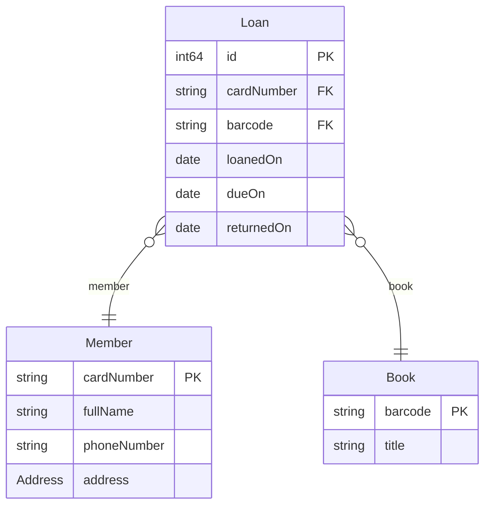
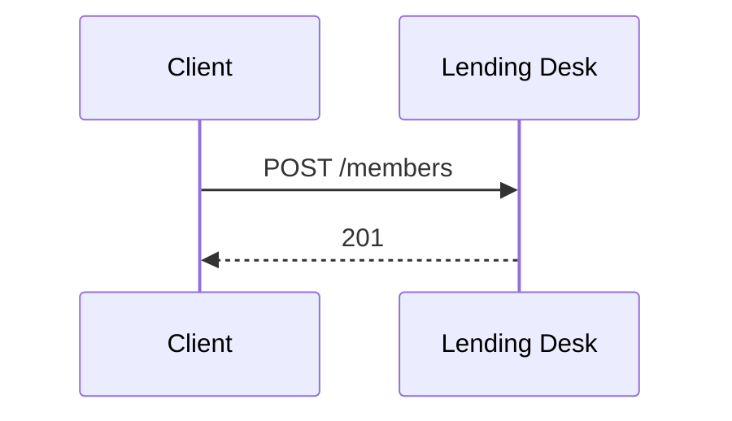
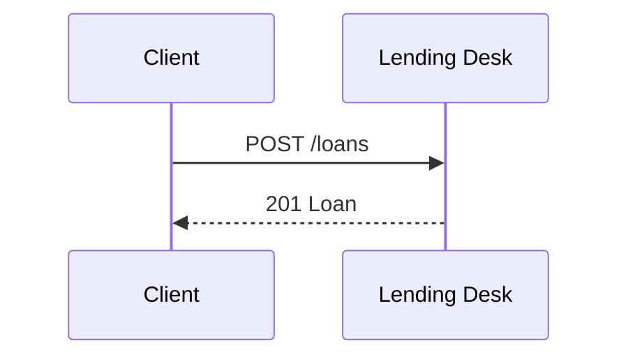
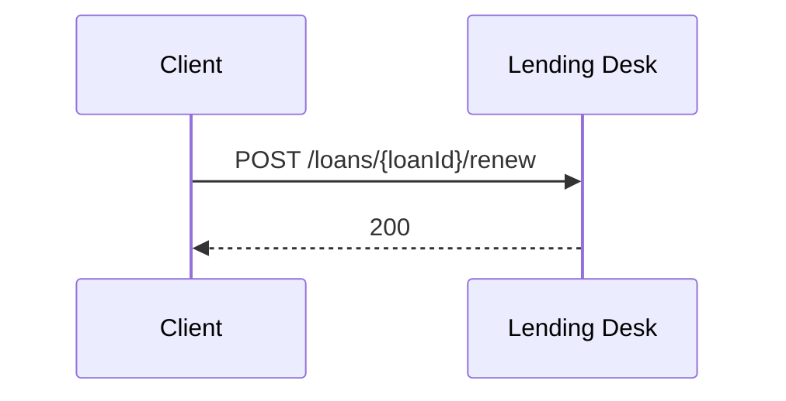
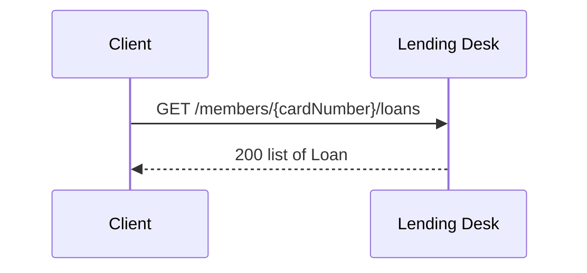

<!-- Generated by specarch document techspec from ../spec/specarch.yaml, version 0.1.0, and ../spec/implementation/go/lending-desk.go.specarch-implementation.yaml, version 0.1.0; meta-model 0.1. Do not edit this file: change the YAML and generate again. -->

# Lending Desk: technical specification

Version 0.1.0 of the specification: 7 requirements, 3 entities, 1 schema and 5 HTTP operations. The chapters follow arc42, and a chapter with nothing in the specification is left out.

**Draft:** 7 open questions concern this document (Q-5, Q-1, Q-2, Q-3, Q-4, Q-6, Q-7); see the open questions document, or run specarch gaps.

**Problems:** 24 warnings concern this document; each is marked by a Problem paragraph at its element, or below when the document shows no element for it. The problems file lists every problem, and specarch validate prints them.

## 1. Introduction and goals

The as-built specification of a small lending desk, written from its
desk manual and its code by the procedure in docs/from-sources.md. Every
element says how it is known and cites the manual section or the code
file and line it came from. Where the two disagree, or a source is
silent, the specification asks instead of choosing. It is an example,
not a real library's system.

### Stakeholders

| Stakeholder | Who they are | Concerns |
|---|---|---|
| desk-staff | Staff at the lending desk, who register members, lend books and take them back. |   |
| member | A card holder who borrows books. |   |
| catalogue-team | The team that keeps the book records, which the desk only reads. |   |
| desk-manager | The person in charge of the desk, who settles what the manual and the service should say. |   |

**Origin on desk-staff:** stated in Lending desk manual, clause 2.2.

**Note on desk-staff:** From Lending desk manual, 2025, clause 2.2: Desk staff register new members and hand out the card. <../sources/manual.md>

**Origin on member:** stated in Lending desk manual, clause 2.1.

**Note on member:** From Lending desk manual, 2025, clause 2.1: Anyone with a library card may borrow. <../sources/manual.md>

**Origin on catalogue-team:** stated in Lending desk manual, clause 3.4.

**Note on catalogue-team:** From Lending desk manual, 2025, clause 3.4: The catalogue team keeps the book records: it adds each copy with its barcode and title, and changes them. <../sources/manual.md>

**Origin on desk-manager:** inferred.

**Insight on desk-manager:** Neither source names who decides; someone must settle where the manual and the code disagree, and the desk's own head is the nearest role to it.

## 3. Context

The interfaces the system offers, as its clients see them.

Every property goes on the wire in snake_case (info.wireNames): a field this specification names dueOn is due_on in a body, a parameter's schema and a message. A parameter's own name is written as it is on the wire.

### HTTP operations

| Method and path | Operation | Summary | Permission |
|---|---|---|---|
| POST /members | registerMember | Register a member | members.write |
| POST /loans | lendBook | Lend a book | loans.write |
| POST /loans/{loanId}/return | returnBook | Check a book in | loans.write |
| POST /loans/{loanId}/renew | renewLoan | Renew a loan | loans.write |
| GET /members/{cardNumber}/loans | listMemberLoans | The loans of one member | loans.read |

## 5. Building blocks

### Member

A card holder.

**Origin:** stated in Lending desk manual, clause 2.1; Lending desk manual, clause 2; The lending desk service, clause lending/model.go:14; The lending desk service, clause migrations/001_init.sql:1; The lending desk service, clause lending/model.go:17.

**Note:** From Lending desk manual, 2025, clause 2.1: A member is known by the card number printed on the card, and the desk records the member's full name. <../sources/manual.md>

**Note:** From Lending desk manual, 2025, clause 2: The desk keeps a member's card number (internal), full name (personal) and phone number (personal). <../sources/manual.md>

**Note:** From The lending desk service, 925255a195f90e385f7bf9bbea8d4e8f7aa5031d, clause lending/model.go:14: Member has CardNumber, 10 digits, and FullName. <../sources/code>

**Note:** From The lending desk service, 925255a195f90e385f7bf9bbea8d4e8f7aa5031d, clause migrations/001_init.sql:1: card_number CHAR(10) is the key; full_name VARCHAR(200) NOT NULL. <../sources/code>

**Note:** From The lending desk service, 925255a195f90e385f7bf9bbea8d4e8f7aa5031d, clause lending/model.go:17: Member has an Address, nil when the member gave none. <../sources/code>

| Field | Type | Required | Limits | Description |
|---|---|---|---|---|
| cardNumber | string | yes | at most 10 characters, matches `^[0-9]{10}$` | The number printed on the card. |
| fullName | string | yes | at least 1 character, at most 200 characters |   |
| phoneNumber | string |   |   | In the manual and not in the database; Q-6 asks whether to build it. |
| address | Address |   |   | Where the member lives; a member may give none. |

Primary key: cardNumber.

### Book

One copy on the shelves.

**Origin:** stated in Lending desk manual, clause 3.1; The lending desk service, clause migrations/001_init.sql:6.

**Note:** From Lending desk manual, 2025, clause 3.1: Desk staff scan the book's barcode. <../sources/manual.md>

**Note:** From The lending desk service, 925255a195f90e385f7bf9bbea8d4e8f7aa5031d, clause migrations/001_init.sql:6: barcode VARCHAR(20) is the key; title VARCHAR(300) NOT NULL. <../sources/code>

| Field | Type | Required | Limits | Description |
|---|---|---|---|---|
| barcode | string | yes | at least 1 character, at most 20 characters |   |
| title | string | yes | at least 1 character, at most 300 characters |   |

Primary key: barcode.

### Loan

One book lent to one member.

**Origin:** stated in Lending desk manual, clause 3.3; The lending desk service, clause lending/model.go:35; The lending desk service, clause migrations/001_init.sql:11.

**Note:** From Lending desk manual, 2025, clause 3.3: The due date is printed on the slip. <../sources/manual.md>

**Note:** From The lending desk service, 925255a195f90e385f7bf9bbea8d4e8f7aa5031d, clause lending/model.go:35: Loan has ID, CardNumber, Barcode, LoanedOn, DueOn and ReturnedOn, which is empty until the book is back. <../sources/code>

**Note:** From The lending desk service, 925255a195f90e385f7bf9bbea8d4e8f7aa5031d, clause migrations/001_init.sql:11: loans references members and books; returned_on may be null. <../sources/code>

| Field | Type | Required | Limits | Description |
|---|---|---|---|---|
| id | int64 | yes | at least 1, at most 9007199254740991, set by the system | A BIGSERIAL key, bounded so that a JSON reader keeps every digit. |
| cardNumber | string | yes | at most 10 characters, matches `^[0-9]{10}$` |   |
| barcode | string | yes | at least 1 character, at most 20 characters |   |
| loanedOn | date | yes | set by the system |   |
| dueOn | date | yes | set by the system |   |
| returnedOn | date or null |   | set by the system |   |

Primary key: id.

| Relation | Kind | Target | Via | On delete |
|---|---|---|---|---|
| member | many-to-one | Member | cardNumber | restrict |
| book | many-to-one | Book | barcode | restrict |

### Schemas

A schema is data passed around but not stored: it has no key and no table, and a request body, a response, a message or another schema carries it.

#### Address

Where a member lives. One that is given has its street and city.

**Origin:** stated in The lending desk service, clause lending/model.go:22; The lending desk service, clause migrations/003_member_address.sql:1.

**Note:** From The lending desk service, 925255a195f90e385f7bf9bbea8d4e8f7aa5031d, clause lending/model.go:22: Address has Street, City and Postcode; one that is given has its street and city, and the postcode may be left out. <../sources/code>

**Note:** From The lending desk service, 925255a195f90e385f7bf9bbea8d4e8f7aa5031d, clause migrations/003_member_address.sql:1: members gets address_street VARCHAR(200), address_city VARCHAR(100) and address_postcode VARCHAR(20), with a check that an address is wholly absent or has its street and city. <../sources/code>

| Field | Type | Required | Limits | Description |
|---|---|---|---|---|
| street | string | yes | at least 1 character, at most 200 characters |   |
| city | string | yes | at least 1 character, at most 100 characters |   |
| postcode | string |   | at most 20 characters |   |

## 6. Runtime view

### registerMember (POST /members)

**Origin:** stated in Lending desk manual, clause 2.2; The lending desk service, clause lending/routes.go:47.

**Problem:** warning: test_case_missing: operation registerMember has no red scenario for "cardNumber not matching its pattern"; add under tests register-member-card-number-not-matching-its-pattern: { operation: registerMember, scenario: red, covers: [cardNumber not matching its pattern], given: "...", when: "registerMember is called with cardNumber in the wrong form", then: "it is refused" } [test_case_missing.8225af9c@design/design.yaml#/paths/~1members/post]

**Problem:** warning: test_case_missing: operation registerMember has no red scenario for "denied without members.write"; add under tests register-member-denied-without-members-write: { operation: registerMember, scenario: red, covers: [denied without members.write], given: "a caller without members.write", when: "registerMember is called", then: "it is refused as not allowed" } [test_case_missing.585bd96d@design/design.yaml#/paths/~1members/post]

**Problem:** warning: test_case_missing: operation registerMember has no red scenario for "missing address.city"; add under tests register-member-missing-address-city: { operation: registerMember, scenario: red, covers: [missing address.city], given: "...", when: "registerMember is called with address without its city", then: "it is refused" } [test_case_missing.d50a0522@design/design.yaml#/paths/~1members/post]

**Problem:** warning: test_case_missing: operation registerMember has no red scenario for "missing address.street"; add under tests register-member-missing-address-street: { operation: registerMember, scenario: red, covers: [missing address.street], given: "...", when: "registerMember is called with address without its street", then: "it is refused" } [test_case_missing.c3528a16@design/design.yaml#/paths/~1members/post]

**Problem:** warning: test_case_missing: operation registerMember has no red scenario for "missing cardNumber"; add under tests register-member-missing-card-number: { operation: registerMember, scenario: red, covers: [missing cardNumber], given: "...", when: "registerMember is called without cardNumber", then: "it is refused" } [test_case_missing.f0ddd858@design/design.yaml#/paths/~1members/post]

**Problem:** warning: test_case_missing: operation registerMember has no red scenario for "missing fullName"; add under tests register-member-missing-full-name: { operation: registerMember, scenario: red, covers: [missing fullName], given: "...", when: "registerMember is called without fullName", then: "it is refused" } [test_case_missing.d8c1b4d0@design/design.yaml#/paths/~1members/post]

**Problem:** warning: test_golden_missing: operation registerMember has no golden scenario; add one under tests, for example register-member-succeeds: { operation: registerMember, scenario: golden, given: "a caller with members.write", when: "registerMember is called with values inside every limit", then: "it answers 201: The member is registered." } [test_golden_missing@design/design.yaml#/paths/~1members/post]

**Note:** From Lending desk manual, 2025, clause 2.2: Desk staff register new members. <../sources/manual.md>

**Note:** From The lending desk service, 925255a195f90e385f7bf9bbea8d4e8f7aa5031d, clause lending/routes.go:47: RegisterMember answers 201. <../sources/code>

### lendBook (POST /loans)

**Origin:** stated in Lending desk manual, clause 3.1; The lending desk service, clause lending/routes.go:59.

**Problem:** warning: test_case_missing: operation lendBook has no red scenario for "cardNumber not matching its pattern"; add under tests lend-book-card-number-not-matching-its-pattern: { operation: lendBook, scenario: red, covers: [cardNumber not matching its pattern], given: "...", when: "lendBook is called with cardNumber in the wrong form", then: "it is refused" } [test_case_missing.6ccbe6b8@design/design.yaml#/paths/~1loans/post]

**Problem:** warning: test_case_missing: operation lendBook has no red scenario for "denied without loans.write"; add under tests lend-book-denied-without-loans-write: { operation: lendBook, scenario: red, covers: [denied without loans.write], given: "a caller without loans.write", when: "lendBook is called", then: "it is refused as not allowed" } [test_case_missing.2bfe73d3@design/design.yaml#/paths/~1loans/post]

**Problem:** warning: test_case_missing: operation lendBook has no red scenario for "missing barcode"; add under tests lend-book-missing-barcode: { operation: lendBook, scenario: red, covers: [missing barcode], given: "...", when: "lendBook is called without barcode", then: "it is refused" } [test_case_missing.68aaa23d@design/design.yaml#/paths/~1loans/post]

**Problem:** warning: test_case_missing: operation lendBook has no red scenario for "missing cardNumber"; add under tests lend-book-missing-card-number: { operation: lendBook, scenario: red, covers: [missing cardNumber], given: "...", when: "lendBook is called without cardNumber", then: "it is refused" } [test_case_missing.e24ae930@design/design.yaml#/paths/~1loans/post]

**Problem:** warning: test_case_missing: operation lendBook has no red scenario for "not found barcode"; add under tests lend-book-not-found-barcode: { operation: lendBook, scenario: red, covers: [not found barcode], given: "no Book has that barcode", when: "lendBook is called with that barcode", then: "it is refused as not found" } [test_case_missing.fb83227a@design/design.yaml#/paths/~1loans/post]

**Problem:** warning: test_case_missing: operation lendBook has no red scenario for "not found cardNumber"; add under tests lend-book-not-found-card-number: { operation: lendBook, scenario: red, covers: [not found cardNumber], given: "no Member has that cardNumber", when: "lendBook is called with that cardNumber", then: "it is refused as not found" } [test_case_missing.2e91489b@design/design.yaml#/paths/~1loans/post]

**Problem:** warning: test_golden_missing: operation lendBook has no golden scenario; add one under tests, for example lend-book-succeeds: { operation: lendBook, scenario: golden, given: "a caller with loans.write", when: "lendBook is called with values inside every limit", then: "it answers 201: The loan." } [test_golden_missing@design/design.yaml#/paths/~1loans/post]

**Note:** From Lending desk manual, 2025, clause 3.1: Desk staff lend a book by scanning the member's card and the book's barcode. <../sources/manual.md>

**Note:** From The lending desk service, 925255a195f90e385f7bf9bbea8d4e8f7aa5031d, clause lending/routes.go:59: LendBook answers 409 when the member has MaxOpenLoans books out, and 201 otherwise. <../sources/code>

### returnBook (POST /loans/{loanId}/return)

**Origin:** stated in Lending desk manual, clause 5.1; The lending desk service, clause lending/routes.go:73.

**Problem:** warning: test_case_missing: operation returnBook has no red scenario for "denied without loans.write"; add under tests return-book-denied-without-loans-write: { operation: returnBook, scenario: red, covers: [denied without loans.write], given: "a caller without loans.write", when: "returnBook is called", then: "it is refused as not allowed" } [test_case_missing.69b798fb@design/design.yaml#/paths/~1loans~1{loanId}~1return/post]

**Problem:** warning: test_case_missing: operation returnBook has no red scenario for "not found loanId"; add under tests return-book-not-found-loan-id: { operation: returnBook, scenario: red, covers: [not found loanId], given: "no record has that loanId", when: "returnBook is called with that loanId", then: "it is refused as not found" } [test_case_missing.e34b1cce@design/design.yaml#/paths/~1loans~1{loanId}~1return/post]

**Problem:** warning: test_golden_missing: operation returnBook has no golden scenario; add one under tests, for example return-book-succeeds: { operation: returnBook, scenario: golden, given: "a caller with loans.write", when: "returnBook is called with values inside every limit", then: "it answers 200: The loan is closed." } [test_golden_missing@design/design.yaml#/paths/~1loans~1{loanId}~1return/post]

**Note:** From Lending desk manual, 2025, clause 5.1: Checking a book in closes the loan. <../sources/manual.md>

**Note:** From The lending desk service, 925255a195f90e385f7bf9bbea8d4e8f7aa5031d, clause lending/routes.go:73: ReturnBook closes the loan and answers 200. <../sources/code>

### renewLoan (POST /loans/{loanId}/renew)

**Origin:** stated in Lending desk manual, clause 4.1.

**Problem:** warning: test_case_missing: operation renewLoan has no red scenario for "denied without loans.write"; add under tests renew-loan-denied-without-loans-write: { operation: renewLoan, scenario: red, covers: [denied without loans.write], given: "a caller without loans.write", when: "renewLoan is called", then: "it is refused as not allowed" } [test_case_missing.b47830b9@design/design.yaml#/paths/~1loans~1{loanId}~1renew/post]

**Problem:** warning: test_case_missing: operation renewLoan has no red scenario for "not found loanId"; add under tests renew-loan-not-found-loan-id: { operation: renewLoan, scenario: red, covers: [not found loanId], given: "no record has that loanId", when: "renewLoan is called with that loanId", then: "it is refused as not found" } [test_case_missing.b53498e4@design/design.yaml#/paths/~1loans~1{loanId}~1renew/post]

**Problem:** warning: test_golden_missing: operation renewLoan has no golden scenario; add one under tests, for example renew-loan-succeeds: { operation: renewLoan, scenario: golden, given: "a caller with loans.write", when: "renewLoan is called with values inside every limit", then: "it answers 200: The loan, with its new due date." } [test_golden_missing@design/design.yaml#/paths/~1loans~1{loanId}~1renew/post]

**Insight:** The manual has the member ask at the desk, so desk staff renew, under the permission the other loan changes use. The service does not serve it yet; Q-4 asks whether to build it.

**Note:** From Lending desk manual, 2025, clause 4.1: A member may renew a loan once, for one more loan period, by asking at the desk before the due date. <../sources/manual.md>

### listMemberLoans (GET /members/{cardNumber}/loans)

**Origin:** inferred.

**Problem:** warning: test_case_missing: operation listMemberLoans has no red scenario for "cardNumber not matching its pattern"; add under tests list-member-loans-card-number-not-matching-its-pattern: { operation: listMemberLoans, scenario: red, covers: [cardNumber not matching its pattern], given: "...", when: "listMemberLoans is called with cardNumber in the wrong form", then: "it is refused" } [test_case_missing.856e2e15@design/design.yaml#/paths/~1members~1{cardNumber}~1loans/get]

**Problem:** warning: test_case_missing: operation listMemberLoans has no red scenario for "denied without loans.read"; add under tests list-member-loans-denied-without-loans-read: { operation: listMemberLoans, scenario: red, covers: [denied without loans.read], given: "a caller without loans.read", when: "listMemberLoans is called", then: "it is refused as not allowed" } [test_case_missing.adf94778@design/design.yaml#/paths/~1members~1{cardNumber}~1loans/get]

**Problem:** warning: test_case_missing: operation listMemberLoans has no red scenario for "not found cardNumber"; add under tests list-member-loans-not-found-card-number: { operation: listMemberLoans, scenario: red, covers: [not found cardNumber], given: "no record has that cardNumber", when: "listMemberLoans is called with that cardNumber", then: "it is refused as not found" } [test_case_missing.2ae43bc7@design/design.yaml#/paths/~1members~1{cardNumber}~1loans/get]

**Problem:** warning: test_golden_missing: operation listMemberLoans has no golden scenario; add one under tests, for example list-member-loans-succeeds: { operation: listMemberLoans, scenario: golden, given: "a caller with loans.read", when: "listMemberLoans is called with values inside every limit", then: "it answers 200: The member's loans." } [test_golden_missing@design/design.yaml#/paths/~1members~1{cardNumber}~1loans/get]

**Insight:** Undocumented, from code; Q-2 asks whether it is wanted.

**Note:** From The lending desk service, 925255a195f90e385f7bf9bbea8d4e8f7aa5031d, clause lending/routes.go:91: ListMemberLoans answers 200 with the member's loans. <../sources/code>

## 7. Deployment and implementation

### Implementation: Lending Desk in Go, as built

From the implementation file version 0.1.0.

How the service beside this specification builds it, read from its code.
Every mapping cites the file and line it was read from.

Stack: language Go 1.26.

#### Mappings

| Design object | Implemented by | Notes |
|---|---|---|
| #/entities/Member | table members, type lending.Member |   |
| #/entities/Book | table books, type lending.Book | Owned by catalogue-team, not generated. |
| #/entities/Loan | table loans, type lending.Loan |   |
| #/roles/desk-staff | table role_permissions, filled by seeds/001_roles.sql |   |
| #/paths/~1members/post | lending.Server.RegisterMember |   |
| #/paths/~1loans/post | lending.Server.LendBook |   |
| #/paths/~1loans~1{loanId}~1return/post | lending.Server.ReturnBook |   |
| #/paths/~1members~1{cardNumber}~1loans/get | lending.Server.ListMemberLoans |   |

#### Bindings

http: standard library.

**Origin on http:** stated in The lending desk service, clause lending/access.go:37.

**Note on http:** From The lending desk service, 925255a195f90e385f7bf9bbea8d4e8f7aa5031d, clause lending/access.go:37: Require, the service's permission check. <../sources/code>

#### Targets

| Target | Output folder | Settings |
|---|---|---|
| sql | ../../../generated/sql | dialect postgresql |
| openapi | ../../../generated/openapi |   |
| techspec | ../../../docs |   |
| requirements | ../../../docs |   |
| traceability | ../../../docs |   |
| questions | ../../../docs |   |
| problems | ../../../docs |   |

#### Idioms

How this implementation does each recurring concern: the idioms SpecArch ships apply unless the file excludes or overrides one, and an override replaces only the parts it names (docs/idioms.md).

| Idiom | Version | Applies as | Parts the project replaces |
|---|---|---|---|
| authorization-check | 1.0.0 | shipped |   |
| health-endpoint | 1.0.0 | shipped |   |
| identifiers | 1.1.0 | shipped |   |
| migrations | 1.0.0 | shipped |   |
| pii-in-logs | 1.0.0 | shipped |   |
| request-validation | 1.1.0 | shipped |   |
| transactions | 1.0.0 | shipped |   |
| type-rendering | 1.2.0 | shipped |   |

## 8. Cross-cutting concepts

### Sensitive data

The entity fields that are not public, and the ones encrypted at rest. A personal field is masked in logs and shown only to who may see it; a credential is never answered (the pii-in-logs and encrypted-column idioms).

| Field | Sensitivity | At rest |
|---|---|---|
| Member.cardNumber | internal |  |
| Member.fullName | personal |  |
| Member.phoneNumber | personal |  |

### Permissions

Access is fail-closed: every operation, command and page names the one permission it needs, and only the roles below grant one.

| Permission | desk-staff |
|---|---|
| members.write | yes |
| loans.write | yes |
| loans.read | yes |

**Origin on members.write:** stated in The lending desk service, clause lending/routes.go:37.

**Note on members.write:** From The lending desk service, 925255a195f90e385f7bf9bbea8d4e8f7aa5031d, clause lending/routes.go:37: POST /members checks members.write. <../sources/code>

**Origin on loans.write:** stated in The lending desk service, clause lending/routes.go:38.

**Note on loans.write:** From The lending desk service, 925255a195f90e385f7bf9bbea8d4e8f7aa5031d, clause lending/routes.go:38: POST /loans and POST /loans/{loanId}/return check loans.write. <../sources/code>

**Origin on loans.read:** inferred.

**Insight on loans.read:** Undocumented, from code; it stands or falls with LEND-7 and Q-2.

**Note on loans.read:** From The lending desk service, 925255a195f90e385f7bf9bbea8d4e8f7aa5031d, clause lending/routes.go:42: GET /members/{cardNumber}/loans checks loans.read. <../sources/code>

**Origin on desk-staff:** stated in Lending desk manual, clause 2.2; The lending desk service, clause seeds/001_roles.sql:3.

**Note on desk-staff:** From Lending desk manual, 2025, clause 2.2: Desk staff register new members. <../sources/manual.md>

**Note on desk-staff:** From The lending desk service, 925255a195f90e385f7bf9bbea8d4e8f7aa5031d, clause seeds/001_roles.sql:3: desk-staff grants members.write, loans.write and loans.read. <../sources/code>

## 13. Requirements

### Requirements

| Requirement | Statement | Kind | Priority | Status | Verification | Acceptance | Needs |
|---|---|---|---|---|---|---|---|
| LEND-1 | Desk staff shall register a member by card number and full name. | functional | must | accepted |   |   |   |
| LEND-2 | Desk staff shall lend a book to a member by the member's card number and the book's barcode. | functional | must | accepted |   |   |   |
| LEND-3 | A member shall have at most five books on loan at a time. | functional | must | accepted |   |   |   |
| LEND-4 |   | functional | must | accepted |   |   |   |
| LEND-5 | Desk staff shall renew a loan once, before its due date, for one more loan period. | functional | should | accepted |   |   |   |
| LEND-6 | Desk staff shall check a returned book in by its barcode, which closes the loan. | functional | must | accepted |   |   |   |
| LEND-7 | Desk staff shall list the loans of one member. | functional | should | accepted |   |   |   |

**Origin on LEND-1:** stated in Lending desk manual, clause 2.1; Lending desk manual, clause 2.2; The lending desk service, clause lending/routes.go:37.

**Open question Q-3 (must, decision) on LEND-1:** How is each requirement shown to be met? Decided by desk-manager.

**Note on LEND-1:** From Lending desk manual, 2025, clause 2.1: A member is known by the card number printed on the card, and the desk records the member's full name. <../sources/manual.md>

**Note on LEND-1:** From Lending desk manual, 2025, clause 2.2: Desk staff register new members. <../sources/manual.md>

**Note on LEND-1:** From The lending desk service, 925255a195f90e385f7bf9bbea8d4e8f7aa5031d, clause lending/routes.go:37: POST /members, checked against members.write. <../sources/code>

**Origin on LEND-2:** stated in Lending desk manual, clause 3.1; The lending desk service, clause lending/routes.go:38.

**Open question Q-3 (must, decision) on LEND-2:** How is each requirement shown to be met? Decided by desk-manager.

**Note on LEND-2:** From Lending desk manual, 2025, clause 3.1: Desk staff lend a book by scanning the member's card and the book's barcode. <../sources/manual.md>

**Note on LEND-2:** From The lending desk service, 925255a195f90e385f7bf9bbea8d4e8f7aa5031d, clause lending/routes.go:38: POST /loans, checked against loans.write. <../sources/code>

**Origin on LEND-3:** stated in Lending desk manual, clause 3.2; The lending desk service, clause lending/model.go:11.

**Open question Q-3 (must, decision) on LEND-3:** How is each requirement shown to be met? Decided by desk-manager.

**Note on LEND-3:** From Lending desk manual, 2025, clause 3.2: A member may have at most five books on loan at a time. <../sources/manual.md>

**Note on LEND-3:** From The lending desk service, 925255a195f90e385f7bf9bbea8d4e8f7aa5031d, clause lending/model.go:11: MaxOpenLoans is 5; LendBook answers 409 at the limit. <../sources/code>

**Origin on LEND-4:** stated in Lending desk manual, clause 3.3; The lending desk service, clause lending/model.go:8; The lending desk service, clause migrations/001_init.sql:18.

**Open question Q-1 (must, decision) on LEND-4:** Is the loan period 21 days, as the manual says, or 14 days, as the service does? Decided by desk-manager.

**Open question Q-3 (must, decision) on LEND-4:** How is each requirement shown to be met? Decided by desk-manager.

**Insight on LEND-4:** Both sources set a loan period, and they set different ones, so the statement waits for Q-1.

**Note on LEND-4:** From Lending desk manual, 2025, clause 3.3: The loan period is 21 days. <../sources/manual.md>

**Note on LEND-4:** From The lending desk service, 925255a195f90e385f7bf9bbea8d4e8f7aa5031d, clause lending/model.go:8: LoanPeriod is 14 days. <../sources/code>

**Note on LEND-4:** From The lending desk service, 925255a195f90e385f7bf9bbea8d4e8f7aa5031d, clause migrations/001_init.sql:18: The loans table checks that due_on is loaned_on plus 14. <../sources/code>

**Origin on LEND-5:** stated in Lending desk manual, clause 4.1.

**Open question Q-3 (must, decision) on LEND-5:** How is each requirement shown to be met? Decided by desk-manager.

**Note on LEND-5:** From Lending desk manual, 2025, clause 4.1: A member may renew a loan once, for one more loan period, by asking at the desk before the due date. <../sources/manual.md>

**Origin on LEND-6:** stated in Lending desk manual, clause 5.1; The lending desk service, clause lending/routes.go:39.

**Open question Q-3 (must, decision) on LEND-6:** How is each requirement shown to be met? Decided by desk-manager.

**Note on LEND-6:** From Lending desk manual, 2025, clause 5.1: Desk staff check a returned book in by scanning its barcode, which closes the loan. <../sources/manual.md>

**Note on LEND-6:** From The lending desk service, 925255a195f90e385f7bf9bbea8d4e8f7aa5031d, clause lending/routes.go:39: POST /loans/{loanId}/return, checked against loans.write. <../sources/code>

**Origin on LEND-7:** inferred.

**Open question Q-2 (should, decision) on LEND-7:** The service lists a member's loans, which the manual never mentions. Is that wanted, and who may use it? Decided by desk-manager.

**Open question Q-3 (must, decision) on LEND-7:** How is each requirement shown to be met? Decided by desk-manager.

**Insight on LEND-7:** Undocumented, from code. The service serves GET /members/{cardNumber}/loans; the manual never mentions it. Q-2 asks the desk manager to confirm it.

**Note on LEND-7:** From The lending desk service, 925255a195f90e385f7bf9bbea8d4e8f7aa5031d, clause lending/routes.go:42: GET /members/{cardNumber}/loans, checked against loans.read. <../sources/code>

### Traceability

What satisfies and what verifies each requirement. An empty cell is a gap.

| Requirement | Satisfied by | Verified by |
|---|---|---|
| LEND-1 | entities Member; permissions members.write; paths /members post |   |
| LEND-2 | entities Book; entities Loan; permissions loans.write; paths /loans post |   |
| LEND-3 | paths /loans post |   |
| LEND-4 | entities Loan |   |
| LEND-5 | permissions loans.write; paths /loans/{loanId}/renew post |   |
| LEND-6 | entities Loan; permissions loans.write; paths /loans/{loanId}/return post |   |
| LEND-7 | permissions loans.read; paths /members/{cardNumber}/loans get |   |

## Sources

Every source a Note in this document cites.

| Source | Title | Edition | Author | Where to read it |
|---|---|---|---|---|
| desk-code | The lending desk service | 925255a195f90e385f7bf9bbea8d4e8f7aa5031d | The desk team | ../sources/code |
| desk-manual | Lending desk manual | 2025 | The desk team | ../sources/manual.md |

