<!-- Generated by specarch document techspec from ../spec/specarch.yaml, version 0.1.0, and ../spec/implementation/go/library-lending.go.specarch-implementation.yaml, version 0.1.0; meta-model 0.1. Do not edit this file: change the YAML and generate again. -->

# Library Lending: technical specification

Version 0.1.0 of the specification: 7 requirements, 3 entities, 9 HTTP operations, 2 channels, 1 dependency, 6 pages, 1 flow, 1 algorithm, 114 tests, 2 decisions, 3 environments and 5 commissioning checks. The chapters follow arc42, and a chapter with nothing in the specification is left out.

## 1. Introduction and goals

A small public library lends books to its members. Members borrow a copy,
keep it for a fixed loan period, and pay a late fee when they return it
after the due date. This example exists to exercise every concept of the
meta-model in one place, across every stage of the life cycle; it is not
a real library's system.

Owners: example-maintainers.

### Stakeholders

| Stakeholder | Who they are | Concerns |
|---|---|---|
| librarian | Staff at the desk who register members, lend copies and take returns. | Every desk task fits in one screen and takes under a minute; A fee is never wrong by a cent |
| member | A card holder who borrows books. | Only their own loans and fees are shown to them; They are told when a loan is overdue |
| library-board | The board that sets the lending policy and answers to the regulator. | The policy sheet and the system agree; Member data is kept as the rules allow and no longer |

## 2. Constraints

| Constraint | Kind | Statement |
|---|---|---|
| CON-1 | legal | Member data is kept only while the membership is open and for one year after, then deleted. |
| CON-2 | technical | Dates are the library's local calendar dates; timestamps are UTC. |

**Note on CON-1:** From The data-protection rules the library is bound by, 2024: Personal data is kept no longer than its purpose needs.

**Insight on CON-2:** A loan due on the 21st is overdue from the start of the 22nd, library time, whatever the server's clock.

### Assumptions

| Assumption | Statement |
|---|---|
| ASSUME-1 | One library, one branch, one currency. |
| ASSUME-2 | The daily rate changes rarely and is a library setting, not a per-book value. |

**Note on ASSUME-2:** From Lending policy of the library, 2026, clause 4: The board sets the daily rate once a year.

## 3. Context

The interfaces the system offers, as its clients see them.

### HTTP operations

| Method and path | Operation | Summary | Permission |
|---|---|---|---|
| GET /books | listBooks | Browse the catalogue | public |
| GET /members | listMembers | List members | members.read |
| POST /members | createMember | Register a new member | members.write |
| GET /members/{memberId} | getMember | One member with their loans | members.read |
| POST /members/{memberId}/loans | lendCopies | Lend several copies to a member at once | loans.create |
| GET /loans | listLoans | List loans | loans.read |
| POST /loans | createLoan | Lend a copy to a member | loans.create |
| POST /loans/{loanId}/return | returnLoan | Record the return of a copy | loans.return |
| POST /loans/{loanId}/lost | reportLost | Record a lost copy and charge its replacement cost | loans.return |

### Channels

| Channel | Message | Summary |
|---|---|---|
| loan.lifecycle | LoanCreated | A copy was lent. |
| loan.lifecycle | LoanReturned | A copy came back; the payload carries the fee charged. |
| loan.lifecycle | LoanLost | A copy was reported lost. |
| loan.overdue | LoanOverdue | A loan became overdue. |

### Dependencies

External systems the operations call. A call that fails, or that does not answer within its time limit, is given up, and the operation answers as its failure response says.

| Dependency | Time limit per call | Called by | Description |
|---|---|---|---|
| feeLedger | PT5S | returnLoan, reportLost | The finance system's ledger, where a late fee or a replacement charge is posted the moment it is charged. |

**Insight on feeLedger:** The desk waits for the answer, so a call that takes longer than a few seconds is given up and the return is refused rather than left half done.

## 5. Building blocks

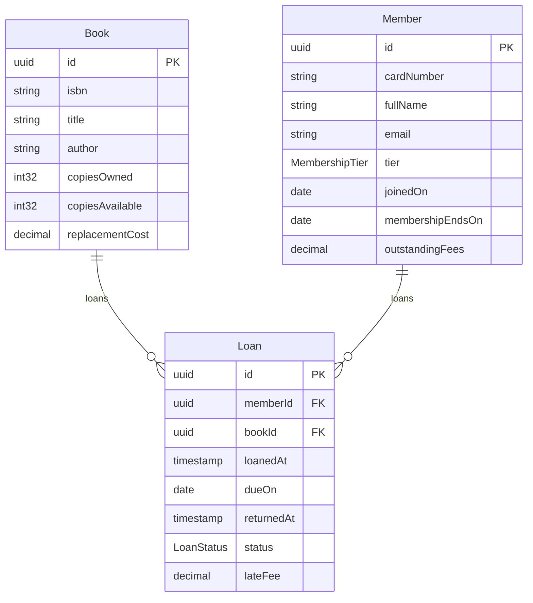

### Book

A title the library owns, with the number of physical copies.

| Field | Type | Required | Limits | Description |
|---|---|---|---|---|
| id | uuid | yes | set by the system |   |
| isbn | string | yes | at most 13 characters, matches `^[0-9]{13}$` |   |
| title | string | yes | at least 1 character, at most 500 characters |   |
| author | string | yes | at least 1 character, at most 200 characters |   |
| copiesOwned | int32 | yes | at least 0 |   |
| copiesAvailable | int32 | yes | at least 0, set by the system |   |
| replacementCost | decimal(10, 2) | yes |   |   |

Primary key: id.

| Relation | Kind | Target | Via | On delete |
|---|---|---|---|---|
| loans | one-to-many | Loan | bookId | restrict |

| Constraint | Rule | Message |
|---|---|---|
| book_isbn_unique | unique: isbn | This ISBN is already in the catalogue. |
| book_available_within_owned | check `copiesAvailable <= copiesOwned` | Available copies cannot exceed the copies owned. |

### Loan

One copy of one book lent to one member for a period.

| Field | Type | Required | Limits | Description |
|---|---|---|---|---|
| id | uuid | yes | set by the system |   |
| memberId | uuid | yes |   |   |
| bookId | uuid | yes |   |   |
| loanedAt | timestamp | yes | set by the system |   |
| dueOn | date | yes | set by the system |   |
| returnedAt | timestamp or null |   | set by the system |   |
| status | LoanStatus | yes |   |   |
| lateFee | decimal(10, 2) | yes | set by the system | Computed by the lateFee algorithm when the copy is returned; zero until then. |

Primary key: id.

| Relation | Kind | Target | Via | On delete |
|---|---|---|---|---|
| member | many-to-one | Member | memberId | restrict |
| book | many-to-one | Book | bookId | restrict |

| Constraint | Rule | Message |
|---|---|---|
| loan_due_after_loaned | check `dueOn > date(loanedAt)` | The due date must be after the loan date. |
| loan_returned_after_loaned | check `returnedAt == null \|\| returnedAt >= loanedAt` | A copy cannot be returned before it was lent. |

### Member

A person with a library card.

| Field | Type | Required | Limits | Description |
|---|---|---|---|---|
| id | uuid | yes | set by the system |   |
| cardNumber | string | yes | at most 8 characters, matches `^[0-9]{8}$` | Printed on the card; assigned when the member joins. |
| fullName | string | yes | at least 1 character, at most 200 characters |   |
| email | string | yes | at most 320 characters, a valid email | Encrypted at rest, and found by a salted hash of it, since it must stay unique. |
| tier | MembershipTier | yes |   |   |
| joinedOn | date | yes | set by the system |   |
| membershipEndsOn | date | yes | set by the system | The last day the card is valid; set a year after joining and moved on by each renewal. |
| outstandingFees | decimal(10, 2) | yes | set by the system | Sum of unpaid late fees and replacement charges, in the library's currency. |

Primary key: id.

Validity: a record is current from its joinedOn until its membershipEndsOn; outside that it is refused where it is used.

Audited: every record also carries createdAt, createdBy, lastModifiedAt and lastModifiedBy, set by the system and never by a caller (the audit-fields idiom).

Deletion is soft: a deleted record keeps a deleted flag set by the system, is not listed, and reads as not found (the soft-delete idiom).

| Relation | Kind | Target | Via | On delete |
|---|---|---|---|---|
| loans | one-to-many | Loan | memberId | restrict |

| Constraint | Rule | Message |
|---|---|---|
| member_card_number_unique | unique: cardNumber | A member with this card number already exists. |
| member_email_unique | unique: email | A member with this email address already exists. |

### Enums

| Enum | Value | Meaning |
|---|---|---|
| LoanStatus | open | the copy is with the member and the due date has not passed |
| LoanStatus | overdue | the due date has passed and the copy is still out |
| LoanStatus | returned | the copy is back on the shelf |
| LoanStatus | lost | the member reported the copy lost; the replacement cost was charged |
| MembershipTier | standard | up to 3 open loans, 21-day loan period |
| MembershipTier | extended | up to 6 open loans, 28-day loan period |

## 6. Runtime view

### States of Loan

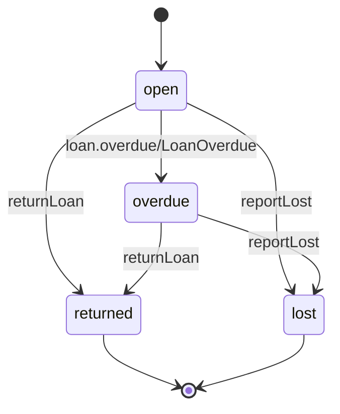

### Problem types

Every refusal is an RFC 9457 problem document of one of these types; each operation below names the ones it answers with.

| Problem type | Status | Title | When |
|---|---|---|---|
| email-taken | 409 | Email address already registered | A member with the same email address exists. |
| member-not-found | 404 | No such member | No member has the id in the path. |
| lending-refused | 409 | The copy cannot be lent | The member holds the most open loans their tier allows, has outstanding fees, or the book has no copy available. |
| loan-closed | 409 | The loan is already closed | The loan was returned or reported lost before. |
| fee-ledger-unavailable | 503 | The fee ledger is unavailable | The fee ledger failed or did not answer in time, and the loan stays as it was. |

### listBooks (GET /books)

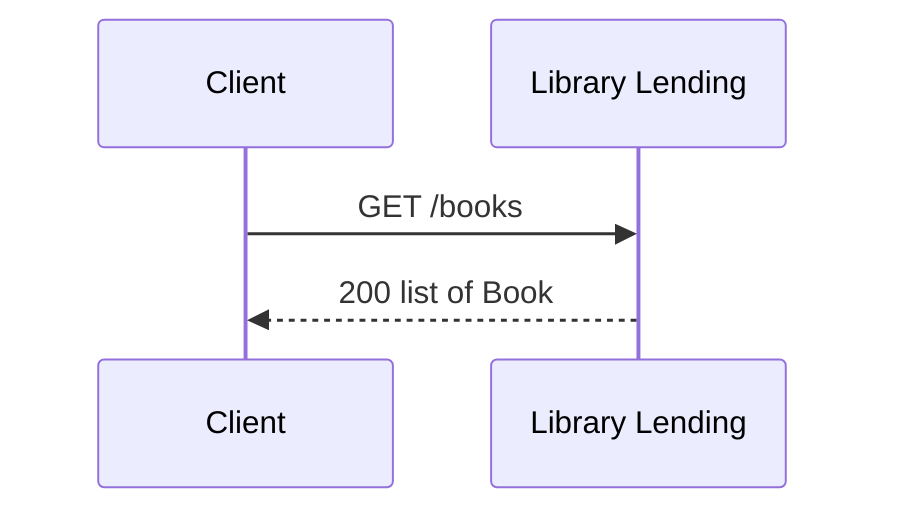

### listMembers (GET /members)

Lists Member a page at a time, 20 records by default, at most 100 a page. It may be sorted by fullName and joinedOn. A request outside these is refused, not ignored (the paginated-list idiom).

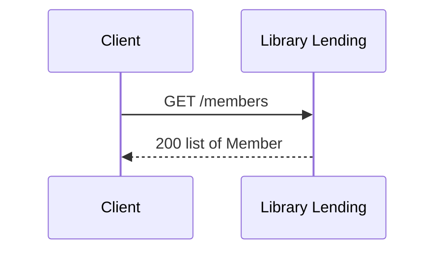

### createMember (POST /members)

Refuses with 409 email-taken.

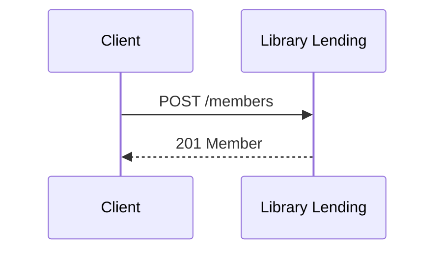

### getMember (GET /members/{memberId})

Refuses with 404 member-not-found.

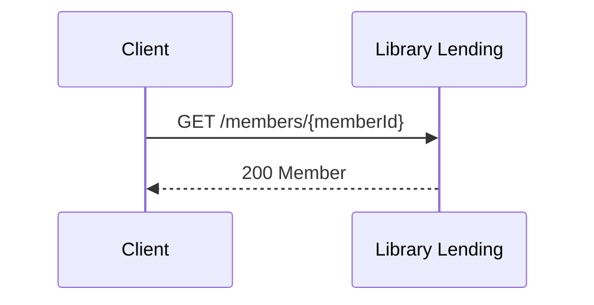

### lendCopies (POST /members/{memberId}/loans)

Lends every copy asked for, or none: refused when the loans would take
the member past the open loans their tier allows, the member has
outstanding fees, or a book has no copy available.

Refuses with 404 member-not-found and 409 lending-refused.

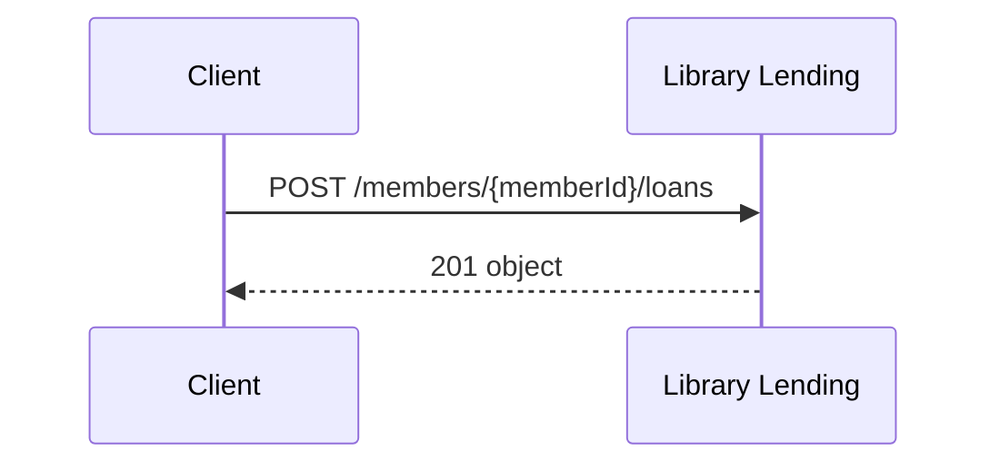

### listLoans (GET /loans)

Lists Loan a page at a time, 20 records by default, at most 100 a page. It may be sorted by dueOn and loanedAt. A request outside these is refused, not ignored (the paginated-list idiom).


### createLoan (POST /loans)

Refused when the member already holds the maximum open loans for their
tier, has outstanding fees, or the book has no copy available.

Refuses with 409 lending-refused.

Limits: a request body of at most 1024 bytes; 30 requests per PT1M, with bursts of up to 60.

Idempotent by the Idempotency-Key header: a request repeated with the same key is answered as the first was and has no second effect; a different request with a key already used is refused.

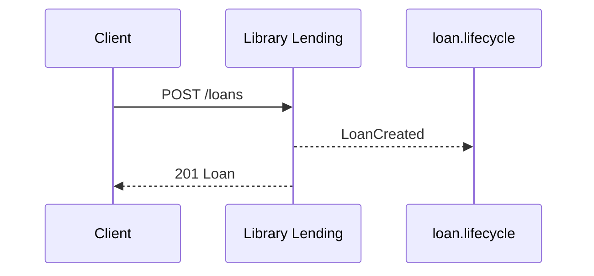

### returnLoan (POST /loans/{loanId}/return)

Calls feeLedger (within PT5S).

Refuses with 409 loan-closed and 503 fee-ledger-unavailable.

Guard: the change writes 1 Loan record, and `status == "open" || status == "overdue"` must hold on each as it is at the moment of the change; a change that finds otherwise is refused and changes nothing, so a second writer on the same record is refused rather than overwriting the first.

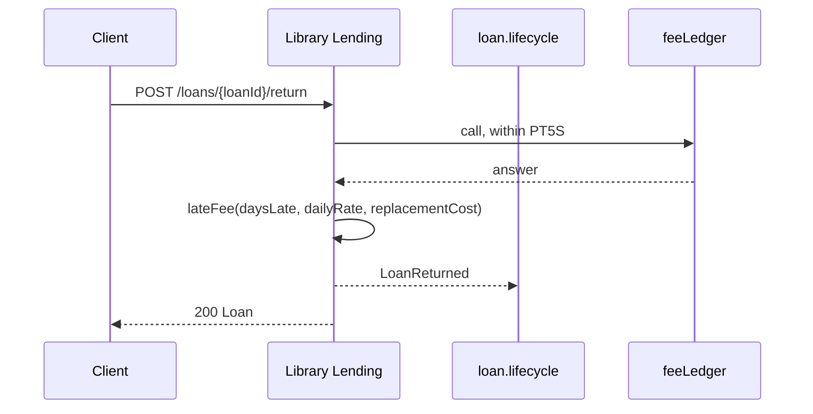

### reportLost (POST /loans/{loanId}/lost)

Calls feeLedger (within PT5S).

Refuses with 409 loan-closed and 503 fee-ledger-unavailable.

Guard: the change writes 1 Loan record, and `status == "open" || status == "overdue"` must hold on each as it is at the moment of the change; a change that finds otherwise is refused and changes nothing, so a second writer on the same record is refused rather than overwriting the first.

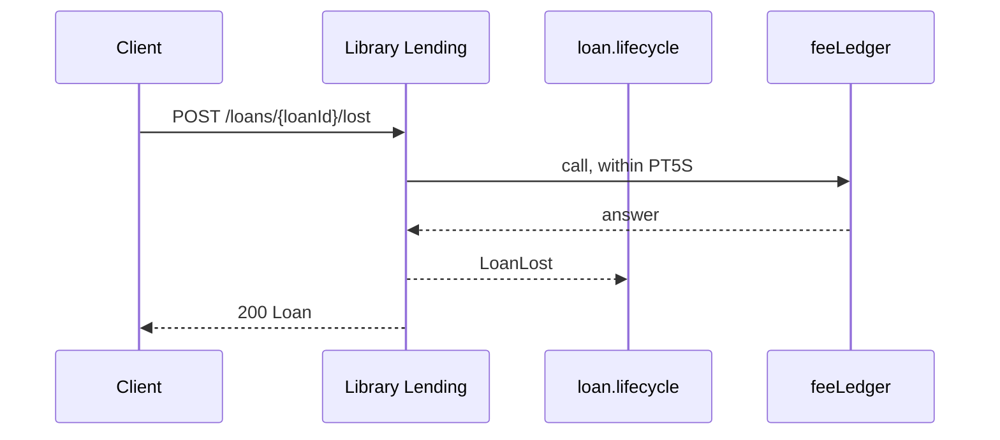

### Job markOverdue

Every night, finds the open loans past their due date, marks each overdue, and publishes LoanOverdue for it, so the member is told.

**Insight:** Overnight, when no one is at the desk, so a loan is overdue from the first morning after its due date.

Runs on the schedule `0 2 * * *` (UTC), as the role scheduler. Reads Loan. Writes Loan. Publishes loan.overdue/LoanOverdue. A failed item is tried 3 times, then set aside for a person. Running it twice over the same records changes nothing a second time.

## 7. Deployment and implementation

### Environments

| Environment | Purpose | Promotes to |
|---|---|---|
| development | A developer's machine, with a throwaway database. | staging |
| staging | A copy of production the librarians try a release on before it goes live. | production |
| production | The live system at the desk. |   |

### Configuration

| Setting | Type | Secret | Description |
|---|---|---|---|
| dailyRate | decimal(10, 2) |   | The late fee per day, set by the board; read by the lateFee algorithm. |
| databaseUrl | string | yes | Where the database is; it carries the password, so it comes from the host's secret store and is never written here. |
| notificationChannelUrl | string |   | Where the notification service listens for loan events. |

### Release

A release goes to staging first, where a librarian tries the desk tasks, then to production outside opening hours.

| Step | Action | Check |
|---|---|---|
| 1. Build and test | Build the service from the tagged commit and run every suite. | The build and every suite pass. |
| 2. Apply migrations on staging | Apply the new migrations to the staging database. | Every migration applied, and the schema gate against the entities passes. |
| 3. Install on staging | Install the build on staging and run the commissioning checks there. | Every check passed. |
| 4. Install on production | Outside opening hours, apply the migrations to production and install the build. | The smoke check passes on production before the desk opens. |

### Rollback

The previous build is kept installed beside the new one, so a rollback is a switch, and migrations are written to be reversible.

| Step | Action | Check |
|---|---|---|
| 1. Switch back | Point the service at the previous build and restart it. | The smoke check passes and the version shown is the previous one. |
| 2. Reverse the migrations | Run the rollback steps of every migration the release carried, newest first. | The schema gate against the previous entities passes. |

### Migration add-membership-tier

Every member gets a tier; existing members are standard.

| Step | Action | Check |
|---|---|---|
| 1. Add the column | Add the tier column to members, allowing null. | The column exists. |
| 2. Fill it | Set tier to standard for every member whose tier is null. | No member has a null tier; the count equals the member count. |
| 3. Make it required | Make the tier column not null. | The schema gate against Member passes. |

Reversed by:

| Step | Action | Check |
|---|---|---|
| 1. Drop the column | Drop the tier column from members. | The schema gate against the previous Member passes. |

### Commissioning checks

Run on the installed system before it is handed over. The results of each run are records kept outside the specification.

#### service-answers (smoke, in production)

The installed service starts and answers the catalogue.

| Step | Action | Check |
|---|---|---|
| 1. Open the catalogue | Call listBooks on the installed service without a card. | It answers 200 with the catalogue. |

#### lend-and-return (end-to-end, in staging)

A whole loan goes through on the real installation, with the real notification service.

| Step | Action | Check |
|---|---|---|
| 1. Register | A librarian registers a test member through member-form. | The member appears in members-list with a card number. |
| 2. Lend | The librarian lends a copy through loan-form. | The loan is open, due in 21 days, and the notification service received LoanCreated. |
| 3. Return late | Move the loan's due date back eight days in the staging database and record the return. | The late fee is 4.00 and the notification service received LoanReturned. |

#### member-sees-own-loans (security, in staging)

A member cannot see another member's loans.

| Step | Action | Check |
|---|---|---|
| 1. List as a member | Call listLoans with a member's card, in a database with two members' loans. | Only that member's loans are answered. |

#### catalogue-under-load (performance, in staging)

The catalogue answers fast enough at the desk's busiest hour.

| Step | Action | Check |
|---|---|---|
| 1. Load the catalogue | Call listBooks fifty times a second for five minutes. | Nine calls in ten answer within 200 milliseconds and none fails. |

#### migrated-members (data, in production)

Every member migrated from the card index is present and has a tier.

| Step | Action | Check |
|---|---|---|
| 1. Count | Compare the member count with the card index count. | The counts are equal and no member has a null tier. |

### Sign-off

The system is accepted when:

- Every check passed on staging and the smoke and data checks passed on production.
- A librarian has done each desk task once on production.
- The record of the run is filed under records/commissioning/.

Signed by: head-librarian, library-board.

### Monitors

What is watched on the live system, and the objective each must meet.

| Monitor | Environment | Measures | Objective | Verifies |
|---|---|---|---|---|
| catalogue-latency | production | How long listBooks takes to answer at the desk. | Nine calls in ten answer within 200 milliseconds over each opening day. | LIB-7 |
| overdue-notices-sent | production | Whether the nightly job published LoanOverdue for every loan that became overdue. | Every loan marked overdue in a night has its LoanOverdue message published the same night. | LIB-4 |

**Insight on catalogue-latency:** A slow catalogue is the first thing a librarian notices, and the commissioning check measured it only once.

### Implementation: Library Lending in Go and PostgreSQL

From the implementation file version 0.1.0.

How one stack would build the lending example. No code for it exists in
this repository; the file shows what belongs in an implementation file
and what stays in the specification.

Stack: language Go 1.26; toolchain go 1.26.0.

#### Libraries

| Library | Version | Licence | Purpose |
|---|---|---|---|
| github.com/oapi-codegen/oapi-codegen/v2 | v2.8.0 | Apache-2.0 | Turns the generated OpenAPI document into a strict server interface and request and response types. (tool) |
| github.com/oapi-codegen/runtime | v1.7.0 | Apache-2.0 | Runtime helpers the generated server code calls. |
| github.com/go-chi/chi/v5 | v5.3.2 | MIT | HTTP router. |
| github.com/jackc/pgx/v5 | v5.11.0 | MIT | PostgreSQL driver. |

#### Layout

| Path | Holds | Implements |
|---|---|---|
| internal/api | Generated server interface and types. Never edited by hand. | #/paths/~1books/get, #/paths/~1loans/post, #/paths/~1loans~1{loanId}~1return/post |
| internal/lending | Hand-written handlers that implement the generated interface, and the late-fee algorithm. | #/algorithms/lateFee, #/entities/Loan |
| migrations | Generated forward migrations, new files only. |   |

#### Mappings

| Design object | Implemented by | Notes |
|---|---|---|
| #/entities/Loan | table loans |   |
| #/entities/Member | table members |   |
| #/entities/Book | table books |   |
| #/algorithms/lateFee | lending.LateFee | Takes and returns `decimal.Decimal` values with scale 2. |
| #/paths/~1loans/post | lending.Server.CreateLoan |   |

#### Bindings

http: github.com/go-chi/chi/v5. The generated strict handler is mounted on a chi router; a middleware checks the operation's permission before the handler runs.

storage: github.com/jackc/pgx/v5. Money columns are `numeric(10,2)`.

#### Targets

| Target | Output folder | Settings |
|---|---|---|
| techspec | ../../../docs |   |
| requirements | ../../../docs |   |
| testplan | ../../../docs |   |
| traceability | ../../../docs |   |
| deployment | ../../../docs |   |
| commissioning | ../../../docs |   |
| questions | ../../../docs |   |
| changes | ../../../docs |   |
| releases | ../../../docs |   |
| openapi | ../../../openapi | tool oapi-codegen |
| sql | ../../../migrations | dialect postgresql |
| ui | ../../../web | platform web, framework plain-javascript |
| tests | internal/lending |   |

#### Tasks

| Task | Command | In CI |
|---|---|---|
| generate | `go generate ./...` |   |
| test | `go test ./...` | yes |

#### Idioms

How this implementation does each recurring concern: the idioms SpecArch ships apply unless the file excludes or overrides one, and an override replaces only the parts it names (docs/idioms.md).

| Idiom | Version | Applies as | Parts the project replaces |
|---|---|---|---|
| audit-fields | 1.1.0 | shipped |   |
| authorization-check | 1.0.0 | shipped |   |
| background-jobs | 1.0.0 | shipped |   |
| configuration-and-secrets | 1.0.0 | shipped |   |
| encrypted-column | 1.1.0 | shipped |   |
| error-response | 1.1.0 | shipped |   |
| health-endpoint | 1.0.0 | shipped |   |
| identifiers | 1.1.0 | shipped |   |
| migrations | 1.0.0 | shipped |   |
| paginated-list | 1.1.0 | shipped |   |
| pii-in-logs | 1.0.0 | shipped |   |
| request-validation | 1.1.0 | shipped |   |
| soft-delete | 1.1.0 | shipped |   |
| transactions | 1.0.0 | shipped |   |
| type-rendering | 1.2.0 | shipped |   |

#### Deployments

local: A developer's machine. Environment: development. Servers: http://localhost:8080. Settings: dailyRate 0.50, notificationChannelUrl http://localhost:8081/events.

staging: The staging host the librarians try a release on. Environment: staging. Servers: https://staging.library.example. Settings: dailyRate 0.50, notificationChannelUrl https://notify-staging.library.example/events.

production: The live host. Environment: production. Servers: https://library.example. Settings: dailyRate 0.50, notificationChannelUrl https://notify.library.example/events.

| Monitor | Tool | How | Alert |
|---|---|---|---|
| catalogue-latency | Prometheus | The service's request histogram for listBooks. | the desk's on-call channel |
| overdue-notices-sent | Prometheus | The count of loans marked overdue against the count of LoanOverdue messages published, per night. | the desk's on-call channel |

#### Implementation decisions

##### ADR-101: PostgreSQL numeric for money

Status: accepted, 2026-10-07.

Context: The specification carries money as decimal strings with a precision and scale (ADR-002 there).

Decision: Every decimal field becomes `numeric(precision, scale)` in PostgreSQL and a decimal type in Go, never a float.

Consequences: Sums in SQL and in Go agree to the cent.

## 8. Cross-cutting concepts

### Sensitive data

The entity fields that are not public, and the ones encrypted at rest. A personal field is masked in logs and shown only to who may see it; a credential is never answered (the pii-in-logs and encrypted-column idioms).

| Field | Sensitivity | At rest |
|---|---|---|
| Member.fullName | personal |  |
| Member.email | personal | encrypted, found by hash |

### Permissions

Access is fail-closed: every operation, command and page names the one permission it needs, and only the roles below grant one.

| Permission | librarian | head-librarian | member | scheduler | public |
|---|---|---|---|---|---|
| members.read | yes | | | | |
| members.write | yes | | | | |
| catalogue.read | yes | | yes | | |
| loans.read | yes | yes | yes | yes | |
| loans.create | yes | | | | |
| loans.return | yes | | | | |
| loans.writeoff | | yes | | | |
| public | | | | | everyone |

**Insight on member:** The row-level rule, a member sees only loans whose memberId is their own, is not in the meta-model yet; the service enforces it and this role is where it is written down.

### Separation of duties

No role grants as many of a set's permissions as its cardinality; the validator refuses one that does. Which person holds which roles is data the specification does not hold, so each set lists the combinations of roles that together reach it: roles never to be given to one person.

| Set | Permissions | Cardinality | Roles never given to one person |
|---|---|---|---|
| lend-and-write-off | loans.create, loans.writeoff | 2 | librarian with head-librarian |

### Sessions

A librarian or a member signs in once and works in a session.

A caller's session expires after PT30M without a request, and after PT12H from signing in, whatever the caller does. Every operation, command and page with a permission other than public refuses a caller whose session has expired.

**Insight:** A desk terminal left unattended must not keep showing member records, so a session ends after half an hour without a request; a day's shift never needs more than twelve hours.

**Note:** From The data-protection rules the library is bound by, 2024: Personal data is shown only to the person it is about and to the staff who need it.

### Pages

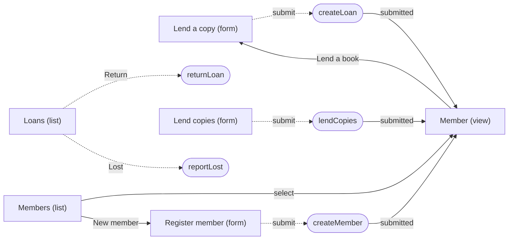

The menu, each entry shown to who may open its page:

- Members
  - All members: page members-list, members.read
  - Register a member: page member-form, members.write
- Loans
  - All loans: page loans-list, loans.read
  - Lend a copy: page loan-form, loans.create

| Page | Kind | Route | Entity | Permission | Shows |
|---|---|---|---|---|---|
| loan-form | form | /loans/new | Loan | loans.create | memberId, bookId |
| loans-list | list | /loans | Loan | loans.read | memberId, bookId, loanedAt, dueOn, status, lateFee; on a compact screen memberId, dueOn, status |
| member-form | form | /members/new | Member | members.write | fullName, email, tier |
| member-loans | form | /members/{memberId}/loans | Member | loans.create | membershipEndsOn, outstandingFees; Loans, rows of loans: bookId, dueOn, at most 6, the loaded rows locked |
| member-view | view | /members/{memberId} | Member | members.read | Member: cardNumber, fullName, email, tier; Membership: joinedOn, membershipEndsOn, outstandingFees |
| members-list | list | /members | Member | members.read | cardNumber, fullName, email, tier, outstandingFees |

What each page shows when it is empty or fails; while it loads or submits, the stack draws its own:

| Page | State | Message |
|---|---|---|
| loan-form | failed: lending-refused | This member cannot borrow now: the loan limit is reached, fees are outstanding, or no copy is available. |
| loans-list | empty | No loans yet. A loan is made from a member's record. |
| loans-list | filtered empty | No loan matches these filters. |
| loans-list | failed: loan-closed | This loan was already closed, so nothing changed. |
| loans-list | failed: default | The loans cannot be shown or changed right now. Try again in a moment. |
| member-form | failed: email-taken, beside email | Another member already has this email address. |
| member-loans | failed: member-not-found | There is no member with this card. |
| member-loans | failed: lending-refused | This member cannot borrow these copies now: the loan limit is reached, fees are outstanding, or a copy is not available. |
| member-view | failed: member-not-found | There is no member with this card. |
| members-list | empty | No members yet. Register the first one. |
| members-list | filtered empty | No member is in this tier. |

### Flow lend-a-copy

A librarian finds the member at the desk, opens their record and lends them a copy. Done by librarian.

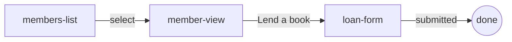

### Accessibility

The target is WCAG 2.2 at level AA. Of its criteria, these are settled in the design or left to the generator, as the table says; the validator checks those marked checked, and every other criterion of the level is a person's to check at commissioning.

| Criterion | Level | Met by | How |
|---|---|---|---|
| 1.1.1 Non-text content | A | a person | an image's text alternative is written where the image is chosen |
| 1.3.1 Info and relationships | A | the generator | a page's title, its labels and its order become the stack's headings and labelled controls |
| 1.4.1 Use of color | A | the generator | a state or a value is shown in text as well as in colour |
| 1.4.3 Contrast (minimum) | AA | the design, checked | every pair of colours the theme declares has the contrast its use asks for, in every mode |
| 1.4.11 Non-text contrast | AA | the design, checked | every pair of colours the theme declares has the contrast its use asks for, in every mode |
| 2.1.1 Keyboard | A | the generator | every action and field is reachable without a pointer |
| 2.4.3 Focus order | A | the design | the order of a page's fields and columns is its focus order |
| 2.4.6 Headings and labels | AA | the design, checked | every page has a title, every field it shows or filters by a title, and every action a label of its own |
| 2.5.8 Target size (minimum) | AA | the generator | every control is at least 24 by 24 CSS pixels |
| 3.2.3 Consistent navigation | AA | the design | the menu is one tree, the same on every page |
| 3.3.1 Error identification | A | the design, checked | every failed state a page declares is a message in a full sentence, shown beside the field it names when it names one |
| 3.3.2 Labels or instructions | A | the design, checked | every field a page shows or filters by has a title |
| 4.1.2 Name, role, value | A | the design, checked, and the generator | every action has a label of its own; the generator gives each control its role |
| 4.1.3 Status messages | AA | the design and the generator | every event's message and every state is text, which the generator announces without moving focus |

### Theme

The design tokens, in the format of the W3C Design Tokens Community Group. A mode's column shows the value it gives a token, and is empty where the token keeps its own.

| Token | Type | Value | dark |
|---|---|---|---|
| color.text | color | #1b1f24 | #e6e8eb |
| color.background | color | #ffffff | #101214 |
| color.accent | color | #0b5cad | #6cb0f5 |
| color.danger | color | #b3261e | #f2b8b5 |
| color.border | color | #6e7781 | #8c959f |
| color.link | color | same as color.accent |   |
| space.small | dimension | 8px |   |
| space.medium | dimension | 16px |   |
| font.body | fontFamily | system-ui, sans-serif |   |
| font.strong | fontWeight | 600 |   |

The pairs of colours shown together, with their contrast in each mode:

| Text | Background | Use | Contrast | dark |
|---|---|---|---|---|
| color.text | color.background | text | 16.56:1 | 15.29:1 |
| color.link | color.background | text | 6.66:1 | 8.19:1 |
| color.danger | color.background | text | 6.53:1 | 10.99:1 |
| color.border | color.background | control | 4.54:1 | 6.18:1 |

### Algorithm lateFee

Fee charged when a copy comes back after its due date. A flat daily rate,
capped so that a long-overdue book never costs more than replacing it.

Inputs: `daysLate` (int32), `dailyRate` (decimal(10, 2)), `replacementCost` (decimal(10, 2)). Output: decimal(10, 2).

Formula:

    min(decimal(daysLate, 0) * dailyRate, replacementCost)

| Worked example | Inputs | Expected | Note |
|---|---|---|---|
| returned on time | daysLate 0, dailyRate 0.50, replacementCost 25.00 | 0.00 |   |
| one week late | daysLate 7, dailyRate 0.50, replacementCost 25.00 | 3.50 | 7 × 0.50 = 3.50, below the cap. |
| capped at replacement cost | daysLate 90, dailyRate 0.50, replacementCost 25.00 | 25.00 | 90 × 0.50 = 45.00 exceeds the 25.00 replacement cost, so the cap applies. |
| cheap book, cap reached early | daysLate 10, dailyRate 0.50, replacementCost 4.00 | 4.00 |   |

Pseudocode:

```text
function lateFee(daysLate, dailyRate, replacementCost):
    if daysLate <= 0:
        return 0.00
    fee = daysLate * dailyRate          # decimal arithmetic, 2 places
    if fee > replacementCost:
        fee = replacementCost
    return fee
```

## 9. Architecture decisions

### ADR-001: Late fees are a flat daily rate capped at the replacement cost

Status: accepted, 2026-10-07.

Context: Tiered rates (cheaper for the first week, dearer after) were considered.
They are harder to explain at the desk and the difference in revenue is
small for a library of this size.

Decision: One daily rate for every book, capped at that book's replacement cost.
The rate is a library setting, not a per-book value.

Consequences: The fee can be computed from three numbers and checked by hand. A very
long-overdue book costs the same as a lost one, which is what we want:
at that point the member should be told to treat it as lost.

### ADR-002: Money is carried as decimal strings, never floats

Status: accepted, 2026-10-07.

Context: JSON has no decimal type. Fees and costs must round the way a cashier
expects.

Decision: Every money field is `type: string, format: decimal` with `precision`
and `scale`. Generators map it to the target's decimal type and the API
transports it as a string.

Consequences: Clients must parse the string; in return no sum ever drifts by a cent.

## 10. Quality requirements

The design tests: what must hold on every implementation. Golden scenarios succeed; red scenarios are refused.

| Test | Subject | Level | Scenario | Given | When | Then |
|---|---|---|---|---|---|---|
| book-available-above-owned | Book constraint book_available_within_owned | system | red | a book with 2 copies owned | it is saved with 3 available | it is refused |
| book-available-at-most-owned | Book constraint book_available_within_owned | system | golden | a book with 2 copies owned | it is saved with 2 available | it is saved |
| book-isbn-once | Book constraint book_isbn_unique | system | golden | no book with ISBN 9780000000001 | a book with that ISBN is saved | it is saved |
| book-isbn-twice | Book constraint book_isbn_unique | system | red | a book with ISBN 9780000000001 | another book with that ISBN is saved | it is refused |
| browse-catalogue | operation listBooks | system | golden | three books by two authors, and a visitor without a card | listBooks is called with q set to one author's name, and again with a 200-character q | the first call answers that author's books, the second an empty list |
| browse-catalogue-query-too-long | operation listBooks | system | red | a visitor | listBooks is called with a 201-character q | it is refused as invalid input |
| create-loan-denied-with-expired-session | operation createLoan | system | red | a librarian whose session expired after half an hour without a request | createLoan is called for a member and a book that exist | it is refused as not signed in, and nothing changes |
| create-loan-expired-member-id | operation createLoan | system | red | a member whose membershipEndsOn was yesterday, and a book with a copy available | createLoan is called for them | it is refused as expired and no loan is created |
| create-loan-idempotency-key-not-a-valid-uuid | operation createLoan | system | red | a member and a book that exist | createLoan is called with an Idempotency-Key that is not a UUID | it is refused and no loan is created |
| create-loan-idempotency-key-reused-for-another-request | operation createLoan | system | red | a loan was created under an Idempotency-Key | createLoan is called with the same Idempotency-Key for another book | it is refused and no loan is created |
| create-loan-not-yet-valid-member-id | operation createLoan | system | red | a member registered with a joinedOn of tomorrow, and a book with a copy available | createLoan is called for them | it is refused as not yet valid and no loan is created |
| create-loan-rate-exceeded | operation createLoan | system | red | a librarian who has made 60 lending requests within the last minute, the burst the rate of 30 a minute allows | createLoan is called once more within that minute | it is refused as too many requests and no loan is created |
| create-loan-repeated-with-the-same-idempotency-key | operation createLoan | system | golden | a loan was created for a member and a book under an Idempotency-Key, and the client never saw the answer | createLoan is called again with the same Idempotency-Key, member and book | it answers 201 with the loan already created, no second loan exists, and the book's copies available are unchanged |
| create-loan-request-larger-than-1024-bytes | operation createLoan | system | red | a librarian at the desk | createLoan is called with a body larger than 1024 bytes | it is refused as too large and no loan is created |
| create-member-denied-with-expired-session | operation createMember | system | red | a librarian whose session expired after half an hour without a request | createMember is called | it is refused as not signed in, and nothing changes |
| fees-block-lending | requirement LIB-3 | acceptance | golden | a member who owes a late fee | the librarian lends them a copy | A member with outstanding fees is refused a loan with 409. |
| get-member-denied-with-expired-session | operation getMember | system | red | a librarian whose session expired after half an hour without a request | getMember is called for a member that exists | it is refused as not signed in, and nothing changes |
| lend-a-copy | operation createLoan | system | golden | a standard-tier member with no loans and no fees, and a book with one copy available | createLoan is called for them | an open loan due in 21 days is created, the book has no copy available, and LoanCreated is published |
| lend-a-copy-at-the-desk |   | acceptance | golden | a librarian at the desk, and a member with no loans and no fees | the librarian selects the member in the members list, chooses Lend a book on their record, and submits the loan form for an available copy | the member's record opens again with the new loan and the message that the copy is lent |
| lend-a-copy-limit-reached |   | acceptance | red | a librarian at the desk, and a member who has reached the loan limit of their tier | the librarian goes through the flow and submits the loan form | the form stays open and says the loan is refused, and no loan is recorded |
| lend-bad-ids | operation createLoan | system | red | a librarian | createLoan is called with memberId abc and again with bookId abc | both are refused as invalid input |
| lend-copies | operation lendCopies | system | golden | an extended-tier member with two open loans and no fees, and two books with a copy available each | lendCopies is called for both books | two open loans are created, each due on the date the member's tier sets |
| lend-copies-bad-loans | operation lendCopies | system | red | a librarian | lendCopies is called without loans, with no loan, and with seven | each is refused as invalid input, and no loan is created |
| lend-copies-bad-member-id | operation lendCopies | system | red | a librarian | lendCopies is called with memberId abc | it is refused as invalid input |
| lend-copies-denied | operation lendCopies | system | red | a caller holding only the member role | lendCopies is called | it is refused as not allowed |
| lend-copies-denied-with-expired-session | operation lendCopies | system | red | a librarian whose session expired after half an hour without a request | lendCopies is called for a member and a book that exist | it is refused as not signed in, and nothing changes |
| lend-copies-limit-reached | operation lendCopies | system | red | a standard-tier member with two open loans | lendCopies is called for two more books | it answers 409 and neither loan is created |
| lend-copies-unknown-member | operation lendCopies | system | red | a librarian | lendCopies is called with a memberId no member has | it answers 404 and no loan is created |
| lend-denied | operation createLoan | system | red | a caller holding only the member role | createLoan is called | it is refused as not allowed |
| lend-event-not-delivered | operation createLoan | system | red | the loan.lifecycle channel is unavailable | createLoan is called | no loan is created and the call fails, so a loan never exists without its event |
| lend-limit-reached | operation createLoan | system | red | a standard-tier member with three open loans | createLoan is called for a fourth book | it answers 409 and no loan is created |
| lend-missing-field | operation createLoan | system | red | a librarian | createLoan is called without memberId and again without bookId | both are refused as invalid input |
| lend-unknown-member-or-book | operation createLoan | system | red | a librarian | createLoan is called with a memberId and then a bookId that no record has | both are refused as not found |
| lending-limit-accepted | requirement LIB-3 | acceptance | golden | a standard-tier member with three open loans | the librarian lends them a fourth copy | A standard-tier member with three open loans is refused a fourth with 409. |
| list-loans | operation listLoans | system | golden | an open loan and a returned loan | listLoans is called with status open | only the open loan is answered |
| list-loans-bad-filter | operation listLoans | system | red | a librarian | listLoans is called with status lent and again with memberId abc | both are refused as invalid input |
| list-loans-denied | operation listLoans | system | red | a caller holding no role | listLoans is called | it is refused as not allowed |
| list-loans-denied-with-expired-session | operation listLoans | system | red | a librarian whose session expired after half an hour without a request | listLoans is called | it is refused as not signed in, and nothing changes |
| list-members | operation listMembers | system | golden | two members and a librarian | listMembers is called | both members are answered |
| list-members-bad-tier | operation listMembers | system | red | a librarian | listMembers is called with the tier gold-plus, which is not a membership tier | it is refused as invalid input |
| list-members-denied | operation listMembers | system | red | a caller holding only the member role | listMembers is called | it is refused as not allowed |
| list-members-denied-with-expired-session | operation listMembers | system | red | a librarian whose session expired after half an hour without a request | listMembers is called | it is refused as not signed in, and nothing changes |
| loan-becomes-overdue | Loan open to overdue | system | golden | an open loan due yesterday | the nightly job runs | the loan is overdue and LoanOverdue is published |
| loan-due-after-loaned | Loan constraint loan_due_after_loaned | system | golden | a loan made on 2026-10-07 | it is saved due on 2026-10-28 | it is saved |
| loan-due-on-loan-day | Loan constraint loan_due_after_loaned | system | red | a loan made on 2026-10-07 | it is saved due on 2026-10-07 | it is refused |
| loan-form-denied | page loan-form | system | red | a caller holding only the member role | the page loan-form is opened | it is not shown |
| loan-form-denied-with-expired-session | page loan-form | system | red | a librarian whose session expired after half an hour without a request | the page loan-form is opened | it is not shown, and the sign-in page is shown instead |
| loan-form-shown | page loan-form | system | golden | a librarian | the page loan-form is filled in and sent | the copy is lent |
| loan-lent-and-returned | Loan state machine | system | golden | a Loan that is open | returnLoan happens before the due date | the Loan ends returned, with no late fee |
| loan-overdue-only-from-open | Loan open to overdue | system | red | a returned loan due last week | the nightly job runs | the loan stays returned |
| loan-returned-after-loaned | Loan constraint loan_returned_after_loaned | system | golden | a loan made at 2026-10-07T10:00:00Z | it is saved returned at 2026-10-08T10:00:00Z | it is saved |
| loan-returned-before-loaned | Loan constraint loan_returned_after_loaned | system | red | a loan made at 2026-10-07T10:00:00Z | it is saved returned at 2026-10-06T10:00:00Z | it is refused |
| loan-returned-on-time | Loan open to returned | system | golden | an open loan | returnLoan is called | the loan is returned with no fee |
| loan-returned-only-when-out | Loan open to returned | system | red | a lost loan | returnLoan is called | it is refused and the loan stays lost |
| loans-list-denied | page loans-list | system | red | a caller holding no role | the page loans-list is opened | it is not shown |
| loans-list-denied-with-expired-session | page loans-list | system | red | a librarian whose session expired after half an hour without a request | the page loans-list is opened | it is not shown, and the sign-in page is shown instead |
| loans-list-shown | page loans-list | system | golden | a librarian and some loans | the page loans-list is opened | it lists the loans with their due dates, states and fees |
| mark-overdue-runs-twice | job markOverdue | system | golden | the job markOverdue has run and marked a loan overdue | it runs again the same night | the loan stays overdue, and no second LoanOverdue is published for it |
| mark-overdue-succeeds | job markOverdue | system | golden | an open loan whose due date was yesterday, and an open loan due today | the job markOverdue runs | the loan due yesterday is overdue and LoanOverdue is published for it; the loan due today stays open |
| member-card-number-once | Member constraint member_card_number_unique | system | golden | no member with card number 00000001 | a member with that card number is saved | it is saved |
| member-card-number-twice | Member constraint member_card_number_unique | system | red | a member with card number 00000001 | another member with that card number is saved | it is refused |
| member-email-once | Member constraint member_email_unique | system | golden | no member with ana@example.org | a member with that address is saved | it is saved |
| member-email-twice | Member constraint member_email_unique | system | red | a member with ana@example.org | another member with that address is saved | it is refused |
| member-form-denied | page member-form | system | red | a caller holding only the member role | the page member-form is opened | it is not shown |
| member-form-denied-with-expired-session | page member-form | system | red | a librarian whose session expired after half an hour without a request | the page member-form is opened | it is not shown, and the sign-in page is shown instead |
| member-form-shown | page member-form | system | golden | a librarian | the page member-form is filled in and sent | the member is registered |
| member-loans-denied | page member-loans | system | red | a caller holding only the member role | the page member-loans is opened | it is refused as not allowed |
| member-loans-denied-with-expired-session | page member-loans | system | red | a librarian whose session expired after half an hour without a request | the page member-loans is opened | it is refused as not signed in |
| member-loans-not-found | page member-loans | system | red | a librarian | the page member-loans is opened for an id no member has | it shows: There is no member with this card. |
| member-loans-refused | page member-loans | system | red | a librarian, and a member with outstanding fees | a row is added and the form is submitted | it shows: This member cannot borrow these copies now: the loan limit is reached, fees are outstanding, or a copy is not available. |
| member-loans-shown | page member-loans | system | golden | a librarian, and a member with two open loans | the page member-loans is opened for that member | it shows the two loans, which cannot be changed, and a row to add a copy |
| member-loans-six-rows | page member-loans | system | red | a librarian, and a member with four loans loaded and two rows added | a seventh row of loans is added | it is refused: the form holds at most 6 rows of loans |
| member-view-denied | page member-view | system | red | a caller holding only the member role | the page member-view is opened | it is not shown |
| member-view-denied-with-expired-session | page member-view | system | red | a librarian whose session expired after half an hour without a request | the page member-view is opened | it is not shown, and the sign-in page is shown instead |
| member-view-not-found | page member-view | system | red | a librarian | the page member-view is opened for an id no member has | it says the member was not found |
| member-view-shown | page member-view | system | golden | a librarian and a member | the page member-view is opened for that member | it shows the member and offers Lend a book |
| members-list-denied | page members-list | system | red | a caller holding only the member role | the page members-list is opened | it is not shown |
| members-list-denied-with-expired-session | page members-list | system | red | a librarian whose session expired after half an hour without a request | the page members-list is opened | it is not shown, and the sign-in page is shown instead |
| members-list-shown | page members-list | system | golden | a librarian | the page members-list is opened | it lists members with card number, name, email, tier and fees |
| open-loan-lost | Loan open to lost | system | golden | an open loan | reportLost is called | the loan is lost and the replacement cost is charged |
| open-loan-lost-after-return | Loan open to lost | system | red | a returned loan | reportLost is called | it is refused and the loan stays returned |
| overdue-loan-lost | Loan overdue to lost | system | golden | an overdue loan | reportLost is called | the loan is lost and the replacement cost is charged |
| overdue-loan-lost-twice | Loan overdue to lost | system | red | a loan already lost | reportLost is called again | it is refused and nothing is charged twice |
| overdue-loan-returned | Loan overdue to returned | system | golden | an overdue loan | returnLoan is called | the loan is returned with its late fee |
| overdue-loan-returned-twice | Loan overdue to returned | system | red | a loan already returned | returnLoan is called again | it is refused and the fee is not charged twice |
| register-member | operation createMember | system | golden | a librarian | createMember is called for a standard-tier member with a one-letter name, and again with a 200-character name | both members are created, each with a new eight-digit card number and no fees |
| register-member-bad-values | operation createMember | system | red | a librarian | createMember is called with email set to 'not-an-address', and with tier set to gold | both are refused as invalid input |
| register-member-card-number-clash | operation createMember | system | red | not applicable |   | The card number is assigned by the system, never sent by a client, so a request cannot clash on it. The constraint itself is tested under member-card-number-twice. |
| register-member-denied | operation createMember | system | red | a caller holding only the member role | createMember is called | it is refused as not allowed |
| register-member-email-taken | operation createMember | system | red | a member registered with ana@example.org | createMember is called with the same email address | it answers 409 and no member is created |
| register-member-missing-field | operation createMember | system | red | a librarian | createMember is called three times each time without one of fullName and email and tier | each call is refused as invalid input |
| register-member-name-length | operation createMember | system | red | a librarian | createMember is called with an empty fullName and with a 201-character one | both are refused as invalid input |
| report-lost | operation reportLost | system | golden | an open loan of a book whose replacement cost is 25.00 | reportLost is called | the loan is lost and 25.00 is added to the member's outstanding fees |
| report-lost-already-closed | operation reportLost | system | red | a loan already lost | reportLost is called on it | it answers 409 and nothing is charged twice |
| report-lost-concurrent-write | operation reportLost | system | red | an open loan that a second librarian closed after the first librarian's screen showed it open | reportLost is called by the first librarian for it | it is refused, the loan stays as the second librarian left it, and no second fee is charged |
| report-lost-denied | operation reportLost | system | red | a caller holding only the member role | reportLost is called | it is refused as not allowed |
| report-lost-denied-with-expired-session | operation reportLost | system | red | a librarian whose session expired after half an hour without a request | reportLost is called for an open loan | it is refused as not signed in, and nothing changes |
| report-lost-dependency-fails-fee-ledger | operation reportLost | system | red | an open loan, and a fee ledger that answers every call with an error | reportLost is called for it | it answers 503, the loan stays open, and no event is published |
| report-lost-dependency-times-out-fee-ledger | operation reportLost | system | red | an open loan, and a fee ledger that does not answer within 5 seconds | reportLost is called for it | it gives up the call, answers 503, the loan stays open, and no event is published |
| report-lost-event-not-delivered | operation reportLost | system | red | the loan.lifecycle channel is unavailable | reportLost is called | the loan stays open, nothing is charged, and the call fails |
| report-lost-unknown-loan | operation reportLost | system | red | a librarian | reportLost is called with an id no loan has and again with abc | the first is refused as not found and the second as invalid input |
| return-already-closed | operation returnLoan | system | red | a loan already returned | returnLoan is called on it | it answers 409 and nothing changes |
| return-denied | operation returnLoan | system | red | a caller holding only the member role | returnLoan is called | it is refused as not allowed |
| return-event-not-delivered | operation returnLoan | system | red | the loan.lifecycle channel is unavailable | returnLoan is called | the loan stays open and the call fails |
| return-late | operation returnLoan | system | golden | an overdue loan returned 7 days late, a daily rate of 0.50 and a replacement cost of 25.00 | returnLoan is called | the loan is returned with a late fee of 3.50, the copy is available again, and LoanReturned is published |
| return-loan-concurrent-write | operation returnLoan | system | red | an open loan that a second librarian closed after the first librarian's screen showed it open | returnLoan is called by the first librarian for it | it is refused, the loan stays as the second librarian left it, and no second fee is charged |
| return-loan-denied-with-expired-session | operation returnLoan | system | red | a librarian whose session expired after half an hour without a request | returnLoan is called for an open loan | it is refused as not signed in, and nothing changes |
| return-loan-dependency-fails-fee-ledger | operation returnLoan | system | red | an open loan, and a fee ledger that answers every call with an error | returnLoan is called for it | it answers 503, the loan stays open, and no event is published |
| return-loan-dependency-times-out-fee-ledger | operation returnLoan | system | red | an open loan, and a fee ledger that does not answer within 5 seconds | returnLoan is called for it | it gives up the call, answers 503, the loan stays open, and no event is published |
| return-unknown-loan | operation returnLoan | system | red | a librarian | returnLoan is called with an id no loan has and again with abc | the first is refused as not found and the second as invalid input |
| show-member | operation getMember | system | golden | a member and a librarian | getMember is called with the member's id | the member is answered |
| show-member-bad-id | operation getMember | system | red | a librarian | getMember is called with memberId abc | it is refused as invalid input |
| show-member-denied | operation getMember | system | red | a caller holding only the member role | getMember is called | it is refused as not allowed |
| show-member-not-found | operation getMember | system | red | a librarian and no member with a given id | getMember is called with that id | it answers 404 |

**Origin on create-loan-rate-exceeded:** inferred.

**Insight on create-loan-rate-exceeded:** Derived from the rate on createLoan, then completed by hand; lending runs at the desk, so a burst well above the rate covers a busy morning.

**Origin on create-loan-request-larger-than-1024-bytes:** inferred.

**Insight on create-loan-request-larger-than-1024-bytes:** Derived from the body limit on createLoan, then completed by hand; a lending request holds two ids, so anything near the limit is not a lending request.

**Origin on lend-a-copy-at-the-desk:** inferred.

**Insight on lend-a-copy-at-the-desk:** Drafted from the flow's success path and completed by hand; the desk task of LIB-7 is this flow.

**Origin on lend-a-copy-limit-reached:** inferred.

**Insight on lend-a-copy-limit-reached:** The flow's last step calls createLoan, whose refusal lending-refused is the failure a librarian meets most at the desk.

**Origin on mark-overdue-runs-twice:** inferred.

**Insight on mark-overdue-runs-twice:** Drafted by specarch derive, since a job that runs twice is a case nobody tries by hand, then completed by hand; a member must not be told twice.

**Origin on mark-overdue-succeeds:** inferred.

**Insight on mark-overdue-succeeds:** Drafted by specarch derive from the job's success path, then completed by hand from the acceptance criterion of LIB-4; the loan due today shows the job does not run a day early.

## 12. Glossary

| Term | Meaning |
|---|---|
| copy | One physical book. The example counts copies per title and does not identify them. |
| tier | A membership level that sets the loan limit and the loan period. |
| loan period | The number of days a copy may be kept; 21 for the standard tier, 28 for the extended tier. |
| late fee | The amount charged when a copy comes back after its due date. |

## 13. Requirements

### Needs

| Need | Statement | Stakeholders | Status |
|---|---|---|---|
| NEED-1 | We need to know who has which copy and when it is due, without a card index. | librarian | accepted |
| NEED-2 | We need late fees to be charged the same way for every member, as the policy says. | librarian, library-board | accepted |
| NEED-3 | Members need to browse the catalogue without logging in, and to see only their own records when they do. | member, library-board | accepted |
| NEED-4 | Members need to be told when a loan becomes overdue. | member | accepted |

**Note on NEED-1:** From Interview with the desk staff about lending and returns: The card index is searched by hand when a member asks what they have out, and it is often out of date.

**Note on NEED-2:** From Lending policy of the library, 2026, clause 4: A late return is charged a flat daily rate, capped at the book's replacement cost.

**Note on NEED-3:** From The data-protection rules the library is bound by, 2024: Personal data is shown only to the person it is about and to the staff who need it.

### Requirements

| Requirement | Statement | Kind | Priority | Status | Verification | Acceptance | Needs |
|---|---|---|---|---|---|---|---|
| LIB-1 | A member shall be identified by a unique card number and a unique email address. | functional | must | accepted | test | Registering a member with an email address already registered is refused with 409. Two members never share a card number. | NEED-1 |
| LIB-2 | Anyone shall be able to browse the catalogue without a card. | functional | must | accepted | test | A visitor with no account lists books by title or author and gets the matching books. | NEED-3 |
| LIB-3 | A member shall hold at most the number of open loans their tier allows, and shall not borrow while fees are outstanding. | functional | must | accepted | test | A standard-tier member with three open loans is refused a fourth with 409. A member with outstanding fees is refused a loan with 409. | NEED-1 |
| LIB-4 | A loan not returned by its due date shall become overdue the next day, and the member shall be told. | functional | must | accepted | test | The nightly job marks a loan due yesterday as overdue and publishes LoanOverdue. | NEED-4 |
| LIB-5 | A late return shall be charged a flat daily rate, capped at the book's replacement cost. | functional | must | accepted | test | Seven days late at 0.50 a day on a 25.00 book charges 3.50. Ninety days late at 0.50 a day on a 25.00 book charges 25.00. | NEED-2 |
| LIB-6 | A member shall see only their own loans and fees. | quality | must | accepted | test | A member listing loans gets only loans whose memberId is their own. | NEED-3 |
| LIB-7 | A desk task shall take a librarian under a minute, in one screen. | quality | should | accepted | demonstration | Registering a member and lending a book each take one form and one submit. | NEED-1 |

**Note on LIB-1:** From Lending policy of the library, 2026, clause 1: Each member holds one card, and the card number identifies them at the desk.

**Note on LIB-3:** From Lending policy of the library, 2026, clause 2: Standard members may hold three loans at a time and extended members six; no loan is made while a fee is unpaid.

**Insight on LIB-5:** A flat rate can be checked by hand at the desk; the cap means a long-overdue book costs the same as a lost one, which is when the member should be told to treat it as lost.

**Note on LIB-5:** From Lending policy of the library, 2026, clause 4: The late fee is a daily rate set by the board, and never more than the cost of replacing the book.

**Note on LIB-6:** From The data-protection rules the library is bound by, 2024: Personal data is shown only to the person it is about and to the staff who need it.

### Traceability

What satisfies and what verifies each requirement. An empty cell is a gap.

| Requirement | Harm | Satisfied by | Verified by |
|---|---|---|---|
| LIB-1 |   | entities Member constraints member_card_number_unique; entities Member; paths /members post | tests register-member; tests register-member-email-taken; checks lend-and-return; checks migrated-members |
| LIB-2 |   | entities Book; permissions public; paths /books get | tests browse-catalogue; checks service-answers |
| LIB-3 | money | entities Loan; paths /members/{memberId}/loans post; paths /loans post; pages member-loans; migrations add-membership-tier | tests create-loan-rate-exceeded; tests create-loan-repeated-with-the-same-idempotency-key; tests create-loan-request-larger-than-1024-bytes; tests fees-block-lending; tests lend-a-copy; tests lend-copies; tests lend-copies-limit-reached; tests lend-limit-reached; tests lending-limit-accepted; tests member-loans-refused; tests member-loans-shown; tests member-loans-six-rows; checks lend-and-return |
| LIB-4 |   | entities Loan transitions 1; entities Loan; paths /loans/{loanId}/return post; channels loan.overdue; channels loan.overdue messages LoanOverdue; jobs markOverdue; configuration notificationChannelUrl | tests loan-becomes-overdue; tests mark-overdue-runs-twice; tests mark-overdue-succeeds; monitors overdue-notices-sent |
| LIB-5 |   | paths /loans/{loanId}/return post; algorithms lateFee; decisions ADR-001; configuration dailyRate | tests loan-lent-and-returned; tests return-late; checks lend-and-return |
| LIB-6 |   | roles member; session | checks member-sees-own-loans |
| LIB-7 |   | pages loan-form; pages member-form; flows lend-a-copy | tests lend-a-copy-at-the-desk; tests lend-a-copy-limit-reached; checks lend-and-return; monitors catalogue-latency |

## Sources

Every source a Note in this document cites.

| Source | Title | Edition | Author | Where to read it |
|---|---|---|---|---|
| data-protection-rules | The data-protection rules the library is bound by | 2024 | The regulator |   |
| desk-interview | Interview with the desk staff about lending and returns |   |   |   |
| lending-policy | Lending policy of the library | 2026 | The library board |   |

