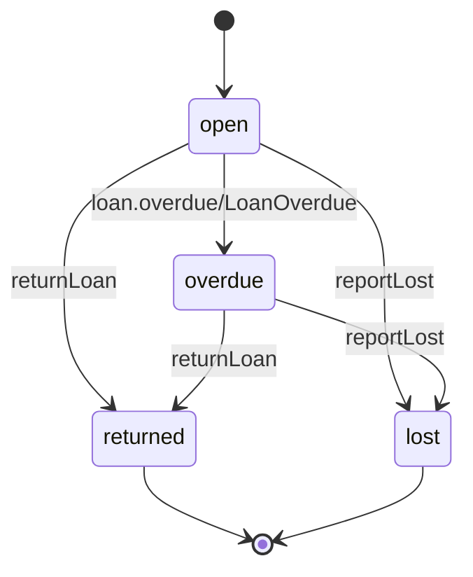

<!-- Generated by specarch document testplan from ../spec/specarch.yaml, version 0.1.0, and ../spec/implementation/go/library-lending.go.specarch-implementation.yaml, version 0.1.0; meta-model 0.1. Do not edit this file: change the YAML and generate again. -->

# Library Lending: test plan

Version 0.1.0 of the specification: 98 design tests, 30 golden and 67 red, about 27 subjects. Golden tests show a path that succeeds, red tests a path that is refused. The test cases follow the test case specification of ISO/IEC/IEEE 29119-3.

1 test is marked not applicable, with the reason.

## 1. Levels and how the tests run

| Level | Design tests |
|---|---|
| acceptance | 2 |
| system | 96 |

System and acceptance tests are design tests, written in the specification and run by every implementation. Unit and integration tests belong to one implementation and are listed with it below.

## 2. Test cases

### Book constraint book_available_within_owned

#### book-available-above-owned

Scenario: red; level: system; covers violates book_available_within_owned.

- Given: a book with 2 copies owned
- When: it is saved with 3 available
- Then: it is refused

#### book-available-at-most-owned

Scenario: golden; level: system.

- Given: a book with 2 copies owned
- When: it is saved with 2 available
- Then: it is saved

### Book constraint book_isbn_unique

#### book-isbn-once

Scenario: golden; level: system.

- Given: no book with ISBN 9780000000001
- When: a book with that ISBN is saved
- Then: it is saved

#### book-isbn-twice

Scenario: red; level: system; covers duplicate book_isbn_unique.

- Given: a book with ISBN 9780000000001
- When: another book with that ISBN is saved
- Then: it is refused

### Operation listBooks

#### browse-catalogue

Scenario: golden; level: system; covers q of 200 characters; verifies LIB-2.

- Given: three books by two authors, and a visitor without a card
- When: listBooks is called with q set to one author's name, and again with a 200-character q
- Then: the first call answers that author's books, the second an empty list

#### browse-catalogue-query-too-long

Scenario: red; level: system; covers q longer than 200 characters.

- Given: a visitor
- When: listBooks is called with a 201-character q
- Then: it is refused as invalid input

### Operation createLoan

#### create-loan-denied-with-expired-session

Scenario: red; level: system; covers denied with expired session.

- Given: a librarian whose session expired after half an hour without a request
- When: createLoan is called for a member and a book that exist
- Then: it is refused as not signed in, and nothing changes

#### create-loan-expired-member-id

Scenario: red; level: system; covers expired memberId.

- Given: a member whose membershipEndsOn was yesterday, and a book with a copy available
- When: createLoan is called for them
- Then: it is refused as expired and no loan is created

#### create-loan-idempotency-key-not-a-valid-uuid

Scenario: red; level: system; covers Idempotency-Key not a valid uuid.

- Given: a member and a book that exist
- When: createLoan is called with an Idempotency-Key that is not a UUID
- Then: it is refused and no loan is created

#### create-loan-idempotency-key-reused-for-another-request

Scenario: red; level: system; covers Idempotency-Key reused for another request.

- Given: a loan was created under an Idempotency-Key
- When: createLoan is called with the same Idempotency-Key for another book
- Then: it is refused and no loan is created

#### create-loan-not-yet-valid-member-id

Scenario: red; level: system; covers not yet valid memberId.

- Given: a member registered with a joinedOn of tomorrow, and a book with a copy available
- When: createLoan is called for them
- Then: it is refused as not yet valid and no loan is created

#### create-loan-rate-exceeded

Scenario: red; level: system; covers rate exceeded; verifies LIB-3.

- Given: a librarian who has made 60 lending requests within the last minute, the burst the rate of 30 a minute allows
- When: createLoan is called once more within that minute
- Then: it is refused as too many requests and no loan is created

**Origin:** inferred.

**Insight:** Derived from the rate on createLoan, then completed by hand; lending runs at the desk, so a burst well above the rate covers a busy morning.

#### create-loan-repeated-with-the-same-idempotency-key

Scenario: golden; level: system; covers repeated with the same Idempotency-Key; verifies LIB-3.

- Given: a loan was created for a member and a book under an Idempotency-Key, and the client never saw the answer
- When: createLoan is called again with the same Idempotency-Key, member and book
- Then: it answers 201 with the loan already created, no second loan exists, and the book's copies available are unchanged

#### create-loan-request-larger-than-1024-bytes

Scenario: red; level: system; covers request larger than 1024 bytes; verifies LIB-3.

- Given: a librarian at the desk
- When: createLoan is called with a body larger than 1024 bytes
- Then: it is refused as too large and no loan is created

**Origin:** inferred.

**Insight:** Derived from the body limit on createLoan, then completed by hand; a lending request holds two ids, so anything near the limit is not a lending request.

#### lend-a-copy

Scenario: golden; level: system; verifies LIB-3.

- Given: a standard-tier member with no loans and no fees, and a book with one copy available
- When: createLoan is called for them
- Then: an open loan due in 21 days is created, the book has no copy available, and LoanCreated is published

#### lend-bad-ids

Scenario: red; level: system; covers memberId not a valid uuid, bookId not a valid uuid.

- Given: a librarian
- When: createLoan is called with memberId abc and again with bookId abc
- Then: both are refused as invalid input

#### lend-denied

Scenario: red; level: system; covers denied without loans.create.

- Given: a caller holding only the member role
- When: createLoan is called
- Then: it is refused as not allowed

#### lend-event-not-delivered

Scenario: red; level: system; covers dependency fails loan.lifecycle.

- Given: the loan.lifecycle channel is unavailable
- When: createLoan is called
- Then: no loan is created and the call fails, so a loan never exists without its event

#### lend-limit-reached

Scenario: red; level: system; covers response 409; verifies LIB-3.

- Given: a standard-tier member with three open loans
- When: createLoan is called for a fourth book
- Then: it answers 409 and no loan is created

#### lend-missing-field

Scenario: red; level: system; covers missing memberId, missing bookId.

- Given: a librarian
- When: createLoan is called without memberId and again without bookId
- Then: both are refused as invalid input

#### lend-unknown-member-or-book

Scenario: red; level: system; covers not found memberId, not found bookId.

- Given: a librarian
- When: createLoan is called with a memberId and then a bookId that no record has
- Then: both are refused as not found

### Operation createMember

#### create-member-denied-with-expired-session

Scenario: red; level: system; covers denied with expired session.

- Given: a librarian whose session expired after half an hour without a request
- When: createMember is called
- Then: it is refused as not signed in, and nothing changes

#### register-member

Scenario: golden; level: system; covers fullName of 1 character, fullName of 200 characters; verifies LIB-1.

- Given: a librarian
- When: createMember is called for a standard-tier member with a one-letter name, and again with a 200-character name
- Then: both members are created, each with a new eight-digit card number and no fees

#### register-member-bad-values

Scenario: red; level: system; covers email not a valid email, tier not one of its values.

- Given: a librarian
- When: createMember is called with email set to 'not-an-address', and with tier set to gold
- Then: both are refused as invalid input

#### register-member-card-number-clash

Scenario: red; level: system; covers duplicate member_card_number_unique.

Not applicable: The card number is assigned by the system, never sent by a client, so a request cannot clash on it. The constraint itself is tested under member-card-number-twice.

#### register-member-denied

Scenario: red; level: system; covers denied without members.write.

- Given: a caller holding only the member role
- When: createMember is called
- Then: it is refused as not allowed

#### register-member-email-taken

Scenario: red; level: system; covers duplicate member_email_unique, response 409; verifies LIB-1.

- Given: a member registered with ana@example.org
- When: createMember is called with the same email address
- Then: it answers 409 and no member is created

#### register-member-missing-field

Scenario: red; level: system; covers missing fullName, missing email, missing tier.

- Given: a librarian
- When: createMember is called three times each time without one of fullName and email and tier
- Then: each call is refused as invalid input

#### register-member-name-length

Scenario: red; level: system; covers fullName shorter than 1 character, fullName longer than 200 characters.

- Given: a librarian
- When: createMember is called with an empty fullName and with a 201-character one
- Then: both are refused as invalid input

### Requirement LIB-3

#### fees-block-lending

Scenario: golden; level: acceptance; covers acceptance 2; verifies LIB-3.

- Given: a member who owes a late fee
- When: the librarian lends them a copy
- Then: A member with outstanding fees is refused a loan with 409.

#### lending-limit-accepted

Scenario: golden; level: acceptance; covers acceptance 1; verifies LIB-3.

- Given: a standard-tier member with three open loans
- When: the librarian lends them a fourth copy
- Then: A standard-tier member with three open loans is refused a fourth with 409.

### Operation getMember

#### get-member-denied-with-expired-session

Scenario: red; level: system; covers denied with expired session.

- Given: a librarian whose session expired after half an hour without a request
- When: getMember is called for a member that exists
- Then: it is refused as not signed in, and nothing changes

#### show-member

Scenario: golden; level: system.

- Given: a member and a librarian
- When: getMember is called with the member's id
- Then: the member is answered

#### show-member-bad-id

Scenario: red; level: system; covers memberId not a valid uuid.

- Given: a librarian
- When: getMember is called with memberId abc
- Then: it is refused as invalid input

#### show-member-denied

Scenario: red; level: system; covers denied without members.read.

- Given: a caller holding only the member role
- When: getMember is called
- Then: it is refused as not allowed

#### show-member-not-found

Scenario: red; level: system; covers not found memberId, response 404.

- Given: a librarian and no member with a given id
- When: getMember is called with that id
- Then: it answers 404

### Operation listLoans

#### list-loans

Scenario: golden; level: system.

- Given: an open loan and a returned loan
- When: listLoans is called with status open
- Then: only the open loan is answered

#### list-loans-bad-filter

Scenario: red; level: system; covers status not one of its values, memberId not a valid uuid.

- Given: a librarian
- When: listLoans is called with status lent and again with memberId abc
- Then: both are refused as invalid input

#### list-loans-denied

Scenario: red; level: system; covers denied without loans.read.

- Given: a caller holding no role
- When: listLoans is called
- Then: it is refused as not allowed

#### list-loans-denied-with-expired-session

Scenario: red; level: system; covers denied with expired session.

- Given: a librarian whose session expired after half an hour without a request
- When: listLoans is called
- Then: it is refused as not signed in, and nothing changes

### Operation listMembers

#### list-members

Scenario: golden; level: system.

- Given: two members and a librarian
- When: listMembers is called
- Then: both members are answered

#### list-members-denied

Scenario: red; level: system; covers denied without members.read.

- Given: a caller holding only the member role
- When: listMembers is called
- Then: it is refused as not allowed

#### list-members-denied-with-expired-session

Scenario: red; level: system; covers denied with expired session.

- Given: a librarian whose session expired after half an hour without a request
- When: listMembers is called
- Then: it is refused as not signed in, and nothing changes

### Loan open to overdue

#### loan-becomes-overdue

Scenario: golden; level: system; verifies LIB-4.

- Given: an open loan due yesterday
- When: the nightly job runs
- Then: the loan is overdue and LoanOverdue is published

#### loan-overdue-only-from-open

Scenario: red; level: system; covers from wrong state.

- Given: a returned loan due last week
- When: the nightly job runs
- Then: the loan stays returned

### Loan constraint loan_due_after_loaned

#### loan-due-after-loaned

Scenario: golden; level: system.

- Given: a loan made on 2026-10-07
- When: it is saved due on 2026-10-28
- Then: it is saved

#### loan-due-on-loan-day

Scenario: red; level: system; covers violates loan_due_after_loaned.

- Given: a loan made on 2026-10-07
- When: it is saved due on 2026-10-07
- Then: it is refused

### Page loan-form

#### loan-form-denied

Scenario: red; level: system; covers denied without loans.create.

- Given: a caller holding only the member role
- When: the page loan-form is opened
- Then: it is not shown

#### loan-form-denied-with-expired-session

Scenario: red; level: system; covers denied with expired session.

- Given: a librarian whose session expired after half an hour without a request
- When: the page loan-form is opened
- Then: it is not shown, and the sign-in page is shown instead

#### loan-form-shown

Scenario: golden; level: system.

- Given: a librarian
- When: the page loan-form is filled in and sent
- Then: the copy is lent

### Loan state machine

#### loan-lent-and-returned

Scenario: golden; level: system; covers open to returned; verifies LIB-5.

- Given: a Loan that is open
- When: returnLoan happens before the due date
- Then: the Loan ends returned, with no late fee

### Loan constraint loan_returned_after_loaned

#### loan-returned-after-loaned

Scenario: golden; level: system.

- Given: a loan made at 2026-10-07T10:00:00Z
- When: it is saved returned at 2026-10-08T10:00:00Z
- Then: it is saved

#### loan-returned-before-loaned

Scenario: red; level: system; covers violates loan_returned_after_loaned.

- Given: a loan made at 2026-10-07T10:00:00Z
- When: it is saved returned at 2026-10-06T10:00:00Z
- Then: it is refused

### Loan open to returned

#### loan-returned-on-time

Scenario: golden; level: system.

- Given: an open loan
- When: returnLoan is called
- Then: the loan is returned with no fee

#### loan-returned-only-when-out

Scenario: red; level: system; covers from wrong state.

- Given: a lost loan
- When: returnLoan is called
- Then: it is refused and the loan stays lost

### Page loans-list

#### loans-list-denied

Scenario: red; level: system; covers denied without loans.read.

- Given: a caller holding no role
- When: the page loans-list is opened
- Then: it is not shown

#### loans-list-denied-with-expired-session

Scenario: red; level: system; covers denied with expired session.

- Given: a librarian whose session expired after half an hour without a request
- When: the page loans-list is opened
- Then: it is not shown, and the sign-in page is shown instead

#### loans-list-shown

Scenario: golden; level: system.

- Given: a librarian and some loans
- When: the page loans-list is opened
- Then: it lists the loans with their due dates, states and fees

### Job markOverdue

#### mark-overdue-runs-twice

Scenario: golden; level: system; covers runs twice; verifies LIB-4.

- Given: the job markOverdue has run and marked a loan overdue
- When: it runs again the same night
- Then: the loan stays overdue, and no second LoanOverdue is published for it

**Origin:** inferred.

**Insight:** Drafted by specarch derive, since a job that runs twice is a case nobody tries by hand, then completed by hand; a member must not be told twice.

#### mark-overdue-succeeds

Scenario: golden; level: system; verifies LIB-4.

- Given: an open loan whose due date was yesterday, and an open loan due today
- When: the job markOverdue runs
- Then: the loan due yesterday is overdue and LoanOverdue is published for it; the loan due today stays open

**Origin:** inferred.

**Insight:** Drafted by specarch derive from the job's success path, then completed by hand from the acceptance criterion of LIB-4; the loan due today shows the job does not run a day early.

### Member constraint member_card_number_unique

#### member-card-number-once

Scenario: golden; level: system.

- Given: no member with card number 00000001
- When: a member with that card number is saved
- Then: it is saved

#### member-card-number-twice

Scenario: red; level: system; covers duplicate member_card_number_unique.

- Given: a member with card number 00000001
- When: another member with that card number is saved
- Then: it is refused

### Member constraint member_email_unique

#### member-email-once

Scenario: golden; level: system.

- Given: no member with ana@example.org
- When: a member with that address is saved
- Then: it is saved

#### member-email-twice

Scenario: red; level: system; covers duplicate member_email_unique.

- Given: a member with ana@example.org
- When: another member with that address is saved
- Then: it is refused

### Page member-form

#### member-form-denied

Scenario: red; level: system; covers denied without members.write.

- Given: a caller holding only the member role
- When: the page member-form is opened
- Then: it is not shown

#### member-form-denied-with-expired-session

Scenario: red; level: system; covers denied with expired session.

- Given: a librarian whose session expired after half an hour without a request
- When: the page member-form is opened
- Then: it is not shown, and the sign-in page is shown instead

#### member-form-shown

Scenario: golden; level: system.

- Given: a librarian
- When: the page member-form is filled in and sent
- Then: the member is registered

### Page member-view

#### member-view-denied

Scenario: red; level: system; covers denied without members.read.

- Given: a caller holding only the member role
- When: the page member-view is opened
- Then: it is not shown

#### member-view-denied-with-expired-session

Scenario: red; level: system; covers denied with expired session.

- Given: a librarian whose session expired after half an hour without a request
- When: the page member-view is opened
- Then: it is not shown, and the sign-in page is shown instead

#### member-view-not-found

Scenario: red; level: system; covers not found memberId.

- Given: a librarian
- When: the page member-view is opened for an id no member has
- Then: it says the member was not found

#### member-view-shown

Scenario: golden; level: system.

- Given: a librarian and a member
- When: the page member-view is opened for that member
- Then: it shows the member and offers Lend a book

### Page members-list

#### members-list-denied

Scenario: red; level: system; covers denied without members.read.

- Given: a caller holding only the member role
- When: the page members-list is opened
- Then: it is not shown

#### members-list-denied-with-expired-session

Scenario: red; level: system; covers denied with expired session.

- Given: a librarian whose session expired after half an hour without a request
- When: the page members-list is opened
- Then: it is not shown, and the sign-in page is shown instead

#### members-list-shown

Scenario: golden; level: system.

- Given: a librarian
- When: the page members-list is opened
- Then: it lists members with card number, name, email, tier and fees

### Loan open to lost

#### open-loan-lost

Scenario: golden; level: system.

- Given: an open loan
- When: reportLost is called
- Then: the loan is lost and the replacement cost is charged

#### open-loan-lost-after-return

Scenario: red; level: system; covers from wrong state.

- Given: a returned loan
- When: reportLost is called
- Then: it is refused and the loan stays returned

### Loan overdue to lost

#### overdue-loan-lost

Scenario: golden; level: system.

- Given: an overdue loan
- When: reportLost is called
- Then: the loan is lost and the replacement cost is charged

#### overdue-loan-lost-twice

Scenario: red; level: system; covers from wrong state.

- Given: a loan already lost
- When: reportLost is called again
- Then: it is refused and nothing is charged twice

### Loan overdue to returned

#### overdue-loan-returned

Scenario: golden; level: system.

- Given: an overdue loan
- When: returnLoan is called
- Then: the loan is returned with its late fee

#### overdue-loan-returned-twice

Scenario: red; level: system; covers from wrong state.

- Given: a loan already returned
- When: returnLoan is called again
- Then: it is refused and the fee is not charged twice

### Operation reportLost

#### report-lost

Scenario: golden; level: system.

- Given: an open loan of a book whose replacement cost is 25.00
- When: reportLost is called
- Then: the loan is lost and 25.00 is added to the member's outstanding fees

#### report-lost-already-closed

Scenario: red; level: system; covers response 409.

- Given: a loan already lost
- When: reportLost is called on it
- Then: it answers 409 and nothing is charged twice

#### report-lost-concurrent-write

Scenario: red; level: system; covers concurrent write.

- Given: an open loan that a second librarian closed after the first librarian's screen showed it open
- When: reportLost is called by the first librarian for it
- Then: it is refused, the loan stays as the second librarian left it, and no second fee is charged

#### report-lost-denied

Scenario: red; level: system; covers denied without loans.return.

- Given: a caller holding only the member role
- When: reportLost is called
- Then: it is refused as not allowed

#### report-lost-denied-with-expired-session

Scenario: red; level: system; covers denied with expired session.

- Given: a librarian whose session expired after half an hour without a request
- When: reportLost is called for an open loan
- Then: it is refused as not signed in, and nothing changes

#### report-lost-dependency-fails-fee-ledger

Scenario: red; level: system; covers dependency fails feeLedger.

- Given: an open loan, and a fee ledger that answers every call with an error
- When: reportLost is called for it
- Then: it answers 503, the loan stays open, and no event is published

#### report-lost-dependency-times-out-fee-ledger

Scenario: red; level: system; covers dependency times out feeLedger.

- Given: an open loan, and a fee ledger that does not answer within 5 seconds
- When: reportLost is called for it
- Then: it gives up the call, answers 503, the loan stays open, and no event is published

#### report-lost-event-not-delivered

Scenario: red; level: system; covers dependency fails loan.lifecycle.

- Given: the loan.lifecycle channel is unavailable
- When: reportLost is called
- Then: the loan stays open, nothing is charged, and the call fails

#### report-lost-unknown-loan

Scenario: red; level: system; covers not found loanId, loanId not a valid uuid.

- Given: a librarian
- When: reportLost is called with an id no loan has and again with abc
- Then: the first is refused as not found and the second as invalid input

### Operation returnLoan

#### return-already-closed

Scenario: red; level: system; covers response 409.

- Given: a loan already returned
- When: returnLoan is called on it
- Then: it answers 409 and nothing changes

#### return-denied

Scenario: red; level: system; covers denied without loans.return.

- Given: a caller holding only the member role
- When: returnLoan is called
- Then: it is refused as not allowed

#### return-event-not-delivered

Scenario: red; level: system; covers dependency fails loan.lifecycle.

- Given: the loan.lifecycle channel is unavailable
- When: returnLoan is called
- Then: the loan stays open and the call fails

#### return-late

Scenario: golden; level: system; verifies LIB-5.

- Given: an overdue loan returned 7 days late, a daily rate of 0.50 and a replacement cost of 25.00
- When: returnLoan is called
- Then: the loan is returned with a late fee of 3.50, the copy is available again, and LoanReturned is published

#### return-loan-concurrent-write

Scenario: red; level: system; covers concurrent write.

- Given: an open loan that a second librarian closed after the first librarian's screen showed it open
- When: returnLoan is called by the first librarian for it
- Then: it is refused, the loan stays as the second librarian left it, and no second fee is charged

#### return-loan-denied-with-expired-session

Scenario: red; level: system; covers denied with expired session.

- Given: a librarian whose session expired after half an hour without a request
- When: returnLoan is called for an open loan
- Then: it is refused as not signed in, and nothing changes

#### return-loan-dependency-fails-fee-ledger

Scenario: red; level: system; covers dependency fails feeLedger.

- Given: an open loan, and a fee ledger that answers every call with an error
- When: returnLoan is called for it
- Then: it answers 503, the loan stays open, and no event is published

#### return-loan-dependency-times-out-fee-ledger

Scenario: red; level: system; covers dependency times out feeLedger.

- Given: an open loan, and a fee ledger that does not answer within 5 seconds
- When: returnLoan is called for it
- Then: it gives up the call, answers 503, the loan stays open, and no event is published

#### return-unknown-loan

Scenario: red; level: system; covers not found loanId, loanId not a valid uuid.

- Given: a librarian
- When: returnLoan is called with an id no loan has and again with abc
- Then: the first is refused as not found and the second as invalid input

## 3. State machines

Each entity with a state field is a state machine. A path runs from a state no move reaches to one no move leaves; a test about the entity alone walks one, and names it under covers. A path with no test is listed under the derived cases left out, or warned about when it moves through a transition that satisfies a requirement with a harm.

### States of Loan

| Path | Tests |
|---|---|
| open to overdue to returned |   |
| open to overdue to lost |   |
| open to returned | loan-lent-and-returned |
| open to lost |   |

## 4. Derived cases left out

21 cases the design implies have no test and are not written by default: none is about a subject that satisfies a requirement with a harm, none is a case nobody exercises by hand (a failing dependency, two writers on one record), and none is a mistake users make often. Writing a test that covers one removes it from this list.

| Subject | Case | Scenario | Why it is left out |
|---|---|---|---|
| operation listMembers | deleted Member not listed | golden | occasional case, and operation listMembers satisfies no requirement with a harm |
| operation getMember | deleted Member read | red | occasional case, and operation getMember satisfies no requirement with a harm |
| operation listLoans | page beyond last | golden | occasional case, and operation listLoans satisfies no requirement with a harm |
| operation listLoans | page size above 100 | red | occasional case, and operation listLoans satisfies no requirement with a harm |
| operation listLoans | sort by a field not sortable | red | occasional case, and operation listLoans satisfies no requirement with a harm |
| operation returnLoan | guard precondition fails | red | occasional case, and operation returnLoan satisfies no requirement with a harm |
| operation returnLoan | response 503 | red | occasional case, and operation returnLoan satisfies no requirement with a harm |
| operation reportLost | guard precondition fails | red | occasional case, and operation reportLost satisfies no requirement with a harm |
| operation reportLost | response 503 | red | occasional case, and operation reportLost satisfies no requirement with a harm |
| job markOverdue | an item fails every try | red | occasional case, and job markOverdue satisfies no requirement with a harm |
| Loan state machine | open to overdue to returned | golden | no transition on the path satisfies a requirement with a harm |
| Loan state machine | open to overdue to lost | golden | no transition on the path satisfies a requirement with a harm |
| Loan state machine | open to lost | golden | no transition on the path satisfies a requirement with a harm |
| requirement LIB-1 | acceptance 1 | golden | LIB-1 names no harm |
| requirement LIB-1 | acceptance 2 | golden | LIB-1 names no harm |
| requirement LIB-2 | acceptance 1 | golden | LIB-2 names no harm |
| requirement LIB-4 | acceptance 1 | golden | LIB-4 names no harm |
| requirement LIB-5 | acceptance 1 | golden | LIB-5 names no harm |
| requirement LIB-5 | acceptance 2 | golden | LIB-5 names no harm |
| requirement LIB-6 | acceptance 1 | golden | LIB-6 names no harm |
| requirement LIB-7 | acceptance 1 | golden | LIB-7 names no harm |

The checks run on the installed system before it is handed over are in the commissioning procedure.

