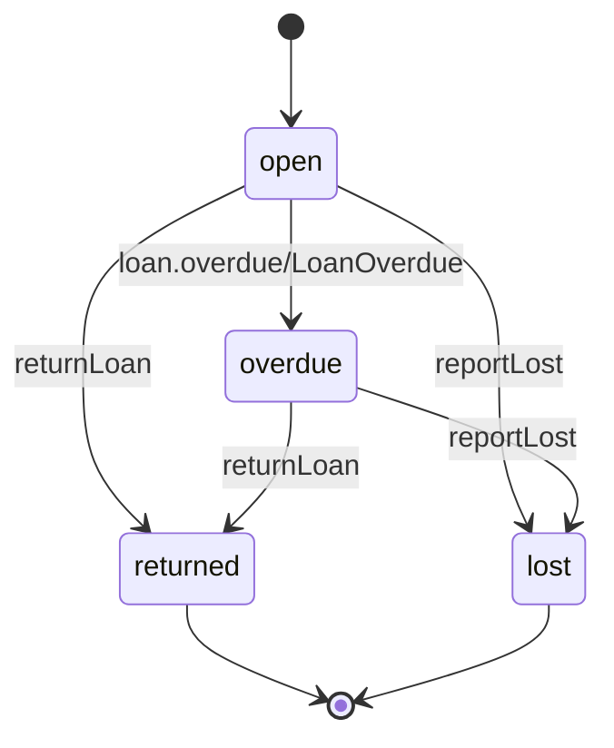

<!-- Generated by specarch document testplan from ../spec/specarch.yaml, version 0.1.0, and ../spec/implementation/go/library-lending.go.specarch-implementation.yaml, version 0.1.0, and ../spec/implementation/typescript/library-lending-acme.typescript.specarch-implementation.yaml, version 0.1.0, and ../spec/implementation/typescript/library-lending.typescript.specarch-implementation.yaml, version 0.1.0; meta-model 0.1. Do not edit this file: change the YAML and generate again. -->

# Library Lending: test plan

Version 0.1.0 of the specification: 182 design tests, 54 golden and 127 red, about 47 subjects. Golden tests show a path that succeeds, red tests a path that is refused. The test cases follow the test case specification of ISO/IEC/IEEE 29119-3.

1 test is marked not applicable, with the reason.

## 1. Levels and how the tests run

| Level | Design tests |
|---|---|
| acceptance | 9 |
| system | 173 |

System and acceptance tests are design tests, written in the specification and run by every implementation. Unit and integration tests belong to one implementation and are listed with it below.

## 2. Test cases

### Operation approveFeeWaiver

#### approve-fee-waiver

Scenario: golden; level: system; verifies LIB-8.

- Given: a desk supervisor, and a request by another librarian to waive a fee of 3.50, waiting at approve
- When: approveFeeWaiver is called for it
- Then: it answers 200, the request is approved, and the loan's late fee is 0.00

#### approve-fee-waiver-denied

Scenario: red; level: system; covers denied without fees.approve, denied with expired session.

- Given: a librarian, who does not hold fees.approve, a desk supervisor whose session expired, and a waiting request
- When: each calls approveFeeWaiver for it
- Then: the first is refused as not allowed and the second as not signed in, and the request still waits

#### approve-fee-waiver-unknown-waiver

Scenario: red; level: system; covers waiverId not a valid uuid, not found waiverId.

- Given: a desk supervisor and no request with a given id
- When: approveFeeWaiver is called with waiverId abc, and with that id
- Then: the first is refused as invalid input and the second as not found

### Book constraint book_available_within_owned

#### book-available-above-owned

Scenario: red; level: system; covers violates book_available_within_owned.

- Given: a book with 2 copies owned
- When: it is saved with 3 available
- Then: it is refused

#### book-available-at-most-owned

Scenario: golden; level: system.

- Given: a book with 2 copies owned
- When: it is saved with 2 available
- Then: it is saved

### Book constraint book_isbn_unique

#### book-isbn-once

Scenario: golden; level: system.

- Given: no book with ISBN 9780000000001
- When: a book with that ISBN is saved
- Then: it is saved

#### book-isbn-twice

Scenario: red; level: system; covers duplicate book_isbn_unique.

- Given: a book with ISBN 9780000000001
- When: another book with that ISBN is saved
- Then: it is refused

### Operation listBooks

#### browse-catalogue

Scenario: golden; level: system; covers q of 200 characters; verifies LIB-2.

- Given: three books by two authors, and a visitor without a card
- When: listBooks is called with q set to one author's name, and again with a 200-character q
- Then: the first call answers that author's books, the second an empty list

#### browse-catalogue-query-too-long

Scenario: red; level: system; covers q longer than 200 characters.

- Given: a visitor
- When: listBooks is called with a 201-character q
- Then: it is refused as invalid input

### Operation confirmSecondFactor

#### confirm-second-factor-bad-code

Scenario: red; level: system; covers missing code, code not matching its pattern.

- Given: a sign-in challenge signIn opened a minute ago
- When: confirmSecondFactor is called without code and again with a code of five digits
- Then: both are refused as invalid input, and the challenge stays open

#### confirm-second-factor-refused

Scenario: red; level: system; covers response 401.

- Given: a sign-in challenge signIn opened six minutes ago
- When: confirmSecondFactor is called with the code the authenticator app shows now
- Then: it answers 401 with the problem second-factor-refused, and no session starts

#### confirm-second-factor-succeeds

Scenario: golden; level: system.

- Given: a sign-in challenge signIn opened a minute ago
- When: confirmSecondFactor is called with the code the authenticator app shows now
- Then: it answers 200 and the session starts

### Operation createLoan

#### create-loan-denied-with-expired-session

Scenario: red; level: system; covers denied with expired session.

- Given: a librarian whose session expired after half an hour without a request
- When: createLoan is called for a member and a book that exist
- Then: it is refused as not signed in, and nothing changes

#### create-loan-expired-member-id

Scenario: red; level: system; covers expired memberId.

- Given: a member whose membershipEndsOn was yesterday, and a book with a copy available
- When: createLoan is called for them
- Then: it is refused as expired and no loan is created

#### create-loan-idempotency-key-not-a-valid-uuid

Scenario: red; level: system; covers Idempotency-Key not a valid uuid.

- Given: a member and a book that exist
- When: createLoan is called with an Idempotency-Key that is not a UUID
- Then: it is refused and no loan is created

#### create-loan-idempotency-key-reused-for-another-request

Scenario: red; level: system; covers Idempotency-Key reused for another request.

- Given: a loan was created under an Idempotency-Key
- When: createLoan is called with the same Idempotency-Key for another book
- Then: it is refused and no loan is created

#### create-loan-not-yet-valid-member-id

Scenario: red; level: system; covers not yet valid memberId.

- Given: a member registered with a joinedOn of tomorrow, and a book with a copy available
- When: createLoan is called for them
- Then: it is refused as not yet valid and no loan is created

#### create-loan-rate-exceeded

Scenario: red; level: system; covers rate exceeded; verifies LIB-3.

- Given: a librarian who has made 60 lending requests within the last minute, the burst the rate of 30 a minute allows
- When: createLoan is called once more within that minute
- Then: it is refused as too many requests and no loan is created

**Origin:** inferred.

**Insight:** Derived from the rate on createLoan, then completed by hand; lending runs at the desk, so a burst well above the rate covers a busy morning.

#### create-loan-repeated-with-the-same-idempotency-key

Scenario: golden; level: system; covers repeated with the same Idempotency-Key; verifies LIB-3.

- Given: a loan was created for a member and a book under an Idempotency-Key, and the client never saw the answer
- When: createLoan is called again with the same Idempotency-Key, member and book
- Then: it answers 201 with the loan already created, no second loan exists, and the book's copies available are unchanged

#### create-loan-request-larger-than-1024-bytes

Scenario: red; level: system; covers request larger than 1024 bytes; verifies LIB-3.

- Given: a librarian at the desk
- When: createLoan is called with a body larger than 1024 bytes
- Then: it is refused as too large and no loan is created

**Origin:** inferred.

**Insight:** Derived from the body limit on createLoan, then completed by hand; a lending request holds two ids, so anything near the limit is not a lending request.

#### lend-a-copy

Scenario: golden; level: system; verifies LIB-3.

- Given: a standard-tier member with no loans and no fees, and a book with one copy available
- When: createLoan is called for them
- Then: an open loan due in 21 days is created, the book has no copy available, and LoanCreated is published

#### lend-bad-dates

Scenario: red; level: system; covers lentOn not a valid date, dueOn not a valid date.

- Given: a librarian, a member and a book with a copy available
- When: createLoan is called with lentOn 2026-02-30 and again with dueOn 28/10/2026
- Then: both are refused as invalid input

#### lend-bad-ids

Scenario: red; level: system; covers memberId not a valid uuid, bookId not a valid uuid.

- Given: a librarian
- When: createLoan is called with memberId abc and again with bookId abc
- Then: both are refused as invalid input

#### lend-denied

Scenario: red; level: system; covers denied without loans.create.

- Given: a caller holding only the member role
- When: createLoan is called
- Then: it is refused as not allowed

#### lend-event-not-delivered

Scenario: red; level: system; covers dependency fails loan.lifecycle.

- Given: the loan.lifecycle channel is unavailable
- When: createLoan is called
- Then: no loan is created and the call fails, so a loan never exists without its event

#### lend-limit-reached

Scenario: red; level: system; covers response 409; verifies LIB-3.

- Given: a standard-tier member with three open loans
- When: createLoan is called for a fourth book
- Then: it answers 409 and no loan is created

#### lend-missing-field

Scenario: red; level: system; covers missing memberId, missing bookId, missing lentOn, missing dueOn.

- Given: a librarian
- When: createLoan is called without each of memberId, bookId, lentOn and dueOn in turn
- Then: each is refused as invalid input

#### lend-unknown-member-or-book

Scenario: red; level: system; covers not found memberId, not found bookId.

- Given: a librarian
- When: createLoan is called with a memberId and then a bookId that no record has
- Then: both are refused as not found

### Operation createMember

#### create-member-denied-with-expired-session

Scenario: red; level: system; covers denied with expired session.

- Given: a librarian whose session expired after half an hour without a request
- When: createMember is called
- Then: it is refused as not signed in, and nothing changes

#### register-member

Scenario: golden; level: system; covers fullName of 1 character, fullName of 200 characters; verifies LIB-1.

- Given: a librarian
- When: createMember is called for a standard-tier member with a one-letter name, and again with a 200-character name
- Then: both members are created, each with a new eight-digit card number and no fees

#### register-member-bad-values

Scenario: red; level: system; covers email not a valid email, tier not one of its values.

- Given: a librarian
- When: createMember is called with email set to 'not-an-address', and with tier set to gold
- Then: both are refused as invalid input

#### register-member-card-number-clash

Scenario: red; level: system; covers duplicate member_card_number_unique.

Not applicable: The card number is assigned by the system, never sent by a client, so a request cannot clash on it. The constraint itself is tested under member-card-number-twice.

#### register-member-denied

Scenario: red; level: system; covers denied without members.write.

- Given: a caller holding only the member role
- When: createMember is called
- Then: it is refused as not allowed

#### register-member-email-taken

Scenario: red; level: system; covers duplicate member_email_unique, response 409; verifies LIB-1.

- Given: a member registered with ana@example.org
- When: createMember is called with the same email address
- Then: it answers 409 and no member is created

#### register-member-missing-field

Scenario: red; level: system; covers missing fullName, missing email, missing tier.

- Given: a librarian
- When: createMember is called three times each time without one of fullName and email and tier
- Then: each call is refused as invalid input

#### register-member-missing-part

Scenario: red; level: system; covers missing address.street, missing address.city, missing phones.number.

- Given: a librarian
- When: createMember is called with an address without its street, then without its city, and with a phone number without its number
- Then: each is refused as invalid input, naming the part

#### register-member-name-length

Scenario: red; level: system; covers fullName shorter than 1 character, fullName longer than 200 characters.

- Given: a librarian
- When: createMember is called with an empty fullName and with a 201-character one
- Then: both are refused as invalid input

### Operation deactivateMember

#### deactivate-member

Scenario: golden; level: system.

- Given: a librarian and an active member
- When: deactivateMember is called for that member with the reason "Moved away."
- Then: it answers 200 with the member inactive, and the reason is kept with the record

#### deactivate-member-bad-input

Scenario: red; level: system; covers memberId not a valid uuid, missing reason.

- Given: a librarian
- When: deactivateMember is called with memberId abc, and again for an active member without a reason
- Then: each call is refused as invalid input, and the member stays active

#### deactivate-member-denied

Scenario: red; level: system; covers denied without members.write.

- Given: a caller holding only the member role
- When: deactivateMember is called
- Then: it is refused as not allowed, and the member stays active

#### deactivate-member-denied-with-expired-session

Scenario: red; level: system; covers denied with expired session.

- Given: a librarian whose session expired after half an hour without a request
- When: deactivateMember is called for an active member
- Then: it is refused as not signed in, and nothing changes

#### deactivate-member-not-found

Scenario: red; level: system; covers not found memberId, response 404.

- Given: a librarian and no member with a given id
- When: deactivateMember is called with that id
- Then: it answers 404

### Workflow fee-waiver

#### fee-waiver

Scenario: golden; level: acceptance; verifies LIB-8.

- Given: a librarian, a desk supervisor, and a loan with a late fee of 3.50
- When: the librarian asks for the fee to be waived and the desk supervisor approves the request
- Then: requestFeeWaiver answers 202, waiveFee is called once, the late fee is 0.00, and the request ends approved

#### fee-waiver-approval-without-permission

Scenario: red; level: acceptance; covers approval without fees.approve; verifies LIB-8.

- Given: a request to waive a fee, and a second librarian, who does not hold fees.approve
- When: the second librarian approves it
- Then: it is refused as not allowed, and the request still waits for a desk supervisor

#### fee-waiver-deadline-passes

Scenario: red; level: acceptance; covers deadline passes at approve; verifies LIB-8.

- Given: a request to waive a fee, waiting for a desk supervisor
- When: three days pass with no answer
- Then: the request ends refused, waiveFee is not called, and the fee still stands

**Origin:** inferred.

**Insight:** Drafted by specarch derive, since a deadline passing is a case nobody tries by hand, then completed by hand; a request must not wait for ever.

#### fee-waiver-refused

Scenario: red; level: acceptance; covers refused at approve; verifies LIB-8.

- Given: a request to waive a fee of 3.50, waiting for a desk supervisor
- When: the desk supervisor refuses it
- Then: the request ends refused, waiveFee is not called, and the fee still stands

#### fee-waiver-requester-approves-own-request

Scenario: red; level: acceptance; covers requester approves own request; verifies LIB-8.

- Given: a desk supervisor who also works the desk and holds fees.request, and a request to waive a fee they asked for themselves
- When: they approve their own request
- Then: it is refused, the request still waits for another desk supervisor, and waiveFee is not called

**Origin:** inferred.

**Insight:** Drafted by specarch derive, since the four-eyes rule holds on every approval, then completed by hand; it is the one case the workflow exists for.

### Page fee-waiver-form

#### fee-waiver-form-denied-with-expired-session

Scenario: red; level: system; covers denied with expired session; verifies LIB-8.

- Given: a librarian whose session has expired
- When: the page fee-waiver-form is opened
- Then: it is refused as not signed in

#### fee-waiver-form-denied-without-fees-request

Scenario: red; level: system; covers denied without fees.request; verifies LIB-8.

- Given: a desk supervisor, who holds fees.approve and not fees.request
- When: the page fee-waiver-form is opened
- Then: it is not shown

#### fee-waiver-form-not-found-loan-id

Scenario: red; level: system; covers not found loanId; verifies LIB-8.

- Given: a librarian, and no loan with the id in the route
- When: the page fee-waiver-form is opened for that id
- Then: it says the loan was not found

#### fee-waiver-form-sent-for-approval

Scenario: golden; level: system; covers sent for approval; verifies LIB-8.

- Given: a librarian, and a loan with a late fee of 3.50
- When: the form is filled in with amount 3.50 and the reason "The book drop was closed for repairs." and sent
- Then: requestFeeWaiver answers 202, the page leads to loans-list and says "Sent for approval. A desk supervisor answers within three days.", and the fee still stands

#### fee-waiver-form-succeeds

Scenario: golden; level: system; verifies LIB-8.

- Given: a librarian, and a loan with a late fee of 3.50
- When: the page fee-waiver-form is opened for that loan
- Then: it shows the amount and the reason to fill in

### Page fee-waivers-inbox

#### fee-waivers-inbox-denied-with-expired-session

Scenario: red; level: system; covers denied with expired session; verifies LIB-8.

- Given: a desk supervisor whose session has expired
- When: the page fee-waivers-inbox is opened
- Then: it is refused as not signed in

#### fee-waivers-inbox-denied-without-fees-approve

Scenario: red; level: system; covers denied without fees.approve; verifies LIB-8.

- Given: a librarian, who asked for a waiting request and does not hold fees.approve
- When: the page fee-waivers-inbox is opened
- Then: it is not shown, so the librarian sees no request to approve, their own included

#### fee-waivers-inbox-refuse

Scenario: red; level: system; covers Refuse without a reason.

- Given: a desk supervisor and a waiting request by another librarian
- When: the page fee-waivers-inbox is opened, and Refuse is confirmed for the request with no reason
- Then: it sends nothing until a reason is given, and the request still waits

#### fee-waivers-inbox-succeeds

Scenario: golden; level: system; verifies LIB-8.

- Given: a desk supervisor, and two requests to waive a late fee waiting at approve
- When: the page fee-waivers-inbox is opened
- Then: it lists both requests with their loan, amount and reason

### Requirement LIB-3

#### fees-block-lending

Scenario: golden; level: acceptance; covers acceptance 2; verifies LIB-3.

- Given: a member who owes a late fee
- When: the librarian lends them a copy
- Then: A member with outstanding fees is refused a loan with 409.

#### lending-limit-accepted

Scenario: golden; level: acceptance; covers acceptance 1; verifies LIB-3.

- Given: a standard-tier member with three open loans
- When: the librarian lends them a fourth copy
- Then: A standard-tier member with three open loans is refused a fourth with 409.

### Operation getMember

#### get-member-denied-with-expired-session

Scenario: red; level: system; covers denied with expired session.

- Given: a librarian whose session expired after half an hour without a request
- When: getMember is called for a member that exists
- Then: it is refused as not signed in, and nothing changes

#### show-member

Scenario: golden; level: system.

- Given: a member and a librarian
- When: getMember is called with the member's id
- Then: the member is answered

#### show-member-bad-id

Scenario: red; level: system; covers memberId not a valid uuid.

- Given: a librarian
- When: getMember is called with memberId abc
- Then: it is refused as invalid input

#### show-member-denied

Scenario: red; level: system; covers denied without members.read.

- Given: a caller holding only the member role
- When: getMember is called
- Then: it is refused as not allowed

#### show-member-not-found

Scenario: red; level: system; covers not found memberId, response 404.

- Given: a librarian and no member with a given id
- When: getMember is called with that id
- Then: it answers 404

### Operation getSession

#### get-session-expired

Scenario: red; level: system.

- Given: a librarian whose session ended half an hour after their last request
- When: getSession is called
- Then: it answers 200, signed out, with no permission, and the session stays ended

#### get-session-signed-in

Scenario: golden; level: system.

- Given: a librarian signed in a minute ago, whose role grants members.read and loans.read
- When: getSession is called
- Then: it answers 200, signed in, with members.read and loans.read

### Other

#### lend-a-copy-at-the-desk

Scenario: golden; level: acceptance; verifies LIB-7.

- Given: a librarian at the desk, and a member with no loans and no fees
- When: the librarian selects the member in the members list, chooses Lend a book on their record, and submits the loan form for an available copy
- Then: the member's record opens again with the new loan and the message that the copy is lent

**Origin:** inferred.

**Insight:** Drafted from the flow's success path and completed by hand; the desk task of LIB-7 is this flow.

#### lend-a-copy-limit-reached

Scenario: red; level: acceptance; verifies LIB-7.

- Given: a librarian at the desk, and a member who has reached the loan limit of their tier
- When: the librarian goes through the flow and submits the loan form
- Then: the form stays open and says the loan is refused, and no loan is recorded

**Origin:** inferred.

**Insight:** The flow's last step calls createLoan, whose refusal lending-refused is the failure a librarian meets most at the desk.

### Operation lendCopies

#### lend-copies

Scenario: golden; level: system; verifies LIB-3.

- Given: an extended-tier member with two open loans and no fees, and two books with a copy available each
- When: lendCopies is called for both books
- Then: two open loans are created, each due on the date the member's tier sets

#### lend-copies-bad-loans

Scenario: red; level: system; covers missing loans, loans with fewer than 1 items, loans with more than 6 items.

- Given: a librarian
- When: lendCopies is called without loans, with no loan, and with seven
- Then: each is refused as invalid input, and no loan is created

#### lend-copies-bad-member-id

Scenario: red; level: system; covers memberId not a valid uuid.

- Given: a librarian
- When: lendCopies is called with memberId abc
- Then: it is refused as invalid input

#### lend-copies-denied

Scenario: red; level: system; covers denied without loans.create.

- Given: a caller holding only the member role
- When: lendCopies is called
- Then: it is refused as not allowed

#### lend-copies-denied-with-expired-session

Scenario: red; level: system; covers denied with expired session.

- Given: a librarian whose session expired after half an hour without a request
- When: lendCopies is called for a member and a book that exist
- Then: it is refused as not signed in, and nothing changes

#### lend-copies-idempotency-key-not-a-valid-uuid

Scenario: red; level: system; covers Idempotency-Key not a valid uuid.

- Given: a member and two books that exist
- When: lendCopies is called with an Idempotency-Key that is not a UUID
- Then: it is refused and no loan is created

#### lend-copies-idempotency-key-reused-for-another-request

Scenario: red; level: system; covers Idempotency-Key reused for another request.

- Given: loans were lent to a member under an Idempotency-Key
- When: lendCopies is called with the same Idempotency-Key for other books
- Then: it is refused and no loan is created

#### lend-copies-limit-reached

Scenario: red; level: system; covers response 409; verifies LIB-3.

- Given: a standard-tier member with two open loans
- When: lendCopies is called for two more books
- Then: it answers 409 and neither loan is created

#### lend-copies-repeated-with-the-same-idempotency-key

Scenario: golden; level: system; covers repeated with the same Idempotency-Key; verifies LIB-3.

- Given: two loans were lent to a member under an Idempotency-Key, and the client never saw the answer
- When: lendCopies is called again with the same Idempotency-Key, member and books
- Then: it answers 201 with the loans already created, no further loan exists, and the books' copies available are unchanged

#### lend-copies-unknown-member

Scenario: red; level: system; covers not found memberId, response 404.

- Given: a librarian
- When: lendCopies is called with a memberId no member has
- Then: it answers 404 and no loan is created

### Operation listFeeWaivers

#### list-fee-waivers-denied-with-expired-session

Scenario: red; level: system; covers denied with expired session; verifies LIB-8.

- Given: a desk supervisor whose session has expired
- When: listFeeWaivers is called
- Then: it is refused as not signed in

#### list-fee-waivers-denied-without-fees-approve

Scenario: red; level: system; covers denied without fees.approve; verifies LIB-8.

- Given: a librarian, who does not hold fees.approve
- When: listFeeWaivers is called
- Then: it is refused as not allowed

#### list-fee-waivers-succeeds

Scenario: golden; level: system; verifies LIB-8.

- Given: a desk supervisor, and one request waiting at approve
- When: listFeeWaivers is called
- Then: it answers 200 with that request

### Operation listLoans

#### list-loans

Scenario: golden; level: system.

- Given: an open loan and a returned loan
- When: listLoans is called with status open
- Then: only the open loan is answered

#### list-loans-bad-filter

Scenario: red; level: system; covers status not one of its values, memberId not a valid uuid.

- Given: a librarian
- When: listLoans is called with status lent and again with memberId abc
- Then: both are refused as invalid input

#### list-loans-denied

Scenario: red; level: system; covers denied without loans.read.

- Given: a caller holding no role
- When: listLoans is called
- Then: it is refused as not allowed

#### list-loans-denied-with-expired-session

Scenario: red; level: system; covers denied with expired session.

- Given: a librarian whose session expired after half an hour without a request
- When: listLoans is called
- Then: it is refused as not signed in, and nothing changes

### Operation listMembers

#### list-members

Scenario: golden; level: system.

- Given: two members and a librarian
- When: listMembers is called
- Then: both members are answered

#### list-members-bad-tier

Scenario: red; level: system; covers tier not one of its values.

- Given: a librarian
- When: listMembers is called with the tier gold-plus, which is not a membership tier
- Then: it is refused as invalid input

#### list-members-denied

Scenario: red; level: system; covers denied without members.read.

- Given: a caller holding only the member role
- When: listMembers is called
- Then: it is refused as not allowed

#### list-members-denied-with-expired-session

Scenario: red; level: system; covers denied with expired session.

- Given: a librarian whose session expired after half an hour without a request
- When: listMembers is called
- Then: it is refused as not signed in, and nothing changes

### Loan open to overdue

#### loan-becomes-overdue

Scenario: golden; level: system; verifies LIB-4.

- Given: an open loan due yesterday
- When: the nightly job runs
- Then: the loan is overdue and LoanOverdue is published

#### loan-overdue-only-from-open

Scenario: red; level: system; covers from wrong state.

- Given: a returned loan due last week
- When: the nightly job runs
- Then: the loan stays returned

### Loan constraint loan_due_after_lent

#### loan-due-after-lent

Scenario: golden; level: system.

- Given: a copy lent on 2026-10-07
- When: it is saved due on 2026-10-28
- Then: it is saved

#### loan-due-on-lent-day

Scenario: red; level: system; covers violates loan_due_after_lent.

- Given: a copy lent on 2026-10-07
- When: it is saved due on 2026-10-07
- Then: it is refused

### Page loan-form

#### loan-form-denied

Scenario: red; level: system; covers denied without loans.create.

- Given: a caller holding only the member role
- When: the page loan-form is opened
- Then: it is not shown

#### loan-form-denied-with-expired-session

Scenario: red; level: system; covers denied with expired session.

- Given: a librarian whose session expired after half an hour without a request
- When: the page loan-form is opened
- Then: it is not shown, and the sign-in page is shown instead

#### loan-form-due-before-lent

Scenario: red; level: system; covers violates due-after-lent.

- Given: a librarian, a member and a book with a copy available
- When: the form is submitted lent on 2026-10-09 and due on 2026-10-09
- Then: it is not sent, and says beside the due day: A copy is due after the day it is lent.

#### loan-form-picks-nothing

Scenario: red; level: system; covers picker memberId finds nothing, picker bookId finds nothing.

- Given: a librarian, and no member or book matching what is typed
- When: a member and then a book are looked for on the page loan-form
- Then: each picker says nothing matches, and the field stays empty

#### loan-form-shown

Scenario: golden; level: system.

- Given: a librarian
- When: the page loan-form is filled in and sent
- Then: the copy is lent

### Loan constraint loan_lent_by_recording

#### loan-lent-after-recorded

Scenario: red; level: system; covers violates loan_lent_by_recording.

- Given: a loan recorded at 2026-10-09T09:00:00Z
- When: it is saved lent on 2026-10-10
- Then: it is refused

#### loan-lent-before-recorded

Scenario: golden; level: system.

- Given: a loan recorded at 2026-10-09T09:00:00Z
- When: it is saved lent on 2026-10-07, a day the system was down
- Then: it is saved

### Loan state machine

#### loan-lent-and-returned

Scenario: golden; level: system; covers open to returned; verifies LIB-5.

- Given: a Loan that is open
- When: returnLoan happens before the due date
- Then: the Loan ends returned, with no late fee

### Loan constraint loan_returned_after_loaned

#### loan-returned-after-loaned

Scenario: golden; level: system.

- Given: a loan made at 2026-10-07T10:00:00Z
- When: it is saved returned at 2026-10-08T10:00:00Z
- Then: it is saved

#### loan-returned-before-loaned

Scenario: red; level: system; covers violates loan_returned_after_loaned.

- Given: a loan made at 2026-10-07T10:00:00Z
- When: it is saved returned at 2026-10-06T10:00:00Z
- Then: it is refused

### Loan open to returned

#### loan-returned-on-time

Scenario: golden; level: system.

- Given: an open loan
- When: returnLoan is called
- Then: the loan is returned with no fee

#### loan-returned-only-when-out

Scenario: red; level: system; covers from wrong state.

- Given: a lost loan
- When: returnLoan is called
- Then: it is refused and the loan stays lost

### Page loans-list

#### loans-list-denied

Scenario: red; level: system; covers denied without loans.read.

- Given: a caller holding no role
- When: the page loans-list is opened
- Then: it is not shown

#### loans-list-denied-with-expired-session

Scenario: red; level: system; covers denied with expired session.

- Given: a librarian whose session expired after half an hour without a request
- When: the page loans-list is opened
- Then: it is not shown, and the sign-in page is shown instead

#### loans-list-shown

Scenario: golden; level: system.

- Given: a librarian and some loans
- When: the page loans-list is opened
- Then: it lists the loans with their due dates, states and fees

### Job markOverdue

#### mark-overdue-runs-twice

Scenario: golden; level: system; covers runs twice; verifies LIB-4.

- Given: the job markOverdue has run and marked a loan overdue
- When: it runs again the same night
- Then: the loan stays overdue, and no second LoanOverdue is published for it

**Origin:** inferred.

**Insight:** Drafted by specarch derive, since a job that runs twice is a case nobody tries by hand, then completed by hand; a member must not be told twice.

#### mark-overdue-succeeds

Scenario: golden; level: system; verifies LIB-4.

- Given: an open loan whose due date was yesterday, and an open loan due today
- When: the job markOverdue runs
- Then: the loan due yesterday is overdue and LoanOverdue is published for it; the loan due today stays open

**Origin:** inferred.

**Insight:** Drafted by specarch derive from the job's success path, then completed by hand from the acceptance criterion of LIB-4; the loan due today shows the job does not run a day early.

### Member constraint member_card_number_unique

#### member-card-number-once

Scenario: golden; level: system.

- Given: no member with card number 00000001
- When: a member with that card number is saved
- Then: it is saved

#### member-card-number-twice

Scenario: red; level: system; covers duplicate member_card_number_unique.

- Given: a member with card number 00000001
- When: another member with that card number is saved
- Then: it is refused

### Member constraint member_email_unique

#### member-email-once

Scenario: golden; level: system.

- Given: no member with ana@example.org
- When: a member with that address is saved
- Then: it is saved

#### member-email-twice

Scenario: red; level: system; covers duplicate member_email_unique.

- Given: a member with ana@example.org
- When: another member with that address is saved
- Then: it is refused

### Page member-form

#### member-form-denied

Scenario: red; level: system; covers denied without members.write.

- Given: a caller holding only the member role
- When: the page member-form is opened
- Then: it is not shown

#### member-form-denied-with-expired-session

Scenario: red; level: system; covers denied with expired session.

- Given: a librarian whose session expired after half an hour without a request
- When: the page member-form is opened
- Then: it is not shown, and the sign-in page is shown instead

#### member-form-shown

Scenario: golden; level: system.

- Given: a librarian
- When: the page member-form is filled in and sent
- Then: the member is registered

### Page member-loans

#### member-loans-denied

Scenario: red; level: system; covers denied without loans.create.

- Given: a caller holding only the member role
- When: the page member-loans is opened
- Then: it is refused as not allowed

#### member-loans-denied-with-expired-session

Scenario: red; level: system; covers denied with expired session.

- Given: a librarian whose session expired after half an hour without a request
- When: the page member-loans is opened
- Then: it is refused as not signed in

#### member-loans-not-found

Scenario: red; level: system; covers not found memberId, fails with member-not-found.

- Given: a librarian
- When: the page member-loans is opened for an id no member has
- Then: it shows: There is no member with this card.

#### member-loans-refused

Scenario: red; level: system; covers fails with lending-refused; verifies LIB-3.

- Given: a librarian, and a member with outstanding fees
- When: a row is added and the form is submitted
- Then: it shows: This member cannot borrow these copies now: the loan limit is reached, fees are outstanding, or a copy is not available.

#### member-loans-shown

Scenario: golden; level: system; verifies LIB-3.

- Given: a librarian, and a member with two open loans
- When: the page member-loans is opened for that member
- Then: it shows the two loans, which cannot be changed, and a row to add a copy

#### member-loans-six-rows

Scenario: red; level: system; covers loans with more than 6 rows; verifies LIB-3.

- Given: a librarian, and a member with four loans loaded and two rows added
- When: a seventh row of loans is added
- Then: it is refused: the form holds at most 6 rows of loans

### Page member-view

#### member-view-deactivate

Scenario: red; level: system; covers Deactivate without a reason.

- Given: a librarian and an active member
- When: the page member-view is opened for the member, and Deactivate is confirmed with no reason
- Then: it sends nothing until a reason is given, and the member stays active

#### member-view-denied

Scenario: red; level: system; covers denied without members.read.

- Given: a caller holding only the member role
- When: the page member-view is opened
- Then: it is not shown

#### member-view-denied-with-expired-session

Scenario: red; level: system; covers denied with expired session.

- Given: a librarian whose session expired after half an hour without a request
- When: the page member-view is opened
- Then: it is not shown, and the sign-in page is shown instead

#### member-view-not-found

Scenario: red; level: system; covers not found memberId.

- Given: a librarian
- When: the page member-view is opened for an id no member has
- Then: it says the member was not found

#### member-view-shown

Scenario: golden; level: system.

- Given: a librarian and a member
- When: the page member-view is opened for that member
- Then: it shows the member and offers Lend a book

### Page members-list

#### members-list-deactivate

Scenario: red; level: system; covers Deactivate not offered, Deactivate without a reason.

- Given: a librarian, an active member and an inactive member
- When: the page members-list is opened, and Deactivate is confirmed for the active member with no reason
- Then: it offers Deactivate for the active member only, and sends nothing until a reason is given

#### members-list-denied

Scenario: red; level: system; covers denied without members.read.

- Given: a caller holding only the member role
- When: the page members-list is opened
- Then: it is not shown

#### members-list-denied-with-expired-session

Scenario: red; level: system; covers denied with expired session.

- Given: a librarian whose session expired after half an hour without a request
- When: the page members-list is opened
- Then: it is not shown, and the sign-in page is shown instead

#### members-list-shown

Scenario: golden; level: system.

- Given: a librarian
- When: the page members-list is opened
- Then: it lists members with card number, name, email, tier and fees

### Loan open to lost

#### open-loan-lost

Scenario: golden; level: system.

- Given: an open loan
- When: reportLost is called
- Then: the loan is lost and the replacement cost is charged

#### open-loan-lost-after-return

Scenario: red; level: system; covers from wrong state.

- Given: a returned loan
- When: reportLost is called
- Then: it is refused and the loan stays returned

### Loan overdue to lost

#### overdue-loan-lost

Scenario: golden; level: system.

- Given: an overdue loan
- When: reportLost is called
- Then: the loan is lost and the replacement cost is charged

#### overdue-loan-lost-twice

Scenario: red; level: system; covers from wrong state.

- Given: a loan already lost
- When: reportLost is called again
- Then: it is refused and nothing is charged twice

### Loan overdue to returned

#### overdue-loan-returned

Scenario: golden; level: system.

- Given: an overdue loan
- When: returnLoan is called
- Then: the loan is returned with its late fee

#### overdue-loan-returned-twice

Scenario: red; level: system; covers from wrong state.

- Given: a loan already returned
- When: returnLoan is called again
- Then: it is refused and the fee is not charged twice

### Operation refuseFeeWaiver

#### refuse-fee-waiver

Scenario: golden; level: system; verifies LIB-8.

- Given: a desk supervisor, and a request by another librarian to waive a fee of 3.50, waiting at approve
- When: refuseFeeWaiver is called for it with the reason "The book came back damaged."
- Then: it answers 200, the request ends refused with that reason, and the fee still stands

#### refuse-fee-waiver-bad-input

Scenario: red; level: system; covers waiverId not a valid uuid, not found waiverId, missing reason.

- Given: a desk supervisor, a waiting request, and no request with a given id
- When: refuseFeeWaiver is called with waiverId abc, with that id, and for the waiting request without a reason
- Then: the first and the last are refused as invalid input and the second as not found, and the request still waits

#### refuse-fee-waiver-denied

Scenario: red; level: system; covers denied without fees.approve, denied with expired session.

- Given: a librarian, who does not hold fees.approve, a desk supervisor whose session expired, and a waiting request
- When: each calls refuseFeeWaiver for it with a reason
- Then: the first is refused as not allowed and the second as not signed in, and the request still waits

### Operation reportLost

#### report-lost

Scenario: golden; level: system.

- Given: an open loan of a book whose replacement cost is 25.00
- When: reportLost is called
- Then: the loan is lost and 25.00 is added to the member's outstanding fees

#### report-lost-already-closed

Scenario: red; level: system; covers response 409.

- Given: a loan already lost
- When: reportLost is called on it
- Then: it answers 409 and nothing is charged twice

#### report-lost-concurrent-write

Scenario: red; level: system; covers concurrent write.

- Given: an open loan that a second librarian closed after the first librarian's screen showed it open
- When: reportLost is called by the first librarian for it
- Then: it is refused, the loan stays as the second librarian left it, and no second fee is charged

#### report-lost-denied

Scenario: red; level: system; covers denied without loans.return.

- Given: a caller holding only the member role
- When: reportLost is called
- Then: it is refused as not allowed

#### report-lost-denied-with-expired-session

Scenario: red; level: system; covers denied with expired session.

- Given: a librarian whose session expired after half an hour without a request
- When: reportLost is called for an open loan
- Then: it is refused as not signed in, and nothing changes

#### report-lost-dependency-fails-fee-ledger

Scenario: red; level: system; covers dependency fails feeLedger.

- Given: an open loan, and a fee ledger that answers every call with an error
- When: reportLost is called for it
- Then: it answers 503, the loan stays open, and no event is published

#### report-lost-dependency-times-out-fee-ledger

Scenario: red; level: system; covers dependency times out feeLedger.

- Given: an open loan, and a fee ledger that does not answer within 5 seconds
- When: reportLost is called for it
- Then: it gives up the call, answers 503, the loan stays open, and no event is published

#### report-lost-event-not-delivered

Scenario: red; level: system; covers dependency fails loan.lifecycle.

- Given: the loan.lifecycle channel is unavailable
- When: reportLost is called
- Then: the loan stays open, nothing is charged, and the call fails

#### report-lost-unknown-loan

Scenario: red; level: system; covers not found loanId, loanId not a valid uuid.

- Given: a librarian
- When: reportLost is called with an id no loan has and again with abc
- Then: the first is refused as not found and the second as invalid input

### Operation requestFeeWaiver

#### request-fee-waiver

Scenario: golden; level: system; verifies LIB-8.

- Given: a librarian, and a loan returned seven days late with a late fee of 3.50
- When: requestFeeWaiver is called for it with amount 3.50 and the reason "The book drop was closed for repairs."
- Then: it answers 202 with the request, which waits for a desk supervisor, and the fee still stands

#### request-fee-waiver-bad-input

Scenario: red; level: system; covers missing amount, missing reason, amount not a valid decimal, loanId not a valid uuid.

- Given: a librarian
- When: requestFeeWaiver is called without amount, without reason, with amount three, and for loanId abc
- Then: each is refused as invalid input, and no request is made

#### request-fee-waiver-denied

Scenario: red; level: system; covers denied without fees.request.

- Given: a member, who does not hold fees.request
- When: requestFeeWaiver is called for one of their own loans
- Then: it is refused as not allowed, and no request is made

#### request-fee-waiver-denied-with-expired-session

Scenario: red; level: system; covers denied with expired session.

- Given: a librarian whose session expired after half an hour without a request
- When: requestFeeWaiver is called
- Then: it is refused as not signed in, and no request is made

#### request-fee-waiver-unknown-loan

Scenario: red; level: system; covers not found loanId.

- Given: a librarian and no loan with a given id
- When: requestFeeWaiver is called for that id
- Then: it is refused as not found, and no request is made

### Operation resetPassword

#### reset-password-missing-field

Scenario: red; level: system; covers missing code, missing newPassword, missing confirmPassword.

- Given: any caller
- When: resetPassword is called without code, again without newPassword and again without confirmPassword
- Then: each is refused as invalid input

#### reset-password-refused

Scenario: red; level: system; covers response 409.

- Given: a reset code that was used before
- When: resetPassword is called with it
- Then: it answers 409 with the problem reset-code-refused, and the password stays as it was

#### reset-password-succeeds

Scenario: golden; level: system.

- Given: a member who was sent a reset code that is not used or expired
- When: resetPassword is called with that code and the same new password twice
- Then: it answers 204, and the member signs in with the new password

### Page reset-password

#### reset-password-page

Scenario: golden; level: system.

- Given: a member who was sent a reset code
- When: the page reset-password is submitted with that code and the same new password twice
- Then: it leads to the page sign-in, saying: Your password is set. Sign in with it.

#### reset-password-page-mismatch

Scenario: red; level: system; covers violates confirmation-matches.

- Given: a member who was sent a reset code
- When: the page is submitted with a new password and a different one in confirmPassword
- Then: it is not sent, and shows beside confirmPassword: The two passwords are not the same.

#### reset-password-page-refused

Scenario: red; level: system; covers fails with reset-code-refused.

- Given: a member whose reset code has expired
- When: the page reset-password is submitted with that code
- Then: it shows beside the code: The reset code is wrong, used or expired. Ask for a new one.

### Operation returnLoan

#### return-already-closed

Scenario: red; level: system; covers response 409.

- Given: a loan already returned
- When: returnLoan is called on it
- Then: it answers 409 and nothing changes

#### return-denied

Scenario: red; level: system; covers denied without loans.return.

- Given: a caller holding only the member role
- When: returnLoan is called
- Then: it is refused as not allowed

#### return-event-not-delivered

Scenario: red; level: system; covers dependency fails loan.lifecycle.

- Given: the loan.lifecycle channel is unavailable
- When: returnLoan is called
- Then: the loan stays open and the call fails

#### return-late

Scenario: golden; level: system; verifies LIB-5.

- Given: an overdue loan returned 7 days late, a daily rate of 0.50 and a replacement cost of 25.00
- When: returnLoan is called
- Then: the loan is returned with a late fee of 3.50, the copy is available again, and LoanReturned is published

#### return-loan-concurrent-write

Scenario: red; level: system; covers concurrent write.

- Given: an open loan that a second librarian closed after the first librarian's screen showed it open
- When: returnLoan is called by the first librarian for it
- Then: it is refused, the loan stays as the second librarian left it, and no second fee is charged

#### return-loan-denied-with-expired-session

Scenario: red; level: system; covers denied with expired session.

- Given: a librarian whose session expired after half an hour without a request
- When: returnLoan is called for an open loan
- Then: it is refused as not signed in, and nothing changes

#### return-loan-dependency-fails-fee-ledger

Scenario: red; level: system; covers dependency fails feeLedger.

- Given: an open loan, and a fee ledger that answers every call with an error
- When: returnLoan is called for it
- Then: it answers 503, the loan stays open, and no event is published

#### return-loan-dependency-times-out-fee-ledger

Scenario: red; level: system; covers dependency times out feeLedger.

- Given: an open loan, and a fee ledger that does not answer within 5 seconds
- When: returnLoan is called for it
- Then: it gives up the call, answers 503, the loan stays open, and no event is published

#### return-unknown-loan

Scenario: red; level: system; covers not found loanId, loanId not a valid uuid.

- Given: a librarian
- When: returnLoan is called with an id no loan has and again with abc
- Then: the first is refused as not found and the second as invalid input

### Page second-factor

#### second-factor-page

Scenario: golden; level: system.

- Given: a librarian who signed in with their password a minute ago
- When: the page second-factor is submitted with the code the authenticator app shows now
- Then: it leads to the page members-list, saying that they are signed in

#### second-factor-page-refused

Scenario: red; level: system; covers fails with second-factor-refused.

- Given: a librarian who types a code the authenticator app showed ten minutes ago
- When: the page second-factor is submitted
- Then: it shows beside the code: The code is wrong, or it came too late. Type the code the app shows now, or sign in again.

### Operation signIn

#### sign-in-asks-second-factor

Scenario: golden; level: system.

- Given: a librarian whose account confirms each sign-in with a second factor
- When: signIn is called with their email address and password
- Then: it answers 201, a sign-in challenge is opened, and no session starts yet

#### sign-in-bad-email

Scenario: red; level: system; covers email not a valid email.

- Given: any caller
- When: signIn is called with an email that is not an email address
- Then: it is refused as invalid input

#### sign-in-missing-field

Scenario: red; level: system; covers missing email, missing password.

- Given: any caller
- When: signIn is called without email and again without password
- Then: both are refused as invalid input

#### sign-in-succeeds

Scenario: golden; level: system.

- Given: a member whose password is the one they chose
- When: signIn is called with their email address and that password
- Then: it answers 200 and their session starts

### Page sign-in

#### sign-in-page

Scenario: golden; level: system.

- Given: a librarian who is not signed in
- When: the page sign-in is submitted with their email address and password
- Then: it leads to the page members-list, saying that they are signed in

#### sign-in-page-refused

Scenario: red; level: system; covers fails with sign-in-refused.

- Given: a librarian who types a wrong password
- When: the page sign-in is submitted
- Then: it shows beside the password: The email address or the password is wrong.

#### sign-in-page-second-factor

Scenario: golden; level: system; covers answered 201.

- Given: a librarian whose account confirms each sign-in with a second factor
- When: the page sign-in is submitted with their email address and password
- Then: it is answered 201 and leads to the page second-factor

### Operation waiveFee

#### waive-fee

Scenario: golden; level: system; verifies LIB-8.

- Given: a fee-waiver request for 3.50 that a desk supervisor has approved
- When: waiveFee is called for it
- Then: it answers 200, and the loan's late fee is 0.00

#### waive-fee-denied

Scenario: red; level: system; covers denied without fees.approve.

- Given: a librarian, who does not hold fees.approve, and an approved request
- When: waiveFee is called for it
- Then: it is refused as not allowed, and the fee still stands

#### waive-fee-denied-with-expired-session

Scenario: red; level: system; covers denied with expired session.

- Given: a desk supervisor whose session expired after half an hour without a request
- When: waiveFee is called
- Then: it is refused as not signed in, and the fee still stands

#### waive-fee-unknown-waiver

Scenario: red; level: system; covers waiverId not a valid uuid, not found waiverId.

- Given: a desk supervisor and no request with a given id
- When: waiveFee is called with waiverId abc, and with that id
- Then: the first is refused as invalid input and the second as not found

## 3. State machines

Each entity with a state field is a state machine. A path runs from a state no move reaches to one no move leaves; a test about the entity alone walks one, and names it under covers. A path with no test is listed under the derived cases left out, or warned about when it moves through a transition that satisfies a requirement with a harm.

### States of Loan

| Path | Tests |
|---|---|
| open to overdue to returned |   |
| open to overdue to lost |   |
| open to returned | loan-lent-and-returned |
| open to lost |   |

## 4. Derived cases left out

76 cases the design implies have no test and are not written by default: none is about a subject that satisfies a requirement with a harm, none is a case nobody exercises by hand (a failing dependency, two writers on one record), and none is a mistake users make often. Writing a test that covers one removes it from this list.

| Subject | Case | Scenario | Why it is left out |
|---|---|---|---|
| operation listBooks | page beyond last | golden | occasional case, and operation listBooks satisfies no requirement with a harm |
| operation listBooks | page size above 100 | red | occasional case, and operation listBooks satisfies no requirement with a harm |
| operation signIn | password shorter than 8 characters | red | occasional case, and operation signIn satisfies no requirement with a harm |
| operation signIn | password of 8 characters | golden | occasional case, and operation signIn satisfies no requirement with a harm |
| operation signIn | password longer than 200 characters | red | occasional case, and operation signIn satisfies no requirement with a harm |
| operation signIn | password of 200 characters | golden | occasional case, and operation signIn satisfies no requirement with a harm |
| operation signIn | response 401 | red | occasional case, and operation signIn satisfies no requirement with a harm |
| operation confirmSecondFactor | code longer than 6 characters | red | occasional case, and operation confirmSecondFactor satisfies no requirement with a harm |
| operation confirmSecondFactor | code of 6 characters | golden | occasional case, and operation confirmSecondFactor satisfies no requirement with a harm |
| operation resetPassword | code shorter than 1 character | red | occasional case, and operation resetPassword satisfies no requirement with a harm |
| operation resetPassword | code of 1 character | golden | occasional case, and operation resetPassword satisfies no requirement with a harm |
| operation resetPassword | code longer than 200 characters | red | occasional case, and operation resetPassword satisfies no requirement with a harm |
| operation resetPassword | code of 200 characters | golden | occasional case, and operation resetPassword satisfies no requirement with a harm |
| operation resetPassword | confirmPassword shorter than 8 characters | red | occasional case, and operation resetPassword satisfies no requirement with a harm |
| operation resetPassword | confirmPassword of 8 characters | golden | occasional case, and operation resetPassword satisfies no requirement with a harm |
| operation resetPassword | confirmPassword longer than 200 characters | red | occasional case, and operation resetPassword satisfies no requirement with a harm |
| operation resetPassword | confirmPassword of 200 characters | golden | occasional case, and operation resetPassword satisfies no requirement with a harm |
| operation resetPassword | newPassword shorter than 8 characters | red | occasional case, and operation resetPassword satisfies no requirement with a harm |
| operation resetPassword | newPassword of 8 characters | golden | occasional case, and operation resetPassword satisfies no requirement with a harm |
| operation resetPassword | newPassword longer than 200 characters | red | occasional case, and operation resetPassword satisfies no requirement with a harm |
| operation resetPassword | newPassword of 200 characters | golden | occasional case, and operation resetPassword satisfies no requirement with a harm |
| operation listMembers | deleted Member not listed | golden | occasional case, and operation listMembers satisfies no requirement with a harm |
| operation listMembers | page beyond last | golden | occasional case, and operation listMembers satisfies no requirement with a harm |
| operation listMembers | page size above 100 | red | occasional case, and operation listMembers satisfies no requirement with a harm |
| operation listMembers | sort by a field not sortable | red | occasional case, and operation listMembers satisfies no requirement with a harm |
| operation createMember | phones with more than 3 items | red | occasional case, and operation createMember satisfies no requirement with a harm |
| operation getMember | deleted Member read | red | occasional case, and operation getMember satisfies no requirement with a harm |
| operation deactivateMember | reason shorter than 1 character | red | occasional case, and operation deactivateMember satisfies no requirement with a harm |
| operation deactivateMember | reason of 1 character | golden | occasional case, and operation deactivateMember satisfies no requirement with a harm |
| operation deactivateMember | reason longer than 500 characters | red | occasional case, and operation deactivateMember satisfies no requirement with a harm |
| operation deactivateMember | reason of 500 characters | golden | occasional case, and operation deactivateMember satisfies no requirement with a harm |
| operation listLoans | page beyond last | golden | occasional case, and operation listLoans satisfies no requirement with a harm |
| operation listLoans | page size above 100 | red | occasional case, and operation listLoans satisfies no requirement with a harm |
| operation listLoans | sort by a field not sortable | red | occasional case, and operation listLoans satisfies no requirement with a harm |
| operation returnLoan | guard precondition fails | red | occasional case, and operation returnLoan satisfies no requirement with a harm |
| operation returnLoan | response 503 | red | occasional case, and operation returnLoan satisfies no requirement with a harm |
| operation reportLost | guard precondition fails | red | occasional case, and operation reportLost satisfies no requirement with a harm |
| operation reportLost | response 503 | red | occasional case, and operation reportLost satisfies no requirement with a harm |
| operation requestFeeWaiver | reason shorter than 1 character | red | occasional case, and operation requestFeeWaiver satisfies no requirement with a harm |
| operation requestFeeWaiver | reason of 1 character | golden | occasional case, and operation requestFeeWaiver satisfies no requirement with a harm |
| operation requestFeeWaiver | reason longer than 500 characters | red | occasional case, and operation requestFeeWaiver satisfies no requirement with a harm |
| operation requestFeeWaiver | reason of 500 characters | golden | occasional case, and operation requestFeeWaiver satisfies no requirement with a harm |
| operation listFeeWaivers | page beyond last | golden | occasional case, and operation listFeeWaivers satisfies no requirement with a harm |
| operation listFeeWaivers | page size above 100 | red | occasional case, and operation listFeeWaivers satisfies no requirement with a harm |
| operation refuseFeeWaiver | reason shorter than 1 character | red | occasional case, and operation refuseFeeWaiver satisfies no requirement with a harm |
| operation refuseFeeWaiver | reason of 1 character | golden | occasional case, and operation refuseFeeWaiver satisfies no requirement with a harm |
| operation refuseFeeWaiver | reason longer than 500 characters | red | occasional case, and operation refuseFeeWaiver satisfies no requirement with a harm |
| operation refuseFeeWaiver | reason of 500 characters | golden | occasional case, and operation refuseFeeWaiver satisfies no requirement with a harm |
| job markOverdue | an item fails every try | red | occasional case, and job markOverdue satisfies no requirement with a harm |
| page fee-waivers-inbox | empty | golden | occasional case, and page fee-waivers-inbox satisfies no requirement with a harm |
| page loan-form | fails with lending-refused | red | occasional case, and page loan-form satisfies no requirement with a harm |
| page loans-list | empty | golden | occasional case, and page loans-list satisfies no requirement with a harm |
| page loans-list | filtered empty | golden | occasional case, and page loans-list satisfies no requirement with a harm |
| page loans-list | fails with loan-closed | red | occasional case, and page loans-list satisfies no requirement with a harm |
| page loans-list | fails with fee-ledger-unavailable | red | occasional case, and page loans-list satisfies no requirement with a harm |
| page loans-list | Return not offered | red | occasional case, and page loans-list satisfies no requirement with a harm |
| page loans-list | Lost not offered | red | occasional case, and page loans-list satisfies no requirement with a harm |
| page member-form | fails with email-taken | red | occasional case, and page member-form satisfies no requirement with a harm |
| page member-view | fails with member-not-found | red | occasional case, and page member-view satisfies no requirement with a harm |
| page member-view | Deactivate not offered | red | occasional case, and page member-view satisfies no requirement with a harm |
| page members-list | empty | golden | occasional case, and page members-list satisfies no requirement with a harm |
| page members-list | filtered empty | golden | occasional case, and page members-list satisfies no requirement with a harm |
| page members-list | fails with member-not-found | red | occasional case, and page members-list satisfies no requirement with a harm |
| Loan state machine | open to overdue to returned | golden | no transition on the path satisfies a requirement with a harm |
| Loan state machine | open to overdue to lost | golden | no transition on the path satisfies a requirement with a harm |
| Loan state machine | open to lost | golden | no transition on the path satisfies a requirement with a harm |
| requirement LIB-1 | acceptance 1 | golden | LIB-1 names no harm |
| requirement LIB-1 | acceptance 2 | golden | LIB-1 names no harm |
| requirement LIB-2 | acceptance 1 | golden | LIB-2 names no harm |
| requirement LIB-4 | acceptance 1 | golden | LIB-4 names no harm |
| requirement LIB-5 | acceptance 1 | golden | LIB-5 names no harm |
| requirement LIB-5 | acceptance 2 | golden | LIB-5 names no harm |
| requirement LIB-6 | acceptance 1 | golden | LIB-6 names no harm |
| requirement LIB-7 | acceptance 1 | golden | LIB-7 names no harm |
| requirement LIB-8 | acceptance 1 | golden | LIB-8 names no harm |
| requirement LIB-8 | acceptance 2 | golden | LIB-8 names no harm |

The checks run on the installed system before it is handed over are in the commissioning procedure.

