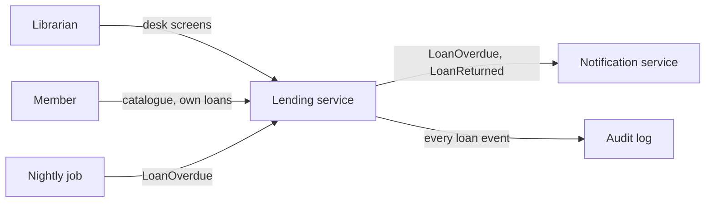
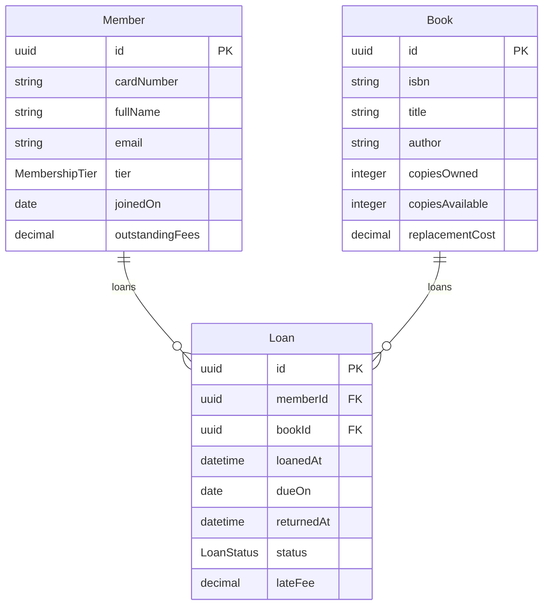
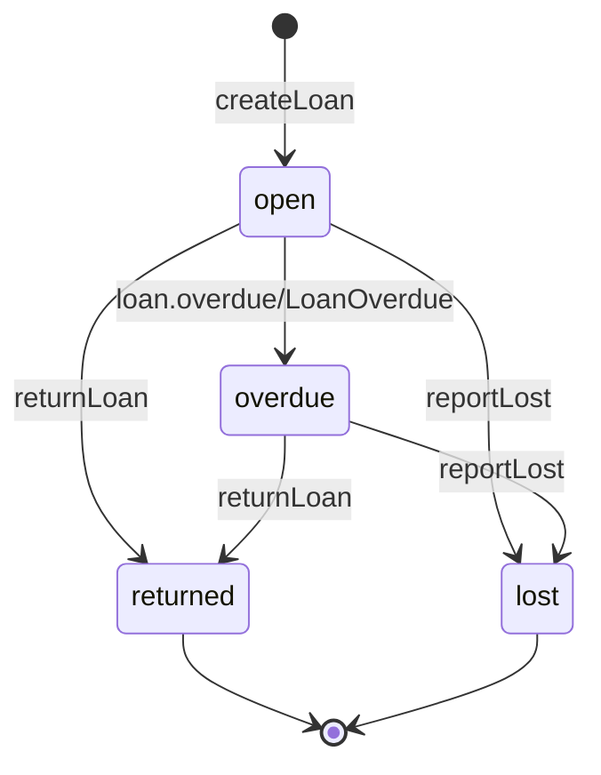
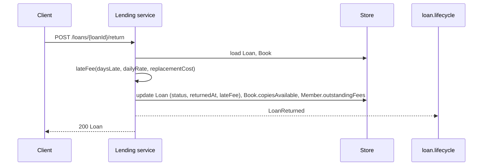

# Library Lending

Explanation for `library-lending.specarch.yaml`. The sections follow
`docs/conventions.md`; diagrams between `specarch:generate` markers are
derived from the YAML and will be rewritten by the generator once it exists.
Until then they are kept in step by hand.

## 1. Introduction and goals

A small public library lends books to its members. The system records who has
which copy, when it is due, and what is owed when it comes back late. It is an
example built to exercise every concept of meta-model 0.1 in one small,
understandable domain.

Quality goals, in order: a librarian can do every desk task in one screen;
money is never wrong by a cent; a member can only ever see their own records.

## 2. Constraints

Single currency. Dates are the library's local calendar dates; timestamps are
UTC. One library, one branch.

## 3. Context

Hand-drawn.

## 4. Solution strategy

A single service over one database. Business rules that need a number live
in algorithms (ADR-001). Money travels as decimal strings (ADR-002). Access is
by permission, granted through two roles, and every endpoint names the one
permission it needs.

## 5. Building blocks

<!-- specarch:generate erDiagram -->

<!-- specarch:end -->

A `Book` is a title with a count of copies, not an individual copy; the
example does not track copies by barcode. `copiesAvailable` is derived and
maintained by the service on every loan and return.

## 6. Runtime view

<!-- specarch:generate stateDiagram Loan -->

<!-- specarch:end -->

<!-- specarch:generate sequenceDiagram returnLoan -->

<!-- specarch:end -->

## 7. Deployment

Nothing yet.

## 8. Cross-cutting concepts

<!-- specarch:generate permissions -->
| Permission | librarian | member | public |
|---|---|---|---|
| members.read | yes | | |
| members.write | yes | | |
| catalogue.read | yes | yes | |
| loans.read | yes | yes | |
| loans.create | yes | | |
| loans.return | yes | | |
| public | | | everyone |
<!-- specarch:end -->

A member holding `loans.read` sees only loans where `memberId` is their own.
This row-level rule is enforced by the service and is not yet expressible in
the meta-model; see the roadmap for v0.2.

Money: every amount is a decimal string with two places (ADR-002). Time:
`loanedAt` and `returnedAt` are UTC timestamps; `dueOn` is a calendar date,
so a loan due on the 21st is overdue from the start of the 22nd, library time.

## 9. Architecture decisions

- ADR-001, accepted: late fees are a flat daily rate capped at the
  replacement cost.
- ADR-002, accepted: money is carried as decimal strings, never floats.

## 10. Quality requirements

- A librarian registers a member and lends a book in under a minute at the
  desk, using `member-form` and `loan-form` only.
- Returning a book 90 days late on a 25.00 title charges exactly 25.00.

## 11. Risks and technical debt

Copies are counted, not identified, so a damaged copy cannot be traced to a
loan. Acceptable for the example; a real library would add a `Copy` entity.

## 12. Glossary

- **Copy**: one physical book. The example counts them per title.
- **Tier**: a membership level that sets the loan limit and loan period.

## 13. Requirements

| ID | Requirement |
|---|---|
| LIB-1 | A member is identified by a unique card number and a unique email address. |
| LIB-2 | Anyone can browse the catalogue without a card. |
| LIB-3 | A member may hold at most the number of open loans their tier allows and may not borrow while fees are outstanding. |
| LIB-4 | A loan not returned by its due date becomes overdue the next day and the member is told. |
| LIB-5 | A late return is charged a flat daily rate, capped at the book's replacement cost. |
