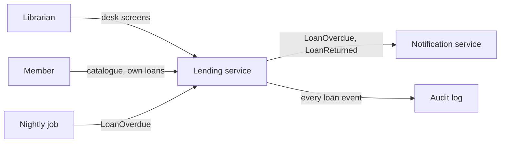
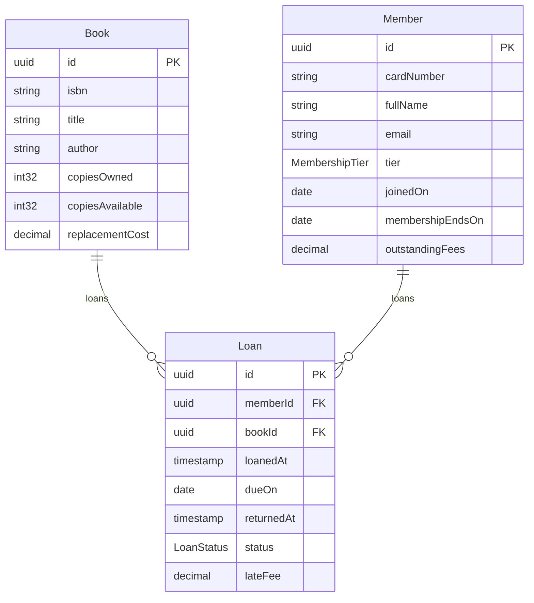
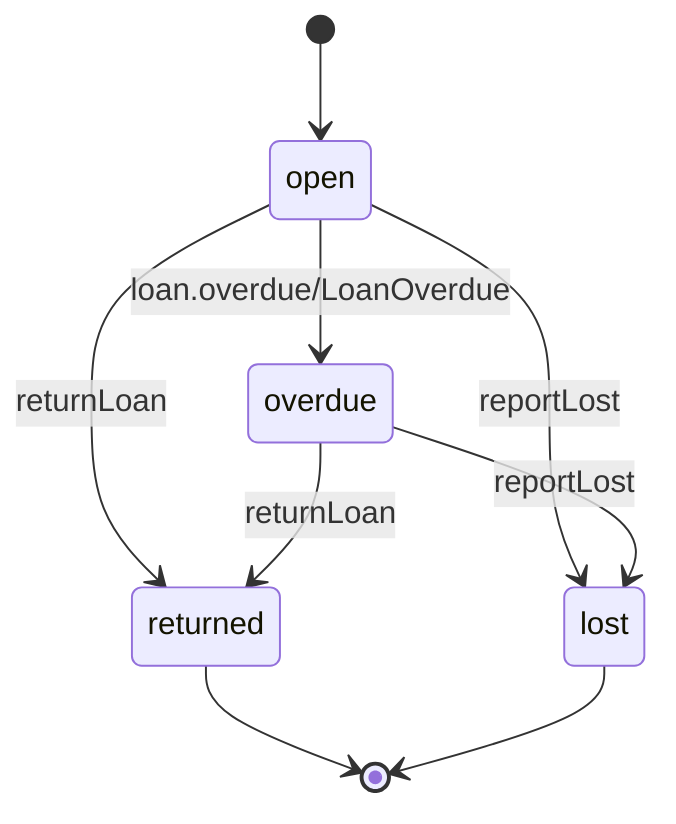
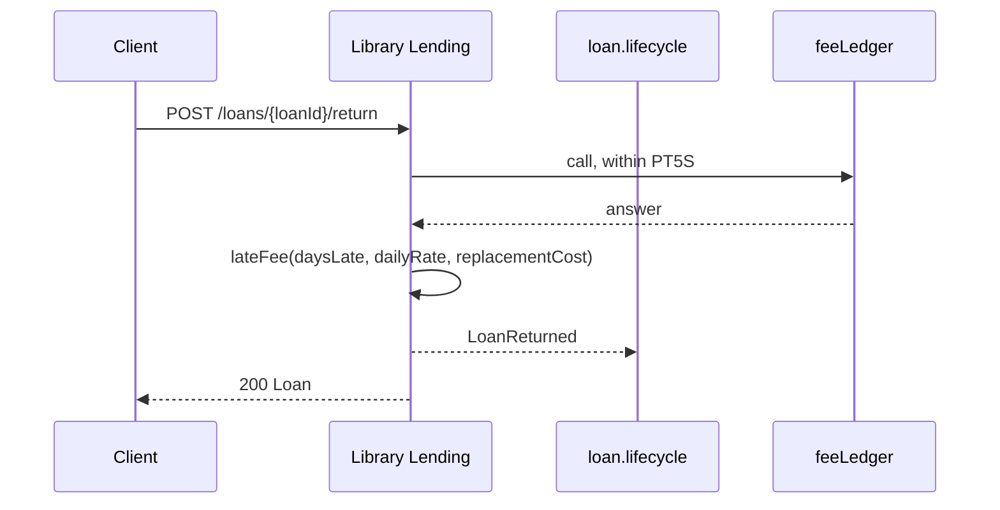

# Library Lending

Explanation for the specification in this folder. The sections follow
`docs/conventions.md`. The regions between `specarch:generate` markers are
written by `specarch document techspec` from the YAML: edit the YAML, not
the regions. The full technical specification is in `../docs/techspec.md`.

## 1. Introduction and goals

A small public library lends books to its members. The system records who has
which copy, when it is due, and what is owed when it comes back late. It is an
example built to exercise every concept of meta-model 0.1 in one small,
understandable domain.

Quality goals, in order: a librarian can do every desk task in one screen;
money is never wrong by a cent; a member can only ever see their own records.

## 2. Constraints

The constraints and assumptions are in `requirements/`: one library, one
branch, one currency; local calendar dates and UTC timestamps; member data
kept only as long as the rules allow.

## 3. Context

Hand-drawn.

## 4. Solution strategy

A single service over one database. Business rules that need a number live
in algorithms (ADR-001). Money travels as decimal strings (ADR-002). Access is
by permission, granted through two roles, and every endpoint names the one
permission it needs.

## 5. Building blocks

<!-- specarch:generate erDiagram -->

<!-- specarch:end -->

A `Book` is a title with a count of copies, not an individual copy; the
example does not track copies by barcode. `copiesAvailable` is derived and
maintained by the service on every loan and return.

## 6. Runtime view

<!-- specarch:generate stateDiagram Loan -->

<!-- specarch:end -->

<!-- specarch:generate sequenceDiagram returnLoan -->

<!-- specarch:end -->

## 7. Deployment

A single service over one database. The three environments, the release and
rollback steps, the tier migration and the commissioning checks are in
`deployment/` and `commissioning/`; the hosts are in the implementation
file.

## 8. Cross-cutting concepts

<!-- specarch:generate permissions -->
| Permission | librarian | member | public |
|---|---|---|---|
| members.read | yes | | |
| members.write | yes | | |
| catalogue.read | yes | yes | |
| loans.read | yes | yes | |
| loans.create | yes | | |
| loans.return | yes | | |
| public | | | everyone |
<!-- specarch:end -->

A member holding `loans.read` sees only loans where `memberId` is their own.
This row-level rule is enforced by the service and is not yet expressible in
the meta-model; see the roadmap for v0.2.

Money: every amount is a decimal string with two places (ADR-002). Time:
`loanedAt` and `returnedAt` are UTC timestamps; `dueOn` is a calendar date,
so a loan due on the 21st is overdue from the start of the 22nd, library time.

## 9. Architecture decisions

- ADR-001, accepted: late fees are a flat daily rate capped at the
  replacement cost.
- ADR-002, accepted: money is carried as decimal strings, never floats.

## 10. Quality requirements

- A librarian registers a member and lends a book in under a minute at the
  desk, using `member-form` and `loan-form` only.
- Returning a book 90 days late on a 25.00 title charges exactly 25.00.

## 11. Risks and technical debt

Copies are counted, not identified, so a damaged copy cannot be traced to a
loan. Acceptable for the example; a real library would add a `Copy` entity.

## 12. Glossary

The glossary is in `requirements/glossary/`.

## 13. Requirements

The stakeholders, needs and requirements are in `requirements/`, and the
traceability matrix is chapter 13 of `../docs/techspec.md`.
