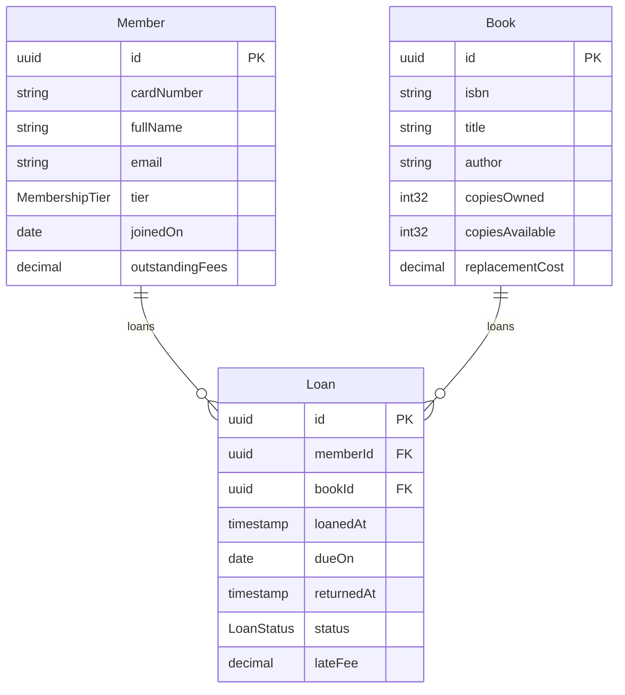
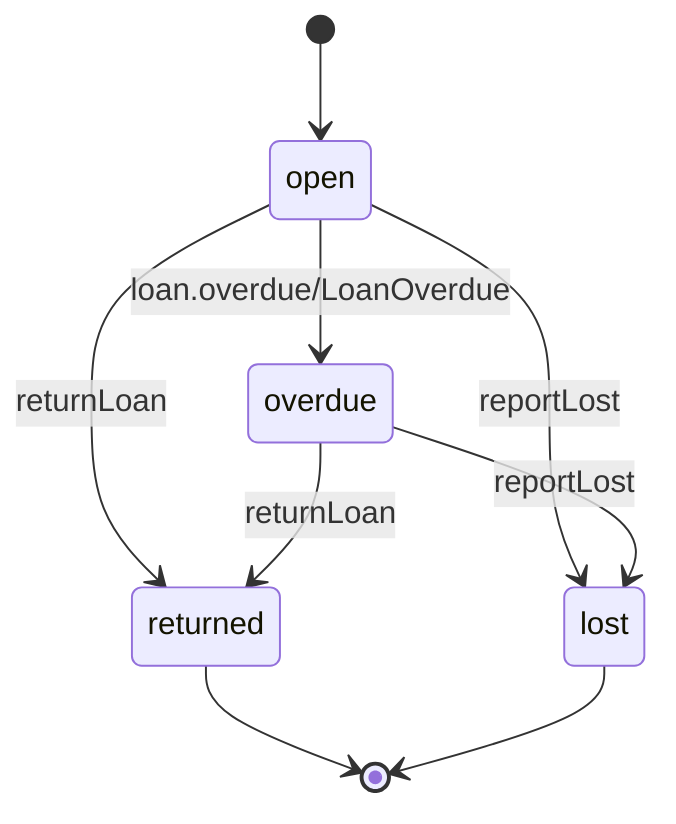
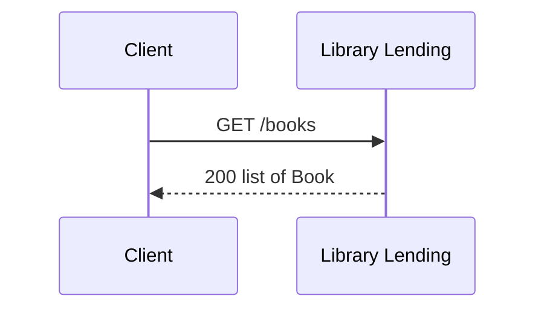
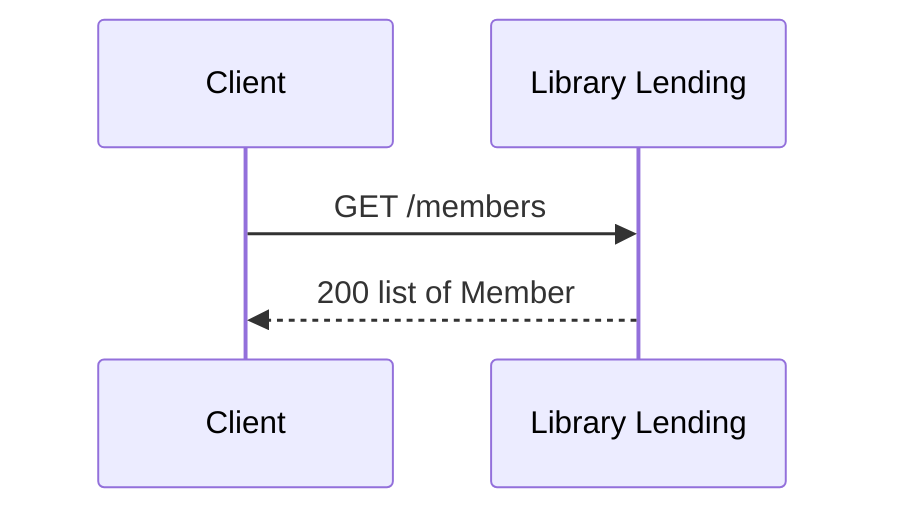
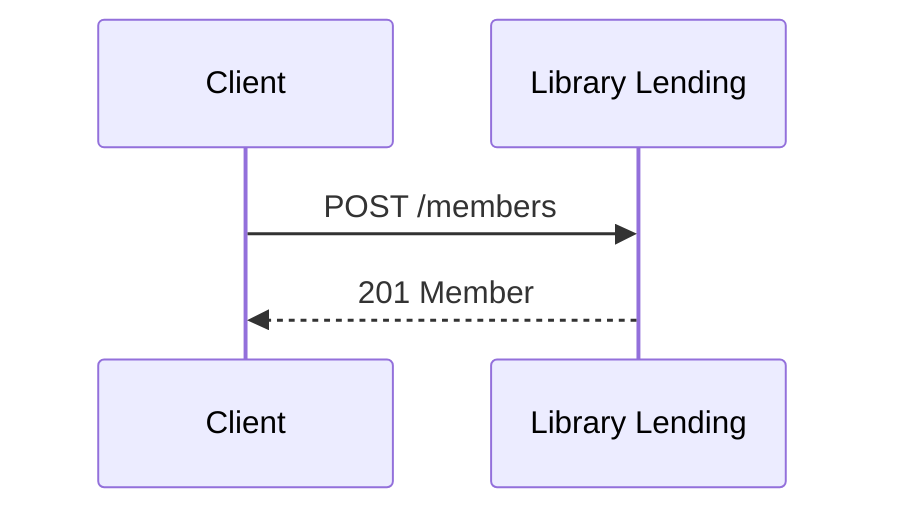
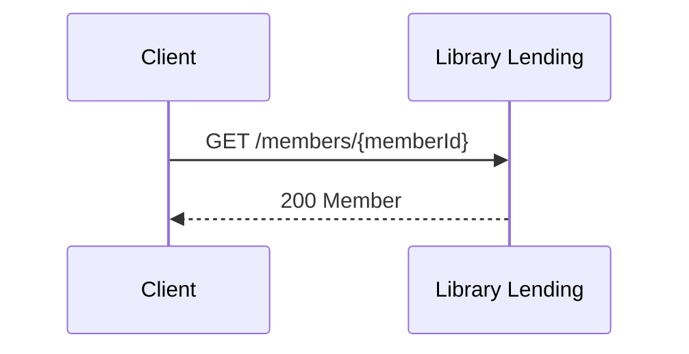
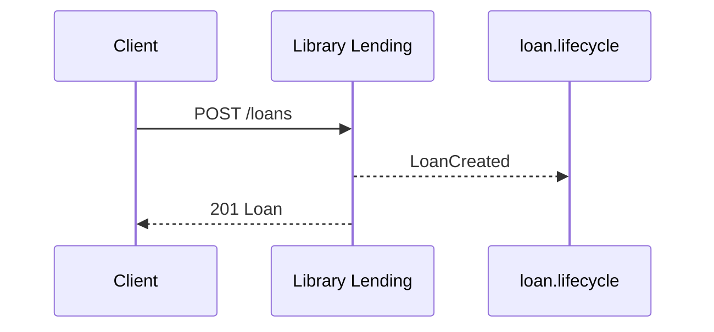
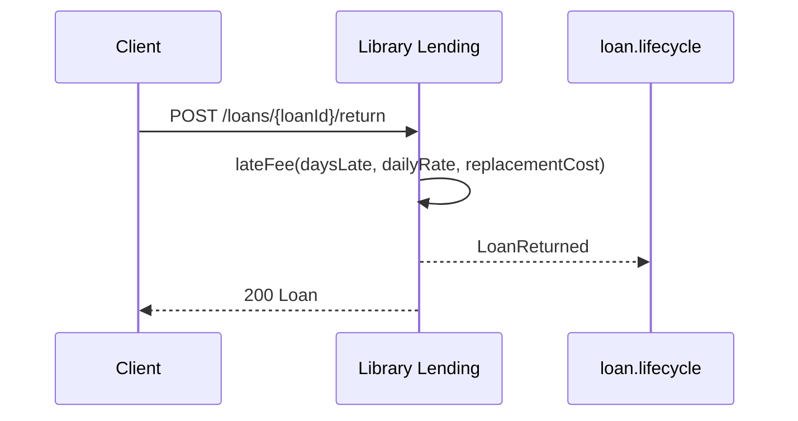
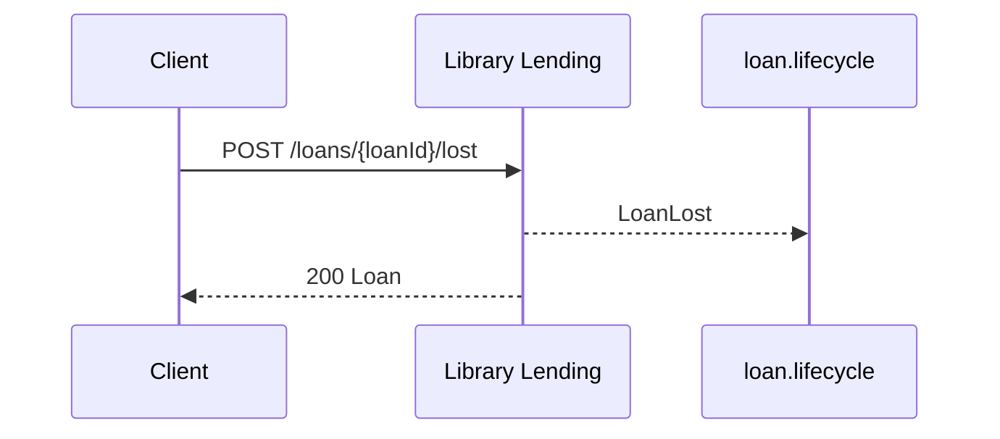
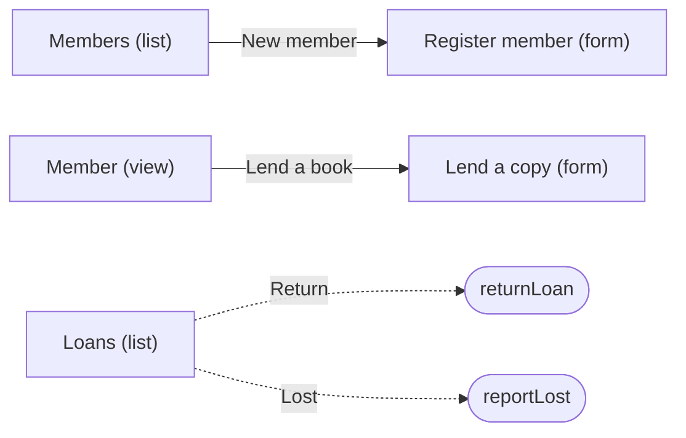

<!-- Generated by specarch generate techspec from ../library-lending.specarch-design.yaml, version 0.1.0, and ../library-lending.go.specarch-implementation.yaml, version 0.1.0; meta-model 0.1. Do not edit this file: change the YAML and generate again. -->

# Library Lending: technical specification

Version 0.1.0 of the design: 3 entities, 8 HTTP operations, 2 channels, 5 pages, 1 algorithm, 68 tests and 2 decisions. The chapters follow arc42, and a chapter with nothing in the design is left out.

## 1. Introduction and goals

A small public library lends books to its members. Members borrow a copy,
keep it for a fixed loan period, and pay a late fee when they return it
after the due date. This example exists to exercise every concept of
meta-model 0.1 in one place; it is not a real library's system.

Owners: example-maintainers.

## 3. Context

The interfaces the system offers, as its clients see them.

### HTTP operations

| Method and path | Operation | Summary | Permission |
|---|---|---|---|
| GET /books | listBooks | Browse the catalogue | public |
| GET /members | listMembers | List members | members.read |
| POST /members | createMember | Register a new member | members.write |
| GET /members/{memberId} | getMember | One member with their loans | members.read |
| GET /loans | listLoans | List loans | loans.read |
| POST /loans | createLoan | Lend a copy to a member | loans.create |
| POST /loans/{loanId}/return | returnLoan | Record the return of a copy | loans.return |
| POST /loans/{loanId}/lost | reportLost | Record a lost copy and charge its replacement cost | loans.return |

### Channels

| Channel | Message | Summary |
|---|---|---|
| loan.lifecycle | LoanCreated | A copy was lent. |
| loan.lifecycle | LoanReturned | A copy came back; the payload carries the fee charged. |
| loan.lifecycle | LoanLost | A copy was reported lost. |
| loan.overdue | LoanOverdue | A loan became overdue. |

## 5. Building blocks



### Member

A person with a library card.

| Field | Type | Required | Limits | Description |
|---|---|---|---|---|
| id | uuid | yes | set by the system |   |
| cardNumber | string | yes | matches `^[0-9]{8}$` | Printed on the card; assigned when the member joins. |
| fullName | string | yes | at least 1 character, at most 200 characters |   |
| email | string | yes | at most 320 characters, a valid email |   |
| tier | MembershipTier | yes |   |   |
| joinedOn | date | yes | set by the system |   |
| outstandingFees | decimal(10, 2) | yes | set by the system | Sum of unpaid late fees and replacement charges, in the library's currency. |

Primary key: id.

| Relation | Kind | Target | Via | On delete |
|---|---|---|---|---|
| loans | one-to-many | Loan | memberId | restrict |

| Constraint | Rule | Message |
|---|---|---|
| member_card_number_unique | unique: cardNumber | A member with this card number already exists. |
| member_email_unique | unique: email | A member with this email address already exists. |

### Book

A title the library owns, with the number of physical copies.

| Field | Type | Required | Limits | Description |
|---|---|---|---|---|
| id | uuid | yes | set by the system |   |
| isbn | string | yes | matches `^[0-9]{13}$` |   |
| title | string | yes | at least 1 character, at most 500 characters |   |
| author | string | yes | at least 1 character, at most 200 characters |   |
| copiesOwned | int32 | yes | at least 0 |   |
| copiesAvailable | int32 | yes | at least 0, set by the system |   |
| replacementCost | decimal(10, 2) | yes |   |   |

Primary key: id.

| Relation | Kind | Target | Via | On delete |
|---|---|---|---|---|
| loans | one-to-many | Loan | bookId | restrict |

| Constraint | Rule | Message |
|---|---|---|
| book_isbn_unique | unique: isbn | This ISBN is already in the catalogue. |
| book_available_within_owned | check `copiesAvailable <= copiesOwned` | Available copies cannot exceed the copies owned. |

### Loan

One copy of one book lent to one member for a period.

| Field | Type | Required | Limits | Description |
|---|---|---|---|---|
| id | uuid | yes | set by the system |   |
| memberId | uuid | yes |   |   |
| bookId | uuid | yes |   |   |
| loanedAt | timestamp | yes | set by the system |   |
| dueOn | date | yes | set by the system |   |
| returnedAt | timestamp or null |   | set by the system |   |
| status | LoanStatus | yes |   |   |
| lateFee | decimal(10, 2) | yes | set by the system | Computed by the lateFee algorithm when the copy is returned; zero until then. |

Primary key: id.

| Relation | Kind | Target | Via | On delete |
|---|---|---|---|---|
| member | many-to-one | Member | memberId | restrict |
| book | many-to-one | Book | bookId | restrict |

| Constraint | Rule | Message |
|---|---|---|
| loan_due_after_loaned | check `dueOn > date(loanedAt)` | The due date must be after the loan date. |
| loan_returned_after_loaned | check `returnedAt == null \|\| returnedAt >= loanedAt` | A copy cannot be returned before it was lent. |

### Enums

| Enum | Value | Meaning |
|---|---|---|
| LoanStatus | open | the copy is with the member and the due date has not passed |
| LoanStatus | overdue | the due date has passed and the copy is still out |
| LoanStatus | returned | the copy is back on the shelf |
| LoanStatus | lost | the member reported the copy lost; the replacement cost was charged |
| MembershipTier | standard | up to 3 open loans, 21-day loan period |
| MembershipTier | extended | up to 6 open loans, 28-day loan period |

## 6. Runtime view

### States of Loan



### listBooks (GET /books)



### listMembers (GET /members)



### createMember (POST /members)



### getMember (GET /members/{memberId})



### listLoans (GET /loans)


### createLoan (POST /loans)

Refused when the member already holds the maximum open loans for their
tier, has outstanding fees, or the book has no copy available.



### returnLoan (POST /loans/{loanId}/return)



### reportLost (POST /loans/{loanId}/lost)



## 7. Deployment and implementation

From the implementation file Library Lending in Go and PostgreSQL, version 0.1.0.

How one stack would build the lending example. No code for it exists in
this repository; the file shows what belongs in an implementation file
and what stays in the definition beside it.

Stack: language Go 1.26; toolchain go 1.26.0.

### Libraries

| Library | Version | Licence | Purpose |
|---|---|---|---|
| github.com/oapi-codegen/oapi-codegen/v2 | v2.8.0 | Apache-2.0 | Turns the generated OpenAPI document into a strict server interface and request and response types. (tool) |
| github.com/oapi-codegen/runtime | v1.7.0 | Apache-2.0 | Runtime helpers the generated server code calls. |
| github.com/go-chi/chi/v5 | v5.3.2 | MIT | HTTP router. |
| github.com/jackc/pgx/v5 | v5.11.0 | MIT | PostgreSQL driver. |

### Layout

| Path | Holds | Implements |
|---|---|---|
| internal/api | Generated server interface and types. Never edited by hand. | #/paths/~1books/get, #/paths/~1loans/post, #/paths/~1loans~1{loanId}~1return/post |
| internal/lending | Hand-written handlers that implement the generated interface, and the late-fee algorithm. | #/algorithms/lateFee, #/entities/Loan |
| migrations | Generated forward migrations, new files only. |   |

### Mappings

| Design object | Implemented by | Notes |
|---|---|---|
| #/entities/Loan | table loans |   |
| #/entities/Member | table members |   |
| #/entities/Book | table books |   |
| #/algorithms/lateFee | lending.LateFee | Takes and returns `decimal.Decimal` values with scale 2. |
| #/paths/~1loans/post | lending.Server.CreateLoan |   |

### Bindings

http: github.com/go-chi/chi/v5. The generated strict handler is mounted on a chi router; a middleware checks the operation's permission before the handler runs.

storage: github.com/jackc/pgx/v5. Money columns are `numeric(10,2)`.

### Generators

| Target | Output folder | Settings |
|---|---|---|
| techspec | techspec |   |
| openapi | api | tool oapi-codegen |
| sql | migrations | dialect postgresql |
| ui | web | platform web, framework plain-javascript |
| tests | internal/lending |   |

### Tasks

| Task | Command | In CI |
|---|---|---|
| generate | `go generate ./...` |   |
| test | `go test ./...` | yes |

### Deployments

local: A developer's machine. Servers: http://localhost:8080.

### Implementation decisions

#### ADR-101: PostgreSQL numeric for money

Status: accepted, 2026-10-07.

Context: The definition carries money as decimal strings with a precision and scale (ADR-002 there).

Decision: Every decimal field becomes `numeric(precision, scale)` in PostgreSQL and a decimal type in Go, never a float.

Consequences: Sums in SQL and in Go agree to the cent.

## 8. Cross-cutting concepts

### Permissions

Access is fail-closed: every operation, command and page names the one permission it needs, and only the roles below grant one.

| Permission | librarian | member | public |
|---|---|---|---|
| members.read | yes | | |
| members.write | yes | | |
| catalogue.read | yes | yes | |
| loans.read | yes | yes | |
| loans.create | yes | | |
| loans.return | yes | | |
| public | | | everyone |

### Pages



| Page | Kind | Route | Entity | Permission | Shows |
|---|---|---|---|---|---|
| members-list | list | /members | Member | members.read | cardNumber, fullName, email, tier, outstandingFees |
| member-form | form | /members/new | Member | members.write | fullName, email, tier |
| member-view | view | /members/{memberId} | Member | members.read | cardNumber, fullName, email, tier, joinedOn, outstandingFees |
| loan-form | form | /loans/new | Loan | loans.create | memberId, bookId |
| loans-list | list | /loans | Loan | loans.read | memberId, bookId, loanedAt, dueOn, status, lateFee |

### Algorithm lateFee

Fee charged when a copy comes back after its due date. A flat daily rate,
capped so that a long-overdue book never costs more than replacing it.

Inputs: `daysLate` (int32), `dailyRate` (decimal(10, 2)), `replacementCost` (decimal(10, 2)). Output: decimal(10, 2).

Formula:

    min(decimal(daysLate, 0) * dailyRate, replacementCost)

| Worked example | Inputs | Expected | Note |
|---|---|---|---|
| returned on time | daysLate 0, dailyRate 0.50, replacementCost 25.00 | 0.00 |   |
| one week late | daysLate 7, dailyRate 0.50, replacementCost 25.00 | 3.50 | 7 × 0.50 = 3.50, below the cap. |
| capped at replacement cost | daysLate 90, dailyRate 0.50, replacementCost 25.00 | 25.00 | 90 × 0.50 = 45.00 exceeds the 25.00 replacement cost, so the cap applies. |
| cheap book, cap reached early | daysLate 10, dailyRate 0.50, replacementCost 4.00 | 4.00 |   |

Pseudocode:

```text
function lateFee(daysLate, dailyRate, replacementCost):
    if daysLate <= 0:
        return 0.00
    fee = daysLate * dailyRate          # decimal arithmetic, 2 places
    if fee > replacementCost:
        fee = replacementCost
    return fee
```

## 9. Architecture decisions

### ADR-001: Late fees are a flat daily rate capped at the replacement cost

Status: accepted, 2026-10-07.

Context: Tiered rates (cheaper for the first week, dearer after) were considered.
They are harder to explain at the desk and the difference in revenue is
small for a library of this size.

Decision: One daily rate for every book, capped at that book's replacement cost.
The rate is a library setting, not a per-book value.

Consequences: The fee can be computed from three numbers and checked by hand. A very
long-overdue book costs the same as a lost one, which is what we want:
at that point the member should be told to treat it as lost.

### ADR-002: Money is carried as decimal strings, never floats

Status: accepted, 2026-10-07.

Context: JSON has no decimal type. Fees and costs must round the way a cashier
expects.

Decision: Every money field is `type: string, format: decimal` with `precision`
and `scale`. Generators map it to the target's decimal type and the API
transports it as a string.

Consequences: Clients must parse the string; in return no sum ever drifts by a cent.

## 10. Quality requirements

The design tests: what must hold on every implementation. Golden scenarios succeed; red scenarios are refused.

| Test | Subject | Scenario | Given | When | Then |
|---|---|---|---|---|---|
| browse-catalogue | operation listBooks | golden | three books by two authors, and a visitor without a card | listBooks is called with q set to one author's name, and again with a 200-character q | the first call answers that author's books, the second an empty list |
| browse-catalogue-query-too-long | operation listBooks | red | a visitor | listBooks is called with a 201-character q | it is refused as invalid input |
| list-members | operation listMembers | golden | two members and a librarian | listMembers is called | both members are answered |
| list-members-denied | operation listMembers | red | a caller holding only the member role | listMembers is called | it is refused as not allowed |
| register-member | operation createMember | golden | a librarian | createMember is called for a standard-tier member with a one-letter name, and again with a 200-character name | both members are created, each with a new eight-digit card number and no fees |
| register-member-missing-field | operation createMember | red | a librarian | createMember is called three times each time without one of fullName and email and tier | each call is refused as invalid input |
| register-member-name-length | operation createMember | red | a librarian | createMember is called with an empty fullName and with a 201-character one | both are refused as invalid input |
| register-member-bad-values | operation createMember | red | a librarian | createMember is called with email set to 'not-an-address', and with tier set to gold | both are refused as invalid input |
| register-member-denied | operation createMember | red | a caller holding only the member role | createMember is called | it is refused as not allowed |
| register-member-email-taken | operation createMember | red | a member registered with ana@example.org | createMember is called with the same email address | it answers 409 and no member is created |
| register-member-card-number-clash | operation createMember | red | not applicable |   | The card number is assigned by the system, never sent by a client, so a request cannot clash on it. The constraint itself is tested under member-card-number-twice. |
| show-member | operation getMember | golden | a member and a librarian | getMember is called with the member's id | the member is answered |
| show-member-not-found | operation getMember | red | a librarian and no member with a given id | getMember is called with that id | it answers 404 |
| show-member-bad-id | operation getMember | red | a librarian | getMember is called with memberId abc | it is refused as invalid input |
| show-member-denied | operation getMember | red | a caller holding only the member role | getMember is called | it is refused as not allowed |
| list-loans | operation listLoans | golden | an open loan and a returned loan | listLoans is called with status open | only the open loan is answered |
| list-loans-bad-filter | operation listLoans | red | a librarian | listLoans is called with status lent and again with memberId abc | both are refused as invalid input |
| list-loans-denied | operation listLoans | red | a caller holding no role | listLoans is called | it is refused as not allowed |
| lend-a-copy | operation createLoan | golden | a standard-tier member with no loans and no fees, and a book with one copy available | createLoan is called for them | an open loan due in 21 days is created, the book has no copy available, and LoanCreated is published |
| lend-missing-field | operation createLoan | red | a librarian | createLoan is called without memberId and again without bookId | both are refused as invalid input |
| lend-bad-ids | operation createLoan | red | a librarian | createLoan is called with memberId abc and again with bookId abc | both are refused as invalid input |
| lend-unknown-member-or-book | operation createLoan | red | a librarian | createLoan is called with a memberId and then a bookId that no record has | both are refused as not found |
| lend-limit-reached | operation createLoan | red | a standard-tier member with three open loans | createLoan is called for a fourth book | it answers 409 and no loan is created |
| lend-denied | operation createLoan | red | a caller holding only the member role | createLoan is called | it is refused as not allowed |
| lend-event-not-delivered | operation createLoan | red | the loan.lifecycle channel is unavailable | createLoan is called | no loan is created and the call fails, so a loan never exists without its event |
| return-late | operation returnLoan | golden | an overdue loan returned 7 days late, a daily rate of 0.50 and a replacement cost of 25.00 | returnLoan is called | the loan is returned with a late fee of 3.50, the copy is available again, and LoanReturned is published |
| return-already-closed | operation returnLoan | red | a loan already returned | returnLoan is called on it | it answers 409 and nothing changes |
| return-unknown-loan | operation returnLoan | red | a librarian | returnLoan is called with an id no loan has and again with abc | the first is refused as not found and the second as invalid input |
| return-denied | operation returnLoan | red | a caller holding only the member role | returnLoan is called | it is refused as not allowed |
| return-event-not-delivered | operation returnLoan | red | the loan.lifecycle channel is unavailable | returnLoan is called | the loan stays open and the call fails |
| report-lost | operation reportLost | golden | an open loan of a book whose replacement cost is 25.00 | reportLost is called | the loan is lost and 25.00 is added to the member's outstanding fees |
| report-lost-already-closed | operation reportLost | red | a loan already lost | reportLost is called on it | it answers 409 and nothing is charged twice |
| report-lost-unknown-loan | operation reportLost | red | a librarian | reportLost is called with an id no loan has and again with abc | the first is refused as not found and the second as invalid input |
| report-lost-denied | operation reportLost | red | a caller holding only the member role | reportLost is called | it is refused as not allowed |
| report-lost-event-not-delivered | operation reportLost | red | the loan.lifecycle channel is unavailable | reportLost is called | the loan stays open, nothing is charged, and the call fails |
| members-list-shown | page members-list | golden | a librarian | the page members-list is opened | it lists members with card number, name, email, tier and fees |
| members-list-denied | page members-list | red | a caller holding only the member role | the page members-list is opened | it is not shown |
| member-form-shown | page member-form | golden | a librarian | the page member-form is filled in and sent | the member is registered |
| member-form-denied | page member-form | red | a caller holding only the member role | the page member-form is opened | it is not shown |
| member-view-shown | page member-view | golden | a librarian and a member | the page member-view is opened for that member | it shows the member and offers Lend a book |
| member-view-not-found | page member-view | red | a librarian | the page member-view is opened for an id no member has | it says the member was not found |
| member-view-denied | page member-view | red | a caller holding only the member role | the page member-view is opened | it is not shown |
| loan-form-shown | page loan-form | golden | a librarian | the page loan-form is filled in and sent | the copy is lent |
| loan-form-denied | page loan-form | red | a caller holding only the member role | the page loan-form is opened | it is not shown |
| loans-list-shown | page loans-list | golden | a librarian and some loans | the page loans-list is opened | it lists the loans with their due dates, states and fees |
| loans-list-denied | page loans-list | red | a caller holding no role | the page loans-list is opened | it is not shown |
| member-card-number-once | Member constraint member_card_number_unique | golden | no member with card number 00000001 | a member with that card number is saved | it is saved |
| member-card-number-twice | Member constraint member_card_number_unique | red | a member with card number 00000001 | another member with that card number is saved | it is refused |
| member-email-once | Member constraint member_email_unique | golden | no member with ana@example.org | a member with that address is saved | it is saved |
| member-email-twice | Member constraint member_email_unique | red | a member with ana@example.org | another member with that address is saved | it is refused |
| book-isbn-once | Book constraint book_isbn_unique | golden | no book with ISBN 9780000000001 | a book with that ISBN is saved | it is saved |
| book-isbn-twice | Book constraint book_isbn_unique | red | a book with ISBN 9780000000001 | another book with that ISBN is saved | it is refused |
| book-available-at-most-owned | Book constraint book_available_within_owned | golden | a book with 2 copies owned | it is saved with 2 available | it is saved |
| book-available-above-owned | Book constraint book_available_within_owned | red | a book with 2 copies owned | it is saved with 3 available | it is refused |
| loan-due-after-loaned | Loan constraint loan_due_after_loaned | golden | a loan made on 2026-10-07 | it is saved due on 2026-10-28 | it is saved |
| loan-due-on-loan-day | Loan constraint loan_due_after_loaned | red | a loan made on 2026-10-07 | it is saved due on 2026-10-07 | it is refused |
| loan-returned-after-loaned | Loan constraint loan_returned_after_loaned | golden | a loan made at 2026-10-07T10:00:00Z | it is saved returned at 2026-10-08T10:00:00Z | it is saved |
| loan-returned-before-loaned | Loan constraint loan_returned_after_loaned | red | a loan made at 2026-10-07T10:00:00Z | it is saved returned at 2026-10-06T10:00:00Z | it is refused |
| loan-becomes-overdue | Loan open to overdue | golden | an open loan due yesterday | the nightly job runs | the loan is overdue and LoanOverdue is published |
| loan-overdue-only-from-open | Loan open to overdue | red | a returned loan due last week | the nightly job runs | the loan stays returned |
| loan-returned-on-time | Loan open to returned | golden | an open loan | returnLoan is called | the loan is returned with no fee |
| loan-returned-only-when-out | Loan open to returned | red | a lost loan | returnLoan is called | it is refused and the loan stays lost |
| overdue-loan-returned | Loan overdue to returned | golden | an overdue loan | returnLoan is called | the loan is returned with its late fee |
| overdue-loan-returned-twice | Loan overdue to returned | red | a loan already returned | returnLoan is called again | it is refused and the fee is not charged twice |
| open-loan-lost | Loan open to lost | golden | an open loan | reportLost is called | the loan is lost and the replacement cost is charged |
| open-loan-lost-after-return | Loan open to lost | red | a returned loan | reportLost is called | it is refused and the loan stays returned |
| overdue-loan-lost | Loan overdue to lost | golden | an overdue loan | reportLost is called | the loan is lost and the replacement cost is charged |
| overdue-loan-lost-twice | Loan overdue to lost | red | a loan already lost | reportLost is called again | it is refused and nothing is charged twice |

## 13. Requirements

LIB: Requirement list for the lending example, kept in `library-lending.specarch-design.md` under "Requirements".

| Requirement | Traced by |
|---|---|
| LIB-1 | entities Member constraints member_card_number_unique; entities Member; paths /members post; tests register-member; tests register-member-email-taken |
| LIB-2 | entities Book; permissions public; paths /books get; tests browse-catalogue |
| LIB-3 | entities Loan; paths /loans post; tests lend-a-copy; tests lend-limit-reached |
| LIB-4 | entities Loan transitions 1; entities Loan; paths /loans/{loanId}/return post; channels loan.overdue; channels loan.overdue messages LoanOverdue; tests loan-becomes-overdue |
| LIB-5 | paths /loans/{loanId}/return post; algorithms lateFee; tests return-late; decisions ADR-001 |

