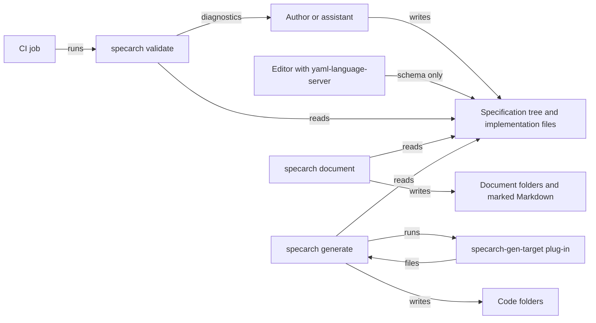
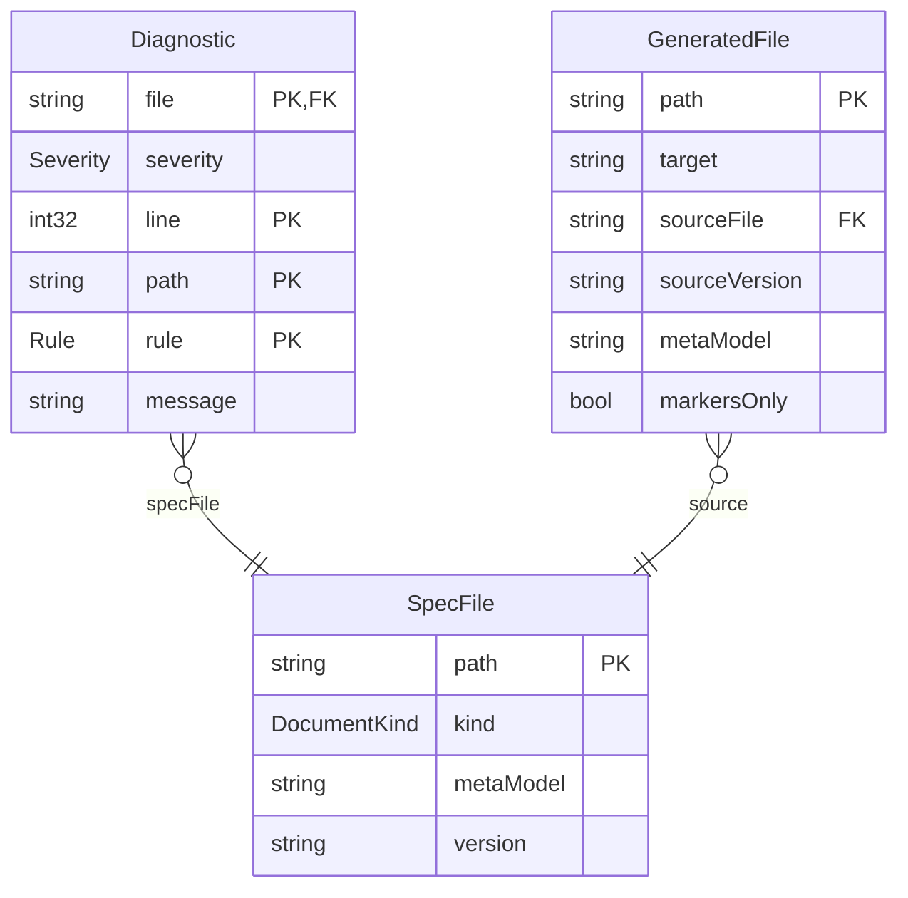
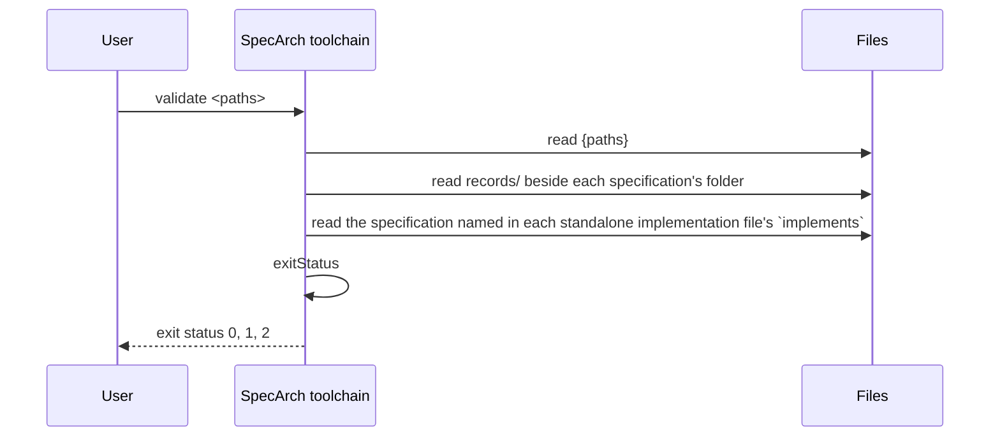

# SpecArch toolchain

Explanation for the specification in this folder: the design of the
`specarch` command, from its stakeholders and requirements to its
commissioning checks. It has two implementations, each described in its
own file: `implementation/go/specarch.go.specarch-implementation.yaml` and
`implementation/swift/specarch.swift.specarch-implementation.yaml`. The
sections follow `docs/conventions.md`; the regions between
`specarch:generate` markers are written by `specarch document techspec` from
the YAML: edit the YAML, not the regions. The full technical specification
is `docs/techspec.md`.

This is SpecArch's own specification, written before the code as the first
rule asks. It lives in `spec/` because that is where `docs/conventions.md`
puts a project's specification: it describes this repository's real program,
not an example. Its tests stage, `tests/`, is the conformance suite: each
test folder holds the design test, the arguments and expected output in
`case.yaml`, and the files the case runs on.

## 1. Introduction and goals

`specarch` checks SpecArch specifications and makes documents and code from
them. Its users are the people and assistants who write specifications, the
reviewers who read the documents, the operators who release the built
system, and the CI jobs that keep a specification and its code equal; the
`stakeholders` and `needs` of the requirements stage say what each wants.

Quality goals, in order: no file with a known problem passes; every problem
names the file, the line, the YAML path and the rule; one run reports every
problem; the program installs with one command and needs no network.

## 2. Constraints

The JSON Schemas in `schema/` are the definition of each file's shape and are
applied unchanged (ADR-003). A specification is read as a whole: its files
are merged into one document, so a reference resolves wherever its target's
file is (ADR-010). An implementation file is checked together with the
specification it names. The constraints and assumptions of the requirements
stage are in `requirements/`.

## 3. Context

Hand-drawn.

## 4. Solution strategy

A specification is a folder tree with one root file and a folder per
life-cycle stage (ADR-010), and it covers the whole life cycle, each stage
optional until the project reaches it (ADR-011). The specification holds the
design, an implementation file holds one stack's choices (ADR-001), split at
the interface boundary of ADR-002. The validator applies the schema first,
then the checks a schema cannot make (ADR-003). Expressions are a small
subset of CEL and numbers are exact (ADR-004). Every problem is reported, one
line each (ADR-005). The command line is described with `commands`
(ADR-006). Every element may say why and cite its sources (ADR-012); one
binary carries every verb, and code targets are plug-ins (ADR-013); design
elements satisfy requirements, tests verify them (ADR-014).

## 5. Building blocks

<!-- specarch:generate erDiagram -->

<!-- specarch:end -->

None of the three is stored. They are the values the commands pass around and
print; the meta-model has no word yet for a value without storage, so they
are written as entities with the key that makes each one unique.

The validator runs these checks on a specification, in this order, and
reports all of them:

1. Layout: the root file's `stages` and the folders agree, every file holds
   only sections of its stage, every test folder has its `test.yaml`, and a
   name is defined once across the tree.
2. YAML: well-formed, no repeated key, no unquoted date.
3. Schema: the JSON Schema of the meta-model version the root declares,
   applied to the merged document.
4. Interface boundary: no stack-specific extension key. No change-log
   wording in descriptions (a warning).
5. Cross-references: `$ref`, relation targets and `via`, primary keys,
   required fields, unique fields, `stateField` and transition states and
   triggers, page entities, columns, fields, filters, sources, submits and
   actions, `emits`, `algorithm`, `supersededBy`, `valueDescriptions`, path
   parameters, duplicate operationIds, `satisfies` and `verifies` links,
   `needs`, `stakeholders`, citations, environments and settings.
6. Concrete integers: an int64 or uint64 sent as a JSON number stays
   inside 2^53. Secrets: a setting marked secret carries no value.
7. Fail-closed access (`permissionGranted`).
8. Expressions: every check and formula parsed as CEL, held to the subset,
   and type-checked with CEL's strict rules.
9. Worked examples: inputs and expected values typed, formula evaluated
   with exact decimals (`workedExampleHolds`).
10. Tests: every test's subject and cases exist; every case the design
    implies has a test (warnings in 0.1).
11. Traceability: every need is refined, every requirement has acceptance
    criteria, and once the later stage exists, every requirement is
    satisfied by a design element and verified by a test or check
    (warnings).

On an implementation file: YAML, schema, no design keyword, `implements`
names the root file of its specification at the same `info.version`, every
pointer in `layout` and `mappings` resolves in it, no decision ID is used in
both, every deployment names an environment of the specification and gives
values only to settings it declares and that are not secret, and every test
suite names design tests that exist.

## 6. Runtime view

<!-- specarch:generate sequenceDiagram validate -->

<!-- specarch:end -->

## 7. Deployment

A single program on the user's machine or a CI runner; the `deployment/`
stage names the two environments and the release and rollback steps, and
`commissioning/` the checks run on a release before it is signed off. Each
implementation file says how its build is made.

## 8. Cross-cutting concepts

<!-- specarch:generate permissions -->
| Permission | public |
|---|---|
| public | everyone |
<!-- specarch:end -->

The program has no roles: anyone who has it may run it, and it touches only
the files it is given and the folder a target owns.

Diagnostics: `file:line: severity: /yaml/path: rule: message`, for example

    spec/design/entities/member.yaml:12: error: /entities/Member/relations/loans/target: relation_target: Lone is not an entity of the specification; did you mean Loan?

Numbers in expressions have CEL's types plus decimal. Int, uint and decimal
arithmetic is exact; a formula's decimal result may not have more places
than its output's scale, so any rounding is written in the formula.

## 9. Architecture decisions

- ADR-001, accepted: two kinds of file, design and implementation.
- ADR-002, accepted: the interface boundary between the two kinds.
- ADR-003, accepted: the validator applies the published JSON Schema first,
  then its own rules.
- ADR-004, accepted: expressions are a small subset of CEL, with exact
  decimal arithmetic.
- ADR-005, accepted: report every problem, one line each, with a stable rule
  name.
- ADR-006, accepted: commands are part of meta-model 0.1.
- ADR-007, accepted: file names say which kind of file they are.
- ADR-008, accepted: the Low IQ Tax principle governs the language and its
  tools.
- ADR-009, accepted: types are concrete, and the design says how they
  travel.
- ADR-010, accepted: a specification is a folder tree with one root file,
  `specarch.yaml`; it supersedes ADR-007.
- ADR-011, accepted: the specification covers the whole life cycle, one
  stage at a time.
- ADR-012, accepted: every element may say why, and cite its sources.
- ADR-013, accepted: one binary with verbs named by direction, and
  generator plug-ins on PATH.
- ADR-014, accepted: design elements satisfy requirements, tests and checks
  verify them.

The implementation's own decisions (language, libraries, parser) are in the
implementation file.

## 10. Quality requirements

- A file with a misspelt relation target fails with one line naming the
  file, the line of `target`, the path and `relation_target`.
- A worked example whose expected value is off by a cent fails.
- The library-lending example and this specification pass.

## 11. Risks and technical debt

Of the document targets, manual and operations are designed by name and
return status 2, since the specification does not yet hold what they need;
the other six are built. No code target is built in; each is a
plug-in. `extract` is designed and not built, so it has no golden test and
the validator says so on every run. Editors cannot yet validate a fragment
file on its own, since the schema describes the merged document.

The entities here are values, not stored records; a value-object concept is a
0.2 candidate. The formulas of `referenceResolves` and `permissionGranted`
work on counts, because the expression language has no sets or lists of
objects; the pseudocode carries the rest. Marker rewriting and file headers
are string work the expression language cannot state, so they are specified by
pseudocode and the generator's own tests.

## 12. Glossary

The glossary is in `requirements/glossary/`.

## 13. Requirements

The stakeholders, needs and requirements are in `requirements/`. The
requirements specification is `docs/requirements.md`, and the traceability
matrix is `docs/traceability.md` and chapter 13 of `docs/techspec.md`.
