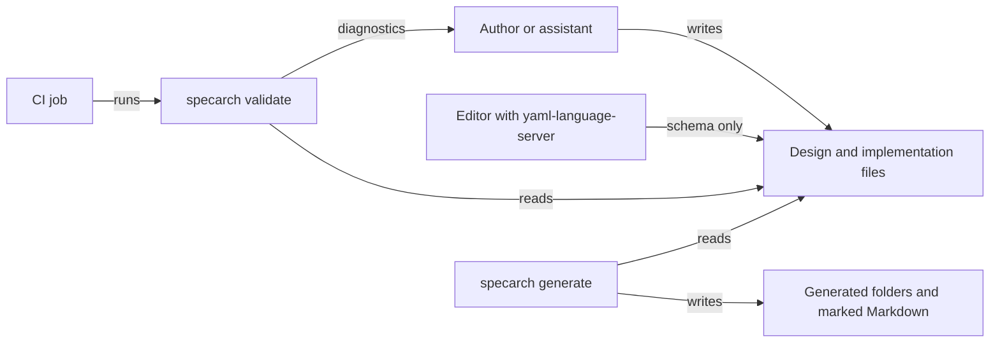
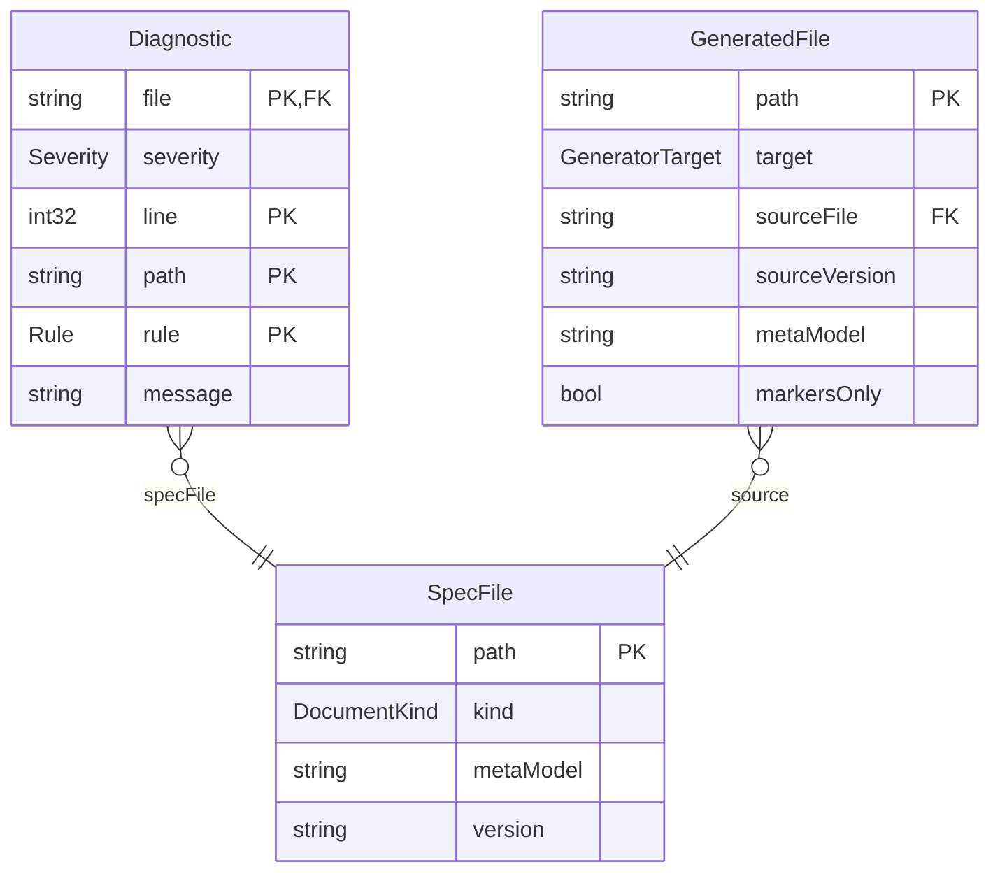
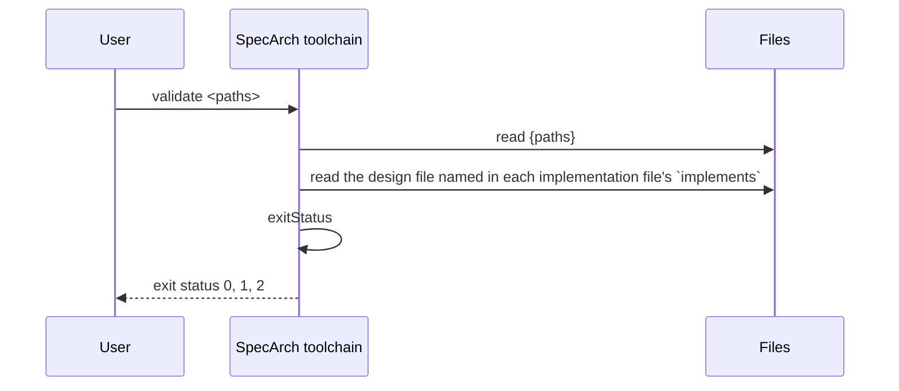

# SpecArch toolchain

Explanation for `specarch.specarch-design.yaml`, the design of the `specarch`
command. The Go implementation is described in
`specarch.go.specarch-implementation.yaml`. The sections follow `docs/conventions.md`;
the regions between `specarch:generate` markers are written by
`specarch generate techspec` from the YAML: edit the YAML, not the regions.
The full technical specification is `docs/techspec/specarch.techspec.md`.

This is SpecArch's own specification, written before the code as the first
rule asks. It lives in `spec/` because that is where `docs/conventions.md`
puts a project's specification: it describes this repository's real program,
not an example.

## 1. Introduction and goals

`specarch` checks SpecArch files and, from roadmap step 2 on, generates
documents and code from them. Its users are the people and assistants who
write specifications, and the CI jobs that keep a specification and its code
equal.

Quality goals, in order: no file with a known problem passes; every problem
names the file, the line, the YAML path and the rule; one run reports every
problem; the program installs with one command and needs no network.

## 2. Constraints

The JSON Schemas in `schema/` are the definition of each file's shape and are
applied unchanged (ADR-003). Meta-model 0.1 has no references between
design files, so each design file is checked on its own; an
implementation file is checked together with the one design file it
names.

## 3. Context

Hand-drawn.

## 4. Solution strategy

Two kinds of file: the design file holds the design, an implementation file
holds one stack's choices (ADR-001), split at the interface boundary of
ADR-002. The validator applies the schema first, then the checks a schema
cannot make (ADR-003). Expressions are a small subset of CEL and numbers are exact
(ADR-004). Every problem is reported, one line each (ADR-005). The command
line is described with `commands`, added to 0.1 for this file (ADR-006).

## 5. Building blocks

<!-- specarch:generate erDiagram -->

<!-- specarch:end -->

None of the three is stored. They are the values the commands pass around and
print; the meta-model has no word yet for a value without storage, so they
are written as entities with the key that makes each one unique.

The validator runs these checks on a design file, in this order, and
reports all of them:

1. YAML: well-formed, no repeated key, no unquoted date.
2. Schema: the JSON Schema of the meta-model version the file declares.
3. Interface boundary: no stack-specific extension key. No change-log
   wording in descriptions (a warning).
4. Cross-references: `$ref`, relation targets and `via`, primary keys,
   required fields, unique fields, `stateField` and transition states and
   triggers, page entities, columns, fields, filters, sources, submits and
   actions, `emits`, `algorithm`, `supersededBy`, `valueDescriptions`, path
   parameters, duplicate operationIds, requirement prefixes.
5. Concrete integers: an int64 or uint64 sent as a JSON number stays
   inside 2^53.
6. Fail-closed access (`permissionGranted`).
7. Expressions: every check and formula parsed as CEL, held to the subset,
   and type-checked with CEL's strict rules.
8. Worked examples: inputs and expected values typed, formula evaluated
   with exact decimals (`workedExampleHolds`).
9. Tests: every test's subject and cases exist; every case the design
   implies has a test (warnings in 0.1).

On an implementation file: YAML, schema, no design keyword, `implements`
names a readable design file of the same `info.version`, every pointer in
`layout` and `mappings` resolves in it, no decision ID is used in both, and
every test suite names design tests that exist.

## 6. Runtime view

<!-- specarch:generate sequenceDiagram validate -->

<!-- specarch:end -->

## 7. Deployment

A single program on the user's machine or a CI runner. The implementation
file says how it is built.

## 8. Cross-cutting concepts

<!-- specarch:generate permissions -->
| Permission | public |
|---|---|
| public | everyone |
<!-- specarch:end -->

The program has no roles: anyone who has it may run it, and it touches only
the files it is given and the folder a generator owns.

Diagnostics: `file:line: severity: /yaml/path: rule: message`, for example

    examples/x.specarch-design.yaml:58: error: /entities/Member/relations/loans/target: relation_target: Lone is not an entity of this file; did you mean Loan?

Numbers in expressions have CEL's types plus decimal. Int, uint and decimal
arithmetic is exact; a formula's decimal result may not have more places
than its output's scale, so any rounding is written in the formula.

## 9. Architecture decisions

- ADR-001, accepted: two kinds of file, design and implementation.
- ADR-002, accepted: the interface boundary between the two kinds.
- ADR-003, accepted: the validator applies the published JSON Schema first,
  then its own rules.
- ADR-004, accepted: expressions are a small subset of CEL, with exact
  decimal arithmetic.
- ADR-005, accepted: report every problem, one line each, with a stable rule
  name.
- ADR-006, accepted: commands are part of meta-model 0.1.
- ADR-007, accepted: file names say which kind of file they are.
- ADR-008, accepted: the Low IQ Tax principle governs the language and its
  tools.
- ADR-009, accepted: types are concrete, and the design says how they
  travel.

The implementation's own decisions (language, libraries, parser) are in the
implementation file.

## 10. Quality requirements

- A file with a misspelt relation target fails with one line naming the
  file, the line of `target`, the path and `relation_target`.
- A worked example whose expected value is off by a cent fails.
- The library-lending example and this specification pass.

## 11. Risks and technical debt

Of the generator targets, techspec is built; the others are designed by
name only and return status 2 until they are.

The entities here are values, not stored records; a value-object concept is a
0.2 candidate. The formulas of `referenceResolves` and `permissionGranted`
work on counts, because the expression language has no sets or lists of
objects; the pseudocode carries the rest. Marker rewriting and file headers
are string work the expression language cannot state, so they are specified by
pseudocode and the generator's own tests.

## 12. Glossary

- **SDF**: SpecArch Definition File, the design.
- **SIF**: SpecArch Implementation File, one stack's implementation of an SDF.
- **Diagnostic**: one problem in one file, printed as one line.
- **Target**: what a generator produces, such as `techspec` or `openapi`.

## 13. Requirements

| ID | Requirement |
|---|---|
| SA-1 | `specarch validate` checks every given file against the JSON Schema of its kind and meta-model version. |
| SA-2 | Every reference inside a design file resolves to an object of the right kind in the same file. |
| SA-3 | Every check constraint and formula parses and type-checks in the fixed expression language. |
| SA-4 | Every worked example's formula, evaluated on its inputs, gives its expected value. |
| SA-5 | Access is fail-closed: every permission used is declared, and every declared permission is granted by a role or is `public`. |
| SA-6 | Every problem is reported, one line each, with file, line, YAML path and rule; status 0 valid, 1 invalid, 2 usage or read error. |
| SA-7 | `specarch generate <target>` writes only into the target's folder, and `--check` fails when the committed output differs. |
| SA-8 | Every generated file names its source file, version and meta-model; a hand-written Markdown document changes only between markers. |
| SA-9 | Design and implementation are separate files; a design file holds no stack-specific key and an implementation adds no design. |
| SA-10 | An implementation file's `implements` and pointers resolve in its design file of the same version. |
