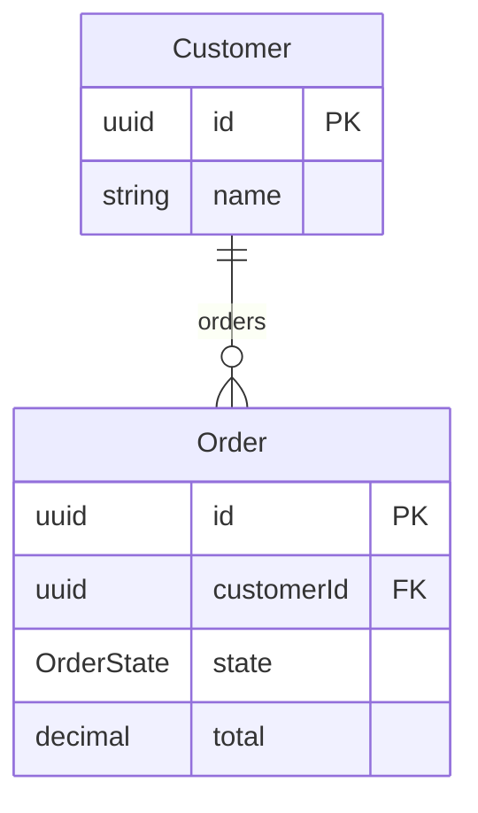
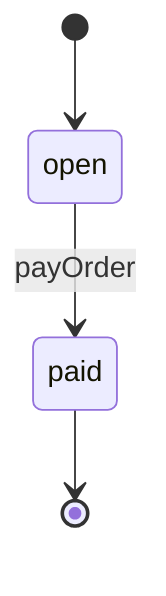
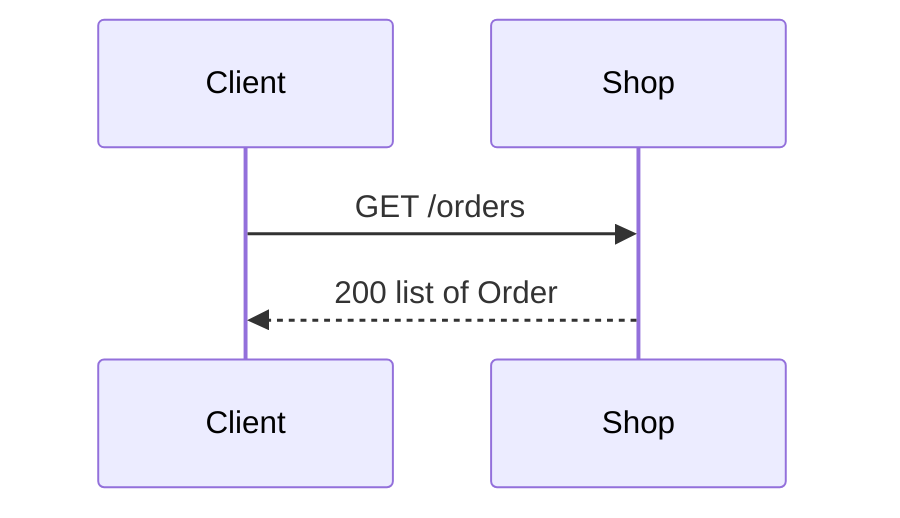
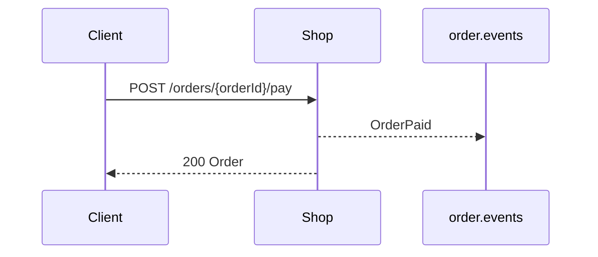
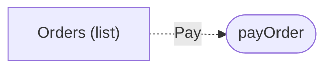

<!-- Generated by specarch document techspec from ../project/specarch.yaml, version 1.0.0, and ../project/shop.go.specarch-implementation.yaml, version 1.0.0; meta-model 0.1. Do not edit this file: change the YAML and generate again. -->

# Shop: technical specification

Version 1.0.0 of the specification: 1 requirement, 2 entities, 2 HTTP operations, 1 channel and 1 page. The chapters follow arc42, and a chapter with nothing in the specification is left out.

## 1. Introduction and goals

A small shop that takes orders and payments.

## 3. Context

The interfaces the system offers, as its clients see them.

### HTTP operations

| Method and path | Operation | Summary | Permission |
|---|---|---|---|
| GET /orders | listOrders | List orders | public |
| POST /orders/{orderId}/pay | payOrder | Take payment for an order | orders.pay |

### Channels

| Channel | Message | Summary |
|---|---|---|
| order.events | OrderPaid | An order was paid. |

## 5. Building blocks

### Customer

| Field | Type | Required | Limits | Description |
|---|---|---|---|---|
| id | uuid | yes | set by the system |   |
| name | string | yes | at least 1 character, at most 80 characters |   |

Primary key: id.

| Relation | Kind | Target | Via | On delete |
|---|---|---|---|---|
| orders | one-to-many | Order | customerId | restrict |

### Order

| Field | Type | Required | Limits | Description |
|---|---|---|---|---|
| id | uuid | yes | set by the system |   |
| customerId | uuid | yes |   |   |
| state | OrderState | yes |   |   |
| total | decimal(10, 2) | yes |   |   |

Primary key: id.

| Relation | Kind | Target | Via | On delete |
|---|---|---|---|---|
| customer | many-to-one | Customer | customerId | restrict |

### Enums

| Enum | Value | Meaning |
|---|---|---|
| OrderState | open | Being filled. |
| OrderState | paid | Paid in full. |

## 6. Runtime view

### States of Order

### listOrders (GET /orders)

### payOrder (POST /orders/{orderId}/pay)

## 7. Deployment and implementation

### Implementation: Shop in Go

From the implementation file version 1.0.0.

Stack: language Go 1.26.

#### Libraries

| Library | Version | Licence | Purpose |
|---|---|---|---|
| github.com/go-chi/chi/v5 | v5.3.2 | MIT | HTTP router. |

#### Targets

| Target | Output folder | Settings |
|---|---|---|
| techspec | ../docs |   |

## 8. Cross-cutting concepts

### Permissions

Access is fail-closed: every operation, command and page names the one permission it needs, and only the roles below grant one.

| Permission | clerk | public |
|---|---|---|
| orders.pay | yes | |
| public | | everyone |

### Pages

| Page | Kind | Route | Entity | Permission | Shows |
|---|---|---|---|---|---|
| orders-list | list | /orders | Order | public | customerId, state, total |

## 13. Requirements

### Requirements

| Requirement | Statement | Kind | Priority | Status | Verification | Acceptance | Needs |
|---|---|---|---|---|---|---|---|
| SHOP-1 | A clerk shall be able to take payment for an open order, after which the order is paid. | functional | must | accepted |   | Paying an open order makes it paid and publishes OrderPaid. |   |

### Traceability

What satisfies and what verifies each requirement. An empty cell is a gap.

| Requirement | Satisfied by | Verified by |
|---|---|---|
| SHOP-1 | entities Order |   |

