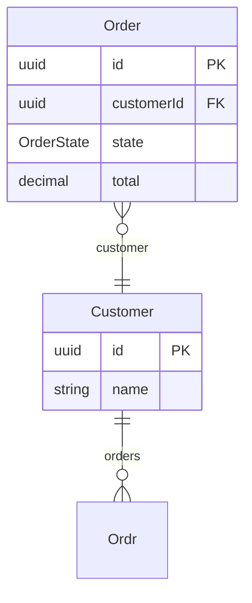
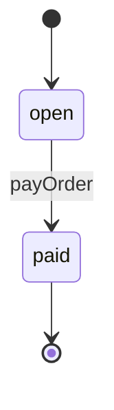
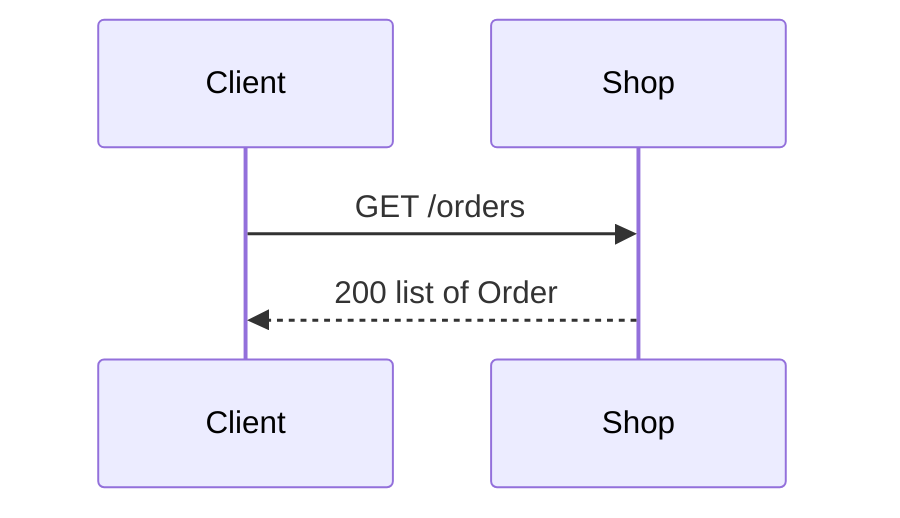
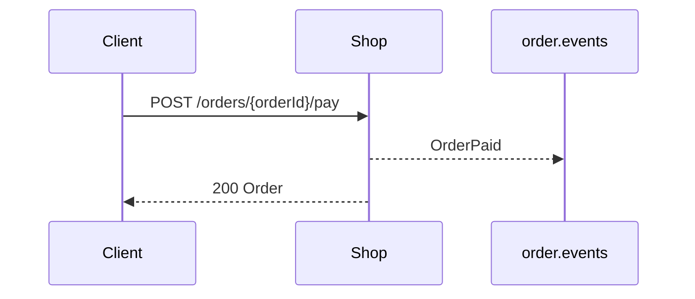
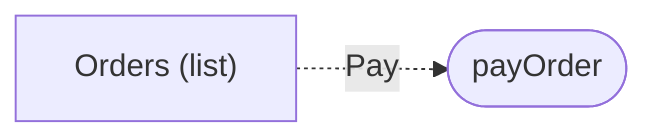

<!-- Generated by specarch document techspec from ../project/specarch.yaml, version 1.0.0; meta-model 0.1. Do not edit this file: change the YAML and generate again. -->

# Shop: technical specification

Version 1.0.0 of the specification: 1 requirement, 2 entities, 2 HTTP operations, 1 channel and 1 page. The chapters follow arc42, and a chapter with nothing in the specification is left out.

**Problems:** The specification has 1 error, so it is invalid, and this document shows what could be read of it. 1 error and 11 warnings concern this document; each is marked by a Problem paragraph at its element, or below when the document shows no element for it. The problems file lists every problem, and specarch validate prints them.

## 1. Introduction and goals

A small shop that takes orders and payments.

## 3. Context

The interfaces the system offers, as its clients see them.

### HTTP operations

| Method and path | Operation | Summary | Permission |
|---|---|---|---|
| GET /orders | listOrders | List orders | public |
| POST /orders/{orderId}/pay | payOrder | Take payment for an order | orders.pay |

### Channels

| Channel | Message | Summary |
|---|---|---|
| order.events | OrderPaid | An order was paid. |

## 5. Building blocks

### Customer

| Field | Type | Required | Limits | Description |
|---|---|---|---|---|
| id | uuid | yes | set by the system |   |
| name | string | yes | at least 1 character, at most 80 characters |   |

Primary key: id.

| Relation | Kind | Target | Via | On delete |
|---|---|---|---|---|
| orders | one-to-many | Ordr | customerId | restrict |

**Problem on orders:** error: relation_target: Ordr is not an entity of the specification; did you mean Order? [relation_target@specarch.yaml#/entities/Customer/relations/orders/target]

### Order

| Field | Type | Required | Limits | Description |
|---|---|---|---|---|
| id | uuid | yes | set by the system |   |
| customerId | uuid | yes |   |   |
| state | OrderState | yes |   |   |
| total | decimal(10, 2) | yes |   |   |

Primary key: id.

| Relation | Kind | Target | Via | On delete |
|---|---|---|---|---|
| customer | many-to-one | Customer | customerId | restrict |

### Enums

| Enum | Value | Meaning |
|---|---|---|
| OrderState | open | Being filled. |
| OrderState | paid | Paid in full. |

## 6. Runtime view

### States of Order

**Problem on open to paid:** warning: test_case_missing: Order transition open to paid has no red scenario for "from wrong state"; add under tests order-open-to-paid-from-wrong-state: { entity: Order, transition: { from: open, to: paid }, scenario: red, covers: [from wrong state], given: "the Order is not open", when: "payOrder happens", then: "it is refused and the state stays as it was" } [test_case_missing@specarch.yaml#/entities/Order/transitions/0]

**Problem on open to paid:** warning: test_golden_missing: Order transition open to paid has no golden scenario; add one under tests, for example order-open-to-paid-succeeds: { entity: Order, transition: { from: open, to: paid }, scenario: golden, given: "the Order is open", when: "payOrder happens", then: "the Order is paid" } [test_golden_missing@specarch.yaml#/entities/Order/transitions/0]

### listOrders (GET /orders)

**Problem:** warning: test_golden_missing: operation listOrders has no golden scenario; add one under tests, for example list-orders-succeeds: { operation: listOrders, scenario: golden, given: "any caller", when: "listOrders is called", then: "it answers 200: The orders." } [test_golden_missing@specarch.yaml#/paths/~1orders/get]

**Problem:** warning: test_red_missing: operation listOrders has no red scenario; add one under tests, for example list-orders-refused: { operation: listOrders, scenario: red, given: "...", when: "...", then: "it is refused" } [test_red_missing@specarch.yaml#/paths/~1orders/get]

### payOrder (POST /orders/{orderId}/pay)

**Problem:** warning: test_case_missing: operation payOrder has no red scenario for "denied without orders.pay"; add under tests pay-order-denied-without-orders-pay: { operation: payOrder, scenario: red, covers: [denied without orders.pay], given: "a caller without orders.pay", when: "payOrder is called", then: "it is refused as not allowed" } [test_case_missing.39c2edab@specarch.yaml#/paths/~1orders~1{orderId}~1pay/post]

**Problem:** warning: test_case_missing: operation payOrder has no red scenario for "dependency fails order.events"; add under tests pay-order-dependency-fails-order-events: { operation: payOrder, scenario: red, covers: [dependency fails order.events], given: "order.events cannot take the message", when: "payOrder is called", then: "..." } [test_case_missing.3edfbfee@specarch.yaml#/paths/~1orders~1{orderId}~1pay/post]

**Problem:** warning: test_case_missing: operation payOrder has no red scenario for "not found orderId"; add under tests pay-order-not-found-order-id: { operation: payOrder, scenario: red, covers: [not found orderId], given: "no record has that orderId", when: "payOrder is called with that orderId", then: "it is refused as not found" } [test_case_missing.bde49e72@specarch.yaml#/paths/~1orders~1{orderId}~1pay/post]

**Problem:** warning: test_case_missing: operation payOrder has no red scenario for "orderId not a valid uuid"; add under tests pay-order-order-id-not-a-valid-uuid: { operation: payOrder, scenario: red, covers: [orderId not a valid uuid], given: "...", when: "payOrder is called with orderId that is not a valid uuid", then: "it is refused" } [test_case_missing.a9006714@specarch.yaml#/paths/~1orders~1{orderId}~1pay/post]

**Problem:** warning: test_golden_missing: operation payOrder has no golden scenario; add one under tests, for example pay-order-succeeds: { operation: payOrder, scenario: golden, given: "a caller with orders.pay", when: "payOrder is called with values inside every limit", then: "it answers 200: The paid order." } [test_golden_missing@specarch.yaml#/paths/~1orders~1{orderId}~1pay/post]

## 8. Cross-cutting concepts

### Permissions

Access is fail-closed: every operation, command and page names the one permission it needs, and only the roles below grant one.

| Permission | clerk | public |
|---|---|---|
| orders.pay | yes | |
| public | | everyone |

### Pages

| Page | Kind | Route | Entity | Permission | Shows |
|---|---|---|---|---|---|
| orders-list | list | /orders | Order | public | customerId, state, total |

**Problem on orders-list:** warning: test_golden_missing: page orders-list has no golden scenario; add one under tests, for example orders-list-succeeds: { page: orders-list, scenario: golden, given: "any caller", when: "the page orders-list is opened", then: "it shows the page" } [test_golden_missing@specarch.yaml#/pages/orders-list]

**Problem on orders-list:** warning: test_red_missing: page orders-list has no red scenario; add one under tests, for example orders-list-refused: { page: orders-list, scenario: red, given: "...", when: "...", then: "it is refused" } [test_red_missing@specarch.yaml#/pages/orders-list]

## 13. Requirements

### Requirements

| Requirement | Statement | Kind | Priority | Status | Verification | Acceptance | Needs |
|---|---|---|---|---|---|---|---|
| SHOP-1 | A clerk shall be able to take payment for an open order, after which the order is paid. | functional | must | accepted |   | Paying an open order makes it paid and publishes OrderPaid. |   |

### Traceability

What satisfies and what verifies each requirement. An empty cell is a gap.

| Requirement | Satisfied by | Verified by |
|---|---|---|
| SHOP-1 | entities Order |   |

