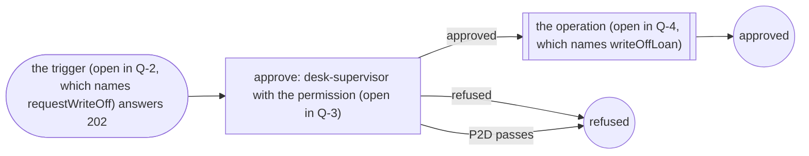

<!-- Generated by specarch document techspec from ../project/specarch.yaml, version 0.1.0; meta-model 0.1. Do not edit this file: change the YAML and generate again. -->

# Workflows of examples/lending-desk/sources/workflows/write-off.bpmn: technical specification

Version 0.1.0 of the specification: 1 workflow. The chapters follow arc42, and a chapter with nothing in the specification is left out.

**Draft:** 6 open questions concern this document (Q-1, Q-2, Q-3, Q-4, Q-5, Q-6); see the open questions document, or run specarch gaps.

## 1. Introduction and goals

The workflows the BPMN 2.0 file examples/lending-desk/sources/workflows/write-off.bpmn defines at commit cc6535461d6b180ff5b7a0b5bbcd7891771f6b50, in the sequential subset the meta-model holds: approvals, operation steps and deadlines. Every workflow cites the file; what it does not say, or says outside the subset, is a question.

### Stakeholders

| Stakeholder | Who they are | Concerns |
|---|---|---|
| system-owner | Whoever owns the system that was read and answers for it; the reviewer replaces this with the real role. |   |

**Origin on system-owner:** inferred.

**Insight on system-owner:** The surface names no one, and every question needs a stakeholder to decide it.

## 6. Runtime view

### Workflow write-off

A lost book's loan is written off only after a desk supervisor approves, within two days.

**Origin:** stated in The code repository, clause examples/lending-desk/sources/workflows/write-off.bpmn.

**Open question Q-1 (must, decision):** Which entity holds the request of workflow write-off while it waits? Decided by system-owner.

**Open question Q-2 (must, decision):** Workflow write-off is started by operation requestWriteOff, which the BPMN file names on its start event; the file does not declare it, so it waits for the tree that does. Is it that operation? Decided by system-owner.

**Open question Q-3 (must, decision):** Which permission does step approve of workflow write-off check? It cannot be the permission of the operation that starts the workflow. Decided by system-owner.

**Open question Q-4 (must, decision):** Step writeOff of workflow write-off calls operation writeOffLoan, which the BPMN file names on its service task; the file does not declare it, so it waits for the tree that does. Is it that operation? Decided by system-owner.

**Note:** From The code repository, cc6535461d6b180ff5b7a0b5bbcd7891771f6b50, clause examples/lending-desk/sources/workflows/write-off.bpmn: Line 16: Process write-off defines the workflow, with the tasks approve and writeOffStep in that order. <https://example.invalid/lending-desk.git>

Starts when the trigger (open in Q-2, which names requestWriteOff) accepts a request and answers 202; the request waits as the subject (open in Q-1). It is approved at approve (the permission (open in Q-3), within P2D) and a refusal ends it. The person who made the request never approves it.

## Sources

Every source a Note in this document cites.

| Source | Title | Edition | Author | Where to read it |
|---|---|---|---|---|
| code | The code repository | cc6535461d6b180ff5b7a0b5bbcd7891771f6b50 |   | https://example.invalid/lending-desk.git |

