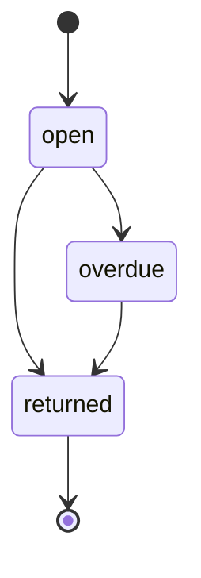

<!-- Generated by specarch document testplan from ../project/specarch.yaml, version 1.0.0, and ../project/implementation/go/case.go.specarch-implementation.yaml, version 1.0.0; meta-model 0.1. Do not edit this file: change the YAML and generate again. -->

# Case: test plan

Version 1.0.0 of the specification: 2 design tests, 2 golden and 0 red, about 2 subjects. Golden tests show a path that succeeds, red tests a path that is refused. The test cases follow the test case specification of ISO/IEC/IEEE 29119-3.

## 1. Levels and how the tests run

| Level | Design tests |
|---|---|
| acceptance | 1 |
| system | 1 |

System and acceptance tests are design tests, written in the specification and run by every implementation. Unit and integration tests belong to one implementation and are listed with it below.

## 2. Test cases

### Requirement LOAN-1

#### loan-overdue-accepted

Scenario: golden; level: acceptance; covers acceptance 1; verifies LOAN-1.

- Given: a loan due yesterday
- When: the nightly check runs
- Then: A loan past its due date is overdue the next day.

### Loan state machine

#### loan-overdue-then-returned

Scenario: golden; level: system; covers open to overdue to returned; verifies LOAN-1.

- Given: a Loan that is open
- When: it becomes overdue, then it is returned
- Then: the Loan ends returned, having been open and overdue

## 3. State machines

Each entity with a state field is a state machine. A path runs from a state no move reaches to one no move leaves; a test about the entity alone walks one, and names it under covers. A path with no test is listed under the derived cases left out, or warned about when it moves through a transition that satisfies a requirement with a harm.

### States of Loan

| Path | Tests |
|---|---|
| open to overdue to returned | loan-overdue-then-returned |
| open to returned |   |

## 4. Derived cases left out

1 case the design implies has no test and is not written by default: none is about a subject that satisfies a requirement with a harm, none is a failing dependency, and none is a mistake users make often. Writing a test that covers one removes it from this list.

| Subject | Case | Scenario | Why it is left out |
|---|---|---|---|
| Loan state machine | open to returned | golden | no transition on the path satisfies a requirement with a harm |

